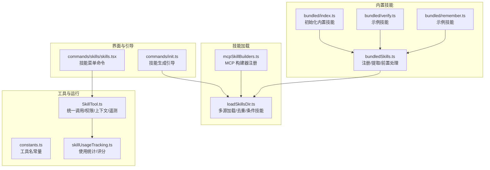
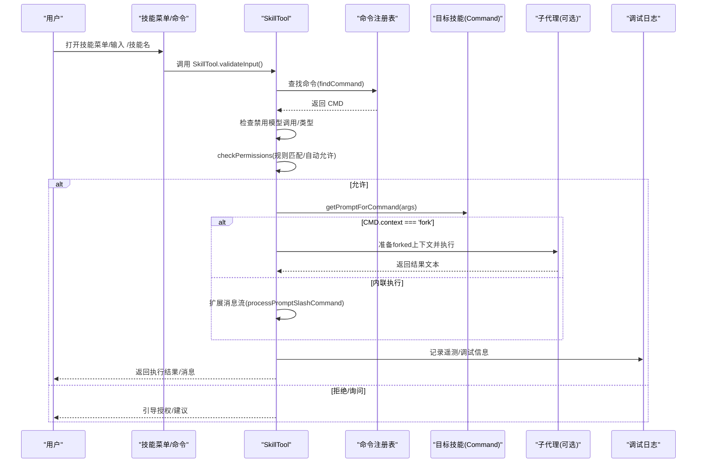
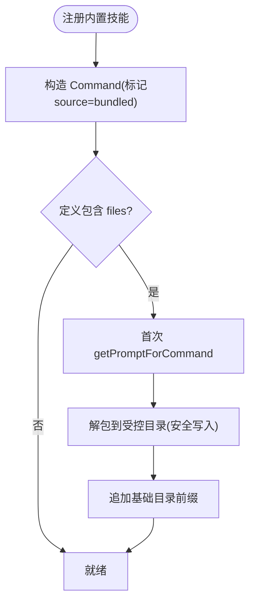
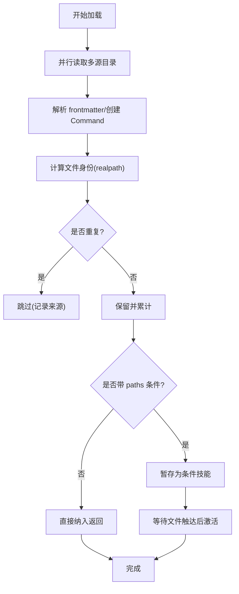
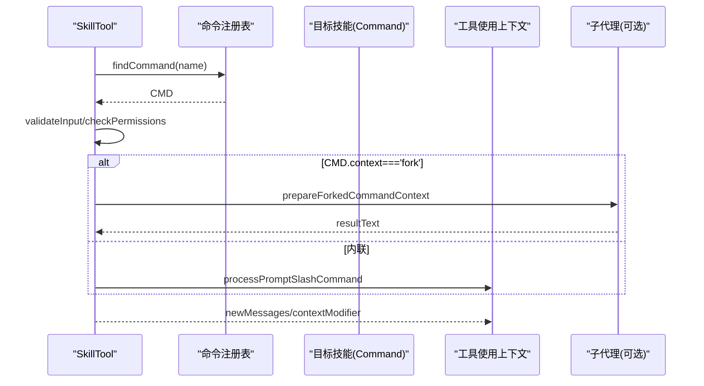
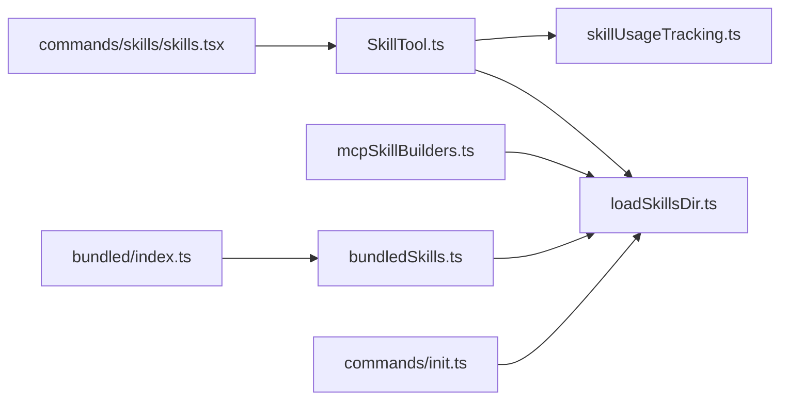

# 技能系统

<cite>
**本文引用的文件**
- [skills/bundledSkills.ts](file://skills/bundledSkills.ts)
- [skills/loadSkillsDir.ts](file://skills/loadSkillsDir.ts)
- [skills/mcpSkillBuilders.ts](file://skills/mcpSkillBuilders.ts)
- [skills/bundled/index.ts](file://skills/bundled/index.ts)
- [skills/bundled/verify.ts](file://skills/bundled/verify.ts)
- [skills/bundled/remember.ts](file://skills/bundled/remember.ts)
- [tools/SkillTool/SkillTool.ts](file://tools/SkillTool/SkillTool.ts)
- [tools/SkillTool/constants.ts](file://tools/SkillTool/constants.ts)
- [utils/suggestions/skillUsageTracking.ts](file://utils/suggestions/skillUsageTracking.ts)
- [utils/debug.ts](file://utils/debug.ts)
- [commands/skills/skills.tsx](file://commands/skills/skills.tsx)
- [commands/init.ts](file://commands/init.ts)
</cite>

## 目录
1. [简介](#简介)
2. [项目结构](#项目结构)
3. [核心组件](#核心组件)
4. [架构总览](#架构总览)
5. [详细组件分析](#详细组件分析)
6. [依赖关系分析](#依赖关系分析)
7. [性能考量](#性能考量)
8. [故障排查指南](#故障排查指南)
9. [结论](#结论)
10. [附录](#附录)

## 简介
本文件系统性阐述 Claude Code 的“技能”（Skill）体系：概念、分类、应用场景、内置技能组织与加载机制、开发流程、与工具系统的集成、生命周期与缓存、性能优化、测试与调试方法，以及典型使用场景与最佳实践。技能是面向任务的可复用提示模板，支持本地/策略/插件/MCP 等来源，并可通过统一的 Skill 工具调用。

## 项目结构
技能系统主要由以下模块构成：
- 内置技能注册与打包：负责将内置技能注册为命令对象，支持首次调用时解包参考文件到安全目录。
- 技能加载器：从用户/策略/项目/附加目录等多源加载技能，解析 frontmatter，去重与条件技能管理。
- MCP 技能构建器：在不形成循环依赖的前提下，向 MCP 发现流程暴露必要的构建函数。
- 技能工具（SkillTool）：统一入口，校验权限、执行上下文（内联或派生子代理）、记录遥测与使用统计。
- 使用统计与排名：基于使用频次与时间衰减计算技能评分，用于排序与建议。
- 调试与日志：集中式调试写入，便于定位加载与执行问题。
- UI 命令：提供技能菜单入口，便于浏览与选择。

**图表来源**
- [skills/bundled/index.ts:24-80](file://skills/bundled/index.ts#L24-L80)
- [skills/bundledSkills.ts:53-108](file://skills/bundledSkills.ts#L53-L108)
- [skills/loadSkillsDir.ts:638-800](file://skills/loadSkillsDir.ts#L638-L800)
- [skills/mcpSkillBuilders.ts:33-44](file://skills/mcpSkillBuilders.ts#L33-L44)
- [tools/SkillTool/SkillTool.ts:331-841](file://tools/SkillTool/SkillTool.ts#L331-L841)
- [tools/SkillTool/constants.ts:1-1](file://tools/SkillTool/constants.ts#L1-L1)
- [utils/suggestions/skillUsageTracking.ts:1-55](file://utils/suggestions/skillUsageTracking.ts#L1-L55)
- [commands/skills/skills.tsx:1-8](file://commands/skills/skills.tsx#L1-L8)
- [commands/init.ts:156-171](file://commands/init.ts#L156-L171)

**章节来源**
- [skills/bundled/index.ts:24-80](file://skills/bundled/index.ts#L24-L80)
- [skills/bundledSkills.ts:53-108](file://skills/bundledSkills.ts#L53-L108)
- [skills/loadSkillsDir.ts:638-800](file://skills/loadSkillsDir.ts#L638-L800)
- [skills/mcpSkillBuilders.ts:33-44](file://skills/mcpSkillBuilders.ts#L33-L44)
- [tools/SkillTool/SkillTool.ts:331-841](file://tools/SkillTool/SkillTool.ts#L331-L841)
- [utils/suggestions/skillUsageTracking.ts:1-55](file://utils/suggestions/skillUsageTracking.ts#L1-L55)
- [commands/skills/skills.tsx:1-8](file://commands/skills/skills.tsx#L1-L8)
- [commands/init.ts:156-171](file://commands/init.ts#L156-L171)

## 核心组件
- 内置技能注册与包装
  - 定义 BundledSkillDefinition，支持描述、别名、工具白名单、模型覆盖、是否允许用户调用、启用条件、钩子、执行上下文、代理、首次调用时的参考文件注入等。
  - registerBundledSkill 将定义转换为 Command 并登记；若存在 files，则在首次调用时异步解包到受控目录，并在提示前添加“基础目录”前缀，使模型可按需读取/搜索这些文件。
- 技能加载器
  - 多源加载：策略设置、用户设置、项目设置、附加目录、遗留 commands 目录。
  - 解析 frontmatter：名称、描述、allowed-tools、arguments、when_to_use、model、disable-model-invocation、user-invocable、hooks、context、agent、effort、shell 等。
  - 去重：通过 realpath 去除符号链接与重复路径。
  - 条件技能：带 paths 的技能仅在匹配文件被触达时激活。
- MCP 技能构建器
  - 注册 createSkillCommand 与 parseSkillFrontmatterFields，供 MCP 发现流程使用，避免循环依赖。
- 技能工具（SkillTool）
  - 输入校验：名称合法性、存在性、类型限制、禁用模型调用检查。
  - 权限决策：规则匹配（精确/前缀:*, deny/allow），自动允许仅含安全属性的技能，否则弹窗询问并提供快速授权建议。
  - 执行：内联执行（直接扩展为消息流）或派生子代理（forked）执行；支持模型覆盖、努力级别覆盖、遥测字段丰富。
  - 结果映射：将 forked 结果转为工具结果块。
- 使用统计与评分
  - 记录使用次数与最近使用时间，按 7 天半衰期计算综合评分，用于排序与建议。
- 调试与日志
  - 集中写入调试日志，便于定位加载与执行问题。
- UI 命令与引导
  - 提供技能菜单命令，打开技能列表；初始化流程中可生成项目级技能模板。

**章节来源**
- [skills/bundledSkills.ts:15-108](file://skills/bundledSkills.ts#L15-L108)
- [skills/loadSkillsDir.ts:185-401](file://skills/loadSkillsDir.ts#L185-L401)
- [skills/mcpSkillBuilders.ts:26-44](file://skills/mcpSkillBuilders.ts#L26-L44)
- [tools/SkillTool/SkillTool.ts:354-841](file://tools/SkillTool/SkillTool.ts#L354-L841)
- [utils/suggestions/skillUsageTracking.ts:1-55](file://utils/suggestions/skillUsageTracking.ts#L1-L55)
- [utils/debug.ts:153-196](file://utils/debug.ts#L153-L196)
- [commands/skills/skills.tsx:1-8](file://commands/skills/skills.tsx#L1-L8)
- [commands/init.ts:156-171](file://commands/init.ts#L156-L171)

## 架构总览
技能系统以“命令即技能”的方式统一管理，SkillTool 作为唯一入口协调权限、执行上下文与遥测；内置技能通过注册表在启动时注入；多源加载器负责发现与解析；MCP 技能通过构建器桥接；使用统计驱动体验优化。

**图表来源**
- [tools/SkillTool/SkillTool.ts:354-841](file://tools/SkillTool/SkillTool.ts#L354-L841)
- [skills/loadSkillsDir.ts:638-800](file://skills/loadSkillsDir.ts#L638-L800)
- [utils/debug.ts:153-196](file://utils/debug.ts#L153-L196)

## 详细组件分析

### 组件一：内置技能注册与加载（bundledSkills.ts）
- 设计要点
  - 通过 registerBundledSkill 注册，内部将定义转换为 Command，标记来源为 bundled。
  - 若定义包含 files，首次 getPromptForCommand 会异步解包到受控目录（带安全写入与路径校验），并在提示前加“基础目录”前缀，确保模型可按需读取/搜索。
  - 支持禁用模型调用、用户可调用性、启用条件、钩子、执行上下文、代理等。
- 关键流程
  - 注册：构造 Command 并加入内存列表。
  - 首次调用：解包 files → 追加基础目录前缀 → 返回内容块。
  - 安全：严格路径规范化与校验，防止目录穿越；使用安全写入标志位与权限掩码。

**图表来源**
- [skills/bundledSkills.ts:53-108](file://skills/bundledSkills.ts#L53-L108)
- [skills/bundledSkills.ts:131-220](file://skills/bundledSkills.ts#L131-L220)

**章节来源**
- [skills/bundledSkills.ts:15-108](file://skills/bundledSkills.ts#L15-L108)
- [skills/bundledSkills.ts:131-220](file://skills/bundledSkills.ts#L131-L220)

### 组件二：技能加载与去重（loadSkillsDir.ts）
- 设计要点
  - 多源并行加载：策略设置、用户设置、项目设置、附加目录、遗留 commands。
  - 解析 frontmatter 字段，支持 arguments、when_to_use、model、disable-model-invocation、user-invocable、hooks、context、agent、effort、shell 等。
  - 去重：通过 realpath 对文件身份进行去重，避免符号链接与重复父目录导致的重复加载。
  - 条件技能：带 paths 的技能仅在匹配文件被触达时激活，减少无关技能干扰。
- 关键流程
  - 并行加载各源 → 合并 → 计算文件身份 → 去重 → 分类（条件/非条件）→ 记录条件技能待激活。

**图表来源**
- [skills/loadSkillsDir.ts:638-800](file://skills/loadSkillsDir.ts#L638-L800)

**章节来源**
- [skills/loadSkillsDir.ts:638-800](file://skills/loadSkillsDir.ts#L638-L800)

### 组件三：MCP 技能构建器（mcpSkillBuilders.ts）
- 设计要点
  - 以类型依赖的方式注册 createSkillCommand 与 parseSkillFrontmatterFields，避免循环依赖。
  - 在 loadSkillsDir 初始化时注册，供 MCP 发现流程使用。
- 关键流程
  - 注册：保存构建器引用。
  - 获取：未注册时报错，确保模块初始化顺序正确。

**章节来源**
- [skills/mcpSkillBuilders.ts:26-44](file://skills/mcpSkillBuilders.ts#L26-L44)

### 组件四：技能工具（SkillTool）
- 设计要点
  - 输入校验：名称合法性、存在性、类型限制、禁用模型调用检查。
  - 权限决策：规则匹配（精确/前缀:*, deny/allow），自动允许仅含安全属性的技能，否则弹窗询问并提供快速授权建议。
  - 执行：内联执行（直接扩展为消息流）或派生子代理（forked）执行；支持模型覆盖、努力级别覆盖、遥测字段丰富。
  - 结果映射：将 forked 结果转为工具结果块。
- 关键流程
  - 校验 → 权限 → 判断 forked 或内联 → 执行 → 记录遥测/调试 → 返回结果。

**图表来源**
- [tools/SkillTool/SkillTool.ts:354-841](file://tools/SkillTool/SkillTool.ts#L354-L841)

**章节来源**
- [tools/SkillTool/SkillTool.ts:354-841](file://tools/SkillTool/SkillTool.ts#L354-L841)
- [tools/SkillTool/constants.ts:1-1](file://tools/SkillTool/constants.ts#L1-L1)

### 组件五：使用统计与评分（skillUsageTracking.ts）
- 设计要点
  - 使用防抖缓存避免频繁写盘；记录使用次数与最近使用时间。
  - 评分采用 7 天半衰期指数衰减，最小保留因子保证老但高频技能不会完全降权。
- 关键流程
  - recordSkillUsage：更新计数与时间，按阈值写入全局配置。
  - getSkillUsageScore：计算综合评分。

**章节来源**
- [utils/suggestions/skillUsageTracking.ts:1-55](file://utils/suggestions/skillUsageTracking.ts#L1-L55)

### 组件六：调试与日志（debug.ts）
- 设计要点
  - 集中缓冲写入，支持同步与异步模式；在调试模式下立即落盘，非调试模式按秒级刷新。
  - 提供调试日志路径与符号链接维护，便于定位问题。
- 关键流程
  - 初始化写入器 → 写入内容 → 清理阶段释放资源。

**章节来源**
- [utils/debug.ts:153-196](file://utils/debug.ts#L153-L196)

### 组件七：UI 命令与引导（commands/skills/skills.tsx, commands/init.ts）
- 设计要点
  - 提供技能菜单命令，打开技能列表视图。
  - 初始化流程中可生成项目级技能模板，建议命名、目的与适用场景，并避免覆盖既有技能。

**章节来源**
- [commands/skills/skills.tsx:1-8](file://commands/skills/skills.tsx#L1-L8)
- [commands/init.ts:156-171](file://commands/init.ts#L156-L171)

## 依赖关系分析
- 内置技能依赖
  - bundled/index.ts 依赖 bundled/*.ts 中的注册函数，统一初始化。
  - bundledSkills.ts 依赖工具与权限辅助模块，提供安全解包与提示前缀。
- 加载器依赖
  - loadSkillsDir.ts 依赖 frontmatter 解析、路径解析、文件系统实现、环境变量与策略开关、去重与条件技能管理。
  - mcpSkillBuilders.ts 作为无副作用类型依赖，避免循环。
- 工具依赖
  - SkillTool.ts 依赖命令注册表、权限系统、遥测、forkedAgent、消息处理、模型解析、使用统计。
- UI 与引导
  - commands/skills/skills.tsx 依赖技能菜单组件；commands/init.ts 依赖技能生成引导逻辑。

**图表来源**
- [skills/bundled/index.ts:24-80](file://skills/bundled/index.ts#L24-L80)
- [skills/bundledSkills.ts:53-108](file://skills/bundledSkills.ts#L53-L108)
- [skills/loadSkillsDir.ts:638-800](file://skills/loadSkillsDir.ts#L638-L800)
- [skills/mcpSkillBuilders.ts:33-44](file://skills/mcpSkillBuilders.ts#L33-L44)
- [tools/SkillTool/SkillTool.ts:331-841](file://tools/SkillTool/SkillTool.ts#L331-L841)
- [utils/suggestions/skillUsageTracking.ts:1-55](file://utils/suggestions/skillUsageTracking.ts#L1-L55)
- [commands/skills/skills.tsx:1-8](file://commands/skills/skills.tsx#L1-L8)
- [commands/init.ts:156-171](file://commands/init.ts#L156-L171)

**章节来源**
- [skills/bundled/index.ts:24-80](file://skills/bundled/index.ts#L24-L80)
- [skills/bundledSkills.ts:53-108](file://skills/bundledSkills.ts#L53-L108)
- [skills/loadSkillsDir.ts:638-800](file://skills/loadSkillsDir.ts#L638-L800)
- [skills/mcpSkillBuilders.ts:33-44](file://skills/mcpSkillBuilders.ts#L33-L44)
- [tools/SkillTool/SkillTool.ts:331-841](file://tools/SkillTool/SkillTool.ts#L331-L841)
- [utils/suggestions/skillUsageTracking.ts:1-55](file://utils/suggestions/skillUsageTracking.ts#L1-L55)
- [commands/skills/skills.tsx:1-8](file://commands/skills/skills.tsx#L1-L8)
- [commands/init.ts:156-171](file://commands/init.ts#L156-L171)

## 性能考量
- 加载性能
  - 多源并行加载，减少总体等待时间；去重通过 realpath 并发计算，避免重复 IO。
  - 条件技能延迟激活，降低无关技能对上下文的影响。
- 执行性能
  - 内置技能首次解包采用进程内 Promise 缓存，避免并发竞态写入。
  - forked 执行隔离上下文，避免主会话资源争用。
- 存储与 I/O
  - 使用防抖写入全局配置，减少频繁磁盘写入。
  - 安全写入使用平台兼容标志与权限掩码，兼顾安全性与性能。
- 缓存与复用
  - 前面已提及的 memoize 与防抖缓存，减少重复计算与 I/O。

[本节为通用性能讨论，无需特定文件来源]

## 故障排查指南
- 加载失败
  - 检查调试日志，确认源目录是否存在、权限是否足够、文件是否损坏。
  - 关注去重日志，确认是否因符号链接或重复父目录导致的跳过。
- 权限拒绝
  - 检查本地设置中的 allow/deny 规则，必要时使用建议的快速授权规则。
- 执行异常
  - forked 执行失败时查看子代理输出与消息流；内联执行失败时检查 frontmatter 与参数替换。
- 安全告警
  - 若出现路径逃逸错误，检查 bundled files 的相对路径是否包含 “..”。

**章节来源**
- [utils/debug.ts:153-196](file://utils/debug.ts#L153-L196)
- [skills/loadSkillsDir.ts:638-800](file://skills/loadSkillsDir.ts#L638-L800)
- [skills/bundledSkills.ts:195-220](file://skills/bundledSkills.ts#L195-L220)
- [tools/SkillTool/SkillTool.ts:432-578](file://tools/SkillTool/SkillTool.ts#L432-L578)

## 结论
技能系统通过“命令即技能”的统一抽象，结合多源加载、权限控制、执行上下文切换与使用统计，实现了可扩展、可审计、可优化的智能体工作流能力。内置技能与外部来源（用户/策略/插件/MCP）协同工作，既保证了灵活性，也维持了安全性与一致性。

[本节为总结，无需特定文件来源]

## 附录

### 技能开发流程（从零到上线）
- 定义技能
  - 在项目 .claude/skills/<skill-name>/ 下创建 SKILL.md，编写目标、步骤、规则与 frontmatter（description、when_to_use、allowed-tools、model、disable-model-invocation、user-invocable、hooks、context、agent、effort、shell 等）。
- 参数配置
  - 使用 arguments/argument-hint 定义参数；通过 ${CLAUDE_SKILL_DIR}、${CLAUDE_SESSION_ID} 等占位符注入动态上下文。
- 执行逻辑
  - 内联：SkillTool 直接扩展为消息流；forked：在独立子代理中执行，适合长耗时或需要独立预算的任务。
- 集成工具系统
  - 通过 SkillTool 调用；若涉及工具使用，可在 allowed-tools 中声明；必要时使用 hooks 进行前后处理。
- 生命周期与缓存
  - 首次调用内置技能会解包 files；使用统计用于排序与建议；调试日志用于问题定位。
- 测试与调试
  - 使用调试模式观察加载与执行日志；通过权限规则验证边界；对 forked 场景单独验证结果文本与消息流。

**章节来源**
- [skills/loadSkillsDir.ts:185-401](file://skills/loadSkillsDir.ts#L185-L401)
- [tools/SkillTool/SkillTool.ts:354-841](file://tools/SkillTool/SkillTool.ts#L354-L841)
- [utils/debug.ts:153-196](file://utils/debug.ts#L153-L196)

### 应用实例与最佳实践
- 实例
  - verify：面向代码变更验证的内置技能，首次调用解包参考文件，便于模型按需读取。
  - remember：面向记忆层整理的内置技能，结合 auto-memory 与团队记忆，提供迁移/清理/冲突检测建议。
- 最佳实践
  - 将通用工作流沉淀为技能，避免在对话中重复编写提示。
  - 使用 when_to_use 明确触发时机，提升建议命中率。
  - 对长耗时任务优先考虑 forked 上下文，避免阻塞主会话。
  - 通过 allowed-tools 限定工具范围，配合权限规则实现最小授权。
  - 使用 effort 与 model 覆盖精细控制资源消耗与质量。
  - 利用使用统计优化常用技能的可见性与排序。

**章节来源**
- [skills/bundled/verify.ts:12-30](file://skills/bundled/verify.ts#L12-L30)
- [skills/bundled/remember.ts:6-82](file://skills/bundled/remember.ts#L6-L82)
- [utils/suggestions/skillUsageTracking.ts:1-55](file://utils/suggestions/skillUsageTracking.ts#L1-L55)