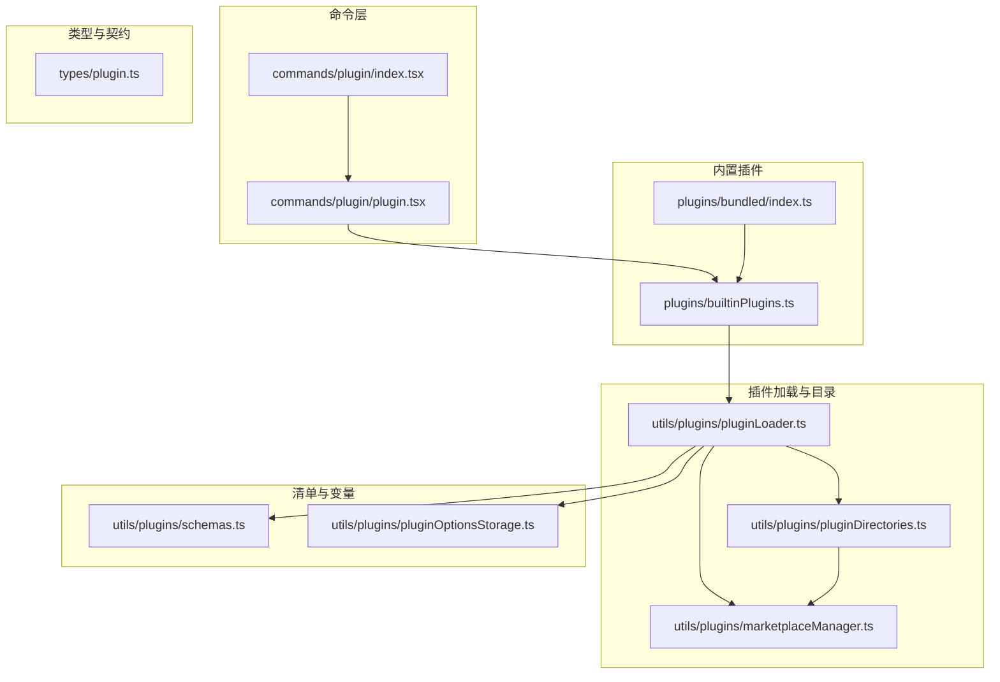
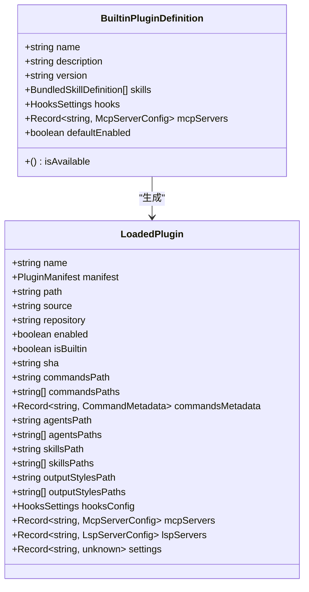
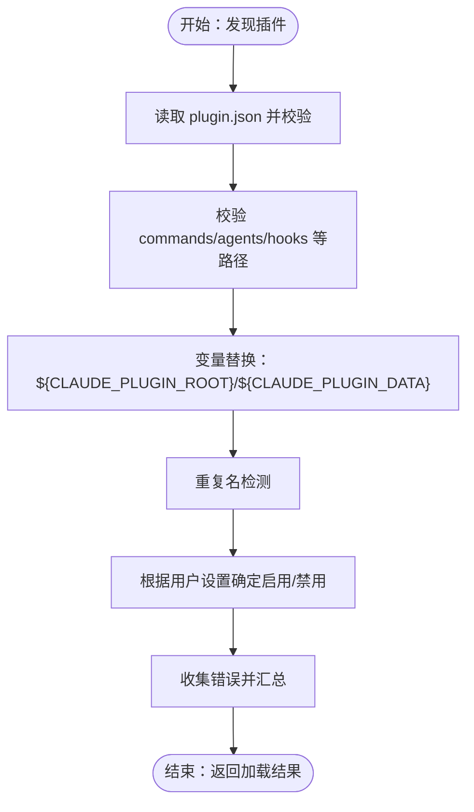
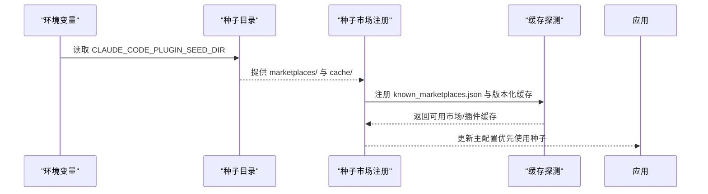
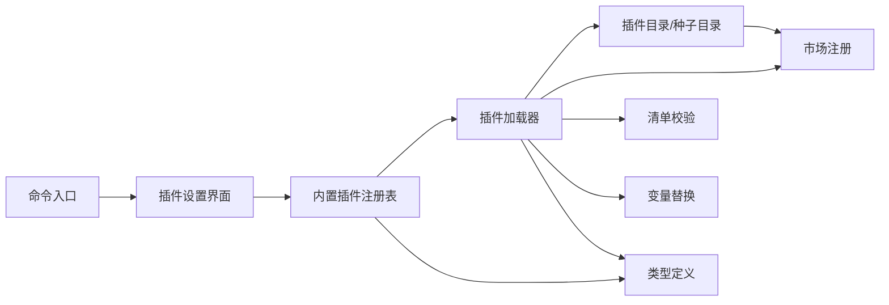

# 开发环境搭建

<cite>
**本文引用的文件**
- [README.md](file://README.md)
- [commands/plugin/index.tsx](file://commands/plugin/index.tsx)
- [commands/plugin/plugin.tsx](file://commands/plugin/plugin.tsx)
- [plugins/builtinPlugins.ts](file://plugins/builtinPlugins.ts)
- [plugins/bundled/index.ts](file://plugins/bundled/index.ts)
- [types/plugin.ts](file://types/plugin.ts)
- [utils/plugins/pluginLoader.ts](file://utils/plugins/pluginLoader.ts)
- [utils/plugins/pluginDirectories.ts](file://utils/plugins/pluginDirectories.ts)
- [utils/plugins/marketplaceManager.ts](file://utils/plugins/marketplaceManager.ts)
- [utils/plugins/schemas.ts](file://utils/plugins/schemas.ts)
- [utils/plugins/pluginOptionsStorage.ts](file://utils/plugins/pluginOptionsStorage.ts)
- [utils/plugins/dependencyResolver.ts](file://utils/plugins/dependencyResolver.ts)
- [utils/plugins/pluginStartupCheck.ts](file://utils/plugins/pluginStartupCheck.ts)
</cite>

## 目录
1. [简介](#简介)
2. [项目结构](#项目结构)
3. [核心组件](#核心组件)
4. [架构总览](#架构总览)
5. [详细组件分析](#详细组件分析)
6. [依赖分析](#依赖分析)
7. [性能考虑](#性能考虑)
8. [故障排除指南](#故障排除指南)
9. [结论](#结论)
10. [附录](#附录)

## 简介
本指南面向希望在 Claude Code 代码库基础上进行插件开发与本地调试的工程师，目标是帮助你快速完成开发环境搭建、理解插件目录结构与清单文件、掌握插件标识符格式与命名规范、正确配置种子目录（seed directories），以及完成开发环境验证与常见问题排查。文档内容严格基于仓库源码与命令实现，避免臆测。

## 项目结构
围绕插件系统的相关模块主要分布在以下路径：
- 命令入口：commands/plugin 下的 JSX 命令注册与 UI 入口
- 内置插件注册：plugins/builtinPlugins.ts 与 plugins/bundled/index.ts
- 类型与契约：types/plugin.ts
- 插件加载与缓存：utils/plugins/pluginLoader.ts
- 目录与种子目录：utils/plugins/pluginDirectories.ts
- 市场与种子注册：utils/plugins/marketplaceManager.ts
- 清单与校验：utils/plugins/schemas.ts
- 变量替换与数据目录：utils/plugins/pluginOptionsStorage.ts
- 依赖解析与安装：utils/plugins/dependencyResolver.ts、utils/plugins/pluginStartupCheck.ts



**图示来源**
- [commands/plugin/index.tsx:1-11](file://commands/plugin/index.tsx#L1-L11)
- [commands/plugin/plugin.tsx:1-7](file://commands/plugin/plugin.tsx#L1-L7)
- [plugins/builtinPlugins.ts:1-160](file://plugins/builtinPlugins.ts#L1-L160)
- [plugins/bundled/index.ts:1-24](file://plugins/bundled/index.ts#L1-L24)
- [types/plugin.ts:1-364](file://types/plugin.ts#L1-L364)
- [utils/plugins/pluginLoader.ts:1-200](file://utils/plugins/pluginLoader.ts#L1-L200)
- [utils/plugins/pluginDirectories.ts:1-179](file://utils/plugins/pluginDirectories.ts#L1-L179)
- [utils/plugins/marketplaceManager.ts:352-500](file://utils/plugins/marketplaceManager.ts#L352-L500)
- [utils/plugins/schemas.ts:1-200](file://utils/plugins/schemas.ts#L1-L200)
- [utils/plugins/pluginOptionsStorage.ts:312-344](file://utils/plugins/pluginOptionsStorage.ts#L312-L344)

**章节来源**
- [commands/plugin/index.tsx:1-11](file://commands/plugin/index.tsx#L1-L11)
- [commands/plugin/plugin.tsx:1-7](file://commands/plugin/plugin.tsx#L1-L7)
- [plugins/builtinPlugins.ts:1-160](file://plugins/builtinPlugins.ts#L1-L160)
- [plugins/bundled/index.ts:1-24](file://plugins/bundled/index.ts#L1-L24)
- [types/plugin.ts:1-364](file://types/plugin.ts#L1-L364)
- [utils/plugins/pluginLoader.ts:1-200](file://utils/plugins/pluginLoader.ts#L1-L200)
- [utils/plugins/pluginDirectories.ts:1-179](file://utils/plugins/pluginDirectories.ts#L1-L179)
- [utils/plugins/marketplaceManager.ts:352-500](file://utils/plugins/marketplaceManager.ts#L352-L500)
- [utils/plugins/schemas.ts:1-200](file://utils/plugins/schemas.ts#L1-L200)
- [utils/plugins/pluginOptionsStorage.ts:312-344](file://utils/plugins/pluginOptionsStorage.ts#L312-L344)

## 核心组件
- 命令入口与 UI：/plugin 命令负责打开插件设置界面，支持浏览市场、管理内置/已安装插件、配置选项等。
- 内置插件注册：内置插件通过注册表统一管理，支持启用/禁用、默认状态、可用性检查等。
- 加载器：负责从市场或种子目录发现、拉取、解压、校验与缓存插件；支持 ZIP 缓存、版本化缓存路径、种子命中探测等。
- 目录与种子：集中管理主插件目录、种子目录、数据目录、持久化变量替换等。
- 市场与种子注册：将种子中的市场与缓存条目注入到主配置中，确保管理员预置的插件可被识别。
- 清单与校验：对 plugin.json 进行结构与字段校验，限制官方市场名称、来源校验、MCPB 路径等。
- 依赖解析与安装：处理跨市场依赖、循环依赖检测、依赖未满足提示等。

**章节来源**
- [commands/plugin/index.tsx:1-11](file://commands/plugin/index.tsx#L1-L11)
- [commands/plugin/plugin.tsx:1-7](file://commands/plugin/plugin.tsx#L1-L7)
- [plugins/builtinPlugins.ts:1-160](file://plugins/builtinPlugins.ts#L1-L160)
- [utils/plugins/pluginLoader.ts:1-200](file://utils/plugins/pluginLoader.ts#L1-L200)
- [utils/plugins/pluginDirectories.ts:1-179](file://utils/plugins/pluginDirectories.ts#L1-L179)
- [utils/plugins/marketplaceManager.ts:352-500](file://utils/plugins/marketplaceManager.ts#L352-L500)
- [utils/plugins/schemas.ts:1-200](file://utils/plugins/schemas.ts#L1-L200)
- [utils/plugins/dependencyResolver.ts:106-142](file://utils/plugins/dependencyResolver.ts#L106-L142)
- [utils/plugins/pluginStartupCheck.ts:265-303](file://utils/plugins/pluginStartupCheck.ts#L265-L303)

## 架构总览
下图展示插件从“命令触发”到“加载执行”的端到端流程，涵盖内置插件、市场与种子目录、清单校验、变量替换与依赖解析等关键环节。

```mermaid
sequenceDiagram
participant U as "用户"
participant CLI as "/plugin 命令"
participant UI as "插件设置界面"
participant REG as "内置插件注册表"
participant LD as "插件加载器"
participant DIR as "插件目录/种子目录"
participant MKT as "市场/种子注册"
participant SCH as "清单校验"
participant OPT as "变量替换/数据目录"
U->>CLI : 触发 /plugin
CLI->>UI : 打开插件设置界面
UI->>REG : 查询内置插件列表
UI->>LD : 解析/加载插件
LD->>DIR : 计算缓存/数据目录
LD->>MKT : 注册种子市场/缓存
LD->>SCH : 校验 plugin.json
LD->>OPT : 替换 ${CLAUDE_PLUGIN_ROOT}/${CLAUDE_PLUGIN_DATA}
LD-->>UI : 返回已加载插件与错误集合
UI-->>U : 展示插件状态/配置/错误
```

**图示来源**
- [commands/plugin/index.tsx:1-11](file://commands/plugin/index.tsx#L1-L11)
- [commands/plugin/plugin.tsx:1-7](file://commands/plugin/plugin.tsx#L1-L7)
- [plugins/builtinPlugins.ts:1-160](file://plugins/builtinPlugins.ts#L1-L160)
- [utils/plugins/pluginLoader.ts:1-200](file://utils/plugins/pluginLoader.ts#L1-L200)
- [utils/plugins/pluginDirectories.ts:1-179](file://utils/plugins/pluginDirectories.ts#L1-L179)
- [utils/plugins/marketplaceManager.ts:352-500](file://utils/plugins/marketplaceManager.ts#L352-L500)
- [utils/plugins/schemas.ts:1-200](file://utils/plugins/schemas.ts#L1-L200)
- [utils/plugins/pluginOptionsStorage.ts:312-344](file://utils/plugins/pluginOptionsStorage.ts#L312-L344)

## 详细组件分析

### 命令入口与 UI
- 命令注册：/plugin 命令以本地 JSX 形式注册，立即加载插件设置 UI。
- UI 行为：插件设置界面支持内置插件开关、市场浏览、插件配置（含 MCPB 配置）、选项保存与重载生效等。

**章节来源**
- [commands/plugin/index.tsx:1-11](file://commands/plugin/index.tsx#L1-L11)
- [commands/plugin/plugin.tsx:1-7](file://commands/plugin/plugin.tsx#L1-L7)

### 内置插件注册与生命周期
- 注册表：内置插件通过注册函数集中登记，支持默认启用状态、可用性检查、按用户设置分组返回。
- 标识符：内置插件 ID 使用后缀 @builtin 的格式，便于与市场插件区分。
- 组件暴露：内置插件可提供技能、钩子、MCP 服务器等组件，UI 会据此渲染。



**图示来源**
- [types/plugin.ts:18-35](file://types/plugin.ts#L18-L35)
- [types/plugin.ts:48-70](file://types/plugin.ts#L48-L70)
- [plugins/builtinPlugins.ts:1-160](file://plugins/builtinPlugins.ts#L1-L160)

**章节来源**
- [plugins/builtinPlugins.ts:1-160](file://plugins/builtinPlugins.ts#L1-L160)
- [types/plugin.ts:1-364](file://types/plugin.ts#L1-L364)

### 插件目录结构与基本配置
- 目录结构：插件根目录可包含 plugin.json（清单）、commands/、agents/、hooks/ 等子目录。
- 清单文件：plugin.json 用于声明插件元数据（名称、版本、描述、作者、主页、仓库、许可证、关键词等），并可包含 settings 字段与组件路径映射。
- 加载器职责：解析清单、校验路径、变量替换、重复名检测、启用/禁用状态管理、错误收集与报告。



**图示来源**
- [utils/plugins/pluginLoader.ts:10-33](file://utils/plugins/pluginLoader.ts#L10-L33)
- [utils/plugins/schemas.ts:268-311](file://utils/plugins/schemas.ts#L268-L311)
- [utils/plugins/pluginOptionsStorage.ts:312-344](file://utils/plugins/pluginOptionsStorage.ts#L312-L344)

**章节来源**
- [utils/plugins/pluginLoader.ts:1-200](file://utils/plugins/pluginLoader.ts#L1-L200)
- [utils/plugins/schemas.ts:268-311](file://utils/plugins/schemas.ts#L268-L311)
- [utils/plugins/pluginOptionsStorage.ts:312-344](file://utils/plugins/pluginOptionsStorage.ts#L312-L344)

### 插件标识符格式与命名规范
- 格式：插件 ID 采用 name@marketplace 的形式；内置插件使用 name@builtin。
- 名称规范：清单中的 name 不得包含空格，建议使用 kebab-case（如 my-plugin）。
- 官方市场名称：保留名称仅限官方来源使用，且需来自特定组织或 URL 源，防止冒用与同形攻击。

**章节来源**
- [plugins/builtinPlugins.ts:12-14](file://plugins/builtinPlugins.ts#L12-L14)
- [utils/plugins/schemas.ts:274-285](file://utils/plugins/schemas.ts#L274-L285)
- [utils/plugins/schemas.ts:19-28](file://utils/plugins/schemas.ts#L19-L28)
- [utils/plugins/schemas.ts:71-101](file://utils/plugins/schemas.ts#L71-L101)

### 种子目录（seed directories）的作用与配置
- 作用：企业可将预置的插件市场与缓存放入只读种子目录，作为主插件目录的后备层，避免每次重新克隆，提升启动速度与一致性。
- 配置：通过环境变量指定种子目录（支持多目录分隔），加载器会按优先级探测种子中的市场与缓存。
- 注册：启动时将种子中的 known_marketplaces.json 与缓存注入主配置，使管理员预置的插件对用户可见且不可被覆盖。



**图示来源**
- [utils/plugins/pluginDirectories.ts:65-90](file://utils/plugins/pluginDirectories.ts#L65-L90)
- [utils/plugins/marketplaceManager.ts:380-488](file://utils/plugins/marketplaceManager.ts#L380-L488)

**章节来源**
- [utils/plugins/pluginDirectories.ts:65-90](file://utils/plugins/pluginDirectories.ts#L65-L90)
- [utils/plugins/marketplaceManager.ts:352-500](file://utils/plugins/marketplaceManager.ts#L352-L500)

### 开发工具链安装与配置
- 运行时：项目基于 Bun（bun:bundle 特性、包管理与打包），插件系统大量使用 Bun 的特性与生态。
- 构建与运行：建议使用与项目一致的 Bun 版本；若需要本地调试，可通过命令入口直接运行插件设置界面。
- 外部依赖：插件清单中可引用 MCPB 文件（.mcpb 或 .dxt），加载器支持本地相对路径与远程 URL。

**章节来源**
- [README.md:393-413](file://README.md#L393-L413)
- [utils/plugins/schemas.ts:173-188](file://utils/plugins/schemas.ts#L173-L188)

### 开发环境验证与故障排除
- 常见错误类型：加载失败、清单解析/校验失败、网络错误、MCP/LSP 配置无效、请求超时/崩溃、依赖未满足、种子/缓存缺失等。
- 错误消息：系统提供统一的错误类型与消息映射，便于定位问题。
- 排查建议：
  - 检查插件清单字段与路径是否符合 schema。
  - 确认种子目录与主目录权限与可访问性。
  - 查看依赖解析日志，确认跨市场依赖与循环依赖。
  - 使用重载命令刷新缓存与配置。

**章节来源**
- [types/plugin.ts:101-283](file://types/plugin.ts#L101-L283)
- [types/plugin.ts:295-363](file://types/plugin.ts#L295-L363)
- [utils/plugins/dependencyResolver.ts:106-142](file://utils/plugins/dependencyResolver.ts#L106-L142)
- [utils/plugins/pluginStartupCheck.ts:265-303](file://utils/plugins/pluginStartupCheck.ts#L265-L303)

## 依赖分析
- 组件耦合：命令层依赖 UI 与内置插件注册表；加载器依赖目录、市场注册、清单校验与变量替换；种子目录影响市场注册与缓存命中。
- 外部依赖：Bun 生态（bun:bundle、包管理）、zod（schema 校验）、Node FS API（文件系统操作）。
- 循环依赖：依赖解析模块显式检测循环依赖与跨市场自动安装限制，避免意外行为。



**图示来源**
- [commands/plugin/index.tsx:1-11](file://commands/plugin/index.tsx#L1-L11)
- [commands/plugin/plugin.tsx:1-7](file://commands/plugin/plugin.tsx#L1-L7)
- [plugins/builtinPlugins.ts:1-160](file://plugins/builtinPlugins.ts#L1-L160)
- [utils/plugins/pluginLoader.ts:1-200](file://utils/plugins/pluginLoader.ts#L1-L200)
- [utils/plugins/pluginDirectories.ts:1-179](file://utils/plugins/pluginDirectories.ts#L1-L179)
- [utils/plugins/marketplaceManager.ts:352-500](file://utils/plugins/marketplaceManager.ts#L352-L500)
- [utils/plugins/schemas.ts:1-200](file://utils/plugins/schemas.ts#L1-L200)
- [utils/plugins/pluginOptionsStorage.ts:312-344](file://utils/plugins/pluginOptionsStorage.ts#L312-L344)
- [types/plugin.ts:1-364](file://types/plugin.ts#L1-L364)

**章节来源**
- [utils/plugins/dependencyResolver.ts:106-142](file://utils/plugins/dependencyResolver.ts#L106-L142)

## 性能考虑
- 缓存策略：版本化缓存路径与 ZIP 缓存减少重复下载与解压成本；种子目录命中可显著缩短首次启动时间。
- 目录扫描：递归遍历数据目录用于卸载确认，应避免在热路径频繁调用。
- 变量替换：延迟创建数据目录，仅在实际使用 ${CLAUDE_PLUGIN_DATA} 时触发，降低不必要的 I/O。

**章节来源**
- [utils/plugins/pluginLoader.ts:179-188](file://utils/plugins/pluginLoader.ts#L179-L188)
- [utils/plugins/pluginDirectories.ts:129-179](file://utils/plugins/pluginDirectories.ts#L129-L179)
- [utils/plugins/pluginOptionsStorage.ts:312-344](file://utils/plugins/pluginOptionsStorage.ts#L312-L344)

## 故障排除指南
- 清单校验失败：检查 plugin.json 的字段与路径，确保名称不包含空格、路径以 ./ 开头、MCPB 路径以 .mcpb 或 .dxt 结尾。
- 网络/认证错误：确认网络连通性与 Git 凭据；对于官方保留名称，确保来源为允许的 GitHub 组织或 URL。
- 依赖问题：查看依赖解析错误，确认依赖是否已在同一市场启用或满足版本约束。
- 种子/缓存缺失：确认种子目录存在且可读，必要时手动刷新缓存或重载插件。

**章节来源**
- [utils/plugins/schemas.ts:268-311](file://utils/plugins/schemas.ts#L268-L311)
- [utils/plugins/schemas.ts:173-188](file://utils/plugins/schemas.ts#L173-L188)
- [utils/plugins/schemas.ts:119-157](file://utils/plugins/schemas.ts#L119-L157)
- [utils/plugins/dependencyResolver.ts:106-142](file://utils/plugins/dependencyResolver.ts#L106-L142)
- [utils/plugins/pluginStartupCheck.ts:265-303](file://utils/plugins/pluginStartupCheck.ts#L265-L303)

## 结论
通过以上分析可知，Claude Code 的插件系统以“命令入口 + 内置注册表 + 加载器 + 目录/种子 + 清单校验 + 变量替换 + 依赖解析”为核心闭环。开发者只需遵循插件目录结构与清单规范、正确配置种子目录与环境变量、利用内置命令进行验证与重载，即可高效完成插件开发与调试。

## 附录
- 关键路径速查
  - 命令入口：commands/plugin/index.tsx、commands/plugin/plugin.tsx
  - 内置插件：plugins/builtinPlugins.ts、plugins/bundled/index.ts
  - 类型与契约：types/plugin.ts
  - 加载与目录：utils/plugins/pluginLoader.ts、utils/plugins/pluginDirectories.ts
  - 市场与种子：utils/plugins/marketplaceManager.ts
  - 清单与校验：utils/plugins/schemas.ts
  - 变量替换：utils/plugins/pluginOptionsStorage.ts
  - 依赖与安装：utils/plugins/dependencyResolver.ts、utils/plugins/pluginStartupCheck.ts