# 插件开发指南

<cite>
**本文档引用的文件**
- [plugin.tsx](file://commands/plugin/plugin.tsx)
- [builtinPlugins.ts](file://plugins/builtinPlugins.ts)
- [plugin.ts](file://types/plugin.ts)
- [bridgeApi.ts](file://bridge/bridgeApi.ts)
- [types.ts](file://bridge/types.ts)
- [PluginSettings.tsx](file://commands/plugin/PluginSettings.tsx)
- [ManagePlugins.tsx](file://commands/plugin/ManagePlugins.tsx)
- [BrowseMarketplace.tsx](file://commands/plugin/BrowseMarketplace.tsx)
- [schemas.ts](file://utils/plugins/schemas.ts)
- [README.md](file://README.md)
</cite>

## 目录
1. [简介](#简介)
2. [项目结构](#项目结构)
3. [核心组件](#核心组件)
4. [架构概览](#架构概览)
5. [详细组件分析](#详细组件分析)
6. [依赖关系分析](#依赖关系分析)
7. [性能考虑](#性能考虑)
8. [故障排除指南](#故障排除指南)
9. [结论](#结论)
10. [附录](#附录)

## 简介

本指南面向 Claude Code 插件开发者，提供从环境搭建到插件发布的完整开发流程。Claude Code 是 Anthropic 官方的 AI 编程 CLI 工具，支持通过插件系统扩展功能。该代码库展示了成熟的插件架构，包括插件注册、市场管理、安装配置、错误处理等核心能力。

## 项目结构

该项目采用模块化架构，主要目录结构如下：

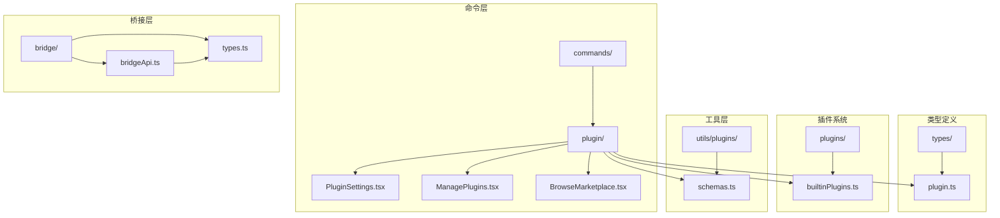

**图表来源**
- [plugin.tsx:1-7](file://commands/plugin/plugin.tsx#L1-L7)
- [builtinPlugins.ts:1-160](file://plugins/builtinPlugins.ts#L1-L160)
- [plugin.ts:1-364](file://types/plugin.ts#L1-L364)

**章节来源**
- [plugin.tsx:1-7](file://commands/plugin/plugin.tsx#L1-L7)
- [builtinPlugins.ts:1-160](file://plugins/builtinPlugins.ts#L1-L160)
- [plugin.ts:1-364](file://types/plugin.ts#L1-L364)

## 核心组件

### 插件注册与管理

Claude Code 支持两种插件类型：内置插件和市场插件。

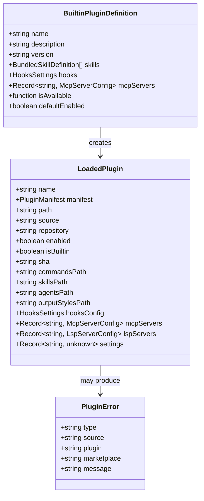

**图表来源**
- [builtinPlugins.ts:18-35](file://plugins/builtinPlugins.ts#L18-L35)
- [plugin.ts:48-70](file://types/plugin.ts#L48-L70)
- [plugin.ts:101-100](file://types/plugin.ts#L101-L100)

### 插件清单验证

插件系统使用 Zod 模式验证插件清单文件：

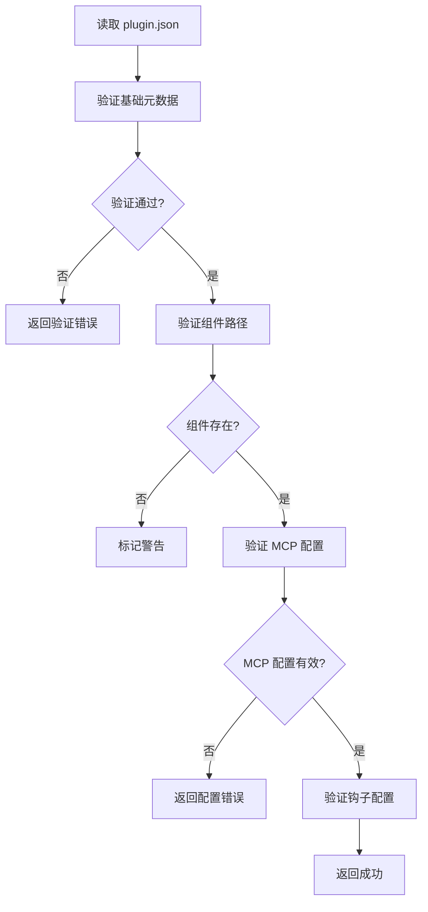

**图表来源**
- [schemas.ts:274-320](file://utils/plugins/schemas.ts#L274-L320)
- [schemas.ts:537-572](file://utils/plugins/schemas.ts#L537-L572)

**章节来源**
- [builtinPlugins.ts:1-160](file://plugins/builtinPlugins.ts#L1-L160)
- [plugin.ts:1-364](file://types/plugin.ts#L1-L364)
- [schemas.ts:1-800](file://utils/plugins/schemas.ts#L1-L800)

## 架构概览

### 插件生命周期

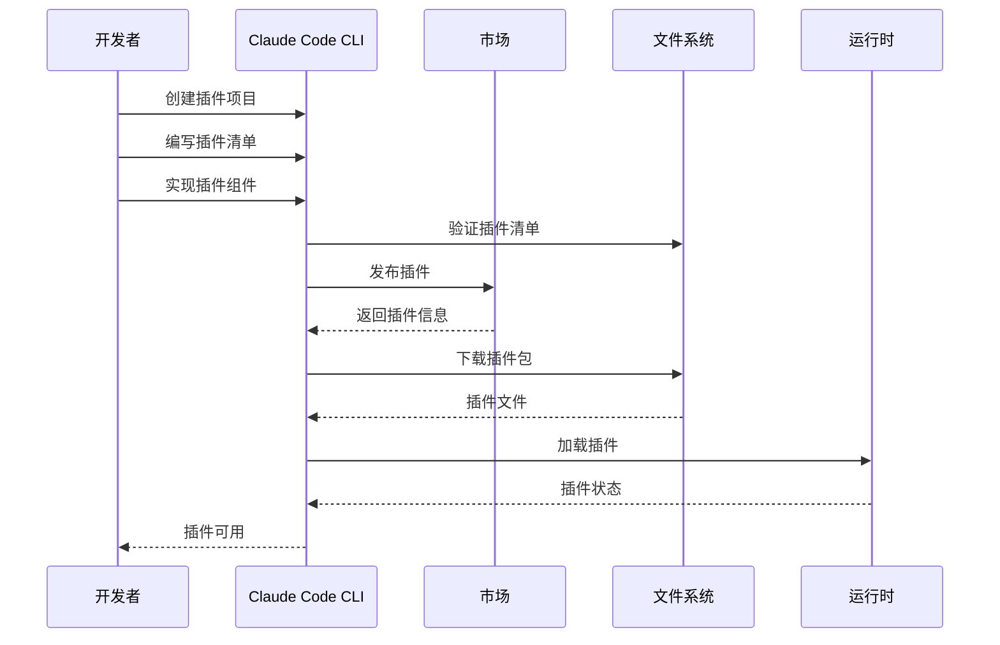

### 插件管理界面

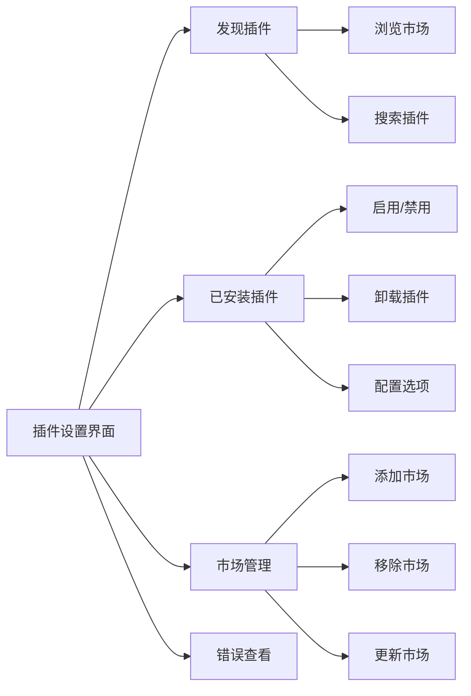

**图表来源**
- [PluginSettings.tsx:728-800](file://commands/plugin/PluginSettings.tsx#L728-L800)
- [ManagePlugins.tsx:397-450](file://commands/plugin/ManagePlugins.tsx#L397-L450)

**章节来源**
- [PluginSettings.tsx:1-800](file://commands/plugin/PluginSettings.tsx#L1-L800)
- [ManagePlugins.tsx:1-800](file://commands/plugin/ManagePlugins.tsx#L1-L800)

## 详细组件分析

### 内置插件系统

内置插件是随 CLI 一起分发的插件，用户可以启用或禁用：

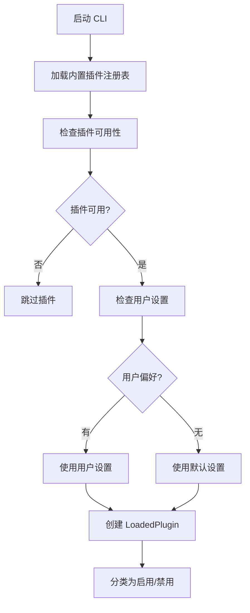

**图表来源**
- [builtinPlugins.ts:57-102](file://plugins/builtinPlugins.ts#L57-L102)

### 插件市场管理

插件市场管理系统支持多个市场源的配置和管理：

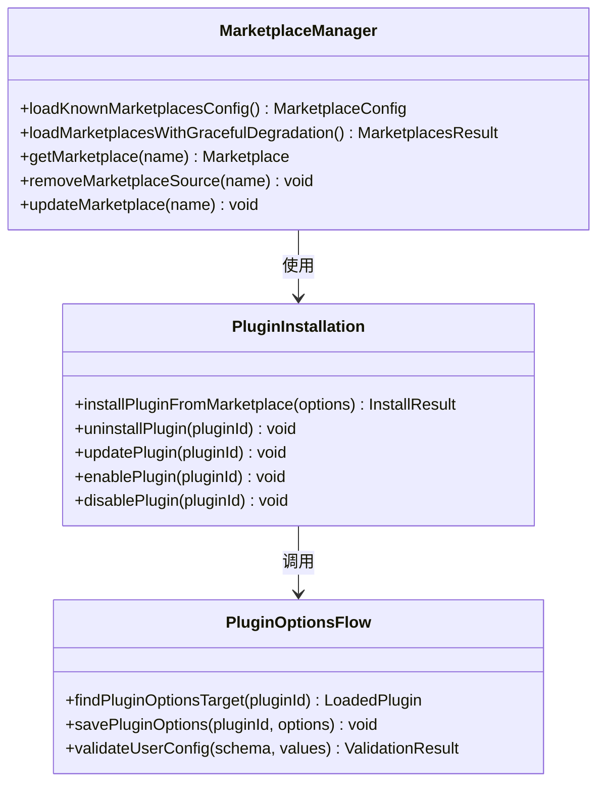

**图表来源**
- [BrowseMarketplace.tsx:124-243](file://commands/plugin/BrowseMarketplace.tsx#L124-L243)
- [ManagePlugins.tsx:376-396](file://commands/plugin/ManagePlugins.tsx#L376-L396)

### 错误处理机制

插件系统实现了全面的错误处理和诊断：

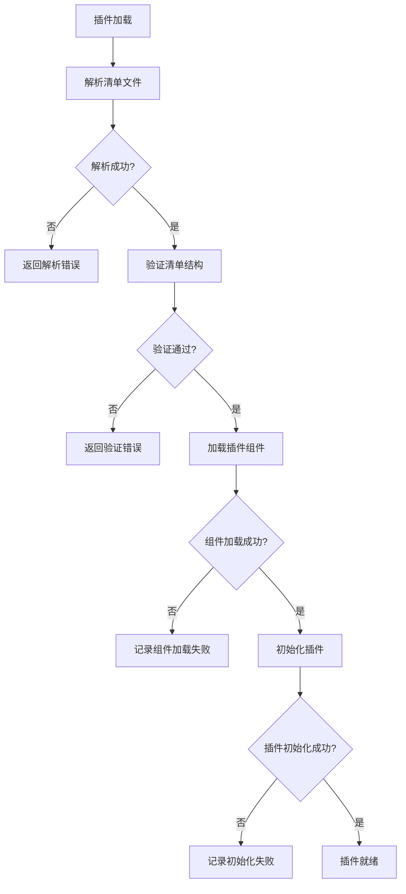

**图表来源**
- [plugin.ts:101-283](file://types/plugin.ts#L101-L283)

**章节来源**
- [builtinPlugins.ts:1-160](file://plugins/builtinPlugins.ts#L1-L160)
- [BrowseMarketplace.tsx:1-800](file://commands/plugin/BrowseMarketplace.tsx#L1-L800)
- [ManagePlugins.tsx:1-800](file://commands/plugin/ManagePlugins.tsx#L1-L800)
- [plugin.ts:1-364](file://types/plugin.ts#L1-L364)

## 依赖关系分析

### 核心依赖图

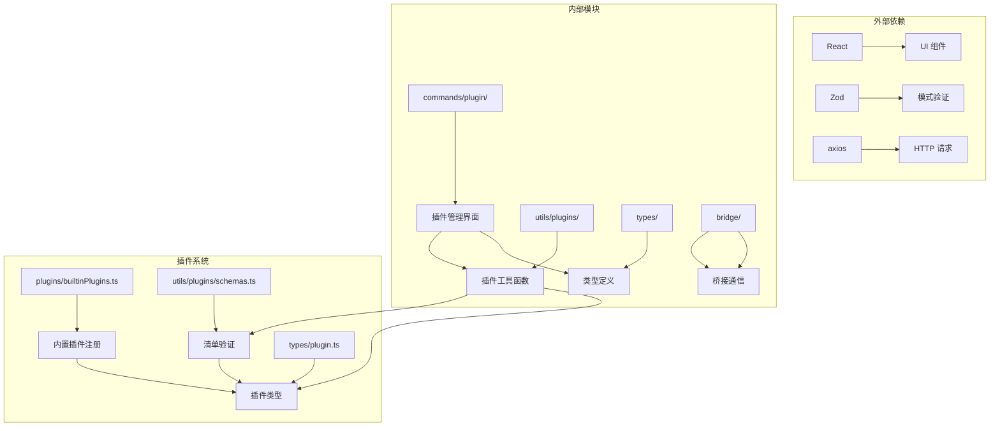

**图表来源**
- [plugin.tsx:1-7](file://commands/plugin/plugin.tsx#L1-L7)
- [schemas.ts:1-800](file://utils/plugins/schemas.ts#L1-L800)
- [plugin.ts:1-364](file://types/plugin.ts#L1-L364)

### 插件组件关系

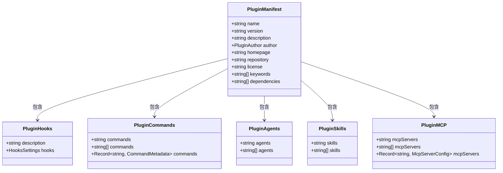

**图表来源**
- [schemas.ts:274-524](file://utils/plugins/schemas.ts#L274-L524)

**章节来源**
- [plugin.tsx:1-7](file://commands/plugin/plugin.tsx#L1-L7)
- [schemas.ts:1-800](file://utils/plugins/schemas.ts#L1-L800)
- [plugin.ts:1-364](file://types/plugin.ts#L1-L364)

## 性能考虑

### 插件加载优化

1. **延迟加载**: 插件组件按需加载，减少启动时间
2. **缓存机制**: 插件清单和配置文件使用缓存
3. **并发处理**: 多个插件同时加载时使用并发优化
4. **内存管理**: 及时清理不再使用的插件资源

### 性能监控

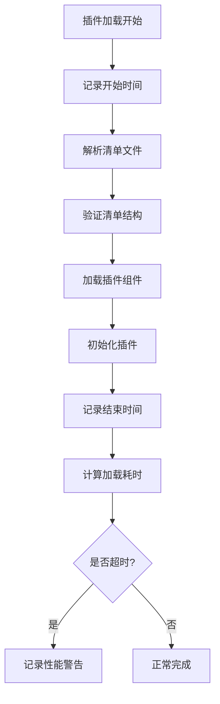

## 故障排除指南

### 常见插件错误

| 错误类型 | 描述 | 解决方案 |
|---------|------|----------|
| `plugin-not-found` | 插件未找到 | 检查插件名称和市场配置 |
| `manifest-parse-error` | 清单文件解析失败 | 验证 JSON 格式正确性 |
| `manifest-validation-error` | 清单验证失败 | 按照模式要求修正字段 |
| `mcp-config-invalid` | MCP 配置无效 | 检查服务器配置参数 |
| `component-load-failed` | 组件加载失败 | 检查组件文件路径和权限 |

### 调试技巧

1. **启用详细日志**: 使用 `--debug` 参数获取详细调试信息
2. **检查插件状态**: 使用 `/plugin` 命令查看插件状态
3. **验证清单文件**: 使用 `claude plugin validate` 验证插件清单
4. **查看错误详情**: 在插件设置界面查看详细的错误信息

**章节来源**
- [plugin.ts:295-363](file://types/plugin.ts#L295-L363)
- [PluginSettings.tsx:217-311](file://commands/plugin/PluginSettings.tsx#L217-L311)

## 结论

Claude Code 提供了功能完备的插件开发框架，支持多种插件类型和丰富的扩展能力。通过理解其架构设计和最佳实践，开发者可以构建高质量的插件来增强 Claude Code 的功能。

## 附录

### 开发环境搭建

1. **系统要求**: Node.js 16+，Bun 包管理器
2. **克隆仓库**: `git clone <repository-url>`
3. **安装依赖**: `bun install`
4. **启动开发**: `bun run dev`

### 插件开发步骤

1. **创建插件目录**: 在 `plugins/` 目录下创建新插件文件夹
2. **编写清单文件**: 创建 `plugin.json` 文件
3. **实现插件组件**: 添加命令、代理、技能等组件
4. **测试插件**: 使用本地开发模式测试插件功能
5. **发布插件**: 将插件发布到插件市场

### 最佳实践

1. **遵循命名规范**: 使用 kebab-case 命名插件和组件
2. **版本管理**: 使用语义化版本控制插件版本
3. **错误处理**: 实现完善的错误处理和用户提示
4. **性能优化**: 优化插件加载和执行性能
5. **安全考虑**: 遵循最小权限原则和安全编码实践