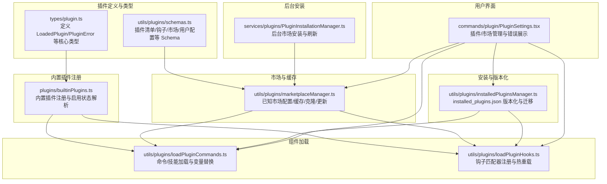
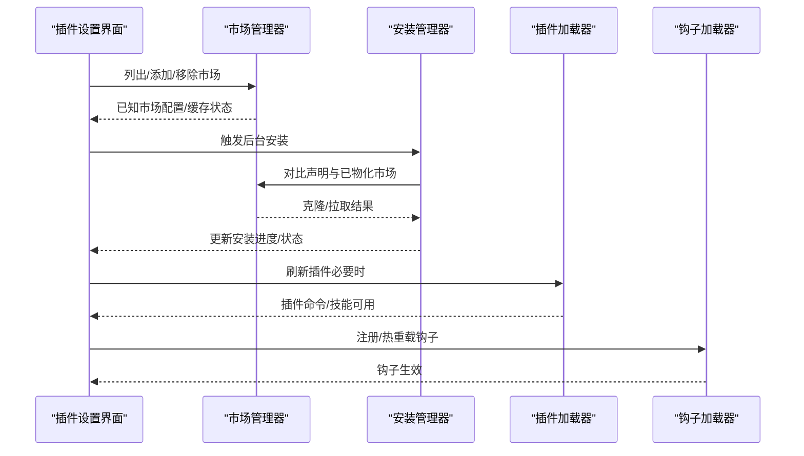
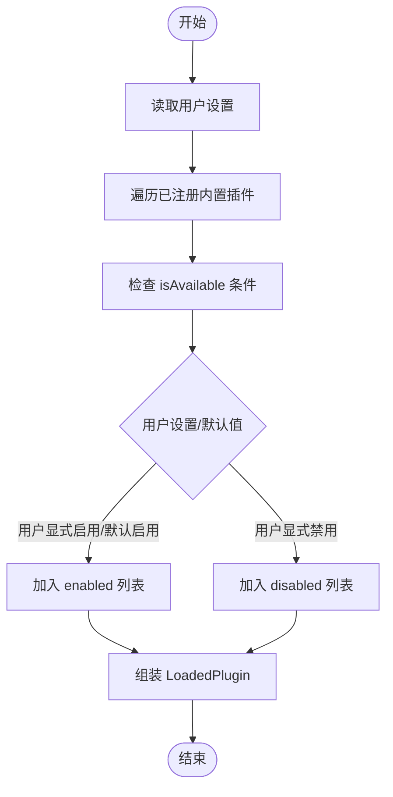
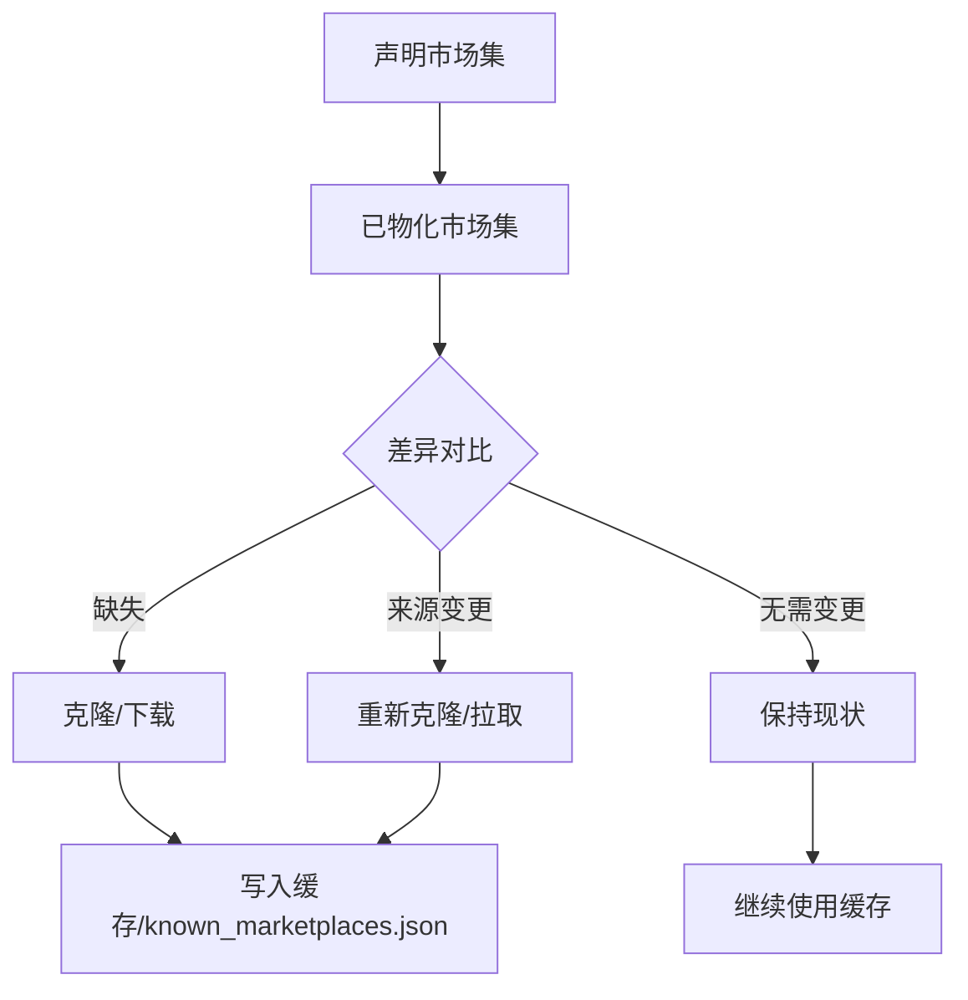
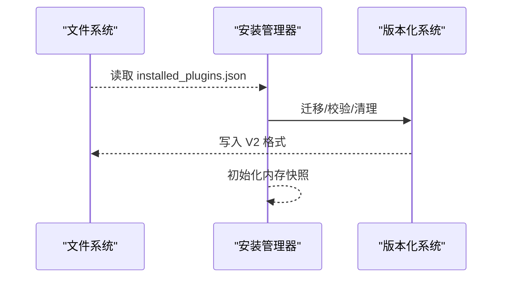
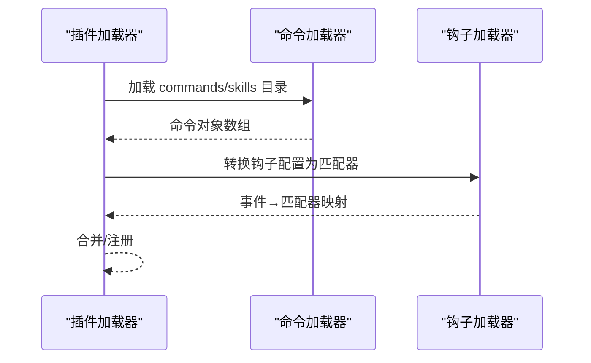
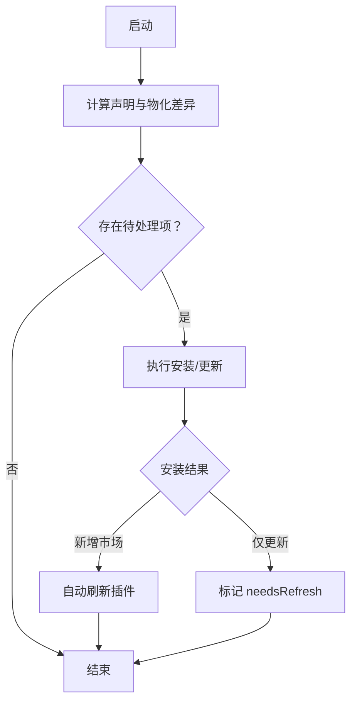
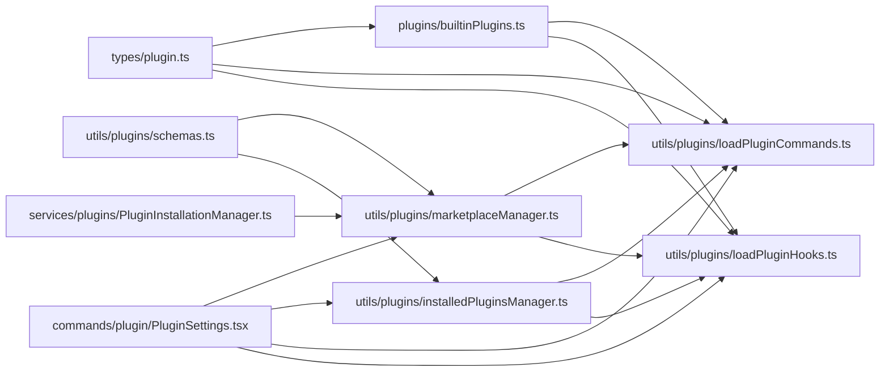

# 插件架构设计

<cite>
**本文档引用的文件**
- [builtinPlugins.ts](file://plugins/builtinPlugins.ts)
- [plugin.ts](file://types/plugin.ts)
- [PluginSettings.tsx](file://commands/plugin/PluginSettings.tsx)
- [schemas.ts](file://utils/plugins/schemas.ts)
- [installedPluginsManager.ts](file://utils/plugins/installedPluginsManager.ts)
- [marketplaceManager.ts](file://utils/plugins/marketplaceManager.ts)
- [loadPluginCommands.ts](file://utils/plugins/loadPluginCommands.ts)
- [loadPluginHooks.ts](file://utils/plugins/loadPluginHooks.ts)
- [PluginInstallationManager.ts](file://services/plugins/PluginInstallationManager.ts)
</cite>

## 目录
1. [引言](#引言)
2. [项目结构](#项目结构)
3. [核心组件](#核心组件)
4. [架构总览](#架构总览)
5. [详细组件分析](#详细组件分析)
6. [依赖关系分析](#依赖关系分析)
7. [性能考量](#性能考量)
8. [故障排查指南](#故障排查指南)
9. [结论](#结论)

## 引言
本文件系统性阐述 Claude Code 插件架构的设计与实现，覆盖插件注册、加载、生命周期管理、依赖注入、事件与钩子、消息传递、插件间通信与资源共享等主题。文档以代码为依据，结合可视化图示，帮助读者从高层到细节全面理解插件系统的工作原理，并提供扩展点、定制化选项与实践建议。

## 项目结构
插件系统围绕“清单/清单校验”“市场/缓存/同步”“安装元数据”“组件加载（命令/技能/钩子）”“后台安装器”五大维度组织，形成可扩展、可治理、可演进的插件生态。

**图表来源**
- [plugin.ts:48-70](file://types/plugin.ts#L48-L70)
- [schemas.ts:274-320](file://utils/plugins/schemas.ts#L274-L320)
- [builtinPlugins.ts:18-35](file://plugins/builtinPlugins.ts#L18-L35)
- [marketplaceManager.ts:1-120](file://utils/plugins/marketplaceManager.ts#L1-L120)
- [installedPluginsManager.ts:1-120](file://utils/plugins/installedPluginsManager.ts#L1-L120)
- [loadPluginCommands.ts:1-60](file://utils/plugins/loadPluginCommands.ts#L1-L60)
- [loadPluginHooks.ts:1-40](file://utils/plugins/loadPluginHooks.ts#L1-L40)
- [PluginInstallationManager.ts:1-60](file://services/plugins/PluginInstallationManager.ts#L1-L60)
- [PluginSettings.tsx:1-60](file://commands/plugin/PluginSettings.tsx#L1-L60)

**章节来源**
- [builtinPlugins.ts:1-160](file://plugins/builtinPlugins.ts#L1-L160)
- [plugin.ts:1-364](file://types/plugin.ts#L1-L364)
- [schemas.ts:1-200](file://utils/plugins/schemas.ts#L1-L200)
- [marketplaceManager.ts:1-200](file://utils/plugins/marketplaceManager.ts#L1-L200)
- [installedPluginsManager.ts:1-200](file://utils/plugins/installedPluginsManager.ts#L1-L200)
- [loadPluginCommands.ts:1-200](file://utils/plugins/loadPluginCommands.ts#L1-L200)
- [loadPluginHooks.ts:1-120](file://utils/plugins/loadPluginHooks.ts#L1-L120)
- [PluginInstallationManager.ts:1-120](file://services/plugins/PluginInstallationManager.ts#L1-L120)
- [PluginSettings.tsx:1-120](file://commands/plugin/PluginSettings.tsx#L1-L120)

## 核心组件
- 插件类型与错误模型：通过统一的 LoadedPlugin 结构承载插件元信息、路径、组件集合与设置；PluginError 提供类型安全的错误分类与消息生成。
- 内置插件注册：集中注册并按用户设置与默认值决定启用状态，统一暴露为 LoadedPlugin。
- 市场与缓存：维护已知市场配置、本地缓存、克隆/拉取、自动更新策略与来源校验。
- 安装与版本化：installed_plugins.json 统一记录安装元数据，支持多作用域（用户/项目/本地/托管），并进行 V1→V2 迁移与清理。
- 组件加载：命令/技能加载器负责解析 Markdown 前言、参数、工具限制、会话变量替换与脚本执行；钩子加载器将插件钩子转换为匹配器并注册。
- 后台安装：在启动后异步完成市场安装/更新，必要时触发插件刷新或提示用户手动刷新。
- 用户界面：插件设置面板提供发现、安装、管理、错误诊断与市场操作。

**章节来源**
- [plugin.ts:48-70](file://types/plugin.ts#L48-L70)
- [builtinPlugins.ts:57-102](file://plugins/builtinPlugins.ts#L57-L102)
- [marketplaceManager.ts:264-298](file://utils/plugins/marketplaceManager.ts#L264-L298)
- [installedPluginsManager.ts:315-364](file://utils/plugins/installedPluginsManager.ts#L315-L364)
- [loadPluginCommands.ts:414-430](file://utils/plugins/loadPluginCommands.ts#L414-L430)
- [loadPluginHooks.ts:91-157](file://utils/plugins/loadPluginHooks.ts#L91-L157)
- [PluginInstallationManager.ts:60-120](file://services/plugins/PluginInstallationManager.ts#L60-L120)
- [PluginSettings.tsx:728-780](file://commands/plugin/PluginSettings.tsx#L728-L780)

## 架构总览
插件系统采用“声明式清单 + 类型安全 Schema + 缓存优先 + 懒加载 + 热重载”的设计，确保可扩展性与运行时稳定性。

**图表来源**
- [PluginSettings.tsx:357-420](file://commands/plugin/PluginSettings.tsx#L357-L420)
- [marketplaceManager.ts:102-124](file://utils/plugins/marketplaceManager.ts#L102-L124)
- [PluginInstallationManager.ts:60-120](file://services/plugins/PluginInstallationManager.ts#L60-L120)
- [loadPluginCommands.ts:414-430](file://utils/plugins/loadPluginCommands.ts#L414-L430)
- [loadPluginHooks.ts:91-157](file://utils/plugins/loadPluginHooks.ts#L91-L157)

## 详细组件分析

### 内置插件注册与启用状态解析
- 注册入口：通过注册函数将内置插件定义写入内存映射，键为插件名，值为定义对象。
- 启用状态：读取用户设置，若未设置则回退到插件默认值；不可用条件过滤后，统一转为 LoadedPlugin 并拆分为启用/禁用两组。
- 技能映射：将内置技能定义转换为命令对象，便于统一调度。

**图表来源**
- [builtinPlugins.ts:57-102](file://plugins/builtinPlugins.ts#L57-L102)

**章节来源**
- [builtinPlugins.ts:25-102](file://plugins/builtinPlugins.ts#L25-L102)

### 市场与缓存管理
- 已知市场配置：known_marketplaces.json 记录市场名称到来源与安装位置的映射。
- 缓存策略：对 URL/Git/GitHub 等来源分别缓存，支持自动更新与来源校验。
- 同步与更新：对比声明与物化配置，执行安装/更新/失败处理；提供增强错误消息与超时控制。
- 种子市场：从只读种子目录注册市场，保证管理员可控与幂等。

**图表来源**
- [marketplaceManager.ts:161-192](file://utils/plugins/marketplaceManager.ts#L161-L192)
- [marketplaceManager.ts:264-298](file://utils/plugins/marketplaceManager.ts#L264-L298)
- [marketplaceManager.ts:380-434](file://utils/plugins/marketplaceManager.ts#L380-L434)

**章节来源**
- [marketplaceManager.ts:102-124](file://utils/plugins/marketplaceManager.ts#L102-L124)
- [marketplaceManager.ts:264-298](file://utils/plugins/marketplaceManager.ts#L264-L298)
- [marketplaceManager.ts:380-434](file://utils/plugins/marketplaceManager.ts#L380-L434)

### 安装与版本化管理
- 文件格式：installed_plugins.json 采用 V2 结构，支持多作用域安装与版本化缓存路径。
- 迁移策略：V1→V2 合并双文件、清理遗留缓存目录。
- 作用域与项目感知：区分用户/托管/项目/本地作用域，仅在当前项目上下文下显示“已安装”相关性。
- 在内存快照：启动时加载一次，避免后台更新影响运行期一致性。

**图表来源**
- [installedPluginsManager.ts:115-182](file://utils/plugins/installedPluginsManager.ts#L115-L182)
- [installedPluginsManager.ts:315-364](file://utils/plugins/installedPluginsManager.ts#L315-L364)
- [installedPluginsManager.ts:714-734](file://utils/plugins/installedPluginsManager.ts#L714-L734)

**章节来源**
- [installedPluginsManager.ts:115-182](file://utils/plugins/installedPluginsManager.ts#L115-L182)
- [installedPluginsManager.ts:315-364](file://utils/plugins/installedPluginsManager.ts#L315-L364)
- [installedPluginsManager.ts:714-734](file://utils/plugins/installedPluginsManager.ts#L714-L734)

### 插件组件加载（命令/技能/钩子）
- 命令/技能加载：递归扫描 Markdown 文件，解析前言、参数、工具限制、会话变量替换与脚本执行，输出统一的命令对象。
- 钩子加载：将插件钩子配置转换为匹配器，按事件类型聚合，原子性清空/注册，支持热重载与按需修剪。
- 变量与配置：支持用户配置占位符替换、会话 ID 注入、技能目录变量注入等。

**图表来源**
- [loadPluginCommands.ts:414-430](file://utils/plugins/loadPluginCommands.ts#L414-L430)
- [loadPluginHooks.ts:91-157](file://utils/plugins/loadPluginHooks.ts#L91-L157)

**章节来源**
- [loadPluginCommands.ts:169-213](file://utils/plugins/loadPluginCommands.ts#L169-L213)
- [loadPluginCommands.ts:218-412](file://utils/plugins/loadPluginCommands.ts#L218-L412)
- [loadPluginHooks.ts:28-86](file://utils/plugins/loadPluginHooks.ts#L28-L86)
- [loadPluginHooks.ts:91-157](file://utils/plugins/loadPluginHooks.ts#L91-L157)

### 后台安装与刷新
- 启动后异步执行：计算声明与物化差异，更新 UI 状态，执行安装/更新。
- 自动刷新：新市场安装完成后自动刷新插件，修复首次缓存导致的“未找到插件”问题；更新时标记需要手动刷新。
- 指标上报：记录安装/更新/失败数量，用于诊断与增长分析。

**图表来源**
- [PluginInstallationManager.ts:60-120](file://services/plugins/PluginInstallationManager.ts#L60-L120)
- [PluginInstallationManager.ts:135-180](file://services/plugins/PluginInstallationManager.ts#L135-L180)

**章节来源**
- [PluginInstallationManager.ts:60-120](file://services/plugins/PluginInstallationManager.ts#L60-L120)
- [PluginInstallationManager.ts:135-180](file://services/plugins/PluginInstallationManager.ts#L135-L180)

### 用户界面与错误处理
- 错误分类与引导：根据 PluginError 类型生成用户可读消息与操作建议，支持瞬时错误重试、市场移除、插件卸载等。
- 视图与交互：提供发现、已安装、市场、错误四个标签页，支持键盘快捷键导航与批量操作。
- 设置来源与范围：区分用户/项目/本地/策略来源，提供精准的错误定位与修复路径。

**章节来源**
- [PluginSettings.tsx:1-120](file://commands/plugin/PluginSettings.tsx#L1-L120)
- [PluginSettings.tsx:217-311](file://commands/plugin/PluginSettings.tsx#L217-L311)
- [PluginSettings.tsx:728-780](file://commands/plugin/PluginSettings.tsx#L728-L780)

## 依赖关系分析
- 类型与契约：types/plugin.ts 定义 LoadedPlugin/PluginError 等核心类型，被所有加载与管理模块引用。
- Schema 与校验：utils/plugins/schemas.ts 提供清单、钩子、市场、用户配置等 Schema，贯穿市场与插件加载阶段。
- 生命周期耦合：内置插件注册为后续命令/钩子加载提供输入；市场与安装管理器为加载器提供资源与缓存；后台安装器在启动后补充资源。
- 界面与状态：插件设置界面驱动市场/安装/加载流程，并消费错误与状态。

**图表来源**
- [plugin.ts:48-70](file://types/plugin.ts#L48-L70)
- [schemas.ts:274-320](file://utils/plugins/schemas.ts#L274-L320)
- [builtinPlugins.ts:18-35](file://plugins/builtinPlugins.ts#L18-L35)
- [marketplaceManager.ts:1-120](file://utils/plugins/marketplaceManager.ts#L1-L120)
- [installedPluginsManager.ts:1-120](file://utils/plugins/installedPluginsManager.ts#L1-L120)
- [loadPluginCommands.ts:1-60](file://utils/plugins/loadPluginCommands.ts#L1-L60)
- [loadPluginHooks.ts:1-40](file://utils/plugins/loadPluginHooks.ts#L1-L40)
- [PluginSettings.tsx:1-60](file://commands/plugin/PluginSettings.tsx#L1-L60)
- [PluginInstallationManager.ts:1-60](file://services/plugins/PluginInstallationManager.ts#L1-L60)

**章节来源**
- [plugin.ts:1-120](file://types/plugin.ts#L1-L120)
- [schemas.ts:274-320](file://utils/plugins/schemas.ts#L274-L320)
- [builtinPlugins.ts:18-35](file://plugins/builtinPlugins.ts#L18-L35)
- [marketplaceManager.ts:1-120](file://utils/plugins/marketplaceManager.ts#L1-L120)
- [installedPluginsManager.ts:1-120](file://utils/plugins/installedPluginsManager.ts#L1-L120)
- [loadPluginCommands.ts:1-60](file://utils/plugins/loadPluginCommands.ts#L1-L60)
- [loadPluginHooks.ts:1-40](file://utils/plugins/loadPluginHooks.ts#L1-L40)
- [PluginSettings.tsx:1-60](file://commands/plugin/PluginSettings.tsx#L1-L60)
- [PluginInstallationManager.ts:1-60](file://services/plugins/PluginInstallationManager.ts#L1-L60)

## 性能考量
- 缓存优先：插件加载与市场缓存减少磁盘与网络 IO；memoize 与内存快照降低重复计算成本。
- 并行处理：插件内多路径并行加载、市场差异计算与安装进度上报异步化。
- 启动优化：后台安装器在启动后异步完成市场安装，避免阻塞主流程；必要时自动刷新插件。
- 作用域隔离：安装元数据按作用域存储，避免跨项目污染与不必要的加载。

[本节为通用指导，不直接分析具体文件]

## 故障排查指南
- 错误类型与消息：使用 PluginError 类型安全地识别错误类别，结合 getPluginErrorMessage 获取用户可读消息。
- 常见场景：
  - Git 认证失败/超时：检查凭据与网络，适当增大超时时间。
  - 市场来源受限：确认来源是否在允许列表或被策略阻止。
  - 插件未找到：新市场安装后自动刷新插件；否则手动触发刷新。
  - 钩子未生效：确认插件启用且钩子配置正确；必要时触发热重载。
- 诊断步骤：查看错误标签页、定位错误来源、按指引移除异常市场或卸载插件、清理缓存后重试。

**章节来源**
- [plugin.ts:101-289](file://types/plugin.ts#L101-L289)
- [plugin.ts:295-363](file://types/plugin.ts#L295-L363)
- [marketplaceManager.ts:649-709](file://utils/plugins/marketplaceManager.ts#L649-L709)
- [PluginSettings.tsx:217-311](file://commands/plugin/PluginSettings.tsx#L217-L311)

## 结论
Claude Code 插件架构以类型安全与 Schema 校验为基础，结合缓存优先、懒加载与热重载机制，在保证运行时稳定的同时提供了强大的扩展能力。内置插件注册、市场与缓存、安装与版本化、组件加载与后台安装器共同构成完整的插件生命周期闭环；用户界面提供清晰的管理与诊断体验。该设计在可扩展性、可观测性与安全性之间取得平衡，适合企业级与个人开发者持续演进。