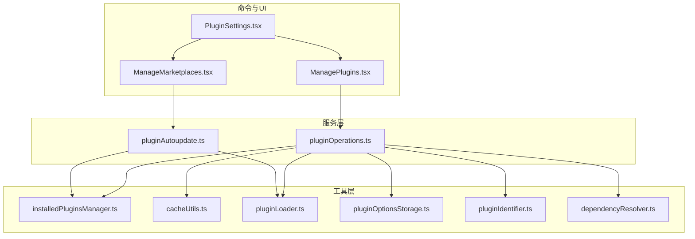
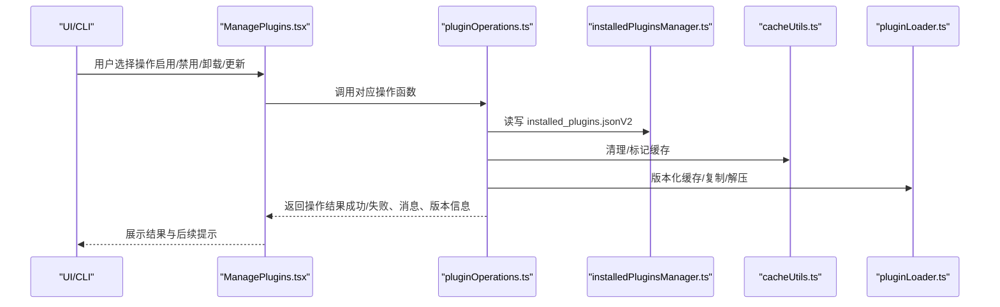
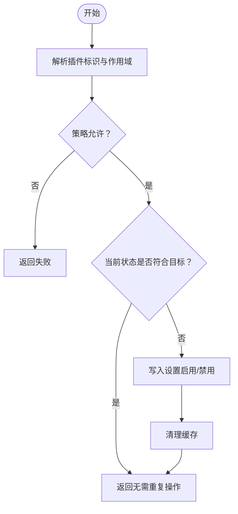
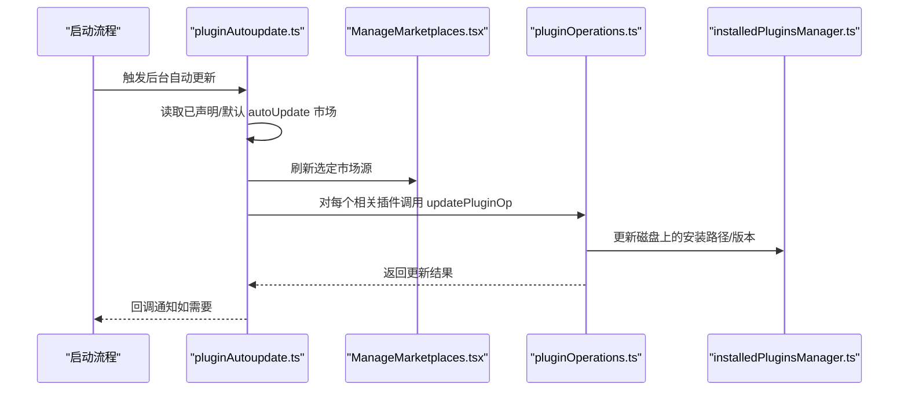
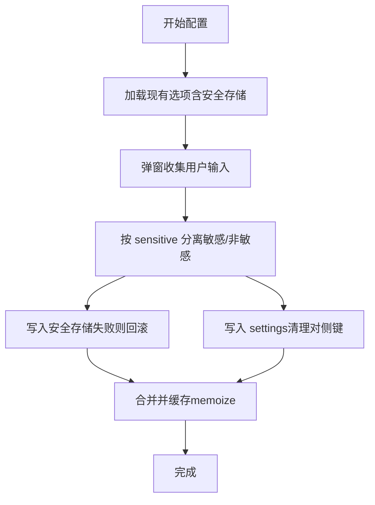
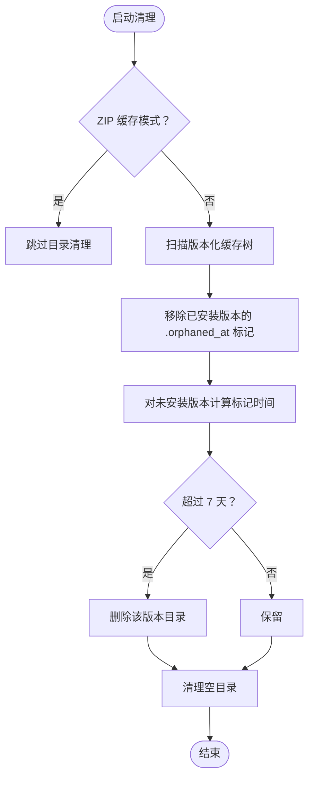
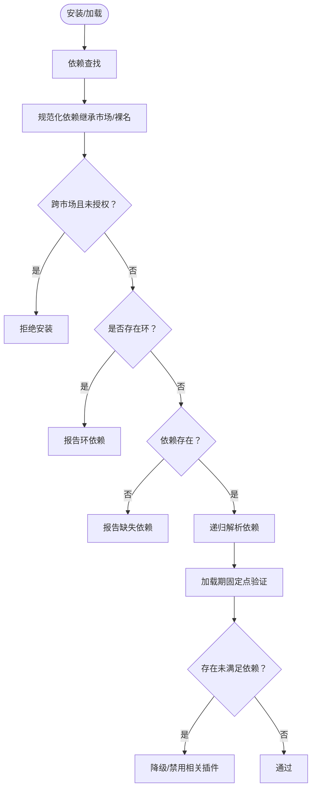
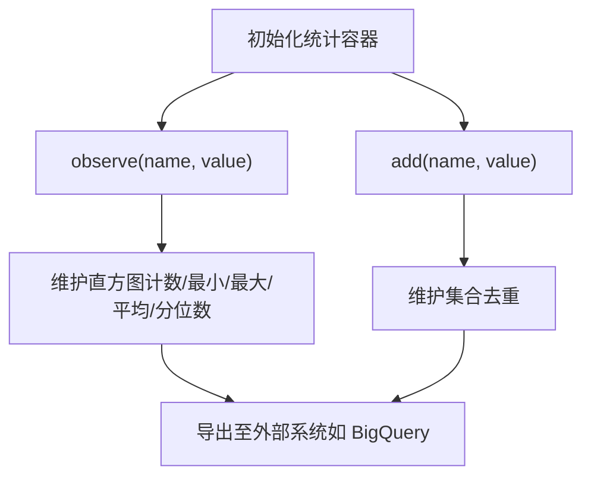
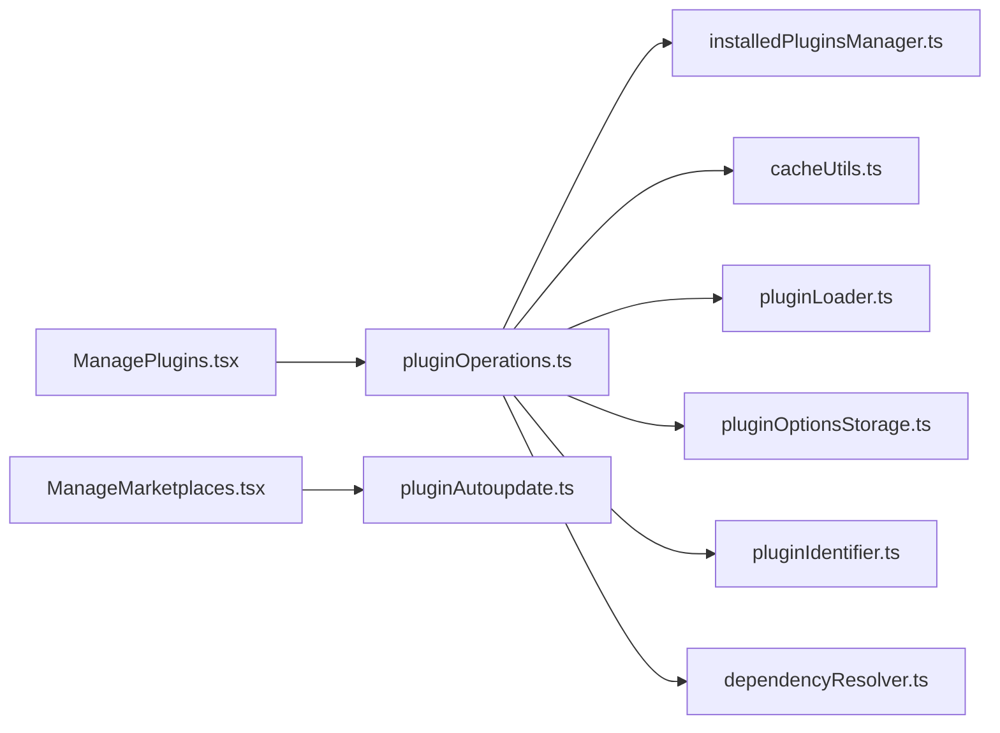

# 插件管理

<cite>
**本文引用的文件**
- [pluginOperations.ts](file://services/plugins/pluginOperations.ts)
- [pluginAutoupdate.ts](file://utils/plugins/pluginAutoupdate.ts)
- [installedPluginsManager.ts](file://utils/plugins/installedPluginsManager.ts)
- [cacheUtils.ts](file://utils/plugins/cacheUtils.ts)
- [pluginLoader.ts](file://utils/plugins/pluginLoader.ts)
- [PluginSettings.tsx](file://commands/plugin/PluginSettings.tsx)
- [ManagePlugins.tsx](file://commands/plugin/ManagePlugins.tsx)
- [ManageMarketplaces.tsx](file://commands/plugin/ManageMarketplaces.tsx)
- [pluginOptionsStorage.ts](file://utils/plugins/pluginOptionsStorage.ts)
- [pluginIdentifier.ts](file://utils/plugins/pluginIdentifier.ts)
- [dependencyResolver.ts](file://utils/plugins/dependencyResolver.ts)
</cite>

## 目录
1. [简介](#简介)
2. [项目结构](#项目结构)
3. [核心组件](#核心组件)
4. [架构总览](#架构总览)
5. [详细组件分析](#详细组件分析)
6. [依赖关系分析](#依赖关系分析)
7. [性能考量](#性能考量)
8. [故障排查指南](#故障排查指南)
9. [结论](#结论)
10. [附录](#附录)

## 简介
本文件系统性阐述 Claude Code 的插件管理能力，覆盖插件的启用/禁用/卸载、自动与手动更新、配置与个性化、缓存清理与维护、冲突检测与解决、性能监控与资源使用查看、批量操作与导入导出、以及备份恢复与故障恢复等全链路能力。内容基于仓库中的实现进行归纳总结，帮助开发者与用户理解插件生命周期与运维策略。

## 项目结构
围绕插件管理的关键模块分布如下：
- 服务层：提供可被 CLI 与 UI 调用的核心操作（安装、卸载、启用、禁用、更新）
- 工具层：负责插件缓存、版本化路径、市场源、依赖解析、选项存储等
- 命令与 UI：提供交互式菜单与视图（发现、已安装、市场源、错误诊断）

**图表来源**
- [PluginSettings.tsx](file://commands/plugin/PluginSettings.tsx)
- [ManagePlugins.tsx](file://commands/plugin/ManagePlugins.tsx)
- [ManageMarketplaces.tsx](file://commands/plugin/ManageMarketplaces.tsx)
- [pluginOperations.ts](file://services/plugins/pluginOperations.ts)
- [pluginAutoupdate.ts](file://utils/plugins/pluginAutoupdate.ts)
- [installedPluginsManager.ts](file://utils/plugins/installedPluginsManager.ts)
- [cacheUtils.ts](file://utils/plugins/cacheUtils.ts)
- [pluginLoader.ts](file://utils/plugins/pluginLoader.ts)
- [pluginOptionsStorage.ts](file://utils/plugins/pluginOptionsStorage.ts)
- [pluginIdentifier.ts](file://utils/plugins/pluginIdentifier.ts)
- [dependencyResolver.ts](file://utils/plugins/dependencyResolver.ts)

**章节来源**
- [PluginSettings.tsx](file://commands/plugin/PluginSettings.tsx)
- [ManagePlugins.tsx](file://commands/plugin/ManagePlugins.tsx)
- [ManageMarketplaces.tsx](file://commands/plugin/ManageMarketplaces.tsx)
- [pluginOperations.ts](file://services/plugins/pluginOperations.ts)
- [pluginAutoupdate.ts](file://utils/plugins/pluginAutoupdate.ts)
- [installedPluginsManager.ts](file://utils/plugins/installedPluginsManager.ts)
- [cacheUtils.ts](file://utils/plugins/cacheUtils.ts)
- [pluginLoader.ts](file://utils/plugins/pluginLoader.ts)
- [pluginOptionsStorage.ts](file://utils/plugins/pluginOptionsStorage.ts)
- [pluginIdentifier.ts](file://utils/plugins/pluginIdentifier.ts)
- [dependencyResolver.ts](file://utils/plugins/dependencyResolver.ts)

## 核心组件
- 插件操作服务：提供安装、卸载、启用、禁用、批量禁用、更新等纯函数式操作，返回标准化结果对象，便于 CLI 与 UI 复用。
- 自动更新模块：在启动时按市场源维度执行“刷新市场 + 更新插件”的非就地更新流程，支持回调通知重启。
- 安装元数据管理：统一维护 installed_plugins.json（V2），记录各插件在不同作用域的安装路径、版本、时间戳等。
- 缓存与清理：版本化缓存目录、孤儿版本清理、全局缓存清空；支持 ZIP 缓存模式。
- 插件加载器：解析版本化/种子缓存、拷贝到版本化缓存、处理本地/远程来源、支持子目录克隆优化。
- 配置与选项：区分敏感与非敏感选项，分别存储于安全存储与 settings；提供加载合并与保存逻辑。
- 依赖解析：安装期 DFS 解析闭包，加载期固定点校验与降级，避免循环与跨市场依赖风险。
- 市场源管理：加载/刷新/移除市场源，控制自动更新开关，支持批量应用变更。

**章节来源**
- [pluginOperations.ts](file://services/plugins/pluginOperations.ts)
- [pluginAutoupdate.ts](file://utils/plugins/pluginAutoupdate.ts)
- [installedPluginsManager.ts](file://utils/plugins/installedPluginsManager.ts)
- [cacheUtils.ts](file://utils/plugins/cacheUtils.ts)
- [pluginLoader.ts](file://utils/plugins/pluginLoader.ts)
- [pluginOptionsStorage.ts](file://utils/plugins/pluginOptionsStorage.ts)
- [pluginIdentifier.ts](file://utils/plugins/pluginIdentifier.ts)
- [dependencyResolver.ts](file://utils/plugins/dependencyResolver.ts)

## 架构总览
下图展示从 UI 到服务再到工具层的调用关系与数据流：

**图表来源**
- [ManagePlugins.tsx](file://commands/plugin/ManagePlugins.tsx)
- [pluginOperations.ts](file://services/plugins/pluginOperations.ts)
- [installedPluginsManager.ts](file://utils/plugins/installedPluginsManager.ts)
- [cacheUtils.ts](file://utils/plugins/cacheUtils.ts)
- [pluginLoader.ts](file://utils/plugins/pluginLoader.ts)

## 详细组件分析

### 启用、禁用与卸载
- 启用/禁用：以设置优先，解析目标插件与作用域，检查策略限制与当前状态，写入对应 settings 源后清理缓存。
- 卸载：定位实际安装位置，从 installed_plugins.json 移除对应条目；若为最后一个作用域，则清理选项与数据目录。
- 批量禁用：遍历已启用插件逐个禁用，聚合结果与错误。

**图表来源**
- [pluginOperations.ts](file://services/plugins/pluginOperations.ts)

**章节来源**
- [pluginOperations.ts](file://services/plugins/pluginOperations.ts)

### 自动更新与手动更新
- 自动更新：启动时识别开启 autoUpdate 的市场源，仅对这些市场执行刷新与更新；更新采用“磁盘就地更新 + 内存不更新”的非就地策略，需重启生效；支持回调通知。
- 手动更新：通过市场源管理界面或命令触发，刷新指定市场并更新相关插件；同样采用非就地更新。

**图表来源**
- [pluginAutoupdate.ts](file://utils/plugins/pluginAutoupdate.ts)
- [ManageMarketplaces.tsx](file://commands/plugin/ManageMarketplaces.tsx)
- [pluginOperations.ts](file://services/plugins/pluginOperations.ts)
- [installedPluginsManager.ts](file://utils/plugins/installedPluginsManager.ts)

**章节来源**
- [pluginAutoupdate.ts](file://utils/plugins/pluginAutoupdate.ts)
- [ManageMarketplaces.tsx](file://commands/plugin/ManageMarketplaces.tsx)
- [pluginOperations.ts](file://services/plugins/pluginOperations.ts)
- [installedPluginsManager.ts](file://utils/plugins/installedPluginsManager.ts)

### 插件配置与个性化
- 选项存储：区分敏感与非敏感字段，敏感项写入安全存储，其余写入 settings；加载时合并两者，后者覆盖前者同名键。
- 保存策略：先写安全存储，再写 settings，确保一致性；保存时对另一侧进行必要清理，避免泄露。
- UI 流程：通过对话框或流程引导用户输入，完成后持久化并清理缓存。

**图表来源**
- [pluginOptionsStorage.ts](file://utils/plugins/pluginOptionsStorage.ts)

**章节来源**
- [pluginOptionsStorage.ts](file://utils/plugins/pluginOptionsStorage.ts)

### 插件缓存清理与维护
- 全局缓存清空：同时清理插件命令、代理、钩子、输出样式等多类缓存，并修剪已移除插件的钩子。
- 孤儿版本清理：扫描版本化缓存，标记并删除超过 7 天未使用的孤儿版本；支持 ZIP 缓存模式下的特殊处理。
- 旧版缓存迁移：清理 legacy 平铺缓存中未被任何安装引用的目录。

**图表来源**
- [cacheUtils.ts](file://utils/plugins/cacheUtils.ts)

**章节来源**
- [cacheUtils.ts](file://utils/plugins/cacheUtils.ts)

### 插件冲突检测与解决
- 安装期依赖解析：DFS 遍历依赖闭包，检测环依赖、缺失依赖、跨市场依赖（默认禁止），支持根市场白名单放行。
- 加载期验证与降级：固定点迭代校验依赖满足度，对不满足的插件进行降级（禁用），并生成诊断错误集合。

**图表来源**
- [dependencyResolver.ts](file://utils/plugins/dependencyResolver.ts)

**章节来源**
- [dependencyResolver.ts](file://utils/plugins/dependencyResolver.ts)

### 性能监控与资源使用
- 统计与直方图：提供通用统计容器，支持数值直方图（含分位数）、集合去重等，用于记录指标并导出。
- 指标导出：支持 BigQuery 导出通道，包含资源属性与聚合方式选择，便于集中观测。

**图表来源**
- [stats.tsx](file://context/stats.tsx)
- [bigqueryExporter.ts](file://utils/telemetry/bigqueryExporter.ts)

**章节来源**
- [stats.tsx](file://context/stats.tsx)
- [bigqueryExporter.ts](file://utils/telemetry/bigqueryExporter.ts)

### 批量操作与导入导出
- 批量禁用：遍历已启用插件逐一禁用，聚合结果与错误列表，便于一次性停用所有插件。
- 导入/导出：UI 提供导入导出入口，结合市场源管理与设置源，实现插件清单与配置的迁移。

**章节来源**
- [pluginOperations.ts](file://services/plugins/pluginOperations.ts)
- [PluginSettings.tsx](file://commands/plugin/PluginSettings.tsx)

### 备份恢复与故障恢复
- 备份：通过导入导出功能备份插件清单与配置；结合市场源与设置源，可完整迁移。
- 故障恢复：错误面板支持快速定位市场源与插件错误，提供一键移除多余市场源、修复损坏市场源、导航到卸载界面等操作；自动更新失败会记录日志并提示重启重试。

**章节来源**
- [PluginSettings.tsx](file://commands/plugin/PluginSettings.tsx)
- [pluginAutoupdate.ts](file://utils/plugins/pluginAutoupdate.ts)

## 依赖关系分析
- 模块耦合：插件操作服务依赖安装元数据管理、缓存工具、加载器、选项存储、标识解析与依赖解析；UI 通过服务层间接依赖工具层。
- 可能的循环：服务层与工具层之间为单向依赖，无直接循环；UI 仅作为调用方，不反向依赖服务层。
- 外部依赖：git、npm、安全存储（keychain/凭据文件）等，均在工具层封装调用。

**图表来源**
- [ManagePlugins.tsx](file://commands/plugin/ManagePlugins.tsx)
- [ManageMarketplaces.tsx](file://commands/plugin/ManageMarketplaces.tsx)
- [pluginOperations.ts](file://services/plugins/pluginOperations.ts)
- [pluginAutoupdate.ts](file://utils/plugins/pluginAutoupdate.ts)
- [installedPluginsManager.ts](file://utils/plugins/installedPluginsManager.ts)
- [cacheUtils.ts](file://utils/plugins/cacheUtils.ts)
- [pluginLoader.ts](file://utils/plugins/pluginLoader.ts)
- [pluginOptionsStorage.ts](file://utils/plugins/pluginOptionsStorage.ts)
- [pluginIdentifier.ts](file://utils/plugins/pluginIdentifier.ts)
- [dependencyResolver.ts](file://utils/plugins/dependencyResolver.ts)

**章节来源**
- [ManagePlugins.tsx](file://commands/plugin/ManagePlugins.tsx)
- [ManageMarketplaces.tsx](file://commands/plugin/ManageMarketplaces.tsx)
- [pluginOperations.ts](file://services/plugins/pluginOperations.ts)
- [pluginAutoupdate.ts](file://utils/plugins/pluginAutoupdate.ts)
- [installedPluginsManager.ts](file://utils/plugins/installedPluginsManager.ts)
- [cacheUtils.ts](file://utils/plugins/cacheUtils.ts)
- [pluginLoader.ts](file://utils/plugins/pluginLoader.ts)
- [pluginOptionsStorage.ts](file://utils/plugins/pluginOptionsStorage.ts)
- [pluginIdentifier.ts](file://utils/plugins/pluginIdentifier.ts)
- [dependencyResolver.ts](file://utils/plugins/dependencyResolver.ts)

## 性能考量
- 非就地更新：磁盘更新与内存状态分离，避免阻塞用户交互，但需重启生效；适合后台静默更新。
- 版本化缓存：按市场/插件/版本组织缓存，支持种子缓存命中与 ZIP 缓存模式，减少 IO 与空间占用。
- 缓存清理：定期清理孤儿版本与旧版缓存，防止磁盘膨胀；全局缓存清空用于强制重建状态。
- 依赖解析：安装期 DFS 与加载期固定点验证，避免运行期反复解析；跨市场依赖默认禁止，降低复杂度与风险。

[本节为通用指导，无需列出具体文件来源]

## 故障排查指南
- 错误面板：聚合市场源加载失败、插件加载错误、其他异常，提供快速导航与修复建议。
- 常见问题：
  - 市场源不可用：移除多余或损坏的市场源，或切换到受管市场源。
  - 插件加载失败：根据错误类型提示（网络、下载、清单无效、需要配置等）采取相应措施。
  - 自动更新未生效：检查 autoUpdate 开关与网络状态，重启后再次检查更新。
- 诊断工具：依赖解析与降级流程输出的错误集合可用于定位问题根因。

**章节来源**
- [PluginSettings.tsx](file://commands/plugin/PluginSettings.tsx)
- [pluginAutoupdate.ts](file://utils/plugins/pluginAutoupdate.ts)
- [dependencyResolver.ts](file://utils/plugins/dependencyResolver.ts)

## 结论
Claude Code 的插件管理以“设置优先、磁盘就地更新、版本化缓存”为核心设计，兼顾易用性与安全性。通过自动更新、错误诊断、依赖解析与缓存维护等机制，形成从安装到运行、从配置到运维的完整闭环。用户可通过 UI/CLI 快速完成启停、卸载、更新、配置与故障恢复等操作，开发者可基于统一的服务接口扩展与集成。

[本节为总结性内容，无需列出具体文件来源]

## 附录
- 关键术语
  - 作用域：user、project、local、managed、flag（会话内）。
  - 非就地更新：仅更新磁盘安装路径与版本，内存状态保持不变，需重启生效。
  - 孤儿版本：不再被任何安装引用的旧版本缓存，定期清理释放空间。
- 常用路径
  - 插件目录：~/.claude/plugins
  - 缓存目录：~/.claude/plugins/cache
  - 安装元数据：~/.claude/plugins/installed_plugins.json（V2）

[本节为补充说明，无需列出具体文件来源]