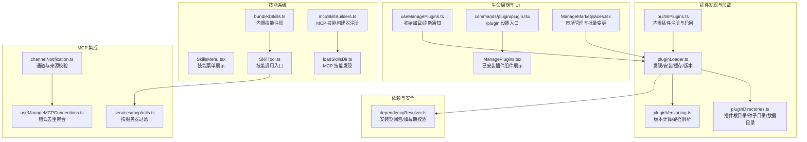
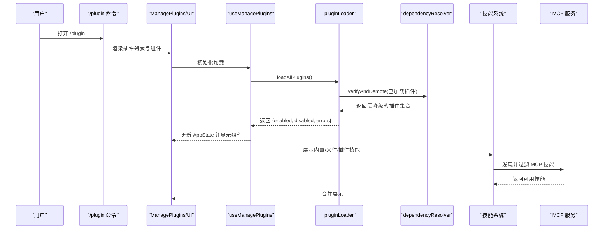
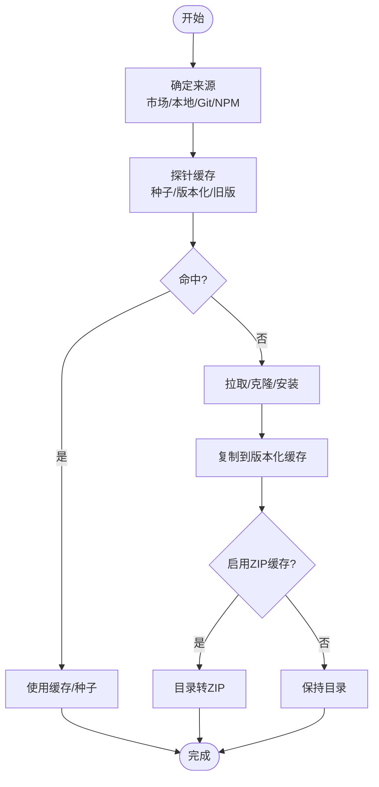
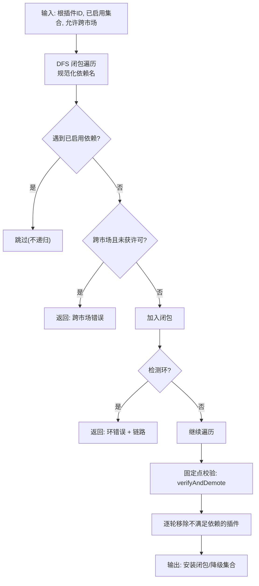
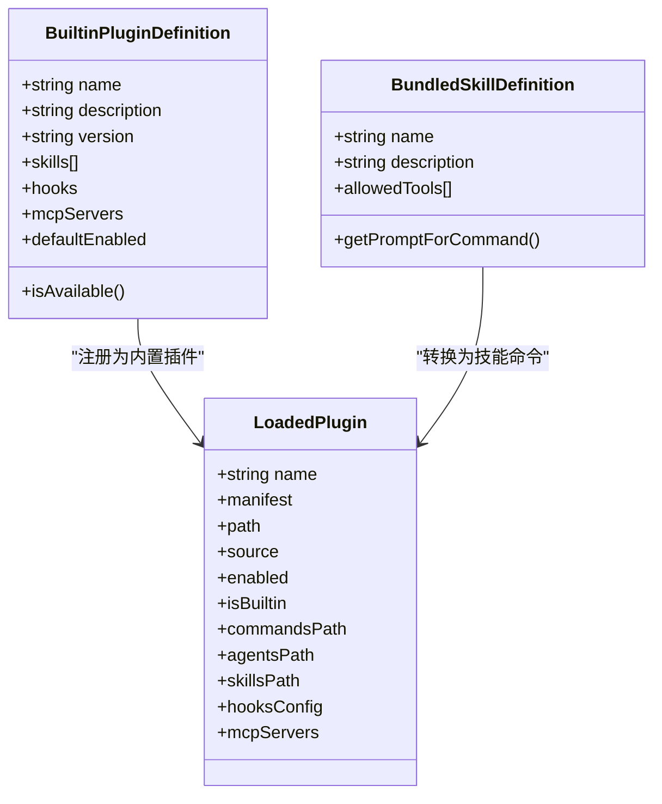
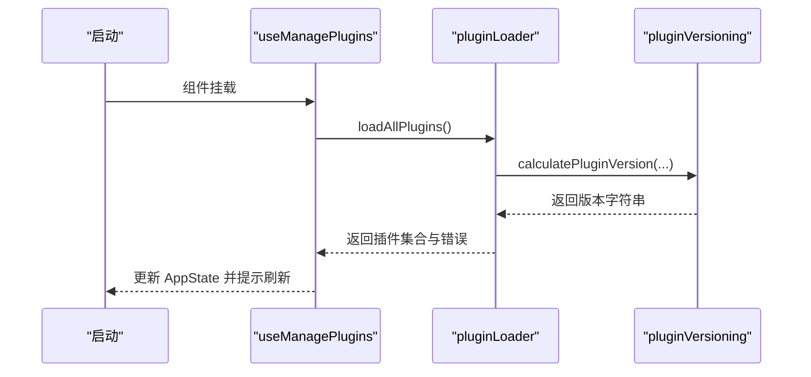
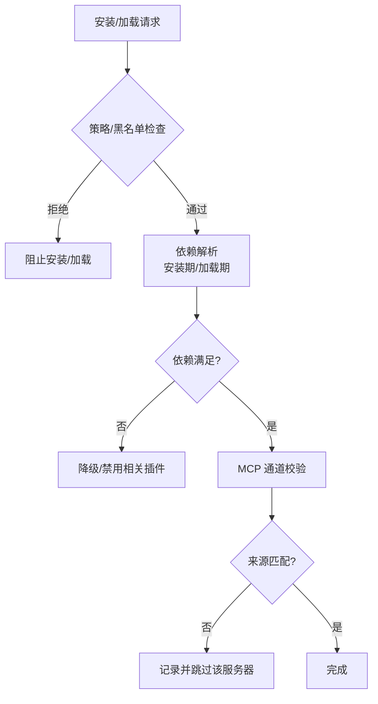
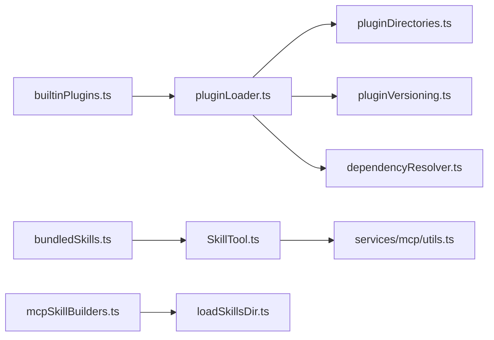

# 插件系统

<cite>
**本文引用的文件**
- [builtinPlugins.ts](file://plugins/builtinPlugins.ts)
- [bundledSkills.ts](file://skills/bundledSkills.ts)
- [pluginLoader.ts](file://utils/plugins/pluginLoader.ts)
- [dependencyResolver.ts](file://utils/plugins/dependencyResolver.ts)
- [pluginDirectories.ts](file://utils/plugins/pluginDirectories.ts)
- [pluginVersioning.ts](file://utils/plugins/pluginVersioning.ts)
- [plugin.tsx](file://commands/plugin/plugin.tsx)
- [ManagePlugins.tsx](file://commands/plugin/ManagePlugins.tsx)
- [ManageMarketplaces.tsx](file://commands/plugin/ManageMarketplaces.tsx)
- [SkillsMenu.tsx](file://components/skills/SkillsMenu.tsx)
- [SkillTool.ts](file://tools/SkillTool/SkillTool.ts)
- [useManagePlugins.ts](file://hooks/useManagePlugins.ts)
- [plugin.ts](file://types/plugin.ts)
- [performStartupChecks.tsx](file://utils/plugins/performStartupChecks.tsx)
- [useManageMCPConnections.ts](file://services/mcp/useManageMCPConnections.ts)
- [channelNotification.ts](file://services/mcp/channelNotification.ts)
- [mcpSkillBuilders.ts](file://skills/mcpSkillBuilders.ts)
- [loadSkillsDir.ts](file://skills/loadSkillsDir.ts)
- [utils.ts](file://services/mcp/utils.ts)
- [commands.ts](file://commands.ts)
</cite>

## 目录
1. [引言](#引言)
2. [项目结构](#项目结构)
3. [核心组件](#核心组件)
4. [架构总览](#架构总览)
5. [详细组件分析](#详细组件分析)
6. [依赖关系分析](#依赖关系分析)
7. [性能考量](#性能考量)
8. [故障排除指南](#故障排除指南)
9. [结论](#结论)
10. [附录](#附录)

## 引言
本文件系统性阐述 Claude Code 的插件系统：从架构设计、扩展机制到开发与运维实践。内容覆盖插件发现与加载、依赖解析与安全策略、内置与第三方插件、技能系统（含 MCP 技能）、生命周期与版本控制、性能优化与调试排障，并给出可操作的应用案例与最佳实践。

## 项目结构
插件系统围绕“清单与加载”“依赖解析”“市场与来源”“技能与命令”“生命周期与版本”五大维度组织，关键模块如下：
- 插件注册与内置插件：builtinPlugins.ts 提供内置插件注册表与启用状态管理
- 插件加载器：pluginLoader.ts 负责从多种来源（市场、本地、git 等）发现、安装与缓存插件
- 依赖解析：dependencyResolver.ts 实现安装期与加载期的依赖闭包与一致性校验
- 目录与缓存：pluginDirectories.ts 统一插件根目录、种子目录与数据目录；pluginVersioning.ts 计算版本号并支持路径解析
- 技能系统：bundledSkills.ts 管理内置技能；SkillsMenu.tsx、SkillTool.ts 展示与调用技能；mcpSkillBuilders.ts 与 loadSkillsDir.ts 支持 MCP 技能发现
- 命令入口：commands/plugin/plugin.tsx 暴露 /plugin 设置界面
- 生命周期：hooks/useManagePlugins.ts 在挂载时初始化加载；performStartupChecks.tsx 在信任确认后后台执行安装检查
- MCP 集成：services/mcp/utils.ts 提供按服务器过滤命令/工具/资源；channelNotification.ts 保障通道与来源匹配；useManageMCPConnections.ts 聚合错误去重

图表来源
- [pluginLoader.ts](file://utils/plugins/pluginLoader.ts)
- [builtinPlugins.ts](file://plugins/builtinPlugins.ts)
- [pluginDirectories.ts](file://utils/plugins/pluginDirectories.ts)
- [pluginVersioning.ts](file://utils/plugins/pluginVersioning.ts)
- [dependencyResolver.ts](file://utils/plugins/dependencyResolver.ts)
- [bundledSkills.ts](file://skills/bundledSkills.ts)
- [SkillsMenu.tsx](file://components/skills/SkillsMenu.tsx)
- [SkillTool.ts](file://tools/SkillTool/SkillTool.ts)
- [mcpSkillBuilders.ts](file://skills/mcpSkillBuilders.ts)
- [loadSkillsDir.ts](file://skills/loadSkillsDir.ts)
- [useManagePlugins.ts](file://hooks/useManagePlugins.ts)
- [plugin.tsx](file://commands/plugin/plugin.tsx)
- [ManagePlugins.tsx](file://commands/plugin/ManagePlugins.tsx)
- [ManageMarketplaces.tsx](file://commands/plugin/ManageMarketplaces.tsx)
- [utils.ts](file://services/mcp/utils.ts)
- [channelNotification.ts](file://services/mcp/channelNotification.ts)
- [useManageMCPConnections.ts](file://services/mcp/useManageMCPConnections.ts)

章节来源
- [pluginLoader.ts](file://utils/plugins/pluginLoader.ts)
- [builtinPlugins.ts](file://plugins/builtinPlugins.ts)
- [pluginDirectories.ts](file://utils/plugins/pluginDirectories.ts)
- [pluginVersioning.ts](file://utils/plugins/pluginVersioning.ts)
- [dependencyResolver.ts](file://utils/plugins/dependencyResolver.ts)
- [bundledSkills.ts](file://skills/bundledSkills.ts)
- [SkillsMenu.tsx](file://components/skills/SkillsMenu.tsx)
- [SkillTool.ts](file://tools/SkillTool/SkillTool.ts)
- [mcpSkillBuilders.ts](file://skills/mcpSkillBuilders.ts)
- [loadSkillsDir.ts](file://skills/loadSkillsDir.ts)
- [useManagePlugins.ts](file://hooks/useManagePlugins.ts)
- [plugin.tsx](file://commands/plugin/plugin.tsx)
- [ManagePlugins.tsx](file://commands/plugin/ManagePlugins.tsx)
- [ManageMarketplaces.tsx](file://commands/plugin/ManageMarketplaces.tsx)
- [utils.ts](file://services/mcp/utils.ts)
- [channelNotification.ts](file://services/mcp/channelNotification.ts)
- [useManageMCPConnections.ts](file://services/mcp/useManageMCPConnections.ts)

## 核心组件
- 插件清单与类型
  - LoadedPlugin：统一描述已加载插件的元信息、启用状态、组件路径与配置
  - PluginError：类型化错误体系，覆盖网络、Git、清单、MCP/LSP、依赖等场景
- 内置插件注册
  - 注册表与启用状态持久化；内置插件以 @builtin 标识，可提供多类组件（技能、钩子、MCP）
- 插件加载器
  - 多源发现：市场、会话内插件、本地目录；支持 git/subdir、NPM 缓存、ZIP 缓存与种子目录
  - 版本化缓存：按市场/插件/版本生成稳定路径，支持探针与回退
- 依赖解析
  - 安装期：DFS 闭包、环检测、跨市场限制、允许白名单
  - 加载期：固定点验证，不满足依赖自动降级
- 技能系统
  - 内置技能：编译进二进制，带首次调用惰性解压与安全写入
  - MCP 技能：通过构建器注册与发现，支持过滤与去重
- 生命周期与 UI
  - 初始加载与刷新通知；/plugin 设置入口；批量市场管理与变更

章节来源
- [plugin.ts](file://types/plugin.ts)
- [builtinPlugins.ts](file://plugins/builtinPlugins.ts)
- [pluginLoader.ts](file://utils/plugins/pluginLoader.ts)
- [dependencyResolver.ts](file://utils/plugins/dependencyResolver.ts)
- [bundledSkills.ts](file://skills/bundledSkills.ts)
- [SkillsMenu.tsx](file://components/skills/SkillsMenu.tsx)
- [SkillTool.ts](file://tools/SkillTool/SkillTool.ts)
- [mcpSkillBuilders.ts](file://skills/mcpSkillBuilders.ts)
- [loadSkillsDir.ts](file://skills/loadSkillsDir.ts)
- [useManagePlugins.ts](file://hooks/useManagePlugins.ts)
- [plugin.tsx](file://commands/plugin/plugin.tsx)
- [ManagePlugins.tsx](file://commands/plugin/ManagePlugins.tsx)
- [ManageMarketplaces.tsx](file://commands/plugin/ManageMarketplaces.tsx)

## 架构总览
下图展示插件系统端到端流程：从用户触发到插件加载、依赖校验、组件注册与 MCP 技能发现，再到 UI 展示与错误聚合。

图表来源
- [plugin.tsx](file://commands/plugin/plugin.tsx)
- [ManagePlugins.tsx](file://commands/plugin/ManagePlugins.tsx)
- [useManagePlugins.ts](file://hooks/useManagePlugins.ts)
- [pluginLoader.ts](file://utils/plugins/pluginLoader.ts)
- [dependencyResolver.ts](file://utils/plugins/dependencyResolver.ts)
- [SkillsMenu.tsx](file://components/skills/SkillsMenu.tsx)
- [SkillTool.ts](file://tools/SkillTool/SkillTool.ts)
- [utils.ts](file://services/mcp/utils.ts)

## 详细组件分析

### 插件加载与缓存
- 多源优先级与目录结构
  - 来源顺序：市场插件（plugin@marketplace）> 会话内插件（--plugin-dir）> 内置插件
  - 目录结构：插件根目录下包含 cache、data、marketplaces 等子目录
- 版本化缓存与种子目录
  - 使用市场/插件/版本三段式路径；支持 .zip 缓存与种子目录只读命中
  - 探针逻辑：先查种子，再查版本化目录，最后回退到旧版目录
- 安装来源与安全
  - git/subdir：浅克隆、稀疏检出、SHA 固定；支持分支/标签/SHA
  - NPM：全局缓存复用，避免重复下载
  - 本地来源：entry.source 作为权威来源，严格路径校验
- 性能与可靠性
  - 目录复制采用相对符号链接处理，避免循环与越界
  - 缓存命中后跳过拷贝，显著降低 IO

图表来源
- [pluginLoader.ts](file://utils/plugins/pluginLoader.ts)
- [pluginDirectories.ts](file://utils/plugins/pluginDirectories.ts)
- [pluginVersioning.ts](file://utils/plugins/pluginVersioning.ts)

章节来源
- [pluginLoader.ts](file://utils/plugins/pluginLoader.ts)
- [pluginDirectories.ts](file://utils/plugins/pluginDirectories.ts)
- [pluginVersioning.ts](file://utils/plugins/pluginVersioning.ts)

### 依赖解析与安全边界
- 安装期闭包
  - DFS 遍历依赖，自动去重；对已启用依赖跳过，避免意外写入设置
  - 跨市场依赖默认禁止，可通过根市场允许列表放行
  - 环依赖检测，返回具体链路
- 加载期校验
  - 固定点迭代：逐轮移除不满足依赖的插件，直到稳定
  - 错误类型化：缺失、未启用、跨市场等，便于 UI 与诊断
- 反向依赖提示
  - 卸载/禁用前提示“被哪些插件依赖”，避免破坏性操作

图表来源
- [dependencyResolver.ts](file://utils/plugins/dependencyResolver.ts)

章节来源
- [dependencyResolver.ts](file://utils/plugins/dependencyResolver.ts)

### 内置插件与技能系统
- 内置插件
  - 以 @builtin 标识，注册后可由用户启用/禁用；可提供技能、钩子、MCP 服务器
  - 启用状态来自用户设置，支持默认启用与可用性过滤
- 内置技能
  - 编译进二进制，首次调用惰性解压参考文件至受控目录；写入采用安全模式与路径校验
- MCP 技能
  - 通过构建器注册与发现，支持过滤与去重；与普通命令命名空间区分
- 技能菜单与调用
  - SkillsMenu.tsx 按来源分组展示；SkillTool.ts 合并本地/内置/插件与 MCP 技能，去重后供模型选择

图表来源
- [builtinPlugins.ts](file://plugins/builtinPlugins.ts)
- [bundledSkills.ts](file://skills/bundledSkills.ts)
- [plugin.ts](file://types/plugin.ts)

章节来源
- [builtinPlugins.ts](file://plugins/builtinPlugins.ts)
- [bundledSkills.ts](file://skills/bundledSkills.ts)
- [SkillsMenu.tsx](file://components/skills/SkillsMenu.tsx)
- [SkillTool.ts](file://tools/SkillTool/SkillTool.ts)
- [mcpSkillBuilders.ts](file://skills/mcpSkillBuilders.ts)
- [loadSkillsDir.ts](file://skills/loadSkillsDir.ts)
- [plugin.ts](file://types/plugin.ts)

### 生命周期与版本控制
- 生命周期
  - 初次挂载：一次性加载所有插件，执行去列与标记刷新需求
  - 刷新：通过 /reload-plugins 触发，统一交换命令/代理/钩子/MCP
  - 后台启动检查：在信任工作区后异步进行市场与插件更新检查
- 版本控制
  - 优先级：manifest.version > 提供版本 > git SHA > unknown
  - git-subdir：将子路径哈希纳入版本，避免不同子路径共享同一 SHA 导致缓存冲突
  - 路径解析：从版本化路径提取版本字符串，判断是否为版本化路径

图表来源
- [useManagePlugins.ts](file://hooks/useManagePlugins.ts)
- [pluginLoader.ts](file://utils/plugins/pluginLoader.ts)
- [pluginVersioning.ts](file://utils/plugins/pluginVersioning.ts)

章节来源
- [useManagePlugins.ts](file://hooks/useManagePlugins.ts)
- [performStartupChecks.tsx](file://utils/plugins/performStartupChecks.tsx)
- [pluginLoader.ts](file://utils/plugins/pluginLoader.ts)
- [pluginVersioning.ts](file://utils/plugins/pluginVersioning.ts)

### 第三方插件集成与安全
- 来源与信任
  - 市场来源：受策略与黑名单控制；支持自动更新与种子目录
  - 会话内插件：通过 --plugin-dir 注入，依赖名不带 @marketplace，bare 依赖仅按名称匹配
- 安全边界
  - 跨市场依赖默认禁止；反向依赖卸载/禁用提示
  - MCP 通道校验：运行时校验来源与意图一致，防止来源混淆
- 错误聚合与去重
  - 连接管理器对插件错误进行去重，避免重复告警

图表来源
- [ManageMarketplaces.tsx](file://commands/plugin/ManageMarketplaces.tsx)
- [dependencyResolver.ts](file://utils/plugins/dependencyResolver.ts)
- [channelNotification.ts](file://services/mcp/channelNotification.ts)
- [useManageMCPConnections.ts](file://services/mcp/useManageMCPConnections.ts)

章节来源
- [ManageMarketplaces.tsx](file://commands/plugin/ManageMarketplaces.tsx)
- [dependencyResolver.ts](file://utils/plugins/dependencyResolver.ts)
- [channelNotification.ts](file://services/mcp/channelNotification.ts)
- [useManageMCPConnections.ts](file://services/mcp/useManageMCPConnections.ts)

## 依赖关系分析
- 组件耦合
  - pluginLoader 依赖 pluginDirectories 与 pluginVersioning；依赖 dependencyResolver 进行安装期与加载期校验
  - builtinPlugins 与 bundledSkills 通过 Command 类型统一注入技能生态
  - MCP 技能发现通过 mcpSkillBuilders 与 loadSkillsDir 解耦
- 外部依赖
  - Git、NPM、FS 操作；网络拉取与 ZIP 缓存
- 循环依赖规避
  - mcpSkillBuilders 作为叶子模块注册构建器，避免双向导入

图表来源
- [pluginLoader.ts](file://utils/plugins/pluginLoader.ts)
- [pluginDirectories.ts](file://utils/plugins/pluginDirectories.ts)
- [pluginVersioning.ts](file://utils/plugins/pluginVersioning.ts)
- [dependencyResolver.ts](file://utils/plugins/dependencyResolver.ts)
- [builtinPlugins.ts](file://plugins/builtinPlugins.ts)
- [bundledSkills.ts](file://skills/bundledSkills.ts)
- [SkillTool.ts](file://tools/SkillTool/SkillTool.ts)
- [mcpSkillBuilders.ts](file://skills/mcpSkillBuilders.ts)
- [loadSkillsDir.ts](file://skills/loadSkillsDir.ts)
- [utils.ts](file://services/mcp/utils.ts)

章节来源
- [pluginLoader.ts](file://utils/plugins/pluginLoader.ts)
- [builtinPlugins.ts](file://plugins/builtinPlugins.ts)
- [bundledSkills.ts](file://skills/bundledSkills.ts)
- [mcpSkillBuilders.ts](file://skills/mcpSkillBuilders.ts)
- [loadSkillsDir.ts](file://skills/loadSkillsDir.ts)
- [utils.ts](file://services/mcp/utils.ts)

## 性能考量
- 缓存与 IO
  - 版本化缓存与种子目录减少重复下载与克隆；ZIP 缓存降低磁盘占用与 IO 开销
  - 目录复制采用相对符号链接，避免深层拷贝与循环
- 并发与批处理
  - 批量市场加载与插件安装；固定点依赖校验采用逐轮收敛，避免多次扫描
- 启动与诊断
  - 启动性能打点与慢操作日志，定位瓶颈
  - 插件错误去重与聚合，减少 UI 抖动

[本节为通用指导，无需特定文件来源]

## 故障排除指南
- 常见错误类型与定位
  - 网络/认证/Git 超时：检查网络与凭据；必要时切换协议或代理
  - 清单解析/校验失败：核对 plugin.json 结构与字段
  - 依赖不满足：启用被依赖插件或移除依赖；查看反向依赖提示
  - 跨市场依赖：在根市场允许列表中添加目标市场
  - MCP/LSP 配置无效/崩溃：检查服务器配置与进程状态
- UI 与命令
  - 使用 /plugin 查看已安装插件与组件；/reload-plugins 刷新生效
  - /doctor 查看依赖与缓存问题
- 日志与诊断
  - 启动性能报告与慢操作日志；插件错误聚合与去重
  - MCP 通道校验失败时，确认来源与意图一致

章节来源
- [plugin.ts](file://types/plugin.ts)
- [useManageMCPConnections.ts](file://services/mcp/useManageMCPConnections.ts)
- [channelNotification.ts](file://services/mcp/channelNotification.ts)
- [utils.ts](file://services/mcp/utils.ts)

## 结论
Claude Code 的插件系统以“类型安全、可审计、可扩展”为核心设计原则：通过多源发现与版本化缓存提升可靠性，通过依赖解析与安全边界确保稳定性，通过内置与 MCP 技能统一生态，通过生命周期与错误聚合优化用户体验。开发者可在遵循安全与依赖约束的前提下，快速扩展命令、代理、技能与 MCP 服务器，实现端到端的智能化开发体验。

[本节为总结，无需特定文件来源]

## 附录

### 开发流程与最佳实践
- 开发步骤
  - 设计插件清单（commands/agents/skills/hooks/mcp），编写 manifest
  - 在本地目录或市场注册，确保依赖声明清晰
  - 使用内置/第三方测试验证命令与技能行为
  - 通过 /plugin 与 /reload-plugins 验证加载与刷新
- 最佳实践
  - 明确依赖范围，避免跨市场依赖；必要时在根市场允许列表中放行
  - 使用版本化缓存与种子目录，提升安装效率
  - 对 MCP 技能与命令采用命名空间隔离，避免冲突
  - 严格路径校验与安全写入，防止路径逃逸与权限问题

[本节为通用指导，无需特定文件来源]

### 技能系统使用指南
- 内置技能
  - 通过 bundledSkills 注册，首次调用惰性解压参考文件；适合通用能力
- 自定义技能
  - 文件型技能：在插件目录 skills/ 下编写；通过前端菜单与 SkillTool 调用
  - MCP 技能：通过 mcpSkillBuilders 与 loadSkillsDir 发现；按服务器过滤与去重
- 调用入口
  - SkillTool 合并本地/内置/插件/MCP 技能，去重后供模型选择

章节来源
- [bundledSkills.ts](file://skills/bundledSkills.ts)
- [SkillsMenu.tsx](file://components/skills/SkillsMenu.tsx)
- [SkillTool.ts](file://tools/SkillTool/SkillTool.ts)
- [mcpSkillBuilders.ts](file://skills/mcpSkillBuilders.ts)
- [loadSkillsDir.ts](file://skills/loadSkillsDir.ts)
- [utils.ts](file://services/mcp/utils.ts)
- [commands.ts](file://commands.ts)