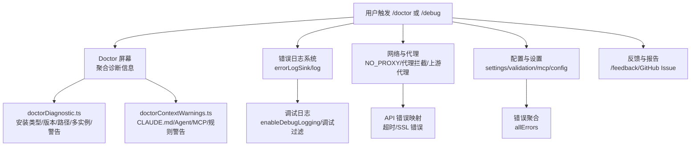
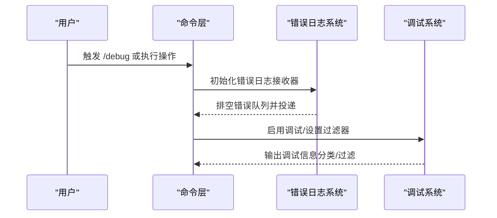
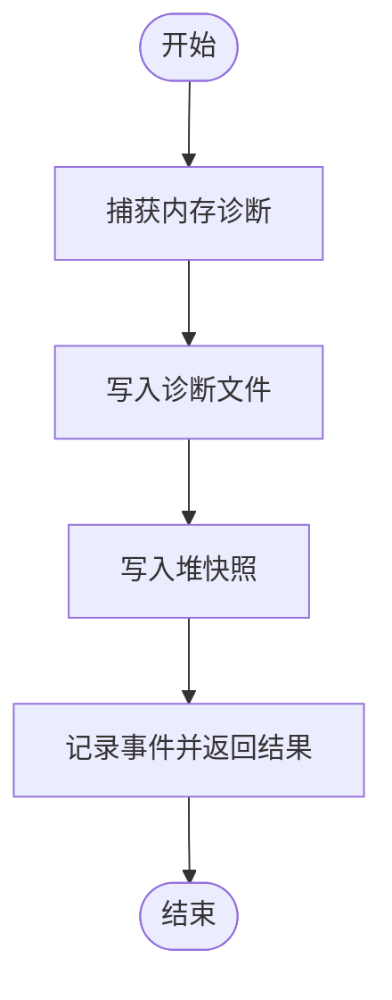
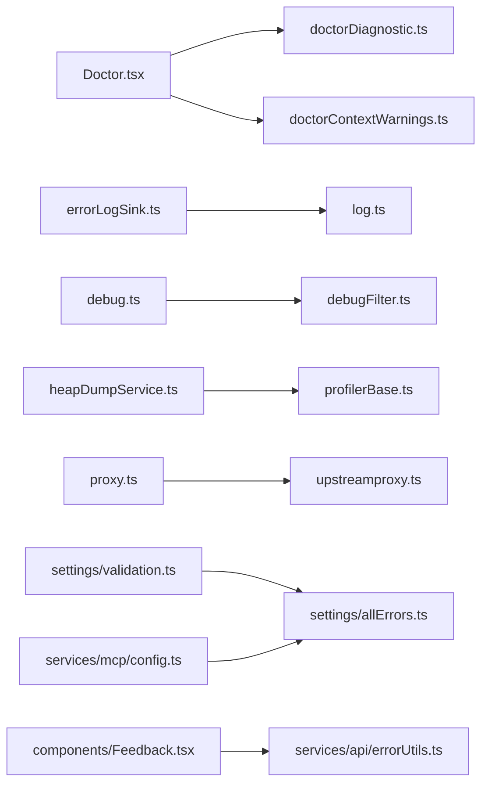

# 故障排除

<cite>
**本文引用的文件**
- [commands/doctor/doctor.tsx](file://commands/doctor/doctor.tsx)
- [screens/Doctor.tsx](file://screens/Doctor.tsx)
- [utils/doctorDiagnostic.ts](file://utils/doctorDiagnostic.ts)
- [utils/doctorContextWarnings.ts](file://utils/doctorContextWarnings.ts)
- [utils/errorLogSink.ts](file://utils/errorLogSink.ts)
- [utils/log.ts](file://utils/log.ts)
- [skills/bundled/debug.ts](file://skills/bundled/debug.ts)
- [utils/debug.ts](file://utils/debug.ts)
- [utils/debugFilter.ts](file://utils/debugFilter.ts)
- [utils/heapDumpService.ts](file://utils/heapDumpService.ts)
- [commands/heapdump/heapdump.ts](file://commands/heapdump/heapdump.ts)
- [utils/profilerBase.ts](file://utils/profilerBase.ts)
- [utils/startupProfiler.ts](file://utils/startupProfiler.ts)
- [utils/proxy.ts](file://utils/proxy.ts)
- [upstreamproxy/upstreamproxy.ts](file://upstreamproxy/upstreamproxy.ts)
- [services/api/errorUtils.ts](file://services/api/errorUtils.ts)
- [utils/fsOperations.ts](file://utils/fsOperations.ts)
- [utils/settings/validation.ts](file://utils/settings/validation.ts)
- [utils/settings/settings.ts](file://utils/settings/settings.ts)
- [services/mcp/config.ts](file://services/mcp/config.ts)
- [utils/settings/allErrors.ts](file://utils/settings/allErrors.ts)
- [commands/feedback/feedback.tsx](file://commands/feedback/feedback.tsx)
- [components/Feedback.tsx](file://components/Feedback.tsx)
</cite>

## 目录
1. [简介](#简介)
2. [项目结构](#项目结构)
3. [核心组件](#核心组件)
4. [架构总览](#架构总览)
5. [详细组件分析](#详细组件分析)
6. [依赖关系分析](#依赖关系分析)
7. [性能考虑](#性能考虑)
8. [故障排除指南](#故障排除指南)
9. [结论](#结论)
10. [附录](#附录)

## 简介
本指南面向 Claude Code 用户与维护者，提供系统化的故障排除方法，覆盖安装问题、配置错误、权限问题、网络与代理、API 访问、文件系统、调试与性能分析、以及用户反馈与问题报告流程。文档基于仓库中的诊断工具、日志系统、错误处理与反馈机制进行梳理，帮助快速定位与解决问题。

## 项目结构
围绕“故障排除”的关键模块分布如下：
- 诊断与健康检查：commands/doctor、screens/Doctor、utils/doctorDiagnostic、utils/doctorContextWarnings
- 日志与错误：utils/errorLogSink、utils/log、skills/bundled/debug、utils/debug、utils/debugFilter
- 性能与内存：utils/profilerBase、utils/startupProfiler、utils/heapDumpService、commands/heapdump
- 网络与代理：utils/proxy、upstreamproxy/upstreamproxy
- 配置与设置：utils/settings/*、services/mcp/config.ts
- 反馈与报告：commands/feedback、components/Feedback

```mermaid
graph TB
subgraph "诊断与健康检查"
A["commands/doctor/doctor.tsx"]
B["screens/Doctor.tsx"]
C["utils/doctorDiagnostic.ts"]
D["utils/doctorContextWarnings.ts"]
end
subgraph "日志与错误"
E["utils/errorLogSink.ts"]
F["utils/log.ts"]
G["skills/bundled/debug.ts"]
H["utils/debug.ts"]
I["utils/debugFilter.ts"]
end
subgraph "性能与内存"
J["utils/profilerBase.ts"]
K["utils/startupProfiler.ts"]
L["utils/heapDumpService.ts"]
M["commands/heapdump/heapdump.ts"]
end
subgraph "网络与代理"
N["utils/proxy.ts"]
O["upstreamproxy/upstreamproxy.ts"]
end
subgraph "配置与设置"
P["utils/settings/validation.ts"]
Q["utils/settings/settings.ts"]
R["services/mcp/config.ts"]
S["utils/settings/allErrors.ts"]
end
subgraph "反馈与报告"
T["commands/feedback/feedback.tsx"]
U["components/Feedback.tsx"]
end
A --> B
B --> C
B --> D
E --> F
G --> H
H --> I
J --> K
L --> M
N --> O
P --> Q
Q --> S
R --> S
T --> U
```

**图示来源**
- [commands/doctor/doctor.tsx:1-7](file://commands/doctor/doctor.tsx#L1-L7)
- [screens/Doctor.tsx:1-575](file://screens/Doctor.tsx#L1-L575)
- [utils/doctorDiagnostic.ts:1-626](file://utils/doctorDiagnostic.ts#L1-L626)
- [utils/doctorContextWarnings.ts:1-266](file://utils/doctorContextWarnings.ts#L1-L266)
- [utils/errorLogSink.ts:212-235](file://utils/errorLogSink.ts#L212-L235)
- [utils/log.ts:96-203](file://utils/log.ts#L96-L203)
- [skills/bundled/debug.ts:31-64](file://skills/bundled/debug.ts#L31-L64)
- [utils/debug.ts:42-136](file://utils/debug.ts#L42-L136)
- [utils/debugFilter.ts:1-157](file://utils/debugFilter.ts#L1-L157)
- [utils/profilerBase.ts:1-46](file://utils/profilerBase.ts#L1-L46)
- [utils/startupProfiler.ts:68-128](file://utils/startupProfiler.ts#L68-L128)
- [utils/heapDumpService.ts:1-278](file://utils/heapDumpService.ts#L1-L278)
- [commands/heapdump/heapdump.ts:1-17](file://commands/heapdump/heapdump.ts#L1-L17)
- [utils/proxy.ts:77-377](file://utils/proxy.ts#L77-L377)
- [upstreamproxy/upstreamproxy.ts:1-71](file://upstreamproxy/upstreamproxy.ts#L1-L71)
- [utils/settings/validation.ts:45-236](file://utils/settings/validation.ts#L45-L236)
- [utils/settings/settings.ts:442-471](file://utils/settings/settings.ts#L442-L471)
- [services/mcp/config.ts:1289-1438](file://services/mcp/config.ts#L1289-L1438)
- [utils/settings/allErrors.ts:1-32](file://utils/settings/allErrors.ts#L1-L32)
- [commands/feedback/feedback.tsx:1-25](file://commands/feedback/feedback.tsx#L1-L25)
- [components/Feedback.tsx:197-407](file://components/Feedback.tsx#L197-L407)

**章节来源**
- [commands/doctor/doctor.tsx:1-7](file://commands/doctor/doctor.tsx#L1-L7)
- [screens/Doctor.tsx:1-575](file://screens/Doctor.tsx#L1-L575)
- [utils/doctorDiagnostic.ts:1-626](file://utils/doctorDiagnostic.ts#L1-L626)

## 核心组件
- 诊断命令与界面：/doctor 命令入口与 Doctor 屏幕，聚合安装类型、版本、路径、多实例、警告、更新策略、ripgrep 状态、环境变量校验、版本锁、Agent 解析错误、插件错误、上下文使用警告等。
- 错误日志与调试：错误日志接收器初始化、错误队列与延迟写入、运行时启用调试、调试过滤器解析与分类匹配、调试日志尾读取。
- 性能与内存：通用性能计时格式化、启动性能报告、堆转储捕获（先写诊断后写快照）、手动/自动触发。
- 网络与代理：NO_PROXY 规则、代理拦截器、上游代理 relay 与 CA 注入、MITM 注意事项。
- 配置与设置：设置文件 JSON 语法与模式校验、MCP 配置解析与错误聚合、受管设置兼容性提示。
- 反馈与报告：反馈对话框与 GitHub Issue 链接生成、错误列表与敏感信息脱敏。

**章节来源**
- [screens/Doctor.tsx:100-502](file://screens/Doctor.tsx#L100-L502)
- [utils/errorLogSink.ts:212-235](file://utils/errorLogSink.ts#L212-L235)
- [utils/log.ts:96-203](file://utils/log.ts#L96-L203)
- [utils/debug.ts:42-136](file://utils/debug.ts#L42-L136)
- [utils/debugFilter.ts:1-157](file://utils/debugFilter.ts#L1-L157)
- [utils/heapDumpService.ts:221-278](file://utils/heapDumpService.ts#L221-L278)
- [utils/profilerBase.ts:1-46](file://utils/profilerBase.ts#L1-L46)
- [utils/proxy.ts:77-377](file://utils/proxy.ts#L77-L377)
- [upstreamproxy/upstreamproxy.ts:1-71](file://upstreamproxy/upstreamproxy.ts#L1-L71)
- [utils/settings/validation.ts:45-236](file://utils/settings/validation.ts#L45-L236)
- [services/mcp/config.ts:1289-1438](file://services/mcp/config.ts#L1289-L1438)
- [components/Feedback.tsx:197-407](file://components/Feedback.tsx#L197-L407)

## 架构总览
下图展示“诊断—日志—网络—配置—反馈”在故障排除中的交互关系。

**图示来源**
- [screens/Doctor.tsx:100-502](file://screens/Doctor.tsx#L100-L502)
- [utils/doctorDiagnostic.ts:514-625](file://utils/doctorDiagnostic.ts#L514-L625)
- [utils/doctorContextWarnings.ts:246-266](file://utils/doctorContextWarnings.ts#L246-L266)
- [utils/errorLogSink.ts:212-235](file://utils/errorLogSink.ts#L212-L235)
- [utils/log.ts:96-203](file://utils/log.ts#L96-L203)
- [utils/debug.ts:64-69](file://utils/debug.ts#L64-L69)
- [utils/proxy.ts:77-377](file://utils/proxy.ts#L77-L377)
- [services/api/errorUtils.ts:204-235](file://services/api/errorUtils.ts#L204-L235)
- [utils/settings/validation.ts:45-236](file://utils/settings/validation.ts#L45-L236)
- [services/mcp/config.ts:1289-1438](file://services/mcp/config.ts#L1289-L1438)
- [utils/settings/allErrors.ts:23-31](file://utils/settings/allErrors.ts#L23-L31)
- [components/Feedback.tsx:197-407](file://components/Feedback.tsx#L197-L407)

## 详细组件分析

### 诊断与 Doctor 屏幕
- 功能要点
  - 安装类型与版本：开发、npm 全局/本地、原生、包管理器安装识别。
  - 路径与二进制：当前调用二进制、实际安装路径、包管理器来源。
  - 多实例检测：同时存在多个安装时给出修复建议。
  - 更新策略：自动更新是否启用及原因、全局安装权限。
  - 搜索工具状态：ripgrep 工作状态与模式（系统/内置/嵌入）。
  - 环境变量校验：对输出长度等关键环境变量进行边界检查。
  - 版本锁：PID 基于锁清理与显示。
  - Agent 解析错误与插件错误：列出失败文件与错误详情。
  - 上下文使用警告：CLAUDE.md 文件过大、Agent 描述过多、MCP 工具上下文过大、不可达权限规则。
- 使用建议
  - 出现“多实例”或“配置不一致”警告时，优先统一安装方式并更新配置。
  - 若 ripgrep 不工作，切换到系统/内置模式或检查路径。

**章节来源**
- [screens/Doctor.tsx:100-502](file://screens/Doctor.tsx#L100-L502)
- [utils/doctorDiagnostic.ts:514-625](file://utils/doctorDiagnostic.ts#L514-L625)
- [utils/doctorContextWarnings.ts:246-266](file://utils/doctorContextWarnings.ts#L246-L266)

### 错误日志与调试
- 错误日志系统
  - 初始化错误日志接收器，支持延迟写入与队列排空。
  - 在未初始化前记录的错误会被暂存，待初始化后立即投递。
- 运行时调试
  - 支持通过命令启用调试（/debug），并可按类别过滤（--debug=...）。
  - 支持将调试输出写入文件或 stderr。
  - 提供调试日志尾读取，避免长会话导致内存暴涨。
- API 错误映射
  - 将底层连接错误映射为用户可理解的提示，如超时、SSL 证书问题等，并记录详细连接信息便于定位。

**图示来源**
- [utils/errorLogSink.ts:212-235](file://utils/errorLogSink.ts#L212-L235)
- [utils/log.ts:96-203](file://utils/log.ts#L96-L203)
- [utils/debug.ts:64-69](file://utils/debug.ts#L64-L69)
- [utils/debugFilter.ts:145-157](file://utils/debugFilter.ts#L145-L157)
- [skills/bundled/debug.ts:31-64](file://skills/bundled/debug.ts#L31-L64)
- [services/api/errorUtils.ts:204-235](file://services/api/errorUtils.ts#L204-L235)

**章节来源**
- [utils/errorLogSink.ts:212-235](file://utils/errorLogSink.ts#L212-L235)
- [utils/log.ts:96-203](file://utils/log.ts#L96-L203)
- [utils/debug.ts:42-136](file://utils/debug.ts#L42-L136)
- [utils/debugFilter.ts:1-157](file://utils/debugFilter.ts#L1-L157)
- [skills/bundled/debug.ts:31-64](file://skills/bundled/debug.ts#L31-L64)
- [services/api/errorUtils.ts:204-235](file://services/api/errorUtils.ts#L204-L235)

### 性能与内存分析
- 启动性能报告
  - 使用 perf_hooks 记录时间线，格式化输出包含 RSS/Heap 信息。
  - 可选详细模式，按检查点输出累计与增量耗时。
- 堆转储
  - 先写诊断信息（避免大堆快照序列化崩溃），再写 heapsnapshot。
  - 自动/手动触发，记录事件属性并返回路径。

**图示来源**
- [utils/heapDumpService.ts:221-278](file://utils/heapDumpService.ts#L221-L278)
- [utils/profilerBase.ts:22-46](file://utils/profilerBase.ts#L22-L46)
- [utils/startupProfiler.ts:68-128](file://utils/startupProfiler.ts#L68-L128)

**章节来源**
- [utils/heapDumpService.ts:221-278](file://utils/heapDumpService.ts#L221-L278)
- [utils/profilerBase.ts:1-46](file://utils/profilerBase.ts#L1-L46)
- [utils/startupProfiler.ts:68-128](file://utils/startupProfiler.ts#L68-L128)

### 网络与代理
- NO_PROXY 规则
  - 支持精确主机名、域后缀（含前导点）、通配符、端口特定匹配、IP 地址。
- 代理拦截
  - Axios 请求拦截器根据 NO_PROXY 决定绕过代理或使用代理代理。
  - 设置全局 Dispatcher 以尊重 NO_PROXY。
- 上游代理
  - 在容器中下载并拼接 CA，注入 HTTPS_PROXY/SSL_CERT_FILE。
  - 明确不应拦截的主机（环回、RFC1918、IMDS、Anthropic API、常用注册表与 GitHub）。

**章节来源**
- [utils/proxy.ts:77-377](file://utils/proxy.ts#L77-L377)
- [upstreamproxy/upstreamproxy.ts:1-71](file://upstreamproxy/upstreamproxy.ts#L1-L71)

### 配置与设置
- 设置文件校验
  - JSON 语法错误与模式校验，返回可读错误与修复建议。
  - 对 MCP 配置错误进行聚合，区分致命与警告级别。
- 受管设置兼容性
  - 对未知字段进行兼容处理并提示管理员注意。
- 设置合并与回退
  - 当严格校验失败但原始内容为有效 JSON 时，采用原始内容并记录调试信息。

**章节来源**
- [utils/settings/validation.ts:45-236](file://utils/settings/validation.ts#L45-L236)
- [utils/settings/settings.ts:442-471](file://utils/settings/settings.ts#L442-L471)
- [services/mcp/config.ts:1289-1438](file://services/mcp/config.ts#L1289-L1438)
- [utils/settings/allErrors.ts:23-31](file://utils/settings/allErrors.ts#L23-L31)

### 反馈与报告
- 反馈对话框
  - 收集消息、错误、最后 API 请求、子代理转录等，生成结构化报告。
  - 支持敏感信息脱敏与错误列表 JSON。
- GitHub Issue 链接
  - 自动生成带标题、标签与正文的链接，包含环境信息与错误 JSON。
  - 提供取消/完成后的系统提示与反馈 ID。

**章节来源**
- [components/Feedback.tsx:197-407](file://components/Feedback.tsx#L197-L407)
- [commands/feedback/feedback.tsx:1-25](file://commands/feedback/feedback.tsx#L1-L25)

## 依赖关系分析
- Doctor 屏幕依赖 doctorDiagnostic 与 doctorContextWarnings 获取诊断与上下文警告。
- 错误日志系统依赖日志模块与调试模块，调试模块依赖过滤器模块。
- 性能模块共享基础格式化工具；堆转储依赖会话 ID 与桌面路径。
- 网络模块依赖代理拦截与上游代理；API 错误映射依赖连接细节提取。
- 配置模块之间存在循环依赖，通过 allErrors 模块解耦。
- 反馈模块依赖消息与错误列表，生成 GitHub Issue 链接。

**图示来源**
- [screens/Doctor.tsx:100-502](file://screens/Doctor.tsx#L100-L502)
- [utils/doctorDiagnostic.ts:514-625](file://utils/doctorDiagnostic.ts#L514-L625)
- [utils/doctorContextWarnings.ts:246-266](file://utils/doctorContextWarnings.ts#L246-L266)
- [utils/errorLogSink.ts:212-235](file://utils/errorLogSink.ts#L212-L235)
- [utils/log.ts:96-203](file://utils/log.ts#L96-L203)
- [utils/debug.ts:42-136](file://utils/debug.ts#L42-L136)
- [utils/debugFilter.ts:1-157](file://utils/debugFilter.ts#L1-L157)
- [utils/heapDumpService.ts:1-278](file://utils/heapDumpService.ts#L1-L278)
- [utils/profilerBase.ts:1-46](file://utils/profilerBase.ts#L1-L46)
- [utils/proxy.ts:77-377](file://utils/proxy.ts#L77-L377)
- [upstreamproxy/upstreamproxy.ts:1-71](file://upstreamproxy/upstreamproxy.ts#L1-L71)
- [utils/settings/validation.ts:45-236](file://utils/settings/validation.ts#L45-L236)
- [utils/settings/allErrors.ts:1-32](file://utils/settings/allErrors.ts#L1-L32)
- [services/mcp/config.ts:1289-1438](file://services/mcp/config.ts#L1289-L1438)
- [components/Feedback.tsx:197-407](file://components/Feedback.tsx#L197-L407)
- [services/api/errorUtils.ts:204-235](file://services/api/errorUtils.ts#L204-L235)

**章节来源**
- [screens/Doctor.tsx:100-502](file://screens/Doctor.tsx#L100-L502)
- [utils/doctorDiagnostic.ts:514-625](file://utils/doctorDiagnostic.ts#L514-L625)
- [utils/doctorContextWarnings.ts:246-266](file://utils/doctorContextWarnings.ts#L246-L266)
- [utils/errorLogSink.ts:212-235](file://utils/errorLogSink.ts#L212-L235)
- [utils/log.ts:96-203](file://utils/log.ts#L96-L203)
- [utils/debug.ts:42-136](file://utils/debug.ts#L42-L136)
- [utils/debugFilter.ts:1-157](file://utils/debugFilter.ts#L1-L157)
- [utils/heapDumpService.ts:1-278](file://utils/heapDumpService.ts#L1-L278)
- [utils/profilerBase.ts:1-46](file://utils/profilerBase.ts#L1-L46)
- [utils/proxy.ts:77-377](file://utils/proxy.ts#L77-L377)
- [upstreamproxy/upstreamproxy.ts:1-71](file://upstreamproxy/upstreamproxy.ts#L1-L71)
- [utils/settings/validation.ts:45-236](file://utils/settings/validation.ts#L45-L236)
- [utils/settings/allErrors.ts:1-32](file://utils/settings/allErrors.ts#L1-L32)
- [services/mcp/config.ts:1289-1438](file://services/mcp/config.ts#L1289-L1438)
- [components/Feedback.tsx:197-407](file://components/Feedback.tsx#L197-L407)
- [services/api/errorUtils.ts:204-235](file://services/api/errorUtils.ts#L204-L235)

## 性能考虑
- 启动性能
  - 使用性能计时与内存快照，定位启动瓶颈；仅在启用详细模式时采集内存数据。
- 大型日志与内存
  - 调试日志采用尾读，避免全量读取；堆转储先写诊断后写快照，降低崩溃风险。
- MCP 工具上下文
  - 当 MCP 工具上下文超过阈值时，建议减少工具数量或拆分服务器，避免上下文膨胀。

[本节为通用指导，无需具体文件引用]

## 故障排除指南

### 一、安装与运行问题
- 症状
  - 多个安装共存、PATH 不正确、配置与实际安装不一致。
- 诊断步骤
  - 运行 /doctor 查看“安装类型/版本/路径/多实例/警告/更新策略/ripgrep 状态”。
  - 若提示“本地安装未被使用”，检查 PATH 或创建别名。
  - 若提示“遗留 npm 安装”，按建议卸载或清理残留目录。
- 解决方案
  - 统一安装方式（推荐原生安装），更新配置与 PATH。
  - 清理多余安装，避免冲突。

**章节来源**
- [screens/Doctor.tsx:100-502](file://screens/Doctor.tsx#L100-L502)
- [utils/doctorDiagnostic.ts:514-625](file://utils/doctorDiagnostic.ts#L514-L625)

### 二、配置错误
- 症状
  - 设置文件 JSON 语法错误、模式校验失败、MCP 配置无效。
- 诊断步骤
  - 使用 Doctor 的“无效设置”区域查看具体字段与错误信息。
  - 检查受管设置文件中未知字段，按提示修正。
- 解决方案
  - 修复 JSON 语法与字段类型；对 MCP 配置逐项验证，必要时分步启用。
  - 若严格校验失败但原始内容有效，系统会采用原始内容并记录调试信息。

**章节来源**
- [utils/settings/validation.ts:45-236](file://utils/settings/validation.ts#L45-L236)
- [utils/settings/settings.ts:442-471](file://utils/settings/settings.ts#L442-L471)
- [services/mcp/config.ts:1289-1438](file://services/mcp/config.ts#L1289-L1438)
- [utils/settings/allErrors.ts:23-31](file://utils/settings/allErrors.ts#L23-L31)

### 三、权限问题
- 症状
  - 文件读写失败、符号链接目标不在允许范围内、Linux 沙箱 glob 模式不支持。
- 诊断步骤
  - 使用 Doctor 的“上下文使用警告”查看不可达权限规则与 MCP 工具上下文过大提示。
  - 检查路径链中所有中间目标与最终解析路径，确保均在允许范围。
- 解决方案
  - 调整权限规则，避免规则被更宽泛规则覆盖。
  - 在 Linux 上避免使用不受支持的 glob 模式；必要时改用更精确的路径。

**章节来源**
- [utils/doctorContextWarnings.ts:246-266](file://utils/doctorContextWarnings.ts#L246-L266)
- [utils/fsOperations.ts:272-342](file://utils/fsOperations.ts#L272-L342)

### 四、网络与代理
- 症状
  - 请求超时、SSL 证书错误、访问受限。
- 诊断步骤
  - 检查 NO_PROXY 是否正确配置，确认是否被代理拦截。
  - 查看 API 错误映射，获取具体错误码与建议。
- 解决方案
  - 正确设置 NO_PROXY 列表；在容器环境中使用上游代理 relay 并注入 CA。
  - 针对 SSL 错误，检查企业代理/自签名证书与主机名匹配。

**章节来源**
- [utils/proxy.ts:77-377](file://utils/proxy.ts#L77-L377)
- [upstreamproxy/upstreamproxy.ts:1-71](file://upstreamproxy/upstreamproxy.ts#L1-L71)
- [services/api/errorUtils.ts:204-235](file://services/api/errorUtils.ts#L204-L235)

### 五、API 访问问题
- 症状
  - 超时、证书验证失败、主机名不匹配、证书过期/吊销。
- 诊断步骤
  - 查看 API 错误映射提示与调试日志中的连接详情。
- 解决方案
  - 检查网络连通性与代理设置；更新证书或调整企业代理配置。

**章节来源**
- [services/api/errorUtils.ts:204-235](file://services/api/errorUtils.ts#L204-L235)
- [utils/debug.ts:42-136](file://utils/debug.ts#L42-L136)

### 六、调试与日志
- 启用调试
  - 通过命令启用调试（/debug），或使用 --debug/--debug-file/--debug-to-stderr。
  - 使用 --debug=category 或 --debug=!exclude 按类别过滤。
- 分析日志
  - 使用调试日志尾读功能查看最近若干行，避免全量读取导致内存压力。
- 错误追踪
  - 初始化错误日志接收器，确保错误不会丢失；在未初始化前记录的错误会被队列排空后投递。

**章节来源**
- [utils/debug.ts:42-136](file://utils/debug.ts#L42-L136)
- [utils/debugFilter.ts:1-157](file://utils/debugFilter.ts#L1-L157)
- [skills/bundled/debug.ts:31-64](file://skills/bundled/debug.ts#L31-L64)
- [utils/errorLogSink.ts:212-235](file://utils/errorLogSink.ts#L212-L235)
- [utils/log.ts:96-203](file://utils/log.ts#L96-L203)

### 七、性能问题
- 识别
  - 使用启动性能报告定位慢点；关注 RSS/Heap 增长。
- 优化
  - 减少 MCP 工具数量或拆分服务器；避免大型上下文；启用详细模式时仅在需要时开启。
- 快速取证
  - 执行 /heapdump 获取堆转储与诊断信息，结合性能报告定位内存热点。

**章节来源**
- [utils/startupProfiler.ts:68-128](file://utils/startupProfiler.ts#L68-L128)
- [utils/profilerBase.ts:22-46](file://utils/profilerBase.ts#L22-L46)
- [utils/heapDumpService.ts:221-278](file://utils/heapDumpService.ts#L221-L278)
- [commands/heapdump/heapdump.ts:1-17](file://commands/heapdump/heapdump.ts#L1-L17)

### 八、用户反馈与问题报告
- 步骤
  - 使用 /feedback 打开反馈对话框，填写描述并提交。
  - 系统生成 GitHub Issue 链接，包含环境信息与错误 JSON。
- 注意
  - 提交前可预览并编辑描述；若组织策略限制，可能无法提交反馈。
  - 保留反馈 ID，便于后续跟踪。

**章节来源**
- [commands/feedback/feedback.tsx:1-25](file://commands/feedback/feedback.tsx#L1-L25)
- [components/Feedback.tsx:197-407](file://components/Feedback.tsx#L197-L407)

## 结论
通过 Doctor 诊断、错误日志与调试、性能与内存工具、网络代理与 API 错误映射、配置校验与反馈报告，可以系统化地定位与解决 Claude Code 的常见问题。建议在复现问题时同步启用调试与堆转储，收集足够的上下文信息后再进行反馈与升级。

[本节为总结，无需具体文件引用]

## 附录

### 常见错误代码与含义
- ETIMEDOUT：请求超时，检查网络与代理设置。
- UNABLE_TO_VERIFY_LEAF_SIGNATURE/UNABLE_TO_GET_ISSUER_CERT/UNABLE_TO_GET_ISSUER_CERT_LOCALLY：SSL 证书验证失败，检查代理或企业证书。
- CERT_HAS_EXPIRED/CERT_REVOKED/CERT_NOT_YET_VALID：证书过期/吊销/尚未生效。
- SELF_SIGNED_CERT_IN_CHAIN/DEPTH_ZERO_SELF_SIGNED_CERT：检测到自签名证书，检查代理或企业证书。
- ERR_TLS_CERT_ALTNAME_INVALID/HOSTNAME_MISMATCH：SSL 证书主机名不匹配。

**章节来源**
- [services/api/errorUtils.ts:204-235](file://services/api/errorUtils.ts#L204-L235)

### 收集诊断信息清单
- Doctor 输出（安装类型、版本、路径、多实例、警告、更新策略、ripgrep 状态、环境变量校验、版本锁、Agent/MCP/插件错误、上下文警告）
- 调试日志尾读（最近若干行）
- 堆转储（堆快照与诊断）
- 反馈报告（含错误 JSON 与环境信息）

**章节来源**
- [screens/Doctor.tsx:100-502](file://screens/Doctor.tsx#L100-L502)
- [skills/bundled/debug.ts:31-64](file://skills/bundled/debug.ts#L31-L64)
- [utils/heapDumpService.ts:221-278](file://utils/heapDumpService.ts#L221-L278)
- [components/Feedback.tsx:197-407](file://components/Feedback.tsx#L197-L407)