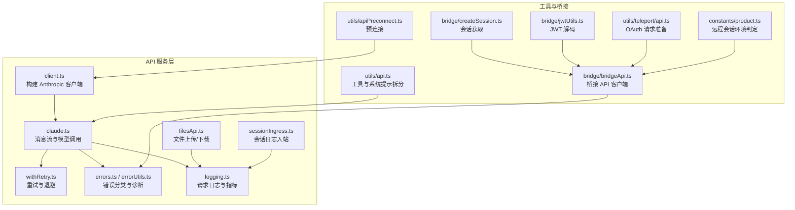
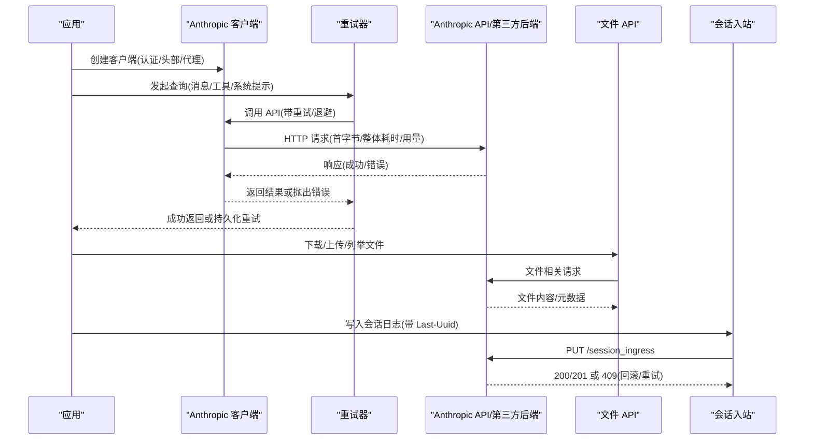
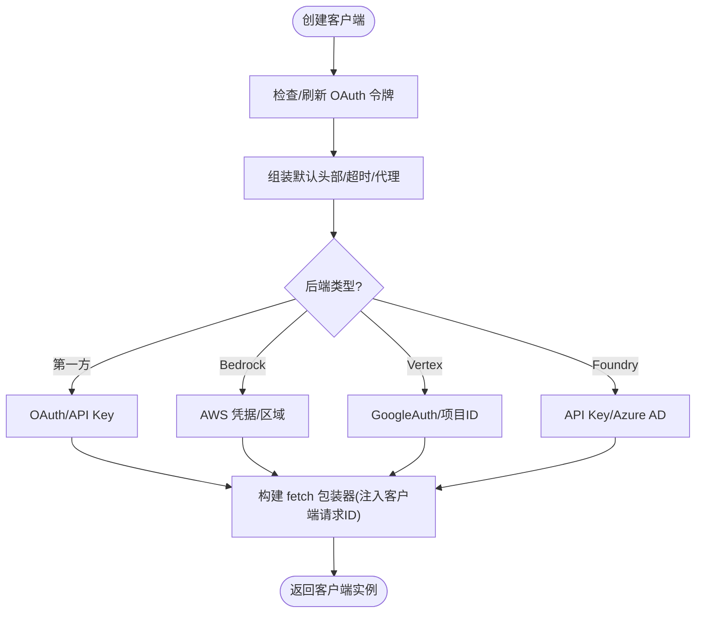
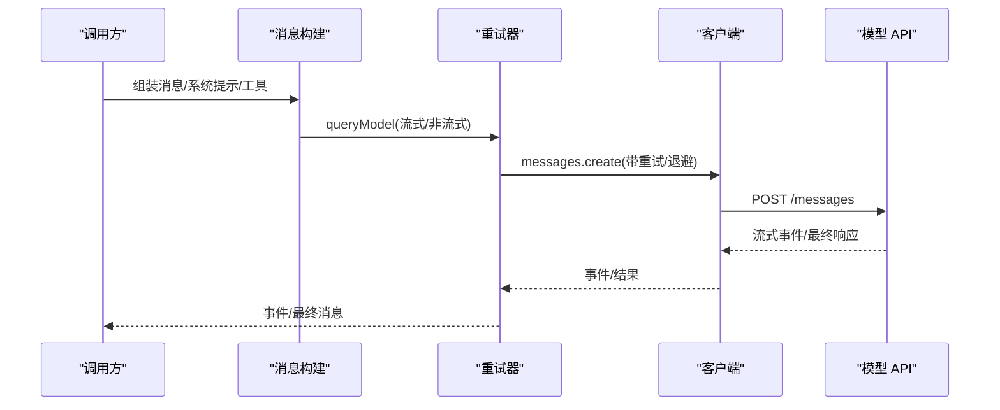
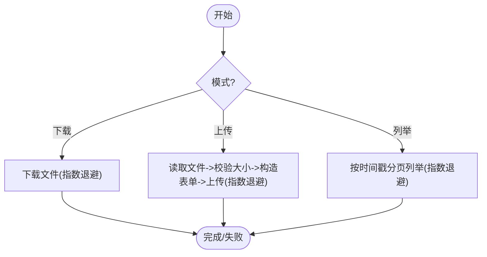
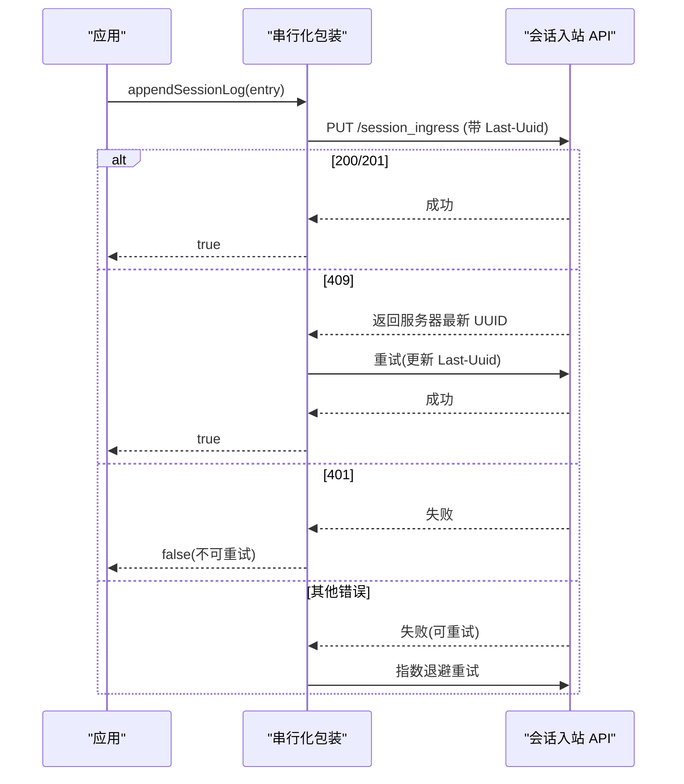
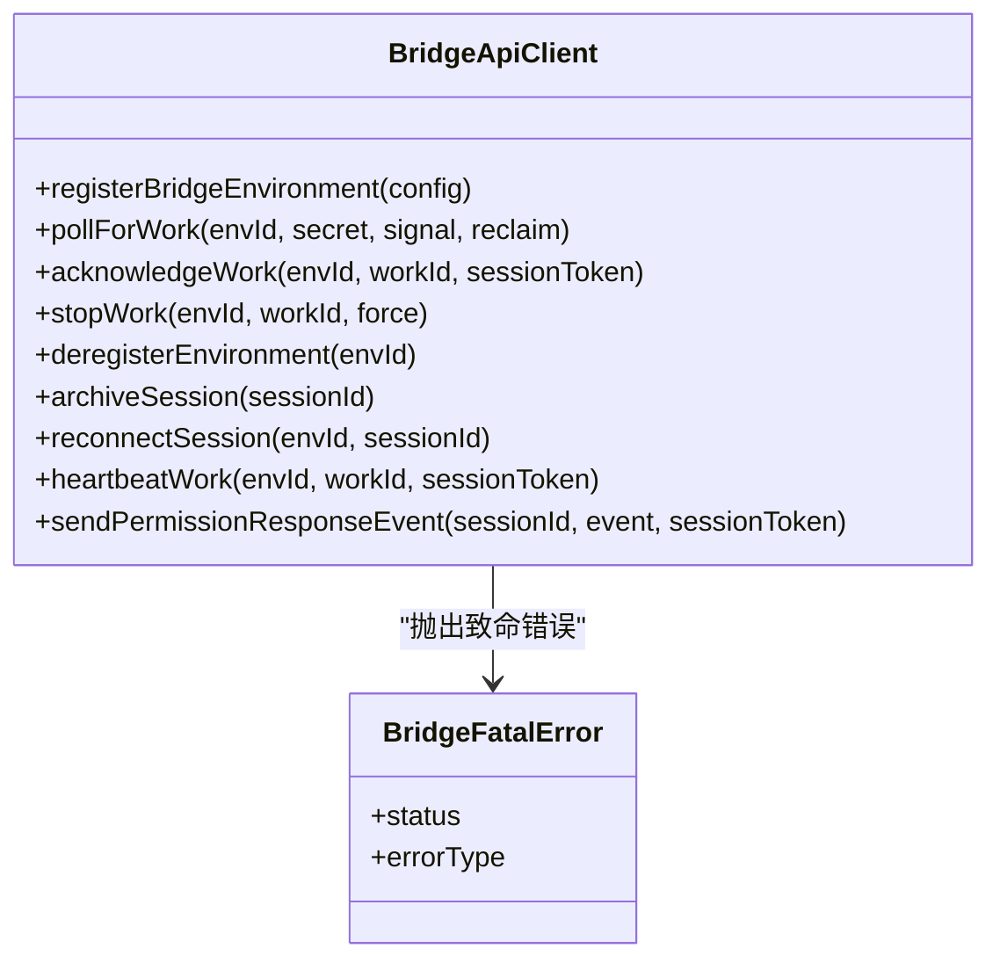
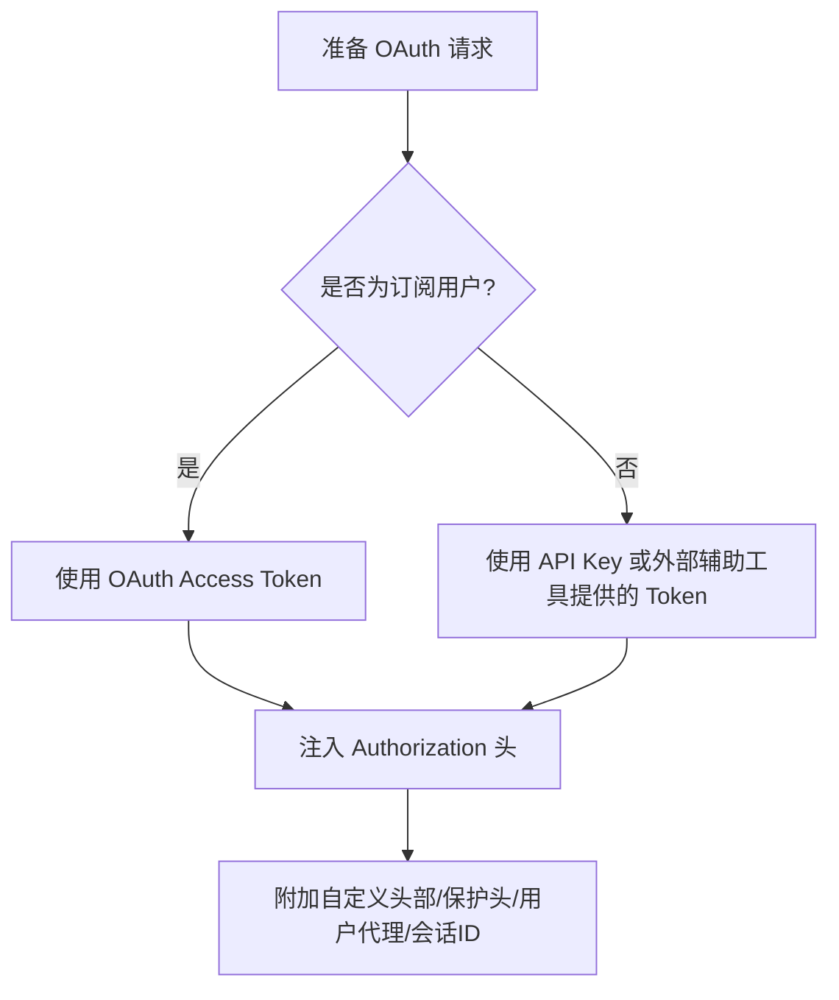
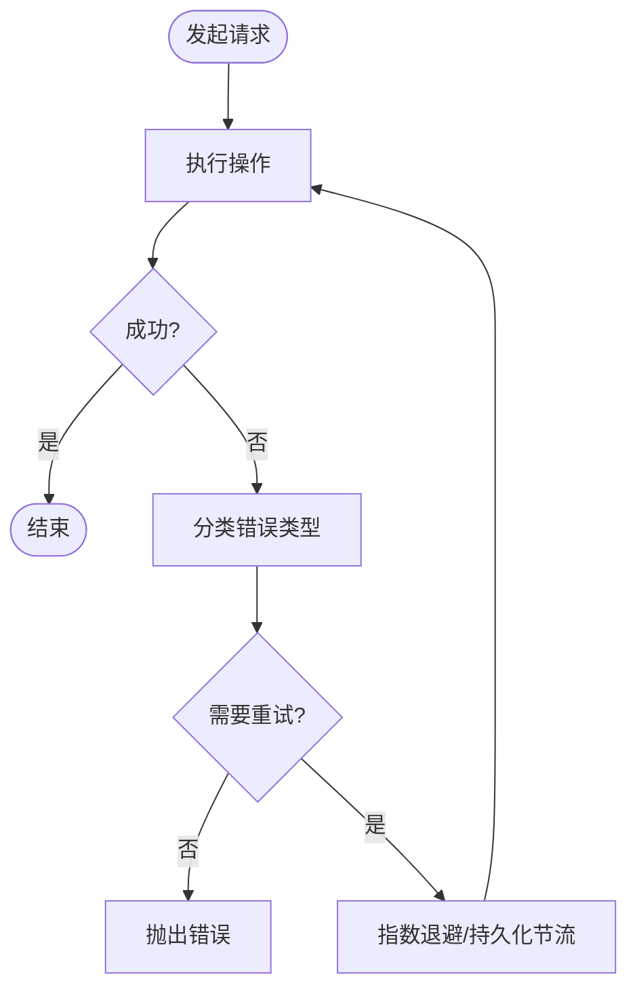
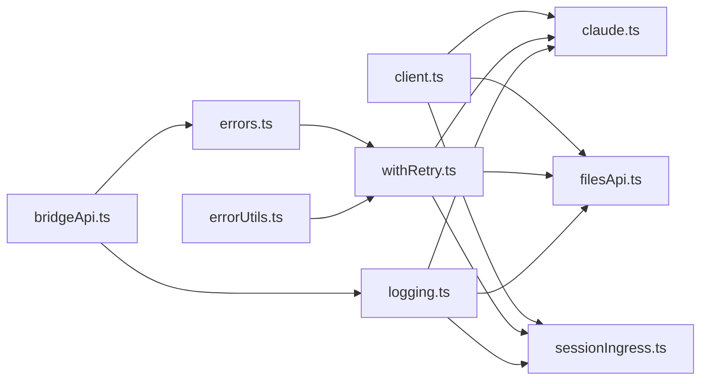

# API 服务

<cite>
**本文引用的文件**
- [services/api/client.ts](file://services/api/client.ts)
- [services/api/claude.ts](file://services/api/claude.ts)
- [services/api/filesApi.ts](file://services/api/filesApi.ts)
- [services/api/sessionIngress.ts](file://services/api/sessionIngress.ts)
- [services/api/withRetry.ts](file://services/api/withRetry.ts)
- [services/api/errors.ts](file://services/api/errors.ts)
- [services/api/errorUtils.ts](file://services/api/errorUtils.ts)
- [services/api/logging.ts](file://services/api/logging.ts)
- [utils/api.ts](file://utils/api.ts)
- [utils/apiPreconnect.ts](file://utils/apiPreconnect.ts)
- [bridge/bridgeApi.ts](file://bridge/bridgeApi.ts)
- [bridge/createSession.ts](file://bridge/createSession.ts)
- [bridge/jwtUtils.ts](file://bridge/jwtUtils.ts)
- [utils/teleport/api.ts](file://utils/teleport/api.ts)
- [constants/product.ts](file://constants/product.ts)
- [main.tsx](file://main.tsx)
</cite>

## 目录
1. [简介](#简介)
2. [项目结构](#项目结构)
3. [核心组件](#核心组件)
4. [架构总览](#架构总览)
5. [详细组件分析](#详细组件分析)
6. [依赖关系分析](#依赖关系分析)
7. [性能考量](#性能考量)
8. [故障排查指南](#故障排查指南)
9. [结论](#结论)
10. [附录：扩展与自定义指南](#附录扩展与自定义指南)

## 简介
本文件面向 Claude Code 的 API 服务系统，系统性阐述其设计架构、请求处理流程与响应管理机制。内容覆盖 Claude API、文件 API、会话 API（含会话入站持久化与遥测）等模块，并提供认证流程、请求头管理、安全与合规、错误处理与重试策略、预连接机制与性能优化建议，以及扩展与自定义 API 服务的方法。

## 项目结构
围绕 API 服务的关键目录与文件如下：
- 服务层 API 模块：services/api 下的客户端、重试、错误、日志、会话入站、文件、Claude 主消息接口等
- 工具与预连接：utils/api.ts（工具与系统提示拆分）、utils/apiPreconnect.ts（预连接）
- 桥接与远程控制：bridge/*（桥接 API 客户端、会话创建、JWT 工具）
- 会话与遥测：services/api/sessionIngress.ts（会话日志入站持久化）、services/api/logging.ts（API 日志与指标）
- 认证与产品环境：utils/teleport/api.ts（OAuth 准备）、constants/product.ts（远程会话环境判定）

**图表来源**
- [services/api/client.ts:88-316](file://services/api/client.ts#L88-L316)
- [services/api/claude.ts:709-800](file://services/api/claude.ts#L709-L800)
- [services/api/withRetry.ts:212-514](file://services/api/withRetry.ts#L212-L514)
- [services/api/errors.ts:1091-1149](file://services/api/errors.ts#L1091-L1149)
- [services/api/errorUtils.ts:204-235](file://services/api/errorUtils.ts#L204-L235)
- [services/api/logging.ts:631-644](file://services/api/logging.ts#L631-L644)
- [services/api/filesApi.ts:1-749](file://services/api/filesApi.ts#L1-L749)
- [services/api/sessionIngress.ts:1-515](file://services/api/sessionIngress.ts#L1-L515)
- [utils/api.ts:119-266](file://utils/api.ts#L119-L266)
- [utils/apiPreconnect.ts:31-72](file://utils/apiPreconnect.ts#L31-L72)
- [bridge/bridgeApi.ts:68-451](file://bridge/bridgeApi.ts#L68-L451)
- [bridge/createSession.ts:190-217](file://bridge/createSession.ts#L190-L217)
- [bridge/jwtUtils.ts:21-32](file://bridge/jwtUtils.ts#L21-L32)
- [utils/teleport/api.ts:181-190](file://utils/teleport/api.ts#L181-L190)
- [constants/product.ts:1-50](file://constants/product.ts#L1-L50)

**章节来源**
- [services/api/client.ts:88-316](file://services/api/client.ts#L88-L316)
- [services/api/claude.ts:709-800](file://services/api/claude.ts#L709-L800)
- [services/api/withRetry.ts:212-514](file://services/api/withRetry.ts#L212-L514)
- [services/api/errors.ts:1091-1149](file://services/api/errors.ts#L1091-L1149)
- [services/api/errorUtils.ts:204-235](file://services/api/errorUtils.ts#L204-L235)
- [services/api/logging.ts:631-644](file://services/api/logging.ts#L631-L644)
- [services/api/filesApi.ts:1-749](file://services/api/filesApi.ts#L1-L749)
- [services/api/sessionIngress.ts:1-515](file://services/api/sessionIngress.ts#L1-L515)
- [utils/api.ts:119-266](file://utils/api.ts#L119-L266)
- [utils/apiPreconnect.ts:31-72](file://utils/apiPreconnect.ts#L31-L72)
- [bridge/bridgeApi.ts:68-451](file://bridge/bridgeApi.ts#L68-L451)
- [bridge/createSession.ts:190-217](file://bridge/createSession.ts#L190-L217)
- [bridge/jwtUtils.ts:21-32](file://bridge/jwtUtils.ts#L21-L32)
- [utils/teleport/api.ts:181-190](file://utils/teleport/api.ts#L181-L190)
- [constants/product.ts:1-50](file://constants/product.ts#L1-L50)

## 核心组件
- 客户端工厂与认证
  - 构建 Anthropic 客户端，支持多后端（第一方、AWS Bedrock、Google Vertex、Microsoft Foundry），自动注入默认头部、用户代理、会话标识、可选自定义头部与代理配置；在非订阅用户场景下注入 Bearer Token。
  - 预连接机制：在初始化阶段对 API 基础地址发起 HEAD 请求以预热 TCP+TLS 握手，减少首次请求延迟。
- 消息与模型调用
  - 统一的消息参数构造、系统提示拆分与缓存控制、工具 Schema 序列化、思考与输出格式控制、任务预算与努力级别等。
- 文件 API
  - 支持下载/上传/列举文件，带指数退避重试、并发限制、路径校验与大小限制、错误分类与分析事件上报。
- 会话入站与遥测
  - 使用 JWT 令牌进行会话日志写入，采用乐观并发控制（Last-Uuid 头部）与序列化队列避免竞态；支持通过 OAuth 获取历史日志或遥测事件。
- 错误处理与重试
  - 统一的错误类型分类（鉴权、配额、服务器、客户端、平台特定等），针对 401/403/429 等状态进行差异化处理；内置指数退避与持久化重试、心跳与持久模式下的节流输出。
- 日志与可观测性
  - 记录请求元数据、网关检测、重试事件、耗时与用量统计，支持客户端请求 ID 关联服务端日志定位。

**章节来源**
- [services/api/client.ts:88-316](file://services/api/client.ts#L88-L316)
- [utils/apiPreconnect.ts:31-72](file://utils/apiPreconnect.ts#L31-L72)
- [services/api/claude.ts:709-800](file://services/api/claude.ts#L709-L800)
- [services/api/filesApi.ts:1-749](file://services/api/filesApi.ts#L1-L749)
- [services/api/sessionIngress.ts:1-515](file://services/api/sessionIngress.ts#L1-L515)
- [services/api/errors.ts:1091-1149](file://services/api/errors.ts#L1091-L1149)
- [services/api/withRetry.ts:212-514](file://services/api/withRetry.ts#L212-L514)
- [services/api/logging.ts:631-644](file://services/api/logging.ts#L631-L644)

## 架构总览
下图展示从应用到 API 的整体调用链路与关键交互点：

**图表来源**
- [services/api/client.ts:88-316](file://services/api/client.ts#L88-L316)
- [services/api/withRetry.ts:212-514](file://services/api/withRetry.ts#L212-L514)
- [services/api/claude.ts:709-800](file://services/api/claude.ts#L709-L800)
- [services/api/filesApi.ts:1-749](file://services/api/filesApi.ts#L1-L749)
- [services/api/sessionIngress.ts:63-186](file://services/api/sessionIngress.ts#L63-L186)

## 详细组件分析

### 客户端与认证（services/api/client.ts）
- 多后端适配
  - 第一方：OAuth 或 API Key；支持自定义基础地址与 OAuth 基础地址切换。
  - AWS Bedrock：可选择跳过认证或使用刷新后的凭据；小模型区域可单独覆盖。
  - Google Vertex：支持跳过认证或使用 GoogleAuth；当未发现项目环境变量时，可回退到配置的项目 ID。
  - Microsoft Foundry：支持 API Key 或 Azure AD Token Provider。
- 默认头部与代理
  - 注入应用标识、用户代理、会话 ID、容器/远程会话标识、可选自定义头部；支持代理选项与调试日志。
- 预连接
  - 在初始化阶段对基础地址发起 HEAD 请求，复用全局连接池，降低首字节延迟。

**图表来源**
- [services/api/client.ts:88-316](file://services/api/client.ts#L88-L316)
- [utils/apiPreconnect.ts:31-72](file://utils/apiPreconnect.ts#L31-L72)

**章节来源**
- [services/api/client.ts:88-316](file://services/api/client.ts#L88-L316)
- [utils/apiPreconnect.ts:31-72](file://utils/apiPreconnect.ts#L31-L72)

### 消息与模型调用（services/api/claude.ts）
- 请求装配
  - 将用户/助手消息转换为 API 参数，支持缓存控制（按全局/组织作用域与 1 小时 TTL）与边界标记拆分。
  - 工具 Schema 序列化与严格模式、细粒度工具输入流式传输、额外体参数与 Beta 头部合并。
- 思考与输出
  - 努力级别、任务预算、结构化输出、思考开关与清理、Advisor 模型集成等。
- 流式与非流式
  - 提供无流式一次性聚合与流式增量事件生成器，统一处理中止、回退与 VCR 录放。

**图表来源**
- [services/api/claude.ts:709-800](file://services/api/claude.ts#L709-L800)
- [services/api/withRetry.ts:212-514](file://services/api/withRetry.ts#L212-L514)
- [utils/api.ts:119-266](file://utils/api.ts#L119-L266)

**章节来源**
- [services/api/claude.ts:709-800](file://services/api/claude.ts#L709-L800)
- [utils/api.ts:119-266](file://utils/api.ts#L119-L266)

### 文件 API（services/api/filesApi.ts）
- 下载
  - 支持指数退避重试、超时、路径规范化与安全校验（防止路径穿越）、并发下载。
- 上传（BYOC）
  - 读取文件后进行大小校验，构造 multipart 表单，支持取消信号与错误分类（认证/权限/过大/网络）。
- 列举（1P/Cloud）
  - 基于时间戳分页拉取文件列表，处理 401/403 等不可重试错误。
- 并发与限速
  - 通过并发限制函数控制吞吐，避免资源争用。

**图表来源**
- [services/api/filesApi.ts:1-749](file://services/api/filesApi.ts#L1-L749)

**章节来源**
- [services/api/filesApi.ts:1-749](file://services/api/filesApi.ts#L1-L749)

### 会话入站与遥测（services/api/sessionIngress.ts）
- 并发控制
  - 按会话 ID 进行串行化写入，避免并发冲突；通过 Last-Uuid 头部实现乐观并发控制。
- 重试与恢复
  - 对 409（并发修改）采用“采用服务器最新 UUID”策略或回退重新拉取；401 视为不可重试；其他 4xx/5xx 可重试。
- 历史获取
  - 支持通过 JWT 直接获取日志，或通过 OAuth 从 Sessions API 获取遥测事件（替代方案）。

**图表来源**
- [services/api/sessionIngress.ts:63-186](file://services/api/sessionIngress.ts#L63-L186)

**章节来源**
- [services/api/sessionIngress.ts:1-515](file://services/api/sessionIngress.ts#L1-L515)

### 桥接 API 与远程控制（bridge/bridgeApi.ts）
- 客户端职责
  - 环境注册、轮询工作、确认与停止工作、环境注销、会话归档/重连、心跳、权限事件上报。
- 认证与重试
  - OAuth 401 自动刷新与单次重试；403/404/410 等致命错误封装为 BridgeFatalError；空轮询计数与调试日志。
- 会话获取
  - 通过会话 ID 获取环境信息（如环境 ID 与标题），使用组织级头部与特定 Beta 头部。

**图表来源**
- [bridge/bridgeApi.ts:68-451](file://bridge/bridgeApi.ts#L68-L451)

**章节来源**
- [bridge/bridgeApi.ts:68-451](file://bridge/bridgeApi.ts#L68-L451)
- [bridge/createSession.ts:190-217](file://bridge/createSession.ts#L190-L217)

### 认证与请求头管理
- OAuth 与 API Key
  - 非订阅用户优先注入 Bearer Token；订阅用户使用 OAuth Access Token；支持自定义头部与附加保护头。
- 会话令牌与 JWT
  - 会话入站使用 JWT 令牌；JWT 工具支持解码负载（剥离前缀）以便诊断。
- OAuth 准备
  - 准备访问令牌与组织 UUID，用于远程控制与会话 API。

**图表来源**
- [services/api/client.ts:318-328](file://services/api/client.ts#L318-L328)
- [bridge/jwtUtils.ts:21-32](file://bridge/jwtUtils.ts#L21-L32)
- [utils/teleport/api.ts:181-190](file://utils/teleport/api.ts#L181-L190)

**章节来源**
- [services/api/client.ts:318-328](file://services/api/client.ts#L318-L328)
- [bridge/jwtUtils.ts:21-32](file://bridge/jwtUtils.ts#L21-L32)
- [utils/teleport/api.ts:181-190](file://utils/teleport/api.ts#L181-L190)

### 错误处理与重试（services/api/withRetry.ts, errors.ts, errorUtils.ts）
- 分类与映射
  - 针对鉴权、配额、平台特定（Bedrock/Vertex/OAuth）等错误进行分类，便于 UI 与诊断。
- 重试策略
  - 指数退避、最大重试次数、持久化重试模式（长等待期间周期性输出心跳）、对特定错误（如 ECONNRESET/EPIPE）禁用 keep-alive。
- 诊断与追踪
  - 记录客户端请求 ID、错误详情、重试事件、网关检测与用量统计。

**图表来源**
- [services/api/withRetry.ts:212-514](file://services/api/withRetry.ts#L212-L514)
- [services/api/errors.ts:1091-1149](file://services/api/errors.ts#L1091-L1149)
- [services/api/errorUtils.ts:204-235](file://services/api/errorUtils.ts#L204-L235)

**章节来源**
- [services/api/withRetry.ts:212-514](file://services/api/withRetry.ts#L212-L514)
- [services/api/errors.ts:1091-1149](file://services/api/errors.ts#L1091-L1149)
- [services/api/errorUtils.ts:204-235](file://services/api/errorUtils.ts#L204-L235)

### 日志与可观测性（services/api/logging.ts）
- 记录内容
  - 请求元数据、重试事件、耗时、用量、网关检测、客户端请求 ID、前一次请求 ID、Beta 头部等。
- 诊断与追踪
  - 通过客户端请求 ID 与服务端日志关联，便于问题定位。

**章节来源**
- [services/api/logging.ts:284-301](file://services/api/logging.ts#L284-L301)
- [services/api/logging.ts:631-644](file://services/api/logging.ts#L631-L644)

## 依赖关系分析
- 组件耦合
  - 客户端工厂被消息模块与文件/会话模块广泛依赖；重试器贯穿所有外部调用；错误分类与日志模块为横切关注点。
- 外部依赖
  - 第一方 API、AWS SDK、Google Auth Library、Azure Identity、HTTP 客户端（axios/fetch）。
- 循环依赖
  - 通过模块化拆分与延迟导入避免循环依赖（例如桥接 API 中对工具模块的动态导入）。

**图表来源**
- [services/api/client.ts:88-316](file://services/api/client.ts#L88-L316)
- [services/api/claude.ts:709-800](file://services/api/claude.ts#L709-L800)
- [services/api/filesApi.ts:1-749](file://services/api/filesApi.ts#L1-L749)
- [services/api/sessionIngress.ts:1-515](file://services/api/sessionIngress.ts#L1-L515)
- [services/api/withRetry.ts:212-514](file://services/api/withRetry.ts#L212-L514)
- [services/api/errors.ts:1091-1149](file://services/api/errors.ts#L1091-L1149)
- [services/api/errorUtils.ts:204-235](file://services/api/errorUtils.ts#L204-L235)
- [services/api/logging.ts:631-644](file://services/api/logging.ts#L631-L644)
- [bridge/bridgeApi.ts:68-451](file://bridge/bridgeApi.ts#L68-L451)

**章节来源**
- [services/api/client.ts:88-316](file://services/api/client.ts#L88-L316)
- [services/api/claude.ts:709-800](file://services/api/claude.ts#L709-L800)
- [services/api/filesApi.ts:1-749](file://services/api/filesApi.ts#L1-L749)
- [services/api/sessionIngress.ts:1-515](file://services/api/sessionIngress.ts#L1-L515)
- [services/api/withRetry.ts:212-514](file://services/api/withRetry.ts#L212-L514)
- [services/api/errors.ts:1091-1149](file://services/api/errors.ts#L1091-L1149)
- [services/api/errorUtils.ts:204-235](file://services/api/errorUtils.ts#L204-L235)
- [services/api/logging.ts:631-644](file://services/api/logging.ts#L631-L644)
- [bridge/bridgeApi.ts:68-451](file://bridge/bridgeApi.ts#L68-L451)

## 性能考量
- 预连接
  - 在初始化阶段对 API 基础地址发起 HEAD 请求，复用全局连接池，显著降低首次请求握手延迟。
- 并发与限速
  - 文件上传/下载采用并发限制，避免资源争用与抖动。
- 重试与退避
  - 指数退避与最大重试上限，结合持久化重试的心跳输出，平衡可靠性与用户体验。
- 缓存与系统提示拆分
  - 通过边界标记与作用域（全局/组织）控制缓存，减少重复计算与网络往返。

**章节来源**
- [utils/apiPreconnect.ts:31-72](file://utils/apiPreconnect.ts#L31-L72)
- [services/api/filesApi.ts:280-307](file://services/api/filesApi.ts#L280-L307)
- [services/api/withRetry.ts:212-514](file://services/api/withRetry.ts#L212-L514)
- [utils/api.ts:321-434](file://utils/api.ts#L321-L434)

## 故障排查指南
- 常见错误与处理
  - 401/403：检查认证状态与令牌有效性；OAuth 401 可触发刷新并重试；403 可能为权限不足或会话过期。
  - 429：速率限制，适当降低请求频率或启用持久化重试。
  - SSL/TLS：根据错误代码给出具体提示（证书过期、吊销、主机名不匹配等）。
  - 会话入站 409：采用服务器最新 UUID 后重试；若无法确定服务器状态则记录并放弃。
- 诊断技巧
  - 开启调试日志，记录客户端请求 ID，结合服务端日志进行关联定位。
  - 使用预连接与并发限制观察网络波动与资源争用。

**章节来源**
- [services/api/errors.ts:1091-1149](file://services/api/errors.ts#L1091-L1149)
- [services/api/errorUtils.ts:204-235](file://services/api/errorUtils.ts#L204-L235)
- [services/api/sessionIngress.ts:90-148](file://services/api/sessionIngress.ts#L90-L148)
- [services/api/logging.ts:284-301](file://services/api/logging.ts#L284-L301)

## 结论
该 API 服务系统通过统一的客户端工厂、完善的重试与错误分类、可观测的日志体系，以及针对不同后端的适配与预连接优化，实现了高可靠、高性能且易于扩展的对外服务。文件与会话入站模块进一步完善了数据生命周期管理。建议在生产环境中结合持久化重试、并发限制与缓存策略，持续监控与优化关键路径。

## 附录：扩展与自定义指南
- 新增 API 服务
  - 在 services/api 下新增模块，遵循现有错误分类与日志规范；对可重试场景使用 withRetry.ts；对并发写入使用 sessionIngress 的串行化与 Last-Uuid 控制。
- 自定义客户端行为
  - 通过环境变量与默认头部扩展（如自定义 Beta 头部、代理、超时）；必要时提供 fetch 包装器注入客户端请求 ID。
- 远程控制与桥接
  - 使用 bridge/bridgeApi.ts 的客户端接口进行环境注册、轮询与工作管理；注意 401/403 的致命错误处理与空轮询计数。
- 会话与遥测
  - 使用 sessionIngress 进行日志写入；通过 OAuth 获取历史日志或遥测事件作为回退方案。

**章节来源**
- [services/api/withRetry.ts:212-514](file://services/api/withRetry.ts#L212-L514)
- [services/api/sessionIngress.ts:1-515](file://services/api/sessionIngress.ts#L1-L515)
- [bridge/bridgeApi.ts:68-451](file://bridge/bridgeApi.ts#L68-L451)
- [services/api/client.ts:356-389](file://services/api/client.ts#L356-L389)