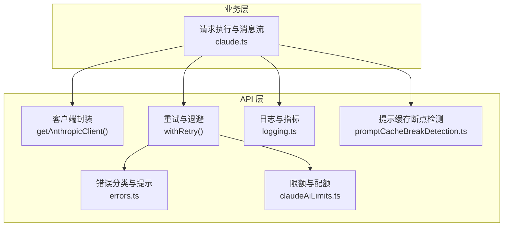
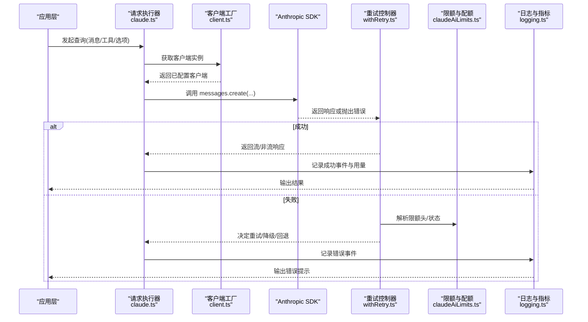
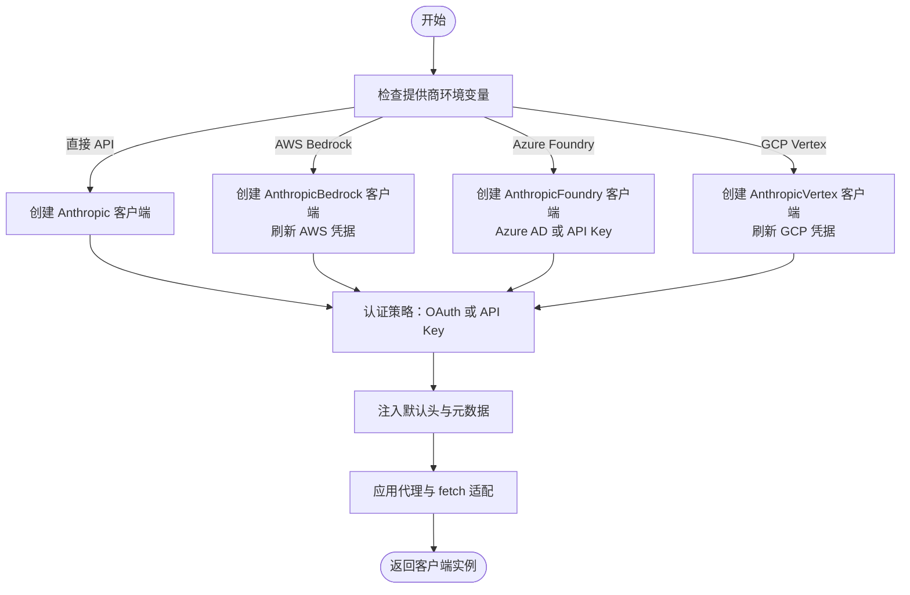
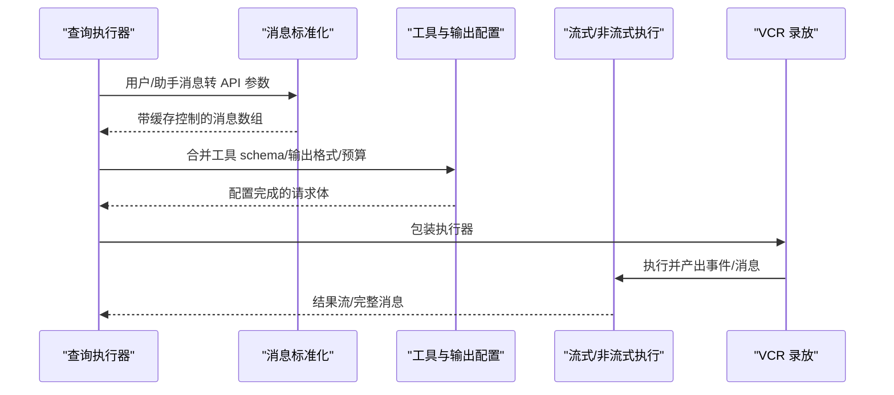
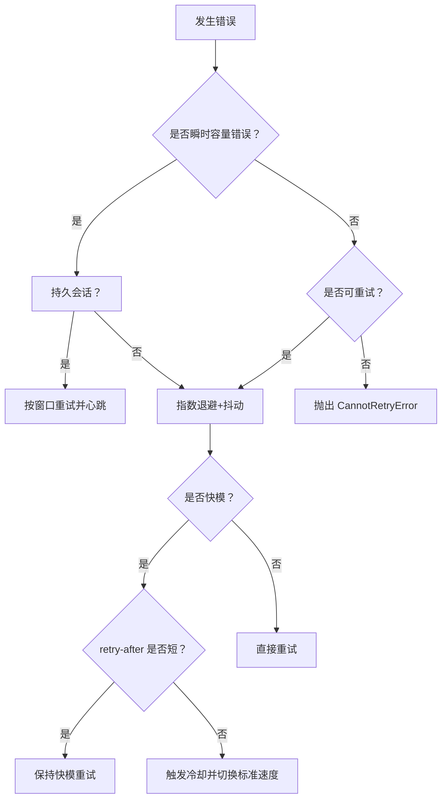
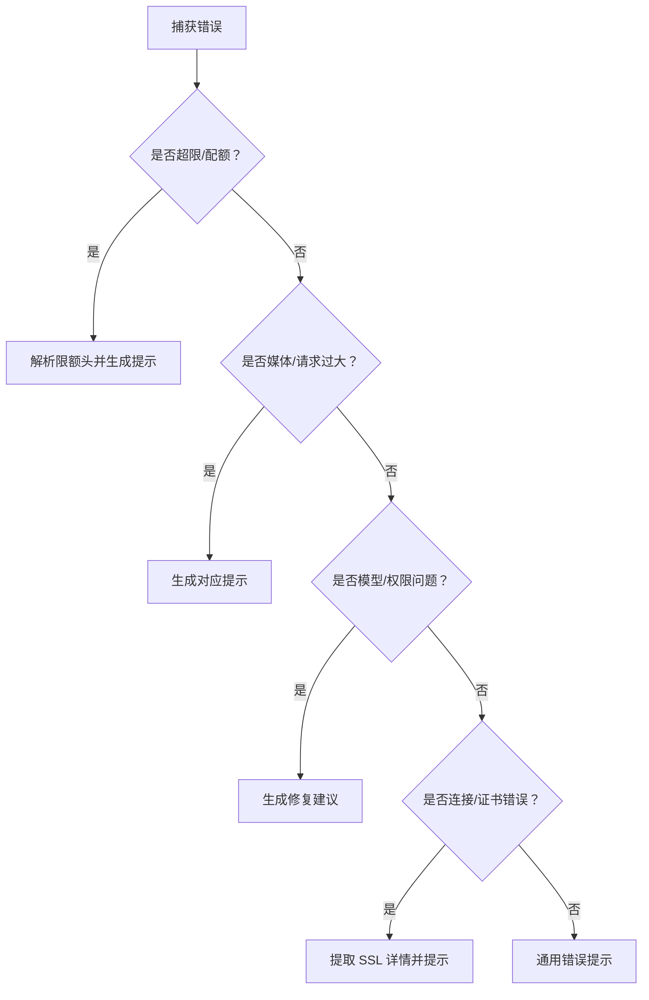
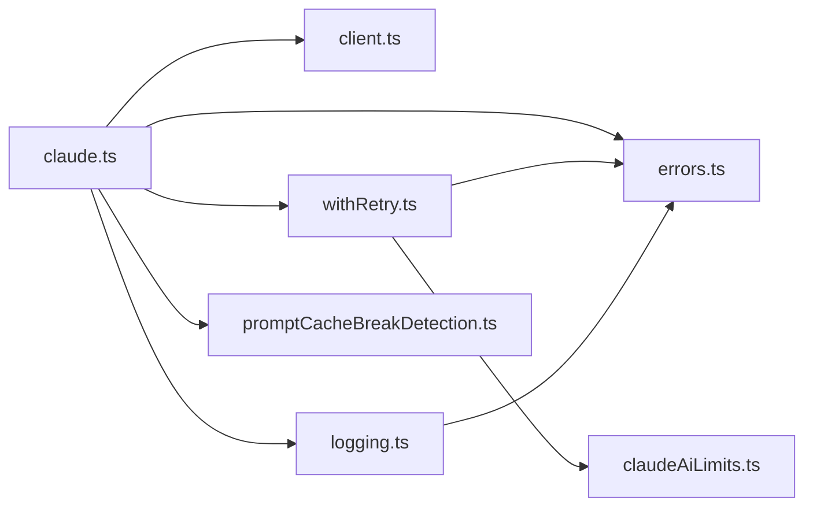

# Claude API 服务

<cite>
**本文引用的文件**
- [README.md](file://README.md)
- [services/api/claude.ts](file://services/api/claude.ts)
- [services/api/client.ts](file://services/api/client.ts)
- [services/api/withRetry.ts](file://services/api/withRetry.ts)
- [services/api/errors.ts](file://services/api/errors.ts)
- [services/api/logging.ts](file://services/api/logging.ts)
- [services/api/errorUtils.ts](file://services/api/errorUtils.ts)
- [services/api/promptCacheBreakDetection.ts](file://services/api/promptCacheBreakDetection.ts)
- [services/claudeAiLimits.ts](file://services/claudeAiLimits.ts)
</cite>

## 目录
1. [简介](#简介)
2. [项目结构](#项目结构)
3. [核心组件](#核心组件)
4. [架构总览](#架构总览)
5. [详细组件分析](#详细组件分析)
6. [依赖关系分析](#依赖关系分析)
7. [性能考量](#性能考量)
8. [故障排查指南](#故障排查指南)
9. [结论](#结论)
10. [附录](#附录)

## 简介
本文件面向 Claude API 服务的使用者与维护者，系统性阐述客户端实现架构、请求构建、响应处理与错误管理机制；详述与 Anthropic Claude API 的集成方式（认证流程、请求格式、响应解析）；提供文本生成、消息对话与工具调用等常见场景的使用指引；解释重试机制、超时处理与速率限制策略；并给出扩展指南与自定义请求处理器的开发方法。

## 项目结构
该仓库是 Anthropic Claude Code 的源码备份，其中 Claude API 服务位于 services/api 目录下，围绕以下关键模块组织：
- 客户端封装：统一创建 Anthropic SDK 客户端实例，支持多提供商（直接 API、AWS Bedrock、Azure Foundry、GCP Vertex），自动注入认证与通用头信息。
- 请求执行：将消息与工具参数标准化为 API 请求体，支持流式与非流式两种模式，内置 VCR 录放能力。
- 重试与退避：基于状态码、头部与错误类型进行智能重试，支持快模降级、持久会话重试与容量过载处理。
- 错误分类与提示：针对不同错误类型（超限、媒体过大、模型不可用、并发工具调用问题等）生成用户可读提示，并记录诊断信息。
- 日志与指标：记录查询、成功与失败事件，统计耗时、用量与成本，支持遥测与可观测性。
- 提示缓存断点检测：追踪系统提示、工具与参数变化，定位服务器端提示缓存未命中原因。
- 限额与配额：解析统一限额头，计算早鸟预警与配额状态，驱动 UI 与行为调整。

图示来源
- [services/api/claude.ts:709-780](file://services/api/claude.ts#L709-L780)
- [services/api/client.ts:88-316](file://services/api/client.ts#L88-L316)
- [services/api/withRetry.ts:170-517](file://services/api/withRetry.ts#L170-L517)
- [services/api/errors.ts:425-787](file://services/api/errors.ts#L425-L787)
- [services/api/logging.ts:171-788](file://services/api/logging.ts#L171-L788)
- [services/api/promptCacheBreakDetection.ts:247-666](file://services/api/promptCacheBreakDetection.ts#L247-L666)
- [services/claudeAiLimits.ts:220-515](file://services/claudeAiLimits.ts#L220-L515)

章节来源
- [README.md:1-463](file://README.md#L1-L463)

## 核心组件
- 客户端工厂：根据环境变量与认证状态选择合适的提供商与认证方式，注入默认头、会话标识、代理配置与调试日志。
- 请求执行器：将消息数组标准化为 API 参数，按需添加缓存控制，支持工具 schema 注入与输出格式约束。
- 重试控制器：依据错误类型、速率限制头与状态码决定是否重试、何时退避、是否切换到标准速度或触发模型回退。
- 错误分类器：将底层 API 错误映射为用户可读提示，区分超限、媒体限制、并发工具调用、无效模型名等场景。
- 日志与指标：记录查询、成功与失败事件，统计 TTFT、耗时、用量、成本与网关类型，支持 OTel 导出。
- 提示缓存断点检测：在调用前后对比系统提示、工具集合与参数，定位缓存未命中的真实原因。
- 限额与配额：解析统一限额头，计算早鸟预警阈值，更新当前限额状态并广播变更。

章节来源
- [services/api/client.ts:88-316](file://services/api/client.ts#L88-L316)
- [services/api/claude.ts:709-780](file://services/api/claude.ts#L709-L780)
- [services/api/withRetry.ts:170-517](file://services/api/withRetry.ts#L170-L517)
- [services/api/errors.ts:425-787](file://services/api/errors.ts#L425-L787)
- [services/api/logging.ts:171-788](file://services/api/logging.ts#L171-L788)
- [services/api/promptCacheBreakDetection.ts:247-666](file://services/api/promptCacheBreakDetection.ts#L247-L666)
- [services/claudeAiLimits.ts:220-515](file://services/claudeAiLimits.ts#L220-L515)

## 架构总览
下图展示从应用层发起一次 Claude API 请求到最终返回消息的完整链路，包括认证、重试、错误处理与日志指标。

图示来源
- [services/api/claude.ts:709-780](file://services/api/claude.ts#L709-L780)
- [services/api/client.ts:88-316](file://services/api/client.ts#L88-L316)
- [services/api/withRetry.ts:170-517](file://services/api/withRetry.ts#L170-L517)
- [services/claudeAiLimits.ts:454-515](file://services/claudeAiLimits.ts#L454-L515)
- [services/api/logging.ts:581-788](file://services/api/logging.ts#L581-L788)

## 详细组件分析

### 客户端工厂与认证集成
- 多提供商支持：通过环境变量自动选择直接 API、AWS Bedrock、Azure Foundry 或 GCP Vertex；在 Bedrock/Vertex 场景中刷新凭据或设置令牌提供者。
- 认证策略：订阅用户走 OAuth 令牌；非订阅用户优先使用 API Key，其次尝试外部密钥助手；支持自定义 Authorization 头与附加保护头。
- 默认头与元数据：注入会话 ID、用户代理、容器 ID、远程会话 ID、客户端应用标识等；在首方 API 上额外注入客户端请求 ID 以关联超时场景。
- 代理与网络：支持代理转发与调试日志；在特定错误（如连接复位）时禁用 keep-alive 并重连。

图示来源
- [services/api/client.ts:88-316](file://services/api/client.ts#L88-L316)

章节来源
- [services/api/client.ts:88-316](file://services/api/client.ts#L88-L316)

### 请求构建与消息流
- 消息标准化：将用户与助手消息转换为 API 参数，支持为文本块添加缓存控制；在需要时克隆内容避免重复修改。
- 工具与输出：合并工具 schema，支持结构化输出格式与任务预算；根据模型能力启用 effort 与快模参数。
- 流式与非流式：提供流式与非流式两种执行路径，均支持 VCR 录放；非流式模式收集完整响应后返回。
- 元数据与追踪：注入用户 ID、会话 ID、账户 UUID 等元数据，便于审计与追踪。

图示来源
- [services/api/claude.ts:588-780](file://services/api/claude.ts#L588-L780)

章节来源
- [services/api/claude.ts:588-780](file://services/api/claude.ts#L588-L780)

### 重试机制与退避策略
- 触发条件：连接错误、超时、408/409、429/529（容量过载）、5xx、以及特定业务错误（如上下文溢出）。
- 退避算法：指数退避加抖动，支持最大退避时间；持久会话模式下按固定窗口重试并周期性心跳。
- 快模降级：当 429/529 且 retry-after 较短时保持快模以保留提示缓存；较长则进入冷却并切换到标准速度。
- 模型回退：连续多次 529 且满足条件时触发 Opus → Sonnet 回退，记录事件并抛出回退异常。
- 认证刷新：遇到 401/403 或云平台认证错误时刷新令牌或清除缓存后重试。

图示来源
- [services/api/withRetry.ts:170-517](file://services/api/withRetry.ts#L170-L517)

章节来源
- [services/api/withRetry.ts:170-517](file://services/api/withRetry.ts#L170-L517)

### 错误分类与用户提示
- 超限与配额：解析统一限额头，生成早鸟预警与配额状态；对 429/529 给出具体原因与建议。
- 媒体与请求大小：针对图片过大、PDF 页数超限、请求体超大等情况生成明确提示。
- 模型与权限：对无效模型名、订阅计划不匹配、工具并发错误等场景提供修复建议。
- 连接与证书：提取 SSL/TLS 错误详情，给出企业代理与证书配置建议。

图示来源
- [services/api/errors.ts:425-787](file://services/api/errors.ts#L425-L787)
- [services/api/errorUtils.ts:42-260](file://services/api/errorUtils.ts#L42-L260)

章节来源
- [services/api/errors.ts:425-787](file://services/api/errors.ts#L425-L787)
- [services/api/errorUtils.ts:42-260](file://services/api/errorUtils.ts#L42-L260)

### 日志与指标
- 查询日志：记录模型、温度、beta 头、思考类型、努力等级、快模状态、来源与链路追踪等。
- 成功事件：统计输入/输出/缓存读写令牌、TTFT、耗时、尝试次数、成本、网关类型、全局缓存策略等。
- 失败事件：记录错误类型、状态码、客户端请求 ID、重试次数、提示类别、来源与链路追踪等。
- 遥测导出：支持 OTLP 事件导出，便于集中观测。

章节来源
- [services/api/logging.ts:171-788](file://services/api/logging.ts#L171-L788)

### 提示缓存断点检测
- 跟踪维度：系统提示哈希、工具集合哈希、缓存控制哈希、工具名称与 schema 哈希、模型、快模状态、全局缓存策略、beta 头、自动模式、配额状态、effort 值、额外请求体等。
- 断点判定：比较前后两次缓存读取令牌，若显著下降且满足阈值，则结合变更清单与时间间隔推断原因（如 TTL 到期、工具变更、参数翻转等）。
- 可视化辅助：在调试模式下生成 diff 文件，帮助定位变更。

章节来源
- [services/api/promptCacheBreakDetection.ts:247-666](file://services/api/promptCacheBreakDetection.ts#L247-L666)

### 限额与配额
- 头解析：统一限额头包括状态、重置时间、代表配额类型、超额状态、超额重置时间与禁用原因等。
- 早鸟预警：基于“利用率×时间占比”阈值与“surpassed-threshold”头双重检测，提前告警。
- 状态广播：变更时通过监听器通知 UI 与后续逻辑，支持持久化缓存超额禁用原因。

章节来源
- [services/claudeAiLimits.ts:220-515](file://services/claudeAiLimits.ts#L220-L515)

## 依赖关系分析
- 组件耦合
  - 请求执行器依赖客户端工厂、重试控制器、错误分类器、日志模块与提示缓存检测。
  - 重试控制器依赖认证刷新、限额解析与错误工具。
  - 日志模块依赖遥测与分析事件。
- 外部依赖
  - Anthropic SDK（含 Bedrock/Foundry/Vertex 支持）
  - 云平台 SDK（AWS/GCP/Azure）
  - diff 库用于缓存断点差异生成
- 循环依赖
  - 通过模块边界与事件广播避免循环依赖；限额状态通过监听器解耦。

图示来源
- [services/api/claude.ts:709-780](file://services/api/claude.ts#L709-L780)
- [services/api/client.ts:88-316](file://services/api/client.ts#L88-L316)
- [services/api/withRetry.ts:170-517](file://services/api/withRetry.ts#L170-L517)
- [services/api/errors.ts:425-787](file://services/api/errors.ts#L425-L787)
- [services/api/logging.ts:171-788](file://services/api/logging.ts#L171-L788)
- [services/api/promptCacheBreakDetection.ts:247-666](file://services/api/promptCacheBreakDetection.ts#L247-L666)
- [services/claudeAiLimits.ts:220-515](file://services/claudeAiLimits.ts#L220-L515)

## 性能考量
- 重试退避：指数退避与抖动降低雪崩风险；持久会话模式下分段等待并心跳，避免被宿主环境判定为空闲。
- 缓存利用：提示缓存断点检测帮助识别缓存未命中根因，减少重复计算与网络往返。
- 用量与成本：日志模块统计输入/输出/缓存令牌与成本，便于优化提示长度与工具调用频率。
- 超时与代理：统一超时配置与代理转发，结合客户端请求 ID 在超时场景仍可关联服务端日志。

## 故障排查指南
- 常见错误与处理
  - 429/529：查看限额头与早鸟预警，必要时降低并发或切换到标准速度；持久会话模式下等待窗口重置。
  - SSL/TLS 错误：根据错误码提示设置 NODE_EXTRA_CA_CERTS 或联系 IT 放通域名。
  - 媒体过大/PDF 问题：压缩图片、拆分 PDF 或转换为文本后再上传。
  - 工具并发错误：确保 tool_use 与 tool_result 成对出现且 ID 唯一。
- 调试技巧
  - 启用调试日志，观察客户端请求 ID 与连接错误详情。
  - 使用 VCR 录放功能复现问题；在提示缓存断点检测下生成 diff 文件定位变更。
  - 查看日志事件中的网关类型与 provider，判断是否经由第三方代理导致行为差异。

章节来源
- [services/api/errors.ts:425-787](file://services/api/errors.ts#L425-L787)
- [services/api/errorUtils.ts:42-260](file://services/api/errorUtils.ts#L42-L260)
- [services/api/logging.ts:235-396](file://services/api/logging.ts#L235-L396)

## 结论
该 Claude API 服务通过模块化的客户端工厂、智能重试与退避、完善的错误分类与提示、可观测的日志与指标、以及提示缓存断点检测，形成了高鲁棒性与可维护性的请求执行体系。结合统一限额头解析与早鸟预警，能够有效应对容量波动与资源约束。对于扩展与定制，建议遵循现有模块边界，通过事件与监听器解耦新增逻辑，确保一致的用户体验与可观测性。

## 附录
- API 调用示例（路径参考）
  - 文本生成：[services/api/claude.ts:709-750](file://services/api/claude.ts#L709-L750)
  - 消息对话（流式）：[services/api/claude.ts:752-780](file://services/api/claude.ts#L752-L780)
  - 工具调用：[services/api/claude.ts:676-707](file://services/api/claude.ts#L676-L707)
- 重试与退避：[services/api/withRetry.ts:170-517](file://services/api/withRetry.ts#L170-L517)
- 错误处理与提示：[services/api/errors.ts:425-787](file://services/api/errors.ts#L425-L787)
- 日志与指标：[services/api/logging.ts:171-788](file://services/api/logging.ts#L171-L788)
- 提示缓存断点检测：[services/api/promptCacheBreakDetection.ts:247-666](file://services/api/promptCacheBreakDetection.ts#L247-L666)
- 限额与配额：[services/claudeAiLimits.ts:220-515](file://services/claudeAiLimits.ts#L220-L515)