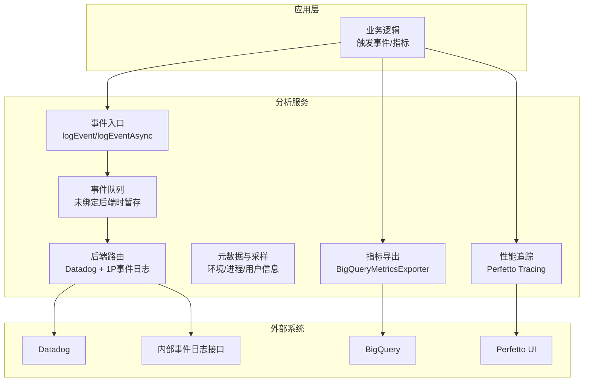
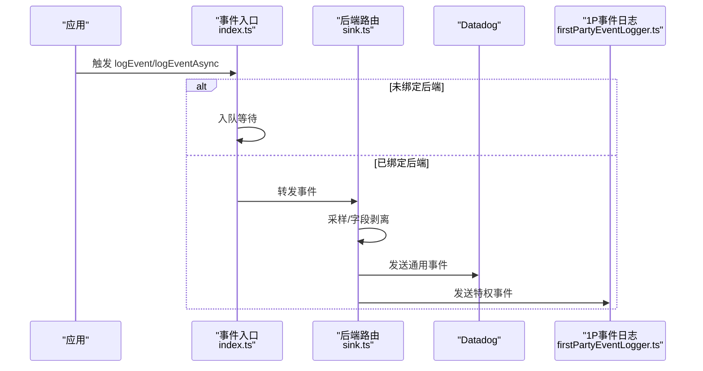
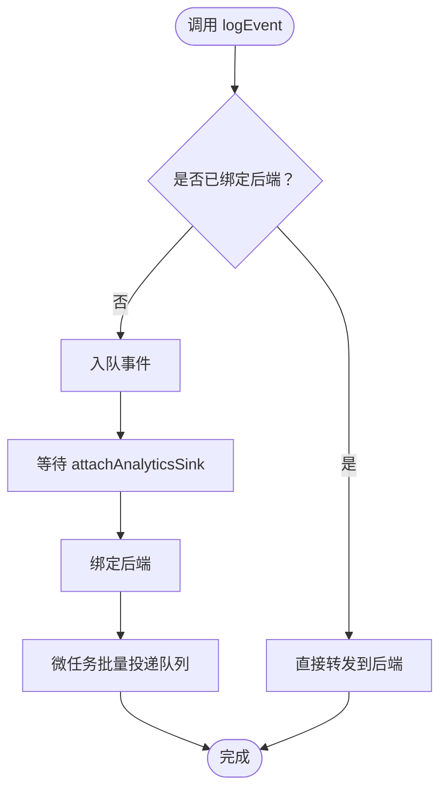
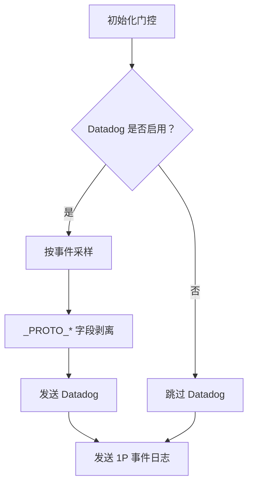
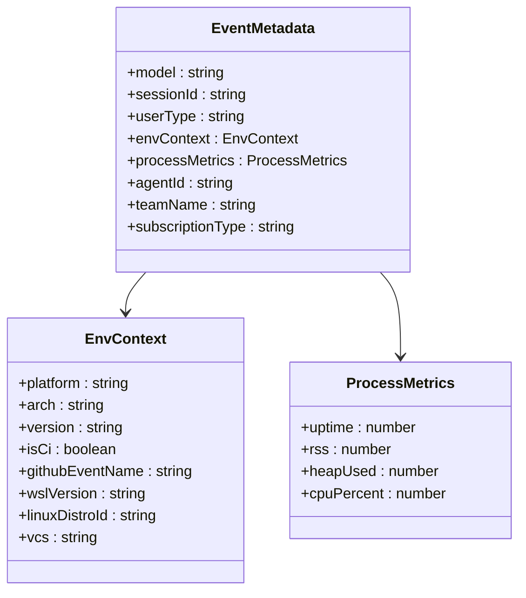
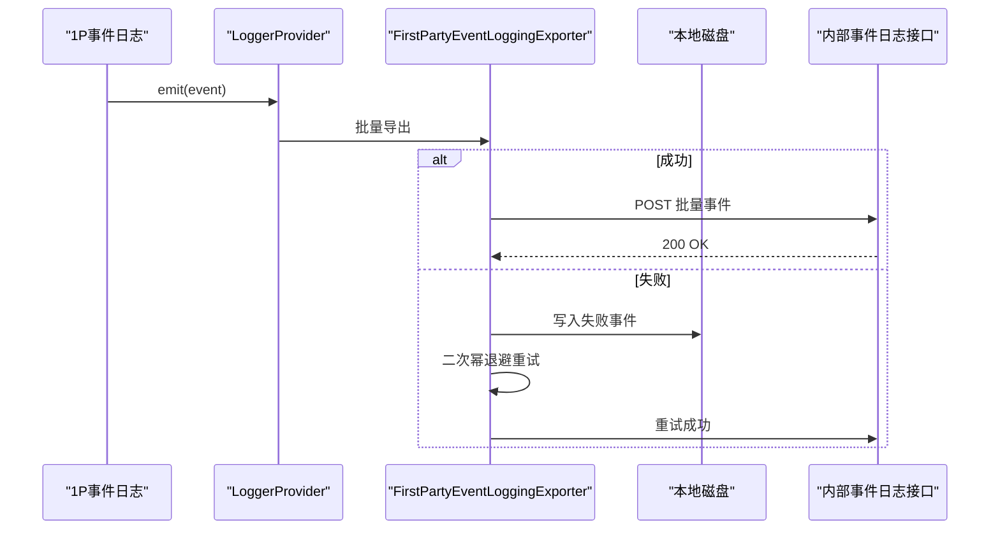
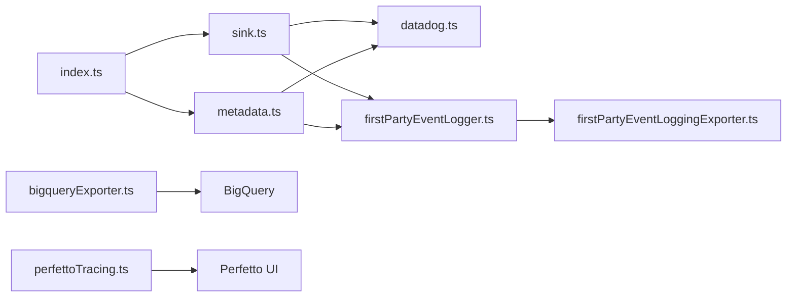

# 分析服务

<cite>
**本文档引用的文件**
- [services/analytics/index.ts](file://services/analytics/index.ts)
- [services/analytics/sink.ts](file://services/analytics/sink.ts)
- [services/analytics/config.ts](file://services/analytics/config.ts)
- [services/analytics/metadata.ts](file://services/analytics/metadata.ts)
- [services/analytics/firstPartyEventLogger.ts](file://services/analytics/firstPartyEventLogger.ts)
- [services/analytics/firstPartyEventLoggingExporter.ts](file://services/analytics/firstPartyEventLoggingExporter.ts)
- [services/analytics/datadog.ts](file://services/analytics/datadog.ts)
- [utils/telemetry/perfettoTracing.ts](file://utils/telemetry/perfettoTracing.ts)
- [utils/telemetry/bigqueryExporter.ts](file://utils/telemetry/bigqueryExporter.ts)
- [utils/telemetryAttributes.ts](file://utils/telemetryAttributes.ts)
- [commands/insights.ts](file://commands/insights.ts)
- [screens/REPL.tsx](file://screens/REPL.tsx)
</cite>

## 目录
1. [简介](#简介)
2. [项目结构](#项目结构)
3. [核心组件](#核心组件)
4. [架构总览](#架构总览)
5. [详细组件分析](#详细组件分析)
6. [依赖关系分析](#依赖关系分析)
7. [性能考量](#性能考量)
8. [故障排查指南](#故障排查指南)
9. [结论](#结论)
10. [附录](#附录)

## 简介
本文件系统性梳理 Claude Code 的分析服务系统，覆盖遥测采集、事件日志与性能监控的实现架构；详解数据分析管道、指标计算与报告生成机制；提供配置选项与自定义指标添加方法；阐述离线分析、实时分析与批处理分析策略；并给出数据隐私保护、匿名化处理与合规性建议，以及调试工具与性能监控指南。

## 项目结构
分析服务主要由以下模块构成：
- 公共入口与队列：事件在未绑定后端时入队，待后端初始化完成再批量投递
- 后端路由：将事件分发至 Datadog（通用访问）与 1P 事件日志（特权通道）
- 元数据与采样：统一环境上下文、进程指标、用户标识等元数据，并支持按事件类型采样
- 指标导出：将 OTel 指标转换并上传至 BigQuery
- 性能追踪：基于 Chrome Trace 格式的 Perfetto 追踪，用于可视化性能瓶颈
- 报告与洞察：命令行与前端界面中对会话与交互进行统计与可视化

图示来源
- [services/analytics/index.ts:133-164](file://services/analytics/index.ts#L133-L164)
- [services/analytics/sink.ts:109-114](file://services/analytics/sink.ts#L109-L114)
- [services/analytics/firstPartyEventLogger.ts:312-389](file://services/analytics/firstPartyEventLogger.ts#L312-L389)
- [utils/telemetry/bigqueryExporter.ts:40-85](file://utils/telemetry/bigqueryExporter.ts#L40-L85)
- [utils/telemetry/perfettoTracing.ts:253-335](file://utils/telemetry/perfettoTracing.ts#L253-L335)

章节来源
- [services/analytics/index.ts:1-174](file://services/analytics/index.ts#L1-L174)
- [services/analytics/sink.ts:1-115](file://services/analytics/sink.ts#L1-L115)

## 核心组件
- 事件入口与队列
  - 提供同步与异步事件记录接口，若尚未绑定后端则入队等待
  - 初始化完成后通过微任务批量投递，避免阻塞启动路径
- 后端路由
  - Datadog 路由：按功能门控与采样率过滤，剥离 PII 字段后发送
  - 1P 事件日志：富元数据格式，含环境、进程、认证信息等，支持实验事件
- 元数据与采样
  - 统一构建环境上下文、进程指标、订阅等级、仓库哈希等
  - 支持按事件类型动态采样，降低基数与带宽
- 指标导出
  - 将 OTel 指标转换为内部格式，附加资源属性与计数器，上传 BigQuery
- 性能追踪
  - 基于 Chrome Trace 格式，记录 API 请求、工具执行、用户等待等阶段
  - 支持周期写盘与退出写盘，内置过期清理与容量控制

章节来源
- [services/analytics/index.ts:133-164](file://services/analytics/index.ts#L133-L164)
- [services/analytics/sink.ts:48-86](file://services/analytics/sink.ts#L48-L86)
- [services/analytics/metadata.ts:693-743](file://services/analytics/metadata.ts#L693-L743)
- [utils/telemetry/bigqueryExporter.ts:150-196](file://utils/telemetry/bigqueryExporter.ts#L150-L196)
- [utils/telemetry/perfettoTracing.ts:253-335](file://utils/telemetry/perfettoTracing.ts#L253-L335)

## 架构总览
分析服务采用“入口-路由-后端”的分层设计，确保：
- 低耦合：入口仅负责排队与转发，不关心具体后端
- 可插拔：后端可独立开关与重配，不影响业务路径
- 隐私优先：PII 字段仅在特权通道出现，通用通道自动剥离
- 可观测性：同时覆盖事件日志、指标与性能追踪

图示来源
- [services/analytics/index.ts:133-164](file://services/analytics/index.ts#L133-L164)
- [services/analytics/sink.ts:48-86](file://services/analytics/sink.ts#L48-L86)
- [services/analytics/firstPartyEventLogger.ts:216-230](file://services/analytics/firstPartyEventLogger.ts#L216-L230)

## 详细组件分析

### 事件入口与队列（index.ts）
- 设计要点
  - 无后端依赖，避免循环导入
  - 事件队列在未绑定后端时暂存，绑定后微任务批量投递
  - 提供同步与异步两种接口，异步接口用于非关键路径
- 关键行为
  - attachAnalyticsSink：绑定后端并清空队列
  - logEvent/logEventAsync：入队或直接转发
  - stripProtoFields：剥离以 _PROTO_ 开头的字段，防止泄露到通用通道

图示来源
- [services/analytics/index.ts:95-123](file://services/analytics/index.ts#L95-L123)
- [services/analytics/index.ts:133-164](file://services/analytics/index.ts#L133-L164)

章节来源
- [services/analytics/index.ts:1-174](file://services/analytics/index.ts#L1-L174)

### 后端路由（sink.ts）
- 功能门控
  - 通过 Statsig 功能门控决定是否启用 Datadog
  - 支持“杀开关”（kill switch），运行时可禁用特定后端
- 采样与字段安全
  - 按事件类型动态采样，采样率写入元数据
  - 通用通道前剥离 PII 字段（_PROTO_*）
- 初始化流程
  - initializeAnalyticsGates：读取门控状态
  - initializeAnalyticsSink：注册后端

图示来源
- [services/analytics/sink.ts:96-114](file://services/analytics/sink.ts#L96-L114)
- [services/analytics/sink.ts:29-72](file://services/analytics/sink.ts#L29-L72)

章节来源
- [services/analytics/sink.ts:1-115](file://services/analytics/sink.ts#L1-L115)

### 元数据与采样（metadata.ts、firstPartyEventLogger.ts）
- 元数据构建
  - 环境上下文：平台、架构、版本、CI 环境、WSL/Linux 信息、VCS 等
  - 进程指标：内存、CPU 使用、时间戳等
  - 用户与订阅：账户/组织 UUID、订阅等级、助手模式标记等
- 采样策略
  - 事件级采样：按事件名配置采样率，随机丢弃或保留
  - 指标级采样：通过环境变量与门控控制
- 1P 事件格式
  - 将核心元数据、环境元数据、用户元数据与事件元数据合并为内部格式
  - PII 字段（如技能名、插件名）经剥离后放入特权字段

图示来源
- [services/analytics/metadata.ts:472-496](file://services/analytics/metadata.ts#L472-L496)
- [services/analytics/metadata.ts:417-452](file://services/analytics/metadata.ts#L417-L452)
- [services/analytics/metadata.ts:457-467](file://services/analytics/metadata.ts#L457-L467)

章节来源
- [services/analytics/metadata.ts:693-743](file://services/analytics/metadata.ts#L693-L743)
- [services/analytics/firstPartyEventLogger.ts:57-85](file://services/analytics/firstPartyEventLogger.ts#L57-L85)
- [services/analytics/firstPartyEventLogger.ts:156-230](file://services/analytics/firstPartyEventLogger.ts#L156-L230)

### 1P 事件日志（firstPartyEventLogger.ts、firstPartyEventLoggingExporter.ts）
- 批量导出
  - 使用 OpenTelemetry BatchLogRecordProcessor，支持延迟、批次大小、队列上限
  - 动态配置：可通过门控更新导出间隔、批次大小、目标端点
- 失败重试与磁盘容错
  - 导出失败事件追加写入本地 JSON Lines 文件，重启后重试
  - 幂等与退避：二次幂退避，最多尝试若干次
- 安全与合规
  - PII 字段剥离，特权字段仅在内部通道可见
  - 认证：OAuth 令牌可用时自动携带，否则降级为非认证发送

图示来源
- [services/analytics/firstPartyEventLogger.ts:312-389](file://services/analytics/firstPartyEventLogger.ts#L312-L389)
- [services/analytics/firstPartyEventLoggingExporter.ts:277-377](file://services/analytics/firstPartyEventLoggingExporter.ts#L277-L377)
- [services/analytics/firstPartyEventLoggingExporter.ts:445-517](file://services/analytics/firstPartyEventLoggingExporter.ts#L445-L517)

章节来源
- [services/analytics/firstPartyEventLogger.ts:1-450](file://services/analytics/firstPartyEventLogger.ts#L1-L450)
- [services/analytics/firstPartyEventLoggingExporter.ts:1-807](file://services/analytics/firstPartyEventLoggingExporter.ts#L1-L807)

### Datadog 事件（datadog.ts）
- 门控与白名单
  - 仅允许特定事件进入 Datadog
  - 第三方模型提供商（Bedrock/Vertex/Foundry）不发送
- 字段规范化
  - 模型名、工具名归一化，版本号裁剪，HTTP 状态映射
  - 用户桶（bucket）用于估算受影响用户数，而非直接统计用户 ID
- 批量与定时刷新
  - 达到阈值立即发送，否则定时刷新

章节来源
- [services/analytics/datadog.ts:1-308](file://services/analytics/datadog.ts#L1-L308)

### 指标导出（bigqueryExporter.ts）
- 数据转换
  - 资源属性：服务名、版本、OS、架构、聚合时序类型等
  - 指标数据：过滤数值型数据点，转换时间戳
- 认证与组织级开关
  - 依赖 OAuth 凭据，组织可整体关闭指标上报
- 传输与可观测性
  - 成功/失败日志输出，便于调试

章节来源
- [utils/telemetry/bigqueryExporter.ts:1-253](file://utils/telemetry/bigqueryExporter.ts#L1-L253)

### 性能追踪（perfettoTracing.ts）
- 追踪内容
  - API 请求：TTFT/TTLT、提示/输出令牌、缓存命中率、重试子阶段
  - 工具执行：名称、持续时间、结果令牌
  - 用户输入等待：上下文与决策来源
- 写盘策略
  - 退出时写盘；可配置周期写盘，避免长时间会话内存膨胀
- 清理与容量控制
  - 过期跨度清理（30 分钟）、事件上限（10 万条）与半量截断标记

章节来源
- [utils/telemetry/perfettoTracing.ts:1-1121](file://utils/telemetry/perfettoTracing.ts#L1-L1121)

### 数据分析管道与报告生成
- 管道组成
  - 事件日志：1P 事件日志接口接收并持久化
  - 指标：BigQuery Metrics 接口接收并入库
  - 性能：Perfetto JSON 供可视化工具分析
- 报告与洞察
  - 命令行洞察：生成响应时间分布、满意度、摩擦度等汇总
  - REPL 中的 API 指标：TTFT/OTPS/缓存命中等衍生指标展示

章节来源
- [commands/insights.ts:2542-2719](file://commands/insights.ts#L2542-L2719)
- [screens/REPL.tsx:2812-2835](file://screens/REPL.tsx#L2812-L2835)

## 依赖关系分析
- 松耦合入口
  - index.ts 不依赖具体后端，仅维护队列与接口
- 后端路由
  - sink.ts 依赖采样与门控，负责分流与安全剥离
- 元数据与采样
  - metadata.ts 与 firstPartyEventLogger.ts 协作，统一元数据格式
- 指标与追踪
  - bigqueryExporter.ts 与 perfettoTracing.ts 独立于事件日志，分别面向 BigQuery 与可视化

图示来源
- [services/analytics/index.ts:1-174](file://services/analytics/index.ts#L1-L174)
- [services/analytics/sink.ts:1-115](file://services/analytics/sink.ts#L1-L115)
- [services/analytics/firstPartyEventLogger.ts:1-450](file://services/analytics/firstPartyEventLogger.ts#L1-L450)
- [utils/telemetry/bigqueryExporter.ts:1-253](file://utils/telemetry/bigqueryExporter.ts#L1-L253)
- [utils/telemetry/perfettoTracing.ts:1-1121](file://utils/telemetry/perfettoTracing.ts#L1-L1121)

章节来源
- [services/analytics/index.ts:1-174](file://services/analytics/index.ts#L1-L174)
- [services/analytics/sink.ts:1-115](file://services/analytics/sink.ts#L1-L115)

## 性能考量
- 事件与指标
  - 事件日志：批量导出、背压与磁盘重试，避免阻塞主流程
  - 指标导出：DELTA 聚合时序，减少聚合开销
- 追踪
  - 事件上限与截断标记，周期写盘降低内存占用
  - 过期跨度清理，防止悬挂跨度影响可视化
- 采样
  - 事件级采样与模型名归一化，显著降低基数与网络开销

## 故障排查指南
- 事件未到达 Datadog
  - 检查功能门控与第三方提供商限制
  - 确认事件是否在白名单内
  - 查看采样率与字段剥离情况
- 1P 事件丢失
  - 检查磁盘失败文件与重试日志
  - 确认认证状态与信任对话框接受状态
  - 关注动态配置变更后的重建过程
- 指标未入库
  - 检查组织级指标开关与 OAuth 凭据有效性
  - 关注导出超时与错误上下文
- 追踪文件缺失
  - 确认环境变量开启与写盘间隔设置
  - 检查退出回调与 beforeExit 处理

章节来源
- [services/analytics/datadog.ts:130-157](file://services/analytics/datadog.ts#L130-L157)
- [services/analytics/firstPartyEventLoggingExporter.ts:445-517](file://services/analytics/firstPartyEventLoggingExporter.ts#L445-L517)
- [utils/telemetry/bigqueryExporter.ts:87-148](file://utils/telemetry/bigqueryExporter.ts#L87-L148)
- [utils/telemetry/perfettoTracing.ts:284-335](file://utils/telemetry/perfettoTracing.ts#L284-L335)

## 结论
该分析服务通过“入口-路由-后端”的清晰分层，实现了事件日志、指标与性能追踪的统一管理。其在隐私保护、可插拔后端、动态采样与容错重试方面具备良好工程实践，适合在生产环境中稳定运行并支撑多维度的分析与监控需求。

## 附录

### 配置选项与开关
- 通用
  - NODE_ENV/test：禁用分析
  - CLAUDE_CODE_USE_BEDROCK/CLAUDE_CODE_USE_VERTEX/CLAUDE_CODE_USE_FOUNDRY：第三方提供商禁用分析
  - privacyLevel：全局 Telemetry 禁用
- Datadog
  - 功能门控：tengu_log_datadog_events
  - 事件白名单：限定可发送事件集合
  - 刷新间隔：CLAUDE_CODE_DATADOG_FLUSH_INTERVAL_MS
- 1P 事件日志
  - 批量配置：tengu_1p_event_batch_config（导出间隔、批次大小、队列上限、端点）
  - 认证：OAuth 令牌与用户权限检查
  - 杀开关：运行时禁用
- 指标导出
  - 组织级开关：checkMetricsEnabled
  - 认证：OAuth 凭据
- 追踪
  - 启用：CLAUDE_CODE_PERFETTO_TRACE=1 或指定路径
  - 周期写盘：CLAUDE_CODE_PERFETTO_WRITE_INTERVAL_S
  - 容量控制：事件上限、截断标记、过期清理

章节来源
- [services/analytics/config.ts:1-39](file://services/analytics/config.ts#L1-L39)
- [services/analytics/sink.ts:29-43](file://services/analytics/sink.ts#L29-L43)
- [services/analytics/firstPartyEventLogger.ts:97-102](file://services/analytics/firstPartyEventLogger.ts#L97-L102)
- [utils/telemetry/bigqueryExporter.ts:46-61](file://utils/telemetry/bigqueryExporter.ts#L46-L61)
- [utils/telemetry/perfettoTracing.ts:253-335](file://utils/telemetry/perfettoTracing.ts#L253-L335)

### 自定义指标添加方法
- 指标属性
  - 通过 getTelemetryAttributes() 控制是否包含会话 ID、版本、账户 UUID 等
  - 受环境变量控制，默认包含用户 ID、会话 ID、账户 UUID，版本默认关闭
- 指标导出
  - 使用 BigQueryMetricsExporter 的导出流程，确保资源属性与数据点正确转换
  - 注意 DELTA 聚合时序的选择，避免对仪表盘聚合产生影响

章节来源
- [utils/telemetryAttributes.ts:29-71](file://utils/telemetryAttributes.ts#L29-L71)
- [utils/telemetry/bigqueryExporter.ts:150-251](file://utils/telemetry/bigqueryExporter.ts#L150-L251)

### 实现策略：离线/实时/批处理
- 实时
  - 事件：队列满或定时刷新即刻发送
  - 指标：Push 模式按需导出
  - 追踪：周期写盘，退出时最终落盘
- 批处理
  - 1P 事件日志：批量处理器按间隔与批次大小聚合
  - 指标：按固定间隔推送（受导出器实现约束）
- 离线
  - 失败事件持久化至磁盘，重启后重试
  - 追踪文件保存在本地，供后续分析

章节来源
- [services/analytics/firstPartyEventLogger.ts:300-340](file://services/analytics/firstPartyEventLogger.ts#L300-L340)
- [services/analytics/firstPartyEventLoggingExporter.ts:379-428](file://services/analytics/firstPartyEventLoggingExporter.ts#L379-L428)
- [utils/telemetry/perfettoTracing.ts:284-335](file://utils/telemetry/perfettoTracing.ts#L284-L335)

### 数据隐私保护、匿名化与合规
- 匿名化
  - 用户桶（bucket）替代直接用户 ID，估算受影响用户规模
  - 模型名、工具名归一化，减少敏感信息暴露
- PII 管控
  - 通用通道自动剥离 _PROTO_* 字段
  - 1P 通道仅限特权列可见，其余字段放入额外元数据
- 合规
  - 组织级指标与事件日志开关
  - 第三方提供商不发送 Datadog 事件
  - 认证失败时降级为非认证发送，避免 401

章节来源
- [services/analytics/datadog.ts:196-218](file://services/analytics/datadog.ts#L196-L218)
- [services/analytics/firstPartyEventLoggingExporter.ts:714-758](file://services/analytics/firstPartyEventLoggingExporter.ts#L714-L758)
- [services/analytics/sink.ts:63-71](file://services/analytics/sink.ts#L63-L71)

### 调试工具与性能监控指南
- 调试
  - 事件日志：ANT 专属调试输出，查看事件体与错误上下文
  - 指标导出：成功/失败日志与响应详情
  - 追踪：确认写盘路径与文件存在
- 性能监控
  - REPL 中展示 TTFT/OTPS/缓存命中等指标
  - Perfetto UI 可视化 API 请求、工具执行与用户等待阶段
  - 命令行洞察生成响应时间分布与满意度统计

章节来源
- [services/analytics/firstPartyEventLogger.ts:186-207](file://services/analytics/firstPartyEventLogger.ts#L186-L207)
- [utils/telemetry/bigqueryExporter.ts:135-142](file://utils/telemetry/bigqueryExporter.ts#L135-L142)
- [utils/telemetry/perfettoTracing.ts:253-335](file://utils/telemetry/perfettoTracing.ts#L253-L335)
- [commands/insights.ts:2542-2551](file://commands/insights.ts#L2542-L2551)
- [screens/REPL.tsx:2812-2835](file://screens/REPL.tsx#L2812-L2835)