# 遥测数据收集

<cite>
**本文引用的文件**
- [services/analytics/index.ts](file://services/analytics/index.ts)
- [services/analytics/sink.ts](file://services/analytics/sink.ts)
- [services/analytics/firstPartyEventLogger.ts](file://services/analytics/firstPartyEventLogger.ts)
- [services/analytics/firstPartyEventLoggingExporter.ts](file://services/analytics/firstPartyEventLoggingExporter.ts)
- [services/analytics/firstPartyEventLoggingExporter.ts](file://services/analytics/firstPartyEventLoggingExporter.ts)
- [utils/telemetry/instrumentation.ts](file://utils/telemetry/instrumentation.ts)
- [utils/telemetry/perfettoTracing.ts](file://utils/telemetry/perfettoTracing.ts)
- [utils/privacyLevel.ts](file://utils/privacyLevel.ts)
- [cli/transports/SerialBatchEventUploader.ts](file://cli/transports/SerialBatchEventUploader.ts)
- [bridge/flushGate.ts](file://bridge/flushGate.ts)
- [bridge/replBridge.ts](file://bridge/replBridge.ts)
- [entrypoints/init.ts](file://entrypoints/init.ts)
- [utils/telemetryAttributes.ts](file://utils/telemetryAttributes.ts)
</cite>

## 目录
1. [简介](#简介)
2. [项目结构](#项目结构)
3. [核心组件](#核心组件)
4. [架构总览](#架构总览)
5. [详细组件分析](#详细组件分析)
6. [依赖关系分析](#依赖关系分析)
7. [性能考量](#性能考量)
8. [故障排查指南](#故障排查指南)
9. [结论](#结论)
10. [附录](#附录)

## 简介
本文件系统化梳理 Claude Code 的遥测数据收集体系，重点覆盖以下方面：
- DataDog 集成与事件分发
- 事件采集管道与导出机制
- 遥测配置项、数据格式与传输协议
- 事件过滤、采样策略与批量处理
- 遥测启停控制、故障转移与重试
- 隐私保护与合规约束
- 调试工具与性能监控方法

## 项目结构
遥测子系统由“事件入口”“采样与路由”“第一方导出器（1P）”“第三方遥测（OTel）”“性能追踪（Perfetto）”五部分组成，并通过隐私级别与环境变量进行统一开关控制。

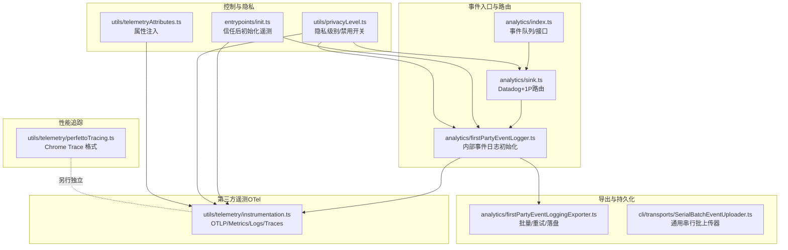

图示来源
- [services/analytics/index.ts:1-174](file://services/analytics/index.ts#L1-L174)
- [services/analytics/sink.ts:1-115](file://services/analytics/sink.ts#L1-L115)
- [services/analytics/firstPartyEventLogger.ts:1-450](file://services/analytics/firstPartyEventLogger.ts#L1-L450)
- [services/analytics/firstPartyEventLoggingExporter.ts:1-800](file://services/analytics/firstPartyEventLoggingExporter.ts#L1-L800)
- [utils/telemetry/instrumentation.ts:1-826](file://utils/telemetry/instrumentation.ts#L1-L826)
- [utils/telemetry/perfettoTracing.ts:1-200](file://utils/telemetry/perfettoTracing.ts#L1-L200)
- [utils/privacyLevel.ts:1-56](file://utils/privacyLevel.ts#L1-L56)
- [entrypoints/init.ts:240-340](file://entrypoints/init.ts#L240-L340)
- [utils/telemetryAttributes.ts:1-42](file://utils/telemetryAttributes.ts#L1-L42)

章节来源
- [services/analytics/index.ts:1-174](file://services/analytics/index.ts#L1-L174)
- [services/analytics/sink.ts:1-115](file://services/analytics/sink.ts#L1-L115)
- [services/analytics/firstPartyEventLogger.ts:1-450](file://services/analytics/firstPartyEventLogger.ts#L1-L450)
- [services/analytics/firstPartyEventLoggingExporter.ts:1-800](file://services/analytics/firstPartyEventLoggingExporter.ts#L1-L800)
- [utils/telemetry/instrumentation.ts:1-826](file://utils/telemetry/instrumentation.ts#L1-L826)
- [utils/telemetry/perfettoTracing.ts:1-200](file://utils/telemetry/perfettoTracing.ts#L1-L200)
- [utils/privacyLevel.ts:1-56](file://utils/privacyLevel.ts#L1-L56)
- [entrypoints/init.ts:240-340](file://entrypoints/init.ts#L240-L340)
- [utils/telemetryAttributes.ts:1-42](file://utils/telemetryAttributes.ts#L1-L42)

## 核心组件
- 事件入口与队列：在未绑定分析插槽前，所有事件进入内存队列；绑定后异步冲刷。
- 采样与路由：按动态配置对事件进行采样；Datadog 仅接收清洗后的通用字段；内部事件走 1P 导出器。
- 1P 导出器：OTel 批处理器驱动，失败写盘并指数退避重试；支持端点/认证/批次大小等动态配置。
- 第三方遥测（OTel）：按环境变量选择 OTLP 协议与导出器，支持指标、日志、追踪三类信号。
- 性能追踪：Ant 专用的 Chrome Trace 格式，记录代理层级、工具执行、用户等待等。
- 隐私与开关：通过隐私级别与环境变量统一控制遥测启停与非必要网络流量。

章节来源
- [services/analytics/index.ts:80-174](file://services/analytics/index.ts#L80-L174)
- [services/analytics/sink.ts:45-115](file://services/analytics/sink.ts#L45-L115)
- [services/analytics/firstPartyEventLogger.ts:141-230](file://services/analytics/firstPartyEventLogger.ts#L141-L230)
- [services/analytics/firstPartyEventLoggingExporter.ts:73-139](file://services/analytics/firstPartyEventLoggingExporter.ts#L73-L139)
- [utils/telemetry/instrumentation.ts:421-701](file://utils/telemetry/instrumentation.ts#L421-L701)
- [utils/telemetry/perfettoTracing.ts:1-200](file://utils/telemetry/perfettoTracing.ts#L1-L200)
- [utils/privacyLevel.ts:20-44](file://utils/privacyLevel.ts#L20-L44)

## 架构总览
遥测系统采用“双通道”设计：
- Datadog 通道：面向通用访问，发送清洗后的字段，避免敏感信息泄露。
- 1P 通道：内部事件专道，保留 PII 字段到受控列，其余字段清洗后落盘，失败重试。

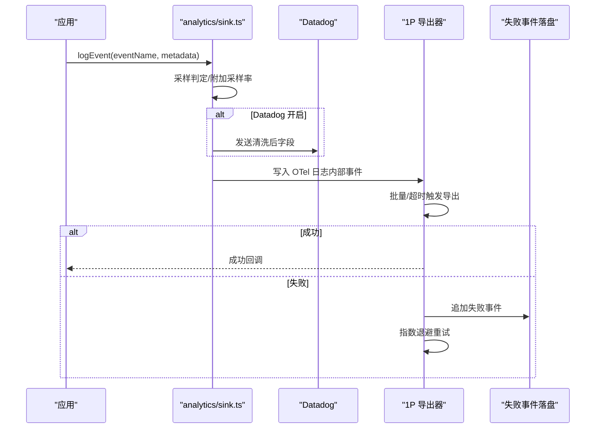

图示来源
- [services/analytics/sink.ts:45-115](file://services/analytics/sink.ts#L45-L115)
- [services/analytics/firstPartyEventLoggingExporter.ts:277-377](file://services/analytics/firstPartyEventLoggingExporter.ts#L277-L377)

章节来源
- [services/analytics/sink.ts:29-115](file://services/analytics/sink.ts#L29-L115)
- [services/analytics/firstPartyEventLoggingExporter.ts:306-377](file://services/analytics/firstPartyEventLoggingExporter.ts#L306-L377)

## 详细组件分析

### 事件入口与队列（analytics/index.ts）
- 设计要点
  - 无外部依赖，避免循环导入。
  - 事件队列在插槽未就绪时暂存，插槽就绪后微任务异步冲刷，不阻塞启动路径。
  - 提供同步/异步两类入口，均支持采样与队列。
- 关键行为
  - 未绑定插槽：事件入队。
  - 绑定插槽：事件直接路由至插槽实现。
  - 重置接口用于测试。

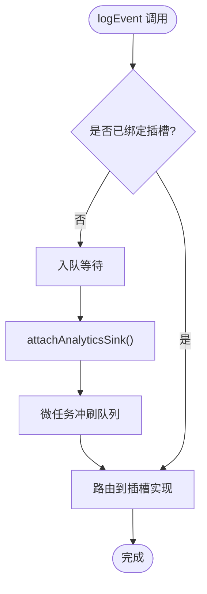

图示来源
- [services/analytics/index.ts:95-123](file://services/analytics/index.ts#L95-L123)
- [services/analytics/index.ts:133-164](file://services/analytics/index.ts#L133-L164)

章节来源
- [services/analytics/index.ts:80-174](file://services/analytics/index.ts#L80-L174)

### 采样与路由（analytics/sink.ts）
- 采样策略
  - 基于动态配置按事件名设置采样率；返回采样率或丢弃标记。
- 路由规则
  - Datadog：若开启，发送清洗后的字段（移除以 _PROTO_ 开头的键）。
  - 1P：无论 Datadog 是否开启，均写入内部事件日志。
- 功能门控
  - 通过特征门与“杀死开关”控制 Datadog 与 1P 通道。

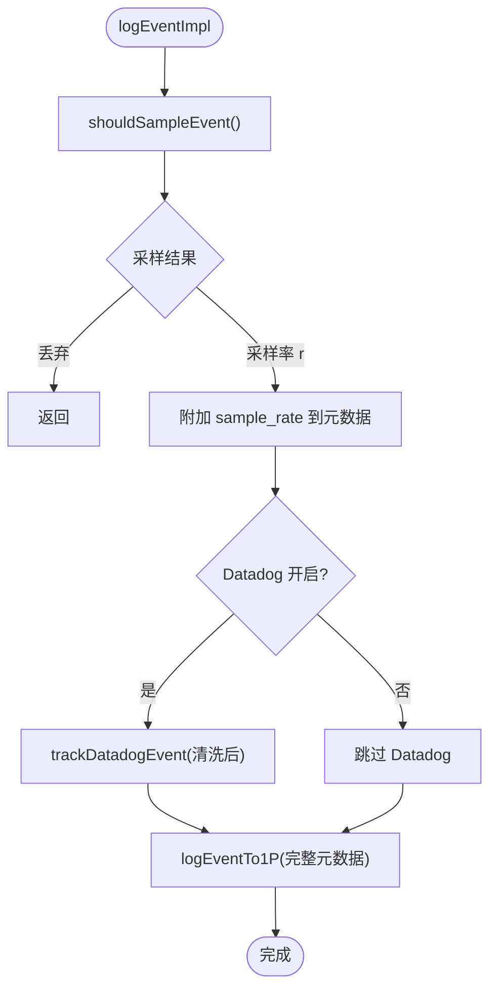

图示来源
- [services/analytics/sink.ts:45-115](file://services/analytics/sink.ts#L45-L115)
- [services/analytics/firstPartyEventLogger.ts:156-230](file://services/analytics/firstPartyEventLogger.ts#L156-L230)

章节来源
- [services/analytics/sink.ts:29-115](file://services/analytics/sink.ts#L29-L115)

### 事件采样配置（firstPartyEventLogger.ts）
- 配置来源：动态配置中心（GrowthBook），缓存+后台刷新。
- 规则：
  - 未配置事件：默认全量采样。
  - sample_rate ∈ [0,1]：按概率采样；为 1 表示全量；为 0 表示全丢弃。
  - 返回值：采样率数值（用于元数据）或丢弃标记（0）。

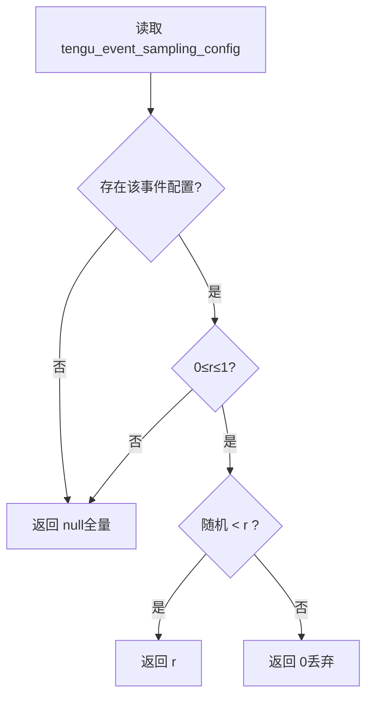

图示来源
- [services/analytics/firstPartyEventLogger.ts:43-85](file://services/analytics/firstPartyEventLogger.ts#L43-L85)

章节来源
- [services/analytics/firstPartyEventLogger.ts:38-85](file://services/analytics/firstPartyEventLogger.ts#L38-L85)

### 1P 事件导出器（firstPartyEventLoggingExporter.ts）
- 批处理与延迟
  - 由 OTel 批处理器触发导出，支持时间间隔与最大批次大小。
- 失败处理
  - 失败事件追加写入本地 JSON Lines 文件，带进程级唯一标识区分会话批次。
  - 指数退避重试（二次函数增长），达到最大尝试次数后丢弃并清空文件。
- 认证与降级
  - 若信任未建立或令牌过期/缺作用域，则自动降级为无认证发送。
  - 首次 401 自动回退为无认证再次发送。
- 数据转换
  - 将 OTel 日志转换为内部事件格式，Hoist 已知 _PROTO_* 字段到顶层，其余清洗后放入额外字段。

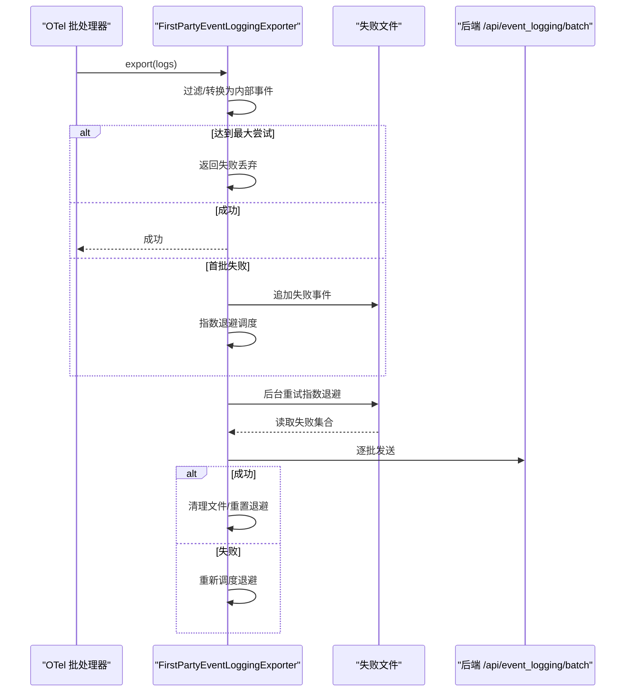

图示来源
- [services/analytics/firstPartyEventLoggingExporter.ts:277-377](file://services/analytics/firstPartyEventLoggingExporter.ts#L277-L377)
- [services/analytics/firstPartyEventLoggingExporter.ts:445-517](file://services/analytics/firstPartyEventLoggingExporter.ts#L445-L517)
- [services/analytics/firstPartyEventLoggingExporter.ts:527-615](file://services/analytics/firstPartyEventLoggingExporter.ts#L527-L615)

章节来源
- [services/analytics/firstPartyEventLoggingExporter.ts:73-139](file://services/analytics/firstPartyEventLoggingExporter.ts#L73-L139)
- [services/analytics/firstPartyEventLoggingExporter.ts:306-377](file://services/analytics/firstPartyEventLoggingExporter.ts#L306-L377)
- [services/analytics/firstPartyEventLoggingExporter.ts:445-517](file://services/analytics/firstPartyEventLoggingExporter.ts#L445-L517)
- [services/analytics/firstPartyEventLoggingExporter.ts:527-615](file://services/analytics/firstPartyEventLoggingExporter.ts#L527-L615)

### 1P 事件日志初始化（firstPartyEventLogger.ts）
- 初始化时机
  - 在隐私允许且启用后，创建独立 LoggerProvider 与批处理器，使用自定义导出器。
- 配置项
  - 批处理间隔、最大批次、队列大小、端点、基础地址、是否跳过认证、最大尝试次数等来自动态配置。
- 重建策略
  - 当动态配置变化时，安全地切换 Provider 并迁移缓冲区，确保不丢失事件。

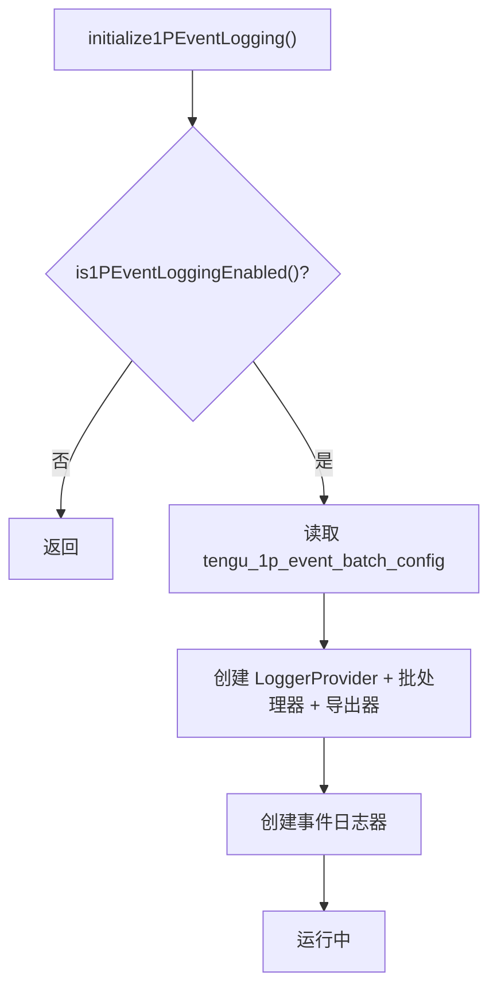

图示来源
- [services/analytics/firstPartyEventLogger.ts:312-389](file://services/analytics/firstPartyEventLogger.ts#L312-L389)
- [services/analytics/firstPartyEventLogger.ts:407-449](file://services/analytics/firstPartyEventLogger.ts#L407-L449)

章节来源
- [services/analytics/firstPartyEventLogger.ts:141-230](file://services/analytics/firstPartyEventLogger.ts#L141-L230)
- [services/analytics/firstPartyEventLogger.ts:312-389](file://services/analytics/firstPartyEventLogger.ts#L312-L389)
- [services/analytics/firstPartyEventLogger.ts:407-449](file://services/analytics/firstPartyEventLogger.ts#L407-L449)

### 第三方遥测（OTel）初始化（instrumentation.ts）
- 启用条件
  - 通过环境变量控制是否启用；支持多信号（指标、日志、追踪）与多种 OTLP 协议。
- 导出器选择
  - 指标：OTLP/HTTP/JSON、OTLP/HTTP/Protobuf、gRPC、Prometheus。
  - 日志：OTLP/HTTP/JSON、OTLP/HTTP/Protobuf、gRPC。
  - 追踪：OTLP/HTTP/JSON、OTLP/HTTP/Protobuf、gRPC。
- 属性注入
  - 通过 Telemetry Attributes 注入用户、会话、版本等维度。
- 关闭与刷新
  - 提供优雅关闭与强制刷新，带超时保护。

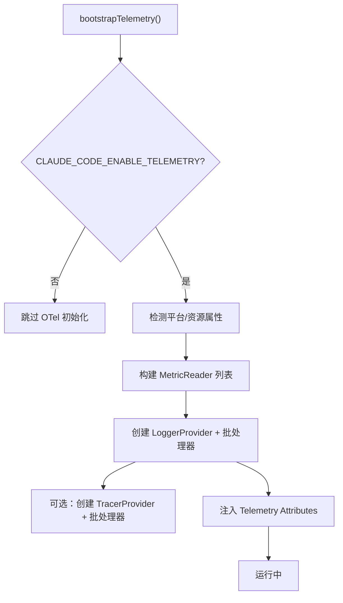

图示来源
- [utils/telemetry/instrumentation.ts:421-701](file://utils/telemetry/instrumentation.ts#L421-L701)
- [utils/telemetry/instrumentation.ts:707-747](file://utils/telemetry/instrumentation.ts#L707-L747)
- [utils/telemetryAttributes.ts:29-42](file://utils/telemetryAttributes.ts#L29-L42)

章节来源
- [utils/telemetry/instrumentation.ts:421-701](file://utils/telemetry/instrumentation.ts#L421-L701)
- [utils/telemetry/instrumentation.ts:707-747](file://utils/telemetry/instrumentation.ts#L707-L747)
- [utils/telemetryAttributes.ts:16-27](file://utils/telemetryAttributes.ts#L16-L27)

### 性能追踪（Perfetto）（perfettoTracing.ts）
- 输出格式
  - Chrome Trace Event 格式，可在 ui.perfetto.dev 或 chrome://tracing 查看。
- 启用方式
  - 通过环境变量启用，可指定写入间隔或退出时写入。
- 内容
  - 包含代理层级、API 请求（TTFT/TTLT/缓存统计）、工具执行、用户等待等。

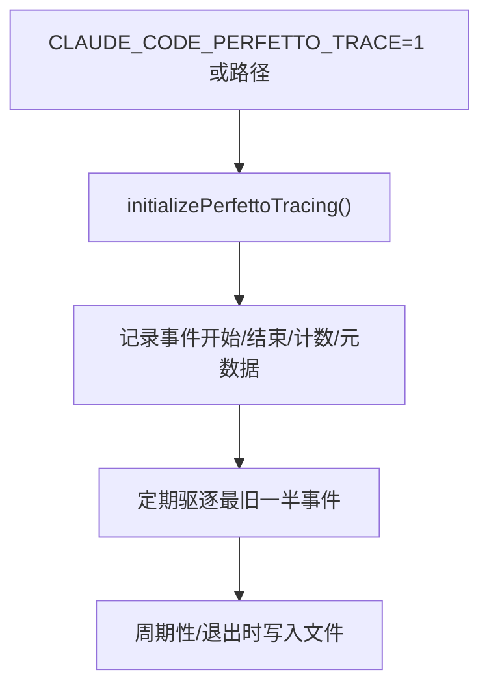

图示来源
- [utils/telemetry/perfettoTracing.ts:1-200](file://utils/telemetry/perfettoTracing.ts#L1-L200)
- [utils/telemetry/perfettoTracing.ts:187-200](file://utils/telemetry/perfettoTracing.ts#L187-L200)

章节来源
- [utils/telemetry/perfettoTracing.ts:1-200](file://utils/telemetry/perfettoTracing.ts#L1-L200)

### 遥测启停与隐私控制（privacyLevel.ts、entrypoints/init.ts）
- 隐私级别
  - default/no-telemetry/essential-traffic 三级，后者会抑制遥测与非必要网络。
- 环境变量
  - DISABLE_TELEMETRY 与 CLAUDE_CODE_DISABLE_NONESSENTIAL_TRAFFIC 控制级别。
- 初始化流程
  - 信任对话框确认后初始化遥测；远程托管设置加载完成后重新应用环境变量再初始化。

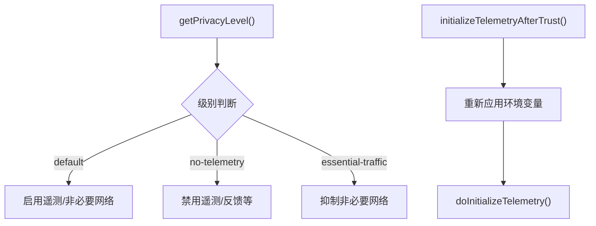

图示来源
- [utils/privacyLevel.ts:20-44](file://utils/privacyLevel.ts#L20-L44)
- [entrypoints/init.ts:247-340](file://entrypoints/init.ts#L247-L340)

章节来源
- [utils/privacyLevel.ts:1-56](file://utils/privacyLevel.ts#L1-L56)
- [entrypoints/init.ts:240-340](file://entrypoints/init.ts#L240-L340)

### 通用批上传器（SerialBatchEventUploader.ts）
- 特性
  - 串行发送、最多一个请求在途；按数量与字节上限分批。
  - 支持指数退避与服务器建议的 Retry-After。
  - 背压与队列长度限制；支持 flush/close。
- 适用场景
  - 作为导出器的底层传输层，保证顺序与背压控制。

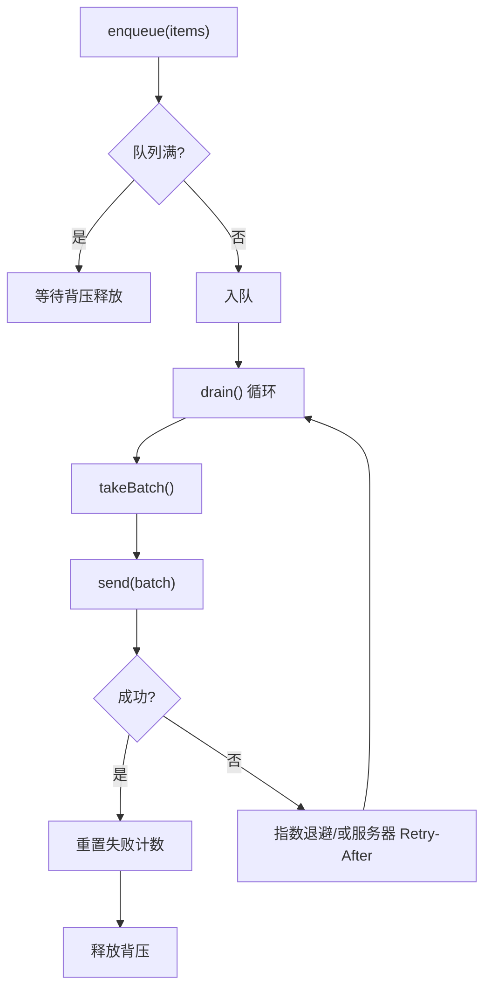

图示来源
- [cli/transports/SerialBatchEventUploader.ts:101-200](file://cli/transports/SerialBatchEventUploader.ts#L101-L200)

章节来源
- [cli/transports/SerialBatchEventUploader.ts:1-200](file://cli/transports/SerialBatchEventUploader.ts#L1-L200)

### 桥接消息初始刷新门（bridge/flushGate.ts、bridge/replBridge.ts）
- 刷新门
  - 会话启动时，历史消息一次性刷新，期间新消息被排队，防止交错。
- 桥接侧
  - 历史刷新完成后，从门中取出排队消息并顺序写出，确保时序正确。

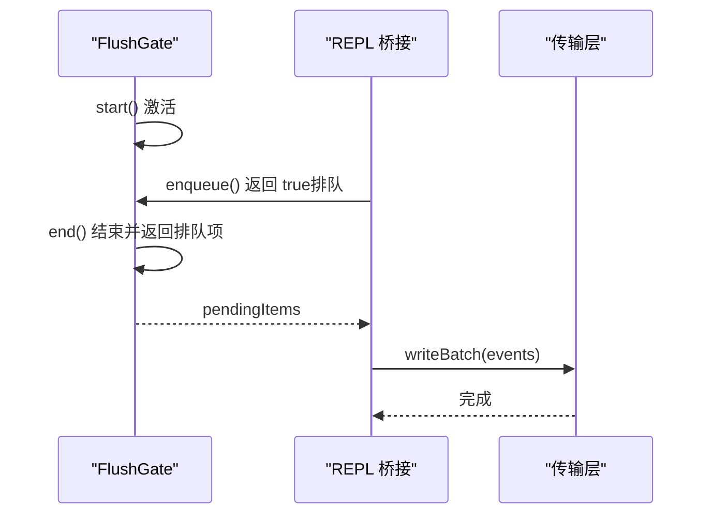

图示来源
- [bridge/flushGate.ts:29-71](file://bridge/flushGate.ts#L29-L71)
- [bridge/replBridge.ts:845-876](file://bridge/replBridge.ts#L845-L876)

章节来源
- [bridge/flushGate.ts:1-71](file://bridge/flushGate.ts#L1-L71)
- [bridge/replBridge.ts:845-876](file://bridge/replBridge.ts#L845-L876)

## 依赖关系分析
- 解耦与内聚
  - analytics/index.ts 无外部依赖，仅定义接口与队列，内聚度高。
  - sink.ts 依赖动态配置与“杀死开关”，负责门控与路由。
  - firstPartyEventLogger.ts 与 exporter.ts 形成“初始化—导出—重试”的闭环。
  - instrumentation.ts 与 telemetryAttributes.ts 分别负责 OTel 生命周期与属性注入。
- 外部依赖
  - OTel SDK、Axios、JSON Lines 文件系统、环境变量与代理配置。
- 潜在循环
  - 通过模块边界（如 stripProtoFields 的单向调用链）避免循环导入。

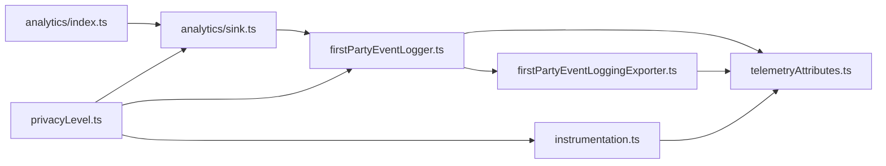

图示来源
- [services/analytics/index.ts:1-174](file://services/analytics/index.ts#L1-L174)
- [services/analytics/sink.ts:1-115](file://services/analytics/sink.ts#L1-L115)
- [services/analytics/firstPartyEventLogger.ts:1-450](file://services/analytics/firstPartyEventLogger.ts#L1-L450)
- [services/analytics/firstPartyEventLoggingExporter.ts:1-800](file://services/analytics/firstPartyEventLoggingExporter.ts#L1-L800)
- [utils/telemetry/instrumentation.ts:1-826](file://utils/telemetry/instrumentation.ts#L1-L826)
- [utils/telemetryAttributes.ts:1-42](file://utils/telemetryAttributes.ts#L1-L42)
- [utils/privacyLevel.ts:1-56](file://utils/privacyLevel.ts#L1-L56)

章节来源
- [services/analytics/index.ts:1-174](file://services/analytics/index.ts#L1-L174)
- [services/analytics/sink.ts:1-115](file://services/analytics/sink.ts#L1-L115)
- [services/analytics/firstPartyEventLogger.ts:1-450](file://services/analytics/firstPartyEventLogger.ts#L1-L450)
- [services/analytics/firstPartyEventLoggingExporter.ts:1-800](file://services/analytics/firstPartyEventLoggingExporter.ts#L1-L800)
- [utils/telemetry/instrumentation.ts:1-826](file://utils/telemetry/instrumentation.ts#L1-L826)
- [utils/telemetryAttributes.ts:1-42](file://utils/telemetryAttributes.ts#L1-L42)
- [utils/privacyLevel.ts:1-56](file://utils/privacyLevel.ts#L1-L56)

## 性能考量
- 批量与延迟
  - OTel 批处理器默认延迟与批次大小可调；1P 导出器支持动态配置。
- 指数退避
  - 1P 导出器采用二次函数退避，上限可控，避免雪崩。
- 背压与队列
  - 串行批上传器提供队列长度与字节上限控制，防止内存膨胀。
- 写盘与恢复
  - 失败事件落盘，重启后后台重试，保障最终一致性。
- 关闭与刷新
  - 提供超时保护的 flush/shutdown 流程，避免阻塞退出。

## 故障排查指南
- 常见问题定位
  - Datadog 未收到事件：检查隐私级别与特征门状态；确认采样率与清洗逻辑。
  - 1P 事件堆积：查看失败文件与退避状态；核对端点可达性与认证。
  - OTel 导出失败：检查协议、端点、代理与证书配置；关注超时与 Retry-After。
- 调试手段
  - Ant 用户模式下输出详细日志与上下文。
  - 使用 flushTelemetry 强制刷新并观察超时提示。
  - Perfetto Trace 文件用于可视化性能瓶颈。
- 重试与恢复
  - 1P 导出器自动指数退避与后台重试；达到最大尝试后丢弃并清空文件。
  - 串行批上传器支持服务器建议的 Retry-After，避免集中重试。

章节来源
- [services/analytics/firstPartyEventLoggingExporter.ts:340-377](file://services/analytics/firstPartyEventLoggingExporter.ts#L340-L377)
- [utils/telemetry/instrumentation.ts:654-699](file://utils/telemetry/instrumentation.ts#L654-L699)
- [utils/telemetry/instrumentation.ts:707-747](file://utils/telemetry/instrumentation.ts#L707-L747)

## 结论
该遥测系统通过“采样—路由—批处理—落盘—重试”的闭环设计，在保证隐私与合规的前提下，实现了高可靠的数据采集与导出。第三方 OTel 与 1P 通道分离，既满足企业级可观测性需求，又确保内部事件的特权字段安全。结合隐私级别与环境变量控制，系统具备良好的可运维性与可调试性。

## 附录

### 遥测配置与环境变量
- 隐私与开关
  - CLAUDE_CODE_DISABLE_NONESSENTIAL_TRAFFIC：essential-traffic
  - DISABLE_TELEMETRY：no-telemetry
- 1P 导出器动态配置
  - tengu_1p_event_batch_config：scheduledDelayMillis、maxExportBatchSize、maxQueueSize、skipAuth、maxAttempts、path、baseUrl
  - tengu_event_sampling_config：按事件名设置 sample_rate
- OTel 与第三方遥测
  - CLAUDE_CODE_ENABLE_TELEMETRY：启用 OTel
  - OTEL_METRICS_EXPORTER/TRACES_EXPORTER/LOGS_EXPORTER：导出器类型
  - OTEL_EXPORTER_OTLP_PROTOCOL/OTEL_EXPORTER_OTLP_ENDPOINT/OTEL_EXPORTER_OTLP_HEADERS：OTLP 协议与端点
  - CLAUDE_CODE_OTEL_SHUTDOWN_TIMEOUT_MS/CLAUDE_CODE_OTEL_FLUSH_TIMEOUT_MS：超时控制
- Perfetto
  - CLAUDE_CODE_PERFETTO_TRACE：启用与输出路径
  - CLAUDE_CODE_PERFETTO_WRITE_INTERVAL_S：周期写入间隔

章节来源
- [utils/privacyLevel.ts:20-44](file://utils/privacyLevel.ts#L20-L44)
- [services/analytics/firstPartyEventLogger.ts:87-102](file://services/analytics/firstPartyEventLogger.ts#L87-L102)
- [services/analytics/firstPartyEventLogger.ts:57-85](file://services/analytics/firstPartyEventLogger.ts#L57-L85)
- [utils/telemetry/instrumentation.ts:121-128](file://utils/telemetry/instrumentation.ts#L121-L128)
- [utils/telemetry/instrumentation.ts:217-271](file://utils/telemetry/instrumentation.ts#L217-L271)
- [utils/telemetry/instrumentation.ts:750-800](file://utils/telemetry/instrumentation.ts#L750-L800)
- [utils/telemetry/perfettoTracing.ts:16-23](file://utils/telemetry/perfettoTracing.ts#L16-L23)