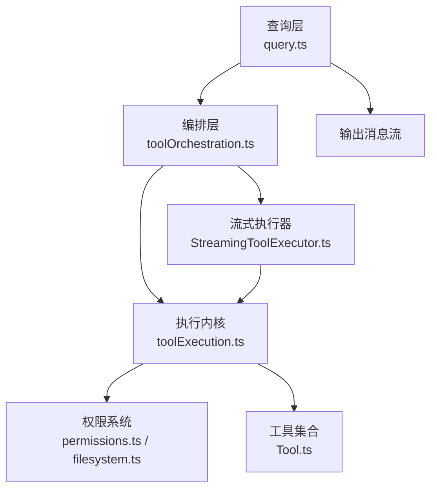
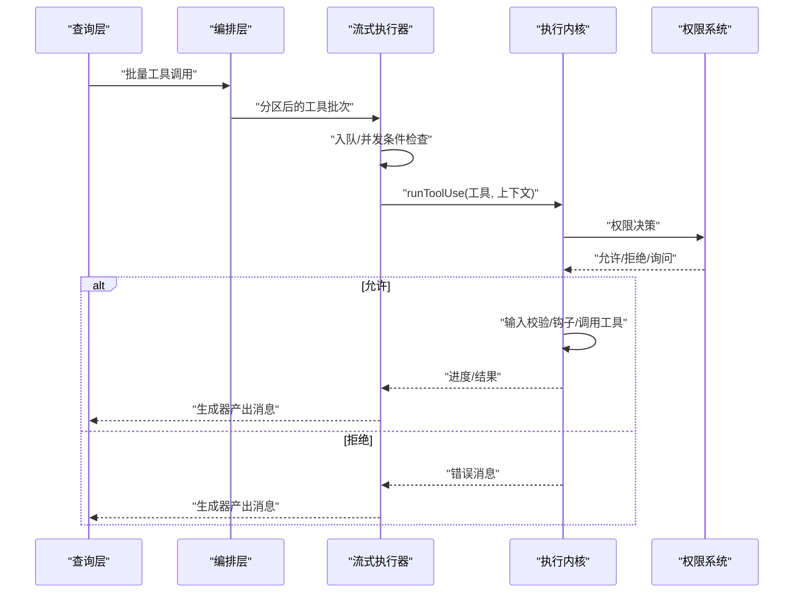
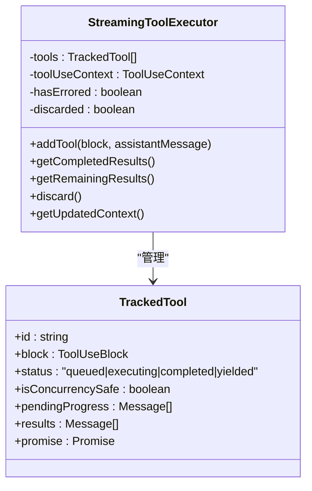
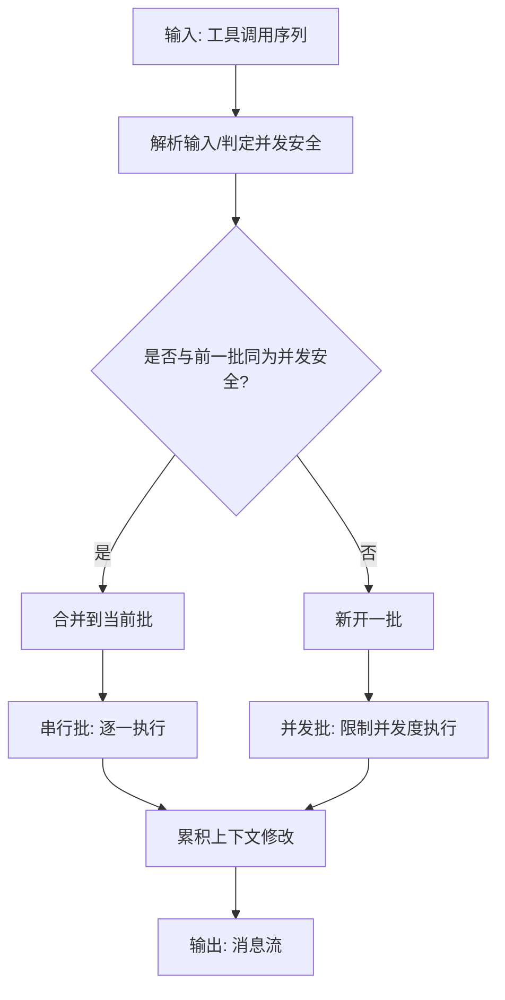
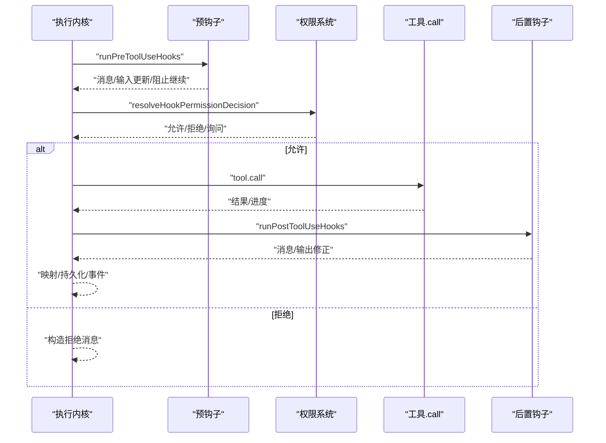
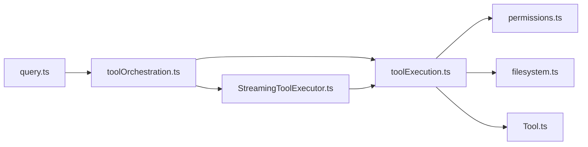

# 工具执行器

<cite>
**本文档引用的文件**
- [StreamingToolExecutor.ts](file://services/tools/StreamingToolExecutor.ts)
- [toolOrchestration.ts](file://services/tools/toolOrchestration.ts)
- [toolExecution.ts](file://services/tools/toolExecution.ts)
- [Tool.ts](file://Tool.ts)
- [query.ts](file://query.ts)
- [toolName.ts](file://tools/BashTool/toolName.ts)
- [permissions.ts](file://utils/permissions/permissions.ts)
- [filesystem.ts](file://utils/permissions/filesystem.ts)
- [TaskOutput.ts](file://utils/task/TaskOutput.ts)
- [tools.ts](file://constants/tools.ts)
</cite>

## 目录
1. [简介](#简介)
2. [项目结构](#项目结构)
3. [核心组件](#核心组件)
4. [架构总览](#架构总览)
5. [详细组件分析](#详细组件分析)
6. [依赖分析](#依赖分析)
7. [性能考量](#性能考量)
8. [故障排查指南](#故障排查指南)
9. [结论](#结论)
10. [附录](#附录)

## 简介
本文件系统性阐述 Claude Code 工具执行器的架构与执行流程，覆盖工具发现、输入验证、权限检查、并发控制、流式执行、进度报告与错误处理等关键环节。文档同时给出流式工具执行器的异步生成器模式、生命周期管理、资源分配与性能优化建议，并说明与权限系统的集成关系与安全注意事项。

## 项目结构
工具执行器由三层协作构成：
- 查询层（query.ts）：接收消息块，调度工具执行，聚合结果并产出用户消息。
- 执行编排层（toolOrchestration.ts）：将工具调用按并发安全属性分批，串行或并行执行。
- 执行内核层（toolExecution.ts）：统一进行输入校验、权限决策、工具调用、钩子、结果映射与日志埋点。

图示来源
- [query.ts:1360-1408](file://query.ts#L1360-L1408)
- [toolOrchestration.ts:19-82](file://services/tools/toolOrchestration.ts#L19-L82)
- [StreamingToolExecutor.ts:40-62](file://services/tools/StreamingToolExecutor.ts#L40-L62)
- [toolExecution.ts:337-490](file://services/tools/toolExecution.ts#L337-L490)
- [permissions.ts:361-1297](file://utils/permissions/permissions.ts#L361-L1297)
- [Tool.ts:158-300](file://Tool.ts#L158-L300)

章节来源
- [query.ts:1360-1408](file://query.ts#L1360-L1408)
- [toolOrchestration.ts:19-82](file://services/tools/toolOrchestration.ts#L19-L82)
- [StreamingToolExecutor.ts:40-62](file://services/tools/StreamingToolExecutor.ts#L40-L62)
- [toolExecution.ts:337-490](file://services/tools/toolExecution.ts#L337-L490)
- [Tool.ts:158-300](file://Tool.ts#L158-L300)

## 核心组件
- 流式工具执行器（StreamingToolExecutor）
  - 负责工具入队、并发控制、进度与结果收集、中断传播与合成错误消息。
- 工具编排器（runTools/partitionToolCalls）
  - 将工具调用按并发安全属性分区，读操作批量并发，写/非并发工具串行。
- 工具执行内核（runToolUse/checkPermissionsAndCallTool）
  - 输入类型与值校验、权限决策、工具调用、钩子、结果映射与事件记录。
- 工具抽象（Tool）
  - 定义工具接口、并发安全、只读/破坏性、中断行为、渲染与摘要等契约。

章节来源
- [StreamingToolExecutor.ts:40-151](file://services/tools/StreamingToolExecutor.ts#L40-L151)
- [toolOrchestration.ts:84-116](file://services/tools/toolOrchestration.ts#L84-L116)
- [toolExecution.ts:337-570](file://services/tools/toolExecution.ts#L337-L570)
- [Tool.ts:362-524](file://Tool.ts#L362-L524)

## 架构总览
工具执行器采用“查询驱动 + 分区编排 + 流式执行”的分层设计。查询层在收到工具使用块后，选择是否启用流式执行器；若启用，则通过流式执行器逐个入队工具，依据并发安全属性决定立即执行或等待；执行过程中，进度消息与最终结果以生成器形式回传给查询层，查询层再将其标准化并注入对话历史。

图示来源
- [query.ts:1380-1408](file://query.ts#L1380-L1408)
- [toolOrchestration.ts:19-82](file://services/tools/toolOrchestration.ts#L19-L82)
- [StreamingToolExecutor.ts:140-151](file://services/tools/StreamingToolExecutor.ts#L140-L151)
- [toolExecution.ts:337-490](file://services/tools/toolExecution.ts#L337-L490)
- [permissions.ts:1262-1297](file://utils/permissions/permissions.ts#L1262-L1297)

## 详细组件分析

### 流式工具执行器（StreamingToolExecutor）
- 并发控制
  - 非并发工具必须独占执行；并发安全工具可与其他并发安全工具并行。
  - 通过状态机维护 queued/executing/completed/yielded 四态，保证顺序与一致性。
- 进度与结果
  - 进度消息优先于结果产出；已完成但未 yield 的结果按序产出。
  - 支持“剩余结果”生成器，持续等待执行完成或进度可用。
- 中断与错误传播
  - 用户中断时根据工具中断行为（取消/阻塞）决定是否终止。
  - Bash 错误会触发“兄弟进程”级联中止，避免无意义的后续执行。
  - 合成错误消息用于替代被中止或失败的工具结果。
- 生命周期
  - 维护“进行中工具集合”，更新 UI 可中断状态；工具完成后清理集合。

图示来源
- [StreamingToolExecutor.ts:21-32](file://services/tools/StreamingToolExecutor.ts#L21-L32)
- [StreamingToolExecutor.ts:40-62](file://services/tools/StreamingToolExecutor.ts#L40-L62)

章节来源
- [StreamingToolExecutor.ts:40-151](file://services/tools/StreamingToolExecutor.ts#L40-L151)
- [StreamingToolExecutor.ts:152-205](file://services/tools/StreamingToolExecutor.ts#L152-L205)
- [StreamingToolExecutor.ts:265-405](file://services/tools/StreamingToolExecutor.ts#L265-L405)
- [StreamingToolExecutor.ts:412-440](file://services/tools/StreamingToolExecutor.ts#L412-L440)
- [StreamingToolExecutor.ts:453-490](file://services/tools/StreamingToolExecutor.ts#L453-L490)

### 工具编排器（runTools/partitionToolCalls）
- 分区策略
  - 读操作（并发安全）连续出现时合并为一批并发执行；
  - 非并发工具单独成批，确保顺序与隔离。
- 并发执行
  - 使用并发上限控制（环境变量），避免资源争用。
- 上下文修改
  - 并发批结束后应用累积的上下文修改，保持语义一致。

图示来源
- [toolOrchestration.ts:91-116](file://services/tools/toolOrchestration.ts#L91-L116)
- [toolOrchestration.ts:152-177](file://services/tools/toolOrchestration.ts#L152-L177)

章节来源
- [toolOrchestration.ts:19-82](file://services/tools/toolOrchestration.ts#L19-L82)
- [toolOrchestration.ts:91-116](file://services/tools/toolOrchestration.ts#L91-L116)
- [toolOrchestration.ts:152-177](file://services/tools/toolOrchestration.ts#L152-L177)

### 工具执行内核（runToolUse/checkPermissionsAndCallTool）
- 输入校验
  - Zod 类型校验 + 工具自定义值校验；对延迟加载工具补充提示信息。
- 权限决策
  - 预先钩子、权限规则、交互式确认、自动分类器等多阶段决策；
  - 记录决策来源与耗时，支持 OTel 事件与统计。
- 工具调用
  - 前置钩子 -> 权限决策 -> 工具 call -> 后置钩子；
  - 进度回调统一转化为进度消息；结果映射为 API 块并持久化。
- 错误处理
  - 统一格式化错误消息；MCP 认证错误更新客户端状态；
  - 失败后运行失败钩子，产出带元数据的消息。

图示来源
- [toolExecution.ts:492-570](file://services/tools/toolExecution.ts#L492-L570)
- [toolExecution.ts:599-752](file://services/tools/toolExecution.ts#L599-L752)
- [toolExecution.ts:1206-1288](file://services/tools/toolExecution.ts#L1206-L1288)
- [toolExecution.ts:1397-1588](file://services/tools/toolExecution.ts#L1397-L1588)

章节来源
- [toolExecution.ts:337-490](file://services/tools/toolExecution.ts#L337-L490)
- [toolExecution.ts:599-752](file://services/tools/toolExecution.ts#L599-L752)
- [toolExecution.ts:1206-1288](file://services/tools/toolExecution.ts#L1206-L1288)
- [toolExecution.ts:1397-1588](file://services/tools/toolExecution.ts#L1397-L1588)

### 工具抽象（Tool）
- 关键契约
  - 输入/输出模式（Zod 或 JSON Schema）、并发安全、只读/破坏性、中断行为；
  - 渲染与摘要、活动描述、自动分类器输入、结果映射等。
- 默认行为
  - 未显式实现的方法采用安全默认（如并发不安全、检查权限等）。

章节来源
- [Tool.ts:362-524](file://Tool.ts#L362-L524)
- [Tool.ts:757-792](file://Tool.ts#L757-L792)

## 依赖分析
- 查询层依赖编排层与流式执行器，后者依赖执行内核与工具集合。
- 执行内核依赖权限系统、钩子框架、工具集合与消息构建工具。
- 权限系统与文件系统权限模块共同决定工具调用的许可与访问范围。

图示来源
- [query.ts:1360-1408](file://query.ts#L1360-L1408)
- [toolOrchestration.ts:19-82](file://services/tools/toolOrchestration.ts#L19-L82)
- [StreamingToolExecutor.ts:40-62](file://services/tools/StreamingToolExecutor.ts#L40-L62)
- [toolExecution.ts:337-490](file://services/tools/toolExecution.ts#L337-L490)
- [permissions.ts:361-1297](file://utils/permissions/permissions.ts#L361-L1297)
- [filesystem.ts:1124-1176](file://utils/permissions/filesystem.ts#L1124-L1176)
- [Tool.ts:158-300](file://Tool.ts#L158-L300)

章节来源
- [query.ts:1360-1408](file://query.ts#L1360-L1408)
- [toolExecution.ts:337-490](file://services/tools/toolExecution.ts#L337-L490)
- [permissions.ts:361-1297](file://utils/permissions/permissions.ts#L361-L1297)
- [filesystem.ts:1124-1176](file://utils/permissions/filesystem.ts#L1124-L1176)

## 性能考量
- 并发控制
  - 仅在并发安全工具间并行，避免资源争用与竞态。
  - 并发上限可通过环境变量配置，平衡吞吐与资源占用。
- 进度与内存
  - 进度消息优先产出，减少用户等待；大量输出时采用磁盘溢出策略，避免内存峰值。
- 日志与追踪
  - 为慢阶段（钩子、权限、执行）设置阈值日志与 OTel 事件，便于定位瓶颈。
- 中断与回退
  - Bash 错误级联中止兄弟任务，避免无效工作；流式执行器支持丢弃与回退，保障一致性。

章节来源
- [toolOrchestration.ts:8-12](file://services/tools/toolOrchestration.ts#L8-L12)
- [toolExecution.ts:133-137](file://services/tools/toolExecution.ts#L133-L137)
- [TaskOutput.ts:211-257](file://utils/task/TaskOutput.ts#L211-L257)
- [StreamingToolExecutor.ts:358-364](file://services/tools/StreamingToolExecutor.ts#L358-L364)

## 故障排查指南
- 权限相关
  - 检查权限模式、规则来源与决策原因；关注自动模式下的分类器延迟与拒绝钩子。
- 输入错误
  - Zod 类型错误与值校验失败会产生明确错误消息；延迟加载工具需先加载工具再调用。
- 中断与回退
  - 用户中断可能被工具选择性忽略（阻塞）；Bash 错误会级联中止兄弟任务。
- 结果与钩子
  - 后置钩子可能修改 MCP 输出或追加消息；注意区分工具原生结果与钩子增强内容。

章节来源
- [toolExecution.ts:614-733](file://services/tools/toolExecution.ts#L614-L733)
- [toolExecution.ts:995-1104](file://services/tools/toolExecution.ts#L995-L1104)
- [toolExecution.ts:1589-1737](file://services/tools/toolExecution.ts#L1589-L1737)
- [permissions.ts:1262-1297](file://utils/permissions/permissions.ts#L1262-L1297)

## 结论
该工具执行器通过“查询驱动 + 分区编排 + 流式执行”的分层设计，在保证并发安全与顺序一致的前提下，提供了强大的进度反馈、灵活的权限控制与完善的错误处理能力。结合钩子与权限系统，能够在复杂场景下实现可控、可观测且可扩展的工具调用链路。

## 附录

### 工具执行器扩展与自定义工具集成指南
- 新增工具
  - 使用工具构建器创建工具定义，至少实现名称、输入模式、调用函数与并发安全判定。
  - 如涉及文件系统或外部命令，实现权限检查与只读/破坏性标记。
- 并发安全
  - 明确工具是否并发安全；非并发工具将影响批处理策略与执行顺序。
- 进度与结果
  - 在工具调用中提供进度回调，以便统一转化为进度消息；合理设置最大结果尺寸，避免过大数据驻留内存。
- 权限与安全
  - 在权限检查中覆盖敏感路径与命令模式；必要时引入自动分类器与交互式确认。
- 生命周期与资源
  - 在钩子中进行资源申请/释放；在工具调用前后记录活动状态，确保异常时正确回收。

章节来源
- [Tool.ts:362-524](file://Tool.ts#L362-L524)
- [Tool.ts:757-792](file://Tool.ts#L757-L792)
- [toolExecution.ts:1206-1288](file://services/tools/toolExecution.ts#L1206-L1288)
- [permissions.ts:361-1297](file://utils/permissions/permissions.ts#L361-L1297)

### 工具执行过程中的生命周期管理与资源分配
- 生命周期
  - 工具开始执行时启动追踪与活动计数；结束时关闭追踪并清理决策缓存。
- 资源分配
  - 并发批使用固定上限；磁盘溢出用于大输出；子进程信号控制器用于中断传播。
- 性能优化
  - 预先启动分类器检查；合并连续读操作；延迟加载工具以减少初始开销。

章节来源
- [toolExecution.ts:1176-1288](file://services/tools/toolExecution.ts#L1176-L1288)
- [toolExecution.ts:1397-1588](file://services/tools/toolExecution.ts#L1397-L1588)
- [TaskOutput.ts:211-257](file://utils/task/TaskOutput.ts#L211-L257)
- [toolOrchestration.ts:8-12](file://services/tools/toolOrchestration.ts#L8-L12)

### 与权限系统的集成关系与安全考虑
- 集成点
  - 输入校验后进入权限决策；允许后才执行工具；拒绝时产出带元数据的消息。
- 安全措施
  - 文件系统访问遵循工作目录与规则；自动模式下使用分类器；危险规则可被检测与移除。
- 模式与回退
  - 放宽权限模式与计划模式下的特殊处理；拒绝钩子可提供重试提示。

章节来源
- [toolExecution.ts:916-1104](file://services/tools/toolExecution.ts#L916-L1104)
- [permissions.ts:1262-1297](file://utils/permissions/permissions.ts#L1262-L1297)
- [filesystem.ts:1124-1176](file://utils/permissions/filesystem.ts#L1124-L1176)
- [tools.ts:90-112](file://constants/tools.ts#L90-L112)