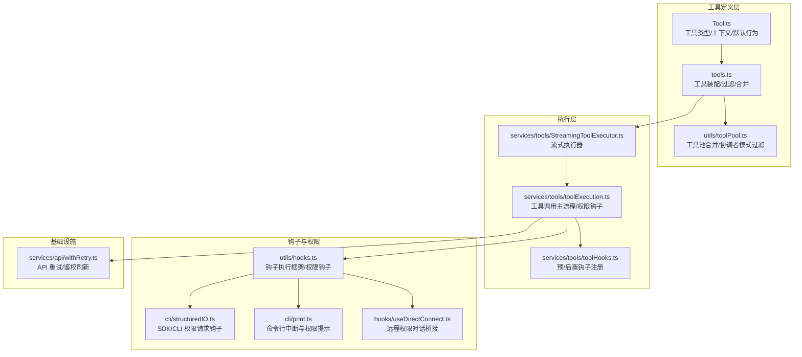
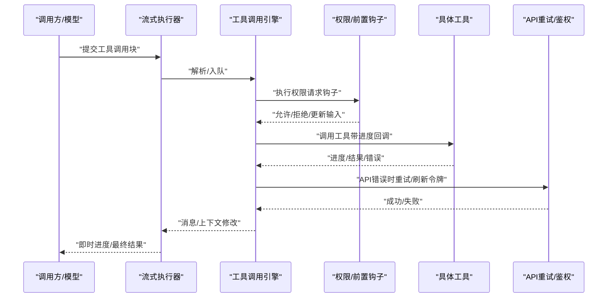
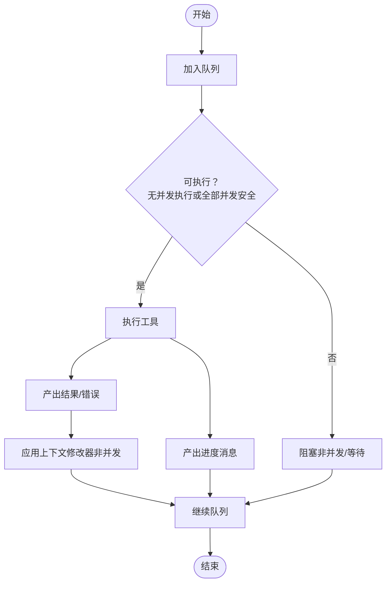
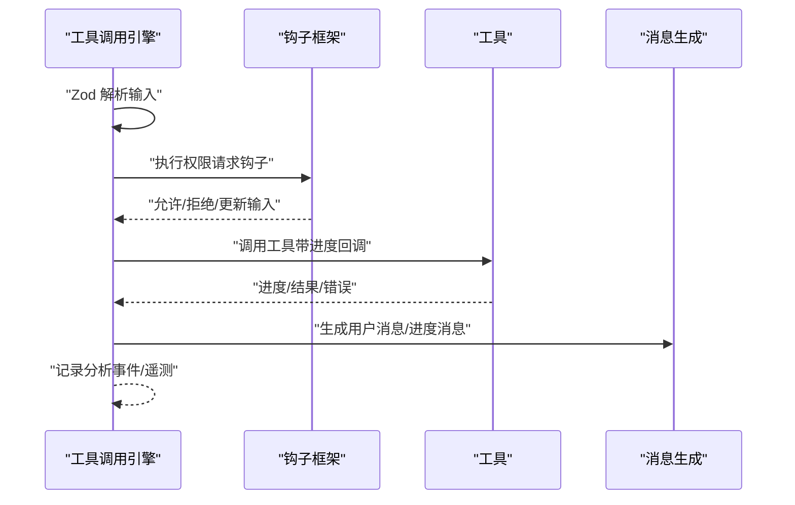
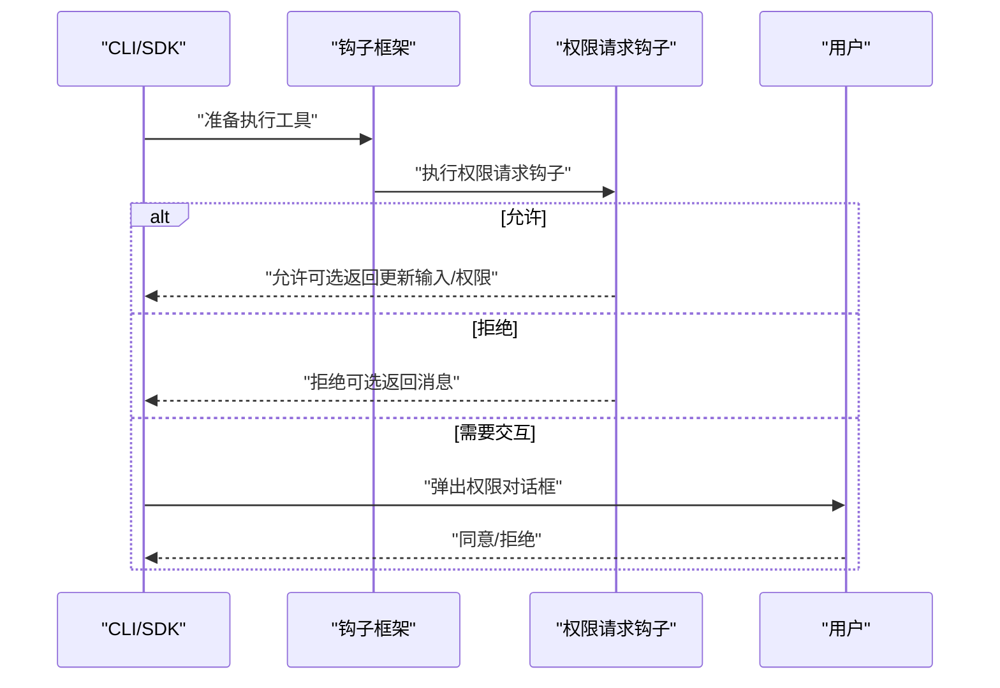
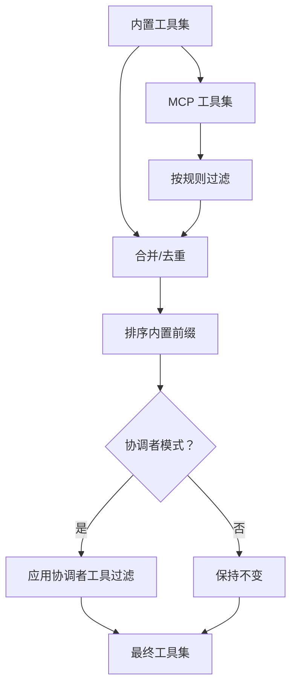
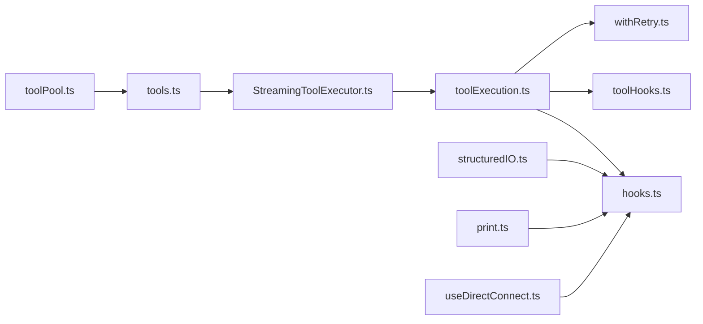

# 工具服务

<cite>
**本文引用的文件**
- [Tool.ts](file://Tool.ts)
- [tools.ts](file://tools.ts)
- [StreamingToolExecutor.ts](file://services/tools/StreamingToolExecutor.ts)
- [toolExecution.ts](file://services/tools/toolExecution.ts)
- [toolHooks.ts](file://services/tools/toolHooks.ts)
- [toolPool.ts](file://utils/toolPool.ts)
- [hooks.ts](file://utils/hooks.ts)
- [structuredIO.ts](file://cli/structuredIO.ts)
- [withRetry.ts](file://services/api/withRetry.ts)
- [print.ts](file://cli/print.ts)
- [useDirectConnect.ts](file://hooks/useDirectConnect.ts)
</cite>

## 目录
1. [简介](#简介)
2. [项目结构](#项目结构)
3. [核心组件](#核心组件)
4. [架构总览](#架构总览)
5. [详细组件分析](#详细组件分析)
6. [依赖分析](#依赖分析)
7. [性能考量](#性能考量)
8. [故障排查指南](#故障排查指南)
9. [结论](#结论)
10. [附录](#附录)

## 简介
本文件面向 Claude Code 的工具服务系统，系统性阐述工具执行器、工具编排器与工具钩子的设计与实现，覆盖工具生命周期管理、并发执行控制、资源分配、流式执行、错误处理与超时重试、权限集成与安全策略等主题。文档同时提供扩展与自定义工具的开发指南，并通过图示帮助读者快速把握整体架构。

## 项目结构
工具服务相关的核心代码分布在以下位置：
- 工具类型与默认行为定义：Tool.ts
- 工具集合装配与过滤：tools.ts、utils/toolPool.ts
- 流式工具执行器：services/tools/StreamingToolExecutor.ts
- 工具调用主流程与权限钩子：services/tools/toolExecution.ts、services/tools/toolHooks.ts
- 钩子执行框架与权限请求钩子：utils/hooks.ts
- CLI 中的权限请求钩子与交互：cli/structuredIO.ts、cli/print.ts
- 远程权限与直接连接：hooks/useDirectConnect.ts
- API 重试与鉴权：services/api/withRetry.ts

**图表来源**
- [Tool.ts:1-793](file://Tool.ts#L1-L793)
- [tools.ts:190-390](file://tools.ts#L190-L390)
- [toolPool.ts:55-80](file://utils/toolPool.ts#L55-L80)
- [StreamingToolExecutor.ts:40-531](file://services/tools/StreamingToolExecutor.ts#L40-L531)
- [toolExecution.ts:337-800](file://services/tools/toolExecution.ts#L337-L800)
- [toolHooks.ts](file://services/tools/toolHooks.ts)
- [hooks.ts:2849-4172](file://utils/hooks.ts#L2849-L4172)
- [structuredIO.ts:568-859](file://cli/structuredIO.ts#L568-L859)
- [print.ts:4178-4209](file://cli/print.ts#L4178-L4209)
- [useDirectConnect.ts:140-156](file://hooks/useDirectConnect.ts#L140-L156)
- [withRetry.ts:232-259](file://services/api/withRetry.ts#L232-L259)

**章节来源**
- [Tool.ts:1-793](file://Tool.ts#L1-L793)
- [tools.ts:190-390](file://tools.ts#L190-L390)
- [toolPool.ts:55-80](file://utils/toolPool.ts#L55-L80)
- [StreamingToolExecutor.ts:40-531](file://services/tools/StreamingToolExecutor.ts#L40-L531)
- [toolExecution.ts:337-800](file://services/tools/toolExecution.ts#L337-L800)
- [toolHooks.ts](file://services/tools/toolHooks.ts)
- [hooks.ts:2849-4172](file://utils/hooks.ts#L2849-L4172)
- [structuredIO.ts:568-859](file://cli/structuredIO.ts#L568-L859)
- [print.ts:4178-4209](file://cli/print.ts#L4178-L4209)
- [useDirectConnect.ts:140-156](file://hooks/useDirectConnect.ts#L140-L156)
- [withRetry.ts:232-259](file://services/api/withRetry.ts#L232-L259)

## 核心组件
- 工具类型与上下文：定义工具接口、输入输出模式、并发安全、权限检查、描述生成、渲染与摘要等能力，并提供构建工具的默认实现与校验函数。
- 工具集合装配：按环境特性、模式（如简单模式、协调者模式）与权限规则装配内置工具与 MCP 工具，去重并保持提示缓存稳定排序。
- 流式工具执行器：接收工具调用块，按并发安全策略排队执行，支持进度消息即时产出、错误传播与取消，保证非并发工具的串行顺序。
- 工具调用主流程：统一处理工具解析、权限决策、钩子执行、工具调用、结果归档与 UI 消息生成；对 Bash 错误进行级联取消以避免无意义的后续任务。
- 钩子与权限：提供权限请求钩子、权限拒绝钩子、前后置工具钩子等扩展点，支持在 CLI/SDK/远程场景中与用户交互或自动决策。
- 工具池合并与过滤：在协调者模式下对工具集进行裁剪，确保仅允许授权工具运行。

**章节来源**
- [Tool.ts:362-793](file://Tool.ts#L362-L793)
- [tools.ts:271-390](file://tools.ts#L271-L390)
- [StreamingToolExecutor.ts:40-531](file://services/tools/StreamingToolExecutor.ts#L40-L531)
- [toolExecution.ts:337-800](file://services/tools/toolExecution.ts#L337-L800)
- [hooks.ts:2849-4172](file://utils/hooks.ts#L2849-L4172)
- [toolPool.ts:35-80](file://utils/toolPool.ts#L35-L80)

## 架构总览
工具服务采用“工具定义 + 执行器 + 钩子/权限”的分层设计：
- 上层：工具定义与装配，负责工具能力声明与可用性控制。
- 中层：流式执行器负责并发调度、进度产出与错误传播。
- 下层：工具调用主流程负责权限决策、钩子执行与工具调用，最终生成消息与上下文修改。
- 外围：钩子框架、CLI/SDK/远程交互、API 重试与鉴权刷新。

**图表来源**
- [StreamingToolExecutor.ts:76-124](file://services/tools/StreamingToolExecutor.ts#L76-L124)
- [toolExecution.ts:492-570](file://services/tools/toolExecution.ts#L492-L570)
- [hooks.ts:4157-4172](file://utils/hooks.ts#L4157-L4172)
- [withRetry.ts:232-259](file://services/api/withRetry.ts#L232-L259)

## 详细组件分析

### 工具执行器（StreamingToolExecutor）
- 并发控制：根据工具是否并发安全决定是否与其他工具并行；非并发工具必须独占执行窗口，且在执行期间阻塞后续非并发工具。
- 排队与执行：维护工具队列，按条件尝试执行；每个工具拥有独立的子 AbortController，用于兄弟进程级联取消（如 Bash 失败导致其他子进程立即终止）。
- 进度与结果：进度消息优先产出，已完成工具的结果按顺序产出；支持丢弃（流式回退时丢弃未完成结果）。
- 取消与中断：支持用户中断（按工具中断行为选择取消或阻塞）、兄弟错误级联取消、流式回退丢弃。
- 上下文修改：非并发工具可应用上下文修改器，而并发工具暂不支持。

**图表来源**
- [StreamingToolExecutor.ts:129-151](file://services/tools/StreamingToolExecutor.ts#L129-L151)
- [StreamingToolExecutor.ts:265-405](file://services/tools/StreamingToolExecutor.ts#L265-L405)
- [StreamingToolExecutor.ts:412-490](file://services/tools/StreamingToolExecutor.ts#L412-L490)

**章节来源**
- [StreamingToolExecutor.ts:40-531](file://services/tools/StreamingToolExecutor.ts#L40-L531)

### 工具调用主流程（runToolUse 与 checkPermissionsAndCallTool）
- 输入校验：使用 Zod 对工具输入进行类型校验；若为延迟加载工具且未发现其 schema，会附加提示引导用户先加载工具。
- 权限与钩子：执行权限请求钩子、前置钩子、权限决策、后置钩子与失败钩子；支持在 CLI/SDK/远程场景中与用户交互或自动决策。
- 工具调用：调用工具的 call 方法，支持进度回调；Bash 工具错误会触发兄弟进程级联取消。
- 结果归档：将工具结果转换为消息，必要时持久化大结果；记录分析事件与遥测。

**图表来源**
- [toolExecution.ts:492-570](file://services/tools/toolExecution.ts#L492-L570)
- [toolExecution.ts:599-800](file://services/tools/toolExecution.ts#L599-L800)
- [hooks.ts:4157-4172](file://utils/hooks.ts#L4157-L4172)

**章节来源**
- [toolExecution.ts:337-800](file://services/tools/toolExecution.ts#L337-L800)
- [hooks.ts:2849-4172](file://utils/hooks.ts#L2849-L4172)

### 工具钩子与权限系统
- 权限请求钩子：在需要弹出权限对话框前执行，可允许/拒绝或建议“总是允许”等权限更新；在 CLI/SDK 中与中断信号结合，确保即使工具阻塞也能响应中断。
- 权限拒绝钩子：当工具被拒绝时触发，便于记录与反馈。
- 前/后置工具钩子：在工具调用前后注入逻辑，支持超时、统计与诊断。

**图表来源**
- [hooks.ts:4157-4172](file://utils/hooks.ts#L4157-L4172)
- [structuredIO.ts:568-859](file://cli/structuredIO.ts#L568-L859)
- [print.ts:4178-4209](file://cli/print.ts#L4178-L4209)

**章节来源**
- [hooks.ts:2849-4172](file://utils/hooks.ts#L2849-L4172)
- [structuredIO.ts:568-859](file://cli/structuredIO.ts#L568-L859)
- [print.ts:4178-4209](file://cli/print.ts#L4178-L4209)
- [useDirectConnect.ts:140-156](file://hooks/useDirectConnect.ts#L140-L156)

### 工具集合装配与过滤
- 装配：按环境特性与模式（如简单模式、REPL 模式、协调者模式）装配内置工具与 MCP 工具，过滤掉被规则禁止的工具。
- 合并与去重：合并初始工具与装配后的工具池，按名称去重，内置工具保持连续前缀以维持提示缓存稳定性。
- 协调者模式过滤：在协调者模式下仅保留允许工具集。

**图表来源**
- [tools.ts:271-390](file://tools.ts#L271-L390)
- [toolPool.ts:55-80](file://utils/toolPool.ts#L55-L80)

**章节来源**
- [tools.ts:190-390](file://tools.ts#L190-L390)
- [toolPool.ts:35-80](file://utils/toolPool.ts#L35-L80)

## 依赖分析
- 组件耦合：
  - StreamingToolExecutor 依赖工具定义与上下文，以及工具调用引擎；它通过 AbortController 实现父子/兄弟取消链路。
  - toolExecution 依赖钩子框架、权限系统与工具定义；对 Bash 工具有特殊级联取消逻辑。
  - 工具装配层（tools.ts、toolPool.ts）依赖权限上下文与模式配置，确保工具集一致性。
- 外部依赖：
  - CLI/SDK 与远程权限桥接（structuredIO.ts、useDirectConnect.ts）通过钩子与中断信号协同工作。
  - API 层通过 withRetry.ts 提供统一的重试与鉴权刷新。

**图表来源**
- [StreamingToolExecutor.ts:40-531](file://services/tools/StreamingToolExecutor.ts#L40-L531)
- [toolExecution.ts:337-800](file://services/tools/toolExecution.ts#L337-L800)
- [toolHooks.ts](file://services/tools/toolHooks.ts)
- [hooks.ts:2849-4172](file://utils/hooks.ts#L2849-L4172)
- [tools.ts:190-390](file://tools.ts#L190-L390)
- [toolPool.ts:55-80](file://utils/toolPool.ts#L55-L80)
- [structuredIO.ts:568-859](file://cli/structuredIO.ts#L568-L859)
- [print.ts:4178-4209](file://cli/print.ts#L4178-L4209)
- [useDirectConnect.ts:140-156](file://hooks/useDirectConnect.ts#L140-L156)
- [withRetry.ts:232-259](file://services/api/withRetry.ts#L232-L259)

**章节来源**
- [StreamingToolExecutor.ts:40-531](file://services/tools/StreamingToolExecutor.ts#L40-L531)
- [toolExecution.ts:337-800](file://services/tools/toolExecution.ts#L337-L800)
- [hooks.ts:2849-4172](file://utils/hooks.ts#L2849-L4172)
- [tools.ts:190-390](file://tools.ts#L190-L390)
- [toolPool.ts:55-80](file://utils/toolPool.ts#L55-L80)
- [structuredIO.ts:568-859](file://cli/structuredIO.ts#L568-L859)
- [print.ts:4178-4209](file://cli/print.ts#L4178-L4209)
- [useDirectConnect.ts:140-156](file://hooks/useDirectConnect.ts#L140-L156)
- [withRetry.ts:232-259](file://services/api/withRetry.ts#L232-L259)

## 性能考量
- 并发策略：并发安全工具并行执行，非并发工具串行，避免资源争用与状态冲突。
- 进度优先：进度消息优先产出，提升用户感知与交互效率。
- 缓存与排序：工具池按名称排序并保持内置工具前缀，有助于提示缓存命中与跨用户缓存稳定性。
- 级联取消：Bash 错误触发兄弟进程立即终止，减少无效计算与资源浪费。
- 重试与鉴权：API 层统一重试与令牌刷新，降低外部依赖抖动对用户体验的影响。

[本节为通用性能讨论，无需特定文件来源]

## 故障排查指南
- 工具不可用或输入验证失败：
  - 现象：返回“无此工具可用”或输入验证错误。
  - 排查：确认工具名与别名、输入 schema 是否匹配；延迟加载工具需先加载 schema。
- 权限被拒绝：
  - 现象：工具被拒绝，可能伴随权限请求钩子或用户交互。
  - 排查：检查权限规则、钩子返回值与用户选择；查看权限拒绝钩子输出。
- Bash 工具级联失败：
  - 现象：一个 Bash 工具失败导致其他兄弟进程被取消。
  - 排查：检查 Bash 命令链依赖关系与错误日志。
- CLI/SDK 中断：
  - 现象：权限请求钩子阻塞导致无法响应中断。
  - 排查：确保与中断信号组合使用，及时清理监听器。
- API 错误与重试：
  - 现象：外部 API 返回 401/403 或连接过期。
  - 排查：启用重试与令牌刷新逻辑，确认凭据有效性。

**章节来源**
- [toolExecution.ts:369-490](file://services/tools/toolExecution.ts#L369-L490)
- [toolExecution.ts:614-733](file://services/tools/toolExecution.ts#L614-L733)
- [hooks.ts:4157-4172](file://utils/hooks.ts#L4157-L4172)
- [print.ts:4178-4209](file://cli/print.ts#L4178-L4209)
- [withRetry.ts:232-259](file://services/api/withRetry.ts#L232-L259)

## 结论
该工具服务系统通过清晰的分层设计实现了高扩展性与强安全性：工具定义层提供统一接口与默认行为；执行器层保障并发与顺序约束；钩子与权限层提供灵活的扩展点与可控的安全边界；API 层提供稳健的重试与鉴权机制。上述设计既满足了复杂场景下的工具编排需求，也兼顾了用户体验与系统稳定性。

[本节为总结，无需特定文件来源]

## 附录

### 工具生命周期管理
- 生命周期阶段：解析输入 → 权限与钩子 → 工具调用 → 结果归档 → 消息产出。
- 关键点：并发安全判定、进度优先产出、上下文修改器应用、错误分类与记录。

**章节来源**
- [toolExecution.ts:337-800](file://services/tools/toolExecution.ts#L337-L800)
- [StreamingToolExecutor.ts:412-490](file://services/tools/StreamingToolExecutor.ts#L412-L490)

### 并发执行控制与资源分配
- 并发策略：并发安全工具可并行；非并发工具串行，执行期间阻塞后续非并发工具。
- 资源分配：每个工具拥有独立子 AbortController，Bash 错误触发兄弟进程级联取消。

**章节来源**
- [StreamingToolExecutor.ts:129-151](file://services/tools/StreamingToolExecutor.ts#L129-L151)
- [StreamingToolExecutor.ts:294-318](file://services/tools/StreamingToolExecutor.ts#L294-L318)

### 流式工具执行器实现要点
- 即时进度：进度消息优先产出，提升交互体验。
- 丢弃策略：流式回退时丢弃未完成结果，避免污染后续会话。
- 中断行为：依据工具中断行为选择取消或阻塞。

**章节来源**
- [StreamingToolExecutor.ts:412-490](file://services/tools/StreamingToolExecutor.ts#L412-L490)
- [Tool.ts:416-417](file://Tool.ts#L416-L417)

### 错误处理、超时管理与重试逻辑
- 错误分类：区分输入验证、工具内部、外部 API 等错误类型。
- 超时与中断：钩子与权限请求支持超时与中断信号组合。
- 重试与鉴权：API 层统一处理 401/403 与令牌刷新。

**章节来源**
- [toolExecution.ts:150-171](file://services/tools/toolExecution.ts#L150-L171)
- [hooks.ts:4157-4172](file://utils/hooks.ts#L4157-L4172)
- [withRetry.ts:232-259](file://services/api/withRetry.ts#L232-L259)

### 工具服务与权限系统的集成
- 集成方式：权限请求钩子在弹窗前执行，支持自动决策与“总是允许”更新；CLI/SDK/远程通过中断信号与钩子协作。
- 安全考虑：内置工具前缀保持稳定、并发安全判定、Bash 级联取消、权限规则与拒绝钩子。

**章节来源**
- [hooks.ts:2849-4172](file://utils/hooks.ts#L2849-L4172)
- [structuredIO.ts:568-859](file://cli/structuredIO.ts#L568-L859)
- [useDirectConnect.ts:140-156](file://hooks/useDirectConnect.ts#L140-L156)

### 扩展方法与自定义工具开发指南
- 新增工具步骤：
  - 使用工具构建器定义工具能力（输入/输出 schema、并发安全、只读/破坏性、权限检查、描述与渲染等）。
  - 在工具装配层注册工具，确保名称唯一与权限规则生效。
  - 如需 MCP 工具，通过 MCP 工具装配与过滤逻辑接入。
- 钩子扩展：
  - 注册权限请求钩子、前后置工具钩子，注意超时与中断信号处理。
- 性能优化建议：
  - 将可并行的工具标记为并发安全，减少串行等待。
  - 利用进度消息优先产出与提示缓存稳定性策略。

**章节来源**
- [Tool.ts:783-793](file://Tool.ts#L783-L793)
- [tools.ts:190-390](file://tools.ts#L190-L390)
- [toolPool.ts:55-80](file://utils/toolPool.ts#L55-L80)
- [hooks.ts:4157-4172](file://utils/hooks.ts#L4157-L4172)