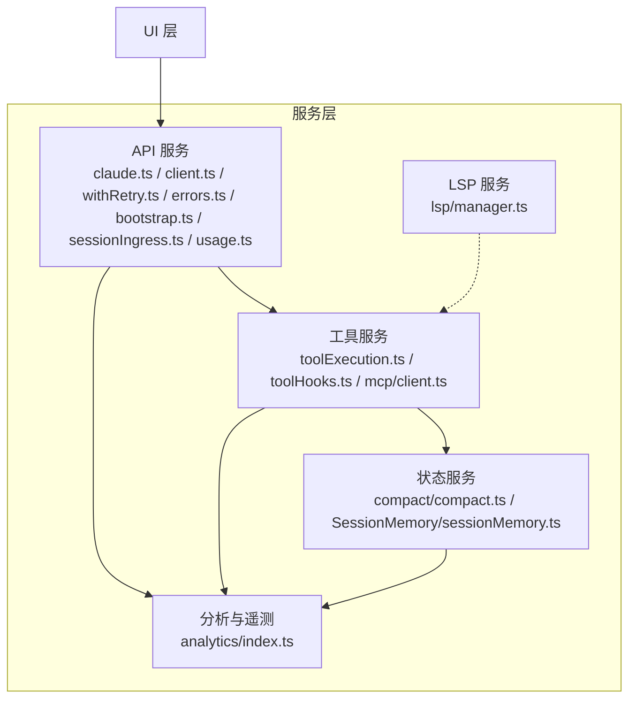
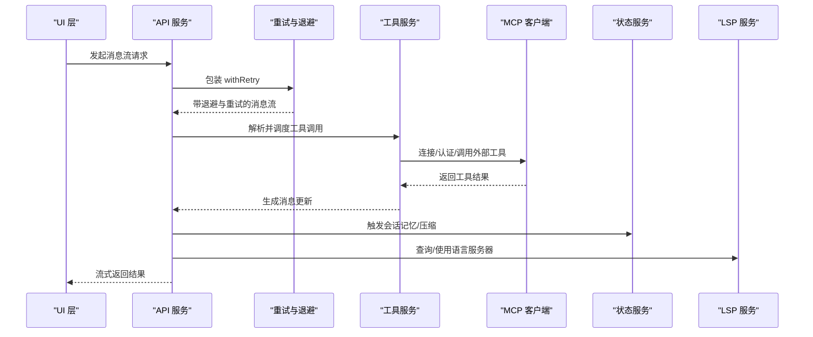
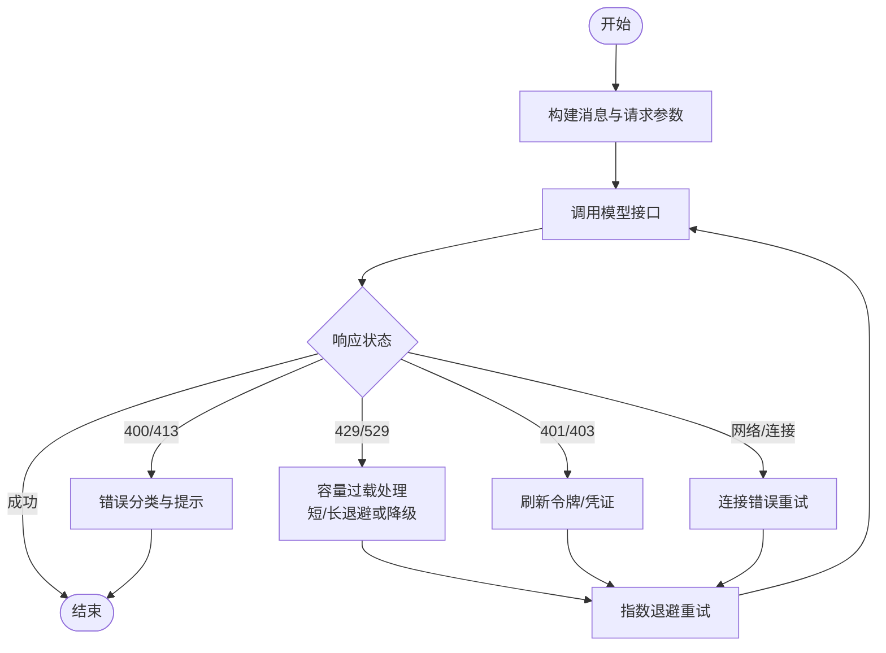
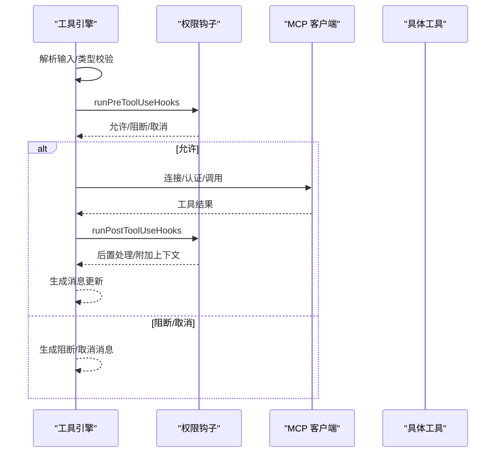
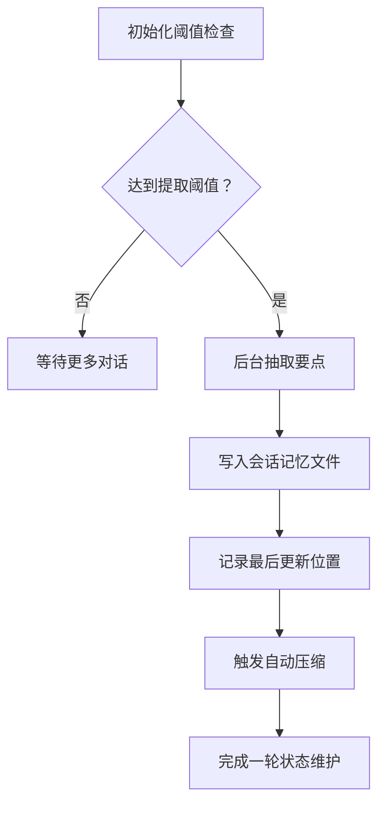
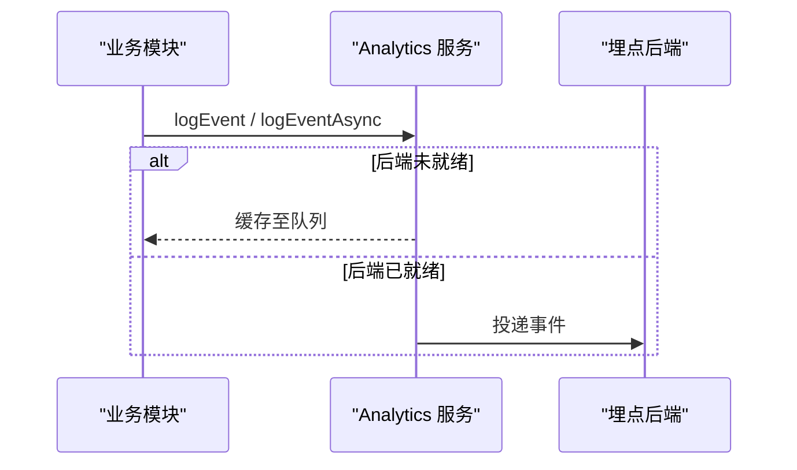
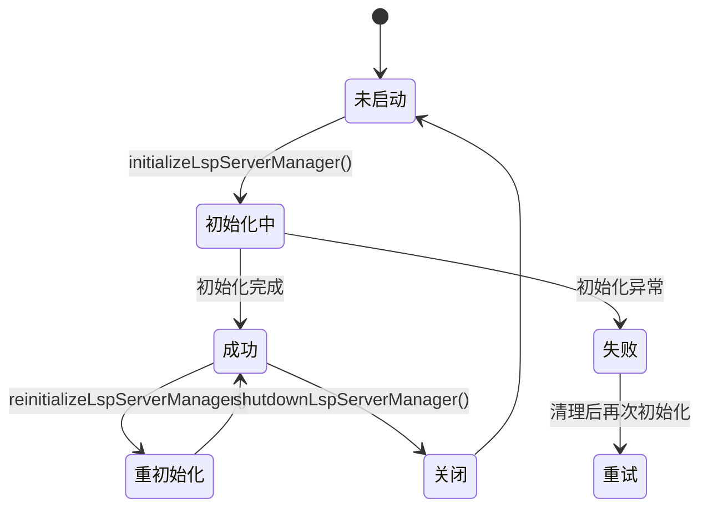
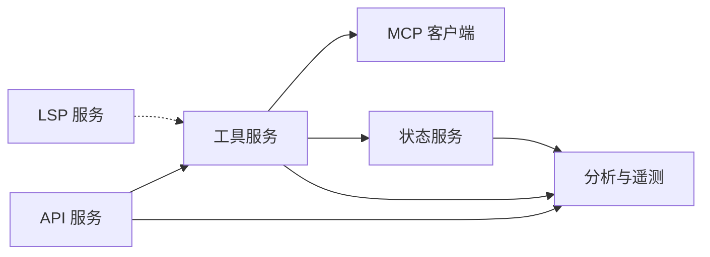

# 服务层

<cite>
**本文引用的文件**
- [services/tools/toolExecution.ts](file://services/tools/toolExecution.ts)
- [services/tools/toolHooks.ts](file://services/tools/toolHooks.ts)
- [services/lsp/manager.ts](file://services/lsp/manager.ts)
- [services/mcp/client.ts](file://services/mcp/client.ts)
- [services/analytics/index.ts](file://services/analytics/index.ts)
- [services/api/claude.ts](file://services/api/claude.ts)
- [services/api/client.ts](file://services/api/client.ts)
- [services/api/withRetry.ts](file://services/api/withRetry.ts)
- [services/api/errors.ts](file://services/api/errors.ts)
- [services/api/bootstrap.ts](file://services/api/bootstrap.ts)
- [services/api/sessionIngress.ts](file://services/api/sessionIngress.ts)
- [services/api/usage.ts](file://services/api/usage.ts)
- [services/compact/compact.ts](file://services/compact/compact.ts)
- [services/SessionMemory/sessionMemory.ts](file://services/SessionMemory/sessionMemory.ts)
</cite>

## 目录
1. [引言](#引言)
2. [项目结构](#项目结构)
3. [核心组件](#核心组件)
4. [架构总览](#架构总览)
5. [详细组件分析](#详细组件分析)
6. [依赖分析](#依赖分析)
7. [性能考虑](#性能考虑)
8. [故障排查指南](#故障排查指南)
9. [结论](#结论)
10. [附录](#附录)

## 引言
本文件系统性梳理 Claude Code 的服务层架构，聚焦服务层的整体设计、分层职责、通信机制与依赖注入模式，并结合实际源码路径给出可操作的扩展与自定义指南。服务层围绕“API 服务、工具服务、状态服务（会话记忆/压缩）、MCP 服务、分析与遥测”五大支柱展开，既支持本地交互也支持远程会话与插件生态，同时提供完善的错误处理、重试与性能监控能力。

## 项目结构
服务层位于仓库根目录下的 services 子树，按功能域划分为：
- API 服务：消息流、客户端封装、重试与错误分类、引导数据拉取、会话持久化与用量查询
- 工具服务：工具执行、权限钩子、MCP 工具桥接
- 状态服务：会话记忆、自动压缩、上下文折叠
- 分析与遥测：事件队列、埋点导出、指标聚合
- LSP 服务：语言服务器管理器单例与生命周期

图示来源
- [services/api/claude.ts](file://services/api/claude.ts)
- [services/api/client.ts](file://services/api/client.ts)
- [services/api/withRetry.ts](file://services/api/withRetry.ts)
- [services/api/errors.ts](file://services/api/errors.ts)
- [services/api/bootstrap.ts](file://services/api/bootstrap.ts)
- [services/api/sessionIngress.ts](file://services/api/sessionIngress.ts)
- [services/api/usage.ts](file://services/api/usage.ts)
- [services/tools/toolExecution.ts](file://services/tools/toolExecution.ts)
- [services/tools/toolHooks.ts](file://services/tools/toolHooks.ts)
- [services/mcp/client.ts](file://services/mcp/client.ts)
- [services/compact/compact.ts](file://services/compact/compact.ts)
- [services/SessionMemory/sessionMemory.ts](file://services/SessionMemory/sessionMemory.ts)
- [services/analytics/index.ts](file://services/analytics/index.ts)
- [services/lsp/manager.ts](file://services/lsp/manager.ts)

章节来源
- [services/api/claude.ts](file://services/api/claude.ts)
- [services/api/client.ts](file://services/api/client.ts)
- [services/api/withRetry.ts](file://services/api/withRetry.ts)
- [services/api/errors.ts](file://services/api/errors.ts)
- [services/api/bootstrap.ts](file://services/api/bootstrap.ts)
- [services/api/sessionIngress.ts](file://services/api/sessionIngress.ts)
- [services/api/usage.ts](file://services/api/usage.ts)
- [services/tools/toolExecution.ts](file://services/tools/toolExecution.ts)
- [services/tools/toolHooks.ts](file://services/tools/toolHooks.ts)
- [services/mcp/client.ts](file://services/mcp/client.ts)
- [services/compact/compact.ts](file://services/compact/compact.ts)
- [services/SessionMemory/sessionMemory.ts](file://services/SessionMemory/sessionMemory.ts)
- [services/analytics/index.ts](file://services/analytics/index.ts)
- [services/lsp/manager.ts](file://services/lsp/manager.ts)

## 核心组件
- API 服务：负责消息流构建、模型调用、重试与退避、错误分类与提示、引导数据拉取、会话持久化与用量查询
- 工具服务：统一的工具执行管线，含输入校验、权限钩子、进度事件、MCP 工具桥接与认证缓存
- 状态服务：会话记忆与自动压缩，基于阈值触发与后台子代理抽取
- 分析与遥测：事件队列、采样与异步落盘、多后端导出
- LSP 服务：全局单例的语言服务器管理器，延迟初始化与健康检查

章节来源
- [services/api/claude.ts](file://services/api/claude.ts)
- [services/tools/toolExecution.ts](file://services/tools/toolExecution.ts)
- [services/tools/toolHooks.ts](file://services/tools/toolHooks.ts)
- [services/compact/compact.ts](file://services/compact/compact.ts)
- [services/SessionMemory/sessionMemory.ts](file://services/SessionMemory/sessionMemory.ts)
- [services/analytics/index.ts](file://services/analytics/index.ts)
- [services/lsp/manager.ts](file://services/lsp/manager.ts)

## 架构总览
服务层采用“分层 + 职责分离”的设计：
- 上层 UI 通过 API 服务发起请求，API 服务封装客户端、重试与错误处理
- 工具服务在消息流中插入工具调用与权限控制，MCP 客户端负责外部工具连接
- 状态服务在后台维护会话记忆与上下文压缩，避免影响主线程
- 分析与遥测贯穿各层，提供可观测性与产品度量
- LSP 作为独立子系统，为编辑器集成提供诊断与语言能力

图示来源
- [services/api/withRetry.ts](file://services/api/withRetry.ts)
- [services/tools/toolExecution.ts](file://services/tools/toolExecution.ts)
- [services/mcp/client.ts](file://services/mcp/client.ts)
- [services/compact/compact.ts](file://services/compact/compact.ts)
- [services/SessionMemory/sessionMemory.ts](file://services/SessionMemory/sessionMemory.ts)
- [services/lsp/manager.ts](file://services/lsp/manager.ts)

## 详细组件分析

### API 服务
- 消息流与客户端封装：统一构建消息、系统提示、工具模式与输出配置；支持多种模型提供方与认证方式
- 重试与退避：指数退避、幂等重试、容量过载与速率限制分支、持久会话模式下的心跳与等待
- 错误分类与提示：针对媒体大小、令牌超限、并发工具块、无效模型名等场景生成用户可理解的提示
- 引导数据：从 OAuth 或 API Key 获取客户端数据与模型选项，带缓存与变更检测
- 会话持久化：基于 JWT 的乐观并发写入，序列化同一会话的写入，处理 409 冲突与 401 失效
- 用量查询：订阅者用量与额外用量信息的获取

图示来源
- [services/api/withRetry.ts](file://services/api/withRetry.ts)
- [services/api/errors.ts](file://services/api/errors.ts)
- [services/api/bootstrap.ts](file://services/api/bootstrap.ts)
- [services/api/sessionIngress.ts](file://services/api/sessionIngress.ts)
- [services/api/usage.ts](file://services/api/usage.ts)

章节来源
- [services/api/claude.ts](file://services/api/claude.ts)
- [services/api/client.ts](file://services/api/client.ts)
- [services/api/withRetry.ts](file://services/api/withRetry.ts)
- [services/api/errors.ts](file://services/api/errors.ts)
- [services/api/bootstrap.ts](file://services/api/bootstrap.ts)
- [services/api/sessionIngress.ts](file://services/api/sessionIngress.ts)
- [services/api/usage.ts](file://services/api/usage.ts)

### 工具服务
- 统一执行管线：解析输入、类型校验、权限钩子、进度事件、MCP 工具识别与传输类型推断、错误归类与日志
- 权限钩子：前置与后置钩子，支持阻断、附加上下文、取消与错误提示
- MCP 工具桥接：连接不同传输（SSE/WebSocket/HTTP/SDK），认证与超时包装，会话过期检测与缓存清理

图示来源
- [services/tools/toolExecution.ts](file://services/tools/toolExecution.ts)
- [services/tools/toolHooks.ts](file://services/tools/toolHooks.ts)
- [services/mcp/client.ts](file://services/mcp/client.ts)

章节来源
- [services/tools/toolExecution.ts](file://services/tools/toolExecution.ts)
- [services/tools/toolHooks.ts](file://services/tools/toolHooks.ts)
- [services/mcp/client.ts](file://services/mcp/client.ts)

### 状态服务
- 会话记忆：基于动态阈值（令牌增长、工具调用次数、最后轮次无工具调用）触发，后台子代理抽取要点并写入 Markdown 文件
- 自动压缩：对上下文进行分组、摘要与裁剪，支持图片剥离与技能内容截断，避免压缩导致的精度损失

图示来源
- [services/SessionMemory/sessionMemory.ts](file://services/SessionMemory/sessionMemory.ts)
- [services/compact/compact.ts](file://services/compact/compact.ts)

章节来源
- [services/SessionMemory/sessionMemory.ts](file://services/SessionMemory/sessionMemory.ts)
- [services/compact/compact.ts](file://services/compact/compact.ts)

### 分析与遥测
- 事件队列：在埋点后端未就绪前暂存事件，就绪后批量投递
- 采样与异步：支持同步/异步事件，采样配置由动态配置驱动
- 导出：统一经后端导出到 Datadog 与第一方事件日志

图示来源
- [services/analytics/index.ts](file://services/analytics/index.ts)

章节来源
- [services/analytics/index.ts](file://services/analytics/index.ts)

### LSP 服务
- 单例管理器：延迟初始化、幂等启动、健康检查与被动通知注册
- 重初始化：插件刷新后重新加载配置，确保新插件 LSP 可见
- 关闭清理：优雅关闭所有运行中的语言服务器并清理状态

图示来源
- [services/lsp/manager.ts](file://services/lsp/manager.ts)

章节来源
- [services/lsp/manager.ts](file://services/lsp/manager.ts)

## 依赖分析
- 低耦合高内聚：API 服务、工具服务、状态服务分别承担不同职责，通过消息与事件解耦
- 依赖注入模式：工具执行上下文 ToolUseContext 注入工具集合、MCP 客户端、应用状态等，便于测试与扩展
- 外部依赖：Anthropic SDK、MCP SDK、axios、lodash-es 等；通过 withRetry 与错误分类降低外部失败对用户体验的影响
- 循环依赖规避：分析服务仅通过事件接口与其它模块交互，避免直接导入造成循环

图示来源
- [services/api/claude.ts](file://services/api/claude.ts)
- [services/tools/toolExecution.ts](file://services/tools/toolExecution.ts)
- [services/mcp/client.ts](file://services/mcp/client.ts)
- [services/compact/compact.ts](file://services/compact/compact.ts)
- [services/SessionMemory/sessionMemory.ts](file://services/SessionMemory/sessionMemory.ts)
- [services/analytics/index.ts](file://services/analytics/index.ts)
- [services/lsp/manager.ts](file://services/lsp/manager.ts)

章节来源
- [services/api/claude.ts](file://services/api/claude.ts)
- [services/tools/toolExecution.ts](file://services/tools/toolExecution.ts)
- [services/mcp/client.ts](file://services/mcp/client.ts)
- [services/compact/compact.ts](file://services/compact/compact.ts)
- [services/SessionMemory/sessionMemory.ts](file://services/SessionMemory/sessionMemory.ts)
- [services/analytics/index.ts](file://services/analytics/index.ts)
- [services/lsp/manager.ts](file://services/lsp/manager.ts)

## 性能考虑
- 重试与退避：指数退避与抖动减少雪崩效应；容量过载场景区分短/长退避与降级，避免 prompt cache 破坏
- 上下文压缩：图片剥离、技能截断、令牌预算分配，降低 API 调用成本与延迟
- 并发与序列化：会话写入序列化，避免并发冲突带来的重复写入与回滚
- LSP 延迟：惰性启动与健康检查，避免不必要的资源占用

## 故障排查指南
- 速率限制与容量过载：关注 429/529 场景，确认是否进入持久重试模式与是否触发模型降级
- 认证问题：401/403 通常触发令牌刷新与凭证清理；MCP 服务端认证失败会缓存“需要认证”状态
- 媒体与上下文过大：图片/PDF/多图限制与提示；超过上下文上限时使用压缩与摘要
- 会话持久化冲突：409 冲突时采用服务器最新 UUID 并重试；401 表示令牌失效需重新登录
- 工具调用错误：输入校验失败、权限阻断、MCP 工具错误，查看工具执行日志与进度事件

章节来源
- [services/api/withRetry.ts](file://services/api/withRetry.ts)
- [services/api/errors.ts](file://services/api/errors.ts)
- [services/api/sessionIngress.ts](file://services/api/sessionIngress.ts)
- [services/tools/toolExecution.ts](file://services/tools/toolExecution.ts)
- [services/mcp/client.ts](file://services/mcp/client.ts)

## 结论
服务层以清晰的分层与职责边界支撑了 Claude Code 的核心能力：稳定的 API 调用、灵活的工具执行、可靠的会话状态与可观测性。通过重试与退避、错误分类与提示、会话记忆与压缩、以及 MCP 生态桥接，服务层在复杂场景下仍保持一致的用户体验与可维护性。建议在扩展新服务时遵循现有模式：明确职责、注入上下文、统一错误与日志、利用分析服务进行度量与观测。

## 附录
- 扩展新工具：参考工具执行管线与权限钩子，确保输入校验、进度事件与错误处理完整
- 自定义服务：通过 ToolUseContext 注入新依赖，遵循单例与延迟初始化原则
- 最佳实践：优先使用 withRetry 封装外部调用；在工具执行前后使用钩子进行审计与安全控制；对大体量上下文使用压缩与摘要策略
- 测试策略：对关键流程（重试、错误分类、会话持久化、LSP 生命周期）编写单元与集成测试，覆盖边界条件与异常路径