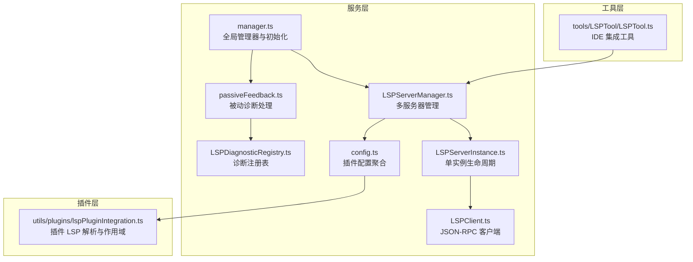
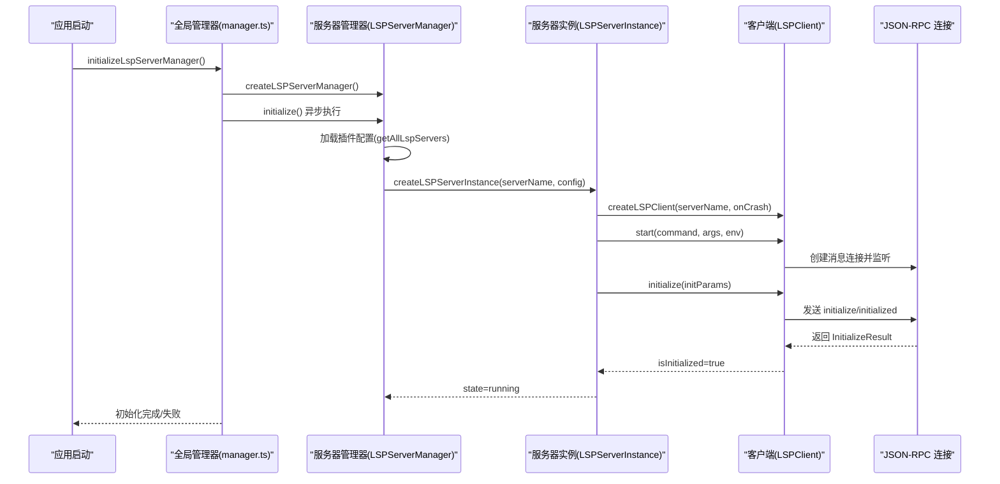
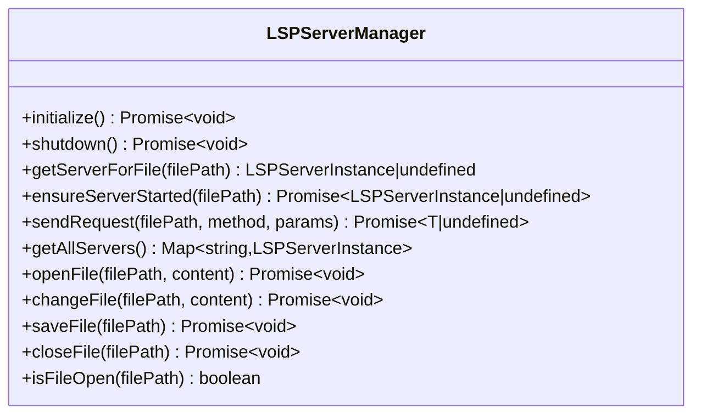
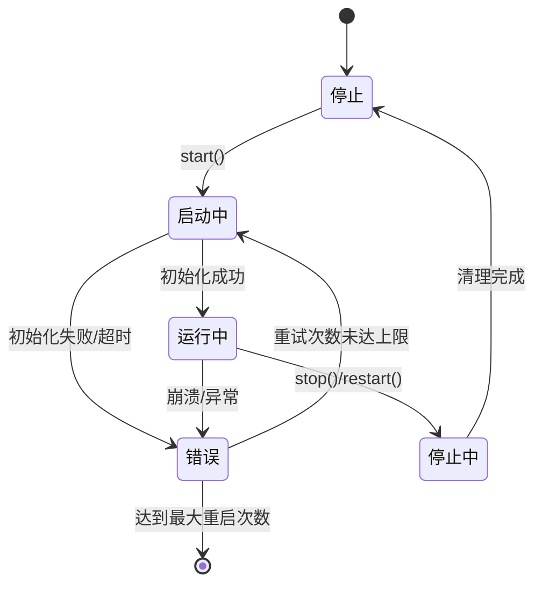
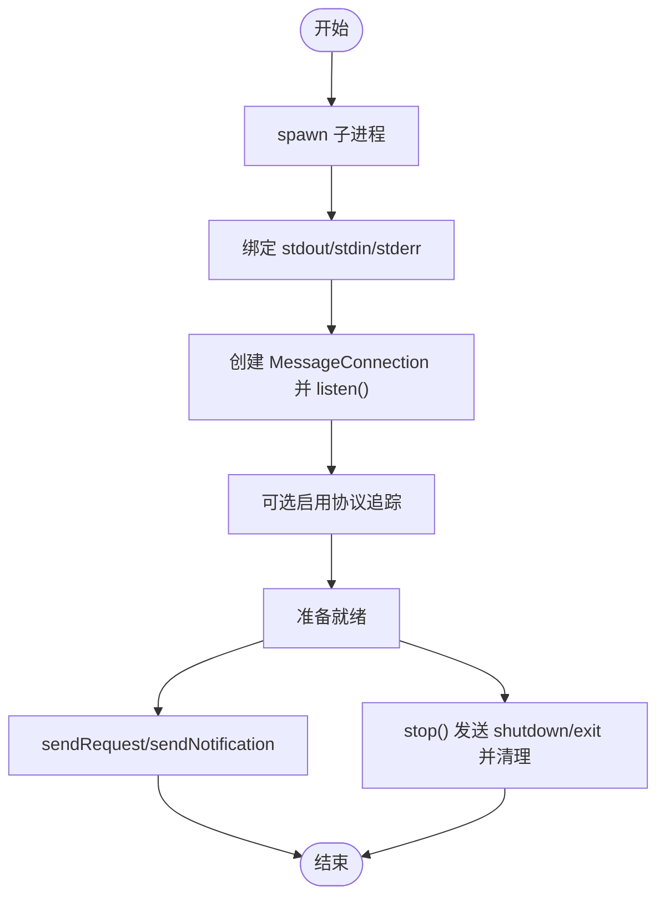
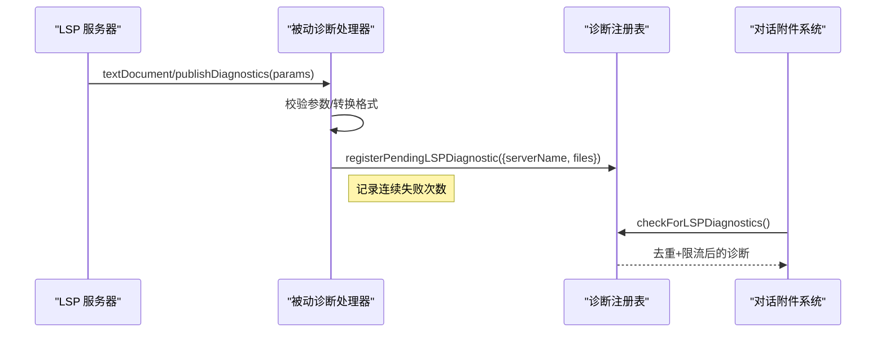
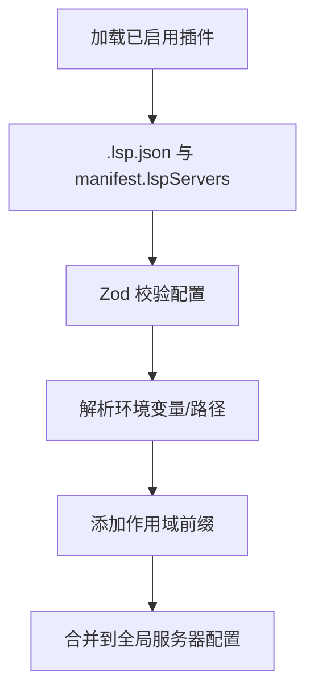
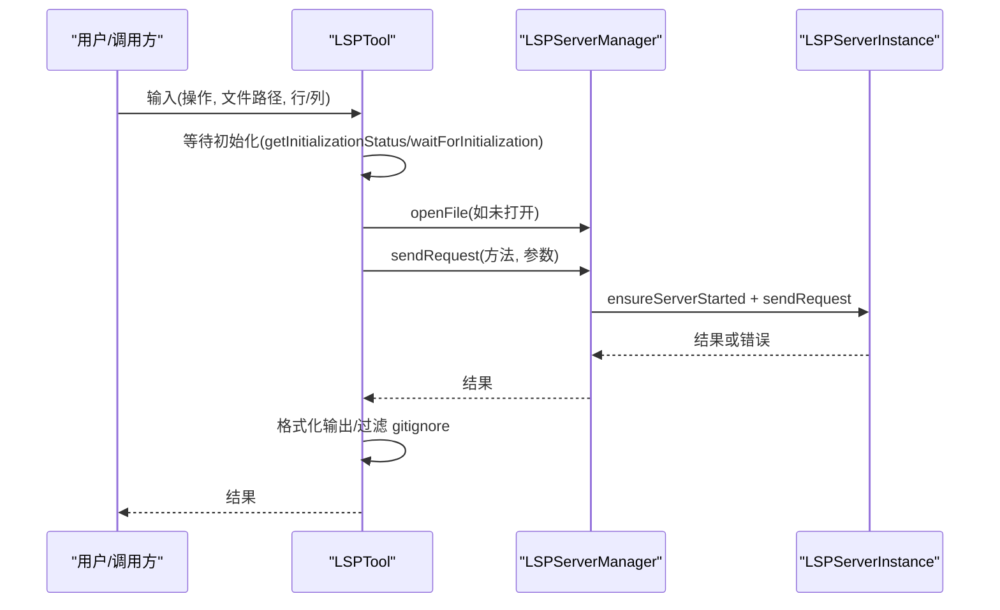
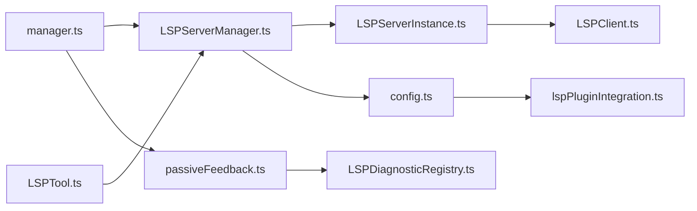

# LSP 服务器管理

<cite>
**本文引用的文件**
- [services/lsp/manager.ts](file://services/lsp/manager.ts)
- [services/lsp/LSPServerManager.ts](file://services/lsp/LSPServerManager.ts)
- [services/lsp/LSPServerInstance.ts](file://services/lsp/LSPServerInstance.ts)
- [services/lsp/LSPClient.ts](file://services/lsp/LSPClient.ts)
- [services/lsp/LSPDiagnosticRegistry.ts](file://services/lsp/LSPDiagnosticRegistry.ts)
- [services/lsp/passiveFeedback.ts](file://services/lsp/passiveFeedback.ts)
- [services/lsp/config.ts](file://services/lsp/config.ts)
- [utils/plugins/lspPluginIntegration.ts](file://utils/plugins/lspPluginIntegration.ts)
- [tools/LSPTool/LSPTool.ts](file://tools/LSPTool/LSPTool.ts)
</cite>

## 目录
1. [简介](#简介)
2. [项目结构](#项目结构)
3. [核心组件](#核心组件)
4. [架构总览](#架构总览)
5. [详细组件分析](#详细组件分析)
6. [依赖关系分析](#依赖关系分析)
7. [性能考虑](#性能考虑)
8. [故障排查指南](#故障排查指南)
9. [结论](#结论)
10. [附录：使用示例与最佳实践](#附录使用示例与最佳实践)

## 简介
本文件面向 Claude Code 的 LSP（语言服务器协议）服务器管理系统，系统性阐述 LSP 服务器的生命周期管理、连接建立与状态监控机制；详解 LSPServerManager 的架构设计、服务器实例化过程与故障恢复策略；覆盖 LSP 客户端配置、诊断注册表与被动反馈处理；并提供 LSP 服务器启动流程、健康检查与资源清理机制。同时，结合 IDE 集成场景下的诊断系统、悬停提示与跳转定义能力，给出性能优化策略、内存管理与并发控制建议，并通过路径引用的方式提供可直接定位到源码的示例。

## 项目结构
围绕 LSP 的核心模块分布于以下位置：
- 服务层：LSP 管理器、服务器实例、客户端封装、诊断注册与被动反馈、配置加载
- 工具层：LSPTool，面向 IDE 集成的查询工具
- 插件层：插件中 LSP 服务器的发现、解析与作用域化

图示来源
- [services/lsp/manager.ts:145-208](file://services/lsp/manager.ts#L145-L208)
- [services/lsp/LSPServerManager.ts:59-148](file://services/lsp/LSPServerManager.ts#L59-L148)
- [services/lsp/LSPServerInstance.ts:90-126](file://services/lsp/LSPServerInstance.ts#L90-L126)
- [services/lsp/LSPClient.ts:51-54](file://services/lsp/LSPClient.ts#L51-L54)
- [services/lsp/LSPDiagnosticRegistry.ts:41-85](file://services/lsp/LSPDiagnosticRegistry.ts#L41-L85)
- [services/lsp/passiveFeedback.ts:125-127](file://services/lsp/passiveFeedback.ts#L125-L127)
- [services/lsp/config.ts:15-79](file://services/lsp/config.ts#L15-L79)
- [utils/plugins/lspPluginIntegration.ts:322-358](file://utils/plugins/lspPluginIntegration.ts#L322-L358)
- [tools/LSPTool/LSPTool.ts:224-252](file://tools/LSPTool/LSPTool.ts#L224-L252)

章节来源
- [services/lsp/manager.ts:145-208](file://services/lsp/manager.ts#L145-L208)
- [services/lsp/LSPServerManager.ts:59-148](file://services/lsp/LSPServerManager.ts#L59-L148)
- [services/lsp/LSPServerInstance.ts:90-126](file://services/lsp/LSPServerInstance.ts#L90-L126)
- [services/lsp/LSPClient.ts:51-54](file://services/lsp/LSPClient.ts#L51-L54)
- [services/lsp/LSPDiagnosticRegistry.ts:41-85](file://services/lsp/LSPDiagnosticRegistry.ts#L41-L85)
- [services/lsp/passiveFeedback.ts:125-127](file://services/lsp/passiveFeedback.ts#L125-L127)
- [services/lsp/config.ts:15-79](file://services/lsp/config.ts#L15-L79)
- [utils/plugins/lspPluginIntegration.ts:322-358](file://utils/plugins/lspPluginIntegration.ts#L322-L358)
- [tools/LSPTool/LSPTool.ts:224-252](file://tools/LSPTool/LSPTool.ts#L224-L252)

## 核心组件
- 全局管理器与初始化：负责 LSPServerManager 的单例创建、异步初始化、状态跟踪与重初始化
- LSPServerManager：按文件扩展名路由请求，管理多个服务器实例，负责文件同步（open/change/save/close）
- LSPServerInstance：单个 LSP 服务器的生命周期、健康检查、请求重试与手动重启
- LSPClient：基于 vscode-jsonrpc 的 JSON-RPC 封装，负责进程启动、连接建立、错误/关闭处理、通知与请求转发
- 被动诊断与注册表：监听 LSP 诊断并进行去重、限流与跨轮次去重，统一交付给对话附件系统
- 插件配置：从插件加载 LSP 服务器配置，解析环境变量、添加作用域前缀
- LSPTool：面向 IDE 的工具入口，等待初始化完成、确保文件已打开、调用 LSP 并格式化结果

章节来源
- [services/lsp/manager.ts:63-208](file://services/lsp/manager.ts#L63-L208)
- [services/lsp/LSPServerManager.ts:16-43](file://services/lsp/LSPServerManager.ts#L16-L43)
- [services/lsp/LSPServerInstance.ts:33-65](file://services/lsp/LSPServerInstance.ts#L33-L65)
- [services/lsp/LSPClient.ts:21-41](file://services/lsp/LSPClient.ts#L21-L41)
- [services/lsp/LSPDiagnosticRegistry.ts:24-40](file://services/lsp/LSPDiagnosticRegistry.ts#L24-L40)
- [services/lsp/passiveFeedback.ts:117-124](file://services/lsp/passiveFeedback.ts#L117-L124)
- [services/lsp/config.ts:9-14](file://services/lsp/config.ts#L9-L14)
- [utils/plugins/lspPluginIntegration.ts:318-321](file://utils/plugins/lspPluginIntegration.ts#L318-L321)
- [tools/LSPTool/LSPTool.ts:127-151](file://tools/LSPTool/LSPTool.ts#L127-L151)

## 架构总览
LSP 管理系统采用“全局管理器 + 多服务器管理 + 单实例生命周期 + JSON-RPC 客户端”的分层设计。初始化在应用启动时异步进行，避免阻塞主线程；服务器按文件扩展名映射，首次使用时懒启动；健康检查与超时保护贯穿请求与初始化阶段；被动诊断通过注册表统一收敛并交付。

图示来源
- [services/lsp/manager.ts:145-208](file://services/lsp/manager.ts#L145-L208)
- [services/lsp/LSPServerManager.ts:71-148](file://services/lsp/LSPServerManager.ts#L71-L148)
- [services/lsp/LSPServerInstance.ts:135-264](file://services/lsp/LSPServerInstance.ts#L135-L264)
- [services/lsp/LSPClient.ts:88-254](file://services/lsp/LSPClient.ts#L88-L254)

## 详细组件分析

### LSPServerManager：多服务器路由与文件同步
- 职责
  - 按文件扩展名映射到服务器
  - 确保服务器在首次使用时启动
  - 统一发送请求与文件同步（didOpen/didChange/didSave/didClose）
  - 提供 getAllServers 以便注册被动诊断处理器
- 关键点
  - 扩展映射构建：遍历配置，将扩展名映射到服务器列表
  - 请求路由：ensureServerStarted + sendRequest
  - 文件同步：openFile/changeFile/saveFile/closeFile/isFileOpen
  - 健康检查：依赖服务器实例的 isHealthy
- 错误处理
  - 初始化失败：记录错误并抛出
  - 启动失败：记录错误并抛出
  - 请求失败：包装上下文后抛出

图示来源
- [services/lsp/LSPServerManager.ts:16-43](file://services/lsp/LSPServerManager.ts#L16-L43)
- [services/lsp/LSPServerManager.ts:215-236](file://services/lsp/LSPServerManager.ts#L215-L236)
- [services/lsp/LSPServerManager.ts:244-263](file://services/lsp/LSPServerManager.ts#L244-L263)
- [services/lsp/LSPServerManager.ts:270-405](file://services/lsp/LSPServerManager.ts#L270-L405)

章节来源
- [services/lsp/LSPServerManager.ts:71-148](file://services/lsp/LSPServerManager.ts#L71-L148)
- [services/lsp/LSPServerManager.ts:215-263](file://services/lsp/LSPServerManager.ts#L215-L263)
- [services/lsp/LSPServerManager.ts:270-405](file://services/lsp/LSPServerManager.ts#L270-L405)

### LSPServerInstance：单实例生命周期与健康监控
- 生命周期
  - start：启动进程、初始化参数、超时保护、设置运行态
  - stop：优雅关闭，清理资源
  - restart：停止后重新启动，受最大重启次数限制
- 健康检查
  - isHealthy：state=running 且 client.isInitialized=true
- 请求重试
  - 对“内容修改”类瞬时错误进行指数退避重试（最多3次）
- 错误与崩溃
  - onCrash 回调用于传播崩溃状态，确保下次使用时能自动重启
  - 超时/异常时清理子进程，防止僵尸进程

图示来源
- [services/lsp/LSPServerInstance.ts:135-264](file://services/lsp/LSPServerInstance.ts#L135-L264)
- [services/lsp/LSPServerInstance.ts:274-290](file://services/lsp/LSPServerInstance.ts#L274-L290)
- [services/lsp/LSPServerInstance.ts:300-331](file://services/lsp/LSPServerInstance.ts#L300-L331)
- [services/lsp/LSPServerInstance.ts:338-340](file://services/lsp/LSPServerInstance.ts#L338-L340)

章节来源
- [services/lsp/LSPServerInstance.ts:135-264](file://services/lsp/LSPServerInstance.ts#L135-L264)
- [services/lsp/LSPServerInstance.ts:274-331](file://services/lsp/LSPServerInstance.ts#L274-L331)
- [services/lsp/LSPServerInstance.ts:342-410](file://services/lsp/LSPServerInstance.ts#L342-L410)

### LSPClient：JSON-RPC 客户端与进程管理
- 进程与连接
  - spawn 子进程，捕获 stderr 输出，注册 error/exit 监听
  - 建立 StreamMessageReader/Writer，创建 MessageConnection
  - 注册 onError/onClose，避免未处理的 Promise 拒绝
- 初始化与追踪
  - 发送 initialize/initialized，记录 capabilities
  - 可选启用协议追踪（trace），失败时静默处理
- 请求与通知
  - sendRequest/sendNotification 包装错误并记录日志
  - 支持延迟注册通知/请求处理器（连接就绪后应用）
- 停止与清理
  - 优先发送 shutdown/exit，再 dispose 连接、kill 进程、移除事件监听

图示来源
- [services/lsp/LSPClient.ts:88-254](file://services/lsp/LSPClient.ts#L88-L254)
- [services/lsp/LSPClient.ts:289-335](file://services/lsp/LSPClient.ts#L289-L335)
- [services/lsp/LSPClient.ts:373-445](file://services/lsp/LSPClient.ts#L373-L445)

章节来源
- [services/lsp/LSPClient.ts:88-254](file://services/lsp/LSPClient.ts#L88-L254)
- [services/lsp/LSPClient.ts:289-335](file://services/lsp/LSPClient.ts#L289-L335)
- [services/lsp/LSPClient.ts:373-445](file://services/lsp/LSPClient.ts#L373-L445)

### 被动诊断与诊断注册表
- 被动诊断处理
  - 在所有服务器上注册 textDocument/publishDiagnostics 处理器
  - 校验参数结构，转换为内部 DiagnosticFile[]，注册到注册表
  - 记录连续失败次数，超过阈值发出警告
- 诊断注册表
  - 去重：同批内与跨轮次（LRU）去重，基于消息、严重级别、范围、来源与代码
  - 限流：每文件与总量上限，按严重级别排序优先保留错误
  - 交付：checkForLSPDiagnostics 返回可交付的诊断集合

图示来源
- [services/lsp/passiveFeedback.ts:161-278](file://services/lsp/passiveFeedback.ts#L161-L278)
- [services/lsp/LSPDiagnosticRegistry.ts:65-85](file://services/lsp/LSPDiagnosticRegistry.ts#L65-L85)
- [services/lsp/LSPDiagnosticRegistry.ts:193-338](file://services/lsp/LSPDiagnosticRegistry.ts#L193-L338)

章节来源
- [services/lsp/passiveFeedback.ts:117-329](file://services/lsp/passiveFeedback.ts#L117-L329)
- [services/lsp/LSPDiagnosticRegistry.ts:41-387](file://services/lsp/LSPDiagnosticRegistry.ts#L41-L387)

### 插件配置与服务器发现
- 配置来源
  - 从已启用插件加载 LSP 服务器：支持 .lsp.json 与 manifest.lspServers
  - 支持字符串路径（相对插件目录，防路径穿越）、内联配置
- 环境变量解析
  - 替换插件变量、用户配置变量、通用环境变量，缺失变量记录告警
- 作用域化
  - 为每个服务器添加 plugin:{name}:{server} 前缀，避免冲突

图示来源
- [services/lsp/config.ts:15-79](file://services/lsp/config.ts#L15-L79)
- [utils/plugins/lspPluginIntegration.ts:57-122](file://utils/plugins/lspPluginIntegration.ts#L57-L122)
- [utils/plugins/lspPluginIntegration.ts:322-358](file://utils/plugins/lspPluginIntegration.ts#L322-L358)
- [utils/plugins/lspPluginIntegration.ts:229-292](file://utils/plugins/lspPluginIntegration.ts#L229-L292)
- [utils/plugins/lspPluginIntegration.ts:298-315](file://utils/plugins/lspPluginIntegration.ts#L298-L315)

章节来源
- [services/lsp/config.ts:15-79](file://services/lsp/config.ts#L15-L79)
- [utils/plugins/lspPluginIntegration.ts:57-122](file://utils/plugins/lspPluginIntegration.ts#L57-L122)
- [utils/plugins/lspPluginIntegration.ts:229-292](file://utils/plugins/lspPluginIntegration.ts#L229-L292)
- [utils/plugins/lspPluginIntegration.ts:298-315](file://utils/plugins/lspPluginIntegration.ts#L298-L315)
- [utils/plugins/lspPluginIntegration.ts:322-358](file://utils/plugins/lspPluginIntegration.ts#L322-L358)

### LSPTool：IDE 集成入口与结果格式化
- 功能
  - 等待初始化完成，确保文件已打开，调用 LSP 并格式化结果
  - 支持跳转定义、引用查找、悬停提示、文档符号、工作区符号、实现跳转、调用层次（预处理+请求）
  - 过滤 gitignore 的结果，统计数量与文件数
- 错误处理
  - 记录系统级初始化失败与请求失败，返回用户可读错误

图示来源
- [tools/LSPTool/LSPTool.ts:224-414](file://tools/LSPTool/LSPTool.ts#L224-L414)
- [tools/LSPTool/LSPTool.ts:427-513](file://tools/LSPTool/LSPTool.ts#L427-L513)
- [tools/LSPTool/LSPTool.ts:556-611](file://tools/LSPTool/LSPTool.ts#L556-L611)

章节来源
- [tools/LSPTool/LSPTool.ts:127-422](file://tools/LSPTool/LSPTool.ts#L127-L422)
- [tools/LSPTool/LSPTool.ts:427-611](file://tools/LSPTool/LSPTool.ts#L427-L611)

## 依赖关系分析
- 全局管理器依赖服务器管理器；服务器管理器依赖服务器实例；服务器实例依赖客户端；客户端依赖 JSON-RPC 库
- 被动诊断处理器依赖服务器管理器提供的 getAllServers；诊断注册表独立于服务器实例，仅消费诊断
- 插件配置通过插件集成模块加载并作用域化，最终被服务器管理器消费
- LSPTool 依赖全局管理器状态与服务器管理器接口

图示来源
- [services/lsp/manager.ts:5-9](file://services/lsp/manager.ts#L5-L9)
- [services/lsp/LSPServerManager.ts:6-11](file://services/lsp/LSPServerManager.ts#L6-L11)
- [services/lsp/LSPServerInstance.ts:9-10](file://services/lsp/LSPServerInstance.ts#L9-L10)
- [services/lsp/passiveFeedback.ts:8-9](file://services/lsp/passiveFeedback.ts#L8-L9)
- [services/lsp/LSPDiagnosticRegistry.ts:1-7](file://services/lsp/LSPDiagnosticRegistry.ts#L1-L7)
- [services/lsp/config.ts:5-6](file://services/lsp/config.ts#L5-L6)
- [utils/plugins/lspPluginIntegration.ts:1-22](file://utils/plugins/lspPluginIntegration.ts#L1-L22)
- [tools/LSPTool/LSPTool.ts:16-20](file://tools/LSPTool/LSPTool.ts#L16-L20)

章节来源
- [services/lsp/manager.ts:5-9](file://services/lsp/manager.ts#L5-L9)
- [services/lsp/LSPServerManager.ts:6-11](file://services/lsp/LSPServerManager.ts#L6-L11)
- [services/lsp/LSPServerInstance.ts:9-10](file://services/lsp/LSPServerInstance.ts#L9-L10)
- [services/lsp/passiveFeedback.ts:8-9](file://services/lsp/passiveFeedback.ts#L8-L9)
- [services/lsp/LSPDiagnosticRegistry.ts:1-7](file://services/lsp/LSPDiagnosticRegistry.ts#L1-L7)
- [services/lsp/config.ts:5-6](file://services/lsp/config.ts#L5-L6)
- [utils/plugins/lspPluginIntegration.ts:1-22](file://utils/plugins/lspPluginIntegration.ts#L1-L22)
- [tools/LSPTool/LSPTool.ts:16-20](file://tools/LSPTool/LSPTool.ts#L16-L20)

## 性能考虑
- 懒加载与模块隔离
  - 服务器实例在首次使用时才创建客户端，避免无 LSP 场景下的模块开销
- 超时与重试
  - 初始化阶段支持超时，防止卡死；对瞬时错误进行指数退避重试，降低抖动
- 去重与限流
  - 诊断注册表对同批与跨轮次重复进行去重，限制每文件与总量，减少冗余传输
- I/O 与权限
  - LSPTool 在调用前检查文件大小与存在性，避免不必要的 I/O；对 UNC 路径跳过文件系统操作
- 并发与一致性
  - 服务器管理器内部使用 Map 存储实例，避免共享可变状态；文件打开状态通过 URI 映射跟踪，避免重复 didOpen

[本节为通用指导，不直接分析具体文件]

## 故障排查指南
- 初始化失败
  - 检查全局管理器状态与错误信息；确认插件 LSP 配置是否有效
  - 参考：[services/lsp/manager.ts:76-94](file://services/lsp/manager.ts#L76-L94)，[services/lsp/manager.ts:194-207](file://services/lsp/manager.ts#L194-L207)
- 服务器崩溃
  - 观察崩溃计数与最后一次错误；必要时手动 restart 或等待下次使用自动重启
  - 参考：[services/lsp/LSPServerInstance.ts:118-125](file://services/lsp/LSPServerInstance.ts#L118-L125)，[services/lsp/LSPServerInstance.ts:300-331](file://services/lsp/LSPServerInstance.ts#L300-L331)
- 连接错误/关闭
  - 查看客户端错误与关闭日志；确认进程是否存在以及 stdin/stdout 是否可用
  - 参考：[services/lsp/LSPClient.ts:144-178](file://services/lsp/LSPClient.ts#L144-L178)，[services/lsp/LSPClient.ts:187-207](file://services/lsp/LSPClient.ts#L187-L207)
- 诊断未显示
  - 检查被动诊断处理器注册情况与连续失败计数；查看注册表去重/限流后的结果
  - 参考：[services/lsp/passiveFeedback.ts:125-329](file://services/lsp/passiveFeedback.ts#L125-L329)，[services/lsp/LSPDiagnosticRegistry.ts:193-338](file://services/lsp/LSPDiagnosticRegistry.ts#L193-L338)
- 工具调用失败
  - 确认初始化状态；检查文件是否已打开；查看 LSPTool 的错误包装与日志
  - 参考：[tools/LSPTool/LSPTool.ts:224-414](file://tools/LSPTool/LSPTool.ts#L224-L414)

章节来源
- [services/lsp/manager.ts:76-94](file://services/lsp/manager.ts#L76-L94)
- [services/lsp/manager.ts:194-207](file://services/lsp/manager.ts#L194-L207)
- [services/lsp/LSPServerInstance.ts:118-125](file://services/lsp/LSPServerInstance.ts#L118-L125)
- [services/lsp/LSPServerInstance.ts:300-331](file://services/lsp/LSPServerInstance.ts#L300-L331)
- [services/lsp/LSPClient.ts:144-207](file://services/lsp/LSPClient.ts#L144-L207)
- [services/lsp/passiveFeedback.ts:125-329](file://services/lsp/passiveFeedback.ts#L125-L329)
- [services/lsp/LSPDiagnosticRegistry.ts:193-338](file://services/lsp/LSPDiagnosticRegistry.ts#L193-L338)
- [tools/LSPTool/LSPTool.ts:224-414](file://tools/LSPTool/LSPTool.ts#L224-L414)

## 结论
该 LSP 管理系统通过“全局管理器 + 多服务器管理 + 单实例生命周期 + JSON-RPC 客户端”的清晰分层，实现了对多语言服务器的统一接入与治理。其特性包括：
- 异步初始化与懒启动，降低冷启动成本
- 健康检查与超时保护，提升稳定性
- 主动与被动诊断双通道，保障 IDE 集成体验
- 插件驱动的配置体系，便于扩展与维护

在实际使用中，建议遵循“先初始化、后调用”的原则，合理设置超时与重试策略，并关注诊断注册表的去重与限流行为，以获得稳定高效的 LSP 服务。

[本节为总结性内容，不直接分析具体文件]

## 附录：使用示例与最佳实践
- 初始化与等待
  - 在应用启动时调用初始化函数，随后可通过等待函数确保完成
  - 参考：[services/lsp/manager.ts:145-150](file://services/lsp/manager.ts#L145-L150)，[services/lsp/manager.ts:121-133](file://services/lsp/manager.ts#L121-L133)
- 获取管理器与状态
  - 使用 getLspServerManager 获取实例；通过 getInitializationStatus 判断状态
  - 参考：[services/lsp/manager.ts:63-69](file://services/lsp/manager.ts#L63-L69)，[services/lsp/manager.ts:76-94](file://services/lsp/manager.ts#L76-L94)
- 服务器管理器常用操作
  - 路由请求与文件同步：sendRequest/openFile/changeFile/saveFile/closeFile/isFileOpen
  - 参考：[services/lsp/LSPServerManager.ts:244-263](file://services/lsp/LSPServerManager.ts#L244-L263)，[services/lsp/LSPServerManager.ts:270-405](file://services/lsp/LSPServerManager.ts#L270-L405)
- 单实例重启与健康检查
  - restart 与 isHealthy；注意最大重启次数限制
  - 参考：[services/lsp/LSPServerInstance.ts:300-331](file://services/lsp/LSPServerInstance.ts#L300-L331)，[services/lsp/LSPServerInstance.ts:338-340](file://services/lsp/LSPServerInstance.ts#L338-L340)
- 被动诊断注册与消费
  - 在初始化完成后注册处理器；定期检查并交付诊断
  - 参考：[services/lsp/manager.ts:188-191](file://services/lsp/manager.ts#L188-L191)，[services/lsp/passiveFeedback.ts:125-329](file://services/lsp/passiveFeedback.ts#L125-L329)，[services/lsp/LSPDiagnosticRegistry.ts:193-338](file://services/lsp/LSPDiagnosticRegistry.ts#L193-L338)
- 插件 LSP 配置
  - 从插件加载并解析环境变量，添加作用域前缀
  - 参考：[services/lsp/config.ts:15-79](file://services/lsp/config.ts#L15-L79)，[utils/plugins/lspPluginIntegration.ts:322-358](file://utils/plugins/lspPluginIntegration.ts#L322-L358)
- IDE 集成调用
  - LSPTool 会自动等待初始化、确保文件打开、调用 LSP 并格式化结果
  - 参考：[tools/LSPTool/LSPTool.ts:224-414](file://tools/LSPTool/LSPTool.ts#L224-L414)

章节来源
- [services/lsp/manager.ts:121-150](file://services/lsp/manager.ts#L121-L150)
- [services/lsp/manager.ts:63-94](file://services/lsp/manager.ts#L63-L94)
- [services/lsp/LSPServerManager.ts:244-405](file://services/lsp/LSPServerManager.ts#L244-L405)
- [services/lsp/LSPServerInstance.ts:300-340](file://services/lsp/LSPServerInstance.ts#L300-L340)
- [services/lsp/passiveFeedback.ts:125-329](file://services/lsp/passiveFeedback.ts#L125-L329)
- [services/lsp/LSPDiagnosticRegistry.ts:193-338](file://services/lsp/LSPDiagnosticRegistry.ts#L193-L338)
- [services/lsp/config.ts:15-79](file://services/lsp/config.ts#L15-L79)
- [utils/plugins/lspPluginIntegration.ts:322-358](file://utils/plugins/lspPluginIntegration.ts#L322-L358)
- [tools/LSPTool/LSPTool.ts:224-414](file://tools/LSPTool/LSPTool.ts#L224-L414)