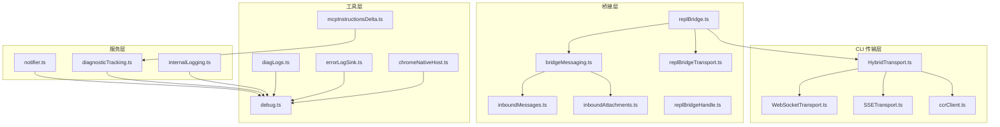
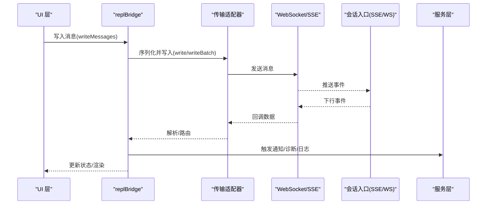
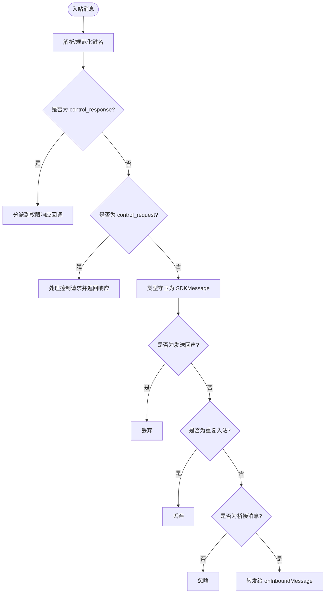
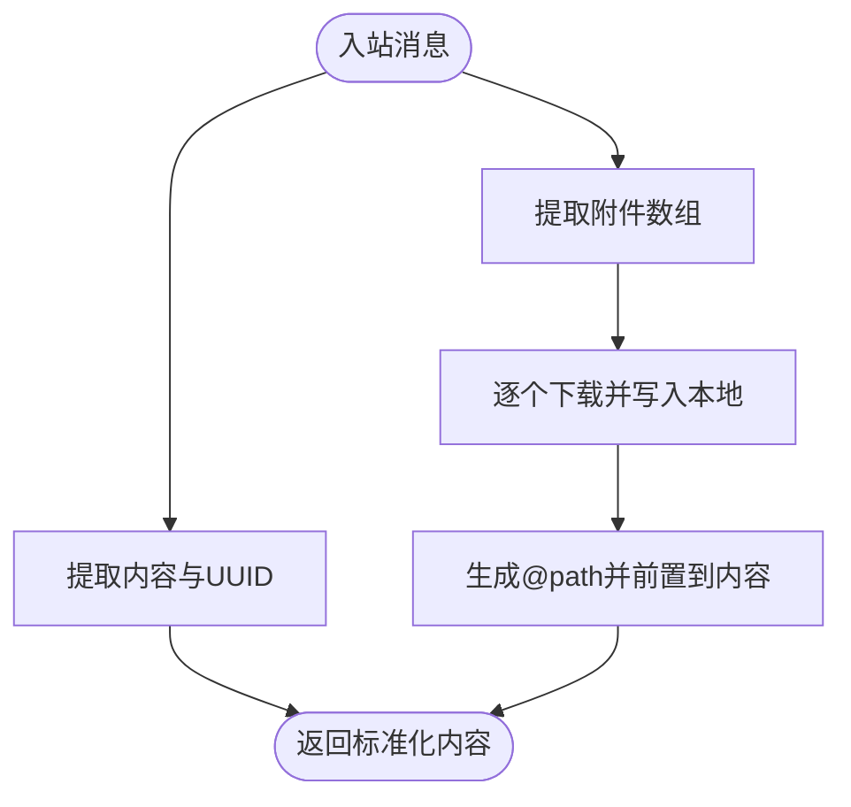
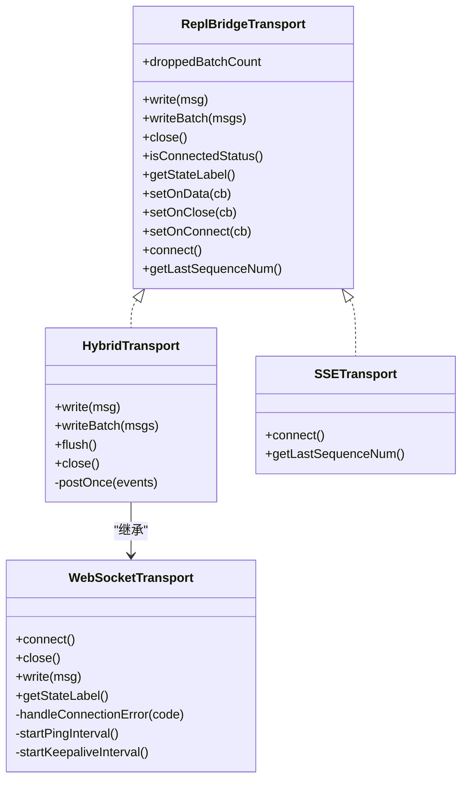
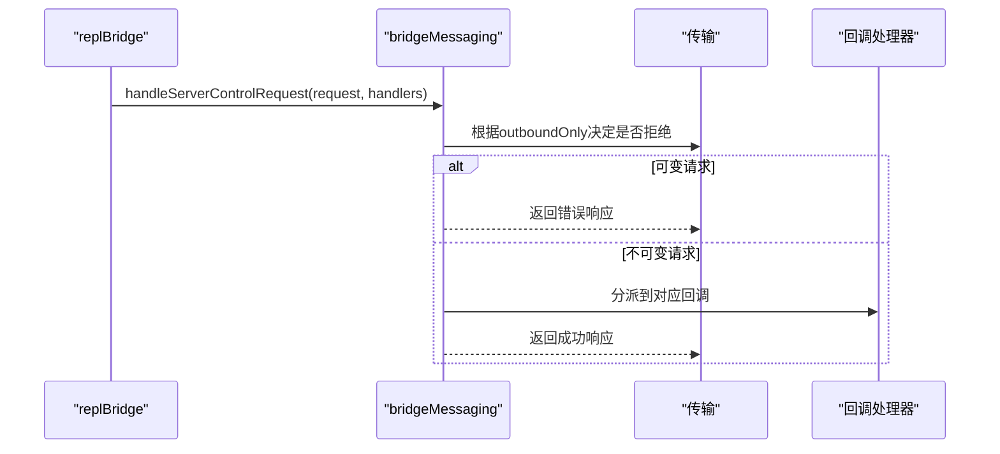
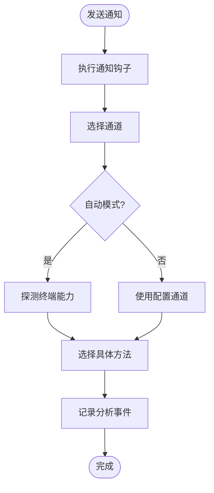
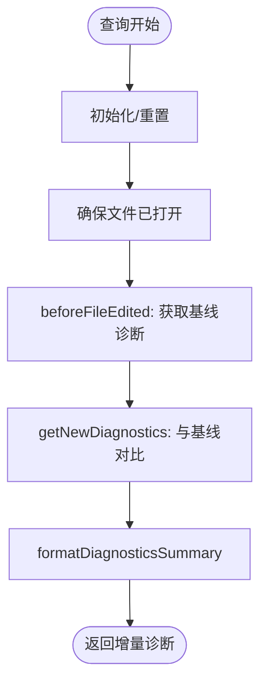
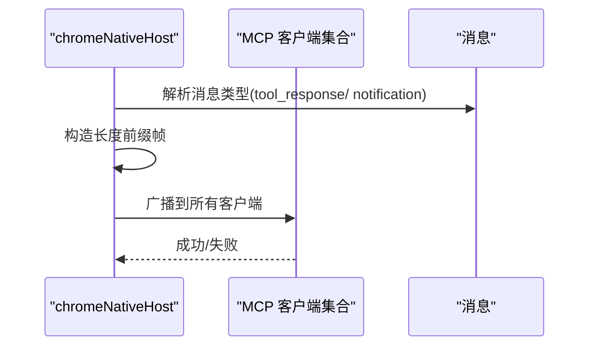
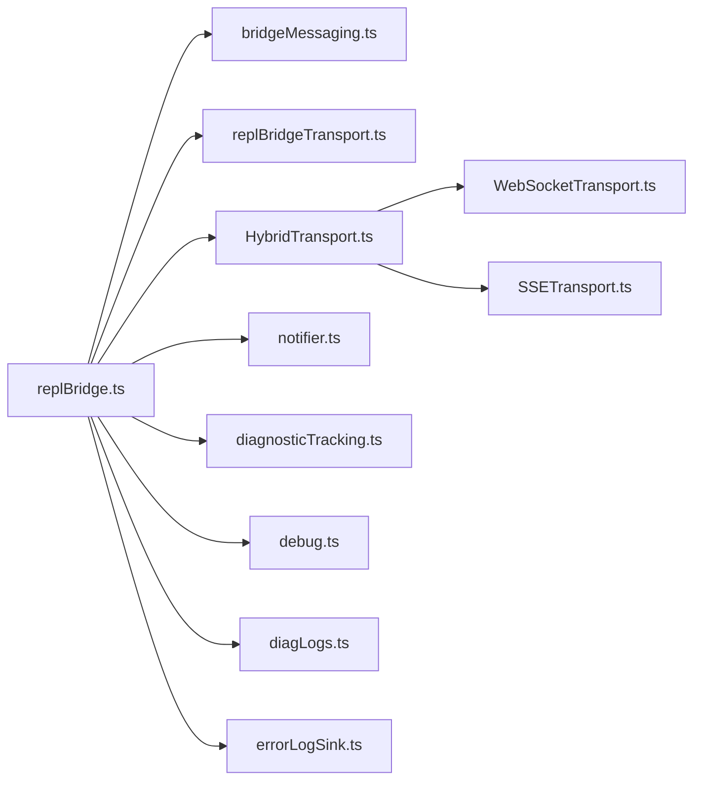

# 消息服务

<cite>
**本文引用的文件**
- [bridgeMessaging.ts](file://bridge/bridgeMessaging.ts)
- [inboundMessages.ts](file://bridge/inboundMessages.ts)
- [inboundAttachments.ts](file://bridge/inboundAttachments.ts)
- [replBridge.ts](file://bridge/replBridge.ts)
- [replBridgeHandle.ts](file://bridge/replBridgeHandle.ts)
- [replBridgeTransport.ts](file://bridge/replBridgeTransport.ts)
- [HybridTransport.ts](file://cli/transports/HybridTransport.ts)
- [WebSocketTransport.ts](file://cli/transports/WebSocketTransport.ts)
- [SSETransport.ts](file://cli/transports/SSETransport.ts)
- [ccrClient.ts](file://cli/transports/ccrClient.ts)
- [notifier.ts](file://services/notifier.ts)
- [diagnosticTracking.ts](file://services/diagnosticTracking.ts)
- [internalLogging.ts](file://services/internalLogging.ts)
- [diagLogs.ts](file://utils/diagLogs.ts)
- [debug.ts](file://utils/debug.ts)
- [errorLogSink.ts](file://utils/errorLogSink.ts)
- [chromeNativeHost.ts](file://utils/claudeInChrome/chromeNativeHost.ts)
- [mcpInstructionsDelta.ts](file://utils/mcpInstructionsDelta.ts)
</cite>

## 目录
1. [简介](#简介)
2. [项目结构](#项目结构)
3. [核心组件](#核心组件)
4. [架构总览](#架构总览)
5. [详细组件分析](#详细组件分析)
6. [依赖分析](#依赖分析)
7. [性能考量](#性能考量)
8. [故障排查指南](#故障排查指南)
9. [结论](#结论)
10. [附录](#附录)

## 简介
本文件面向 Claude Code 的消息服务系统，系统性阐述以下主题：
- LSP 服务器管理：通过 MCP（Model Context Protocol）连接与指令传播，实现语言服务与诊断跟踪。
- MCP 连接管理：包括连接生命周期、权限控制、指令差异计算与增量传播。
- 通知系统：跨终端与渠道的通知分发与回退策略。
- 消息路由机制：桥接层对入站消息的解析、去重、过滤与转发。
- 实时通信协议：WebSocket、SSE、HTTP POST 的混合传输模型与重连策略。
- 序列化与协议转换：NDJSON 行式消息、长度前缀帧、JSON 字符串化与解析。
- 配置与扩展：环境变量、运行时开关、回调注入点与可插拔传输层。
- 诊断跟踪、内部日志与错误报告：无 PII 的诊断日志、调试日志、错误归档与分析事件。
- 与 UI 层集成：消息渲染、通知显示、状态指示与交互反馈。

## 项目结构
消息服务横跨多个子系统：
- 桥接层（bridge）：负责与会话入口（Session Ingress）的双向通信，处理消息入站/出站、去重与控制请求响应。
- CLI 传输层（cli/transports）：抽象 WebSocket、SSE、HTTP POST 等传输，提供统一写入接口与重连/保活逻辑。
- 服务层（services）：通知、诊断跟踪、内部日志等业务服务。
- 工具层（utils）：调试、诊断日志、错误日志归档、MCP 指令差异计算等通用能力。

图示来源
- [replBridge.ts:1-2407](file://bridge/replBridge.ts#L1-L2407)
- [bridgeMessaging.ts:1-462](file://bridge/bridgeMessaging.ts#L1-L462)
- [HybridTransport.ts:1-283](file://cli/transports/HybridTransport.ts#L1-L283)
- [WebSocketTransport.ts:1-800](file://cli/transports/WebSocketTransport.ts#L1-L800)
- [SSETransport.ts:221-248](file://cli/transports/SSETransport.ts#L221-L248)
- [ccrClient.ts:387-436](file://cli/transports/ccrClient.ts#L387-L436)
- [notifier.ts:1-157](file://services/notifier.ts#L1-L157)
- [diagnosticTracking.ts:1-398](file://services/diagnosticTracking.ts#L1-L398)
- [internalLogging.ts:1-91](file://services/internalLogging.ts#L1-L91)
- [diagLogs.ts:1-95](file://utils/diagLogs.ts#L1-L95)
- [debug.ts:1-269](file://utils/debug.ts#L1-L269)
- [errorLogSink.ts:212-235](file://utils/errorLogSink.ts#L212-L235)
- [chromeNativeHost.ts:295-385](file://utils/claudeInChrome/chromeNativeHost.ts#L295-L385)
- [mcpInstructionsDelta.ts:46-75](file://utils/mcpInstructionsDelta.ts#L46-L75)

章节来源
- [replBridge.ts:1-2407](file://bridge/replBridge.ts#L1-L2407)
- [bridgeMessaging.ts:1-462](file://bridge/bridgeMessaging.ts#L1-L462)
- [HybridTransport.ts:1-283](file://cli/transports/HybridTransport.ts#L1-L283)
- [WebSocketTransport.ts:1-800](file://cli/transports/WebSocketTransport.ts#L1-L800)
- [SSETransport.ts:221-248](file://cli/transports/SSETransport.ts#L221-L248)
- [ccrClient.ts:387-436](file://cli/transports/ccrClient.ts#L387-L436)
- [notifier.ts:1-157](file://services/notifier.ts#L1-L157)
- [diagnosticTracking.ts:1-398](file://services/diagnosticTracking.ts#L1-L398)
- [internalLogging.ts:1-91](file://services/internalLogging.ts#L1-L91)
- [diagLogs.ts:1-95](file://utils/diagLogs.ts#L1-L95)
- [debug.ts:1-269](file://utils/debug.ts#L1-L269)
- [errorLogSink.ts:212-235](file://utils/errorLogSink.ts#L212-L235)
- [chromeNativeHost.ts:295-385](file://utils/claudeInChrome/chromeNativeHost.ts#L295-L385)
- [mcpInstructionsDelta.ts:46-75](file://utils/mcpInstructionsDelta.ts#L46-L75)

## 核心组件
- 桥接核心（replBridge）：注册环境、创建会话、轮询工作项、建立入站 WebSocket/SSE、处理控制请求、维护传输状态与重连。
- 桥接消息处理（bridgeMessaging）：解析入站消息、类型守卫、去重（回声与重复）、桥接消息筛选、构造控制响应。
- 入站消息与附件（inboundMessages、inboundAttachments）：标准化内容块、提取并解析附件、拼接 @path 引用。
- 传输适配器（replBridgeTransport）：统一 v1/v2 传输接口，屏蔽底层差异。
- 传输实现（HybridTransport、WebSocketTransport、SSETransport）：读写分离、批量上传、保活心跳、指数退避重连、序列号续传。
- 通知服务（notifier）：按首选通道分发通知，自动探测终端能力与回退策略。
- 诊断跟踪（diagnosticTracking）：基于 MCP 的 IDE 诊断采集、基线对比、增量输出与格式化摘要。
- 日志与诊断（debug、diagLogs、errorLogSink）：调试日志、诊断日志（无 PII）、错误日志归档与分析事件。
- MCP 指令差异（mcpInstructionsDelta）：基于已公告名称集合计算指令增量，避免重复广播。

章节来源
- [replBridge.ts:260-800](file://bridge/replBridge.ts#L260-L800)
- [bridgeMessaging.ts:124-208](file://bridge/bridgeMessaging.ts#L124-L208)
- [inboundMessages.ts:10-81](file://bridge/inboundMessages.ts#L10-L81)
- [inboundAttachments.ts:1-176](file://bridge/inboundAttachments.ts#L1-L176)
- [replBridgeTransport.ts:72-103](file://bridge/replBridgeTransport.ts#L72-L103)
- [HybridTransport.ts:1-283](file://cli/transports/HybridTransport.ts#L1-L283)
- [WebSocketTransport.ts:1-800](file://cli/transports/WebSocketTransport.ts#L1-L800)
- [SSETransport.ts:221-248](file://cli/transports/SSETransport.ts#L221-L248)
- [notifier.ts:1-157](file://services/notifier.ts#L1-L157)
- [diagnosticTracking.ts:1-398](file://services/diagnosticTracking.ts#L1-L398)
- [debug.ts:1-269](file://utils/debug.ts#L1-L269)
- [diagLogs.ts:1-95](file://utils/diagLogs.ts#L1-L95)
- [errorLogSink.ts:212-235](file://utils/errorLogSink.ts#L212-L235)
- [mcpInstructionsDelta.ts:46-75](file://utils/mcpInstructionsDelta.ts#L46-L75)

## 架构总览
消息服务采用“桥接层 + 传输层 + 服务层”的分层设计：
- 桥接层负责与后端会话入口的协议交互，承担消息路由、去重与控制流。
- 传输层抽象网络细节，提供统一的读写接口与可靠性保障。
- 服务层提供通知、诊断与日志等横切能力，贯穿桥接与传输。

图示来源
- [replBridge.ts:538-600](file://bridge/replBridge.ts#L538-L600)
- [HybridTransport.ts:117-138](file://cli/transports/HybridTransport.ts#L117-L138)
- [WebSocketTransport.ts:135-193](file://cli/transports/WebSocketTransport.ts#L135-L193)
- [SSETransport.ts:231-248](file://cli/transports/SSETransport.ts#L231-L248)
- [notifier.ts:18-36](file://services/notifier.ts#L18-L36)
- [diagnosticTracking.ts:330-343](file://services/diagnosticTracking.ts#L330-L343)

## 详细组件分析

### 桥接消息处理（bridgeMessaging）
职责与流程：
- 类型守卫：区分 SDKMessage、control_request、control_response。
- 入站路由：解析字符串消息，校验并丢弃回声与重复消息；仅转发用户/助手/本地命令类消息。
- 控制请求处理：对服务器发起的控制请求进行快速响应，支持初始化、设置模型、最大思考令牌、权限模式与中断。
- 去重机制：使用有界环形 UUID 集合，分别用于发送回声过滤与入站重复过滤。
- 结果消息：在会话归档前生成最小化的成功结果事件。

图示来源
- [bridgeMessaging.ts:124-208](file://bridge/bridgeMessaging.ts#L124-L208)
- [bridgeMessaging.ts:210-391](file://bridge/bridgeMessaging.ts#L210-L391)
- [bridgeMessaging.ts:418-462](file://bridge/bridgeMessaging.ts#L418-L462)

章节来源
- [bridgeMessaging.ts:1-462](file://bridge/bridgeMessaging.ts#L1-L462)

### 入站消息与附件（inboundMessages、inboundAttachments）
职责与流程：
- 入站消息字段提取：从 SDKMessage 中抽取内容与 UUID，兼容图片块字段命名差异。
- 附件解析：从入站消息中提取 file_attachments，下载到本地缓存目录，生成 @path 引用并前置到内容。
- 路径拼接：确保文本块顺序正确，必要时追加文本块以保证引用生效。

图示来源
- [inboundMessages.ts:21-40](file://bridge/inboundMessages.ts#L21-L40)
- [inboundMessages.ts:52-81](file://bridge/inboundMessages.ts#L52-L81)
- [inboundAttachments.ts:123-176](file://bridge/inboundAttachments.ts#L123-L176)

章节来源
- [inboundMessages.ts:1-81](file://bridge/inboundMessages.ts#L1-L81)
- [inboundAttachments.ts:1-176](file://bridge/inboundAttachments.ts#L1-L176)

### 传输适配器与协议（replBridgeTransport、HybridTransport、WebSocketTransport、SSETransport）
职责与流程：
- v1 适配器：将 HybridTransport 包装为统一接口，屏蔽 v1/v2 差异。
- HybridTransport：WebSocket 读 + HTTP POST 写，延迟聚合、批量上传、序列化与指数退避重试。
- WebSocketTransport：通用 WebSocket 实现，支持保活心跳、ping/pong、系统休眠检测、永久关闭码处理与自动重连。
- SSETransport：基于 Server-Sent Events 的读取，支持从序列号续传，记录最高水位序列号以便恢复。

图示来源
- [replBridgeTransport.ts:72-103](file://bridge/replBridgeTransport.ts#L72-L103)
- [HybridTransport.ts:54-262](file://cli/transports/HybridTransport.ts#L54-L262)
- [WebSocketTransport.ts:74-800](file://cli/transports/WebSocketTransport.ts#L74-L800)
- [SSETransport.ts:221-248](file://cli/transports/SSETransport.ts#L221-L248)

章节来源
- [replBridgeTransport.ts:1-103](file://bridge/replBridgeTransport.ts#L1-L103)
- [HybridTransport.ts:1-283](file://cli/transports/HybridTransport.ts#L1-L283)
- [WebSocketTransport.ts:1-800](file://cli/transports/WebSocketTransport.ts#L1-L800)
- [SSETransport.ts:221-248](file://cli/transports/SSETransport.ts#L221-L248)

### 控制请求处理（replBridge + bridgeMessaging）
职责与流程：
- 支持 outbound-only 模式下的拒绝策略，避免向本地产生“假成功”。
- 处理 initialize、set_model、set_max_thinking_tokens、set_permission_mode、interrupt 等子类型。
- 对未知子类型返回错误响应，防止服务器挂起。

图示来源
- [bridgeMessaging.ts:243-391](file://bridge/bridgeMessaging.ts#L243-L391)
- [replBridge.ts:587-615](file://bridge/replBridge.ts#L587-L615)

章节来源
- [bridgeMessaging.ts:210-391](file://bridge/bridgeMessaging.ts#L210-L391)
- [replBridge.ts:587-615](file://bridge/replBridge.ts#L587-L615)

### 通知系统（notifier）
职责与流程：
- 依据全局配置选择通知通道（自动探测、iTerm2、Kitty、Ghostty、铃声等）。
- 执行通知钩子，记录分析事件，统计实际使用的通道。

图示来源
- [notifier.ts:18-104](file://services/notifier.ts#L18-L104)

章节来源
- [notifier.ts:1-157](file://services/notifier.ts#L1-L157)

### 诊断跟踪（diagnosticTracking）
职责与流程：
- 初始化时绑定 MCP 客户端，确保文件在 IDE 中打开以启用语言服务。
- 编辑前捕获基线诊断，编辑后获取新诊断并与基线对比，输出增量。
- 支持 file://、_claude_fs_right 等 URI 协议，路径归一化处理大小写与分隔符。
- 提供格式化摘要与严重程度符号映射。

图示来源
- [diagnosticTracking.ts:135-182](file://services/diagnosticTracking.ts#L135-L182)
- [diagnosticTracking.ts:188-283](file://services/diagnosticTracking.ts#L188-L283)
- [diagnosticTracking.ts:352-394](file://services/diagnosticTracking.ts#L352-L394)

章节来源
- [diagnosticTracking.ts:1-398](file://services/diagnosticTracking.ts#L1-L398)

### MCP 连接与指令传播（chromeNativeHost、mcpInstructionsDelta）
职责与流程：
- chromeNativeHost：将工具响应与通知以长度前缀帧形式转发至 MCP 客户端，支持多客户端广播与长度校验。
- mcpInstructionsDelta：扫描对话中的 mcp_instructions_delta 附件，维护已公告服务器名称集合，计算新增/移除集合，避免重复广播。

图示来源
- [chromeNativeHost.ts:295-352](file://utils/claudeInChrome/chromeNativeHost.ts#L295-L352)
- [chromeNativeHost.ts:487-527](file://utils/claudeInChrome/chromeNativeHost.ts#L487-L527)

章节来源
- [chromeNativeHost.ts:295-385](file://utils/claudeInChrome/chromeNativeHost.ts#L295-L385)
- [mcpInstructionsDelta.ts:46-75](file://utils/mcpInstructionsDelta.ts#L46-L75)

## 依赖分析
- 组件耦合：
  - replBridge 依赖 bridgeMessaging、replBridgeTransport、HybridTransport、WebSocketTransport、SSETransport。
  - bridgeMessaging 依赖 SDK 类型、控制消息兼容、调试与错误工具。
  - 传输层之间存在继承/组合关系，统一由适配器对外暴露。
- 外部依赖：
  - WebSocketTransport 依赖 ws 或 Bun 原生 WebSocket。
  - HybridTransport 依赖 axios 进行 HTTP POST。
  - SSETransport 依赖浏览器/Node 的事件源与序列号续传。
- 循环依赖风险：
  - 通过模块导入顺序与接口抽象避免循环依赖；桥接句柄通过全局指针维持单实例。

图示来源
- [replBridge.ts:1-2407](file://bridge/replBridge.ts#L1-L2407)
- [bridgeMessaging.ts:1-462](file://bridge/bridgeMessaging.ts#L1-L462)
- [replBridgeTransport.ts:1-103](file://bridge/replBridgeTransport.ts#L1-L103)
- [HybridTransport.ts:1-283](file://cli/transports/HybridTransport.ts#L1-L283)
- [WebSocketTransport.ts:1-800](file://cli/transports/WebSocketTransport.ts#L1-L800)
- [SSETransport.ts:221-248](file://cli/transports/SSETransport.ts#L221-L248)
- [notifier.ts:1-157](file://services/notifier.ts#L1-L157)
- [diagnosticTracking.ts:1-398](file://services/diagnosticTracking.ts#L1-L398)
- [debug.ts:1-269](file://utils/debug.ts#L1-L269)
- [diagLogs.ts:1-95](file://utils/diagLogs.ts#L1-L95)
- [errorLogSink.ts:212-235](file://utils/errorLogSink.ts#L212-L235)

章节来源
- [replBridge.ts:1-2407](file://bridge/replBridge.ts#L1-L2407)
- [bridgeMessaging.ts:1-462](file://bridge/bridgeMessaging.ts#L1-L462)
- [replBridgeTransport.ts:1-103](file://bridge/replBridgeTransport.ts#L1-L103)
- [HybridTransport.ts:1-283](file://cli/transports/HybridTransport.ts#L1-L283)
- [WebSocketTransport.ts:1-800](file://cli/transports/WebSocketTransport.ts#L1-L800)
- [SSETransport.ts:221-248](file://cli/transports/SSETransport.ts#L221-L248)
- [notifier.ts:1-157](file://services/notifier.ts#L1-L157)
- [diagnosticTracking.ts:1-398](file://services/diagnosticTracking.ts#L1-L398)
- [debug.ts:1-269](file://utils/debug.ts#L1-L269)
- [diagLogs.ts:1-95](file://utils/diagLogs.ts#L1-L95)
- [errorLogSink.ts:212-235](file://utils/errorLogSink.ts#L212-L235)

## 性能考量
- 写入优化：
  - HybridTransport 对 stream_event 延迟聚合（约 100ms），减少 HTTP POST 数量。
  - 序列化上传器支持批量、指数退避与队列背压，避免并发写导致的冲突风暴。
- 读取优化：
  - WebSocketTransport 保活心跳与 ping/pong 检测进程挂起，降低 NAT 映射失效影响。
  - SSETransport 使用 from_sequence_num 与 Last-Event-ID 实现断点续传，避免全量重放。
- 去重与幂等：
  - BoundedUUIDSet 作为有界环形缓冲区，常数空间内过滤回声与重复消息。
- 资源回收：
  - 关闭时的优雅宽限期与上传器 flush，尽量保证最后一批事件被提交。

[本节为通用指导，不直接分析具体文件]

## 故障排查指南
- 诊断日志（无 PII）：
  - 使用诊断日志函数记录事件与耗时，便于定位问题而避免泄露敏感信息。
- 调试日志：
  - 支持运行时开启、文件输出、标准错误输出与过滤器，便于细粒度排查。
- 错误日志归档：
  - 初始化错误日志接收器，统一记录错误与 MCP 调试信息，便于后续分析。
- 传输层告警：
  - WebSocketTransport 记录连接失败、永久关闭码、重连预算耗尽等事件。
  - HybridTransport 记录 POST 失败、队列丢弃批次等指标。
- 通知失败：
  - 自动回退策略与分析事件记录，帮助定位终端能力与配置问题。

章节来源
- [diagLogs.ts:27-57](file://utils/diagLogs.ts#L27-L57)
- [debug.ts:203-228](file://utils/debug.ts#L203-L228)
- [errorLogSink.ts:225-235](file://utils/errorLogSink.ts#L225-L235)
- [WebSocketTransport.ts:397-554](file://cli/transports/WebSocketTransport.ts#L397-L554)
- [HybridTransport.ts:202-261](file://cli/transports/HybridTransport.ts#L202-L261)
- [notifier.ts:40-104](file://services/notifier.ts#L40-L104)

## 结论
消息服务通过桥接层与传输层的清晰分层，结合严格的去重、序列化与协议转换机制，实现了稳定可靠的实时通信。配合通知、诊断与日志体系，系统具备良好的可观测性与可维护性。MCP 连接与指令差异计算进一步增强了与 IDE/LSP 的协同能力。建议在生产环境中：
- 合理配置传输参数（批大小、重试、保活）。
- 使用诊断日志与调试日志进行问题定位。
- 通过通知服务与诊断跟踪完善用户体验与质量保障。

[本节为总结，不直接分析具体文件]

## 附录

### 配置与扩展要点
- 环境变量与运行时开关：
  - 调试日志级别、输出目标、过滤器、诊断日志文件路径等。
  - 传输层自动重连、代理与 mTLS 设置。
- 扩展点：
  - 传输层：自定义 Transport 实现或复用现有适配器。
  - 控制请求：通过回调注入新的处理分支。
  - 通知：扩展通道实现或钩子逻辑。
  - 日志：统一接入诊断日志与错误日志归档。

章节来源
- [debug.ts:34-102](file://utils/debug.ts#L34-L102)
- [diagLogs.ts:59-62](file://utils/diagLogs.ts#L59-L62)
- [WebSocketTransport.ts:119-133](file://cli/transports/WebSocketTransport.ts#L119-L133)
- [HybridTransport.ts:63-108](file://cli/transports/HybridTransport.ts#L63-L108)
- [notifier.ts:18-36](file://services/notifier.ts#L18-L36)