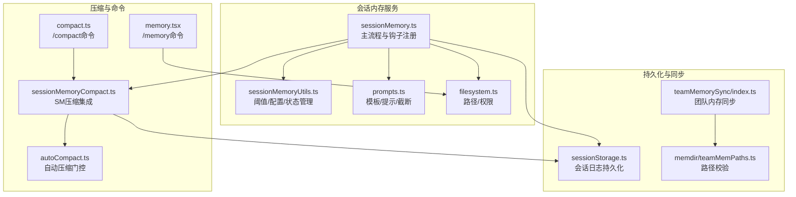
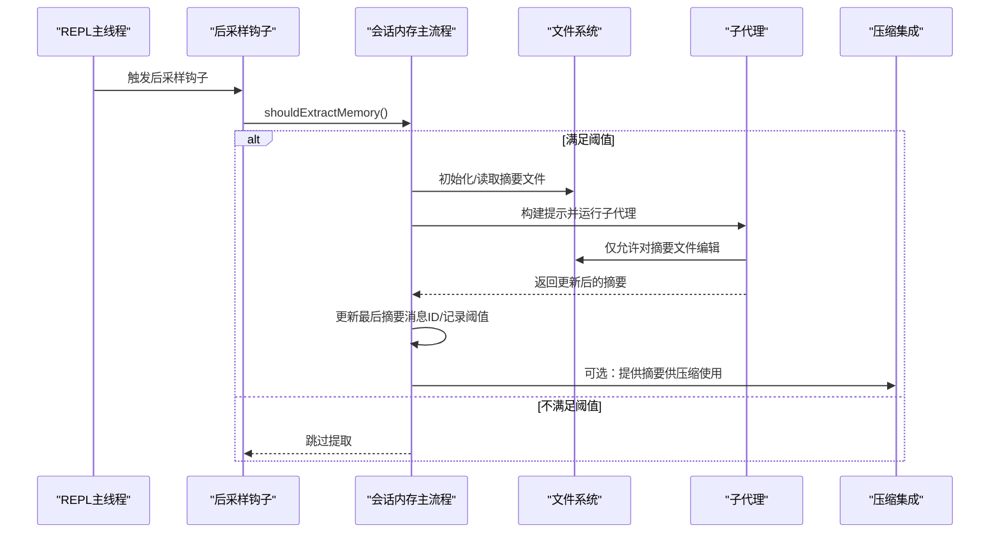
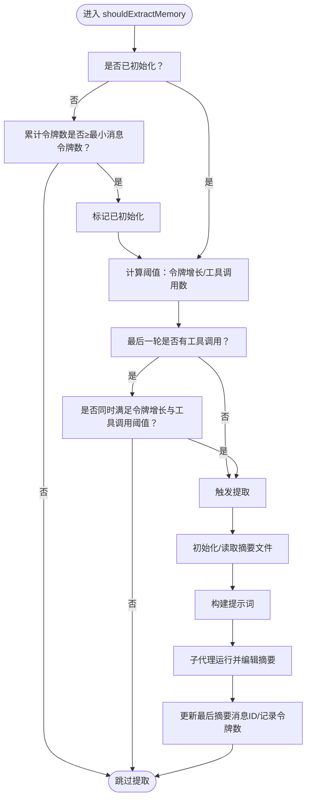
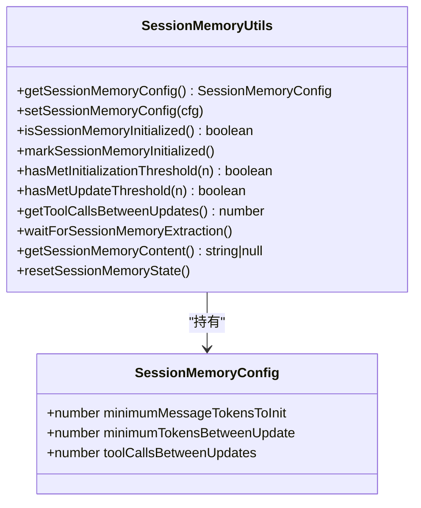
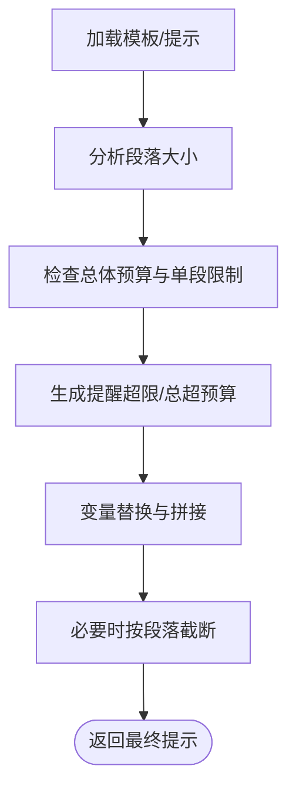
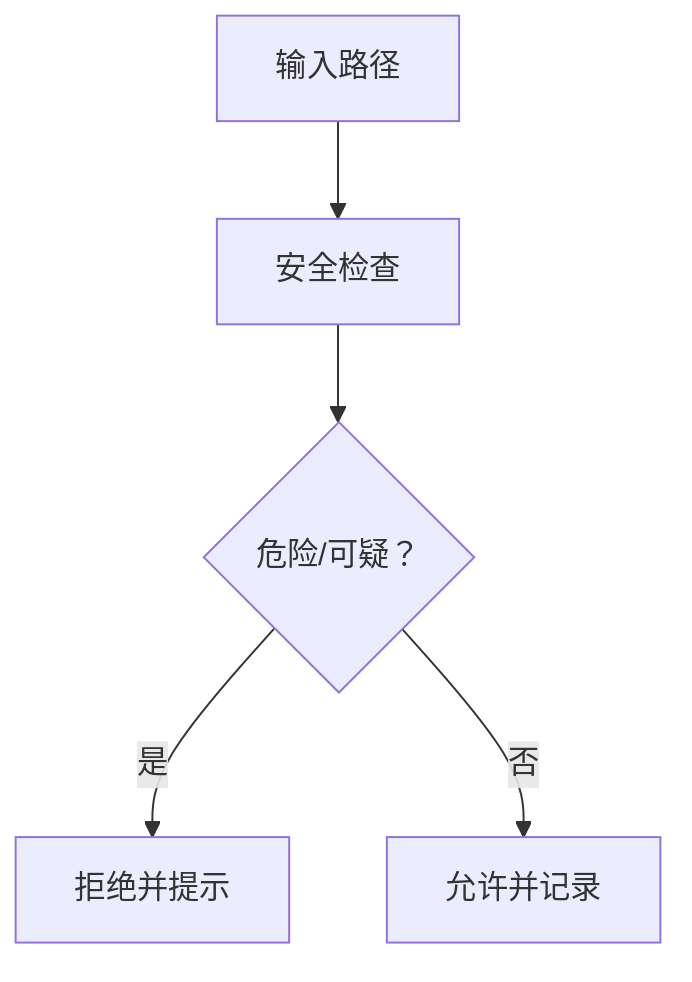
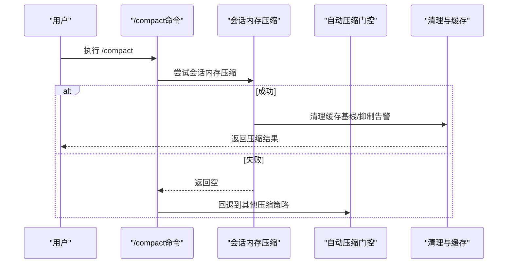
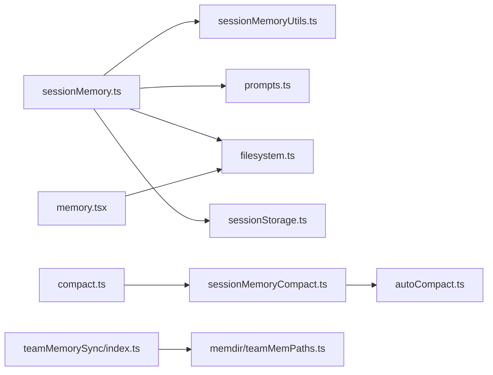

# 会话内存服务

<cite>
**本文档引用的文件**
- [services/SessionMemory/sessionMemory.ts](file://services/SessionMemory/sessionMemory.ts)
- [services/SessionMemory/sessionMemoryUtils.ts](file://services/SessionMemory/sessionMemoryUtils.ts)
- [services/SessionMemory/prompts.ts](file://services/SessionMemory/prompts.ts)
- [utils/permissions/filesystem.ts](file://utils/permissions/filesystem.ts)
- [services/compact/sessionMemoryCompact.ts](file://services/compact/sessionMemoryCompact.ts)
- [services/compact/autoCompact.ts](file://services/compact/autoCompact.ts)
- [commands/compact/compact.ts](file://commands/compact/compact.ts)
- [commands/memory/memory.tsx](file://commands/memory/memory.tsx)
- [utils/sessionStorage.ts](file://utils/sessionStorage.ts)
- [services/teamMemorySync/index.ts](file://services/teamMemorySync/index.ts)
- [memdir/teamMemPaths.ts](file://memdir/teamMemPaths.ts)
- [utils/hooks/sessionHooks.ts](file://utils/hooks/sessionHooks.ts)
</cite>

## 目录
1. [简介](#简介)
2. [项目结构](#项目结构)
3. [核心组件](#核心组件)
4. [架构总览](#架构总览)
5. [详细组件分析](#详细组件分析)
6. [依赖关系分析](#依赖关系分析)
7. [性能考量](#性能考量)
8. [故障排除指南](#故障排除指南)
9. [结论](#结论)
10. [附录](#附录)

## 简介
本文件系统性阐述 Claude Code 的“会话内存服务”，包括其存储机制、数据结构、访问模式、序列化与反序列化流程、内存缓存策略、持久化选项、配置参数、性能调优与容量管理、会话恢复与备份策略、数据完整性保障、监控指标与调试工具，以及实际使用示例。该服务通过后台子代理周期性提取对话要点，生成并维护一个结构化的 Markdown 摘要文件，用于在自动压缩（compact）阶段作为高质量上下文注入，提升后续交互的效率与一致性。

## 项目结构
会话内存服务主要由以下模块组成：
- 会话内存主逻辑：负责阈值判断、文件初始化、提示词构建、子代理执行与更新记录
- 工具函数与配置：提供阈值检查、配置读取、等待提取完成、内容读取等能力
- 提示词模板与截断：加载自定义模板/提示，分析段落长度，必要时进行截断
- 文件权限与路径：定义会话内存目录与文件路径，确保安全访问
- 压缩集成：与自动压缩协作，优先使用会话内存摘要参与压缩
- 命令行入口：提供手动触发摘要生成与编辑内存文件的能力

**图表来源**
- [services/SessionMemory/sessionMemory.ts:1-496](file://services/SessionMemory/sessionMemory.ts#L1-L496)
- [services/SessionMemory/sessionMemoryUtils.ts:1-208](file://services/SessionMemory/sessionMemoryUtils.ts#L1-L208)
- [services/SessionMemory/prompts.ts:1-325](file://services/SessionMemory/prompts.ts#L1-L325)
- [utils/permissions/filesystem.ts:257-278](file://utils/permissions/filesystem.ts#L257-L278)
- [services/compact/sessionMemoryCompact.ts:44-630](file://services/compact/sessionMemoryCompact.ts#L44-L630)
- [services/compact/autoCompact.ts:160-199](file://services/compact/autoCompact.ts#L160-L199)
- [commands/compact/compact.ts:48-83](file://commands/compact/compact.ts#L48-L83)
- [commands/memory/memory.tsx:1-90](file://commands/memory/memory.tsx#L1-L90)
- [utils/sessionStorage.ts:1113-1126](file://utils/sessionStorage.ts#L1113-L1126)
- [services/teamMemorySync/index.ts:714-757](file://services/teamMemorySync/index.ts#L714-L757)
- [memdir/teamMemPaths.ts:173-206](file://memdir/teamMemPaths.ts#L173-L206)

**章节来源**
- [services/SessionMemory/sessionMemory.ts:1-496](file://services/SessionMemory/sessionMemory.ts#L1-L496)
- [services/SessionMemory/sessionMemoryUtils.ts:1-208](file://services/SessionMemory/sessionMemoryUtils.ts#L1-L208)
- [services/SessionMemory/prompts.ts:1-325](file://services/SessionMemory/prompts.ts#L1-L325)
- [utils/permissions/filesystem.ts:257-278](file://utils/permissions/filesystem.ts#L257-L278)

## 核心组件
- 会话内存主流程（sessionMemory.ts）
  - 注册后采样钩子，在主线程中按阈值触发摘要提取
  - 使用子代理隔离上下文，仅允许对摘要文件的编辑操作
  - 记录提取事件与阈值信息，更新最后摘要消息 ID
- 工具与配置（sessionMemoryUtils.ts）
  - 配置项：最小消息令牌数、两次更新间最小令牌增长、两次更新间的工具调用次数
  - 状态：是否已初始化、上次摘要消息 ID、提取开始时间、上次提取时的令牌数
  - 辅助：等待提取完成、读取当前内容、重置状态
- 提示词与模板（prompts.ts）
  - 默认与可定制模板/提示，变量替换，段落长度分析与提醒
  - 截断策略：按段落边界截断，避免破坏结构
- 路径与权限（filesystem.ts）
  - 定义会话内存目录与文件路径，提供安全检查与路径规范化
- 压缩集成（sessionMemoryCompact.ts, autoCompact.ts, compact.ts）
  - 在自动压缩前尝试使用会话内存摘要，控制阈值与保留策略
  - 与自动压缩门控协同，避免递归死锁与竞态
- 命令行入口（memory.tsx, compact.ts）
  - /memory 打开或编辑会话内存文件
  - /compact 优先尝试会话内存压缩，失败则回退到其他压缩策略

**章节来源**
- [services/SessionMemory/sessionMemory.ts:134-181](file://services/SessionMemory/sessionMemory.ts#L134-L181)
- [services/SessionMemory/sessionMemoryUtils.ts:18-36](file://services/SessionMemory/sessionMemoryUtils.ts#L18-L36)
- [services/SessionMemory/prompts.ts:11-129](file://services/SessionMemory/prompts.ts#L11-L129)
- [utils/permissions/filesystem.ts:257-278](file://utils/permissions/filesystem.ts#L257-L278)
- [services/compact/sessionMemoryCompact.ts:44-88](file://services/compact/sessionMemoryCompact.ts#L44-L88)
- [services/compact/autoCompact.ts:160-199](file://services/compact/autoCompact.ts#L160-L199)
- [commands/compact/compact.ts:48-83](file://commands/compact/compact.ts#L48-L83)
- [commands/memory/memory.tsx:14-63](file://commands/memory/memory.tsx#L14-L63)

## 架构总览
会话内存服务采用“钩子驱动 + 子代理隔离 + 权限约束”的架构：
- 钩子在每次采样后检查阈值，满足条件即启动提取
- 子代理运行在独立上下文中，仅允许对摘要文件进行编辑
- 文件系统层提供路径解析、权限校验与安全写入
- 压缩阶段优先使用会话内存摘要，提升上下文质量与稳定性

**图表来源**
- [services/SessionMemory/sessionMemory.ts:134-181](file://services/SessionMemory/sessionMemory.ts#L134-L181)
- [services/SessionMemory/sessionMemory.ts:272-350](file://services/SessionMemory/sessionMemory.ts#L272-L350)
- [utils/permissions/filesystem.ts:257-278](file://utils/permissions/filesystem.ts#L257-L278)

## 详细组件分析

### 组件A：会话内存主流程（sessionMemory.ts）
- 阈值判定
  - 初始阈值：累计上下文令牌数达到最小消息令牌数
  - 更新阈值：自上次提取以来的上下文增长达到最小令牌增长
  - 工具调用阈值：两次更新之间的工具调用次数达到设定值
  - 最后一轮无工具调用时可安全提取
- 文件初始化与读取
  - 创建会话内存目录与摘要文件（独占写入），首次写入默认模板
  - 通过文件读取工具读取当前内容，避免缓存导致的陈旧数据
- 子代理执行
  - 使用 runForkedAgent 在隔离上下文中运行，传入只允许编辑摘要文件的工具许可
  - 提示词由 prompts.ts 构建，支持模板与变量替换
- 状态更新
  - 成功提取后记录令牌计数，更新最后摘要消息 ID（需最后一轮无工具调用）

**图表来源**
- [services/SessionMemory/sessionMemory.ts:134-181](file://services/SessionMemory/sessionMemory.ts#L134-L181)
- [services/SessionMemory/sessionMemory.ts:183-233](file://services/SessionMemory/sessionMemory.ts#L183-L233)
- [services/SessionMemory/sessionMemory.ts:309-350](file://services/SessionMemory/sessionMemory.ts#L309-L350)

**章节来源**
- [services/SessionMemory/sessionMemory.ts:134-181](file://services/SessionMemory/sessionMemory.ts#L134-L181)
- [services/SessionMemory/sessionMemory.ts:183-233](file://services/SessionMemory/sessionMemory.ts#L183-L233)
- [services/SessionMemory/sessionMemory.ts:272-350](file://services/SessionMemory/sessionMemory.ts#L272-L350)

### 组件B：工具与配置（sessionMemoryUtils.ts）
- 配置类型与默认值
  - minimumMessageTokensToInit：最小消息令牌数
  - minimumTokensBetweenUpdate：两次更新间的最小令牌增长
  - toolCallsBetweenUpdates：两次更新间的工具调用次数
- 状态与辅助函数
  - isSessionMemoryInitialized / markSessionMemoryInitialized
  - hasMetInitializationThreshold / hasMetUpdateThreshold
  - getToolCallsBetweenUpdates
  - waitForSessionMemoryExtraction（等待提取完成，带超时与陈旧检测）
  - getSessionMemoryContent（读取当前内容，异常处理）
  - resetSessionMemoryState（测试用重置）

**图表来源**
- [services/SessionMemory/sessionMemoryUtils.ts:18-36](file://services/SessionMemory/sessionMemoryUtils.ts#L18-L36)
- [services/SessionMemory/sessionMemoryUtils.ts:143-145](file://services/SessionMemory/sessionMemoryUtils.ts#L143-L145)
- [services/SessionMemory/sessionMemoryUtils.ts:89-105](file://services/SessionMemory/sessionMemoryUtils.ts#L89-L105)
- [services/SessionMemory/sessionMemoryUtils.ts:110-126](file://services/SessionMemory/sessionMemoryUtils.ts#L110-L126)

**章节来源**
- [services/SessionMemory/sessionMemoryUtils.ts:18-36](file://services/SessionMemory/sessionMemoryUtils.ts#L18-L36)
- [services/SessionMemory/sessionMemoryUtils.ts:89-126](file://services/SessionMemory/sessionMemoryUtils.ts#L89-L126)
- [services/SessionMemory/sessionMemoryUtils.ts:143-196](file://services/SessionMemory/sessionMemoryUtils.ts#L143-L196)

### 组件C：提示词与模板（prompts.ts）
- 模板与提示
  - 默认模板：标题、当前状态、任务说明、文件与函数、工作流、错误与修正、代码库与系统文档、学习点、关键结果、工作日志
  - 自定义模板/提示：支持从用户配置目录加载，变量替换（{{currentNotes}}, {{notesPath}})
- 截断策略
  - 分析各段落长度，超过限制时按段落边界截断，并添加截断提示
  - 总体预算警告：当总令牌数超过上限时给出强制压缩提示

**图表来源**
- [services/SessionMemory/prompts.ts:83-129](file://services/SessionMemory/prompts.ts#L83-L129)
- [services/SessionMemory/prompts.ts:131-196](file://services/SessionMemory/prompts.ts#L131-L196)
- [services/SessionMemory/prompts.ts:226-247](file://services/SessionMemory/prompts.ts#L226-L247)
- [services/SessionMemory/prompts.ts:256-296](file://services/SessionMemory/prompts.ts#L256-L296)

**章节来源**
- [services/SessionMemory/prompts.ts:11-129](file://services/SessionMemory/prompts.ts#L11-L129)
- [services/SessionMemory/prompts.ts:131-196](file://services/SessionMemory/prompts.ts#L131-L196)
- [services/SessionMemory/prompts.ts:226-296](file://services/SessionMemory/prompts.ts#L226-L296)

### 组件D：路径与权限（filesystem.ts）
- 路径
  - getSessionMemoryDir：{projectDir}/{sessionId}/session-memory/
  - getSessionMemoryPath：summary.md
  - isSessionMemoryPath：安全检查，防止越权访问
- 权限与安全
  - 多层安全检查：危险文件/目录、UNC路径、Windows可疑模式、符号链接解析
  - 授权建议：针对会话内存目录提供最小授权范围

**图表来源**
- [utils/permissions/filesystem.ts:257-278](file://utils/permissions/filesystem.ts#L257-L278)
- [utils/permissions/filesystem.ts:426-488](file://utils/permissions/filesystem.ts#L426-L488)
- [utils/permissions/filesystem.ts:620-665](file://utils/permissions/filesystem.ts#L620-L665)

**章节来源**
- [utils/permissions/filesystem.ts:257-278](file://utils/permissions/filesystem.ts#L257-L278)
- [utils/permissions/filesystem.ts:426-488](file://utils/permissions/filesystem.ts#L426-L488)
- [utils/permissions/filesystem.ts:620-665](file://utils/permissions/filesystem.ts#L620-L665)

### 组件E：压缩集成（sessionMemoryCompact.ts, autoCompact.ts, compact.ts）
- 会话内存压缩配置
  - minTokens：压缩后最小保留令牌数
  - minTextBlockMessages：至少保留含文本块的消息数量
  - maxTokens：硬上限
- 与自动压缩协作
  - 自动压缩门控避免递归与竞态
  - /compact 命令优先尝试会话内存压缩，失败回退
- 事件与清理
  - 记录阈值超限、错误等事件
  - 成功后清理缓存基线与告警抑制

**图表来源**
- [services/compact/sessionMemoryCompact.ts:44-88](file://services/compact/sessionMemoryCompact.ts#L44-L88)
- [services/compact/sessionMemoryCompact.ts:583-630](file://services/compact/sessionMemoryCompact.ts#L583-L630)
- [services/compact/autoCompact.ts:160-199](file://services/compact/autoCompact.ts#L160-L199)
- [commands/compact/compact.ts:48-83](file://commands/compact/compact.ts#L48-L83)

**章节来源**
- [services/compact/sessionMemoryCompact.ts:44-88](file://services/compact/sessionMemoryCompact.ts#L44-L88)
- [services/compact/sessionMemoryCompact.ts:583-630](file://services/compact/sessionMemoryCompact.ts#L583-L630)
- [services/compact/autoCompact.ts:160-199](file://services/compact/autoCompact.ts#L160-L199)
- [commands/compact/compact.ts:48-83](file://commands/compact/compact.ts#L48-L83)

### 组件F：命令行入口（memory.tsx, compact.ts）
- /memory 命令
  - 选择或创建会话内存文件，打开编辑器
  - 支持自定义编辑器（$EDITOR/$VISUAL）
- /compact 命令
  - 优先尝试会话内存压缩；若无自定义指令且成功，则清理缓存并抑制告警

**章节来源**
- [commands/memory/memory.tsx:14-63](file://commands/memory/memory.tsx#L14-L63)
- [commands/compact/compact.ts:48-83](file://commands/compact/compact.ts#L48-L83)

## 依赖关系分析
- 内聚与耦合
  - sessionMemory.ts 与 sessionMemoryUtils.ts 强内聚，前者依赖后者提供的阈值与状态管理
  - prompts.ts 与 sessionMemory.ts 解耦，通过构建提示词接口交互
  - filesystem.ts 为多模块提供路径与权限基础，被 sessionMemory.ts、teamMemorySync 等广泛使用
- 外部依赖
  - 子代理运行环境（runForkedAgent）、文件读取工具（FileReadTool）、写入工具（FileEditTool）
  - 自动压缩门控与压缩配置（autoCompact.ts, sessionMemoryCompact.ts）
- 循环依赖
  - 通过工具函数拆分避免循环导入（如 sessionMemoryUtils.ts 独立于主流程）

**图表来源**
- [services/SessionMemory/sessionMemory.ts:1-62](file://services/SessionMemory/sessionMemory.ts#L1-L62)
- [services/SessionMemory/sessionMemoryUtils.ts:1-11](file://services/SessionMemory/sessionMemoryUtils.ts#L1-L11)
- [services/SessionMemory/prompts.ts:1-6](file://services/SessionMemory/prompts.ts#L1-L6)
- [utils/permissions/filesystem.ts:1-50](file://utils/permissions/filesystem.ts#L1-L50)
- [utils/sessionStorage.ts:1113-1126](file://utils/sessionStorage.ts#L1113-L1126)
- [services/compact/sessionMemoryCompact.ts:44-88](file://services/compact/sessionMemoryCompact.ts#L44-L88)
- [services/compact/autoCompact.ts:160-199](file://services/compact/autoCompact.ts#L160-L199)
- [commands/compact/compact.ts:48-83](file://commands/compact/compact.ts#L48-L83)
- [commands/memory/memory.tsx:1-90](file://commands/memory/memory.tsx#L1-L90)
- [services/teamMemorySync/index.ts:714-757](file://services/teamMemorySync/index.ts#L714-L757)
- [memdir/teamMemPaths.ts:173-206](file://memdir/teamMemPaths.ts#L173-L206)

**章节来源**
- [services/SessionMemory/sessionMemory.ts:1-62](file://services/SessionMemory/sessionMemory.ts#L1-L62)
- [services/SessionMemory/sessionMemoryUtils.ts:1-11](file://services/SessionMemory/sessionMemoryUtils.ts#L1-L11)
- [services/SessionMemory/prompts.ts:1-6](file://services/SessionMemory/prompts.ts#L1-L6)
- [utils/permissions/filesystem.ts:1-50](file://utils/permissions/filesystem.ts#L1-L50)
- [utils/sessionStorage.ts:1113-1126](file://utils/sessionStorage.ts#L1113-L1126)
- [services/compact/sessionMemoryCompact.ts:44-88](file://services/compact/sessionMemoryCompact.ts#L44-L88)
- [services/compact/autoCompact.ts:160-199](file://services/compact/autoCompact.ts#L160-L199)
- [commands/compact/compact.ts:48-83](file://commands/compact/compact.ts#L48-L83)
- [commands/memory/memory.tsx:1-90](file://commands/memory/memory.tsx#L1-L90)
- [services/teamMemorySync/index.ts:714-757](file://services/teamMemorySync/index.ts#L714-L757)
- [memdir/teamMemPaths.ts:173-206](file://memdir/teamMemPaths.ts#L173-L206)

## 性能考量
- 阈值设计
  - minimumMessageTokensToInit：避免过早初始化带来的额外 IO
  - minimumTokensBetweenUpdate：基于上下文增长而非累计用量，减少无效提取
  - toolCallsBetweenUpdates：平衡提取频率与工具调用成本
- 子代理隔离
  - runForkedAgent 避免污染父进程状态，减少并发冲突
- 文件读取与缓存
  - 通过 FileReadTool 读取最新内容，避免缓存导致的陈旧数据
- 截断与预算
  - prompts.ts 的截断策略与预算提醒，防止摘要过大影响压缩与注入
- 压缩集成
  - 与自动压缩门控协同，避免递归与竞态，降低整体延迟

[本节为通用指导，无需特定文件来源]

## 故障排除指南
- 提取未触发
  - 检查是否满足初始化与更新阈值，确认最后一轮无工具调用
  - 查看日志事件：tengu_session_memory_extraction、tengu_session_memory_manual_extraction
- 提取卡住或长时间不结束
  - 使用 waitForSessionMemoryExtraction 等待提取完成，注意超时与陈旧检测
- 文件读取异常
  - 使用 getSessionMemoryContent 获取当前内容，捕获不可访问错误
- 权限问题
  - 确认路径在会话内存目录内，遵循危险文件/目录白名单
  - 使用权限建议功能缩小授权范围
- 压缩失败
  - 查看 tengu_sm_compact_error 事件，确认摘要内容与路径有效
  - 回退到其他压缩策略

**章节来源**
- [services/SessionMemory/sessionMemoryUtils.ts:89-126](file://services/SessionMemory/sessionMemoryUtils.ts#L89-L126)
- [utils/permissions/filesystem.ts:426-488](file://utils/permissions/filesystem.ts#L426-L488)
- [services/compact/sessionMemoryCompact.ts:621-629](file://services/compact/sessionMemoryCompact.ts#L621-L629)

## 结论
会话内存服务通过“阈值驱动 + 子代理隔离 + 权限约束”的方式，在不影响主线程交互的前提下，持续维护高质量的会话摘要。它与自动压缩紧密集成，优先使用摘要参与压缩，显著提升上下文质量与稳定性。完善的配置、监控与故障排查机制，使其在复杂场景下仍能保持可靠与高效。

[本节为总结，无需特定文件来源]

## 附录

### 配置参数与默认值
- minimumMessageTokensToInit：默认 10000
- minimumTokensBetweenUpdate：默认 5000
- toolCallsBetweenUpdates：默认 3
- 会话内存压缩 minTokens：默认 10000
- 会话内存压缩 minTextBlockMessages：默认 5
- 会话内存压缩 maxTokens：默认 40000

**章节来源**
- [services/SessionMemory/sessionMemoryUtils.ts:32-36](file://services/SessionMemory/sessionMemoryUtils.ts#L32-L36)
- [services/SessionMemory/sessionMemoryUtils.ts:173-189](file://services/SessionMemory/sessionMemoryUtils.ts#L173-L189)
- [services/compact/sessionMemoryCompact.ts:57-61](file://services/compact/sessionMemoryCompact.ts#L57-L61)

### 监控指标与事件
- tengu_session_memory_init：初始化状态（自动压缩启用与否）
- tengu_session_memory_gate_disabled：门禁关闭（仅 ant 用户）
- tengu_session_memory_extraction：提取事件（令牌用量、配置参数）
- tengu_session_memory_manual_extraction：手动提取事件
- tengu_session_memory_loaded：读取摘要内容事件（长度）
- tengu_session_memory_file_read：文件读取事件（长度）
- tengu_sm_compact_error：压缩错误事件
- tengu_sm_compact_threshold_exceeded：压缩阈值超限事件

**章节来源**
- [services/SessionMemory/sessionMemory.ts:332-341](file://services/SessionMemory/sessionMemory.ts#L332-L341)
- [services/SessionMemory/sessionMemory.ts:435-436](file://services/SessionMemory/sessionMemory.ts#L435-L436)
- [services/SessionMemory/sessionMemoryUtils.ts:117-119](file://services/SessionMemory/sessionMemoryUtils.ts#L117-L119)
- [services/SessionMemory/sessionMemory.ts:228-230](file://services/SessionMemory/sessionMemory.ts#L228-L230)
- [services/compact/sessionMemoryCompact.ts:609-614](file://services/compact/sessionMemoryCompact.ts#L609-L614)

### 实际使用示例（路径指引）
- 手动触发摘要生成
  - 路径：[services/SessionMemory/sessionMemory.ts:387-453](file://services/SessionMemory/sessionMemory.ts#L387-L453)
  - 用途：/summary 命令内部使用，绕过阈值直接生成摘要
- 编辑会话内存文件
  - 路径：[commands/memory/memory.tsx:14-63](file://commands/memory/memory.tsx#L14-L63)
  - 用途：/memory 命令打开或创建摘要文件并交由编辑器处理
- 会话内存压缩
  - 路径：[services/compact/sessionMemoryCompact.ts:583-630](file://services/compact/sessionMemoryCompact.ts#L583-L630)
  - 用途：在自动压缩前尝试使用摘要参与压缩
- 压缩门控与回退
  - 路径：[services/compact/autoCompact.ts:160-199](file://services/compact/autoCompact.ts#L160-L199), [commands/compact/compact.ts:48-83](file://commands/compact/compact.ts#L48-L83)
  - 用途：避免递归与竞态，失败时回退到其他策略

**章节来源**
- [services/SessionMemory/sessionMemory.ts:387-453](file://services/SessionMemory/sessionMemory.ts#L387-L453)
- [commands/memory/memory.tsx:14-63](file://commands/memory/memory.tsx#L14-L63)
- [services/compact/sessionMemoryCompact.ts:583-630](file://services/compact/sessionMemoryCompact.ts#L583-L630)
- [services/compact/autoCompact.ts:160-199](file://services/compact/autoCompact.ts#L160-L199)
- [commands/compact/compact.ts:48-83](file://commands/compact/compact.ts#L48-L83)