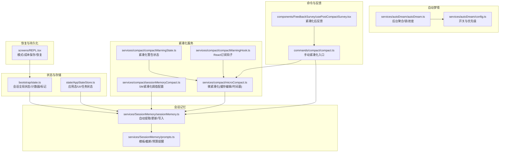
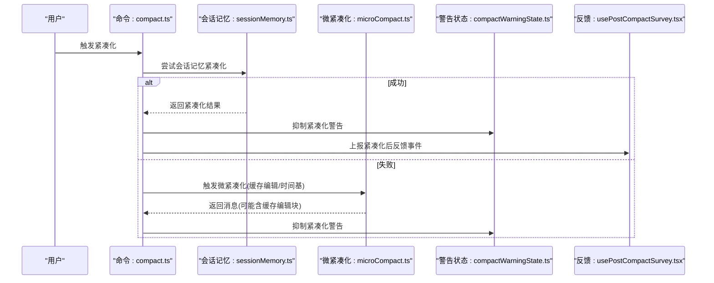
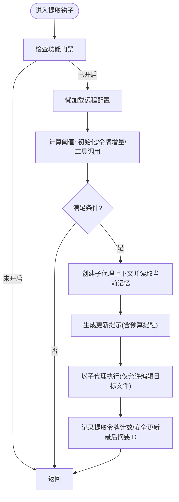
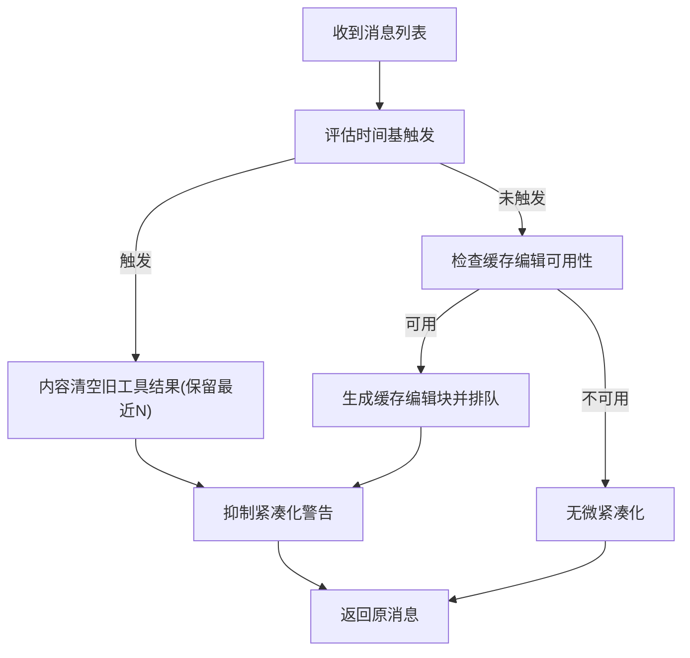
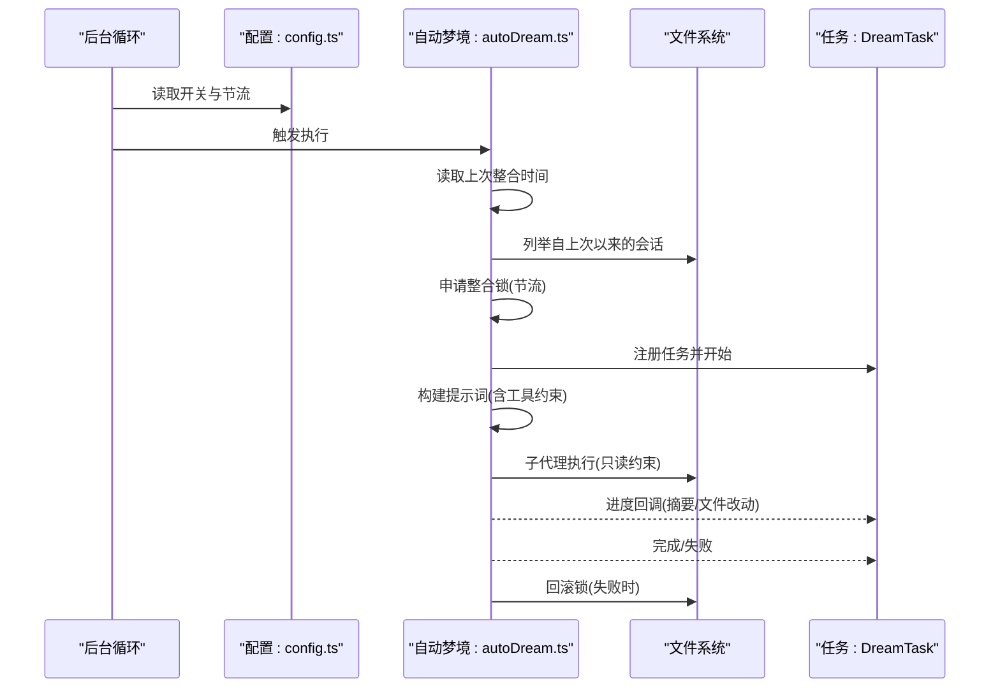
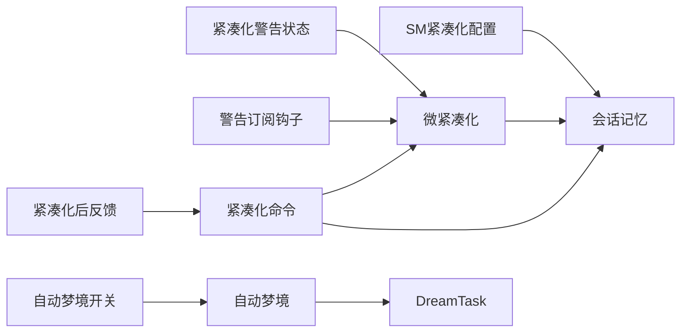

# 状态服务

<cite>
**本文引用的文件**
- [bootstrap/state.ts](file://bootstrap/state.ts)
- [state/AppStateStore.ts](file://state/AppStateStore.ts)
- [services/SessionMemory/sessionMemory.ts](file://services/SessionMemory/sessionMemory.ts)
- [services/SessionMemory/prompts.ts](file://services/SessionMemory/prompts.ts)
- [services/compact/sessionMemoryCompact.ts](file://services/compact/sessionMemoryCompact.ts)
- [services/compact/microCompact.ts](file://services/compact/microCompact.ts)
- [services/compact/compactWarningState.ts](file://services/compact/compactWarningState.ts)
- [services/compact/compactWarningHook.ts](file://services/compact/compactWarningHook.ts)
- [services/autoDream/autoDream.ts](file://services/autoDream/autoDream.ts)
- [services/autoDream/config.ts](file://services/autoDream/config.ts)
- [commands/compact/compact.ts](file://commands/compact/compact.ts)
- [components/FeedbackSurvey/usePostCompactSurvey.tsx](file://components/FeedbackSurvey/usePostCompactSurvey.tsx)
- [screens/REPL.tsx](file://screens/REPL.tsx)
</cite>

## 目录
1. [简介](#简介)
2. [项目结构](#项目结构)
3. [核心组件](#核心组件)
4. [架构总览](#架构总览)
5. [详细组件分析](#详细组件分析)
6. [依赖关系分析](#依赖关系分析)
7. [性能考量](#性能考量)
8. [故障排查指南](#故障排查指南)
9. [结论](#结论)
10. [附录](#附录)

## 简介
本文件系统性梳理 Claude Code 的状态服务体系，聚焦以下关键能力：
- 会话内存管理：基于“会话记忆”（Session Memory）的自动维护与更新，确保在不中断主对话流的前提下持续沉淀上下文要点。
- 紧凑化服务：包括会话记忆紧凑化阈值配置、微紧凑化（含缓存编辑与时间基触发）、紧凑化警告抑制与反馈联动。
- 自动梦境服务：后台“自动梦境”（Auto Dream）聚合多会话进行知识整合，降低缓存失效带来的重复计算成本。
- 状态持久化与恢复：会话标识、项目根路径、成本与用量统计、提示词缓存头与后处理标记等状态的生命周期管理。
- 配置与扩展：通过动态配置（GrowthBook）与本地设置对紧凑化阈值、自动梦境开关与节拍进行可调控制。
- 监控与调试：事件埋点、紧凑化警告订阅、紧凑化后处理标记、以及 REPL 中的成本与模式保存。

## 项目结构
状态服务横跨多个模块：
- 启动与全局状态：bootstrap/state.ts 提供会话级全局状态与计数器、时间戳、提示词缓存头与紧凑化后处理标记。
- 应用态存储：state/AppStateStore.ts 定义 UI 与任务相关的应用态，用于界面与交互层的状态管理。
- 会话记忆：services/SessionMemory/* 实现会话记忆的自动提取、模板化更新与插入紧凑时的截断策略。
- 紧凑化：services/compact/* 提供会话记忆紧凑化配置、微紧凑化（缓存编辑与时间基）、警告状态与钩子。
- 自动梦境：services/autoDream/* 提供自动聚合与知识整合的后台任务，含节流、锁与进度记录。
- 命令与反馈：commands/compact/compact.ts 与 components/FeedbackSurvey/usePostCompactSurvey.tsx 联动紧凑化后的反馈与事件上报。
- 恢复与持久化：screens/REPL.tsx 展示如何在恢复会话时保存/恢复模式与成本状态。

图示来源
- [bootstrap/state.ts:1-800](file://bootstrap/state.ts#L1-L800)
- [state/AppStateStore.ts:1-570](file://state/AppStateStore.ts#L1-L570)
- [services/SessionMemory/sessionMemory.ts:1-496](file://services/SessionMemory/sessionMemory.ts#L1-L496)
- [services/SessionMemory/prompts.ts:1-325](file://services/SessionMemory/prompts.ts#L1-L325)
- [services/compact/sessionMemoryCompact.ts:44-130](file://services/compact/sessionMemoryCompact.ts#L44-L130)
- [services/compact/microCompact.ts:1-531](file://services/compact/microCompact.ts#L1-L531)
- [services/compact/compactWarningState.ts:1-19](file://services/compact/compactWarningState.ts#L1-L19)
- [services/compact/compactWarningHook.ts:1-16](file://services/compact/compactWarningHook.ts#L1-L16)
- [services/autoDream/autoDream.ts:1-325](file://services/autoDream/autoDream.ts#L1-L325)
- [services/autoDream/config.ts:1-22](file://services/autoDream/config.ts#L1-L22)
- [commands/compact/compact.ts:48-83](file://commands/compact/compact.ts#L48-L83)
- [components/FeedbackSurvey/usePostCompactSurvey.tsx:169-205](file://components/FeedbackSurvey/usePostCompactSurvey.tsx#L169-L205)
- [screens/REPL.tsx:1894-1910](file://screens/REPL.tsx#L1894-L1910)

章节来源
- [bootstrap/state.ts:1-800](file://bootstrap/state.ts#L1-L800)
- [state/AppStateStore.ts:1-570](file://state/AppStateStore.ts#L1-L570)

## 核心组件
- 会话全局状态（bootstrap/state.ts）
  - 维护会话标识、项目根路径、成本与用量统计、提示词缓存头与紧凑化后处理标记等。
  - 提供会话切换、目录与工作树信息、交互时间戳批处理、令牌预算快照等能力。
- 应用态存储（state/AppStateStore.ts）
  - 定义 UI、任务、插件、权限、桥接、远程会话等应用态字段，支撑界面与交互层。
- 会话记忆（services/SessionMemory/sessionMemory.ts）
  - 在满足阈值条件下自动提取与更新会话记忆文件；支持手动触发；限制仅在主线程运行。
- 微紧凑化（services/compact/microCompact.ts）
  - 支持缓存编辑型微紧凑化与时间基微紧凑化；具备警告抑制与缓存破坏检测通知。
- 会话记忆紧凑化配置（services/compact/sessionMemoryCompact.ts）
  - 动态加载 GrowthBook 配置，合并默认阈值，支持重置与测试。
- 紧凑化警告（services/compact/compactWarningState.ts 与 compactWarningHook.ts）
  - 纯状态与 React 订阅钩子，用于抑制紧凑化后立即出现的“上下文剩余”警告。
- 自动梦境（services/autoDream/autoDream.ts）
  - 后台聚合多会话进行知识整合，含时间门、会话门、锁与进度记录；失败回滚。
- 命令与反馈（commands/compact/compact.ts 与 usePostCompactSurvey.tsx）
  - 手动紧凑化入口与紧凑化后反馈事件上报。

章节来源
- [bootstrap/state.ts:431-781](file://bootstrap/state.ts#L431-L781)
- [state/AppStateStore.ts:89-452](file://state/AppStateStore.ts#L89-L452)
- [services/SessionMemory/sessionMemory.ts:134-181](file://services/SessionMemory/sessionMemory.ts#L134-L181)
- [services/compact/microCompact.ts:253-531](file://services/compact/microCompact.ts#L253-L531)
- [services/compact/sessionMemoryCompact.ts:44-130](file://services/compact/sessionMemoryCompact.ts#L44-L130)
- [services/compact/compactWarningState.ts:1-19](file://services/compact/compactWarningState.ts#L1-L19)
- [services/compact/compactWarningHook.ts:1-16](file://services/compact/compactWarningHook.ts#L1-L16)
- [services/autoDream/autoDream.ts:95-325](file://services/autoDream/autoDream.ts#L95-L325)
- [commands/compact/compact.ts:48-83](file://commands/compact/compact.ts#L48-L83)
- [components/FeedbackSurvey/usePostCompactSurvey.tsx:169-205](file://components/FeedbackSurvey/usePostCompactSurvey.tsx#L169-L205)

## 架构总览
状态服务围绕“状态中心 + 多服务协同”的模式构建：
- 状态中心：bootstrap/state.ts 提供会话级全局状态与标记位，如紧凑化后处理标记、提示词缓存头与时间戳等。
- 服务编排：Session Memory 在满足阈值时自动提取；微紧凑化在请求前评估是否需要清理工具结果或进行缓存编辑；自动梦境在后台周期性聚合。
- 配置与反馈：动态配置（GrowthBook）驱动阈值与开关；紧凑化后抑制警告并上报反馈事件。

图示来源
- [commands/compact/compact.ts:48-83](file://commands/compact/compact.ts#L48-L83)
- [services/SessionMemory/sessionMemory.ts:134-181](file://services/SessionMemory/sessionMemory.ts#L134-L181)
- [services/compact/microCompact.ts:253-531](file://services/compact/microCompact.ts#L253-L531)
- [services/compact/compactWarningState.ts:10-18](file://services/compact/compactWarningState.ts#L10-L18)
- [components/FeedbackSurvey/usePostCompactSurvey.tsx:169-205](file://components/FeedbackSurvey/usePostCompactSurvey.tsx#L169-L205)

## 详细组件分析

### 会话内存管理
- 自动提取与更新
  - 通过阈值判断（初始化阈值、最小令牌增量、工具调用次数）决定是否提取。
  - 使用独立子代理上下文隔离文件系统操作，避免污染父态。
  - 仅在主线程触发，防止子代理/队友干扰。
- 文件与模板
  - 自动创建会话记忆文件并注入模板；支持自定义模板与提示词。
  - 更新时严格保留结构与描述行，仅更新内容区域。
- 插入紧凑时的截断
  - 对超长段落按行边界截断，并在必要时添加截断提示，避免占用过多预算。

图示来源
- [services/SessionMemory/sessionMemory.ts:134-181](file://services/SessionMemory/sessionMemory.ts#L134-L181)
- [services/SessionMemory/sessionMemory.ts:272-350](file://services/SessionMemory/sessionMemory.ts#L272-L350)
- [services/SessionMemory/prompts.ts:226-247](file://services/SessionMemory/prompts.ts#L226-L247)
- [services/SessionMemory/prompts.ts:255-296](file://services/SessionMemory/prompts.ts#L255-L296)

章节来源
- [services/SessionMemory/sessionMemory.ts:134-181](file://services/SessionMemory/sessionMemory.ts#L134-L181)
- [services/SessionMemory/sessionMemory.ts:272-350](file://services/SessionMemory/sessionMemory.ts#L272-L350)
- [services/SessionMemory/prompts.ts:226-247](file://services/SessionMemory/prompts.ts#L226-L247)
- [services/SessionMemory/prompts.ts:255-296](file://services/SessionMemory/prompts.ts#L255-L296)

### 紧凑化服务
- 会话记忆紧凑化阈值配置
  - 从 GrowthBook 动态加载阈值，合并默认值，支持重置与测试。
  - 关键参数：最小保留令牌、最少文本消息数量、硬上限最大保留令牌。
- 微紧凑化
  - 缓存编辑型：仅在主线程且模型受支持时启用，通过缓存编辑块删除旧工具结果，不破坏缓存前缀。
  - 时间基型：当自上次助手回复以来的时间超过阈值，内容清空保留最近若干工具结果，直接修改消息内容。
  - 警告抑制：成功紧凑化后抑制“上下文剩余”警告，避免误报。
- 紧凑化后处理
  - 标记紧凑化后首次 API 成功事件，便于区分缓存命中与紧凑化导致的缓存缺失。

图示来源
- [services/compact/microCompact.ts:422-444](file://services/compact/microCompact.ts#L422-L444)
- [services/compact/microCompact.ts:253-293](file://services/compact/microCompact.ts#L253-L293)
- [services/compact/compactWarningState.ts:10-18](file://services/compact/compactWarningState.ts#L10-L18)

章节来源
- [services/compact/sessionMemoryCompact.ts:44-130](file://services/compact/sessionMemoryCompact.ts#L44-L130)
- [services/compact/microCompact.ts:253-531](file://services/compact/microCompact.ts#L253-L531)
- [services/compact/compactWarningState.ts:1-19](file://services/compact/compactWarningState.ts#L1-L19)
- [services/compact/compactWarningHook.ts:1-16](file://services/compact/compactWarningHook.ts#L1-L16)
- [bootstrap/state.ts:769-781](file://bootstrap/state.ts#L769-L781)

### 自动梦境服务
- 触发条件
  - 时间门：自上次整合以来的小时数达到阈值。
  - 会话门：自上次整合以来有足够数量的新会话被触碰。
  - 锁：无其他进程正在整合中。
- 执行流程
  - 获取整合配置与会话列表，排除当前会话。
  - 申请整合锁，失败则节流等待。
  - 注册梦境任务，构建提示词，以子代理执行，收集进度与改动文件。
  - 成功完成或失败回滚，必要时回退锁时间戳。
- 进度与可视化
  - 通过任务状态记录每轮摘要、工具使用计数与改动文件列表。

图示来源
- [services/autoDream/autoDream.ts:95-325](file://services/autoDream/autoDream.ts#L95-L325)
- [services/autoDream/config.ts:13-21](file://services/autoDream/config.ts#L13-L21)

章节来源
- [services/autoDream/autoDream.ts:95-325](file://services/autoDream/autoDream.ts#L95-L325)
- [services/autoDream/config.ts:13-21](file://services/autoDream/config.ts#L13-L21)

### 状态持久化与恢复
- 会话切换与项目目录
  - 会话切换时同时更新会话标识与项目目录，保证一致性。
- 成本与模式保存
  - 在恢复会话时保存/恢复成本状态与模式（协调者/普通），确保后续体验一致。
- 全局状态与计数器
  - 交互时间戳批处理、令牌预算快照、紧凑化后处理标记等，均在全局状态中统一管理。

章节来源
- [bootstrap/state.ts:468-489](file://bootstrap/state.ts#L468-L489)
- [screens/REPL.tsx:1894-1910](file://screens/REPL.tsx#L1894-L1910)

## 依赖关系分析
- 紧凑化服务依赖
  - 会话记忆紧凑化配置（GrowthBook）与会话记忆模块。
  - 微紧凑化依赖提示词缓存破坏检测、估算令牌数与工具结果块解析。
  - 警告状态与 React 订阅钩子解耦 UI 与逻辑。
- 自动梦境依赖
  - 配置模块（本地设置优先于 GrowthBook）、会话扫描、整合锁与任务注册。
- 命令与反馈
  - 手动紧凑化命令与紧凑化后反馈事件上报形成闭环。

图示来源
- [services/compact/sessionMemoryCompact.ts:44-130](file://services/compact/sessionMemoryCompact.ts#L44-L130)
- [services/SessionMemory/sessionMemory.ts:134-181](file://services/SessionMemory/sessionMemory.ts#L134-L181)
- [services/compact/microCompact.ts:253-531](file://services/compact/microCompact.ts#L253-L531)
- [services/compact/compactWarningState.ts:1-19](file://services/compact/compactWarningState.ts#L1-L19)
- [services/compact/compactWarningHook.ts:1-16](file://services/compact/compactWarningHook.ts#L1-L16)
- [commands/compact/compact.ts:48-83](file://commands/compact/compact.ts#L48-L83)
- [components/FeedbackSurvey/usePostCompactSurvey.tsx:169-205](file://components/FeedbackSurvey/usePostCompactSurvey.tsx#L169-L205)
- [services/autoDream/config.ts:13-21](file://services/autoDream/config.ts#L13-L21)
- [services/autoDream/autoDream.ts:95-325](file://services/autoDream/autoDream.ts#L95-L325)

章节来源
- [services/compact/sessionMemoryCompact.ts:44-130](file://services/compact/sessionMemoryCompact.ts#L44-L130)
- [services/SessionMemory/sessionMemory.ts:134-181](file://services/SessionMemory/sessionMemory.ts#L134-L181)
- [services/compact/microCompact.ts:253-531](file://services/compact/microCompact.ts#L253-L531)
- [services/compact/compactWarningState.ts:1-19](file://services/compact/compactWarningState.ts#L1-L19)
- [services/compact/compactWarningHook.ts:1-16](file://services/compact/compactWarningHook.ts#L1-L16)
- [commands/compact/compact.ts:48-83](file://commands/compact/compact.ts#L48-L83)
- [components/FeedbackSurvey/usePostCompactSurvey.tsx:169-205](file://components/FeedbackSurvey/usePostCompactSurvey.tsx#L169-L205)
- [services/autoDream/config.ts:13-21](file://services/autoDream/config.ts#L13-L21)
- [services/autoDream/autoDream.ts:95-325](file://services/autoDream/autoDream.ts#L95-L325)

## 性能考量
- 令牌估算与保守 padding
  - 微紧凑化中的消息令牌估算采用保守 padding，避免高估导致的越界。
- 缓存编辑优先
  - 在缓存热时优先使用缓存编辑型微紧凑化，减少前缀重建成本。
- 时间基触发
  - 当缓存冷时，通过时间基清理旧工具结果，避免重写整个前缀。
- 截断策略
  - 会话记忆插入紧凑时按行边界截断，避免超长段落占用预算。
- 节流与锁
  - 自动梦境采用会话扫描节流与整合锁，避免频繁扫描与并发冲突。

## 故障排查指南
- 紧凑化警告误报
  - 成功紧凑化后会抑制警告；若仍出现，检查紧凑化后处理标记与警告状态订阅是否正确。
- 缓存破坏检测
  - 微紧凑化成功后会通知缓存破坏检测，避免将紧凑化导致的缓存缺失误判为外部破坏。
- 自动梦境失败回滚
  - 失败时会回滚锁时间戳，使下次扫描重新触发；检查日志与任务状态。
- 会话记忆未更新
  - 确认功能门禁、阈值条件与是否在主线程触发；检查模板与权限限制。

章节来源
- [services/compact/compactWarningState.ts:10-18](file://services/compact/compactWarningState.ts#L10-L18)
- [services/compact/microCompact.ts:362-367](file://services/compact/microCompact.ts#L362-L367)
- [services/autoDream/autoDream.ts:266-271](file://services/autoDream/autoDream.ts#L266-L271)
- [services/SessionMemory/sessionMemory.ts:284-291](file://services/SessionMemory/sessionMemory.ts#L284-L291)

## 结论
状态服务通过“全局状态 + 多服务协同”的方式，在不打断主对话流的前提下实现了：
- 会话记忆的自动维护与可控更新；
- 面向缓存的微紧凑化策略（缓存编辑与时间基）；
- 后台知识整合（自动梦境）以降低重复计算；
- 可调的动态配置与完善的反馈闭环；
- 稳健的恢复与持久化保障。

这些能力共同构成了 Claude Code 的状态服务基础，既保证了性能与稳定性，也为扩展与定制提供了清晰的接口。

## 附录
- 配置项与扩展点
  - 会话记忆紧凑化阈值：最小保留令牌、最少文本消息数量、最大保留令牌。
  - 微紧凑化：缓存编辑可用性、模型支持性、主线程来源校验。
  - 自动梦境：开关、时间阈值、会话阈值、扫描节流。
- 监控与调试
  - 事件埋点：紧凑化、微紧凑化、会话记忆提取、自动梦境。
  - 紧凑化后处理标记：区分紧凑化导致的缓存缺失与外部破坏。
  - 警告抑制：紧凑化成功后抑制“上下文剩余”警告。