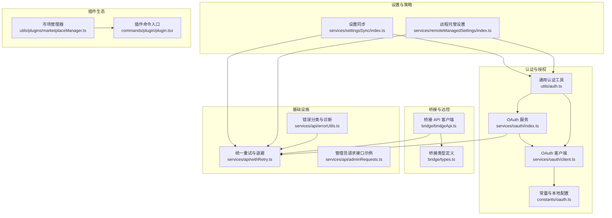
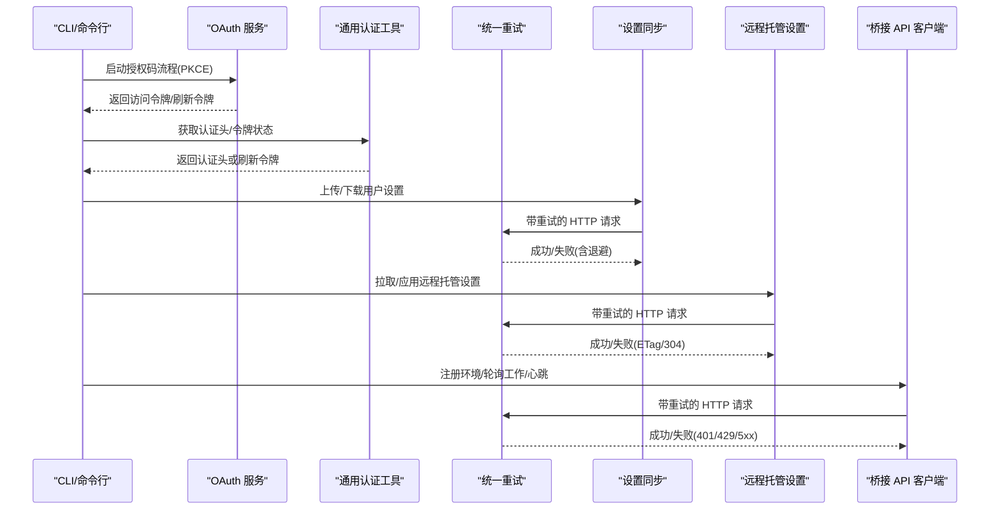
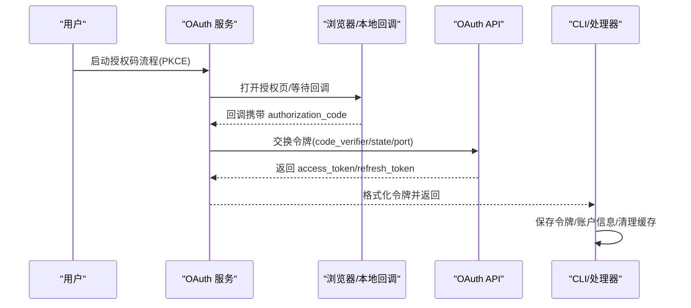
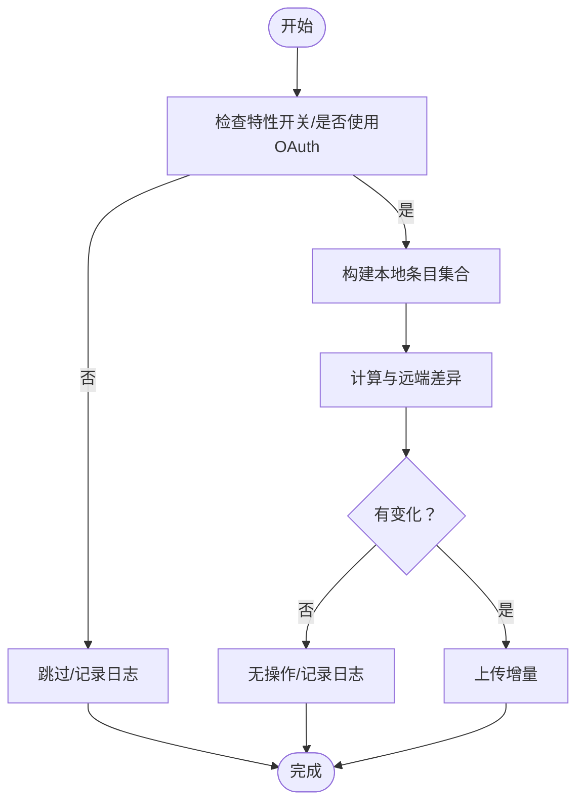
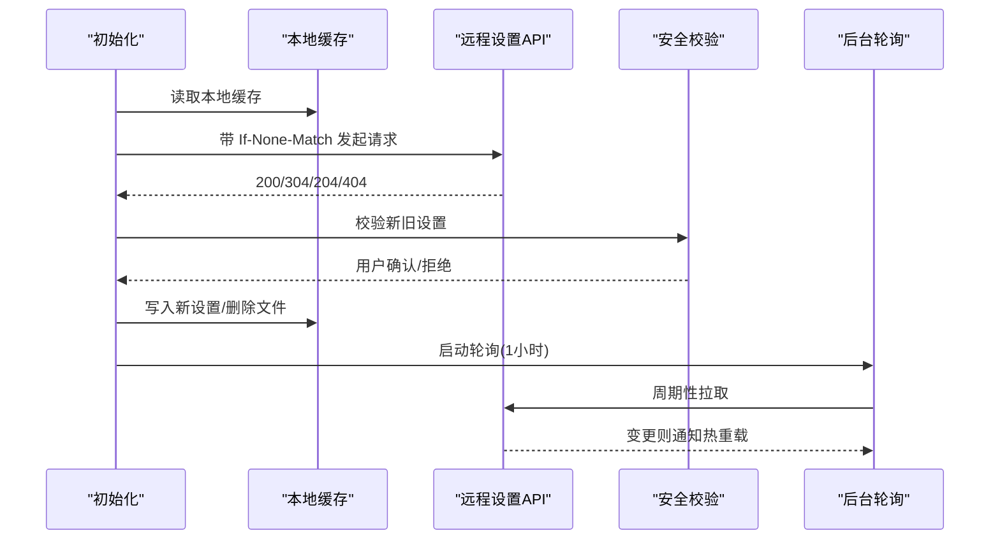
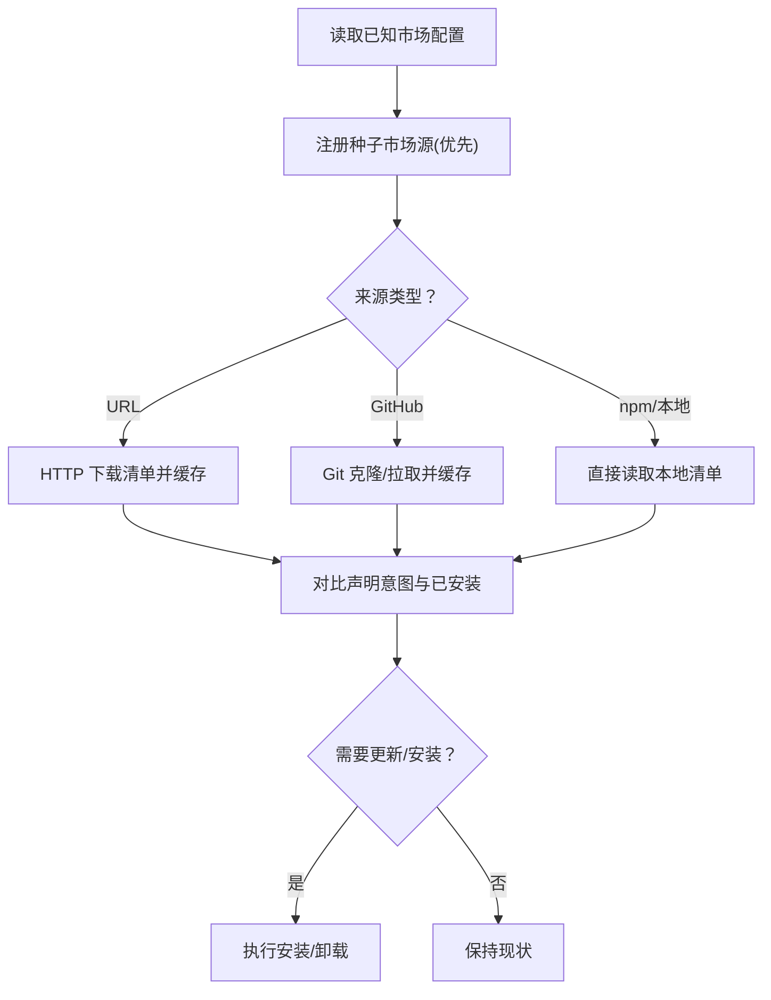
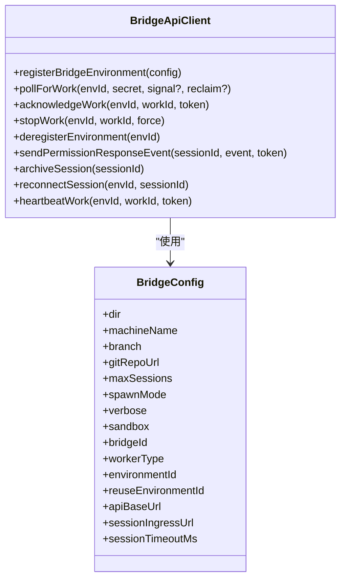
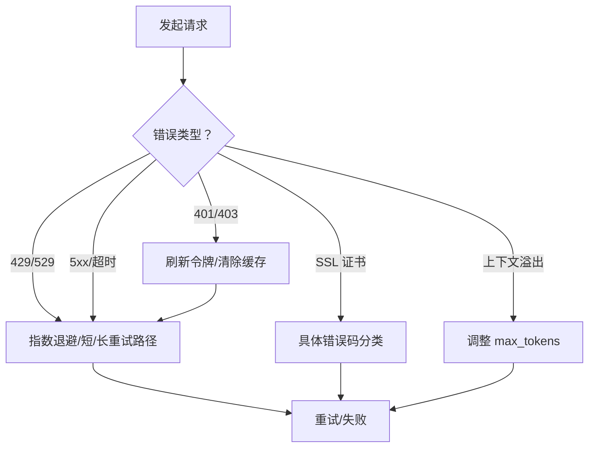
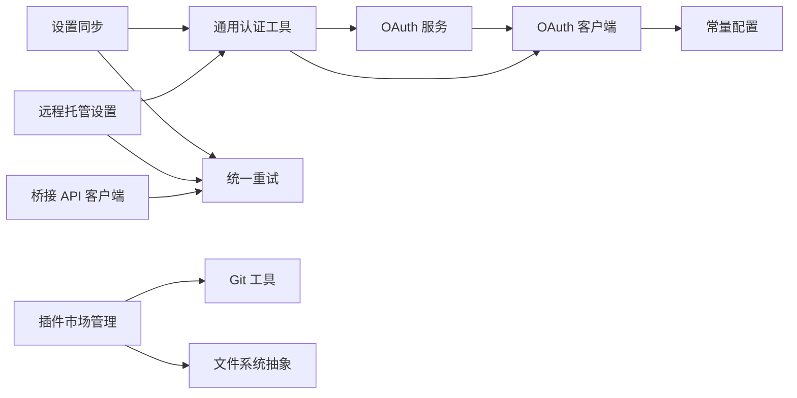

# 集成服务

<cite>
**本文引用的文件**
- [services/oauth/index.ts](file://services/oauth/index.ts)
- [services/oauth/client.ts](file://services/oauth/client.ts)
- [cli/handlers/auth.ts](file://cli/handlers/auth.ts)
- [constants/oauth.ts](file://constants/oauth.ts)
- [services/api/withRetry.ts](file://services/api/withRetry.ts)
- [utils/auth.ts](file://utils/auth.ts)
- [services/settingsSync/index.ts](file://services/settingsSync/index.ts)
- [services/remoteManagedSettings/index.ts](file://services/remoteManagedSettings/index.ts)
- [bridge/bridgeApi.ts](file://bridge/bridgeApi.ts)
- [bridge/types.ts](file://bridge/types.ts)
- [utils/plugins/marketplaceManager.ts](file://utils/plugins/marketplaceManager.ts)
- [commands/plugin/plugin.tsx](file://commands/plugin/plugin.tsx)
- [services/api/adminRequests.ts](file://services/api/adminRequests.ts)
- [services/api/errorUtils.ts](file://services/api/errorUtils.ts)
</cite>

## 目录
1. [简介](#简介)
2. [项目结构](#项目结构)
3. [核心组件](#核心组件)
4. [架构总览](#架构总览)
5. [详细组件分析](#详细组件分析)
6. [依赖分析](#依赖分析)
7. [性能考量](#性能考量)
8. [故障排查指南](#故障排查指南)
9. [结论](#结论)
10. [附录](#附录)

## 简介
本文件面向 Claude Code 的“集成服务”子系统，系统性阐述以下能力与实现：
- OAuth 认证：授权码流程（含 PKCE）、自动/手动回调、令牌刷新与安全头注入
- 插件管理：市场来源注册、离线缓存、增量更新、安装与卸载
- 设置同步：用户设置与内存文件在多环境间同步，支持增量上传与下载
- 远程托管设置：企业级策略下发、ETag 缓存、安全变更校验与后台轮询
- 第三方系统集成：桥接服务（Bridge）API 客户端、权限事件上报、心跳与会话归档
- API 适配器与数据转换：统一重试策略、错误分类、超时与网络异常处理
- 安全与合规：CSRF 校验、可信设备令牌、OAuth 刷新、证书错误诊断
- 错误处理与重试：指数退避、幂等重试、持久化重试模式、失败开路降级

## 项目结构
集成服务由多个模块协同组成，围绕认证、插件、设置与桥接四大领域展开，并通过统一的重试与错误处理框架保证鲁棒性。

图示来源
- [services/oauth/index.ts:1-198](file://services/oauth/index.ts#L1-L198)
- [services/oauth/client.ts:89-133](file://services/oauth/client.ts#L89-L133)
- [constants/oauth.ts:145-174](file://constants/oauth.ts#L145-L174)
- [utils/auth.ts:1-200](file://utils/auth.ts#L1-L200)
- [services/settingsSync/index.ts:1-200](file://services/settingsSync/index.ts#L1-L200)
- [services/remoteManagedSettings/index.ts:1-100](file://services/remoteManagedSettings/index.ts#L1-L100)
- [utils/plugins/marketplaceManager.ts:1-120](file://utils/plugins/marketplaceManager.ts#L1-L120)
- [commands/plugin/plugin.tsx:1-7](file://commands/plugin/plugin.tsx#L1-L7)
- [bridge/bridgeApi.ts:1-120](file://bridge/bridgeApi.ts#L1-L120)
- [bridge/types.ts:1-120](file://bridge/types.ts#L1-L120)
- [services/api/withRetry.ts:1-120](file://services/api/withRetry.ts#L1-L120)
- [services/api/errorUtils.ts:204-235](file://services/api/errorUtils.ts#L204-L235)

章节来源
- [services/oauth/index.ts:1-198](file://services/oauth/index.ts#L1-L198)
- [services/oauth/client.ts:89-133](file://services/oauth/client.ts#L89-L133)
- [constants/oauth.ts:145-174](file://constants/oauth.ts#L145-L174)
- [utils/auth.ts:1-200](file://utils/auth.ts#L1-L200)
- [services/settingsSync/index.ts:1-200](file://services/settingsSync/index.ts#L1-L200)
- [services/remoteManagedSettings/index.ts:1-100](file://services/remoteManagedSettings/index.ts#L1-L100)
- [utils/plugins/marketplaceManager.ts:1-120](file://utils/plugins/marketplaceManager.ts#L1-L120)
- [commands/plugin/plugin.tsx:1-7](file://commands/plugin/plugin.tsx#L1-L7)
- [bridge/bridgeApi.ts:1-120](file://bridge/bridgeApi.ts#L1-L120)
- [bridge/types.ts:1-120](file://bridge/types.ts#L1-L120)
- [services/api/withRetry.ts:1-120](file://services/api/withRetry.ts#L1-L120)
- [services/api/errorUtils.ts:204-235](file://services/api/errorUtils.ts#L204-L235)

## 核心组件
- OAuth 服务与客户端：负责授权码流程、PKCE、令牌交换、刷新与安全头注入；支持本地/手动回调与多环境配置
- 设置同步：在交互式 CLI 与 CCR 模式之间同步用户设置与内存文件，支持增量与失败开路
- 远程托管设置：企业策略拉取、ETag 缓存、安全变更校验、后台轮询与热重载
- 插件市场管理：已知市场源注册、离线缓存、增量更新、种子目录同步与 Git 操作
- 桥接 API 客户端：环境注册、工作轮询、会话心跳、权限事件上报、会话归档与停止
- 统一重试与错误处理：指数退避、幂等重试、持久化重试模式、SSL 证书错误诊断

章节来源
- [services/oauth/index.ts:21-198](file://services/oauth/index.ts#L21-L198)
- [services/oauth/client.ts:107-133](file://services/oauth/client.ts#L107-L133)
- [services/settingsSync/index.ts:55-202](file://services/settingsSync/index.ts#L55-L202)
- [services/remoteManagedSettings/index.ts:148-242](file://services/remoteManagedSettings/index.ts#L148-L242)
- [utils/plugins/marketplaceManager.ts:264-350](file://utils/plugins/marketplaceManager.ts#L264-L350)
- [bridge/bridgeApi.ts:141-451](file://bridge/bridgeApi.ts#L141-L451)
- [services/api/withRetry.ts:520-548](file://services/api/withRetry.ts#L520-L548)

## 架构总览
下图展示集成服务的关键交互路径：认证层（OAuth/通用认证）为上层服务提供凭据；设置与策略服务通过统一重试与错误处理保障可靠性；桥接服务连接远控后端；插件生态通过市场管理器与命令入口协同工作。

图示来源
- [services/oauth/index.ts:21-198](file://services/oauth/index.ts#L21-L198)
- [utils/auth.ts:151-206](file://utils/auth.ts#L151-L206)
- [services/settingsSync/index.ts:315-345](file://services/settingsSync/index.ts#L315-L345)
- [services/remoteManagedSettings/index.ts:209-242](file://services/remoteManagedSettings/index.ts#L209-L242)
- [bridge/bridgeApi.ts:141-451](file://bridge/bridgeApi.ts#L141-L451)
- [services/api/withRetry.ts:170-257](file://services/api/withRetry.ts#L170-L257)

## 详细组件分析

### OAuth 认证与令牌管理
- 授权码流程（PKCE）：生成 code_verifier，启动本地监听或手动回调，交换令牌并格式化返回结构（含作用域、订阅等级、账户信息）
- 多环境配置：本地开发与生产环境的授权端点、令牌端点、成功回调地址等通过常量集中管理
- 令牌刷新与安全头：在调用前检查并刷新令牌，注入 Anthropic 特定 Beta 头，避免 401
- CLI 集成：安装令牌后保存账户信息、存储令牌、清理缓存并触发本地状态初始化

图示来源
- [services/oauth/index.ts:21-198](file://services/oauth/index.ts#L21-L198)
- [services/oauth/client.ts:107-133](file://services/oauth/client.ts#L107-L133)
- [constants/oauth.ts:145-174](file://constants/oauth.ts#L145-L174)
- [cli/handlers/auth.ts:50-80](file://cli/handlers/auth.ts#L50-L80)

章节来源
- [services/oauth/index.ts:21-198](file://services/oauth/index.ts#L21-L198)
- [services/oauth/client.ts:107-133](file://services/oauth/client.ts#L107-L133)
- [constants/oauth.ts:145-174](file://constants/oauth.ts#L145-L174)
- [cli/handlers/auth.ts:50-80](file://cli/handlers/auth.ts#L50-L80)

### 设置同步（用户设置与内存文件）
- 功能目标：在交互式 CLI 与 CCR 模式之间同步用户设置与内存文件，支持增量上传与下载
- 上传（CLI 侧）：构建本地条目集合，计算与远端差异，增量上传并记录事件
- 下载（CCR 侧）：首次启动或强制重下载，应用远端条目到本地并清空相关缓存
- 认证与限流：基于 OAuth 令牌与 Anthropic Beta 头，带超时与重试；对 404 视为空集
- 文件大小限制与健壮性：单文件大小上限、空/空白跳过、失败开路

图示来源
- [services/settingsSync/index.ts:55-202](file://services/settingsSync/index.ts#L55-L202)

章节来源
- [services/settingsSync/index.ts:55-202](file://services/settingsSync/index.ts#L55-L202)

### 远程托管设置（企业策略）
- 职责：拉取企业策略设置、ETag 缓存、安全变更校验、后台轮询与热重载
- 适配两种认证：Console 用户（API Key）与 OAuth 用户（Claude.ai），分别注入 x-api-key 或 Authorization
- 缓存策略：本地文件缓存 + 会话缓存；304 表示缓存有效；204/404 表示无设置
- 安全校验：比较新旧设置，若存在危险变更需用户确认
- 轮询与失败开路：每小时轮询一次；任何阶段失败均降级使用缓存

图示来源
- [services/remoteManagedSettings/index.ts:209-361](file://services/remoteManagedSettings/index.ts#L209-L361)
- [services/remoteManagedSettings/index.ts:414-503](file://services/remoteManagedSettings/index.ts#L414-L503)
- [services/remoteManagedSettings/index.ts:612-628](file://services/remoteManagedSettings/index.ts#L612-L628)

章节来源
- [services/remoteManagedSettings/index.ts:148-242](file://services/remoteManagedSettings/index.ts#L148-L242)
- [services/remoteManagedSettings/index.ts:209-361](file://services/remoteManagedSettings/index.ts#L209-L361)
- [services/remoteManagedSettings/index.ts:414-503](file://services/remoteManagedSettings/index.ts#L414-L503)
- [services/remoteManagedSettings/index.ts:612-628](file://services/remoteManagedSettings/index.ts#L612-L628)

### 插件市场与安装管理
- 已知市场源：支持 URL、GitHub、npm、本地文件等来源，集中配置于 known_marketplaces.json
- 缓存与更新：市场清单缓存至磁盘，支持增量更新与 Git 操作（克隆/拉取/子模块更新）
- 种子目录同步：容器内种子目录中的市场源优先注册，且不可被用户覆盖
- 安装与卸载：根据声明意图与已安装列表进行对比，按需安装或移除
- 安全与策略：来源白名单/黑名单、来源允许策略、官方市场回退策略

图示来源
- [utils/plugins/marketplaceManager.ts:264-350](file://utils/plugins/marketplaceManager.ts#L264-L350)
- [utils/plugins/marketplaceManager.ts:508-582](file://utils/plugins/marketplaceManager.ts#L508-L582)
- [utils/plugins/marketplaceManager.ts:380-434](file://utils/plugins/marketplaceManager.ts#L380-L434)

章节来源
- [utils/plugins/marketplaceManager.ts:1-120](file://utils/plugins/marketplaceManager.ts#L1-L120)
- [utils/plugins/marketplaceManager.ts:264-350](file://utils/plugins/marketplaceManager.ts#L264-L350)
- [utils/plugins/marketplaceManager.ts:508-582](file://utils/plugins/marketplaceManager.ts#L508-L582)
- [utils/plugins/marketplaceManager.ts:380-434](file://utils/plugins/marketplaceManager.ts#L380-L434)
- [commands/plugin/plugin.tsx:1-7](file://commands/plugin/plugin.tsx#L1-L7)

### 桥接服务与远控集成
- 客户端职责：环境注册、工作轮询、会话心跳、权限事件上报、会话归档与停止
- 安全与容错：路径参数校验、401 自动刷新令牌、403/404/410 错误分类、429 速率限制提示
- 会话生命周期：心跳维持租约、停止工作项、重新连接旧实例、归档会话
- 类型与协议：严格的类型定义与协议字段，确保前后端一致性

图示来源
- [bridge/bridgeApi.ts:133-176](file://bridge/bridgeApi.ts#L133-L176)
- [bridge/types.ts:81-115](file://bridge/types.ts#L81-L115)

章节来源
- [bridge/bridgeApi.ts:141-451](file://bridge/bridgeApi.ts#L141-L451)
- [bridge/types.ts:16-115](file://bridge/types.ts#L16-L115)

### API 适配器与数据转换
- 统一重试：指数退避、抖动、幂等重试、持久化重试模式（长等待时的心跳输出）
- 错误分类：网络超时、SSL 证书错误、401/403/429/5xx、速率限制、上下文溢出等
- 数据转换：校验响应格式、模型参数调整、最大输出令牌修正、JSON 序列化规范化

图示来源
- [services/api/withRetry.ts:170-257](file://services/api/withRetry.ts#L170-L257)
- [services/api/withRetry.ts:520-548](file://services/api/withRetry.ts#L520-L548)
- [services/api/errorUtils.ts:204-235](file://services/api/errorUtils.ts#L204-L235)

章节来源
- [services/api/withRetry.ts:520-548](file://services/api/withRetry.ts#L520-L548)
- [services/api/errorUtils.ts:204-235](file://services/api/errorUtils.ts#L204-L235)

## 依赖分析
- 认证链路：OAuth 服务依赖 OAuth 客户端与常量配置；通用认证工具负责令牌状态与刷新；CLI 处理器在安装令牌后写入账户信息
- 设置同步：依赖 OAuth 令牌与 Beta 头，使用统一重试与错误处理；与内存/设置缓存联动
- 远程托管设置：同时兼容 API Key 与 OAuth；依赖统一重试与错误处理；与设置变更检测器联动
- 桥接服务：依赖统一重试与错误处理；严格校验路径参数与错误类型
- 插件市场：依赖 Git 工具与文件系统抽象；与设置系统协作

图示来源
- [services/oauth/index.ts:1-30](file://services/oauth/index.ts#L1-L30)
- [services/oauth/client.ts:1-20](file://services/oauth/client.ts#L1-L20)
- [constants/oauth.ts:145-174](file://constants/oauth.ts#L145-L174)
- [utils/auth.ts:1-120](file://utils/auth.ts#L1-L120)
- [services/settingsSync/index.ts:18-49](file://services/settingsSync/index.ts#L18-L49)
- [services/remoteManagedSettings/index.ts:15-49](file://services/remoteManagedSettings/index.ts#L15-L49)
- [bridge/bridgeApi.ts:1-42](file://bridge/bridgeApi.ts#L1-L42)
- [utils/plugins/marketplaceManager.ts:21-57](file://utils/plugins/marketplaceManager.ts#L21-L57)

章节来源
- [services/oauth/index.ts:1-30](file://services/oauth/index.ts#L1-L30)
- [services/oauth/client.ts:1-20](file://services/oauth/client.ts#L1-L20)
- [constants/oauth.ts:145-174](file://constants/oauth.ts#L145-L174)
- [utils/auth.ts:1-120](file://utils/auth.ts#L1-L120)
- [services/settingsSync/index.ts:18-49](file://services/settingsSync/index.ts#L18-L49)
- [services/remoteManagedSettings/index.ts:15-49](file://services/remoteManagedSettings/index.ts#L15-L49)
- [bridge/bridgeApi.ts:1-42](file://bridge/bridgeApi.ts#L1-L42)
- [utils/plugins/marketplaceManager.ts:21-57](file://utils/plugins/marketplaceManager.ts#L21-L57)

## 性能考量
- 指数退避与抖动：降低瞬时峰值与级联失败风险
- ETag 缓存：减少网络流量与服务器压力，提升冷启动速度
- 失败开路降级：在网络异常或服务不可用时快速恢复，避免阻塞主流程
- 文件大小限制：防止大文件拖慢同步与设置加载
- 后台轮询节流：远程托管设置每小时轮询一次，避免频繁请求

## 故障排查指南
- OAuth 401/403：检查令牌是否过期或被撤销；确认组织权限；查看本地/手动回调端口
- SSL 证书错误：根据错误码定位问题（过期、吊销、主机名不匹配、自签名等），检查代理与企业证书
- 429/529：区分前台/后台场景；前台可重试，后台采用持久化重试与心跳；必要时调整速率限制
- 设置同步失败：检查网络与认证头；确认文件大小与内容有效性；查看失败开路日志
- 远程托管设置：关注 304/204/404 语义；核对 ETag 与校验和；确认安全变更对话
- 桥接服务：留意 403/404/410 的不同含义；检查路径参数与可信设备令牌

章节来源
- [services/api/errorUtils.ts:204-235](file://services/api/errorUtils.ts#L204-L235)
- [services/api/withRetry.ts:696-787](file://services/api/withRetry.ts#L696-L787)
- [services/settingsSync/index.ts:296-313](file://services/settingsSync/index.ts#L296-L313)
- [services/remoteManagedSettings/index.ts:287-306](file://services/remoteManagedSettings/index.ts#L287-L306)
- [bridge/bridgeApi.ts:454-500](file://bridge/bridgeApi.ts#L454-L500)

## 结论
该集成服务以 OAuth 为基础，结合统一的重试与错误处理框架，实现了设置同步、远程托管设置、插件市场与桥接远控的完整闭环。通过 ETag 缓存、失败开路降级与安全校验，系统在复杂的企业与多环境场景中保持高可用与高安全性。

## 附录
- 配置选项与环境变量
  - OAuth 本地开发配置：授权端点、令牌端点、控制台/前端地址、客户端 ID、MCP 代理路径等
  - 设置同步：特性开关、上传/下载功能、超时与重试次数、文件大小限制
  - 远程托管设置：超时、重试次数、轮询间隔、加载承诺超时
  - 插件市场：Git 超时、来源白名单/黑名单、种子目录、自动更新策略
  - 桥接服务：路径参数校验、401 刷新、429 速率限制提示
- 开发与扩展建议
  - 新增第三方系统：遵循统一重试与错误分类；提供明确的认证头与 Beta 头注入
  - 插件市场扩展：新增来源类型需实现缓存与更新逻辑；确保安全策略与来源校验
  - 设置同步扩展：新增条目键需纳入增量计算；注意文件大小与序列化规范
  - 远程托管设置扩展：新增字段需通过 Schema 校验；确保安全变更对话与后台轮询

章节来源
- [constants/oauth.ts:145-174](file://constants/oauth.ts#L145-L174)
- [services/settingsSync/index.ts:51-54](file://services/settingsSync/index.ts#L51-L54)
- [services/remoteManagedSettings/index.ts:51-54](file://services/remoteManagedSettings/index.ts#L51-L54)
- [utils/plugins/marketplaceManager.ts:515-526](file://utils/plugins/marketplaceManager.ts#L515-L526)
- [bridge/bridgeApi.ts:48-53](file://bridge/bridgeApi.ts#L48-L53)