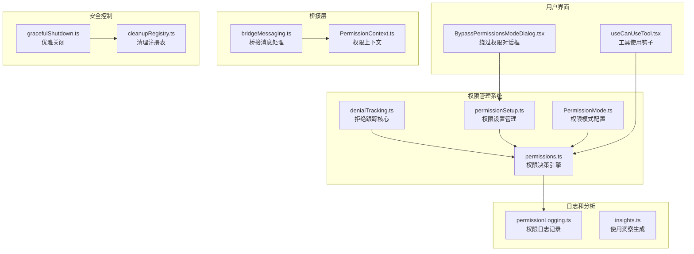
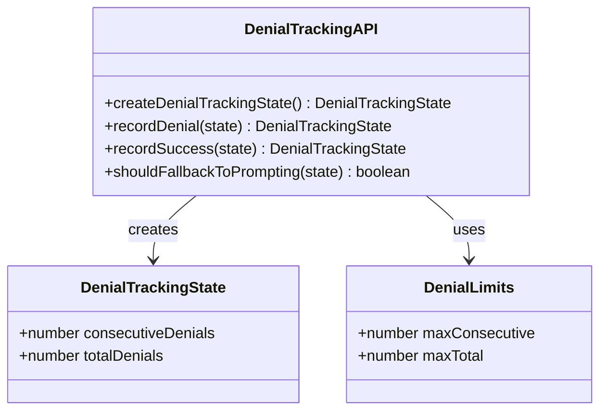
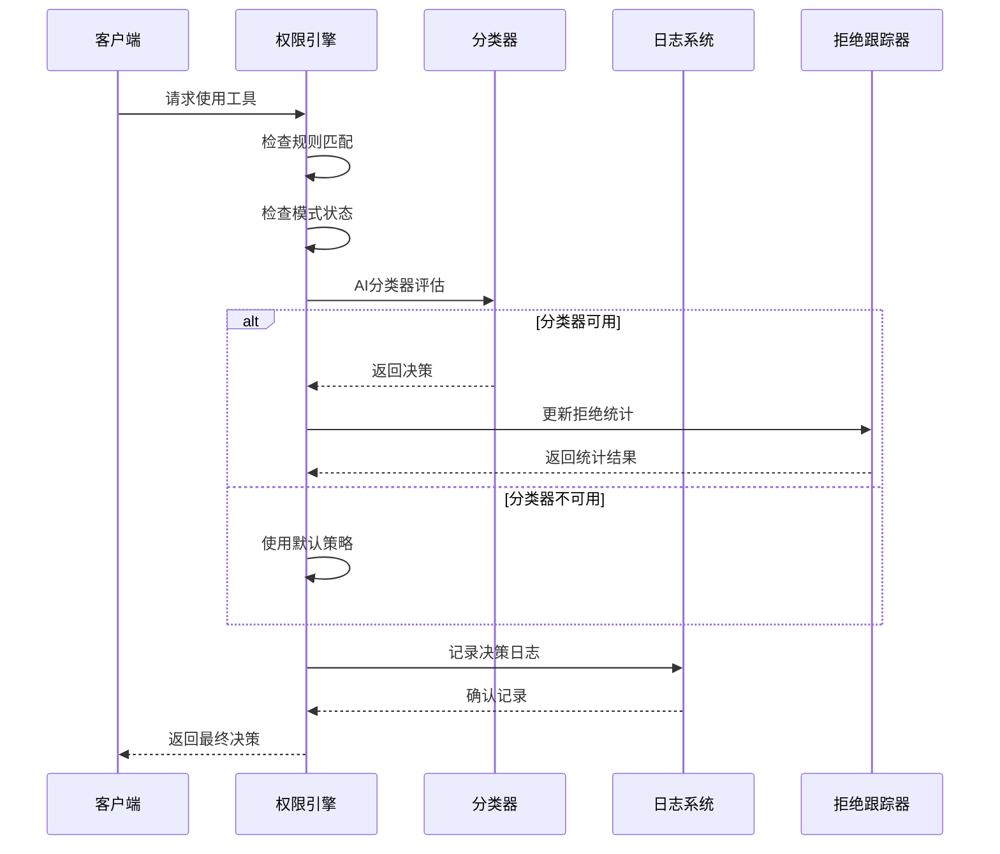
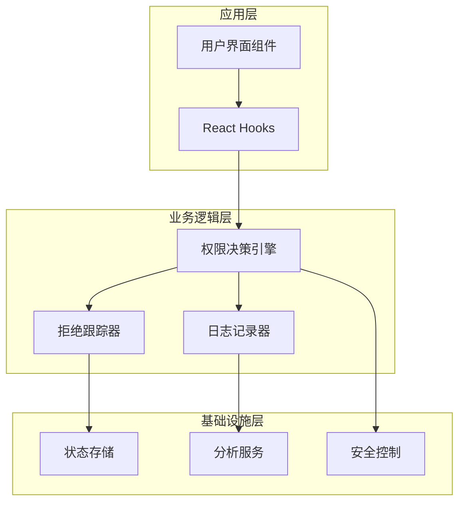
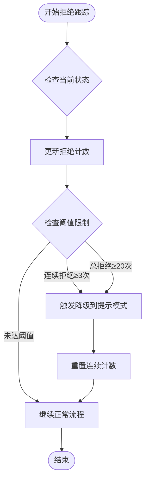
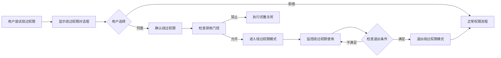
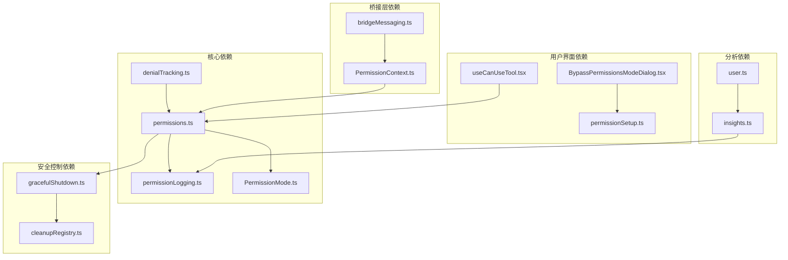

# 拒绝跟踪系统

<cite>
**本文档引用的文件**
- [denialTracking.ts](file://utils/permissions/denialTracking.ts)
- [permissions.ts](file://utils/permissions/permissions.ts)
- [permissionSetup.ts](file://utils/permissions/permissionSetup.ts)
- [PermissionMode.ts](file://utils/permissions/PermissionMode.ts)
- [permissionLogging.ts](file://hooks/toolPermission/permissionLogging.ts)
- [PermissionContext.ts](file://hooks/toolPermission/PermissionContext.ts)
- [useCanUseTool.tsx](file://hooks/useCanUseTool.tsx)
- [modeValidation.ts](file://tools/BashTool/modeValidation.ts)
- [BypassPermissionsModeDialog.tsx](file://components/BypassPermissionsModeDialog.tsx)
- [bridgeMessaging.ts](file://bridge/bridgeMessaging.ts)
- [gracefulShutdown.ts](file://utils/gracefulShutdown.ts)
- [cleanupRegistry.ts](file://utils/cleanupRegistry.ts)
- [insights.ts](file://commands/insights.ts)
- [user.ts](file://utils/user.ts)
- [privacy-settings/index.ts](file://commands/privacy-settings/index.ts)
</cite>

## 目录
1. [简介](#简介)
2. [项目结构](#项目结构)
3. [核心组件](#核心组件)
4. [架构概览](#架构概览)
5. [详细组件分析](#详细组件分析)
6. [依赖关系分析](#依赖关系分析)
7. [性能考虑](#性能考虑)
8. [故障排除指南](#故障排除指南)
9. [结论](#结论)
10. [附录](#附录)

## 简介

拒绝跟踪系统是 Claude Code 权限管理框架中的关键组件，负责监控和分析工具使用请求的拒绝情况。该系统通过记录连续拒绝次数、总拒绝次数以及拒绝原因来实现智能的安全控制和用户体验优化。

系统的核心功能包括：
- **拒绝统计追踪**：实时记录和统计工具使用请求的拒绝情况
- **智能降级机制**：当拒绝次数达到阈值时自动切换到提示模式
- **多维度分析**：支持按工具类型、拒绝原因、时间维度的统计分析
- **安全控制**：提供绕过权限的紧急响应机制和安全控制措施
- **趋势监控**：识别拒绝模式并进行异常检测

## 项目结构

拒绝跟踪系统在代码库中的组织结构如下：



**图表来源**
- [denialTracking.ts:1-46](file://utils/permissions/denialTracking.ts#L1-L46)
- [permissions.ts:1-100](file://utils/permissions/permissions.ts#L1-L100)
- [permissionSetup.ts:1-100](file://utils/permissions/permissionSetup.ts#L1-L100)

## 核心组件

### 拒绝跟踪状态管理

拒绝跟踪系统的核心是 `DenialTrackingState` 类型和相关的操作函数：



**图表来源**
- [denialTracking.ts:7-45](file://utils/permissions/denialTracking.ts#L7-L45)

### 权限决策流程

权限决策系统采用多层次的检查机制：



**图表来源**
- [permissions.ts:473-800](file://utils/permissions/permissions.ts#L473-L800)
- [permissionLogging.ts:181-239](file://hooks/toolPermission/permissionLogging.ts#L181-L239)

**章节来源**
- [denialTracking.ts:1-46](file://utils/permissions/denialTracking.ts#L1-L46)
- [permissions.ts:1-100](file://utils/permissions/permissions.ts#L1-L100)

## 架构概览

拒绝跟踪系统采用分层架构设计，确保了模块间的松耦合和高内聚：



**图表来源**
- [permissions.ts:473-800](file://utils/permissions/permissions.ts#L473-L800)
- [permissionLogging.ts:1-239](file://hooks/toolPermission/permissionLogging.ts#L1-L239)

## 详细组件分析

### 拒绝统计机制

系统实现了双维度的拒绝统计机制：

#### 连续拒绝计数
- **目的**：检测短期频繁拒绝模式
- **阈值**：默认最大连续拒绝次数为 3 次
- **作用**：防止系统陷入持续拒绝循环

#### 总拒绝计数
- **目的**：监控长期拒绝趋势
- **阈值**：默认最大总拒绝次数为 20 次
- **作用**：识别潜在的安全威胁或配置问题



**图表来源**
- [denialTracking.ts:40-45](file://utils/permissions/denialTracking.ts#L40-L45)

**章节来源**
- [denialTracking.ts:12-45](file://utils/permissions/denialTracking.ts#L12-L45)

### 权限模式集成

拒绝跟踪系统与多种权限模式深度集成：

#### 默认模式 (Default)
- **特点**：标准权限检查，所有拒绝都会被记录
- **用途**：生产环境的标准安全模式

#### 绕过权限模式 (Bypass Permissions)
- **特点**：完全跳过权限检查，仅用于受控环境
- **安全措施**：需要用户明确确认，提供退出机制

#### 不询问模式 (Don't Ask)
- **特点**：自动拒绝所有权限请求
- **用途**：严格安全场景下的强制模式

```mermaid
stateDiagram-v2
[*] --> Default
Default --> AutoMode : 启动自动模式
Default --> BypassPermissions : 用户确认
Default --> DontAsk : 配置为不询问
AutoMode --> Default : 退出自动模式
AutoMode --> BypassPermissions : 异常情况
AutoMode --> DontAsk : 转换为严格模式
BypassPermissions --> Default : 用户退出
BypassPermissions --> AutoMode : 异常恢复
DontAsk --> Default : 改变配置
DontAsk --> AutoMode : 特殊情况
```

**图表来源**
- [PermissionMode.ts:42-91](file://utils/permissions/PermissionMode.ts#L42-L91)
- [BypassPermissionsModeDialog.tsx:12-86](file://components/BypassPermissionsModeDialog.tsx#L12-L86)

**章节来源**
- [PermissionMode.ts:42-91](file://utils/permissions/PermissionMode.ts#L42-L91)
- [BypassPermissionsModeDialog.tsx:1-86](file://components/BypassPermissionsModeDialog.tsx#L1-L86)

### 日志记录和分析

系统提供了全面的日志记录和分析功能：

#### 决策日志结构
每个权限决策都会产生详细的日志条目，包含以下信息：
- **决策类型**：批准或拒绝
- **决策来源**：用户、分类器、钩子等
- **等待时间**：用户响应时间
- **工具信息**：使用的具体工具和参数
- **会话上下文**：消息ID、工具使用ID等

#### 分析指标
系统支持多种分析维度：
- **时间序列分析**：拒绝趋势随时间变化
- **工具类型分析**：不同工具的拒绝率对比
- **用户行为分析**：用户权限使用模式识别
- **安全事件分析**：异常拒绝模式检测

**章节来源**
- [permissionLogging.ts:181-239](file://hooks/toolPermission/permissionLogging.ts#L181-L239)
- [insights.ts:275-320](file://commands/insights.ts#L275-L320)

### 绕过权限的紧急响应机制

系统提供了安全的绕过权限机制：

#### 绑定对话框组件
用户必须通过交互式对话框确认绕过权限模式：
- 明确的安全警告和风险说明
- 用户明确的同意确认
- 提供退出机制和安全提示

#### 动态禁用机制
系统支持通过配置门控动态禁用绕过权限模式：
- Statsig 门控检查
- 设置项控制
- 环境变量配置



**图表来源**
- [BypassPermissionsModeDialog.tsx:27-42](file://components/BypassPermissionsModeDialog.tsx#L27-L42)
- [permissionSetup.ts:1411-1431](file://utils/permissions/permissionSetup.ts#L1411-L1431)

**章节来源**
- [BypassPermissionsModeDialog.tsx:1-86](file://components/BypassPermissionsModeDialog.tsx#L1-L86)
- [permissionSetup.ts:1411-1431](file://utils/permissions/permissionSetup.ts#L1411-L1431)

## 依赖关系分析

拒绝跟踪系统的依赖关系图：



**图表来源**
- [permissions.ts:95-101](file://utils/permissions/permissions.ts#L95-L101)
- [permissionLogging.ts:1-239](file://hooks/toolPermission/permissionLogging.ts#L1-L239)

**章节来源**
- [permissions.ts:95-101](file://utils/permissions/permissions.ts#L95-L101)
- [permissionLogging.ts:1-239](file://hooks/toolPermission/permissionLogging.ts#L1-L239)

## 性能考虑

### 拒绝跟踪性能优化

系统在性能方面采用了多项优化策略：

#### 内存效率
- 拒绝跟踪状态使用轻量级对象结构
- 最小化状态复制和内存分配
- 及时清理不再需要的状态数据

#### 计算效率
- 拒绝阈值检查为 O(1) 复杂度
- 状态更新操作为 O(1) 复杂度
- 避免不必要的计算和分支

#### 存储优化
- 拒绝统计数据定期持久化
- 使用增量更新减少 I/O 操作
- 合理的缓存策略避免重复计算

### 并发安全性

系统确保在多线程环境下的数据一致性：
- 拒绝状态更新的原子性操作
- 线程安全的状态访问机制
- 死锁预防和超时处理

## 故障排除指南

### 常见问题诊断

#### 拒绝跟踪不工作
1. **检查状态初始化**：确认 `createDenialTrackingState()` 已正确调用
2. **验证阈值配置**：检查 `DENIAL_LIMITS` 是否符合预期
3. **监控状态更新**：确认 `recordDenial()` 和 `recordSuccess()` 被正确调用

#### 权限模式切换异常
1. **检查模式配置**：验证 `PermissionMode.ts` 中的配置是否正确
2. **验证对话框组件**：确认 `BypassPermissionsModeDialog.tsx` 正常工作
3. **检查桥接消息**：验证 `bridgeMessaging.ts` 中的消息处理

#### 日志记录问题
1. **验证日志配置**：检查 `permissionLogging.ts` 的配置
2. **检查分析服务**：确认分析服务正常运行
3. **监控错误日志**：查看系统错误日志中的异常信息

**章节来源**
- [gracefulShutdown.ts:349-388](file://utils/gracefulShutdown.ts#L349-L388)
- [cleanupRegistry.ts:1-25](file://utils/cleanupRegistry.ts#L1-L25)

## 结论

拒绝跟踪系统为 Claude Code 提供了全面的权限拒绝监控和分析能力。通过智能的拒绝统计、多维度的分析功能和严格的安全控制，系统能够在保证安全性的同时优化用户体验。

### 主要优势
- **智能降级机制**：自动识别异常拒绝模式并采取相应措施
- **全面的分析能力**：支持多维度的数据分析和趋势监控
- **灵活的安全控制**：提供多种权限模式和紧急响应机制
- **高性能设计**：优化的内存和计算效率确保系统稳定运行

### 未来发展方向
- **机器学习集成**：利用历史数据训练异常检测模型
- **实时告警系统**：建立基于阈值的实时告警机制
- **增强的可视化**：提供更直观的数据可视化界面
- **自动化响应**：实现基于规则的自动化安全响应

## 附录

### 配置选项

#### 拒绝跟踪配置
- `maxConsecutive`：最大连续拒绝次数（默认：3）
- `maxTotal`：最大总拒绝次数（默认：20）

#### 权限模式配置
- `default`：标准权限检查模式
- `bypassPermissions`：绕过权限模式（需要用户确认）
- `dontAsk`：自动拒绝模式
- `auto`：自动模式（AI驱动）

### 隐私保护措施

#### 数据最小化原则
- 仅收集必要的权限决策数据
- 隐藏敏感的工具参数和路径信息
- 提供数据删除和匿名化选项

#### 用户控制权
- 允许用户查看和管理自己的权限使用数据
- 提供数据导出功能
- 支持数据删除请求

**章节来源**
- [privacy-settings/index.ts:1-14](file://commands/privacy-settings/index.ts#L1-L14)
- [user.ts:49-81](file://utils/user.ts#L49-L81)