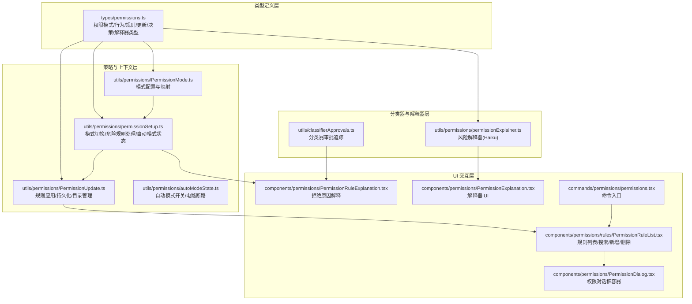
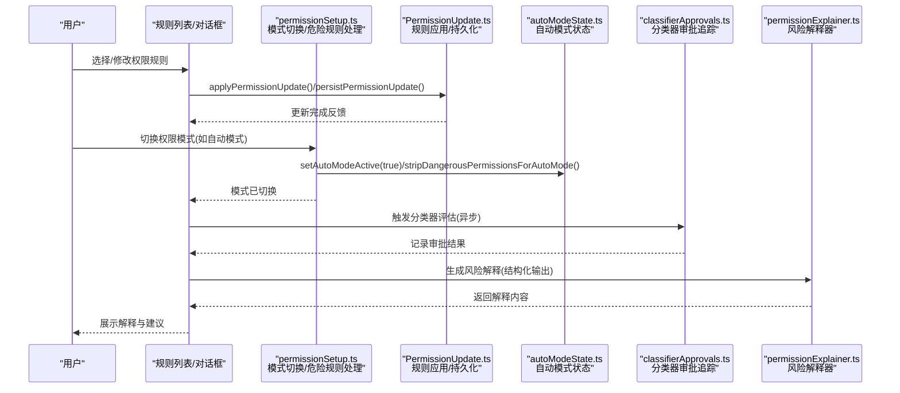
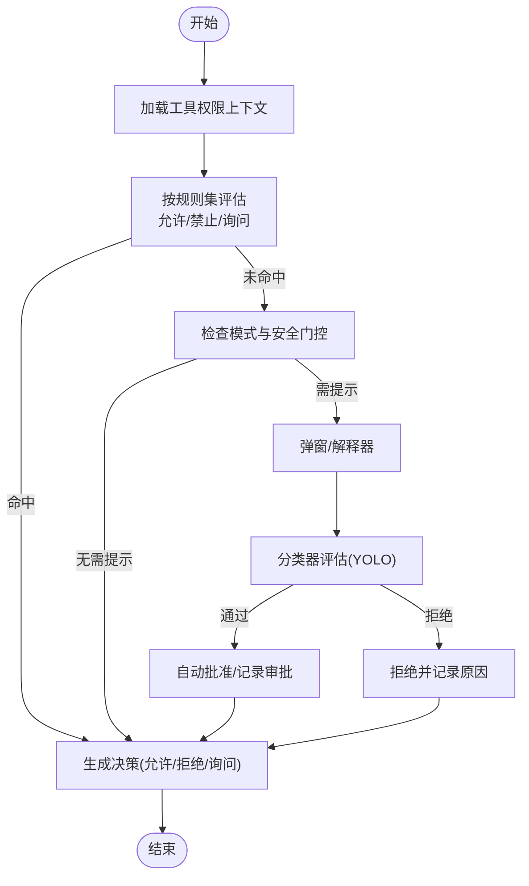
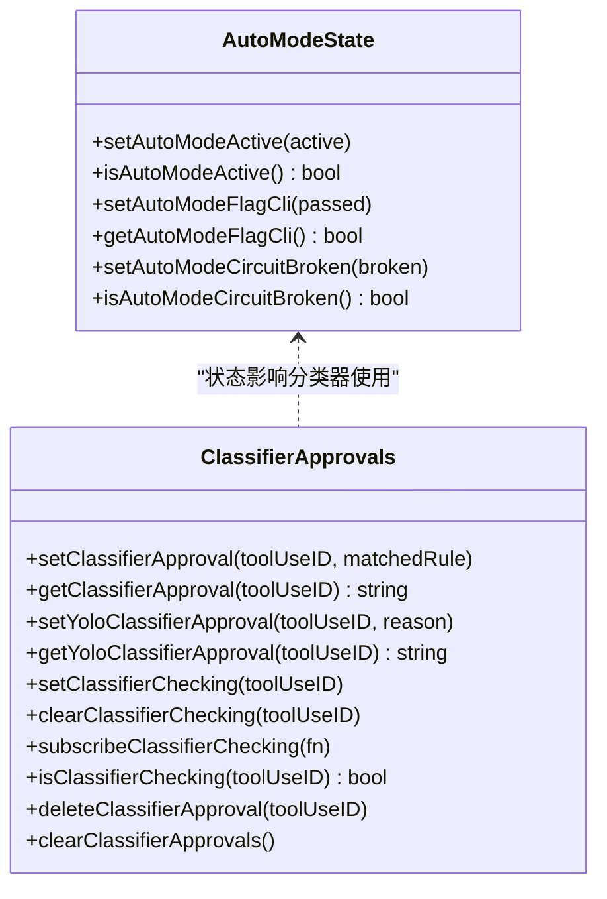
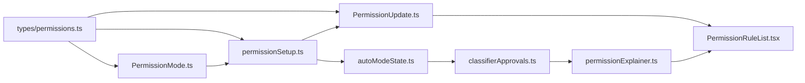

# 权限控制系统

<cite>
**本文档引用的文件**
- [types/permissions.ts](file://types/permissions.ts)
- [utils/permissions/PermissionMode.ts](file://utils/permissions/PermissionMode.ts)
- [utils/permissions/permissionSetup.ts](file://utils/permissions/permissionSetup.ts)
- [utils/permissions/PermissionUpdate.ts](file://utils/permissions/PermissionUpdate.ts)
- [utils/permissions/autoModeState.ts](file://utils/permissions/autoModeState.ts)
- [utils/classifierApprovals.ts](file://utils/classifierApprovals.ts)
- [utils/permissions/permissionExplainer.ts](file://utils/permissions/permissionExplainer.ts)
- [components/permissions/PermissionDialog.tsx](file://components/permissions/PermissionDialog.tsx)
- [components/permissions/PermissionRuleExplanation.tsx](file://components/permissions/PermissionRuleExplanation.tsx)
- [components/permissions/PermissionExplanation.tsx](file://components/permissions/PermissionExplanation.tsx)
- [components/permissions/rules/PermissionRuleList.tsx](file://components/permissions/rules/PermissionRuleList.tsx)
- [commands/permissions/permissions.tsx](file://commands/permissions/permissions.tsx)
</cite>

## 目录
1. [简介](#简介)
2. [项目结构](#项目结构)
3. [核心组件](#核心组件)
4. [架构总览](#架构总览)
5. [详细组件分析](#详细组件分析)
6. [依赖关系分析](#依赖关系分析)
7. [性能考虑](#性能考虑)
8. [故障排除指南](#故障排除指南)
9. [结论](#结论)

## 简介
本文件系统性阐述 Claude Code 的权限控制系统，覆盖三种权限模式（默认、自动、绕过）的工作原理与适用场景；路径保护机制、工具风险评估与安全检查流程；基于机器学习的自动审批系统与 YOLO 分类器的工作原理；权限规则配置与自定义规则创建指南；安全最佳实践与常见攻击防护；权限解释器工作机制与用户教育功能；以及权限相关的故障排除与调试方法。

## 项目结构
权限控制体系由“类型定义层”“策略与上下文层”“UI 交互层”“分类器与解释器层”四部分组成：
- 类型定义层：统一描述权限模式、行为、规则、更新、决策与解释等核心类型，确保跨模块一致性。
- 策略与上下文层：负责模式切换、危险规则识别与清理、自动模式状态管理、规则持久化与应用。
- UI 交互层：提供权限规则列表、对话框、解释器 UI、拒绝原因解释等交互组件。
- 分类器与解释器层：提供自动模式分类器（YOLO）、风险解释器（Haiku 结构化输出），支持异步评估与可视化解释。

图表来源
- [types/permissions.ts:1-442](file://types/permissions.ts#L1-L442)
- [utils/permissions/PermissionMode.ts:1-142](file://utils/permissions/PermissionMode.ts#L1-L142)
- [utils/permissions/permissionSetup.ts:1-800](file://utils/permissions/permissionSetup.ts#L1-L800)
- [utils/permissions/PermissionUpdate.ts:1-390](file://utils/permissions/PermissionUpdate.ts#L1-L390)
- [utils/permissions/autoModeState.ts:1-40](file://utils/permissions/autoModeState.ts#L1-L40)
- [utils/classifierApprovals.ts:1-89](file://utils/classifierApprovals.ts#L1-L89)
- [utils/permissions/permissionExplainer.ts:1-251](file://utils/permissions/permissionExplainer.ts#L1-L251)
- [components/permissions/PermissionDialog.tsx:1-72](file://components/permissions/PermissionDialog.tsx#L1-L72)
- [components/permissions/PermissionRuleExplanation.tsx:1-121](file://components/permissions/PermissionRuleExplanation.tsx#L1-L121)
- [components/permissions/PermissionExplanation.tsx:1-272](file://components/permissions/PermissionExplanation.tsx#L1-L272)
- [components/permissions/rules/PermissionRuleList.tsx:1-800](file://components/permissions/rules/PermissionRuleList.tsx#L1-L800)
- [commands/permissions/permissions.tsx:1-10](file://commands/permissions/permissions.tsx#L1-L10)

章节来源
- [types/permissions.ts:1-442](file://types/permissions.ts#L1-L442)
- [utils/permissions/PermissionMode.ts:1-142](file://utils/permissions/PermissionMode.ts#L1-L142)
- [utils/permissions/permissionSetup.ts:1-800](file://utils/permissions/permissionSetup.ts#L1-L800)
- [utils/permissions/PermissionUpdate.ts:1-390](file://utils/permissions/PermissionUpdate.ts#L1-L390)
- [utils/permissions/autoModeState.ts:1-40](file://utils/permissions/autoModeState.ts#L1-L40)
- [utils/classifierApprovals.ts:1-89](file://utils/classifierApprovals.ts#L1-L89)
- [utils/permissions/permissionExplainer.ts:1-251](file://utils/permissions/permissionExplainer.ts#L1-L251)
- [components/permissions/PermissionDialog.tsx:1-72](file://components/permissions/PermissionDialog.tsx#L1-L72)
- [components/permissions/PermissionRuleExplanation.tsx:1-121](file://components/permissions/PermissionRuleExplanation.tsx#L1-L121)
- [components/permissions/PermissionExplanation.tsx:1-272](file://components/permissions/PermissionExplanation.tsx#L1-L272)
- [components/permissions/rules/PermissionRuleList.tsx:1-800](file://components/permissions/rules/PermissionRuleList.tsx#L1-L800)
- [commands/permissions/permissions.tsx:1-10](file://commands/permissions/permissions.tsx#L1-L10)

## 核心组件
- 权限模式与配置
  - 模式枚举与外部模式映射：支持默认、计划模式、接受编辑、绕过权限、不询问、自动模式（受特性开关控制）。
  - 模式标题、符号、颜色与外部模式转换，用于 UI 展示与策略选择。
- 工具权限上下文
  - 包含当前模式、额外工作目录、三类规则集合（始终允许/禁止/询问）、是否可用绕过模式、危险规则剥离状态等。
- 规则与更新
  - 规则值、来源、行为（允许/禁止/询问）；支持添加、替换、移除规则与目录；持久化到用户/项目/本地设置或会话。
- 自动模式与分类器
  - 自动模式状态管理（激活/退出、电路断路）；危险规则剥离与恢复；YOLO 分类器审批追踪；风险解释器（结构化输出）。
- UI 与交互
  - 权限对话框容器、规则解释、解释器 UI、规则列表（搜索、新增、删除、工作区目录管理）。

章节来源
- [types/permissions.ts:16-141](file://types/permissions.ts#L16-L141)
- [utils/permissions/PermissionMode.ts:42-141](file://utils/permissions/PermissionMode.ts#L42-L141)
- [utils/permissions/permissionSetup.ts:505-579](file://utils/permissions/permissionSetup.ts#L505-L579)
- [utils/permissions/PermissionUpdate.ts:55-206](file://utils/permissions/PermissionUpdate.ts#L55-L206)
- [utils/permissions/autoModeState.ts:11-33](file://utils/permissions/autoModeState.ts#L11-L33)
- [utils/classifierApprovals.ts:19-88](file://utils/classifierApprovals.ts#L19-L88)
- [utils/permissions/permissionExplainer.ts:139-250](file://utils/permissions/permissionExplainer.ts#L139-L250)
- [components/permissions/PermissionDialog.tsx:17-71](file://components/permissions/PermissionDialog.tsx#L17-L71)
- [components/permissions/PermissionRuleExplanation.tsx:21-66](file://components/permissions/PermissionRuleExplanation.tsx#L21-L66)
- [components/permissions/PermissionExplanation.tsx:92-146](file://components/permissions/PermissionExplanation.tsx#L92-L146)
- [components/permissions/rules/PermissionRuleList.tsx:473-800](file://components/permissions/rules/PermissionRuleList.tsx#L473-L800)

## 架构总览
权限系统以“类型定义—策略上下文—UI 交互—分类器解释器”的分层架构运行。模式切换通过统一入口进行，危险规则在进入自动模式时被剥离并在退出时恢复；规则变更通过更新操作应用并可持久化；分类器与解释器提供非阻塞的安全评估与风险解释能力。

图表来源
- [utils/permissions/permissionSetup.ts:597-646](file://utils/permissions/permissionSetup.ts#L597-L646)
- [utils/permissions/PermissionUpdate.ts:55-206](file://utils/permissions/PermissionUpdate.ts#L55-L206)
- [utils/permissions/autoModeState.ts:11-33](file://utils/permissions/autoModeState.ts#L11-L33)
- [utils/classifierApprovals.ts:19-88](file://utils/classifierApprovals.ts#L19-L88)
- [utils/permissions/permissionExplainer.ts:147-250](file://utils/permissions/permissionExplainer.ts#L147-L250)

## 详细组件分析

### 权限模式与适用场景
- 默认模式（default）
  - 行为：遵循规则与安全检查，必要时弹窗确认。
  - 适用：日常开发、对安全性要求较高的环境。
- 计划模式（plan）
  - 行为：暂停权限提示，便于规划阶段的连续操作；离开后恢复。
  - 适用：任务规划、批量操作准备阶段。
- 接受编辑（acceptEdits）
  - 行为：自动接受编辑类工具调用，减少交互。
  - 适用：编辑器集成、自动化编辑流程。
- 绕过权限（bypassPermissions）
  - 行为：跳过权限检查（受组织策略可能禁用）。
  - 适用：紧急情况或特定受信环境。
- 不询问（dontAsk）
  - 行为：直接执行允许的工具，不弹窗。
  - 适用：高度信任的自动化脚本。
- 自动模式（auto）
  - 行为：启用 YOLO 分类器进行非阻塞安全评估，敏感路径可交由分类器判断。
  - 适用：需要高吞吐与低交互的自动化场景。

章节来源
- [utils/permissions/PermissionMode.ts:42-91](file://utils/permissions/PermissionMode.ts#L42-L91)
- [utils/permissions/permissionSetup.ts:689-800](file://utils/permissions/permissionSetup.ts#L689-L800)

### 路径保护机制
- 额外工作目录
  - 通过“添加/移除目录”接口将工作范围扩展至指定路径，避免误触敏感区域。
- 危险规则识别与剥离
  - 对 Bash/PowerShell/Agent 等工具的危险规则进行识别（如通配符、解释器前缀、子代理等），在进入自动模式时剥离，并在退出时恢复。
- 安全检查门控
  - 在 CLI/设置/远程环境等入口处进行门控检查，防止绕过策略。

章节来源
- [utils/permissions/permissionSetup.ts:84-285](file://utils/permissions/permissionSetup.ts#L84-L285)
- [utils/permissions/PermissionUpdate.ts:122-183](file://utils/permissions/PermissionUpdate.ts#L122-L183)
- [components/permissions/rules/PermissionRuleList.tsx:78-120](file://components/permissions/rules/PermissionRuleList.tsx#L78-L120)

### 工具风险评估与安全检查流程
- 规则匹配优先级
  - 三类规则按“始终允许/禁止/询问”顺序评估，命中即终止后续检查。
- 模式驱动
  - 不同模式影响默认行为与提示频率。
- 分类器评估
  - 对敏感路径与高风险命令，触发 YOLO 分类器进行快速/思考两阶段评估，支持异步返回与自动批准。
- 拒绝原因解释
  - 提供“规则/钩子/安全检查/工作区/分类器”等多类型解释，帮助用户理解决策依据。

图表来源
- [types/permissions.ts:152-325](file://types/permissions.ts#L152-L325)
- [utils/permissions/permissionExplainer.ts:147-250](file://utils/permissions/permissionExplainer.ts#L147-L250)
- [utils/classifierApprovals.ts:19-88](file://utils/classifierApprovals.ts#L19-L88)

章节来源
- [types/permissions.ts:152-325](file://types/permissions.ts#L152-L325)
- [components/permissions/PermissionRuleExplanation.tsx:21-66](file://components/permissions/PermissionRuleExplanation.tsx#L21-L66)
- [utils/permissions/permissionExplainer.ts:147-250](file://utils/permissions/permissionExplainer.ts#L147-L250)

### ML 基于的自动审批系统与 YOLO 分类器
- 自动模式状态管理
  - 通过条件 require 特性开关控制模块加载；维护“活动状态/CLI 标记/电路断路”三态。
- YOLO 分类器
  - 支持快速与思考两阶段；记录请求 ID、消息 ID、令牌用量、耗时、提示长度等指标；支持“提示过长”回退策略。
- 审批追踪
  - 使用 Map/Set 与信号订阅跟踪审批与检查中的工具使用 ID，支持查询与清理。

图表来源
- [utils/permissions/autoModeState.ts:11-33](file://utils/permissions/autoModeState.ts#L11-L33)
- [utils/classifierApprovals.ts:19-88](file://utils/classifierApprovals.ts#L19-L88)

章节来源
- [utils/permissions/autoModeState.ts:1-40](file://utils/permissions/autoModeState.ts#L1-L40)
- [utils/classifierApprovals.ts:1-89](file://utils/classifierApprovals.ts#L1-L89)

### 权限规则配置与自定义规则创建
- 规则来源与目标
  - 来源：用户设置、项目设置、本地设置、会话、CLI 参数。
  - 目标：始终允许/禁止/询问三类规则集合。
- 规则值与解析
  - 规则值包含工具名与可选内容；解析器支持字符串与对象互转。
- 应用与持久化
  - 支持单条与批量更新；仅对可持久化来源写入设置文件。
- 工作区目录
  - 可添加/移除额外工作目录，提升权限范围可控性。

章节来源
- [types/permissions.ts:54-146](file://types/permissions.ts#L54-L146)
- [utils/permissions/PermissionUpdate.ts:30-206](file://utils/permissions/PermissionUpdate.ts#L30-L206)
- [components/permissions/rules/PermissionRuleList.tsx:78-120](file://components/permissions/rules/PermissionRuleList.tsx#L78-L120)

### 权限解释器与用户教育
- 解释器能力
  - 基于主循环模型的结构化输出工具，生成“解释/理由/风险/风险等级”，并记录分析事件与延迟。
- UI 展示
  - 通过快捷键触发，懒加载请求，支持闪烁动画与错误兜底。
- 决策解释
  - 针对不同决策类型（规则/钩子/安全检查/工作区/分类器）提供可读解释与引导。

章节来源
- [utils/permissions/permissionExplainer.ts:46-250](file://utils/permissions/permissionExplainer.ts#L46-L250)
- [components/permissions/PermissionExplanation.tsx:92-146](file://components/permissions/PermissionExplanation.tsx#L92-L146)
- [components/permissions/PermissionRuleExplanation.tsx:21-66](file://components/permissions/PermissionRuleExplanation.tsx#L21-L66)

### 权限系统的安全最佳实践与常见攻击防护
- 最佳实践
  - 优先使用“默认模式+明确规则”，最小权限原则；定期审查规则与解释器输出。
  - 远程环境限制“绕过权限”模式；启用自动模式前进行危险规则剥离。
- 常见攻击与防护
  - 通配符与解释器前缀滥用：通过危险规则识别与剥离阻止。
  - 子代理/嵌套执行：禁止 Agent 允许规则，防止委托攻击。
  - 跨平台路径绕过：结合安全检查与分类器，对敏感路径采用分类器判定。

章节来源
- [utils/permissions/permissionSetup.ts:84-285](file://utils/permissions/permissionSetup.ts#L84-L285)
- [utils/permissions/permissionExplainer.ts:139-141](file://utils/permissions/permissionExplainer.ts#L139-L141)

## 依赖关系分析
- 模块耦合
  - 类型定义集中于 types/permissions.ts，其他模块仅依赖类型，降低循环依赖风险。
  - 策略层与 UI 层通过统一的上下文与更新接口解耦。
- 外部依赖
  - 分类器与解释器依赖主循环模型与侧向查询工具；状态管理依赖特性开关与信号订阅。

图表来源
- [types/permissions.ts:1-442](file://types/permissions.ts#L1-L442)
- [utils/permissions/PermissionMode.ts:1-142](file://utils/permissions/PermissionMode.ts#L1-L142)
- [utils/permissions/permissionSetup.ts:1-800](file://utils/permissions/permissionSetup.ts#L1-L800)
- [utils/permissions/PermissionUpdate.ts:1-390](file://utils/permissions/PermissionUpdate.ts#L1-L390)
- [utils/permissions/autoModeState.ts:1-40](file://utils/permissions/autoModeState.ts#L1-L40)
- [utils/classifierApprovals.ts:1-89](file://utils/classifierApprovals.ts#L1-L89)
- [utils/permissions/permissionExplainer.ts:1-251](file://utils/permissions/permissionExplainer.ts#L1-L251)
- [components/permissions/rules/PermissionRuleList.tsx:1-800](file://components/permissions/rules/PermissionRuleList.tsx#L1-L800)

章节来源
- [types/permissions.ts:1-442](file://types/permissions.ts#L1-L442)
- [utils/permissions/PermissionMode.ts:1-142](file://utils/permissions/PermissionMode.ts#L1-L142)
- [utils/permissions/permissionSetup.ts:1-800](file://utils/permissions/permissionSetup.ts#L1-L800)
- [utils/permissions/PermissionUpdate.ts:1-390](file://utils/permissions/PermissionUpdate.ts#L1-L390)
- [utils/permissions/autoModeState.ts:1-40](file://utils/permissions/autoModeState.ts#L1-L40)
- [utils/classifierApprovals.ts:1-89](file://utils/classifierApprovals.ts#L1-L89)
- [utils/permissions/permissionExplainer.ts:1-251](file://utils/permissions/permissionExplainer.ts#L1-L251)
- [components/permissions/rules/PermissionRuleList.tsx:1-800](file://components/permissions/rules/PermissionRuleList.tsx#L1-L800)

## 性能考虑
- 异步分类器评估
  - 通过“待评估分类器检查”与信号订阅实现非阻塞评估，避免 UI 卡顿。
- 结构化输出与缓存
  - 解释器强制工具调用与结构化解析，减少后处理成本；缓存与断路器避免重复评估。
- 规则应用批量化
  - 批量应用与持久化减少 IO 次数，提升响应速度。

## 故障排除指南
- 模式切换失败
  - 检查自动模式门控状态与电路断路标记；确认危险规则剥离/恢复流程正确执行。
- 规则未生效
  - 确认规则来源与目标持久化位置；核对规则字符串解析与规范化。
- 分类器无响应
  - 检查工具使用 ID 是否在“检查中”集合；查看审批追踪与错误日志。
- 解释器不可用
  - 确认解释器功能开关与网络状态；查看错误事件与延迟指标。

章节来源
- [utils/permissions/permissionSetup.ts:597-646](file://utils/permissions/permissionSetup.ts#L597-L646)
- [utils/permissions/PermissionUpdate.ts:222-342](file://utils/permissions/PermissionUpdate.ts#L222-L342)
- [utils/classifierApprovals.ts:62-88](file://utils/classifierApprovals.ts#L62-L88)
- [utils/permissions/permissionExplainer.ts:229-250](file://utils/permissions/permissionExplainer.ts#L229-L250)

## 结论
该权限控制系统通过清晰的模式抽象、严格的危险规则治理、可解释的风险评估与非阻塞的自动审批，实现了在保证安全的前提下提升自动化效率的目标。配合完善的 UI 与解释器，既满足高级用户的精细控制需求，也为普通用户提供良好的安全教育体验。建议在生产环境中结合组织策略严格启用自动模式，并定期审计规则与解释器输出，持续优化安全与效率平衡。