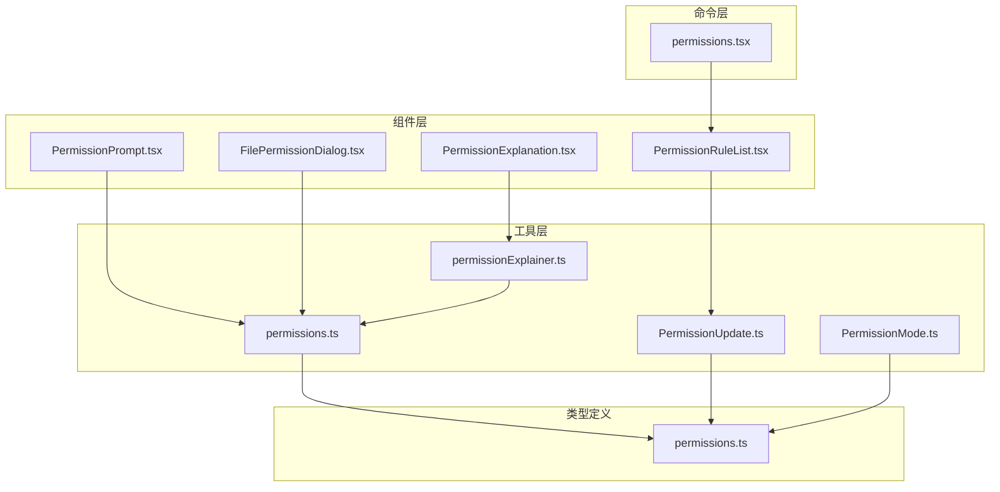
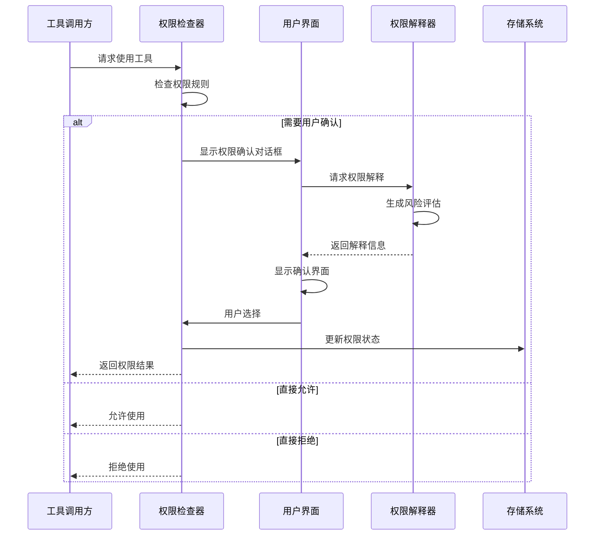
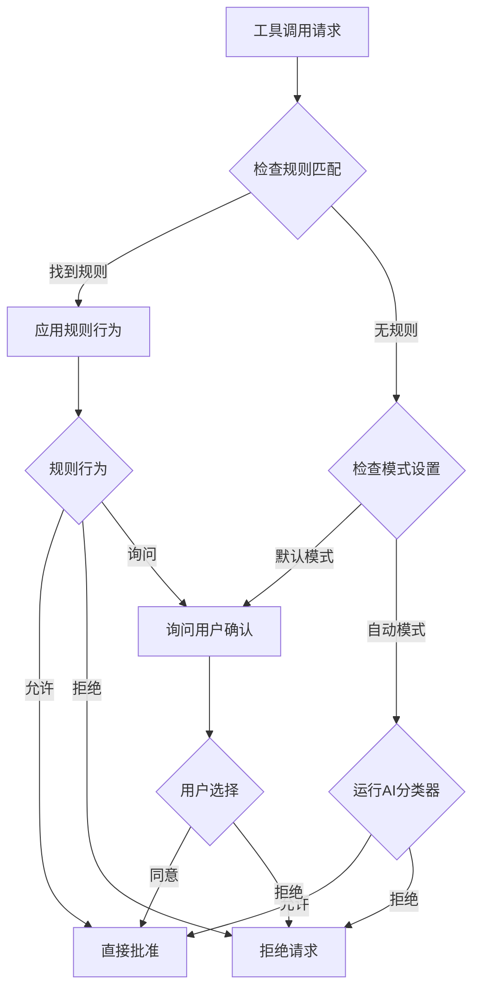
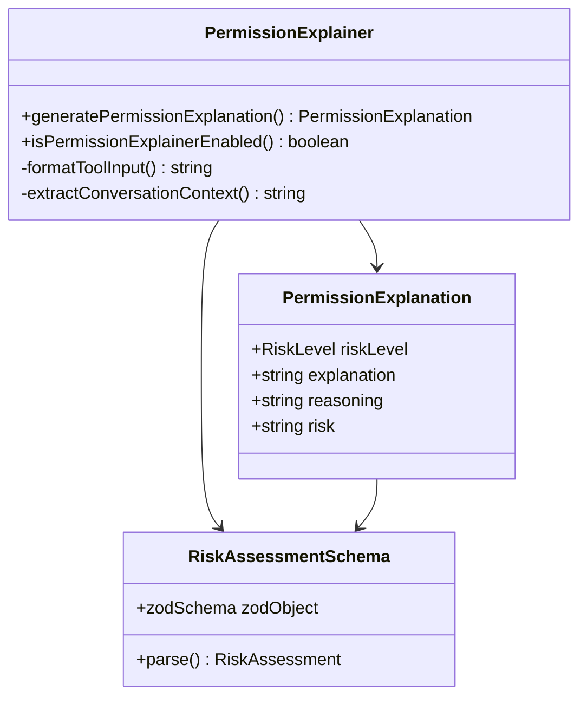
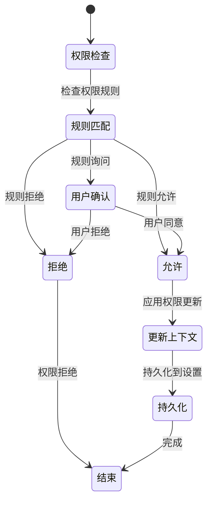
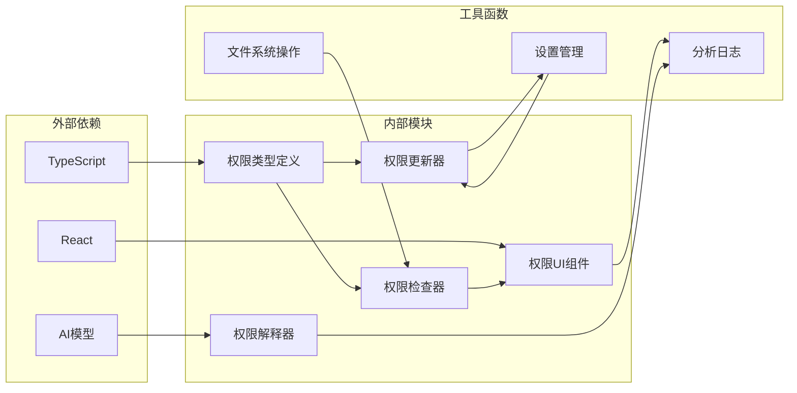

# 权限提示系统

<cite>
**本文档引用的文件**
- [PermissionPrompt.tsx](file://components/permissions/PermissionPrompt.tsx)
- [PermissionRuleList.tsx](file://components/permissions/rules/PermissionRuleList.tsx)
- [permissionExplainer.ts](file://utils/permissions/permissionExplainer.ts)
- [PermissionExplanation.tsx](file://components/permissions/PermissionExplanation.tsx)
- [permissions.ts](file://utils/permissions/permissions.ts)
- [PermissionUpdate.ts](file://utils/permissions/PermissionUpdate.ts)
- [PermissionMode.ts](file://utils/permissions/PermissionMode.ts)
- [permissions.ts](file://types/permissions.ts)
- [permissions.tsx](file://commands/permissions/permissions.tsx)
- [FilePermissionDialog.tsx](file://components/permissions/FilePermissionDialog/FilePermissionDialog.tsx)
- [shellPermissionHelpers.tsx](file://components/permissions/shellPermissionHelpers.tsx)
- [permissionLogging.ts](file://hooks/toolPermission/permissionLogging.ts)
- [PermissionContext.ts](file://hooks/toolPermission/PermissionContext.ts)
</cite>

## 目录
1. [简介](#简介)
2. [项目结构](#项目结构)
3. [核心组件](#核心组件)
4. [架构概览](#架构概览)
5. [详细组件分析](#详细组件分析)
6. [依赖关系分析](#依赖关系分析)
7. [性能考虑](#性能考虑)
8. [故障排除指南](#故障排除指南)
9. [结论](#结论)

## 简介

权限提示系统是 Claude Code 中用于管理工具使用权限的核心模块。该系统通过智能的权限检查、用户友好的交互界面和强大的风险评估功能，为开发者提供安全可控的工具使用体验。

系统主要功能包括：
- 智能权限决策和风险评估
- 用户友好的权限确认界面
- 可定制的权限规则管理
- 完整的权限历史追踪
- AI驱动的权限解释器
- 多层次的安全防护机制

## 项目结构

权限提示系统采用模块化架构，主要分布在以下目录中：

**图表来源**
- [PermissionPrompt.tsx:1-336](file://components/permissions/PermissionPrompt.tsx#L1-336)
- [PermissionRuleList.tsx:1-800](file://components/permissions/rules/PermissionRuleList.tsx#L1-800)
- [permissionExplainer.ts:1-251](file://utils/permissions/permissionExplainer.ts#L1-251)

**章节来源**
- [PermissionPrompt.tsx:1-336](file://components/permissions/PermissionPrompt.tsx#L1-336)
- [PermissionRuleList.tsx:1-800](file://components/permissions/rules/PermissionRuleList.tsx#L1-800)

## 核心组件

### 权限提示组件

PermissionPrompt 是权限确认的核心组件，提供了灵活的用户交互界面：

- **反馈输入支持**：支持接受和拒绝两种类型的用户反馈
- **键盘快捷键**：集成完整的键盘导航和快捷键支持
- **动态选项处理**：根据用户选择动态切换输入模式
- **分析事件记录**：完整记录用户交互行为用于分析

### 权限规则管理

PermissionRuleList 提供了完整的权限规则管理界面：

- **多标签页管理**：允许、拒绝、询问三种规则类型的独立管理
- **搜索和过滤**：支持规则的快速搜索和筛选
- **批量操作**：支持规则的添加、删除和修改
- **冲突检测**：自动检测和警告潜在的规则冲突

### 权限解释器

permissionExplainer 和 PermissionExplanation 组件提供了AI驱动的权限解释功能：

- **风险评估**：对权限请求进行风险等级评估
- **自然语言解释**：以人类可理解的方式解释权限请求
- **上下文关联**：结合对话历史提供更准确的解释
- **延迟加载**：仅在用户需要时才加载解释内容

**章节来源**
- [PermissionPrompt.tsx:35-74](file://components/permissions/PermissionPrompt.tsx#L35-74)
- [PermissionRuleList.tsx:464-472](file://components/permissions/rules/PermissionRuleList.tsx#L464-472)
- [permissionExplainer.ts:28-33](file://utils/permissions/permissionExplainer.ts#L28-33)

## 架构概览

权限提示系统采用分层架构设计，确保了良好的模块分离和可维护性：

**图表来源**
- [permissions.ts:473-800](file://utils/permissions/permissions.ts#L473-800)
- [permissionExplainer.ts:147-250](file://utils/permissions/permissionExplainer.ts#L147-250)

## 详细组件分析

### 权限检查流程

权限检查系统实现了多层次的安全验证机制：

**图表来源**
- [permissions.ts:473-800](file://utils/permissions/permissions.ts#L473-800)

### 权限解释器工作原理

权限解释器通过AI模型提供智能的权限解释服务：

**图表来源**
- [permissionExplainer.ts:28-84](file://utils/permissions/permissionExplainer.ts#L28-84)
- [PermissionExplanation.tsx:61-71](file://components/permissions/PermissionExplanation.tsx#L61-71)

**章节来源**
- [permissionExplainer.ts:147-250](file://utils/permissions/permissionExplainer.ts#L147-250)
- [PermissionExplanation.tsx:77-85](file://components/permissions/PermissionExplanation.tsx#L77-85)

### 权限更新机制

系统提供了完整的权限更新和持久化机制：

**图表来源**
- [PermissionUpdate.ts:55-206](file://utils/permissions/PermissionUpdate.ts#L55-206)

**章节来源**
- [PermissionUpdate.ts:208-342](file://utils/permissions/PermissionUpdate.ts#L208-342)

### 权限模式系统

系统支持多种权限模式，每种模式都有特定的行为特征：

| 模式 | 符号 | 颜色 | 行为描述 |
|------|------|------|----------|
| 默认模式 |  | text | 标准权限检查，需要用户确认 |
| 计划模式 | ⏵ | planMode | 计划模式下的特殊权限处理 |
| 接受编辑 | ⏵ | autoAccept | 自动接受编辑类操作 |
| 跳过权限 | ⏵ | error | 跳过权限检查，高风险 |
| 不询问 | ⏵ | error | 直接拒绝，不显示确认 |

**章节来源**
- [PermissionMode.ts:34-91](file://utils/permissions/PermissionMode.ts#L34-91)

## 依赖关系分析

权限提示系统具有清晰的依赖关系，避免了循环依赖问题：

**图表来源**
- [permissions.ts:1-442](file://types/permissions.ts#L1-442)
- [permissions.ts:1-100](file://utils/permissions/permissions.ts#L1-100)

**章节来源**
- [permissions.ts:16-441](file://types/permissions.ts#L16-441)

## 性能考虑

权限提示系统在设计时充分考虑了性能优化：

### 缓存策略
- **规则缓存**：权限规则在内存中缓存，避免重复解析
- **解释器缓存**：权限解释结果缓存，减少AI调用次数
- **UI状态缓存**：用户界面状态优化，减少重渲染

### 异步处理
- **非阻塞AI调用**：权限解释通过异步方式处理
- **延迟加载**：仅在用户需要时加载解释内容
- **并发处理**：多个权限请求可以并行处理

### 内存管理
- **垃圾回收优化**：及时清理不再使用的权限状态
- **状态最小化**：只保存必要的权限相关信息
- **资源释放**：正确释放AI模型和网络连接资源

## 故障排除指南

### 常见问题及解决方案

**权限确认对话框不显示**
- 检查权限模式设置是否正确
- 确认用户界面组件正常加载
- 验证权限规则配置

**权限解释器无法加载**
- 检查AI模型可用性
- 验证网络连接状态
- 确认API密钥配置正确

**权限更新失败**
- 检查设置文件权限
- 验证权限规则语法
- 确认目标设置源存在

**章节来源**
- [permissionLogging.ts:59-104](file://hooks/toolPermission/permissionLogging.ts#L59-104)

### 调试工具

系统提供了完善的调试和监控功能：

- **分析事件记录**：完整记录权限相关事件
- **错误日志**：详细的错误信息和堆栈跟踪
- **性能指标**：权限检查的响应时间和成功率
- **用户行为分析**：权限确认的用户偏好和模式

## 结论

Claude Code 的权限提示系统通过精心设计的架构和丰富的功能特性，为用户提供了安全、直观且高效的权限管理体验。系统不仅具备强大的安全防护能力，还注重用户体验和易用性，是现代开发工具中权限管理系统的一个优秀范例。

系统的主要优势包括：
- **多层次安全防护**：从规则检查到AI分类器的多重保护
- **智能用户交互**：直观的界面设计和智能的权限解释
- **高度可定制**：灵活的权限规则和模式配置
- **完整追踪能力**：详细的权限历史和分析报告
- **优秀的性能表现**：优化的算法和缓存策略

通过持续的优化和改进，权限提示系统将继续为用户提供更好的安全性和便利性平衡。