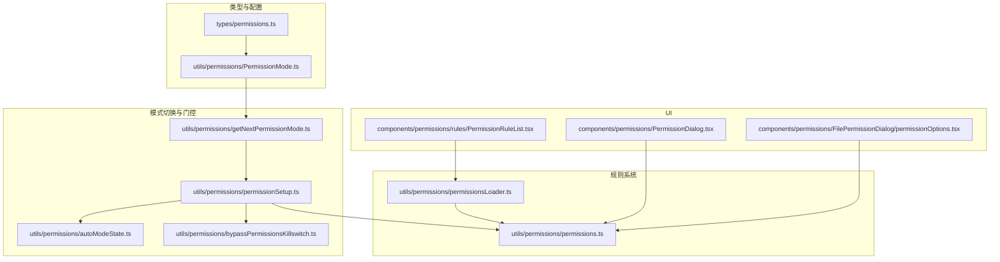
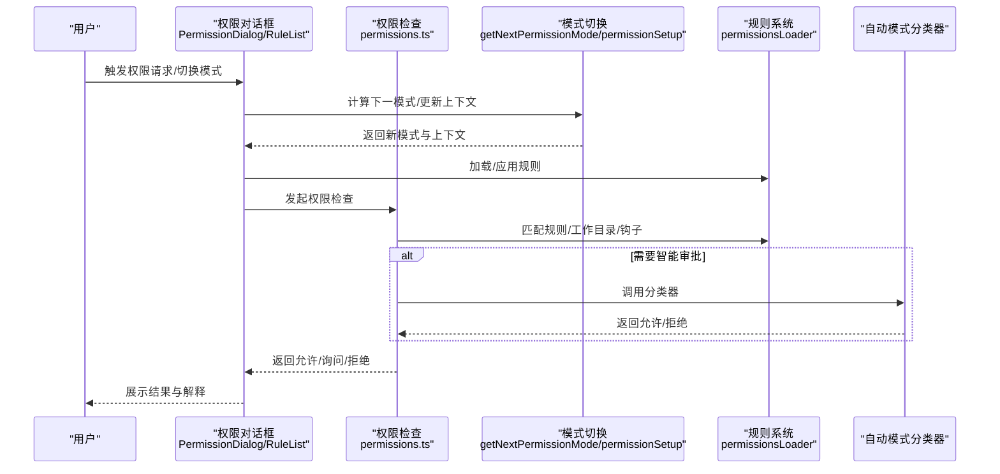
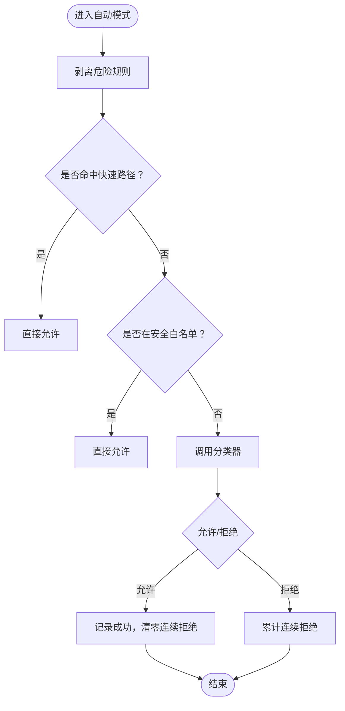
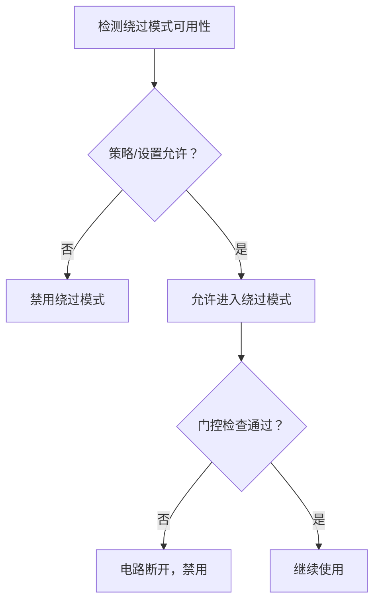
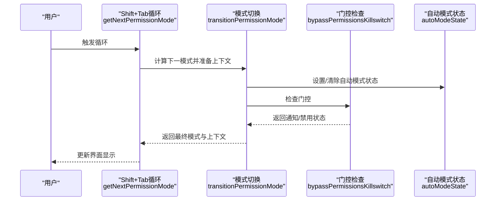
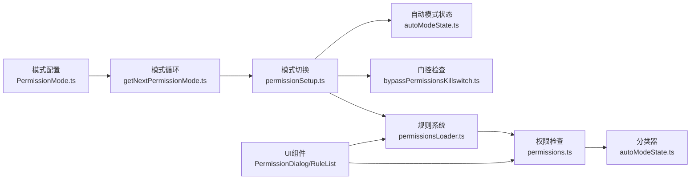

# 权限模式

<cite>
**本文引用的文件**
- [types/permissions.ts](file://types/permissions.ts)
- [utils/permissions/PermissionMode.ts](file://utils/permissions/PermissionMode.ts)
- [utils/permissions/getNextPermissionMode.ts](file://utils/permissions/getNextPermissionMode.ts)
- [utils/permissions/autoModeState.ts](file://utils/permissions/autoModeState.ts)
- [utils/permissions/bypassPermissionsKillswitch.ts](file://utils/permissions/bypassPermissionsKillswitch.ts)
- [utils/permissions/permissionSetup.ts](file://utils/permissions/permissionSetup.ts)
- [utils/permissions/permissionsLoader.ts](file://utils/permissions/permissionsLoader.ts)
- [utils/permissions/permissions.ts](file://utils/permissions/permissions.ts)
- [utils/permissions/permissionExplainer.ts](file://utils/permissions/permissionExplainer.ts)
- [components/permissions/FilePermissionDialog/permissionOptions.tsx](file://components/permissions/FilePermissionDialog/permissionOptions.tsx)
- [components/permissions/PermissionDialog.tsx](file://components/permissions/PermissionDialog.tsx)
- [components/permissions/rules/PermissionRuleList.tsx](file://components/permissions/rules/PermissionRuleList.tsx)
- [commands/permissions/permissions.tsx](file://commands/permissions/permissions.tsx)
</cite>

## 目录
1. [简介](#简介)
2. [项目结构](#项目结构)
3. [核心组件](#核心组件)
4. [架构总览](#架构总览)
5. [详细组件分析](#详细组件分析)
6. [依赖关系分析](#依赖关系分析)
7. [性能考量](#性能考量)
8. [故障排查指南](#故障排查指南)
9. [结论](#结论)
10. [附录](#附录)

## 简介
本文件系统性阐述 Claude Code 的权限模式体系，聚焦三种核心模式：默认模式（Default）、自动模式（Auto）、绕过模式（Bypass）。文档从架构设计、数据流、处理逻辑、集成点与错误处理等维度进行深入解析，并提供模式切换机制、状态管理、最佳实践与安全建议，帮助用户在不同场景下做出合理选择。

## 项目结构
权限模式相关代码主要分布在以下模块：
- 类型定义与模式枚举：types/permissions.ts
- 模式配置与标题映射：utils/permissions/PermissionMode.ts
- 模式循环与切换：utils/permissions/getNextPermissionMode.ts、utils/permissions/permissionSetup.ts
- 自动模式状态与门控：utils/permissions/autoModeState.ts、utils/permissions/bypassPermissionsKillswitch.ts
- 规则加载与持久化：utils/permissions/permissionsLoader.ts
- 权限检查与决策：utils/permissions/permissions.ts
- 权限解释器（风险说明）：utils/permissions/permissionExplainer.ts
- UI 对话框与规则列表：components/permissions/.../*.tsx

图表来源
- [types/permissions.ts:1-442](file://types/permissions.ts#L1-L442)
- [utils/permissions/PermissionMode.ts:1-142](file://utils/permissions/PermissionMode.ts#L1-L142)
- [utils/permissions/getNextPermissionMode.ts:1-102](file://utils/permissions/getNextPermissionMode.ts#L1-L102)
- [utils/permissions/permissionSetup.ts:1-800](file://utils/permissions/permissionSetup.ts#L1-L800)
- [utils/permissions/autoModeState.ts:1-40](file://utils/permissions/autoModeState.ts#L1-L40)
- [utils/permissions/bypassPermissionsKillswitch.ts:1-156](file://utils/permissions/bypassPermissionsKillswitch.ts#L1-L156)
- [utils/permissions/permissionsLoader.ts:1-297](file://utils/permissions/permissionsLoader.ts#L1-L297)
- [utils/permissions/permissions.ts:1-800](file://utils/permissions/permissions.ts#L1-L800)
- [components/permissions/PermissionDialog.tsx:1-72](file://components/permissions/PermissionDialog.tsx#L1-L72)
- [components/permissions/rules/PermissionRuleList.tsx:1-800](file://components/permissions/rules/PermissionRuleList.tsx#L1-L800)
- [components/permissions/FilePermissionDialog/permissionOptions.tsx:1-177](file://components/permissions/FilePermissionDialog/permissionOptions.tsx#L1-L177)

章节来源
- [types/permissions.ts:1-442](file://types/permissions.ts#L1-L442)
- [utils/permissions/PermissionMode.ts:1-142](file://utils/permissions/PermissionMode.ts#L1-L142)

## 核心组件
- 权限模式枚举与外部模式映射：定义了可选模式集合及对外暴露的模式集合，并提供模式标题、颜色、符号等元信息。
- 模式循环与切换：根据当前模式与上下文，计算下一个模式；并执行进入/退出模式时的状态清理与危险规则剥离。
- 自动模式门控与状态：记录自动模式可用性、是否已激活、电路断开状态；并在合适时机禁用自动模式或绕过模式。
- 规则加载与持久化：从多源设置中加载规则，支持仅允许受管规则、添加/删除规则、去重与规范化。
- 权限检查与决策：综合规则、模式、分类器、钩子、工作目录等，生成允许/询问/拒绝的决策结果。
- 权限解释器：基于模型对工具调用生成风险等级、解释与理由，辅助用户理解权限请求背景。

章节来源
- [utils/permissions/PermissionMode.ts:1-142](file://utils/permissions/PermissionMode.ts#L1-L142)
- [utils/permissions/getNextPermissionMode.ts:1-102](file://utils/permissions/getNextPermissionMode.ts#L1-L102)
- [utils/permissions/permissionSetup.ts:1-800](file://utils/permissions/permissionSetup.ts#L1-L800)
- [utils/permissions/permissionsLoader.ts:1-297](file://utils/permissions/permissionsLoader.ts#L1-L297)
- [utils/permissions/permissions.ts:1-800](file://utils/permissions/permissions.ts#L1-L800)
- [utils/permissions/permissionExplainer.ts:1-251](file://utils/permissions/permissionExplainer.ts#L1-L251)

## 架构总览
权限模式系统围绕“模式 + 规则 + 决策 + UI”展开，形成闭环：
- 模式层：决定整体安全策略与交互方式（默认/自动/绕过/计划/接受编辑/不询问等）
- 规则层：按来源聚合 allow/deny/ask 规则，支持受管规则优先
- 决策层：在工具调用前综合评估，必要时触发分类器或钩子
- UI 层：展示权限请求、解释、规则列表与操作选项

图表来源
- [utils/permissions/getNextPermissionMode.ts:1-102](file://utils/permissions/getNextPermissionMode.ts#L1-L102)
- [utils/permissions/permissionSetup.ts:1-800](file://utils/permissions/permissionSetup.ts#L1-L800)
- [utils/permissions/permissions.ts:1-800](file://utils/permissions/permissions.ts#L1-L800)
- [utils/permissions/permissionsLoader.ts:1-297](file://utils/permissions/permissionsLoader.ts#L1-L297)
- [utils/permissions/permissionExplainer.ts:1-251](file://utils/permissions/permissionExplainer.ts#L1-L251)

## 详细组件分析

### 默认模式（Default）
- 安全定位：严格遵循规则与工作目录限制，无自动放行路径
- 行为特征：
  - 严格匹配规则，优先 deny > ask > allow
  - 不启用自动模式分类器
  - 支持“不要询问”模式（dontAsk）将 ask 强制转为 deny
- 适用场景：生产环境、高风险项目、合规要求严格的组织
- 使用限制：无法绕过规则；对复杂命令需明确规则或交互确认

章节来源
- [utils/permissions/permissions.ts:503-518](file://utils/permissions/permissions.ts#L503-L518)
- [utils/permissions/permissionsLoader.ts:120-133](file://utils/permissions/permissionsLoader.ts#L120-L133)

### 自动模式（Auto）
- 安全定位：智能化审批，通过分类器对动作进行快速判定
- 工作原理：
  - 进入自动模式时剥离危险规则（如 Bash(*)、PowerShell(*)、Agent(*) 等），确保分类器能有效评估
  - 在 ask 分支中尝试 acceptEdits 快速路径与安全工具白名单，避免不必要的分类器调用
  - 对 PowerShell 在特定构建条件下仍要求交互确认
  - 记录连续拒绝次数，成功后清零
- 适用场景：日常开发、批量脚本、CI/CD 环境
- 使用限制：需满足门控条件（组织策略、模型支持、电路断开状态）

图表来源
- [utils/permissions/permissionSetup.ts:505-580](file://utils/permissions/permissionSetup.ts#L505-L580)
- [utils/permissions/permissions.ts:593-686](file://utils/permissions/permissions.ts#L593-L686)
- [utils/permissions/autoModeState.ts:1-40](file://utils/permissions/autoModeState.ts#L1-L40)

章节来源
- [utils/permissions/permissionSetup.ts:505-646](file://utils/permissions/permissionSetup.ts#L505-L646)
- [utils/permissions/permissions.ts:593-800](file://utils/permissions/permissions.ts#L593-L800)
- [utils/permissions/autoModeState.ts:1-40](file://utils/permissions/autoModeState.ts#L1-L40)

### 绕过模式（Bypass）
- 安全定位：完全开放，绕过大部分权限检查
- 行为特征：
  - 可被组织策略或设置禁用
  - 启动时可能被门控检查禁用
  - 适合临时调试或紧急情况
- 适用场景：本地开发调试、紧急修复、受控沙箱环境
- 使用限制：高风险，不建议长期开启；组织可强制禁用

图表来源
- [utils/permissions/bypassPermissionsKillswitch.ts:19-47](file://utils/permissions/bypassPermissionsKillswitch.ts#L19-L47)
- [utils/permissions/permissionSetup.ts:698-796](file://utils/permissions/permissionSetup.ts#L698-L796)

章节来源
- [utils/permissions/bypassPermissionsKillswitch.ts:1-156](file://utils/permissions/bypassPermissionsKillswitch.ts#L1-L156)
- [utils/permissions/permissionSetup.ts:698-800](file://utils/permissions/permissionSetup.ts#L698-L800)

### 模式切换机制与状态管理
- Shift+Tab 循环：根据当前模式与上下文计算下一模式，考虑绕过模式可用性与自动模式门控
- 进入/退出副作用：
  - 计划模式：附加附件、标记退出
  - 自动模式：设置激活状态、剥离危险规则；退出时恢复规则
- 门控与通知：自动模式门控失败时返回通知，提示用户原因

图表来源
- [utils/permissions/getNextPermissionMode.ts:1-102](file://utils/permissions/getNextPermissionMode.ts#L1-L102)
- [utils/permissions/permissionSetup.ts:581-646](file://utils/permissions/permissionSetup.ts#L581-L646)
- [utils/permissions/bypassPermissionsKillswitch.ts:74-125](file://utils/permissions/bypassPermissionsKillswitch.ts#L74-L125)
- [utils/permissions/autoModeState.ts:1-40](file://utils/permissions/autoModeState.ts#L1-L40)

章节来源
- [utils/permissions/getNextPermissionMode.ts:1-102](file://utils/permissions/getNextPermissionMode.ts#L1-L102)
- [utils/permissions/permissionSetup.ts:581-646](file://utils/permissions/permissionSetup.ts#L581-L646)
- [utils/permissions/bypassPermissionsKillswitch.ts:1-156](file://utils/permissions/bypassPermissionsKillswitch.ts#L1-L156)
- [utils/permissions/autoModeState.ts:1-40](file://utils/permissions/autoModeState.ts#L1-L40)

### 权限规则系统
- 规则来源：用户设置、项目设置、本地设置、会话、命令行参数、策略设置
- 规则行为：allow/deny/ask
- 规则加载：
  - 支持仅允许受管规则（policySettings）
  - 加载时保留非验证字段，避免因其他字段错误导致规则丢失
- 规则持久化：添加/删除规则，去重与规范化，支持编辑源过滤

章节来源
- [utils/permissions/permissionsLoader.ts:1-297](file://utils/permissions/permissionsLoader.ts#L1-L297)
- [utils/permissions/permissions.ts:122-231](file://utils/permissions/permissions.ts#L122-L231)

### 权限解释器（风险说明）
- 功能：基于模型生成风险等级、解释与理由，辅助用户理解权限请求背景
- 特性：可开关、结构化输出、统计埋点、超时/中断处理

章节来源
- [utils/permissions/permissionExplainer.ts:1-251](file://utils/permissions/permissionExplainer.ts#L1-L251)

### UI 与交互
- 权限对话框：统一的权限请求展示样式与标题
- 文件权限选项：针对读写/创建操作提供“一次性同意”、“会话内同意”、“拒绝”等选项，并对 .claude/ 目录提供特殊处理
- 规则列表：支持搜索、添加/删除规则、受管规则只读提示、最近拒绝记录

章节来源
- [components/permissions/PermissionDialog.tsx:1-72](file://components/permissions/PermissionDialog.tsx#L1-L72)
- [components/permissions/FilePermissionDialog/permissionOptions.tsx:1-177](file://components/permissions/FilePermissionDialog/permissionOptions.tsx#L1-L177)
- [components/permissions/rules/PermissionRuleList.tsx:1-800](file://components/permissions/rules/PermissionRuleList.tsx#L1-L800)

## 依赖关系分析
- 模式与规则耦合：模式影响规则的解释与执行（例如自动模式剥离危险规则）
- 决策与分类器耦合：自动模式依赖分类器进行快速审批
- UI 与规则耦合：规则列表与对话框依赖规则加载与持久化能力
- 门控与状态耦合：自动/绕过模式的可用性由门控与状态共同决定

图表来源
- [utils/permissions/PermissionMode.ts:1-142](file://utils/permissions/PermissionMode.ts#L1-L142)
- [utils/permissions/getNextPermissionMode.ts:1-102](file://utils/permissions/getNextPermissionMode.ts#L1-L102)
- [utils/permissions/permissionSetup.ts:1-800](file://utils/permissions/permissionSetup.ts#L1-L800)
- [utils/permissions/autoModeState.ts:1-40](file://utils/permissions/autoModeState.ts#L1-L40)
- [utils/permissions/bypassPermissionsKillswitch.ts:1-156](file://utils/permissions/bypassPermissionsKillswitch.ts#L1-L156)
- [utils/permissions/permissionsLoader.ts:1-297](file://utils/permissions/permissionsLoader.ts#L1-L297)
- [utils/permissions/permissions.ts:1-800](file://utils/permissions/permissions.ts#L1-L800)
- [components/permissions/PermissionDialog.tsx:1-72](file://components/permissions/PermissionDialog.tsx#L1-L72)
- [components/permissions/rules/PermissionRuleList.tsx:1-800](file://components/permissions/rules/PermissionRuleList.tsx#L1-L800)

章节来源
- [utils/permissions/PermissionMode.ts:1-142](file://utils/permissions/PermissionMode.ts#L1-L142)
- [utils/permissions/getNextPermissionMode.ts:1-102](file://utils/permissions/getNextPermissionMode.ts#L1-L102)
- [utils/permissions/permissionSetup.ts:1-800](file://utils/permissions/permissionSetup.ts#L1-L800)
- [utils/permissions/permissionsLoader.ts:1-297](file://utils/permissions/permissionsLoader.ts#L1-L297)
- [utils/permissions/permissions.ts:1-800](file://utils/permissions/permissions.ts#L1-L800)
- [components/permissions/PermissionDialog.tsx:1-72](file://components/permissions/PermissionDialog.tsx#L1-L72)
- [components/permissions/rules/PermissionRuleList.tsx:1-800](file://components/permissions/rules/PermissionRuleList.tsx#L1-L800)

## 性能考量
- 自动模式优化：
  - 快速路径：acceptEdits 与安全工具白名单减少分类器调用
  - 连续拒绝计数：成功后清零，避免误判累积
  - 令牌与延迟统计：记录分类器调用开销，便于分析与优化
- 规则加载与持久化：
  - 加载时保留非验证字段，避免规则丢失
  - 去重与规范化减少重复规则带来的匹配成本
- UI 交互：
  - 搜索与焦点管理提升规则列表操作效率

章节来源
- [utils/permissions/permissions.ts:593-800](file://utils/permissions/permissions.ts#L593-L800)
- [utils/permissions/permissionsLoader.ts:250-297](file://utils/permissions/permissionsLoader.ts#L250-L297)
- [components/permissions/rules/PermissionRuleList.tsx:646-704](file://components/permissions/rules/PermissionRuleList.tsx#L646-L704)

## 故障排查指南
- 自动模式不可用：
  - 检查门控状态与组织策略；查看通知消息了解具体原因
  - 若电路断开，需等待恢复或调整模型/快速模式
- 绕过模式被禁用：
  - 检查策略开关与设置项；登录后重置检查标志以重新评估
- 权限请求频繁弹窗：
  - 检查规则来源与行为；为常用工具添加 allow 规则
  - 使用“不要询问”模式（仅在必要时使用）
- 权限解释器未生效：
  - 确认功能开关；检查网络与模型可用性；关注错误埋点

章节来源
- [utils/permissions/bypassPermissionsKillswitch.ts:74-155](file://utils/permissions/bypassPermissionsKillswitch.ts#L74-L155)
- [utils/permissions/permissionSetup.ts:698-800](file://utils/permissions/permissionSetup.ts#L698-L800)
- [utils/permissions/permissionExplainer.ts:139-251](file://utils/permissions/permissionExplainer.ts#L139-L251)

## 结论
权限模式系统通过“模式 + 规则 + 决策 + UI”的协同，实现了从严格到智能再到完全开放的多层次安全控制。默认模式提供最强保护，自动模式在保证安全的前提下提升效率，绕过模式用于特殊场景但需谨慎使用。结合门控、状态管理与规则系统，用户可在不同场景下灵活切换并保持可控的安全边界。

## 附录

### 权限模式选择决策指南
- 生产/合规环境：默认模式
- 日常开发/批量任务：自动模式
- 临时调试/紧急修复：绕过模式（短期且受控）
- 高频交互工具：添加 allow 规则，减少弹窗
- 复杂命令：使用权限解释器获取风险说明

### 最佳实践与安全建议
- 优先使用默认模式，逐步引入自动模式
- 严格审查危险规则（Bash(*)、PowerShell(*)、Agent(*)），必要时剥离
- 定期审计规则来源与行为，避免过度宽松
- 在受管环境中启用“仅允许受管规则”，防止本地覆盖
- 使用权限解释器增强透明度，辅助决策
- 登录/组织变更后重置门控检查，确保策略一致性