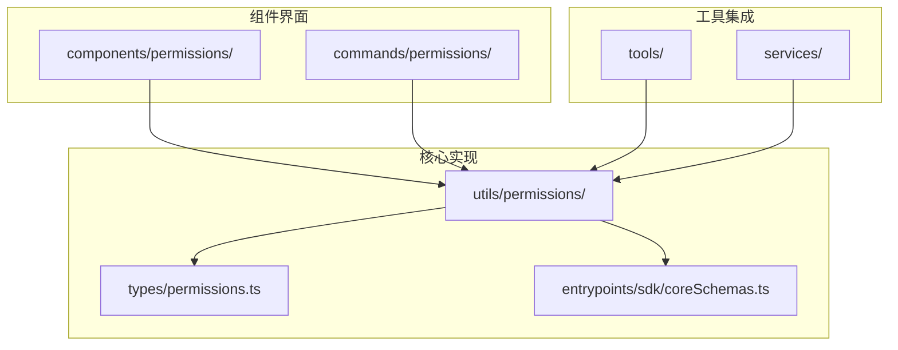
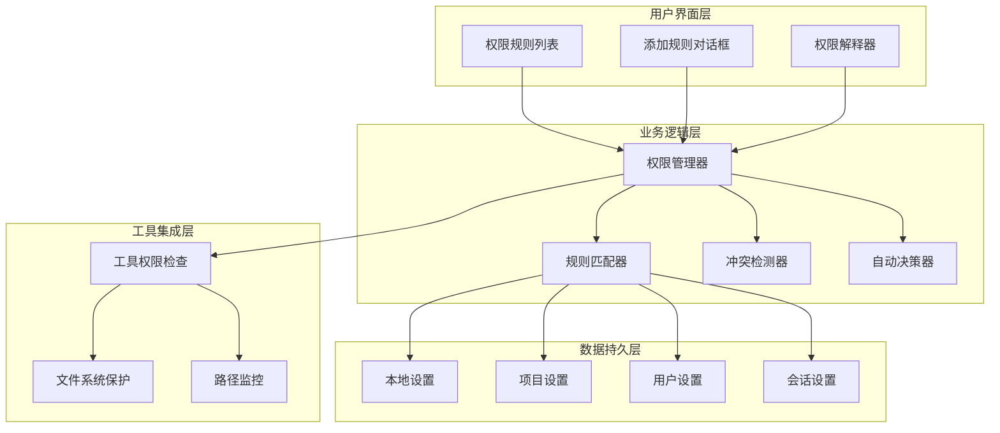
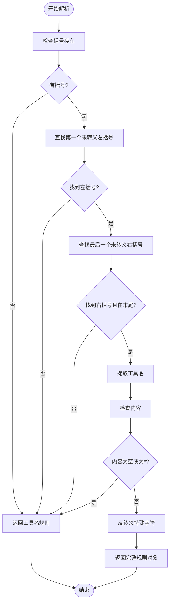
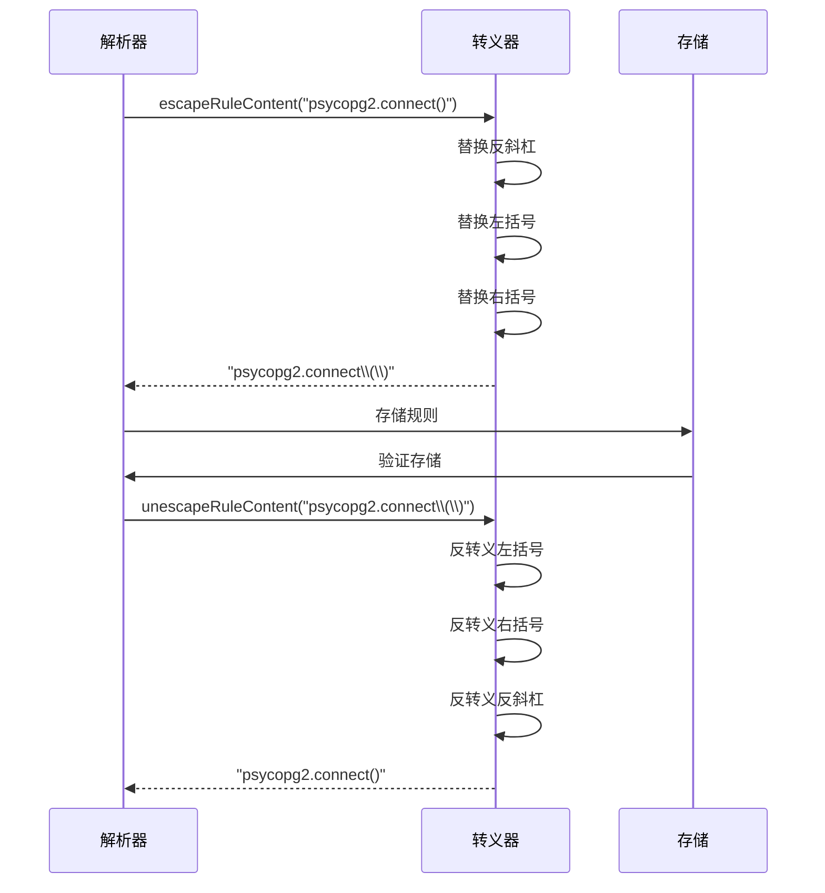
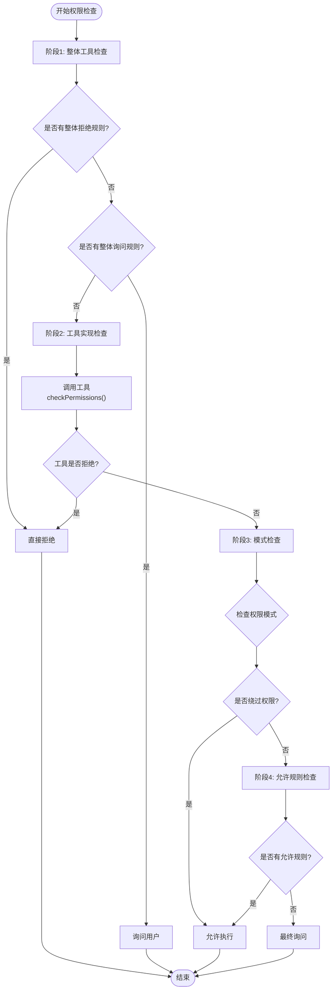
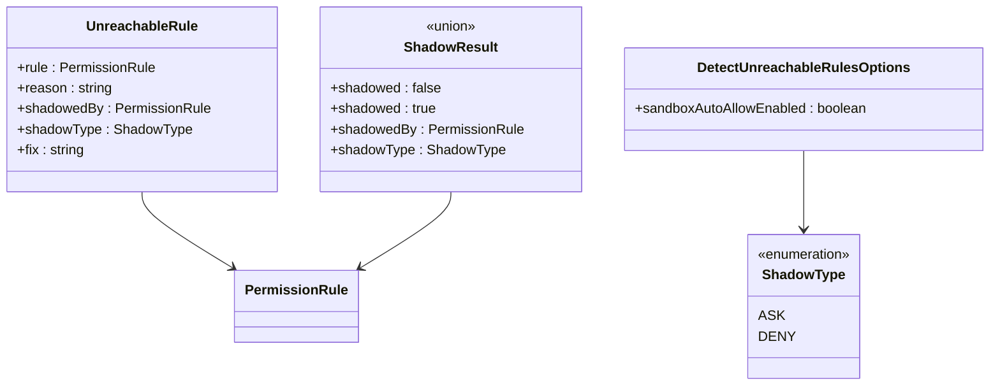
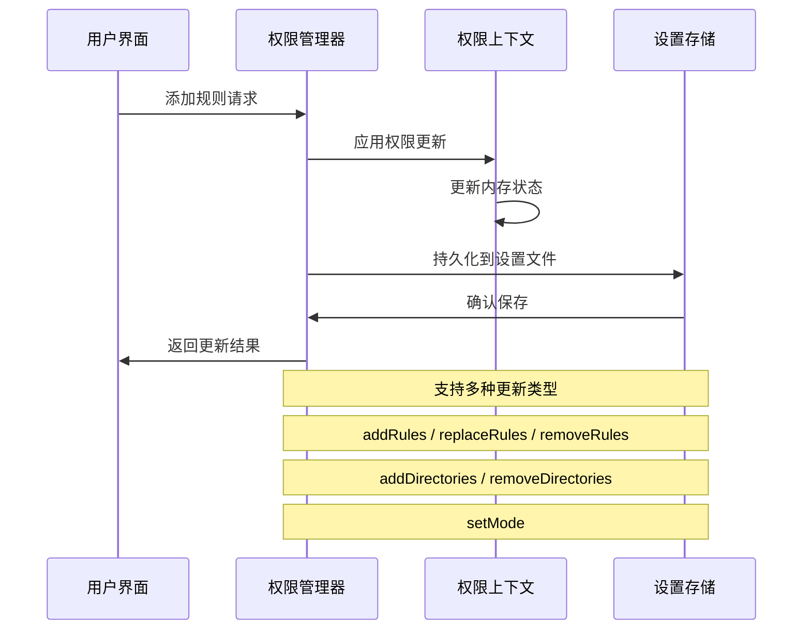
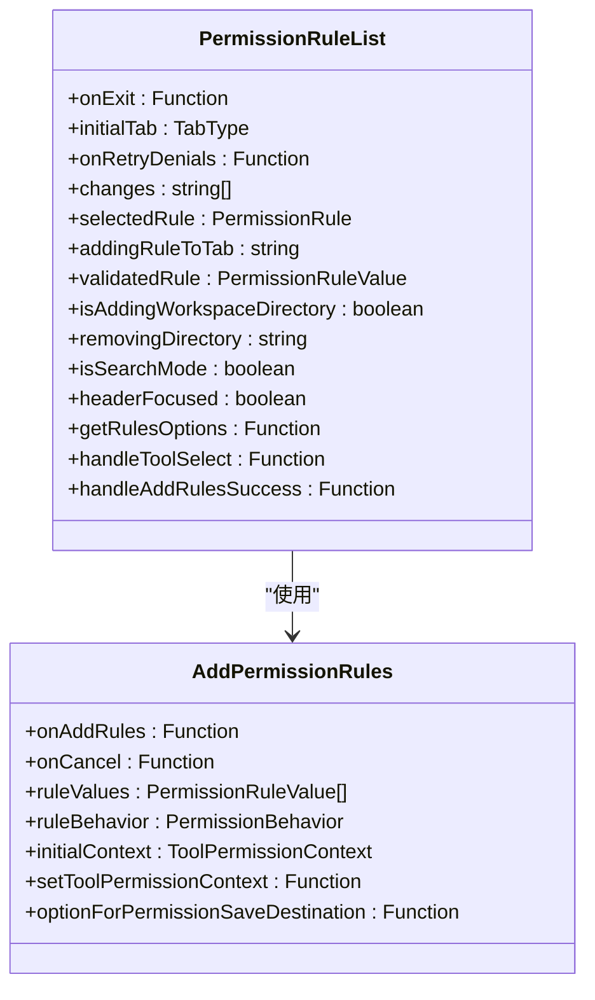
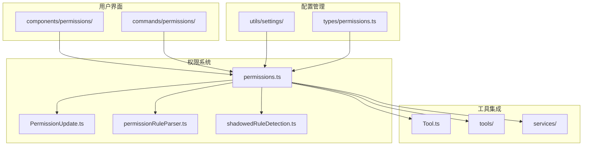

# 权限规则系统

<cite>
**本文档引用的文件**
- [PermissionRule.ts](file://utils/permissions/PermissionRule.ts)
- [permissionRuleParser.ts](file://utils/permissions/permissionRuleParser.ts)
- [permissions.ts](file://utils/permissions/permissions.ts)
- [PermissionUpdate.ts](file://utils/permissions/PermissionUpdate.ts)
- [permissionsLoader.ts](file://utils/permissions/permissionsLoader.ts)
- [PermissionUpdateSchema.ts](file://entrypoints/sdk/coreSchemas.ts)
- [permissionValidation.ts](file://utils/settings/permissionValidation.ts)
- [PermissionRuleList.tsx](file://components/permissions/rules/PermissionRuleList.tsx)
- [AddPermissionRules.tsx](file://components/permissions/rules/AddPermissionRules.tsx)
- [shadowedRuleDetection.ts](file://utils/permissions/shadowedRuleDetection.ts)
- [permissionExplainer.ts](file://utils/permissions/permissionExplainer.ts)
- [permissions.tsx](file://commands/permissions/permissions.tsx)
- [PermissionResult.ts](file://utils/permissions/PermissionResult.ts)
- [PermissionMode.ts](file://utils/permissions/PermissionMode.ts)
- [types/permissions.ts](file://types/permissions.ts)
</cite>

## 目录
1. [简介](#简介)
2. [项目结构](#项目结构)
3. [核心组件](#核心组件)
4. [架构概览](#架构概览)
5. [详细组件分析](#详细组件分析)
6. [依赖关系分析](#依赖关系分析)
7. [性能考虑](#性能考虑)
8. [故障排除指南](#故障排除指南)
9. [结论](#结论)
10. [附录](#附录)

## 简介

Claude Code 的权限规则系统是一个强大的安全控制框架，用于管理工具权限、路径保护和用户交互。该系统提供了灵活的规则语法、智能的规则匹配算法、优先级处理机制和冲突解决策略。

系统的核心功能包括：
- **多层权限控制**：支持用户设置、项目设置、本地设置等多种来源
- **智能规则匹配**：基于工具名称和内容的精确匹配
- **优先级处理**：deny > ask > allow 的决策流程
- **冲突检测**：自动识别和报告冲突的规则配置
- **路径保护**：针对敏感目录和文件的安全保护
- **自动化决策**：支持自动模式下的AI分类器决策

## 项目结构

权限规则系统主要分布在以下目录中：



**图表来源**
- [permissions.ts:1-1487](file://utils/permissions/permissions.ts#L1-L1487)
- [types/permissions.ts:1-442](file://types/permissions.ts#L1-L442)

**章节来源**
- [permissions.ts:1-1487](file://utils/permissions/permissions.ts#L1-L1487)
- [types/permissions.ts:1-442](file://types/permissions.ts#L1-L442)

## 核心组件

### 数据结构定义

权限系统的核心数据结构包括：

#### 权限规则值
```typescript
interface PermissionRuleValue {
  toolName: string;
  ruleContent?: string;
}
```

#### 权限规则
```typescript
interface PermissionRule {
  source: PermissionRuleSource;
  ruleBehavior: PermissionBehavior;
  ruleValue: PermissionRuleValue;
}
```

#### 权限更新
```typescript
type PermissionUpdate = 
  | { type: 'addRules'; destination: PermissionUpdateDestination; rules: PermissionRuleValue[]; behavior: PermissionBehavior }
  | { type: 'replaceRules'; destination: PermissionUpdateDestination; rules: PermissionRuleValue[]; behavior: PermissionBehavior }
  | { type: 'removeRules'; destination: PermissionUpdateDestination; rules: PermissionRuleValue[]; behavior: PermissionBehavior }
  | { type: 'setMode'; destination: PermissionUpdateDestination; mode: ExternalPermissionMode }
  | { type: 'addDirectories'; destination: PermissionUpdateDestination; directories: string[] }
  | { type: 'removeDirectories'; destination: PermissionUpdateDestination; directories: string[] };
```

**章节来源**
- [PermissionRule.ts:1-41](file://utils/permissions/PermissionRule.ts#L1-L41)
- [types/permissions.ts:44-147](file://types/permissions.ts#L44-L147)

### 规则存储格式

权限规则采用简洁的字符串格式存储：

| 规则类型 | 存储格式 | 示例 | 说明 |
|---------|---------|------|------|
| 工具级规则 | `ToolName` | `Bash` | 匹配整个工具的所有使用 |
| 内容级规则 | `ToolName(content)` | `Bash(npm install)` | 匹配特定内容的工具使用 |
| 通配符规则 | `ToolName(*)` | `Bash(*)` | 等同于工具级规则 |
| 路径规则 | `ToolName(path/**)` | `Read(.git/**)` | 匹配路径模式 |

**章节来源**
- [permissionRuleParser.ts:82-152](file://utils/permissions/permissionRuleParser.ts#L82-L152)

## 架构概览

权限规则系统采用分层架构设计，确保了模块化和可扩展性：



**图表来源**
- [permissions.ts:473-1319](file://utils/permissions/permissions.ts#L473-L1319)
- [PermissionUpdate.ts:55-206](file://utils/permissions/PermissionUpdate.ts#L55-L206)

## 详细组件分析

### 规则解析器

规则解析器负责将字符串格式的规则转换为内部数据结构：



**图表来源**
- [permissionRuleParser.ts:93-133](file://utils/permissions/permissionRuleParser.ts#L93-L133)

#### 特殊字符转义机制

解析器实现了智能的转义机制来处理括号字符：



**图表来源**
- [permissionRuleParser.ts:55-79](file://utils/permissions/permissionRuleParser.ts#L55-L79)

**章节来源**
- [permissionRuleParser.ts:1-199](file://utils/permissions/permissionRuleParser.ts#L1-L199)

### 规则匹配算法

权限系统采用多阶段匹配算法，确保精确的规则应用：



**图表来源**
- [permissions.ts:1158-1319](file://utils/permissions/permissions.ts#L1158-L1319)

#### 冲突解决策略

系统实现了智能的冲突检测和解决机制：



**图表来源**
- [shadowedRuleDetection.ts:19-45](file://utils/permissions/shadowedRuleDetection.ts#L19-L45)

**章节来源**
- [permissions.ts:1071-1156](file://utils/permissions/permissions.ts#L1071-L1156)
- [shadowedRuleDetection.ts:1-235](file://utils/permissions/shadowedRuleDetection.ts#L1-L235)

### 权限更新机制

权限更新系统支持多种操作类型和持久化策略：



**图表来源**
- [PermissionUpdate.ts:55-342](file://utils/permissions/PermissionUpdate.ts#L55-L342)

**章节来源**
- [PermissionUpdate.ts:1-390](file://utils/permissions/PermissionUpdate.ts#L1-L390)

### 用户界面组件

系统提供了直观的用户界面来管理权限规则：

#### 权限规则列表组件



**图表来源**
- [PermissionRuleList.tsx:473-800](file://components/permissions/rules/PermissionRuleList.tsx#L473-L800)
- [AddPermissionRules.tsx:48-180](file://components/permissions/rules/AddPermissionRules.tsx#L48-L180)

**章节来源**
- [PermissionRuleList.tsx:1-1179](file://components/permissions/rules/PermissionRuleList.tsx#L1-L1179)
- [AddPermissionRules.tsx:1-180](file://components/permissions/rules/AddPermissionRules.tsx#L1-L180)

## 依赖关系分析

权限规则系统与其他模块的依赖关系如下：



**图表来源**
- [permissions.ts:1-1487](file://utils/permissions/permissions.ts#L1-L1487)
- [types/permissions.ts:1-442](file://types/permissions.ts#L1-L442)

**章节来源**
- [permissions.ts:1-1487](file://utils/permissions/permissions.ts#L1-L1487)
- [types/permissions.ts:1-442](file://types/permissions.ts#L1-L442)

## 性能考虑

权限规则系统在设计时充分考虑了性能优化：

### 缓存策略
- **规则映射缓存**：使用Map结构缓存规则查找结果
- **解析结果缓存**：避免重复解析相同的规则字符串
- **路径转换缓存**：缓存POSIX路径转换结果

### 优化技术
- **早期退出**：在找到匹配规则时立即停止搜索
- **批量操作**：支持批量规则更新和持久化
- **增量更新**：只更新发生变化的部分

### 内存管理
- **不可变数据结构**：使用不可变模式避免意外修改
- **垃圾回收优化**：及时释放不再使用的规则引用
- **内存泄漏防护**：确保所有事件监听器正确清理

## 故障排除指南

### 常见问题诊断

#### 规则不生效
1. **检查规则来源**：确认规则保存在正确的设置源中
2. **验证规则语法**：使用规则验证器检查格式正确性
3. **检查优先级**：确认没有更高优先级的冲突规则

#### 权限检查失败
1. **查看决策原因**：检查PermissionDecisionReason获取详细信息
2. **启用调试日志**：使用logForDebugging获取详细执行流程
3. **检查工具实现**：验证工具的checkPermissions方法

#### 性能问题
1. **规则数量统计**：监控规则数量对性能的影响
2. **缓存命中率**：检查规则解析缓存的有效性
3. **内存使用情况**：监控权限上下文的内存占用

**章节来源**
- [permissions.ts:1477-1486](file://utils/permissions/permissions.ts#L1477-L1486)
- [permissionExplainer.ts:193-229](file://utils/permissions/permissionExplainer.ts#L193-L229)

## 结论

Claude Code 的权限规则系统是一个设计精良、功能完整的安全控制框架。其核心优势包括：

1. **灵活性**：支持多种规则格式和存储源
2. **安全性**：提供多层次的权限控制和冲突检测
3. **易用性**：直观的用户界面和智能的规则建议
4. **可扩展性**：模块化的架构支持功能扩展

系统通过智能的规则匹配算法、完善的冲突解决机制和丰富的用户界面，为开发者提供了强大而灵活的权限管理解决方案。

## 附录

### 最佳实践指南

#### 规则创建最佳实践
- 使用具体的内容规则而非通用规则
- 定期审查和清理过期规则
- 在团队环境中使用项目设置共享规则
- 为敏感操作创建明确的拒绝规则

#### 规则编辑建议
- 利用冲突检测功能识别潜在问题
- 使用权限解释器理解规则影响
- 保持规则的一致性和可维护性
- 定期备份重要的权限配置

#### 规则测试方法
- 创建测试环境验证规则效果
- 使用权限验证器检查规则格式
- 监控权限决策日志分析行为
- 进行回归测试确保功能稳定