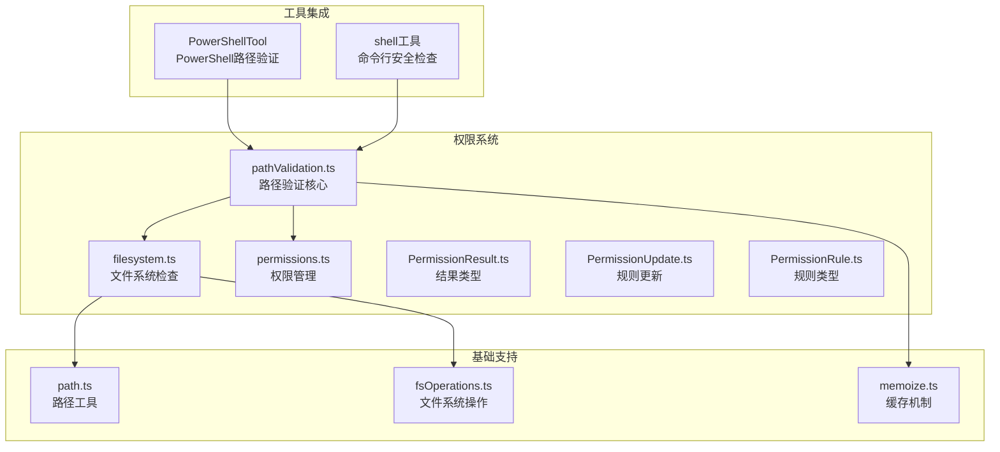
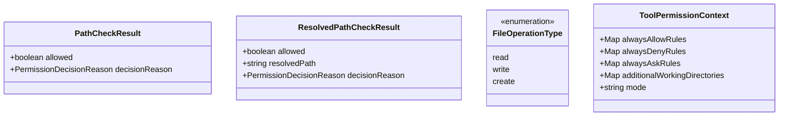
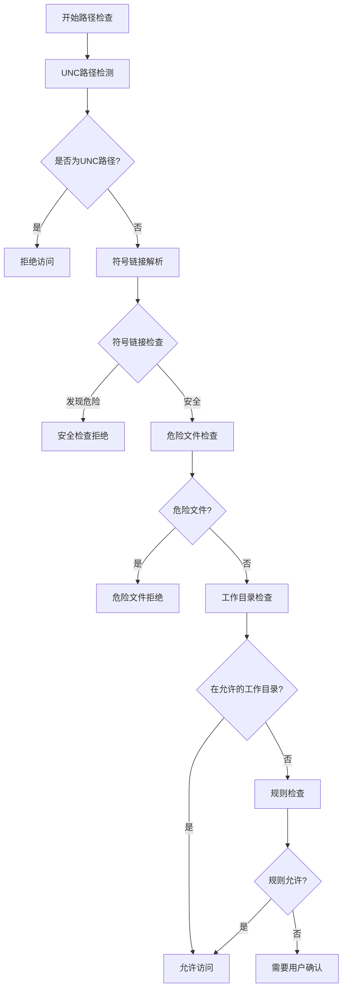
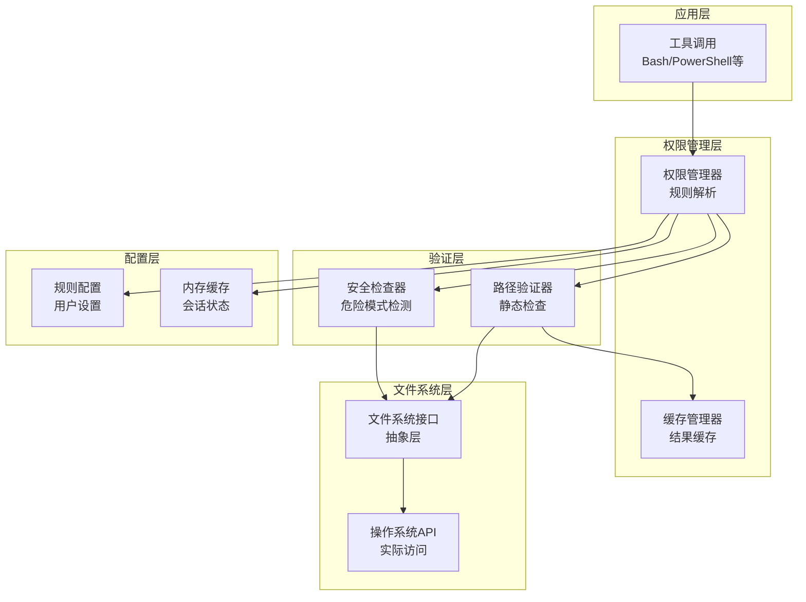
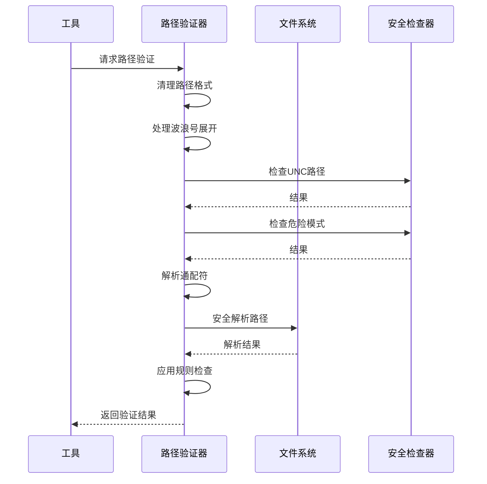
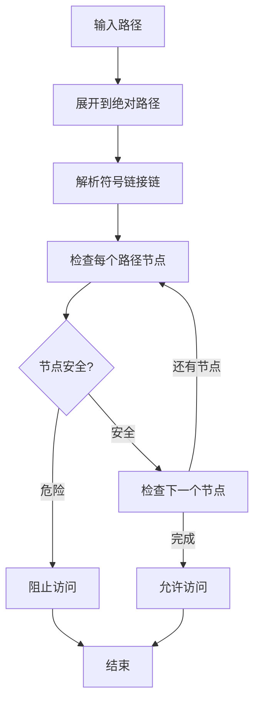
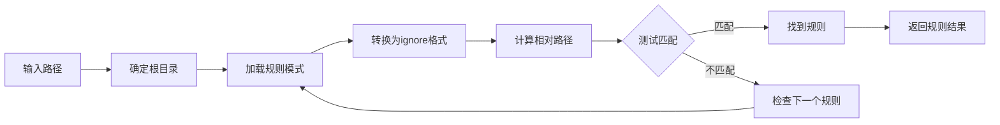
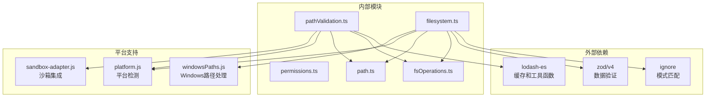
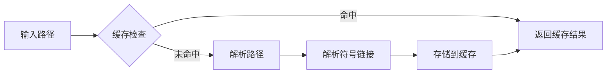
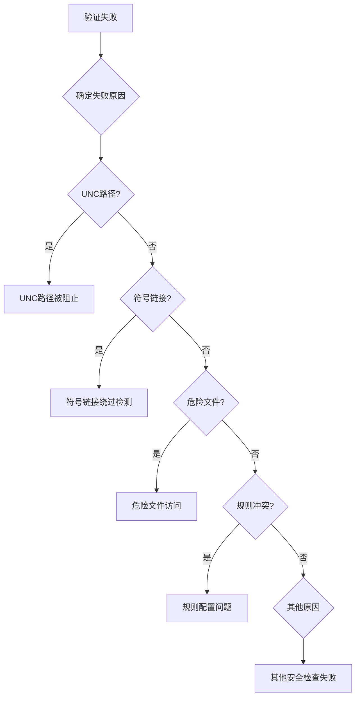

# 路径保护机制

<cite>
**本文档引用的文件**
- [utils/permissions/pathValidation.ts](file://utils/permissions/pathValidation.ts)
- [utils/permissions/filesystem.ts](file://utils/permissions/filesystem.ts)
- [utils/permissions/permissions.ts](file://utils/permissions/permissions.ts)
- [utils/permissions/PermissionResult.ts](file://utils/permissions/PermissionResult.ts)
- [utils/permissions/PermissionRule.ts](file://utils/permissions/PermissionRule.ts)
- [utils/permissions/PermissionUpdate.ts](file://utils/permissions/PermissionUpdate.ts)
- [utils/path.ts](file://utils/path.ts)
- [utils/fsOperations.ts](file://utils/fsOperations.ts)
- [utils/shell/readOnlyCommandValidation.ts](file://utils/shell/readOnlyCommandValidation.ts)
- [tools/PowerShellTool/pathValidation.ts](file://tools/PowerShellTool/pathValidation.ts)
- [utils/memoize.ts](file://utils/memoize.ts)
</cite>

## 目录
1. [简介](#简介)
2. [项目结构](#项目结构)
3. [核心组件](#核心组件)
4. [架构概览](#架构概览)
5. [详细组件分析](#详细组件分析)
6. [依赖分析](#依赖分析)
7. [性能考虑](#性能考虑)
8. [故障排除指南](#故障排除指南)
9. [结论](#结论)
10. [附录](#附录)

## 简介

Claude Code 的路径保护机制是一个多层次的安全框架，旨在防止路径遍历攻击、UNC 路径泄露、符号链接绕过和危险文件访问。该机制通过严格的路径验证算法、文件系统安全检查和阴影规则检测，确保所有文件操作都在受控范围内进行。

该系统的核心目标是：
- 防范路径遍历攻击（如 `../../../etc/passwd`）
- 阻止 UNC 路径导致的网络请求和凭据泄露
- 检测和阻止危险文件访问（如 `.gitconfig`、`.bashrc`）
- 提供灵活的白名单、黑名单和动态验证机制
- 实现高性能的缓存策略以减少重复计算

## 项目结构

路径保护机制主要分布在以下模块中：



**图表来源**
- [utils/permissions/pathValidation.ts:1-486](file://utils/permissions/pathValidation.ts#L1-L486)
- [utils/permissions/filesystem.ts:1-800](file://utils/permissions/filesystem.ts#L1-L800)
- [utils/permissions/permissions.ts:1-800](file://utils/permissions/permissions.ts#L1-L800)

**章节来源**
- [utils/permissions/pathValidation.ts:1-486](file://utils/permissions/pathValidation.ts#L1-L486)
- [utils/permissions/filesystem.ts:1-800](file://utils/permissions/filesystem.ts#L1-L800)
- [utils/permissions/permissions.ts:1-800](file://utils/permissions/permissions.ts#L1-L800)

## 核心组件

### 路径验证核心模块

路径验证核心模块提供了完整的路径安全检查功能：

#### 主要功能特性
- **多层安全检查**：包括 UNC 路径检测、符号链接解析、危险文件识别
- **通配符处理**：安全地处理 glob 模式，防止路径遍历
- **平台适配**：支持 Windows、macOS 和 Linux 的不同安全要求
- **动态验证**：根据上下文动态调整验证策略

#### 关键数据结构


**图表来源**
- [utils/permissions/pathValidation.ts:29-36](file://utils/permissions/pathValidation.ts#L29-L36)
- [utils/permissions/permissions.ts:122-231](file://utils/permissions/permissions.ts#L122-L231)

**章节来源**
- [utils/permissions/pathValidation.ts:373-485](file://utils/permissions/pathValidation.ts#L373-L485)
- [utils/permissions/filesystem.ts:57-80](file://utils/permissions/filesystem.ts#L57-L80)

### 文件系统安全检查

文件系统安全检查模块负责识别和阻止危险的文件访问模式：

#### 危险模式检测
- **UNC 路径检测**：识别潜在的网络访问路径
- **符号链接绕过**：检测通过符号链接访问受限目录
- **危险文件识别**：阻止对敏感配置文件的访问
- **路径遍历防护**：防止使用 `../` 访问父目录

#### 安全检查流程


**图表来源**
- [utils/permissions/filesystem.ts:620-665](file://utils/permissions/filesystem.ts#L620-L665)
- [utils/permissions/filesystem.ts:1205-1412](file://utils/permissions/filesystem.ts#L1205-L1412)

**章节来源**
- [utils/permissions/filesystem.ts:435-488](file://utils/permissions/filesystem.ts#L435-L488)
- [utils/permissions/filesystem.ts:537-602](file://utils/permissions/filesystem.ts#L537-L602)

### 权限管理模块

权限管理模块提供了灵活的权限控制机制：

#### 权限模式
- **默认模式**：需要用户确认
- **接受编辑模式**：允许在工作目录内的编辑操作
- **自动模式**：使用 AI 分类器自动决策
- **绕过权限模式**：完全信任用户的操作

#### 规则系统
- **白名单规则**：明确允许的操作
- **黑名单规则**：明确禁止的操作
- **询问规则**：需要用户确认的操作
- **动态规则**：基于上下文生成的临时规则

**章节来源**
- [utils/permissions/permissions.ts:1071-1156](file://utils/permissions/permissions.ts#L1071-L1156)
- [utils/permissions/permissions.ts:1158-1319](file://utils/permissions/permissions.ts#L1158-L1319)

## 架构概览

路径保护机制采用分层架构设计，确保每个层次都有明确的安全职责：



**图表来源**
- [utils/permissions/permissions.ts:473-501](file://utils/permissions/permissions.ts#L473-L501)
- [utils/permissions/pathValidation.ts:141-263](file://utils/permissions/pathValidation.ts#L141-L263)

## 详细组件分析

### 路径验证算法

路径验证算法是整个安全机制的核心，它执行多阶段的安全检查：

#### 验证流程


**图表来源**
- [utils/permissions/pathValidation.ts:373-485](file://utils/permissions/pathValidation.ts#L373-L485)
- [utils/permissions/filesystem.ts:955-1025](file://utils/permissions/filesystem.ts#L955-L1025)

#### 关键验证步骤

1. **路径清理和标准化**
   - 移除引号包装
   - 处理波浪号（`~`）展开
   - 统一路径分隔符

2. **UNC 路径检测**
   ```javascript
   // 检测UNC路径模式
   if (path.startsWith('//') || 
       /DavWWWRoot/i.test(path) || 
       /@SSL@/i.test(path)) {
       return false; // 拒绝访问
   }
   ```

3. **危险模式检查**
   - 检测路径遍历 (`../`)
   - 检测变量扩展 (`$VAR`, `%VAR%`)
   - 检测特殊路径模式

4. **通配符安全处理**
   - 对于读操作：仅检查基础目录
   - 对于写操作：拒绝通配符模式

**章节来源**
- [utils/permissions/pathValidation.ts:46-61](file://utils/permissions/pathValidation.ts#L46-L61)
- [utils/permissions/filesystem.ts:537-602](file://utils/permissions/filesystem.ts#L537-L602)

### 文件系统安全检查

文件系统安全检查模块提供了多层次的安全防护：

#### 符号链接安全检查


**图表来源**
- [utils/fsOperations.ts:272-308](file://utils/fsOperations.ts#L272-L308)
- [utils/permissions/filesystem.ts:620-665](file://utils/permissions/filesystem.ts#L620-L665)

#### 危险文件识别
系统维护了一个危险文件列表，包括：
- 版本控制系统配置文件（`.gitconfig`, `.gitmodules`）
- Shell 配置文件（`.bashrc`, `.zshrc`, `.profile`）
- IDE 配置目录（`.vscode`, `.idea`）
- Claude 配置文件（`.claude.json`, `.claude/settings.json`）

**章节来源**
- [utils/permissions/filesystem.ts:57-80](file://utils/permissions/filesystem.ts#L57-L80)
- [utils/permissions/filesystem.ts:435-488](file://utils/permissions/filesystem.ts#L435-L488)

### 阴影规则检测机制

阴影规则检测机制用于识别和处理复杂的权限规则组合：

#### 规则匹配流程


**图表来源**
- [utils/permissions/filesystem.ts:955-1025](file://utils/permissions/filesystem.ts#L955-L1025)
- [utils/permissions/filesystem.ts:800-826](file://utils/permissions/filesystem.ts#L800-L826)

#### 规则优先级
1. **明确拒绝规则**：最高优先级
2. **明确允许规则**：次高优先级  
3. **询问规则**：第三优先级
4. **默认行为**：最低优先级

**章节来源**
- [utils/permissions/filesystem.ts:800-1025](file://utils/permissions/filesystem.ts#L800-L1025)

### 路径白名单、黑名单和动态验证

#### 白名单机制
白名单规则明确允许特定的文件或目录访问：
- 使用 `ignore` 库进行模式匹配
- 支持通配符和子目录匹配
- 自动处理相对路径和绝对路径

#### 黑名单机制  
黑名单规则明确禁止特定的文件或目录访问：
- 优先于其他规则
- 支持精确匹配和模式匹配
- 自动阻止危险文件和目录

#### 动态验证机制
动态验证根据上下文生成临时规则：
- 基于工作目录的动态规则
- 基于工具类型的动态规则
- 基于用户交互的动态规则

**章节来源**
- [utils/permissions/PermissionUpdate.ts:30-206](file://utils/permissions/PermissionUpdate.ts#L30-L206)
- [utils/permissions/filesystem.ts:800-1025](file://utils/permissions/filesystem.ts#L800-L1025)

## 依赖分析

路径保护机制的依赖关系如下：



**图表来源**
- [utils/permissions/pathValidation.ts:1-22](file://utils/permissions/pathValidation.ts#L1-L22)
- [utils/permissions/filesystem.ts:1-49](file://utils/permissions/filesystem.ts#L1-L49)

**章节来源**
- [utils/permissions/pathValidation.ts:1-22](file://utils/permissions/pathValidation.ts#L1-L22)
- [utils/permissions/filesystem.ts:1-49](file://utils/permissions/filesystem.ts#L1-L49)

## 性能考虑

### 缓存策略

系统实现了多层次的缓存机制来提高性能：

#### 路径解析缓存


**图表来源**
- [utils/permissions/filesystem.ts:676-681](file://utils/permissions/filesystem.ts#L676-L681)
- [utils/permissions/pathValidation.ts:125-128](file://utils/permissions/pathValidation.ts#L125-L128)

#### 缓存优化技术
1. **路径规范化缓存**：缓存标准化后的路径
2. **符号链接链缓存**：缓存符号链接解析结果
3. **规则匹配缓存**：缓存规则匹配结果
4. **工作目录缓存**：缓存工作目录解析结果

#### 并发控制
- 使用 `inFlight` 映射避免重复计算
- 实现缓存失效机制
- 支持缓存刷新和清理

**章节来源**
- [utils/memoize.ts:134-172](file://utils/memoize.ts#L134-L172)
- [utils/permissions/filesystem.ts:676-681](file://utils/permissions/filesystem.ts#L676-L681)

### 性能优化建议

1. **批量处理**：对多个路径进行批量验证以减少系统调用
2. **延迟加载**：按需加载规则和配置
3. **智能缓存**：根据使用频率调整缓存策略
4. **异步处理**：对耗时的文件系统操作使用异步处理

## 故障排除指南

### 常见问题诊断

#### 路径验证失败
当路径验证失败时，系统会返回详细的错误信息：



**图表来源**
- [utils/permissions/PermissionResult.ts:24-35](file://utils/permissions/PermissionResult.ts#L24-L35)

#### 调试技巧
1. **启用调试日志**：查看详细的验证过程
2. **检查路径格式**：确保路径格式正确
3. **验证规则配置**：检查权限规则设置
4. **测试符号链接**：确认符号链接安全性

**章节来源**
- [utils/permissions/PermissionResult.ts:1-36](file://utils/permissions/PermissionResult.ts#L1-L36)
- [utils/permissions/filesystem.ts:1027-1194](file://utils/permissions/filesystem.ts#L1027-L1194)

### 安全审计和合规性检查

#### 审计跟踪
系统提供完整的审计功能：
- 记录所有权限决策
- 跟踪规则使用情况
- 监控异常访问尝试
- 生成合规报告

#### 合规性检查
1. **规则完整性检查**：验证规则配置的完整性
2. **权限最小化验证**：确保权限分配符合最小权限原则
3. **审计日志审查**：定期审查访问日志
4. **安全策略验证**：验证安全策略的有效性

**章节来源**
- [utils/permissions/permissions.ts:800-1058](file://utils/permissions/permissions.ts#L800-L1058)

## 结论

Claude Code 的路径保护机制通过多层次的安全检查、灵活的权限管理和高效的缓存策略，为文件系统操作提供了全面的安全保障。该机制不仅能够有效防范各种路径安全威胁，还提供了良好的性能表现和用户体验。

关键优势包括：
- **全面的安全防护**：涵盖路径遍历、UNC 路径、符号链接等多种攻击向量
- **灵活的权限控制**：支持多种权限模式和动态规则生成
- **高性能设计**：通过缓存和优化减少性能开销
- **可审计性**：提供完整的审计日志和合规性检查

未来可以进一步改进的方向：
- 增强机器学习驱动的威胁检测
- 优化大规模文件系统的性能
- 扩展跨平台兼容性
- 加强实时威胁情报集成

## 附录

### 配置方法

#### 基本配置
1. **规则文件位置**：`~/.claude/settings.json`
2. **规则格式**：JSON 格式，支持注释
3. **规则语法**：支持通配符和正则表达式

#### 高级配置
1. **自定义规则源**：支持本地、用户、项目级别的规则
2. **动态规则生成**：基于上下文自动创建规则
3. **规则继承机制**：支持规则的继承和覆盖

### 自定义规则创建指南

#### 规则类型
1. **文件规则**：针对特定文件或文件类型
2. **目录规则**：针对特定目录或目录树
3. **工具规则**：针对特定工具或工具组
4. **时间规则**：基于时间条件的规则

#### 规则示例
```json
{
  "alwaysAllowRules": {
    "userSettings": ["Bash(*)"],
    "projectSettings": ["/home/user/project/**"]
  },
  "alwaysDenyRules": {
    "localSettings": [".git/**", "~/.ssh/**"]
  }
}
```

**章节来源**
- [utils/permissions/PermissionUpdate.ts:222-342](file://utils/permissions/PermissionUpdate.ts#L222-L342)
- [utils/permissions/permissions.ts:1408-1471](file://utils/permissions/permissions.ts#L1408-L1471)