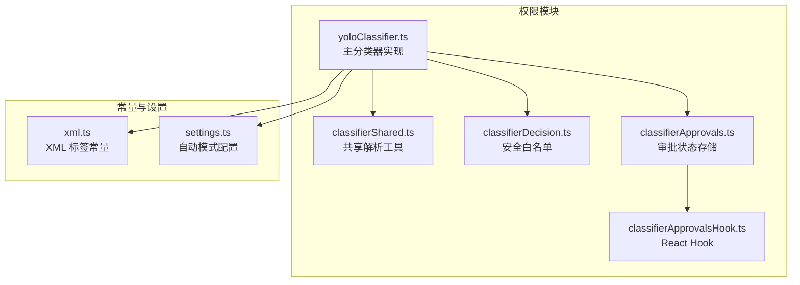
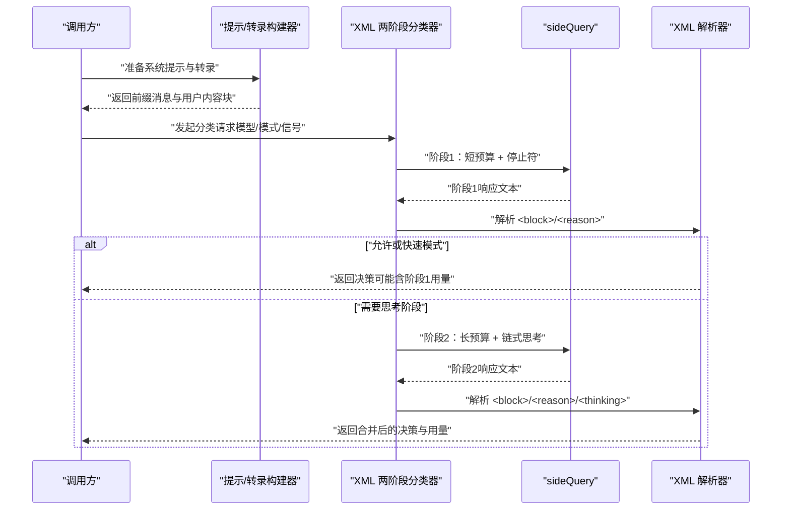
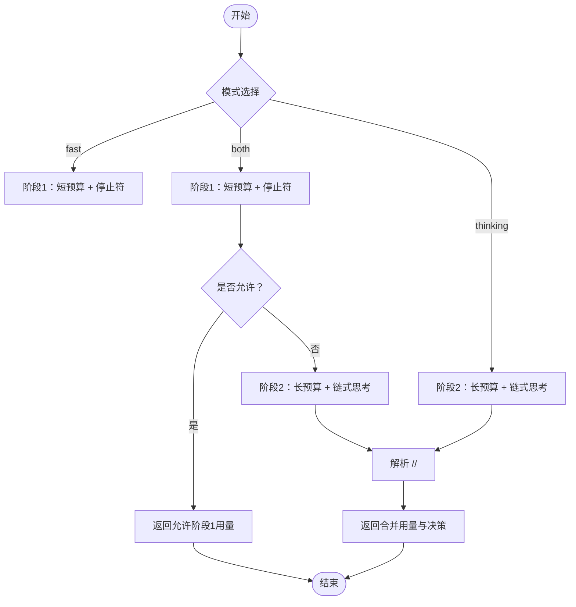
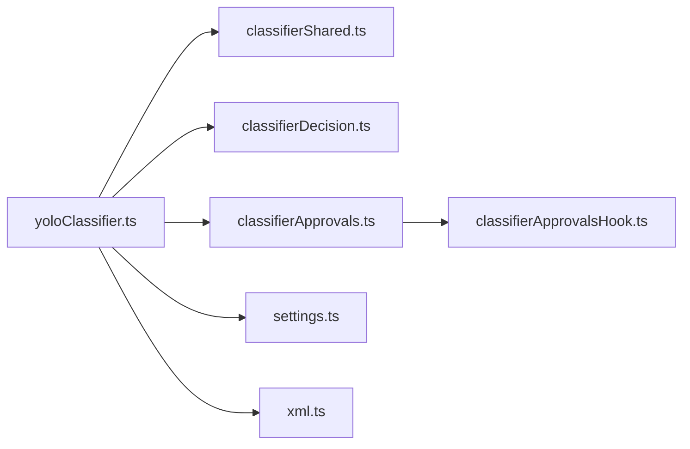

# YOLO 分类器

<cite>
**本文引用的文件**
- [yoloClassifier.ts](file://utils/permissions/yoloClassifier.ts)
- [classifierShared.ts](file://utils/permissions/classifierShared.ts)
- [classifierDecision.ts](file://utils/permissions/classifierDecision.ts)
- [classifierApprovals.ts](file://utils/classifierApprovals.ts)
- [classifierApprovalsHook.ts](file://utils/classifierApprovalsHook.ts)
- [xml.ts](file://constants/xml.ts)
- [settings.ts](file://utils/settings/settings.ts)
</cite>

## 目录
1. [简介](#简介)
2. [项目结构](#项目结构)
3. [核心组件](#核心组件)
4. [架构总览](#架构总览)
5. [详细组件分析](#详细组件分析)
6. [依赖关系分析](#依赖关系分析)
7. [性能考量](#性能考量)
8. [故障排查指南](#故障排查指南)
9. [结论](#结论)
10. [附录](#附录)

## 简介
本文件面向 Claude Code 的 YOLO 自动模式安全分类器，系统性阐述其工作原理、XML 两阶段分类机制与决策流程，详解系统提示构建、转录内容处理与输出格式解析；对比快速模式（fast）、思考模式（thinking）与双阶段模式（both）的差异与适用场景；并提供配置参数、性能优化、错误处理、准确性评估、使用统计与调试工具，以及缓存策略与性能监控方法。

## 项目结构
YOLO 分类器位于权限模块中，围绕“系统提示构建—转录内容编码—两阶段 XML 分类—结果解析—日志与缓存”的流水线组织代码，关键文件如下：
- 分类器主实现：utils/permissions/yoloClassifier.ts
- 共享工具：utils/permissions/classifierShared.ts
- 安全白名单工具：utils/permissions/classifierDecision.ts
- 分类器审批状态存储与 Hook：utils/classifierApprovals.ts、utils/classifierApprovalsHook.ts
- 常量标签：constants/xml.ts
- 设置与配置：utils/settings/settings.ts

图表来源
- [yoloClassifier.ts:1012-1306](file://utils/permissions/yoloClassifier.ts#L1012-L1306)
- [classifierShared.ts:1-40](file://utils/permissions/classifierShared.ts#L1-L40)
- [classifierDecision.ts:56-98](file://utils/permissions/classifierDecision.ts#L56-L98)
- [classifierApprovals.ts:1-89](file://utils/classifierApprovals.ts#L1-L89)
- [classifierApprovalsHook.ts:1-18](file://utils/classifierApprovalsHook.ts#L1-L18)
- [xml.ts:1-87](file://constants/xml.ts#L1-L87)
- [settings.ts:1310-1327](file://utils/settings/settings.ts#L1310-L1327)

章节来源
- [yoloClassifier.ts:1012-1306](file://utils/permissions/yoloClassifier.ts#L1012-L1306)
- [classifierShared.ts:1-40](file://utils/permissions/classifierShared.ts#L1-L40)
- [classifierDecision.ts:56-98](file://utils/permissions/classifierDecision.ts#L56-L98)
- [classifierApprovals.ts:1-89](file://utils/classifierApprovals.ts#L1-L89)
- [classifierApprovalsHook.ts:1-18](file://utils/classifierApprovalsHook.ts#L1-L18)
- [xml.ts:1-87](file://constants/xml.ts#L1-L87)
- [settings.ts:1310-1327](file://utils/settings/settings.ts#L1310-L1327)

## 核心组件
- 系统提示构建器：根据用户规则与模板生成分类器系统提示，并支持外部/内部模板切换。
- 转录构建器：从消息历史抽取用户文本与助手工具调用，序列化为紧凑格式，作为分类器输入。
- XML 两阶段分类器：支持 both/fast/thinking 三种模式，首阶段快速拒绝对策，必要时进入第二阶段链式思考以降低误判。
- 输出解析器：解析 XML 标签（<block>/<reason>/<thinking>），提取决策、理由与链式思考。
- 审批状态管理：记录工具使用被自动批准的原因，供 UI 展示与审计。
- 配置与开关：通过环境变量与 GrowthBook 配置控制两阶段分类器启用、模式选择与模型选择。

章节来源
- [yoloClassifier.ts:484-540](file://utils/permissions/yoloClassifier.ts#L484-L540)
- [yoloClassifier.ts:1012-1306](file://utils/permissions/yoloClassifier.ts#L1012-L1306)
- [yoloClassifier.ts:1308-1327](file://utils/permissions/yoloClassifier.ts#L1308-L1327)
- [classifierDecision.ts:56-98](file://utils/permissions/classifierDecision.ts#L56-L98)
- [classifierApprovals.ts:19-59](file://utils/classifierApprovals.ts#L19-L59)

## 架构总览
YOLO 分类器在自动模式下对每个工具调用进行安全判定，核心流程包括：
- 输入准备：构建系统提示、转录内容、CLAUDE.md 前缀消息。
- 模型选择：优先使用配置或环境变量指定模型，否则回退到主循环模型。
- 两阶段分类：按模式执行快速拒止或链式思考，最终返回决策与统计信息。
- 结果解析：提取 shouldBlock、reason、thinking，并合并阶段用量。
- 日志与缓存：记录使用统计、请求体快照、错误诊断文件与缓存控制头。

图表来源
- [yoloClassifier.ts:711-996](file://utils/permissions/yoloClassifier.ts#L711-L996)
- [yoloClassifier.ts:1110-1130](file://utils/permissions/yoloClassifier.ts#L1110-L1130)
- [yoloClassifier.ts:1308-1327](file://utils/permissions/yoloClassifier.ts#L1308-L1327)

章节来源
- [yoloClassifier.ts:711-996](file://utils/permissions/yoloClassifier.ts#L711-L996)
- [yoloClassifier.ts:1110-1130](file://utils/permissions/yoloClassifier.ts#L1110-L1130)
- [yoloClassifier.ts:1308-1327](file://utils/permissions/yoloClassifier.ts#L1308-L1327)

## 详细组件分析

### 系统提示构建与模板注入
- 模板来源：内置外部模板与内部模板，外部模板默认启用；Anthropic 内部构建可强制使用外部模板。
- 用户规则注入：将 allow/soft_deny/environment 规则注入到模板占位符中，支持累加或替换两种语义。
- CLAUDE.md 前缀：当存在用户配置时，将其作为缓存友好的前缀消息加入，提升提示缓存命中率。

章节来源
- [yoloClassifier.ts:71-78](file://utils/permissions/yoloClassifier.ts#L71-L78)
- [yoloClassifier.ts:484-540](file://utils/permissions/yoloClassifier.ts#L484-L540)
- [yoloClassifier.ts:460-477](file://utils/permissions/yoloClassifier.ts#L460-L477)

### 转录内容处理与紧凑格式
- 消息过滤：仅保留用户文本与助手工具调用，避免模型自写文本影响分类。
- 工具投影：通过工具的 toAutoClassifierInput 将输入序列化为紧凑字符串或 JSONL 行，保证安全且可控。
- 缓存控制：在动作块上附加缓存控制头，确保两阶段共享前缀获得缓存命中。

章节来源
- [yoloClassifier.ts:291-360](file://utils/permissions/yoloClassifier.ts#L291-L360)
- [yoloClassifier.ts:384-442](file://utils/permissions/yoloClassifier.ts#L384-L442)
- [yoloClassifier.ts:1094-1106](file://utils/permissions/yoloClassifier.ts#L1094-L1106)

### XML 两阶段分类机制与决策流程
- 快速模式（fast）
  - 首阶段短预算 + 停止符，若允许直接返回；若拒绝则进入思考阶段。
  - 可携带 <reason> 以便快速阶段给出理由。
- 思考模式（thinking）
  - 仅执行第二阶段，要求链式思考与明确的 <block> 标签。
- 双阶段模式（both，默认）
  - 首阶段快速拒止，必要时第二阶段降低误判。
- 输出格式
  - 使用 XML 标签：<block>yes/no</block>、<reason>...</reason>、<thinking>...</thinking>。
  - 首阶段停止符确保 <block> 提前出现，第二阶段要求严格遵循分类流程。

图表来源
- [yoloClassifier.ts:696-710](file://utils/permissions/yoloClassifier.ts#L696-L710)
- [yoloClassifier.ts:771-858](file://utils/permissions/yoloClassifier.ts#L771-L858)
- [yoloClassifier.ts:860-940](file://utils/permissions/yoloClassifier.ts#L860-L940)

章节来源
- [yoloClassifier.ts:696-710](file://utils/permissions/yoloClassifier.ts#L696-L710)
- [yoloClassifier.ts:771-858](file://utils/permissions/yoloClassifier.ts#L771-L858)
- [yoloClassifier.ts:860-940](file://utils/permissions/yoloClassifier.ts#L860-L940)

### 输出格式解析与链式思考剥离
- 标签解析：分别解析 <block>/<reason>/<thinking>，并剥离 <thinking> 内容以避免误匹配。
- 失败兜底：解析失败或未找到工具调用时，统一返回阻断决策并记录原因。
- 合并用量：两阶段模式下合并阶段用量，便于成本与缓存统计。

章节来源
- [yoloClassifier.ts:567-604](file://utils/permissions/yoloClassifier.ts#L567-L604)
- [yoloClassifier.ts:1192-1237](file://utils/permissions/yoloClassifier.ts#L1192-L1237)
- [yoloClassifier.ts:633-641](file://utils/permissions/yoloClassifier.ts#L633-L641)

### 审批状态与 UI 展示
- 存储：记录工具使用 ID 对应的分类器类型与原因，支持查询与清理。
- Hook：提供 React 订阅接口，用于 UI 实时显示“正在检查”状态。

章节来源
- [classifierApprovals.ts:19-59](file://utils/classifierApprovals.ts#L19-L59)
- [classifierApprovalsHook.ts:13-17](file://utils/classifierApprovalsHook.ts#L13-L17)

### 安全白名单与快速放行
- 白名单：对只读/元数据/计划模式等安全工具直接放行，减少分类器调用。
- 例外：编辑/写入类工具不在白名单内，仍需分类器判定。

章节来源
- [classifierDecision.ts:56-98](file://utils/permissions/classifierDecision.ts#L56-L98)

## 依赖关系分析
- 组件耦合
  - yoloClassifier.ts 依赖共享解析工具与设置模块，耦合度低、职责清晰。
  - 审批状态独立于分类器逻辑，通过 Hook 注入 UI。
- 外部依赖
  - sideQuery：统一的异步消息接口，负责重试、超时与缓存控制。
  - 缓存控制：通过 getCacheControl 控制提示缓存，提升跨调用命中率。
- 循环依赖规避
  - 通过状态缓存读取 CLAUDE.md 内容，避免模块间循环导入。

图表来源
- [yoloClassifier.ts:1-50](file://utils/permissions/yoloClassifier.ts#L1-L50)
- [classifierShared.ts:1-40](file://utils/permissions/classifierShared.ts#L1-L40)
- [classifierDecision.ts:1-25](file://utils/permissions/classifierDecision.ts#L1-L25)
- [classifierApprovals.ts:1-20](file://utils/classifierApprovals.ts#L1-L20)
- [classifierApprovalsHook.ts:1-18](file://utils/classifierApprovalsHook.ts#L1-L18)
- [xml.ts:1-87](file://constants/xml.ts#L1-L87)
- [settings.ts:1310-1327](file://utils/settings/settings.ts#L1310-L1327)

章节来源
- [yoloClassifier.ts:1-50](file://utils/permissions/yoloClassifier.ts#L1-L50)
- [classifierShared.ts:1-40](file://utils/permissions/classifierShared.ts#L1-L40)
- [classifierDecision.ts:1-25](file://utils/permissions/classifierDecision.ts#L1-L25)
- [classifierApprovals.ts:1-20](file://utils/classifierApprovals.ts#L1-L20)
- [classifierApprovalsHook.ts:1-18](file://utils/classifierApprovalsHook.ts#L1-L18)
- [xml.ts:1-87](file://constants/xml.ts#L1-L87)
- [settings.ts:1310-1327](file://utils/settings/settings.ts#L1310-L1327)

## 性能考量
- 提示缓存
  - 系统提示与 CLAUDE.md 前缀消息均带缓存控制头，两阶段共享前缀可获得稳定缓存命中，降低输入令牌消耗。
- 预估与对比
  - 分类器字符长度与令牌估算与主循环上下文进行对比，若分类器显著更大则触发自动压缩或告警。
- 思考模式适配
  - 对“始终开启思考”的模型采用“填充预算”策略，避免因思考内容耗尽导致无法输出 <block>。
- 用量统计
  - 合并两阶段用量，区分缓存读取与创建，便于成本归因与优化。

章节来源
- [yoloClassifier.ts:1094-1106](file://utils/permissions/yoloClassifier.ts#L1094-L1106)
- [yoloClassifier.ts:1074-1092](file://utils/permissions/yoloClassifier.ts#L1074-L1092)
- [yoloClassifier.ts:683-693](file://utils/permissions/yoloClassifier.ts#L683-L693)
- [yoloClassifier.ts:633-641](file://utils/permissions/yoloClassifier.ts#L633-L641)

## 故障排查指南
- 错误诊断文件
  - 在 API 错误时生成会话级诊断文件，包含错误信息、上下文对比与提示内容，便于复现与共享。
- 请求快照
  - 支持将请求与响应体写入临时目录，便于离线分析。
- 中断与超时
  - 用户中断时返回阻断决策并标记 unavailable=false；超长提示返回“超出上下文窗口”并记录实际/限制令牌数。
- 解析失败
  - 未找到工具调用或响应模式不匹配时，统一阻断并记录失败原因。

章节来源
- [yoloClassifier.ts:213-250](file://utils/permissions/yoloClassifier.ts#L213-L250)
- [yoloClassifier.ts:153-180](file://utils/permissions/yoloClassifier.ts#L153-L180)
- [yoloClassifier.ts:941-995](file://utils/permissions/yoloClassifier.ts#L941-L995)
- [yoloClassifier.ts:1260-1305](file://utils/permissions/yoloClassifier.ts#L1260-L1305)
- [yoloClassifier.ts:1463-1471](file://utils/permissions/yoloClassifier.ts#L1463-L1471)

## 结论
YOLO 分类器通过“系统提示模板 + 紧凑转录 + XML 两阶段分类 + 严格输出解析”的设计，在保障安全性的同时兼顾性能与可解释性。双阶段模式在误判敏感场景尤为有效，结合缓存与用量统计，可实现可观的成本与延迟收益。配套的审批状态与诊断工具进一步增强了可观测性与可维护性。

## 附录

### 配置参数与开关
- 两阶段分类器启用与模式
  - 环境变量优先：CLAUDE_CODE_TWO_STAGE_CLASSIFIER（true/false 或 'fast'/'thinking'）
  - GrowthBook 配置：tengu_auto_mode_config.twoStageClassifier
- 模型选择
  - 环境变量 CLAUDE_CODE_AUTO_MODE_MODEL 优先；否则来自配置；最后回退到主循环模型
- 转录格式
  - CLAUDE_CODE_JSONL_TRANSCRIPT 控制紧凑格式（JSONL 行 vs 文本前缀）
- 权限模板
  - forceExternalPermissions 强制使用外部模板（仅 Anthropic 内部构建）

章节来源
- [yoloClassifier.ts:1353-1377](file://utils/permissions/yoloClassifier.ts#L1353-L1377)
- [yoloClassifier.ts:1334-1347](file://utils/permissions/yoloClassifier.ts#L1334-L1347)
- [yoloClassifier.ts:1379-1390](file://utils/permissions/yoloClassifier.ts#L1379-L1390)
- [yoloClassifier.ts:71-78](file://utils/permissions/yoloClassifier.ts#L71-L78)
- [settings.ts:1310-1327](file://utils/settings/settings.ts#L1310-L1327)

### 快速模式（fast）、思考模式（thinking）与双阶段模式（both）对比
- 快速模式（fast）
  - 特点：首阶段短预算 + 停止符，允许即返回；拒绝时携带 <reason>，最终决策由首阶段决定
  - 适用：对延迟敏感、误判风险较低的场景
- 思考模式（thinking）
  - 特点：仅第二阶段，要求链式思考与严格遵循分类流程
  - 适用：高风险动作、需要更强可解释性的场景
- 双阶段模式（both，默认）
  - 特点：首阶段快速拒止，必要时第二阶段降低误判
  - 适用：平衡性能与准确性的通用场景

章节来源
- [yoloClassifier.ts:696-710](file://utils/permissions/yoloClassifier.ts#L696-L710)
- [yoloClassifier.ts:771-858](file://utils/permissions/yoloClassifier.ts#L771-L858)
- [yoloClassifier.ts:860-940](file://utils/permissions/yoloClassifier.ts#L860-L940)

### 输出格式与标签
- XML 标签
  - <block>yes/no</block>：是否阻断
  - <reason>...</reason>：阻断理由（允许时不出现）
  - <thinking>...</thinking>：链式思考（仅第二阶段）
- 常量标签
  - constants/xml.ts 提供通用 XML 标签常量，用于消息与任务通知等场景

章节来源
- [yoloClassifier.ts:567-604](file://utils/permissions/yoloClassifier.ts#L567-L604)
- [xml.ts:1-87](file://constants/xml.ts#L1-L87)

### 准确性评估与使用统计
- 指标
  - 成功/解析失败/中断/错误/超长提示等结果分布
  - 主循环令牌与分类器估算/实际令牌对比
  - 缓存读取/创建令牌占比
- 采集
  - 通过日志事件记录分类器类型、模型、耗时与上下文对比指标
- 建议
  - 关注 p95 上下文比例异常（>1.0），及时调整转录压缩策略

章节来源
- [yoloClassifier.ts:1425-1455](file://utils/permissions/yoloClassifier.ts#L1425-L1455)
- [yoloClassifier.ts:1250-1258](file://utils/permissions/yoloClassifier.ts#L1250-L1258)
- [yoloClassifier.ts:1463-1471](file://utils/permissions/yoloClassifier.ts#L1463-L1471)

### 缓存策略与性能监控
- 缓存控制
  - 系统提示与 CLAUDE.md 前缀消息带缓存控制头，两阶段共享前缀确保稳定命中
- 监控
  - 记录分类器输入令牌总量（含缓存读取/创建），并与主循环上下文对比
  - 通过日志事件上报分类器类型、模型、耗时与上下文对比指标

章节来源
- [yoloClassifier.ts:1094-1106](file://utils/permissions/yoloClassifier.ts#L1094-L1106)
- [yoloClassifier.ts:1175-1179](file://utils/permissions/yoloClassifier.ts#L1175-L1179)
- [yoloClassifier.ts:1425-1455](file://utils/permissions/yoloClassifier.ts#L1425-L1455)