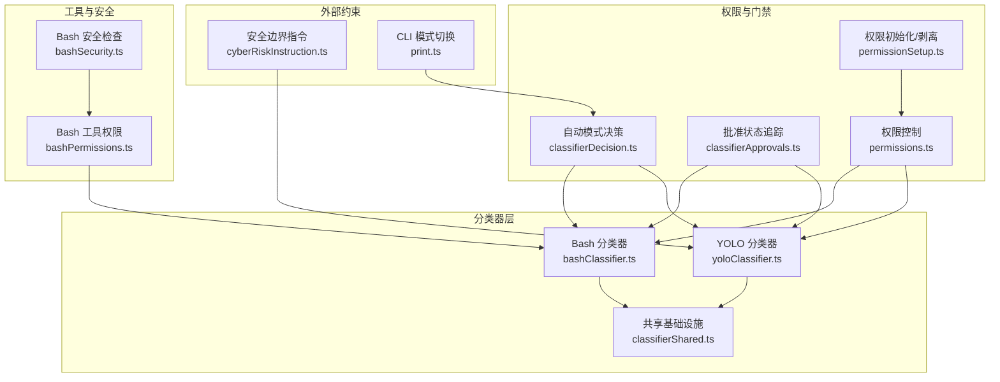
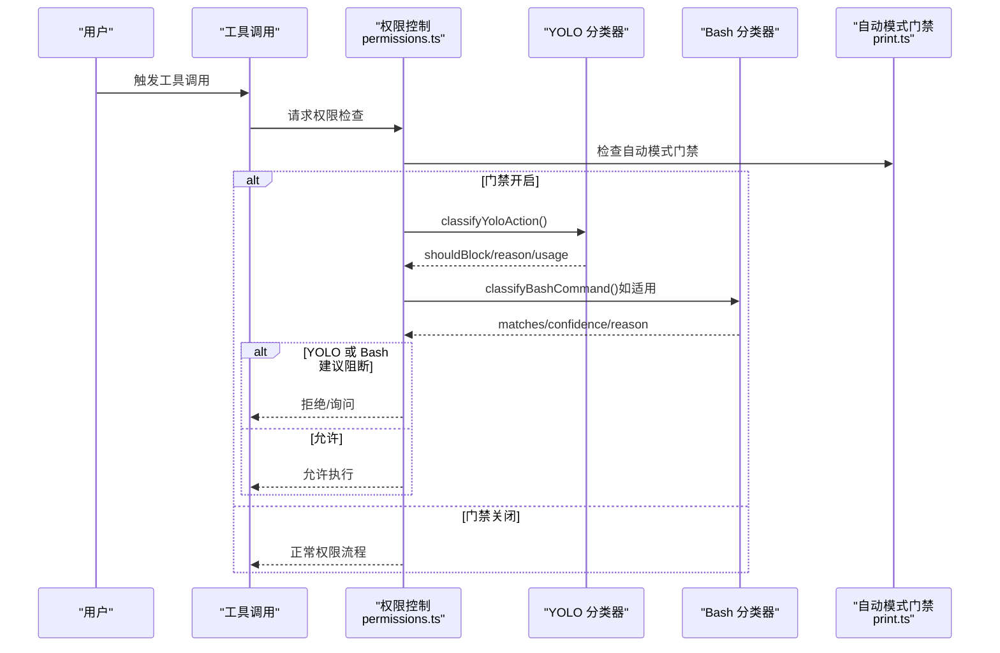
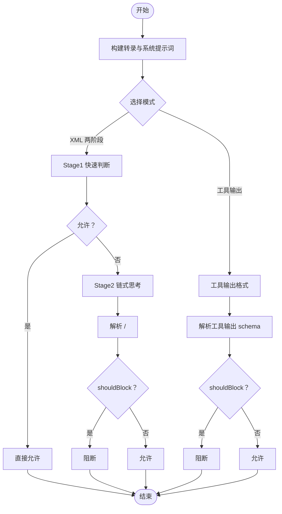
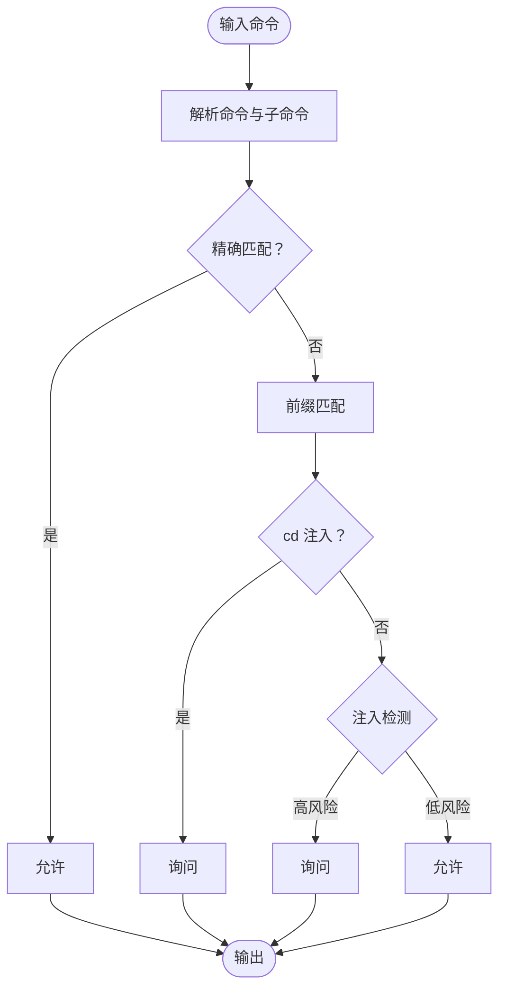
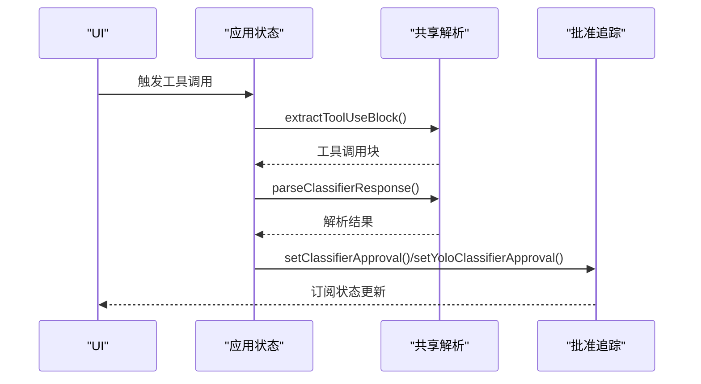
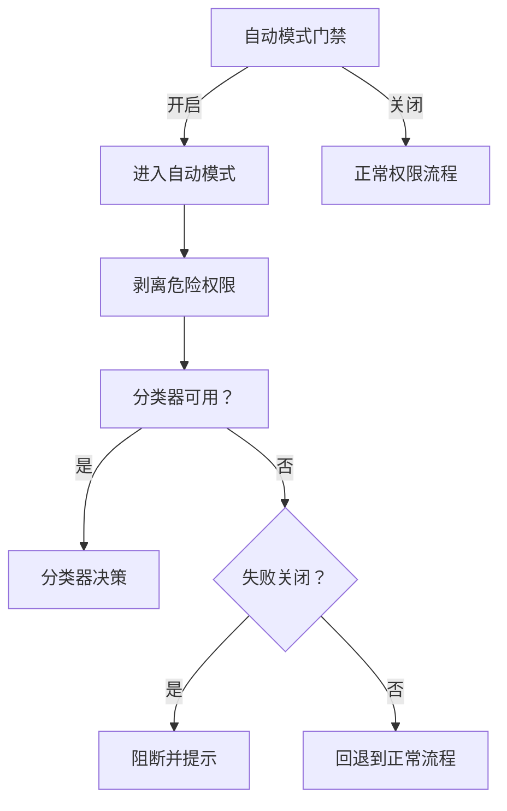
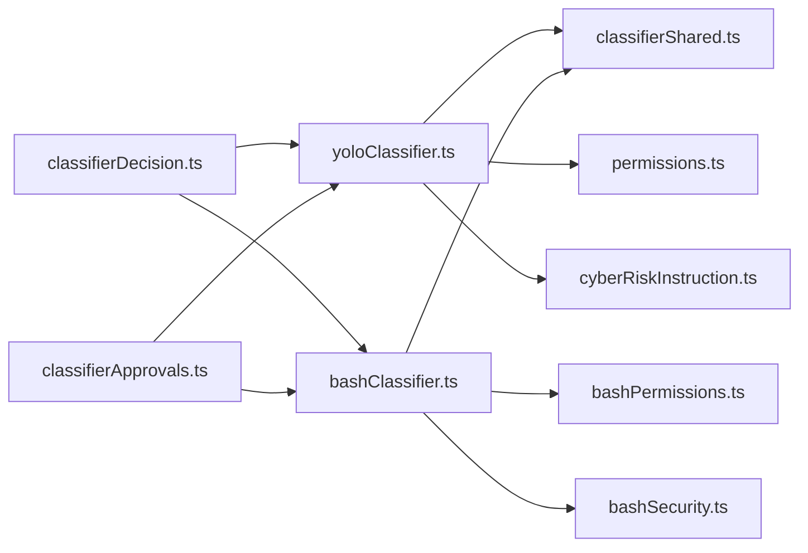

# 风险分类系统

<cite>
**本文档引用的文件**
- [yoloClassifier.ts](file://utils/permissions/yoloClassifier.ts)
- [bashClassifier.ts](file://utils/permissions/bashClassifier.ts)
- [classifierShared.ts](file://utils/permissions/classifierShared.ts)
- [classifierDecision.ts](file://utils/permissions/classifierDecision.ts)
- [classifierApprovals.ts](file://utils/classifierApprovals.ts)
- [cyberRiskInstruction.ts](file://constants/cyberRiskInstruction.ts)
- [permissions.ts](file://utils/permissions/permissions.ts)
- [permissionSetup.ts](file://utils/permissions/permissionSetup.ts)
- [bashPermissions.ts](file://tools/BashTool/bashPermissions.ts)
- [bashSecurity.ts](file://tools/BashTool/bashSecurity.ts)
- [print.ts](file://cli/print.ts)
</cite>

## 目录
1. [简介](#简介)
2. [项目结构](#项目结构)
3. [核心组件](#核心组件)
4. [架构总览](#架构总览)
5. [详细组件分析](#详细组件分析)
6. [依赖关系分析](#依赖关系分析)
7. [性能考虑](#性能考虑)
8. [故障排除指南](#故障排除指南)
9. [结论](#结论)
10. [附录](#附录)

## 简介
本文件系统性阐述 Claude Code 的风险分类体系，重点覆盖两类分类器：YOLO 分类器（自动模式安全分类）与 Bash 分类器（语义化 Bash 命令匹配）。文档从架构设计、数据流、处理逻辑、阈值与决策规则、模型训练与特征工程、配置与调优、性能监控到用户反馈与故障排除进行完整说明，帮助读者在不深入源码的前提下理解并正确使用该系统。

## 项目结构
风险分类系统主要由以下模块构成：
- YOLO 分类器：基于对话历史与工具调用构建紧凑转录，通过两阶段 XML 输出或工具输出格式进行安全判定。
- Bash 分类器：对 Bash 命令进行前缀匹配、精确匹配与注入检测，支持规则描述生成与提示词扩展。
- 共享基础设施：统一的工具调用块解析、响应校验与批准状态跟踪。
- 权限控制与门禁：自动模式门禁开关、危险权限剥离、失败策略（开/闭）、计划模式集成。
- 安全边界指令：定义可接受的防御性安全协助范围与拒绝项。

**图表来源**
- [yoloClassifier.ts:1-1496](file://utils/permissions/yoloClassifier.ts#L1-L1496)
- [bashClassifier.ts:1-62](file://utils/permissions/bashClassifier.ts#L1-L62)
- [classifierShared.ts:1-40](file://utils/permissions/classifierShared.ts#L1-L40)
- [classifierDecision.ts:1-99](file://utils/permissions/classifierDecision.ts#L1-L99)
- [classifierApprovals.ts:1-89](file://utils/classifierApprovals.ts#L1-L89)
- [permissions.ts:846-876](file://utils/permissions/permissions.ts#L846-L876)
- [permissionSetup.ts:505-1532](file://utils/permissions/permissionSetup.ts#L505-L1532)
- [bashPermissions.ts:874-2432](file://tools/BashTool/bashPermissions.ts#L874-L2432)
- [bashSecurity.ts:2253-2284](file://tools/BashTool/bashSecurity.ts#L2253-L2284)
- [cyberRiskInstruction.ts:1-25](file://constants/cyberRiskInstruction.ts#L1-L25)
- [print.ts:4602-4642](file://cli/print.ts#L4602-L4642)

**章节来源**
- [yoloClassifier.ts:1-1496](file://utils/permissions/yoloClassifier.ts#L1-L1496)
- [bashClassifier.ts:1-62](file://utils/permissions/bashClassifier.ts#L1-L62)
- [classifierShared.ts:1-40](file://utils/permissions/classifierShared.ts#L1-L40)
- [classifierDecision.ts:1-99](file://utils/permissions/classifierDecision.ts#L1-L99)
- [classifierApprovals.ts:1-89](file://utils/classifierApprovals.ts#L1-L89)
- [permissions.ts:846-876](file://utils/permissions/permissions.ts#L846-L876)
- [permissionSetup.ts:505-1532](file://utils/permissions/permissionSetup.ts#L505-L1532)
- [bashPermissions.ts:874-2432](file://tools/BashTool/bashPermissions.ts#L874-L2432)
- [bashSecurity.ts:2253-2284](file://tools/BashTool/bashSecurity.ts#L2253-L2284)
- [cyberRiskInstruction.ts:1-25](file://constants/cyberRiskInstruction.ts#L1-L25)
- [print.ts:4602-4642](file://cli/print.ts#L4602-L4642)

## 核心组件
- YOLO 分类器（自动模式）
  - 将消息历史与工具调用序列化为紧凑转录，结合用户提供的 CLAUDE.md 配置与自定义规则，构建系统提示词与用户提示词。
  - 支持两种模式：
    - 工具输出格式：使用内置工具返回 shouldBlock/reason。
    - 两阶段 XML 输出：先快速判断（stage1），若需进一步推理则进入链式思考（stage2）。
  - 决策逻辑：shouldBlock 为真时阻断；parse 失败或不可用时按“失败关闭”策略阻断。
- Bash 分类器（语义化 Bash 匹配）
  - 提供规则描述生成、前缀/精确匹配、注入检测等能力。
  - 在外部构建中默认禁用，内部构建启用。
- 共享基础设施
  - 统一提取工具调用块与解析响应 schema，确保两类分类器的一致性与可维护性。
- 批准状态与追踪
  - 记录分类器批准与检查状态，支持订阅与清理，便于 UI 展示与调试。
- 权限与门禁
  - 自动模式门禁开关、危险权限剥离、失败策略（fail closed/open）、计划模式集成。
- 安全边界指令
  - 明确可接受的防御性安全协助范围，拒绝破坏性技术与供应链攻击等。

**章节来源**
- [yoloClassifier.ts:252-285](file://utils/permissions/yoloClassifier.ts#L252-L285)
- [yoloClassifier.ts:711-996](file://utils/permissions/yoloClassifier.ts#L711-L996)
- [yoloClassifier.ts:1012-1306](file://utils/permissions/yoloClassifier.ts#L1012-L1306)
- [bashClassifier.ts:1-62](file://utils/permissions/bashClassifier.ts#L1-L62)
- [classifierShared.ts:15-39](file://utils/permissions/classifierShared.ts#L15-L39)
- [classifierApprovals.ts:1-89](file://utils/classifierApprovals.ts#L1-L89)
- [permissions.ts:846-876](file://utils/permissions/permissions.ts#L846-L876)
- [permissionSetup.ts:505-553](file://utils/permissions/permissionSetup.ts#L505-L553)
- [cyberRiskInstruction.ts:1-25](file://constants/cyberRiskInstruction.ts#L1-L25)

## 架构总览
下图展示从工具调用到分类器决策的关键流程，包括 YOLO 与 Bash 两条路径以及失败策略与门禁控制。

**图表来源**
- [permissions.ts:846-876](file://utils/permissions/permissions.ts#L846-L876)
- [yoloClassifier.ts:1012-1306](file://utils/permissions/yoloClassifier.ts#L1012-L1306)
- [bashClassifier.ts:40-53](file://utils/permissions/bashClassifier.ts#L40-L53)
- [print.ts:4602-4642](file://cli/print.ts#L4602-L4642)

## 详细组件分析

### YOLO 分类器（自动模式）
- 数据结构与序列化
  - TranscriptEntry：封装用户文本与助手工具调用块。
  - buildTranscriptEntries：过滤并抽取用户文本与助手工具调用。
  - buildTranscriptForClassifier：将消息序列化为紧凑字符串，用于分类器输入。
- 系统提示词构建
  - buildYoloSystemPrompt：拼接基础提示词与用户自定义规则（allow/deny/environment），并在外部模板与内部模板间切换。
  - CLAUDE.md 注入：将用户配置作为缓存友好的用户内容插入。
- 两阶段 XML 分类器
  - stage1：快速判断，使用短 max_tokens 与停止序列，优先得到明确的 block/no 结论。
  - stage2：当 stage1 判定阻断时，进入链式思考以减少误判。
  - XML 解析：解析 <block>/<reason>/<thinking> 标签，剥离思考内容避免标签干扰。
- 工具输出格式分类器
  - 使用内置工具返回 shouldBlock/reason，解析响应 schema 并记录使用量与请求 ID。
- 失败策略与错误处理
  - parse 失败或不可用：按“失败关闭”策略阻断，记录错误转录以便诊断。
  - 超出上下文窗口：检测并记录 token 数，返回“转录过长”原因。
- 性能与缓存
  - prompt 长度估算与主回路对比，确保分类器不会超过主回路上下文。
  - 使用缓存控制（cache_control）提升 prompt 缓存命中率，降低重复计算。

**图表来源**
- [yoloClassifier.ts:711-996](file://utils/permissions/yoloClassifier.ts#L711-L996)
- [yoloClassifier.ts:1012-1306](file://utils/permissions/yoloClassifier.ts#L1012-L1306)

**章节来源**
- [yoloClassifier.ts:287-442](file://utils/permissions/yoloClassifier.ts#L287-L442)
- [yoloClassifier.ts:484-540](file://utils/permissions/yoloClassifier.ts#L484-L540)
- [yoloClassifier.ts:542-604](file://utils/permissions/yoloClassifier.ts#L542-L604)
- [yoloClassifier.ts:711-996](file://utils/permissions/yoloClassifier.ts#L711-L996)
- [yoloClassifier.ts:1012-1306](file://utils/permissions/yoloClassifier.ts#L1012-L1306)

### Bash 分类器（语义化 Bash 命令匹配）
- 规则与描述
  - createPromptRuleContent：将描述包装为 prompt: 前缀，便于分类器识别。
  - extractPromptDescription：从规则内容中提取描述（外部构建中为空实现）。
- 命令分类
  - classifyBashCommand：根据命令、工作目录与规则列表进行匹配，返回匹配结果与置信度。
  - 支持 deny/ask/allow 三种行为，结合注入检测与前缀/精确匹配。
- 安全检查与注入检测
  - bashCommandIsSafe：检测控制字符、单引号反斜杠漏洞等潜在绕过模式。
  - checkCommandAndSuggestRules：综合精确匹配、前缀匹配与注入检测，决定是否允许或询问。
- 外部构建限制
  - 默认禁用分类器功能，仅在内部构建中启用，以保护外部环境。

**图表来源**
- [bashPermissions.ts:1183-1220](file://tools/BashTool/bashPermissions.ts#L1183-L1220)
- [bashPermissions.ts:2078-2141](file://tools/BashTool/bashPermissions.ts#L2078-L2141)
- [bashSecurity.ts:2253-2284](file://tools/BashTool/bashSecurity.ts#L2253-L2284)

**章节来源**
- [bashClassifier.ts:1-62](file://utils/permissions/bashClassifier.ts#L1-L62)
- [bashPermissions.ts:874-2432](file://tools/BashTool/bashPermissions.ts#L874-L2432)
- [bashSecurity.ts:2253-2284](file://tools/BashTool/bashSecurity.ts#L2253-L2284)

### 共享基础设施与批准状态
- 工具调用块解析
  - extractToolUseBlock：按工具名提取工具调用块。
  - parseClassifierResponse：使用 Zod schema 校验并解析响应。
- 批准状态追踪
  - set/getClassifierApproval：记录 Bash 分类器批准的规则。
  - set/getYoloClassifierApproval：记录 YOLO 分类器批准的原因。
  - 订阅与清理：支持 UI 订阅状态变化，便于显示“正在检查”。

**图表来源**
- [classifierShared.ts:15-39](file://utils/permissions/classifierShared.ts#L15-L39)
- [classifierApprovals.ts:19-60](file://utils/classifierApprovals.ts#L19-L60)

**章节来源**
- [classifierShared.ts:1-40](file://utils/permissions/classifierShared.ts#L1-L40)
- [classifierApprovals.ts:1-89](file://utils/classifierApprovals.ts#L1-L89)

### 权限控制与自动模式门禁
- 自动模式门禁
  - CLI 中检查 TRANSCRIPT_CLASSIFIER 特性与门禁状态，未满足条件时拒绝切换至自动模式。
- 危险权限剥离
  - stripDangerousPermissionsForAutoMode：移除可能绕过分类器的危险权限，防止前缀规则导致的 bypass。
- 失败策略
  - 当分类器不可用时，按“失败关闭”策略阻断并提示重试；否则回退到正常权限流程（失败开放）。
- 计划模式集成
  - shouldPlanUseAutoMode：根据用户设置与门禁状态决定计划模式是否使用自动模式语义。

**图表来源**
- [print.ts:4602-4642](file://cli/print.ts#L4602-L4642)
- [permissionSetup.ts:505-553](file://utils/permissions/permissionSetup.ts#L505-L553)
- [permissions.ts:846-876](file://utils/permissions/permissions.ts#L846-L876)

**章节来源**
- [print.ts:4602-4642](file://cli/print.ts#L4602-L4642)
- [permissionSetup.ts:505-1532](file://utils/permissions/permissionSetup.ts#L505-L1532)
- [permissions.ts:846-876](file://utils/permissions/permissions.ts#L846-L876)

## 依赖关系分析
- 模块耦合
  - YOLO 分类器依赖共享基础设施进行工具调用块解析与响应校验。
  - Bash 分类器在外部构建中默认禁用，内部构建启用，避免对外部环境暴露敏感能力。
  - 权限控制模块在自动模式下强制使用分类器，剥离危险权限并遵循失败策略。
- 外部依赖
  - 模型调用通过 sideQuery 进行，支持重试与缓存控制。
  - 安全边界指令为分类器提供行为准则，确保仅在授权范围内提供安全协助。

**图表来源**
- [yoloClassifier.ts:1-1496](file://utils/permissions/yoloClassifier.ts#L1-L1496)
- [bashClassifier.ts:1-62](file://utils/permissions/bashClassifier.ts#L1-L62)
- [classifierShared.ts:1-40](file://utils/permissions/classifierShared.ts#L1-L40)
- [permissions.ts:846-876](file://utils/permissions/permissions.ts#L846-L876)
- [classifierDecision.ts:1-99](file://utils/permissions/classifierDecision.ts#L1-L99)
- [classifierApprovals.ts:1-89](file://utils/classifierApprovals.ts#L1-L89)
- [bashPermissions.ts:874-2432](file://tools/BashTool/bashPermissions.ts#L874-L2432)
- [bashSecurity.ts:2253-2284](file://tools/BashTool/bashSecurity.ts#L2253-L2284)
- [cyberRiskInstruction.ts:1-25](file://constants/cyberRiskInstruction.ts#L1-L25)

**章节来源**
- [yoloClassifier.ts:1-1496](file://utils/permissions/yoloClassifier.ts#L1-L1496)
- [bashClassifier.ts:1-62](file://utils/permissions/bashClassifier.ts#L1-L62)
- [classifierShared.ts:1-40](file://utils/permissions/classifierShared.ts#L1-L40)
- [permissions.ts:846-876](file://utils/permissions/permissions.ts#L846-L876)
- [classifierDecision.ts:1-99](file://utils/permissions/classifierDecision.ts#L1-L99)
- [classifierApprovals.ts:1-89](file://utils/classifierApprovals.ts#L1-L89)
- [bashPermissions.ts:874-2432](file://tools/BashTool/bashPermissions.ts#L874-L2432)
- [bashSecurity.ts:2253-2284](file://tools/BashTool/bashSecurity.ts#L2253-L2284)
- [cyberRiskInstruction.ts:1-25](file://constants/cyberRiskInstruction.ts#L1-L25)

## 性能考虑
- 上下文长度控制
  - 分类器转录长度与主回路 token 对比，确保分类器不会超过主回路上下文。
  - prompt 长度估算与缓存控制（cache_control）提升命中率，减少重复计算。
- 两阶段分类器优化
  - stage1 快速判断减少平均延迟；stage2 仅在必要时触发，平衡准确率与性能。
- 错误与超时处理
  - 对于“提示过长”等确定性错误，不进行重试；对于 429/500 等瞬时错误，内部重试。
- 指标与监控
  - 记录分类器输入 token、缓存命中、请求耗时与失败类型，便于定位性能瓶颈与异常。

[本节为通用性能讨论，无需特定文件引用]

## 故障排除指南
- 分类器不可用
  - 现象：自动模式门禁关闭或分类器返回 unavailable。
  - 处理：检查门禁状态与特性开关；查看错误转录 dump 文件以获取系统提示词与用户提示词。
- 转录过长
  - 现象：API 返回“提示过长”错误。
  - 处理：缩短对话历史或减少工具调用细节；确认上下文对比日志。
- 解析失败
  - 现象：XML 格式或工具输出格式解析失败。
  - 处理：检查输出格式配置与标签完整性；查看 dump 文件定位问题。
- Bash 注入检测触发
  - 现象：命令包含控制字符或单引号反斜杠模式。
  - 处理：修正命令格式；避免潜在绕过模式；必要时使用精确匹配规则。
- 门禁拒绝切换
  - 现象：CLI 拒绝切换到自动模式。
  - 处理：检查 TRANSCRIPT_CLASSIFIER 特性与门禁状态；确认用户类型与配置。

**章节来源**
- [yoloClassifier.ts:941-996](file://utils/permissions/yoloClassifier.ts#L941-L996)
- [yoloClassifier.ts:1260-1306](file://utils/permissions/yoloClassifier.ts#L1260-L1306)
- [yoloClassifier.ts:1463-1471](file://utils/permissions/yoloClassifier.ts#L1463-L1471)
- [bashSecurity.ts:2253-2284](file://tools/BashTool/bashSecurity.ts#L2253-L2284)
- [print.ts:4602-4642](file://cli/print.ts#L4602-L4642)

## 结论
风险分类系统通过 YOLO 分类器与 Bash 分类器形成互补的安全防线：前者以对话历史与工具调用为依据进行整体安全评估，后者专注于 Bash 命令的语义化匹配与注入检测。系统在门禁控制、危险权限剥离、失败策略与性能监控方面具备完善的工程实践，既保证安全性又兼顾可用性。建议在生产环境中结合配置参数与监控指标持续调优，并通过用户反馈与错误转录不断改进规则与阈值。

[本节为总结性内容，无需特定文件引用]

## 附录

### 风险评估指标与阈值
- YOLO 分类器
  - shouldBlock：布尔值，决定是否阻断。
  - reason：简要解释分类决策。
  - thinking：链式思考内容（仅 XML 模式）。
  - usage：输入/输出 token、缓存读取/创建统计。
  - 失败策略：不可用或解析失败时阻断。
- Bash 分类器
  - matches：是否匹配规则。
  - confidence：匹配置信度（high/medium/low）。
  - reason：匹配原因。
  - 行为：deny/ask/allow。

**章节来源**
- [yoloClassifier.ts:252-285](file://utils/permissions/yoloClassifier.ts#L252-L285)
- [yoloClassifier.ts:711-996](file://utils/permissions/yoloClassifier.ts#L711-L996)
- [bashClassifier.ts:5-12](file://utils/permissions/bashClassifier.ts#L5-L12)

### 配置参数与调优方法
- 自动模式配置
  - model：分类器模型名称（优先级：环境变量 > GrowthBook > 主回路模型）。
  - twoStageClassifier：两阶段分类器模式（true/'fast'/'thinking'）。
  - forceExternalPermissions：强制使用外部权限模板。
  - jsonlTranscript：转录格式（JSONL vs 文本前缀）。
- Bash 分类器
  - prompt: 规则描述前缀；外部构建默认禁用。
- 调优建议
  - 通过 allow/deny/environment 用户规则细化边界。
  - 启用两阶段分类器以提升准确性；在高延迟场景下可选择 fast 模式。
  - 监控上下文对比与 token 使用，避免分类器超过主回路上下文。

**章节来源**
- [yoloClassifier.ts:1334-1390](file://utils/permissions/yoloClassifier.ts#L1334-L1390)
- [yoloClassifier.ts:1353-1377](file://utils/permissions/yoloClassifier.ts#L1353-L1377)
- [yoloClassifier.ts:1379-1390](file://utils/permissions/yoloClassifier.ts#L1379-L1390)
- [bashClassifier.ts:20-22](file://utils/permissions/bashClassifier.ts#L20-L22)

### 准确性评估与性能监控
- 指标
  - 成功率、解析失败率、中断率、错误率、转录过长率。
  - 输入 token、输出 token、缓存命中与耗时。
- 监控
  - 事件埋点：tengu_auto_mode_outcome、malformed_tool_input 等。
  - 日志：上下文对比、错误转录 dump、请求/响应转储。
- 评估方法
  - A/B 实验对比 fast/thinking/both 模式；对比不同模型的效果。
  - 误报/漏报案例复盘，调整规则与阈值。

**章节来源**
- [yoloClassifier.ts:1425-1455](file://utils/permissions/yoloClassifier.ts#L1425-L1455)
- [yoloClassifier.ts:153-180](file://utils/permissions/yoloClassifier.ts#L153-L180)
- [yoloClassifier.ts:213-250](file://utils/permissions/yoloClassifier.ts#L213-L250)

### 分类结果解释与用户反馈
- 分类结果解释
  - YOLO：shouldBlock 与 reason；XML 模式提供 thinking 作为推理依据。
  - Bash：matches/confidence/reason；结合注入检测与前缀匹配。
- 用户反馈机制
  - 批准状态追踪：setClassifierApproval/setYoloClassifierApproval 记录匹配规则或原因。
  - UI 订阅：subscribeClassifierChecking 实时显示“正在检查”状态。
  - 错误转录：自动保存系统提示词与用户提示词，便于用户分享与复现。

**章节来源**
- [classifierApprovals.ts:19-89](file://utils/classifierApprovals.ts#L19-L89)
- [yoloClassifier.ts:153-180](file://utils/permissions/yoloClassifier.ts#L153-L180)
- [yoloClassifier.ts:213-250](file://utils/permissions/yoloClassifier.ts#L213-L250)