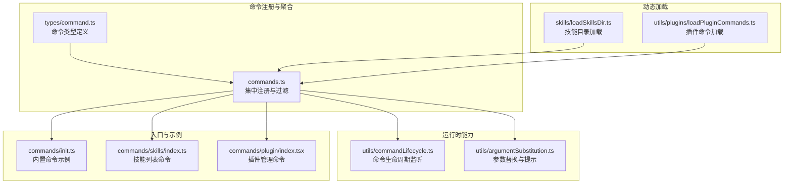
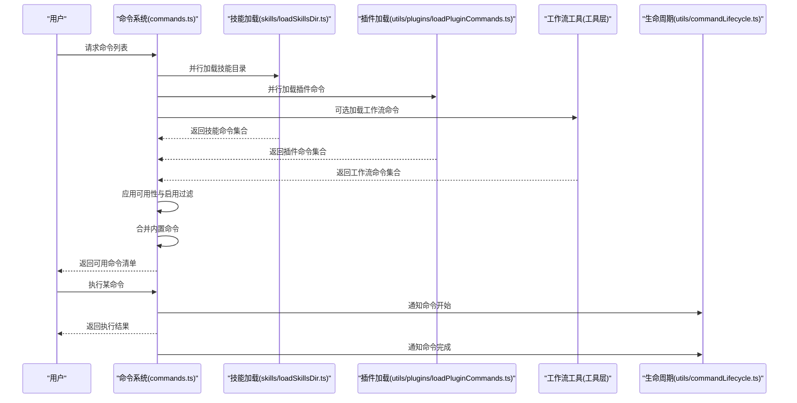
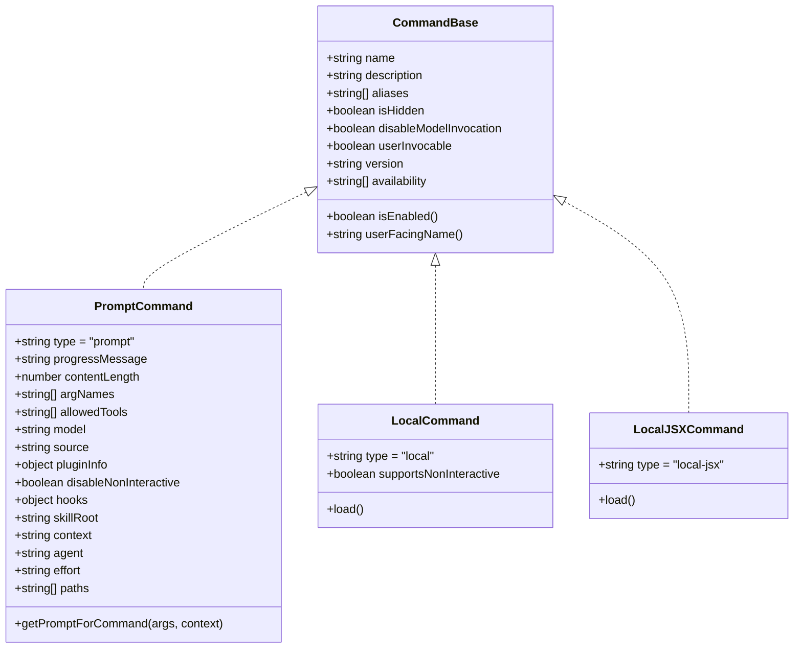
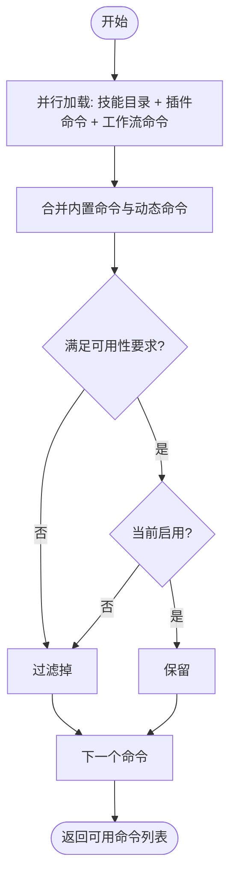
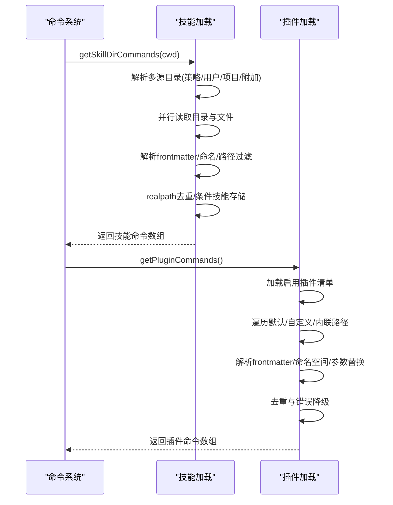
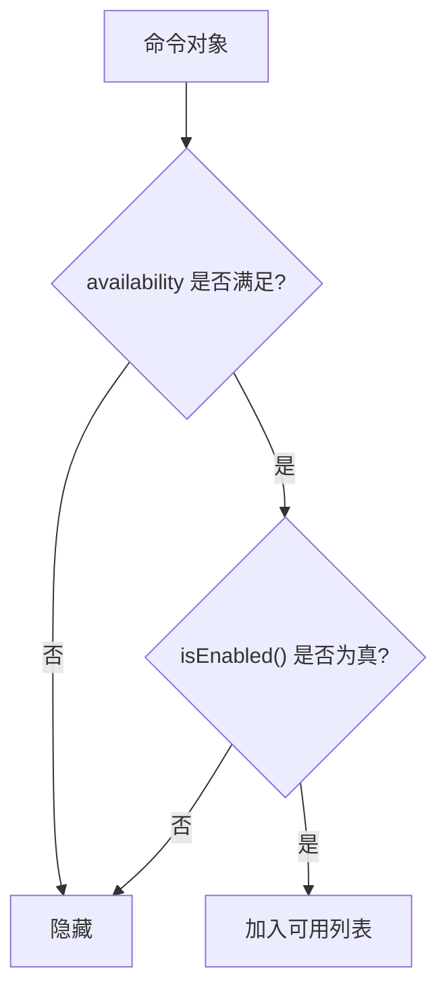
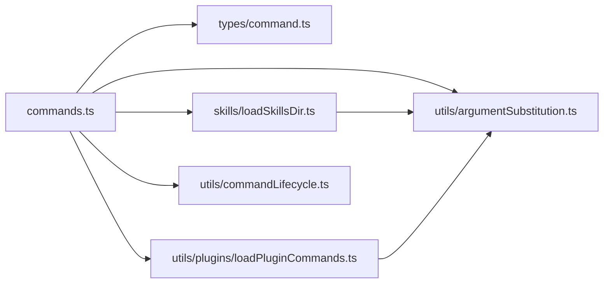

# 命令系统概述

<cite>
**本文档引用的文件**
- [commands.ts](file://commands.ts)
- [types/command.ts](file://types/command.ts)
- [utils/commandLifecycle.ts](file://utils/commandLifecycle.ts)
- [commands/init.ts](file://commands/init.ts)
- [commands/skills/index.ts](file://commands/skills/index.ts)
- [commands/plugin/index.tsx](file://commands/plugin/index.tsx)
- [skills/loadSkillsDir.ts](file://skills/loadSkillsDir.ts)
- [utils/plugins/loadPluginCommands.ts](file://utils/plugins/loadPluginCommands.ts)
- [utils/argumentSubstitution.ts](file://utils/argumentSubstitution.ts)
</cite>

## 目录
1. [引言](#引言)
2. [项目结构](#项目结构)
3. [核心组件](#核心组件)
4. [架构总览](#架构总览)
5. [详细组件分析](#详细组件分析)
6. [依赖关系分析](#依赖关系分析)
7. [性能考量](#性能考量)
8. [故障排查指南](#故障排查指南)
9. [结论](#结论)
10. [附录：扩展与自定义指南](#附录扩展与自定义指南)

## 引言
本文件系统性阐述命令系统的整体设计与实现，覆盖命令注册机制、生命周期管理、动态加载能力、可用性检查与权限控制、功能标志（Feature Flag）控制，以及扩展点与自定义命令开发方法。文档既面向初学者解释基本概念，也为高级开发者提供深入的技术细节与最佳实践。

## 项目结构
命令系统围绕统一的命令类型定义与集中式命令清单构建，支持多种来源的命令与技能：
- 内置命令：由命令目录导出，统一注册到命令清单中
- 插件命令：从已启用插件中动态加载
- 技能命令：来自本地/项目/策略设置下的技能目录，或插件技能
- 工作流命令：通过工具层生成的工作流命令（按特性开关启用）

**图表来源**
- [commands.ts:258-346](file://commands.ts#L258-L346)
- [types/command.ts:16-216](file://types/command.ts#L16-L216)
- [skills/loadSkillsDir.ts:638-800](file://skills/loadSkillsDir.ts#L638-L800)
- [utils/plugins/loadPluginCommands.ts:414-677](file://utils/plugins/loadPluginCommands.ts#L414-L677)
- [utils/commandLifecycle.ts:1-21](file://utils/commandLifecycle.ts#L1-L21)
- [utils/argumentSubstitution.ts:1-146](file://utils/argumentSubstitution.ts#L1-L146)
- [commands/init.ts:226-257](file://commands/init.ts#L226-L257)
- [commands/skills/index.ts:3-11](file://commands/skills/index.ts#L3-L11)
- [commands/plugin/index.tsx:1-11](file://commands/plugin/index.tsx#L1-L11)

**章节来源**
- [commands.ts:258-346](file://commands.ts#L258-L346)
- [types/command.ts:16-216](file://types/command.ts#L16-L216)

## 核心组件
- 命令类型与基元
  - 统一的命令接口定义，涵盖 prompt 型、本地型（local）、本地 JSX 命令（local-jsx），并提供可用性、启用状态、描述、别名、来源等元数据字段
- 命令注册与聚合
  - 集中式命令清单，按需懒加载与缓存，支持条件启用与可用性过滤
- 动态加载
  - 技能目录扫描与去重、插件命令解析与命名空间化、工作流命令生成
- 生命周期与可观测性
  - 命令生命周期监听器，便于外部订阅命令启动/完成事件
- 参数处理与提示
  - 支持 $ARGUMENTS/$0/$1 等占位符替换，支持命名参数映射与渐进式参数提示

**章节来源**
- [types/command.ts:16-216](file://types/command.ts#L16-L216)
- [commands.ts:449-517](file://commands.ts#L449-L517)
- [utils/commandLifecycle.ts:1-21](file://utils/commandLifecycle.ts#L1-L21)
- [utils/argumentSubstitution.ts:1-146](file://utils/argumentSubstitution.ts#L1-L146)

## 架构总览
命令系统采用“类型统一 + 多源聚合 + 条件过滤”的架构：
- 类型统一：所有命令遵循同一接口，保证调用一致性
- 多源聚合：内置命令、技能目录、插件命令、工作流命令统一汇聚
- 条件过滤：按可用性（认证/提供商环境）、启用状态（功能标志/环境变量）、动态技能激活进行筛选
- 懒加载与缓存：昂贵的磁盘 I/O 与动态导入通过 memoize 缓存，提升性能
- 运行时控制：支持远程模式安全命令白名单、桥接通道安全命令判定

**图表来源**
- [commands.ts:449-517](file://commands.ts#L449-L517)
- [skills/loadSkillsDir.ts:638-800](file://skills/loadSkillsDir.ts#L638-L800)
- [utils/plugins/loadPluginCommands.ts:414-677](file://utils/plugins/loadPluginCommands.ts#L414-L677)
- [utils/commandLifecycle.ts:16-21](file://utils/commandLifecycle.ts#L16-L21)

## 详细组件分析

### 命令类型与接口
- Prompt 命令：可被模型调用，支持内容长度估算、进度消息、路径过滤、上下文执行（内联/分叉）、代理类型、努力值、工具允许列表等
- Local 命令：在本地执行，返回文本或紧凑结果
- Local JSX 命令：延迟加载，渲染 UI 组件，适合重型依赖按需加载

**图表来源**
- [types/command.ts:16-216](file://types/command.ts#L16-L216)

**章节来源**
- [types/command.ts:16-216](file://types/command.ts#L16-L216)

### 命令注册与聚合
- 内置命令注册：集中导出并缓存，按特性开关与环境变量选择性加入
- 动态技能与插件：并行加载，去重与错误降级，支持策略限制与裸模式
- 合并与排序：内置命令前插入动态技能，确保优先级与可见性

**图表来源**
- [commands.ts:449-517](file://commands.ts#L449-L517)

**章节来源**
- [commands.ts:258-346](file://commands.ts#L258-L346)
- [commands.ts:449-517](file://commands.ts#L449-L517)

### 动态加载与去重
- 技能目录加载：支持策略设置、用户设置、项目设置、附加目录与历史兼容目录；按真实路径去重，避免符号链接与重复父目录导致的重复
- 插件命令加载：支持默认目录、自定义路径、单文件、内联内容；命名空间化以区分插件来源；对重复路径进行去重
- 条件技能：根据 frontmatter 的 paths 字段延迟激活，仅在匹配文件被触碰时显示

**图表来源**
- [skills/loadSkillsDir.ts:638-800](file://skills/loadSkillsDir.ts#L638-L800)
- [utils/plugins/loadPluginCommands.ts:414-677](file://utils/plugins/loadPluginCommands.ts#L414-L677)

**章节来源**
- [skills/loadSkillsDir.ts:638-800](file://skills/loadSkillsDir.ts#L638-L800)
- [utils/plugins/loadPluginCommands.ts:414-677](file://utils/plugins/loadPluginCommands.ts#L414-L677)

### 可用性检查与权限控制
- 可用性要求：基于认证/提供商环境（claude.ai 订阅者、Console 直连 API 用户等）进行静态过滤
- 启用状态：通过 isEnabled 回调与功能标志/环境变量动态决定是否启用
- 远程模式安全：提供 REMOTE_SAFE_COMMANDS 白名单，预过滤 REPL 渲染
- 桥接通道安全：通过 isBridgeSafeCommand 判定 prompt 命令（安全）与 local 命令白名单

**图表来源**
- [commands.ts:417-443](file://commands.ts#L417-L443)
- [types/command.ts:175-203](file://types/command.ts#L175-L203)

**章节来源**
- [commands.ts:417-443](file://commands.ts#L417-L443)
- [types/command.ts:175-203](file://types/command.ts#L175-L203)

### 命令生命周期管理
- 提供 setCommandLifecycleListener 与 notifyCommandLifecycle，用于订阅命令启动/完成事件
- 适用于外部模块统计、埋点或调试

**章节来源**
- [utils/commandLifecycle.ts:1-21](file://utils/commandLifecycle.ts#L1-L21)

### 参数处理与提示
- 参数解析：使用 shell-quote 安全解析参数字符串，支持引号包裹与转义
- 占位符替换：支持 $ARGUMENTS、$ARGUMENTS[n]、$n、命名参数（如 $foo）等
- 渐进式提示：根据已输入参数生成剩余参数提示

**章节来源**
- [utils/argumentSubstitution.ts:1-146](file://utils/argumentSubstitution.ts#L1-L146)

### 典型命令示例
- 内置命令示例：/init 命令根据特性开关选择不同提示内容
- 技能列表命令：/skills 展示可用技能
- 插件管理命令：/plugin 支持立即执行与别名

**章节来源**
- [commands/init.ts:226-257](file://commands/init.ts#L226-L257)
- [commands/skills/index.ts:3-11](file://commands/skills/index.ts#L3-L11)
- [commands/plugin/index.tsx:1-11](file://commands/plugin/index.tsx#L1-L11)

## 依赖关系分析
- 命令类型定义被命令系统与各加载模块共享
- 技能与插件加载模块依赖通用的 frontmatter 解析、参数替换、文件系统抽象与错误处理
- 命令系统依赖生命周期模块进行可观测性

**图表来源**
- [commands.ts:258-346](file://commands.ts#L258-L346)
- [types/command.ts:16-216](file://types/command.ts#L16-L216)
- [skills/loadSkillsDir.ts:638-800](file://skills/loadSkillsDir.ts#L638-L800)
- [utils/plugins/loadPluginCommands.ts:414-677](file://utils/plugins/loadPluginCommands.ts#L414-L677)
- [utils/commandLifecycle.ts:1-21](file://utils/commandLifecycle.ts#L1-L21)
- [utils/argumentSubstitution.ts:1-146](file://utils/argumentSubstitution.ts#L1-L146)

**章节来源**
- [commands.ts:258-346](file://commands.ts#L258-L346)
- [types/command.ts:16-216](file://types/command.ts#L16-L216)

## 性能考量
- 懒加载与缓存：命令列表与技能/插件加载均使用 memoize 缓存，避免重复 I/O 与动态导入
- 并行加载：技能目录、插件命令、工作流命令并行获取，缩短首屏可用时间
- 去重与降级：文件真实路径去重、错误捕获与降级，保证稳定性与性能
- 远程模式预过滤：减少不必要的本地命令暴露，降低渲染竞争

[本节为通用指导，无需特定文件引用]

## 故障排查指南
- 技能未显示
  - 检查 frontmatter 中的 user-invocable/disable-model-invocation/whenToUse 等字段
  - 确认 paths 前置条件是否满足（条件技能）
  - 查看日志中“跳过重复技能/解析失败”等提示
- 插件命令缺失
  - 确认插件已启用且 commandsPath/commandsPaths 存在
  - 检查自定义文件路径是否为 .md 文件且 frontmatter 正确
  - 关注加载错误日志
- 命令不可用
  - 检查 availability 与 isEnabled 的组合条件
  - 在远程模式下确认是否在 REMOTE_SAFE_COMMANDS 或 isBridgeSafeCommand 白名单中
- 参数替换异常
  - 使用 shell-quote 解析失败时会回退为空格分割，检查参数格式
  - 确保命名参数与 frontmatter 中 arguments 对应

**章节来源**
- [skills/loadSkillsDir.ts:638-800](file://skills/loadSkillsDir.ts#L638-L800)
- [utils/plugins/loadPluginCommands.ts:414-677](file://utils/plugins/loadPluginCommands.ts#L414-L677)
- [commands.ts:417-443](file://commands.ts#L417-L443)
- [utils/argumentSubstitution.ts:1-146](file://utils/argumentSubstitution.ts#L1-L146)

## 结论
该命令系统通过统一类型、多源聚合、条件过滤与懒加载缓存，实现了高扩展性与高性能。结合可用性检查、权限控制与生命周期观测，既能满足初学者的易用需求，也能为高级用户提供灵活的定制与扩展能力。

[本节为总结，无需特定文件引用]

## 附录：扩展与自定义指南

### 命令分类与特点
- 内置命令：稳定、基础功能，统一注册于命令清单
- 插件命令：来自已启用插件，支持命名空间化与元数据覆盖
- 技能命令：来自本地/项目/策略设置下的技能目录，支持条件显示与路径过滤
- 工作流命令：通过工具层生成，按特性开关启用

**章节来源**
- [commands.ts:401-406](file://commands.ts#L401-L406)
- [skills/loadSkillsDir.ts:638-800](file://skills/loadSkillsDir.ts#L638-L800)
- [utils/plugins/loadPluginCommands.ts:414-677](file://utils/plugins/loadPluginCommands.ts#L414-L677)

### 可用性检查与权限控制
- 可用性要求：通过 availability 字段声明适用的认证/提供商环境
- 启用状态：通过 isEnabled 回调与功能标志/环境变量控制
- 远程/桥接安全：通过白名单与类型判定保障远程执行安全

**章节来源**
- [types/command.ts:175-203](file://types/command.ts#L175-L203)
- [commands.ts:417-443](file://commands.ts#L417-L443)
- [commands.ts:619-676](file://commands.ts#L619-L676)

### 扩展点与自定义命令开发步骤
- 新增内置命令
  - 在命令目录新增命令文件，导出符合 Command 接口的对象
  - 在命令清单中引入并加入 COMMANDS 数组
  - 如需条件启用，提供 isEnabled 回调
- 新增技能命令
  - 在本地/项目/策略设置的 skills 目录下创建目录并编写 SKILL.md
  - 使用 frontmatter 配置描述、参数、工具允许列表、路径过滤等
  - 若为插件技能，放置于插件 skills 目录并确保命名空间正确
- 新增插件命令
  - 在插件 manifest 中配置 commandsPath/commandsPaths 或内联内容
  - 使用 frontmatter 定义命令行为与参数
  - 注意重复路径去重与错误降级
- 新增工作流命令
  - 按特性开关启用后，通过工具层生成命令并注入命令系统

**章节来源**
- [commands.ts:258-346](file://commands.ts#L258-L346)
- [skills/loadSkillsDir.ts:638-800](file://skills/loadSkillsDir.ts#L638-L800)
- [utils/plugins/loadPluginCommands.ts:414-677](file://utils/plugins/loadPluginCommands.ts#L414-L677)

### 示例：注册新命令、处理参数与返回结果
- 注册新命令
  - 参考内置命令示例：/init 的命令定义与描述生成逻辑
  - 参考插件命令：/plugin 的立即执行与别名配置
  - 参考技能命令：/skills 的本地 JSX 命令加载
- 处理命令参数
  - 使用参数解析与占位符替换工具，支持 $ARGUMENTS、$n、命名参数
  - 生成渐进式参数提示，提升交互体验
- 返回结果
  - Prompt 命令返回文本内容块
  - Local 命令返回文本或紧凑结果
  - Local JSX 命令返回 React 节点，适合复杂 UI

**章节来源**
- [commands/init.ts:226-257](file://commands/init.ts#L226-L257)
- [commands/plugin/index.tsx:1-11](file://commands/plugin/index.tsx#L1-L11)
- [commands/skills/index.ts:3-11](file://commands/skills/index.ts#L3-L11)
- [utils/argumentSubstitution.ts:1-146](file://utils/argumentSubstitution.ts#L1-L146)