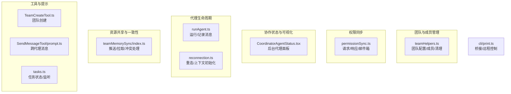
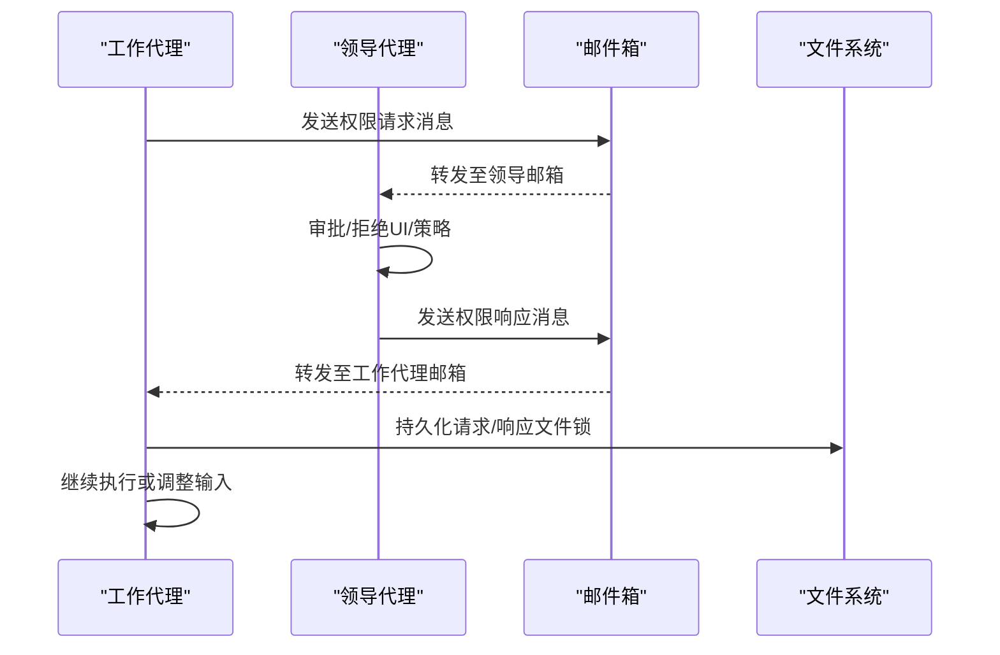
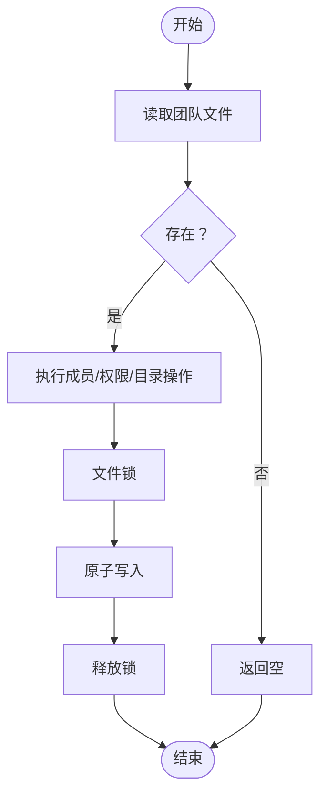
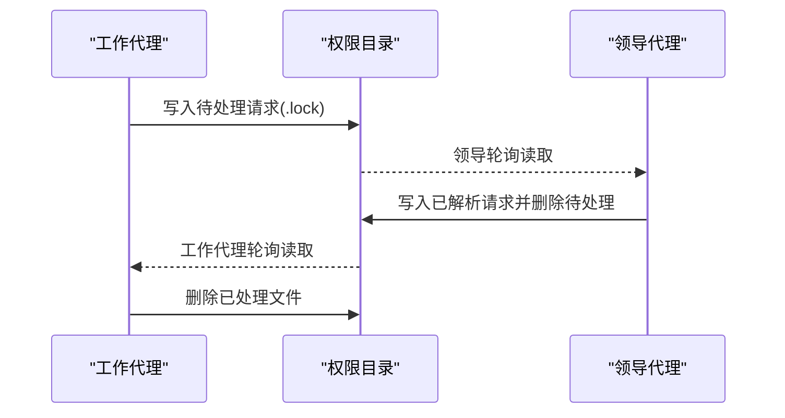
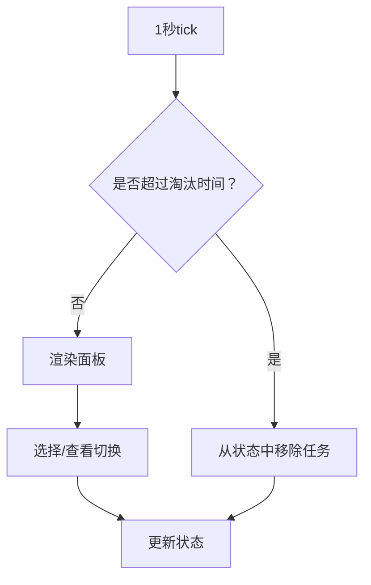
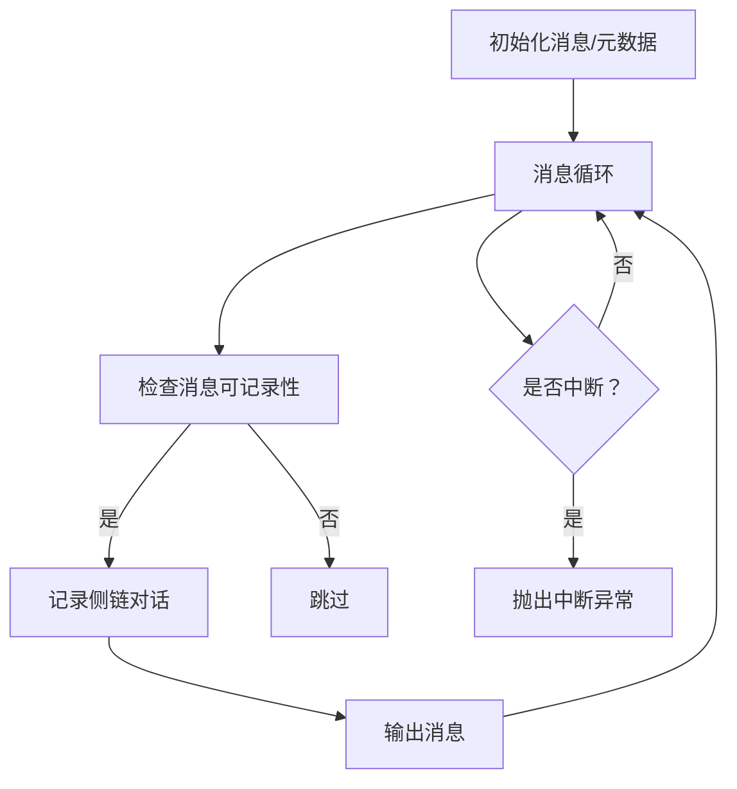
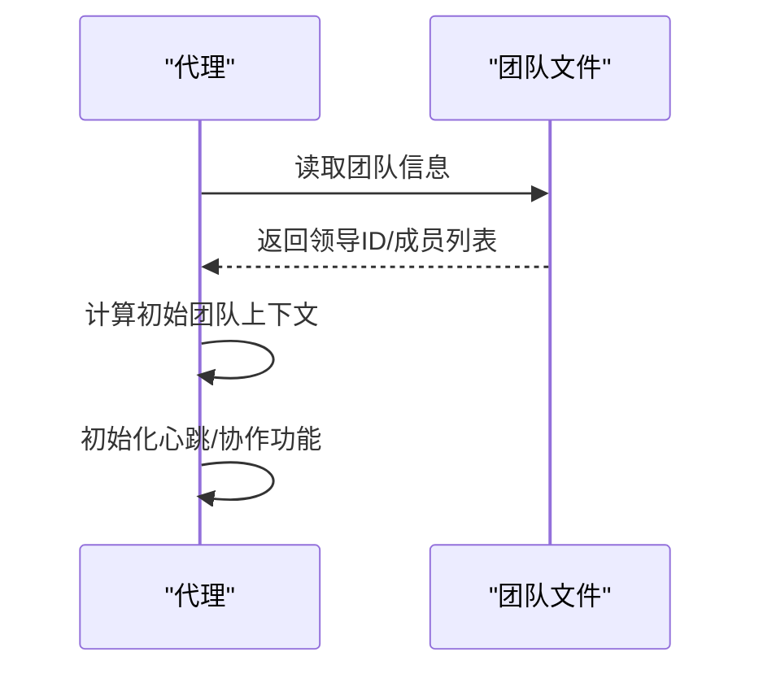
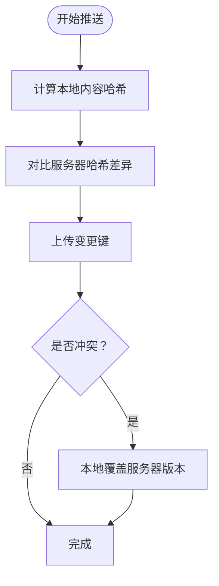
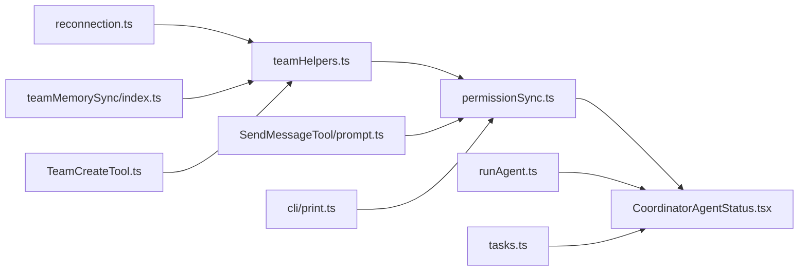

# 多代理协作机制

<cite>
**本文档引用的文件**
- [teamHelpers.ts](file://utils/swarm/teamHelpers.ts)
- [permissionSync.ts](file://utils/swarm/permissionSync.ts)
- [CoordinatorAgentStatus.tsx](file://components/CoordinatorAgentStatus.tsx)
- [runAgent.ts](file://tools/AgentTool/runAgent.ts)
- [reconnection.ts](file://utils/swarm/reconnection.ts)
- [teamMemorySync/index.ts](file://services/teamMemorySync/index.ts)
- [TeamCreateTool.ts](file://tools/TeamCreateTool/TeamCreateTool.ts)
- [prompt.ts](file://tools/TeamCreateTool/prompt.ts)
- [tasks.ts](file://utils/tasks.ts)
- [SendMessageTool/prompt.ts](file://tools/SendMessageTool/prompt.ts)
- [print.ts](file://cli/print.ts)
</cite>

## 目录
1. [引言](#引言)
2. [项目结构](#项目结构)
3. [核心组件](#核心组件)
4. [架构总览](#架构总览)
5. [详细组件分析](#详细组件分析)
6. [依赖关系分析](#依赖关系分析)
7. [性能考量](#性能考量)
8. [故障排查指南](#故障排查指南)
9. [结论](#结论)
10. [附录](#附录)

## 引言
本文件系统性阐述该代码库中“多代理协作机制”的设计原理与实现架构，覆盖代理的创建、管理、通信与权限协调，以及任务分配、状态同步、冲突解决与一致性保障。文档同时提供配置选项、自定义代理开发指南与典型应用场景，帮助开发者快速构建可扩展的智能协作系统。

## 项目结构
多代理协作相关能力主要分布在以下模块：
- 团队与成员管理：团队配置文件、成员增删改查、工作树清理、会话级回收
- 权限同步：跨代理的权限请求/响应、邮件箱路由、沙箱网络访问
- 协作状态与可视化：后台代理面板、任务计数与选择边界
- 代理生命周期：代理运行、消息记录、断线重连与上下文恢复
- 资源共享与一致性：团队内存推送/拉取、乐观锁与冲突处理
- 工具与提示：团队创建工具、消息发送工具、任务列表与状态查询

**图表来源**
- [teamHelpers.ts:1-684](file://utils/swarm/teamHelpers.ts#L1-L684)
- [permissionSync.ts:1-929](file://utils/swarm/permissionSync.ts#L1-L929)
- [CoordinatorAgentStatus.tsx:1-273](file://components/CoordinatorAgentStatus.tsx#L1-L273)
- [runAgent.ts:732-810](file://tools/AgentTool/runAgent.ts#L732-L810)
- [reconnection.ts:36-89](file://utils/swarm/reconnection.ts#L36-L89)
- [teamMemorySync/index.ts:862-893](file://services/teamMemorySync/index.ts#L862-L893)
- [TeamCreateTool.ts:74-94](file://tools/TeamCreateTool/TeamCreateTool.ts#L74-L94)
- [SendMessageTool/prompt.ts:1-34](file://tools/SendMessageTool/prompt.ts#L1-L34)
- [tasks.ts:27-806](file://utils/tasks.ts#L27-L806)
- [print.ts:3951-4014](file://cli/print.ts#L3951-L4014)

**章节来源**
- [teamHelpers.ts:1-684](file://utils/swarm/teamHelpers.ts#L1-L684)
- [permissionSync.ts:1-929](file://utils/swarm/permissionSync.ts#L1-L929)
- [CoordinatorAgentStatus.tsx:1-273](file://components/CoordinatorAgentStatus.tsx#L1-L273)
- [runAgent.ts:732-810](file://tools/AgentTool/runAgent.ts#L732-L810)
- [reconnection.ts:36-89](file://utils/swarm/reconnection.ts#L36-L89)
- [teamMemorySync/index.ts:862-893](file://services/teamMemorySync/index.ts#L862-L893)
- [TeamCreateTool.ts:74-94](file://tools/TeamCreateTool/TeamCreateTool.ts#L74-L94)
- [SendMessageTool/prompt.ts:1-34](file://tools/SendMessageTool/prompt.ts#L1-L34)
- [tasks.ts:27-806](file://utils/tasks.ts#L27-L806)
- [print.ts:3951-4014](file://cli/print.ts#L3951-L4014)

## 核心组件
- 团队配置与成员管理：提供团队文件读写、成员增删、权限模式批量更新、活跃状态标记、工作树销毁与目录清理等能力，确保团队生命周期内资源有序管理。
- 权限同步系统：通过文件锁与邮件箱实现跨代理的权限请求/响应，支持沙箱网络访问审批，具备过期清理与原子写入保障。
- 协作状态面板：渲染后台代理任务列表，支持可见性控制、选择与查看切换、时间统计与消息队列显示。
- 代理运行与消息记录：代理运行循环中记录侧链对话、持续维护父链连续性，支持中断与异常处理。
- 断线重连与上下文恢复：基于团队文件计算初始上下文，恢复心跳与协作功能。
- 团队内存一致性：推送采用乐观锁与差异上传，冲突时本地优先并记录反馈；拉取采用增量哈希校验。
- 工具与提示：团队创建工具与消息发送工具提供协作入口与跨会话通信能力。

**章节来源**
- [teamHelpers.ts:19-94](file://utils/swarm/teamHelpers.ts#L19-L94)
- [permissionSync.ts:49-106](file://utils/swarm/permissionSync.ts#L49-L106)
- [CoordinatorAgentStatus.tsx:34-76](file://components/CoordinatorAgentStatus.tsx#L34-L76)
- [runAgent.ts:732-810](file://tools/AgentTool/runAgent.ts#L732-L810)
- [reconnection.ts:36-65](file://utils/swarm/reconnection.ts#L36-L65)
- [teamMemorySync/index.ts:862-893](file://services/teamMemorySync/index.ts#L862-L893)
- [TeamCreateTool.ts:74-94](file://tools/TeamCreateTool/TeamCreateTool.ts#L74-L94)
- [SendMessageTool/prompt.ts:1-34](file://tools/SendMessageTool/prompt.ts#L1-L34)

## 架构总览
多代理协作以“团队配置文件”为中心，围绕以下关键流程展开：
- 团队创建与成员加入：生成唯一团队名、写入团队配置、设置任务列表ID、注册会话清理。
- 代理运行与消息记录：代理运行循环中记录侧链对话，维护父链连续性，支持进度与中断。
- 权限请求与响应：工作代理通过邮件箱向领导代理提交权限请求，领导代理审批后回传结果。
- 状态同步与可视化：后台面板按可见性与时间维度展示代理任务，支持选择与查看。
- 冲突解决与一致性：团队内存推送采用乐观锁与差异上传，冲突时本地优先；拉取采用哈希校验。
- 断线重连：根据团队文件计算初始上下文，恢复心跳与协作功能。

**图表来源**
- [permissionSync.ts:676-722](file://utils/swarm/permissionSync.ts#L676-L722)
- [permissionSync.ts:734-783](file://utils/swarm/permissionSync.ts#L734-L783)

**章节来源**
- [permissionSync.ts:644-783](file://utils/swarm/permissionSync.ts#L644-L783)

## 详细组件分析

### 团队配置与成员管理
- 数据模型：团队文件包含名称、描述、创建时间、领导代理ID、成员数组（含代理ID、名称、类型、模型、颜色、计划模式需求、加入时间、tmux窗格ID、工作目录、工作树路径、会话ID、订阅、后端类型、活跃状态、权限模式等）。
- 关键操作：
  - 读写团队文件：同步/异步读取与写入，失败时记录调试日志。
  - 成员管理：按ID/名称移除成员、按窗格ID移除成员、设置成员权限模式、批量设置权限模式、设置成员活跃状态。
  - 目录清理：销毁工作树、删除团队目录与任务目录，注册会话清理并在退出时统一回收。
- 设计要点：使用文件锁与原子写入避免并发冲突；对非存在错误进行容错处理；清理阶段先杀进程后删目录，防止孤儿进程。

**图表来源**
- [teamHelpers.ts:126-182](file://utils/swarm/teamHelpers.ts#L126-L182)
- [teamHelpers.ts:184-348](file://utils/swarm/teamHelpers.ts#L184-L348)
- [teamHelpers.ts:572-683](file://utils/swarm/teamHelpers.ts#L572-L683)

**章节来源**
- [teamHelpers.ts:64-90](file://utils/swarm/teamHelpers.ts#L64-L90)
- [teamHelpers.ts:126-182](file://utils/swarm/teamHelpers.ts#L126-L182)
- [teamHelpers.ts:184-348](file://utils/swarm/teamHelpers.ts#L184-L348)
- [teamHelpers.ts:572-683](file://utils/swarm/teamHelpers.ts#L572-L683)

### 权限同步系统
- 请求/响应数据结构：包含请求ID、工作代理ID/名称/颜色、团队名、工具名、原始toolUseID、描述、序列化输入、建议规则、状态、解析者、解析时间、反馈、更新输入、权限更新、创建时间等。
- 存储与路由：
  - 文件锁：使用目录级锁确保原子写入。
  - 邮件箱：通过邮件箱消息封装请求/响应，自动路由到目标代理邮箱。
  - 过期清理：定期清理已解析的旧文件，避免磁盘膨胀。
- 流程：
  - 工作代理：生成请求、写入待处理、轮询解析结果、删除已处理文件。
  - 领导代理：读取待处理列表、审批/拒绝、写入已解析、通知工作代理。
- 沙箱网络访问：独立ID生成与邮件箱发送，支持网络访问审批。

**图表来源**
- [permissionSync.ts:214-250](file://utils/swarm/permissionSync.ts#L214-L250)
- [permissionSync.ts:256-312](file://utils/swarm/permissionSync.ts#L256-L312)
- [permissionSync.ts:360-443](file://utils/swarm/permissionSync.ts#L360-L443)
- [permissionSync.ts:544-564](file://utils/swarm/permissionSync.ts#L544-L564)

**章节来源**
- [permissionSync.ts:49-106](file://utils/swarm/permissionSync.ts#L49-L106)
- [permissionSync.ts:214-250](file://utils/swarm/permissionSync.ts#L214-L250)
- [permissionSync.ts:256-312](file://utils/swarm/permissionSync.ts#L256-L312)
- [permissionSync.ts:360-443](file://utils/swarm/permissionSync.ts#L360-L443)
- [permissionSync.ts:544-564](file://utils/swarm/permissionSync.ts#L544-L564)
- [permissionSync.ts:676-722](file://utils/swarm/permissionSync.ts#L676-L722)
- [permissionSync.ts:734-783](file://utils/swarm/permissionSync.ts#L734-L783)

### 协作状态与可视化
- 后台代理面板：在提示输入下方渲染后台代理任务列表，支持可见性控制、选择与查看切换、时间统计、令牌计数与排队消息显示。
- 可见性与淘汰：基于时间戳的淘汰机制，每秒tick刷新；点击进入/退出团队视图。
- 计数与边界：提供可见任务数量计算，避免时间漂移导致的计数不一致。

**图表来源**
- [CoordinatorAgentStatus.tsx:45-63](file://components/CoordinatorAgentStatus.tsx#L45-L63)
- [CoordinatorAgentStatus.tsx:34-76](file://components/CoordinatorAgentStatus.tsx#L34-L76)
- [CoordinatorAgentStatus.tsx:83-88](file://components/CoordinatorAgentStatus.tsx#L83-L88)

**章节来源**
- [CoordinatorAgentStatus.tsx:31-88](file://components/CoordinatorAgentStatus.tsx#L31-L88)

### 代理运行与消息记录
- 运行循环：记录初始消息、写入代理元数据（类型、工作树路径、描述），在消息记录成功后才输出消息，保持父链连续性。
- 中断处理：检测中断信号并抛出异常，确保运行终止。
- 侧链对话：仅记录可记录消息，避免重复或无效消息影响父链。

**图表来源**
- [runAgent.ts:732-810](file://tools/AgentTool/runAgent.ts#L732-L810)

**章节来源**
- [runAgent.ts:732-810](file://tools/AgentTool/runAgent.ts#L732-L810)

### 断线重连与上下文恢复
- 初始上下文：从团队文件读取领导代理ID、团队路径，判断是否为领导，构造团队上下文。
- 会话恢复：从会话中初始化团队上下文，确保心跳与其他协作功能正常工作。

**图表来源**
- [reconnection.ts:36-65](file://utils/swarm/reconnection.ts#L36-L65)
- [reconnection.ts:75-89](file://utils/swarm/reconnection.ts#L75-L89)

**章节来源**
- [reconnection.ts:36-89](file://utils/swarm/reconnection.ts#L36-L89)

### 团队内存一致性
- 推送策略：差异上传（仅内容哈希不同的键），冲突时采用本地优先，服务端仅新键传播由下次拉取合并。
- 拉取策略：增量哈希校验，避免无谓传输与覆盖。

**图表来源**
- [teamMemorySync/index.ts:862-893](file://services/teamMemorySync/index.ts#L862-L893)

**章节来源**
- [teamMemorySync/index.ts:862-893](file://services/teamMemorySync/index.ts#L862-L893)

### 工具与提示
- 团队创建工具：支持指定团队名、描述与领导代理类型，生成唯一团队名，启用后可用于主动创建多代理协作团队。
- 消息发送工具：支持向同团队成员或广播发送消息，跨会话通信可通过邮件箱路由。
- 任务状态：提供任务状态查询与监听，支持基于任务所有权推导代理状态（空闲/忙碌）。

**章节来源**
- [TeamCreateTool.ts:74-94](file://tools/TeamCreateTool/TeamCreateTool.ts#L74-L94)
- [prompt.ts:1-20](file://tools/TeamCreateTool/prompt.ts#L1-L20)
- [SendMessageTool/prompt.ts:1-34](file://tools/SendMessageTool/prompt.ts#L1-L34)
- [tasks.ts:755-798](file://utils/tasks.ts#L755-L798)

## 依赖关系分析
- 团队管理依赖环境变量与文件系统，提供同步/异步IO接口与错误码处理。
- 权限同步依赖邮件箱与文件锁，确保原子写入与消息路由。
- 协作状态依赖应用状态与终端尺寸，提供可见性与选择边界。
- 代理运行依赖消息记录与中断控制，保证父链连续性。
- 内存同步依赖哈希校验与乐观锁，平衡一致性与性能。
- 工具与提示依赖团队文件与任务系统，提供协作入口与状态查询。

**图表来源**
- [teamHelpers.ts:1-684](file://utils/swarm/teamHelpers.ts#L1-L684)
- [permissionSync.ts:1-929](file://utils/swarm/permissionSync.ts#L1-L929)
- [CoordinatorAgentStatus.tsx:1-273](file://components/CoordinatorAgentStatus.tsx#L1-L273)
- [runAgent.ts:732-810](file://tools/AgentTool/runAgent.ts#L732-L810)
- [reconnection.ts:36-89](file://utils/swarm/reconnection.ts#L36-L89)
- [teamMemorySync/index.ts:862-893](file://services/teamMemorySync/index.ts#L862-L893)
- [TeamCreateTool.ts:74-94](file://tools/TeamCreateTool/TeamCreateTool.ts#L74-L94)
- [SendMessageTool/prompt.ts:1-34](file://tools/SendMessageTool/prompt.ts#L1-L34)
- [tasks.ts:27-806](file://utils/tasks.ts#L27-L806)
- [print.ts:3951-4014](file://cli/print.ts#L3951-L4014)

**章节来源**
- [teamHelpers.ts:1-684](file://utils/swarm/teamHelpers.ts#L1-L684)
- [permissionSync.ts:1-929](file://utils/swarm/permissionSync.ts#L1-L929)
- [CoordinatorAgentStatus.tsx:1-273](file://components/CoordinatorAgentStatus.tsx#L1-L273)
- [runAgent.ts:732-810](file://tools/AgentTool/runAgent.ts#L732-L810)
- [reconnection.ts:36-89](file://utils/swarm/reconnection.ts#L36-L89)
- [teamMemorySync/index.ts:862-893](file://services/teamMemorySync/index.ts#L862-L893)
- [TeamCreateTool.ts:74-94](file://tools/TeamCreateTool/TeamCreateTool.ts#L74-L94)
- [SendMessageTool/prompt.ts:1-34](file://tools/SendMessageTool/prompt.ts#L1-L34)
- [tasks.ts:27-806](file://utils/tasks.ts#L27-L806)
- [print.ts:3951-4014](file://cli/print.ts#L3951-L4014)

## 性能考量
- 原子写入与文件锁：权限请求/响应采用目录级锁，避免竞态与部分写入。
- 差异上传：团队内存推送仅传输变更键，降低带宽与IO压力。
- 过期清理：定期清理旧解析文件，控制文件数量与磁盘占用。
- 1秒tick：协作面板每秒刷新一次，平衡实时性与开销。
- 并发清理：会话结束时并行杀死面板代理窗格与删除目录，缩短关闭时间。

**章节来源**
- [permissionSync.ts:214-250](file://utils/swarm/permissionSync.ts#L214-L250)
- [teamMemorySync/index.ts:862-893](file://services/teamMemorySync/index.ts#L862-L893)
- [CoordinatorAgentStatus.tsx:45-63](file://components/CoordinatorAgentStatus.tsx#L45-L63)
- [teamHelpers.ts:576-590](file://utils/swarm/teamHelpers.ts#L576-L590)

## 故障排查指南
- 权限请求未响应：
  - 检查邮件箱路由与目标代理邮箱是否存在。
  - 查看待处理/已解析目录是否存在且可读写。
  - 确认文件锁是否被正确释放。
- 代理无法记录消息：
  - 确认消息可记录性判断逻辑与父链UUID更新。
  - 检查中断信号处理与异常捕获。
- 团队清理失败：
  - 确认工作树路径与主仓库路径解析。
  - 检查rm命令权限与目录是否存在。
- 断线重连失败：
  - 确认团队文件读取成功与领导ID有效。
  - 检查会话恢复函数调用顺序。

**章节来源**
- [permissionSync.ts:256-312](file://utils/swarm/permissionSync.ts#L256-L312)
- [runAgent.ts:792-810](file://tools/AgentTool/runAgent.ts#L792-L810)
- [teamHelpers.ts:492-551](file://utils/swarm/teamHelpers.ts#L492-L551)
- [reconnection.ts:36-65](file://utils/swarm/reconnection.ts#L36-L65)

## 结论
该多代理协作机制通过团队配置文件、权限同步、邮件箱路由、状态面板与内存一致性策略，实现了高可用、可扩展的智能协作系统。其设计强调原子性、一致性与可观测性，适合复杂任务场景下的并行协作与资源管理。

## 附录
- 配置选项与自定义指南：
  - 团队创建：通过团队创建工具指定团队名、描述与领导代理类型，系统自动生成唯一名称并写入团队配置。
  - 权限模式：支持单个/批量成员权限模式设置，避免竞态。
  - 活跃状态：代理在空闲/忙碌间切换，便于任务调度与资源分配。
  - 跨会话通信：通过消息发送工具与邮件箱实现跨会话消息传递。
- 典型应用场景：
  - 复杂任务分解：前端/后端/测试并行推进，任务依赖与状态同步。
  - 资源共享：团队内存差异上传，冲突时本地优先，确保工作不丢失。
  - 远程协作：桥接/远程控制通道，支持跨机器会话与权限审批。

**章节来源**
- [TeamCreateTool.ts:74-94](file://tools/TeamCreateTool/TeamCreateTool.ts#L74-L94)
- [prompt.ts:1-20](file://tools/TeamCreateTool/prompt.ts#L1-L20)
- [teamHelpers.ts:415-445](file://utils/swarm/teamHelpers.ts#L415-L445)
- [tasks.ts:755-798](file://utils/tasks.ts#L755-L798)
- [SendMessageTool/prompt.ts:1-34](file://tools/SendMessageTool/prompt.ts#L1-L34)
- [print.ts:3951-4014](file://cli/print.ts#L3951-L4014)