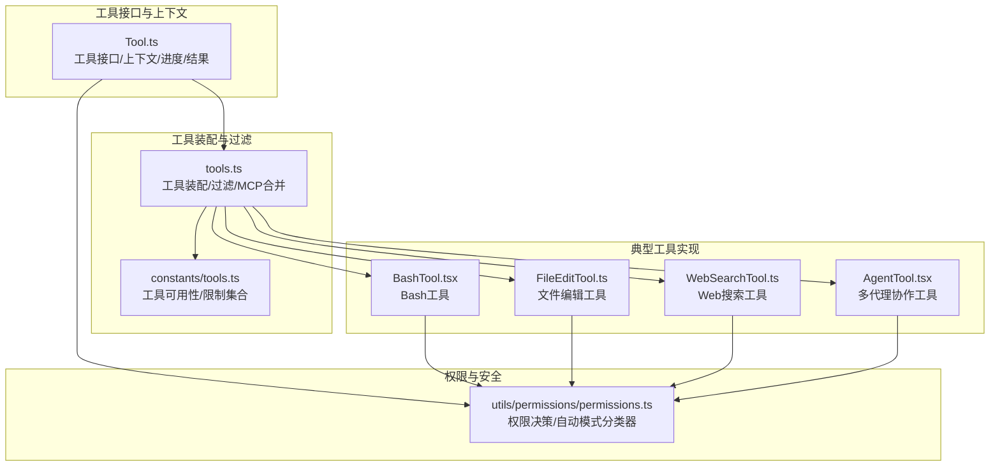
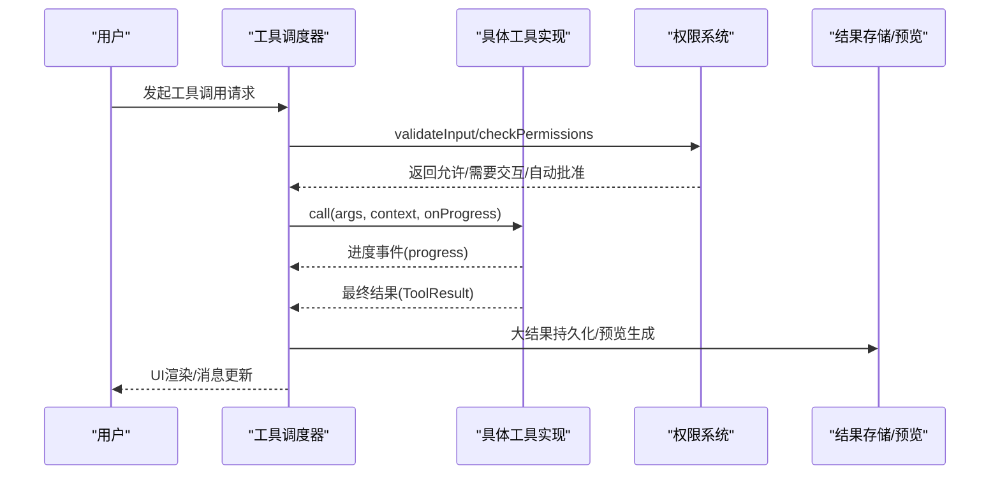
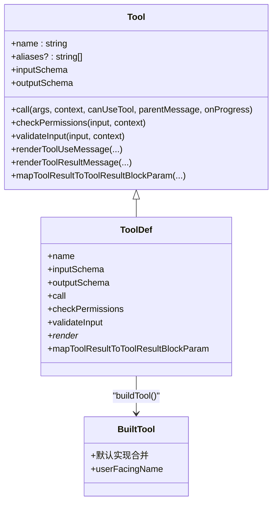
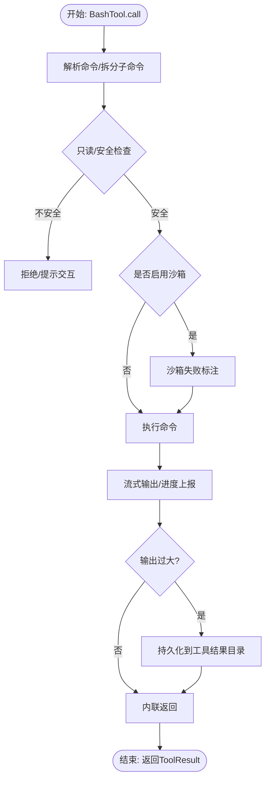
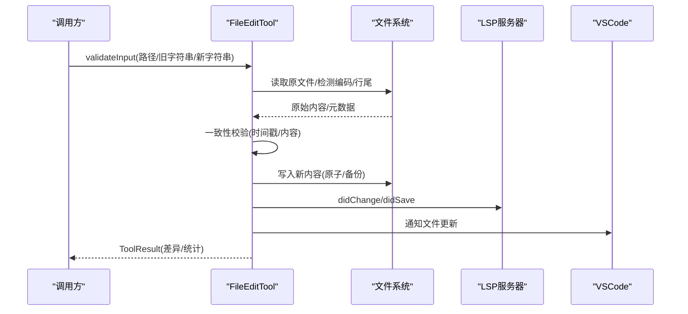
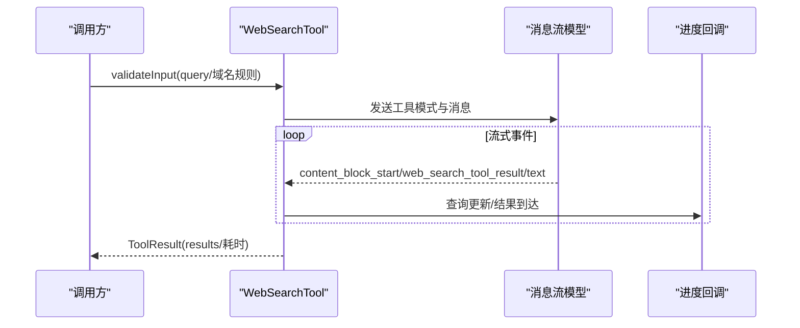
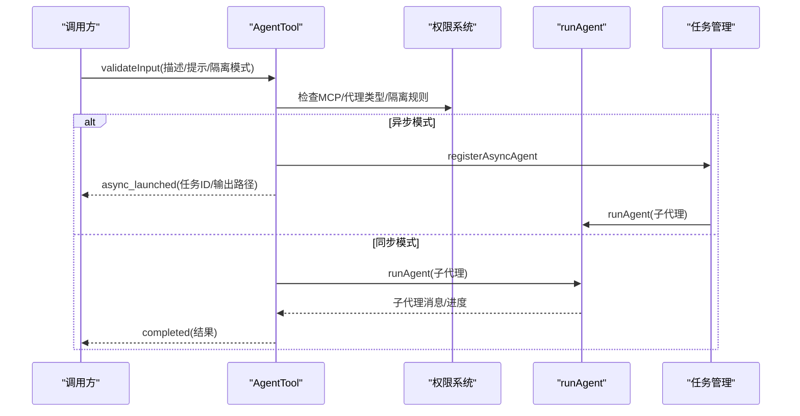
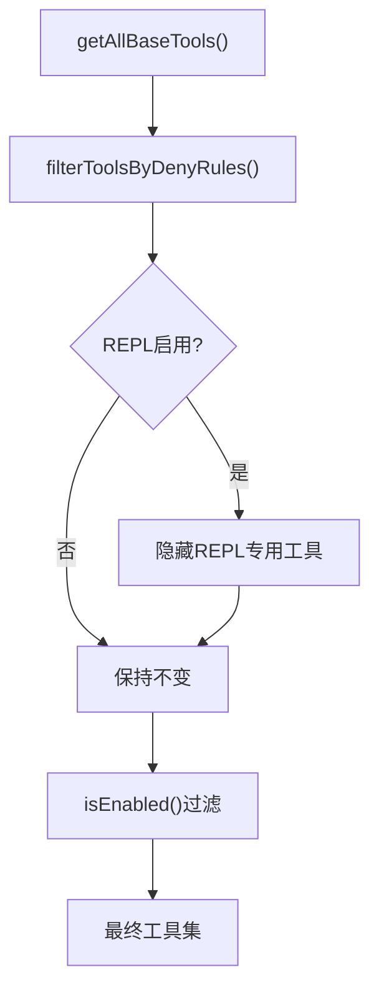
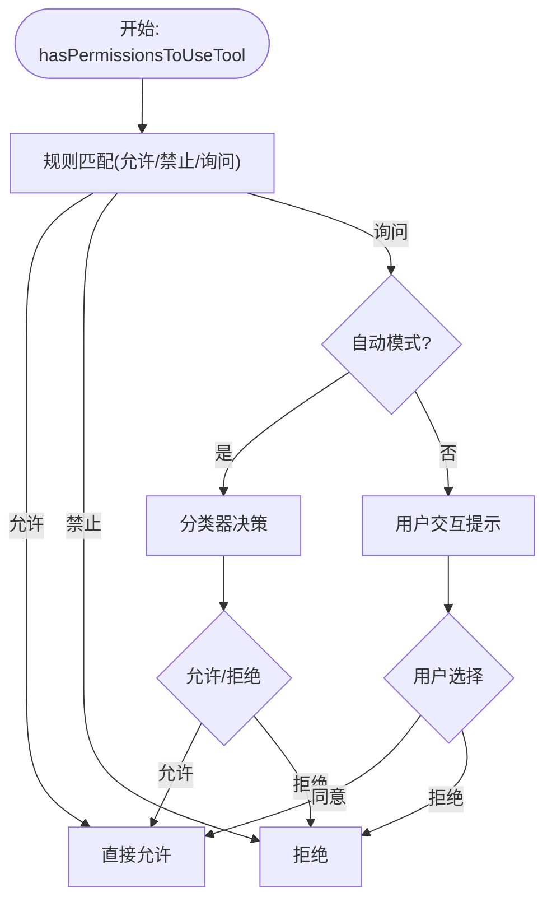
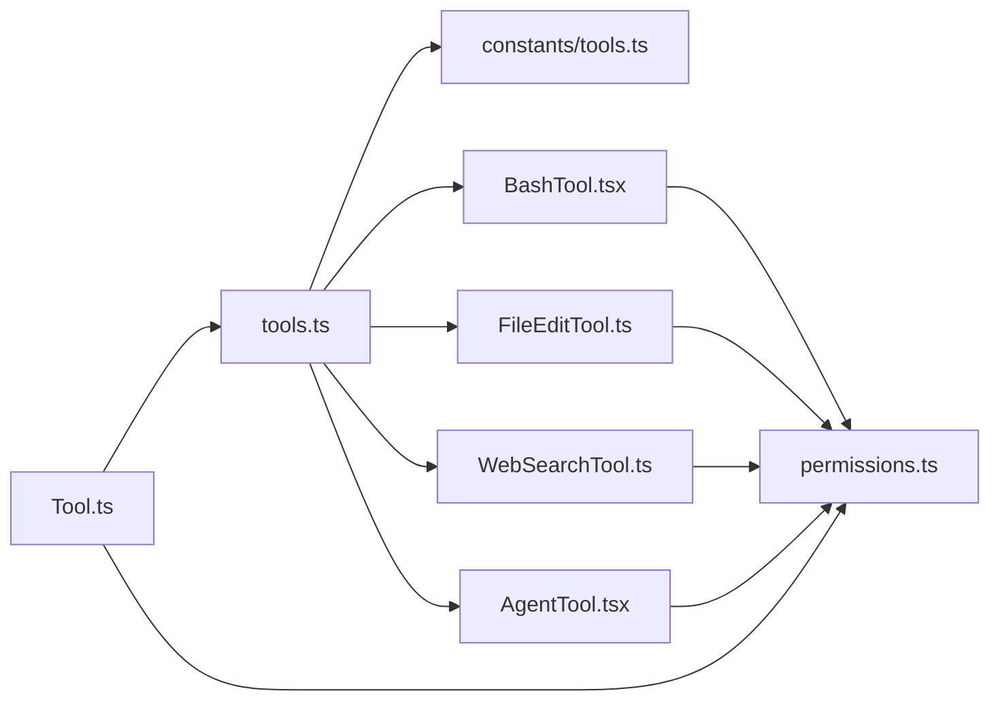

# 工具系统概述

<cite>
**本文档引用的文件**
- [Tool.ts](file://Tool.ts)
- [tools.ts](file://tools.ts)
- [constants/tools.ts](file://constants/tools.ts)
- [FileEditTool.ts](file://tools/FileEditTool/FileEditTool.ts)
- [WebSearchTool.ts](file://tools/WebSearchTool/WebSearchTool.ts)
- [BashTool.tsx](file://tools/BashTool/BashTool.tsx)
- [AgentTool.tsx](file://tools/AgentTool/AgentTool.tsx)
- [permissions.ts](file://utils/permissions/permissions.ts)
</cite>

## 目录
1. [简介](#简介)
2. [项目结构](#项目结构)
3. [核心组件](#核心组件)
4. [架构总览](#架构总览)
5. [详细组件分析](#详细组件分析)
6. [依赖关系分析](#依赖关系分析)
7. [性能考虑](#性能考虑)
8. [故障排除指南](#故障排除指南)
9. [结论](#结论)
10. [附录](#附录)

## 简介
本文件为工具系统的综合性概述，面向不同经验水平的开发者，系统阐述工具系统的架构设计、接口规范、执行流程与结果处理机制，并覆盖工具分类（如 Bash 工具、文件编辑工具、Web 搜索工具、多代理协作工具等）、安全机制与权限控制、沙箱隔离策略、最佳实践与扩展指南。文档通过图示与分层讲解帮助读者快速理解并高效使用与扩展该工具体系。

## 项目结构
工具系统围绕统一的工具接口抽象构建，所有内置工具通过集中装配函数统一注册与过滤，配合权限上下文与 MCP 工具池进行动态组合。核心目录与文件如下：
- 工具接口与上下文：Tool.ts 定义工具抽象、调用上下文、进度与结果类型
- 工具装配与过滤：tools.ts 提供工具集合装配、按权限规则过滤、MCP 工具合并
- 工具常量与可用性限制：constants/tools.ts 定义各类工具的可用范围与限制集合
- 典型工具实现：各工具目录下的具体实现（如 BashTool、FileEditTool、WebSearchTool、AgentTool）
- 权限与安全：utils/permissions/permissions.ts 实现权限决策、自动模式分类器、拒绝追踪与提示

图表来源
- [Tool.ts](file://Tool.ts)
- [tools.ts](file://tools.ts)
- [constants/tools.ts](file://constants/tools.ts)
- [BashTool.tsx](file://tools/BashTool/BashTool.tsx)
- [FileEditTool.ts](file://tools/FileEditTool/FileEditTool.ts)
- [WebSearchTool.ts](file://tools/WebSearchTool/WebSearchTool.ts)
- [AgentTool.tsx](file://tools/AgentTool/AgentTool.tsx)
- [permissions.ts](file://utils/permissions/permissions.ts)

章节来源
- [Tool.ts](file://Tool.ts)
- [tools.ts](file://tools.ts)
- [constants/tools.ts](file://constants/tools.ts)

## 核心组件
- 工具接口与抽象
  - 工具类型定义：名称、别名、输入输出模式、并发安全、只读/破坏性标记、权限检查、描述生成、UI 渲染、结果映射等
  - 构建器：buildTool 提供默认实现，确保一致性与安全性
  - 上下文：ToolUseContext 提供运行时环境（命令、调试、模型、MCP 客户端、会话状态、权限上下文等）
  - 进度与结果：ToolProgress、ToolResult、ToolProgressData 等类型支撑工具执行过程可视化与结果持久化
- 工具集合与装配
  - getAllBaseTools/getTools：按环境与权限规则生成基础工具集
  - assembleToolPool/getMergedTools：合并内置工具与 MCP 工具，去重并保持提示缓存稳定
  - 过滤器：按权限规则与 REPL 模式隐藏/暴露工具
- 权限与安全
  - 权限上下文：ToolPermissionContext 统一承载权限模式、额外工作目录、允许/禁止/询问规则
  - 决策流程：规则匹配、Hook 钩子、自动模式分类器、拒绝追踪与降级策略
  - 沙箱与隔离：Bash 工具的沙箱开关、工作树隔离、远程隔离等

章节来源
- [Tool.ts](file://Tool.ts)
- [tools.ts](file://tools.ts)
- [permissions.ts](file://utils/permissions/permissions.ts)

## 架构总览
工具系统采用“统一接口 + 动态装配 + 权限驱动”的架构。工具实现遵循统一接口，通过装配函数集中注册；运行时根据权限上下文与 MCP 工具池动态组合；权限系统贯穿输入校验、权限检查、自动模式分类器与 UI 提示，形成闭环。

图表来源
- [Tool.ts](file://Tool.ts)
- [tools.ts](file://tools.ts)
- [permissions.ts](file://utils/permissions/permissions.ts)

## 详细组件分析

### 工具接口与构建器
- 接口要点
  - 输入/输出模式：通过 Zod 模式或 JSON Schema 描述参数与返回值
  - 并发安全与只读/破坏性：isConcurrencySafe/isReadOnly/isDestructive 控制 UI 与安全策略
  - 权限与校验：validateInput/checkPermissions 两阶段决策
  - UI 与可观察性：renderToolUseMessage/renderToolResultMessage 等负责界面渲染；backfillObservableInput 用于补充可观测输入
  - 结果映射：mapToolResultToToolResultBlockParam 将内部结果映射为模型可见块
- 构建器
  - buildTool 合并默认实现（如默认允许、非并发安全、非只读、非破坏性、默认权限放行等），避免重复样板代码

图表来源
- [Tool.ts](file://Tool.ts)

章节来源
- [Tool.ts](file://Tool.ts)

### Bash 工具（Shell 执行）
- 功能特性
  - 命令解析与只读约束检查、搜索/读取/列表命令识别、静默命令判定
  - 自动后台化策略、阻塞长任务提示、睡眠命令检测
  - 输出截断与图像输出处理、大结果持久化与预览
  - 沙箱失败标注、代码索引工具检测、CLAUDE CODE 提示注入剥离
- 安全与权限
  - 权限匹配器基于子命令拆分，支持通配符与前缀匹配
  - 可配置禁用沙箱（危险覆盖）与背景任务开关
- UI 与进度
  - 流式进度事件、后台任务通知、错误语义化

图表来源
- [BashTool.tsx](file://tools/BashTool/BashTool.tsx)

章节来源
- [BashTool.tsx](file://tools/BashTool/BashTool.tsx)

### 文件编辑工具（FileEditTool）
- 功能特性
  - 路径规范化、大小限制、编码检测、行尾处理
  - 读写一致性校验（时间戳/内容一致性）、变更统计、VSCode 通知、LSP 诊断清理与保存
  - 设置文件安全校验、笔记文件专用工具提示、技能目录发现与激活
- 安全与权限
  - 文件系统写权限检查、UNC 路径安全处理、团队内存文件敏感信息防护
- UI 与结果
  - 差异展示、结构化补丁、用户修改标记、Git Diff 收集（可选）

图表来源
- [FileEditTool.ts](file://tools/FileEditTool/FileEditTool.ts)

章节来源
- [FileEditTool.ts](file://tools/FileEditTool/FileEditTool.ts)

### Web 搜索工具（WebSearchTool）
- 功能特性
  - 基于模型的消息流执行，支持域名白名单/黑名单、最大使用次数限制
  - 流式进度事件（查询更新/结果到达）、结果聚合与文本摘要混合
  - 输出格式化与链接列表生成、结果持久化与预览
- 权限与可用性
  - 不同提供商/模型支持情况动态启用、权限建议（添加规则）
- UI 与结果
  - 搜索摘要与链接列表、进度条/计数显示

图表来源
- [WebSearchTool.ts](file://tools/WebSearchTool/WebSearchTool.ts)

章节来源
- [WebSearchTool.ts](file://tools/WebSearchTool/WebSearchTool.ts)

### 多代理协作工具（AgentTool）
- 功能特性
  - 子代理/队友/远程隔离工作树/远程会话启动
  - 异步/同步两种执行模式、后台任务注册与通知、进度跟踪与摘要
  - MCP 服务器可用性检查、代理类型过滤与权限规则应用
- 权限与安全
  - 严格禁止递归 fork、权限模式继承与覆盖、远程隔离前置条件检查
- UI 与结果
  - 同步完成/异步启动两类输出、后台任务输出文件路径、进度标签

图表来源
- [AgentTool.tsx](file://tools/AgentTool/AgentTool.tsx)
- [permissions.ts](file://utils/permissions/permissions.ts)

章节来源
- [AgentTool.tsx](file://tools/AgentTool/AgentTool.tsx)
- [permissions.ts](file://utils/permissions/permissions.ts)

### 工具装配与过滤（tools.ts）
- 工具装配
  - getAllBaseTools：按环境特征与功能开关组装基础工具集
  - getTools：结合权限上下文过滤工具、REPL 模式隐藏/暴露
  - assembleToolPool/getMergedTools：内置工具与 MCP 工具合并，去重并排序以保证提示缓存稳定性
- 工具可用性限制
  - constants/tools.ts 提供各类工具的可用集合（如异步代理允许工具、协调者模式允许工具等）

图表来源
- [tools.ts](file://tools.ts)
- [constants/tools.ts](file://constants/tools.ts)

章节来源
- [tools.ts](file://tools.ts)
- [constants/tools.ts](file://constants/tools.ts)

### 权限系统与安全机制（permissions.ts）
- 权限上下文
  - ToolPermissionContext：权限模式、额外工作目录、允许/禁止/询问规则、是否可绕过权限等
- 决策流程
  - 规则匹配（工具/代理/MCP 服务器级别）、Hook 请求钩子、自动模式分类器、拒绝追踪与降级
  - 对 Bash/PowerShell 等高风险工具的特殊策略（如自动模式下限制 PowerShell）
- 安全与隔离
  - Bash 沙箱失败标注、工作树隔离、远程隔离、只读约束与一致性校验

图表来源
- [permissions.ts](file://utils/permissions/permissions.ts)

章节来源
- [permissions.ts](file://utils/permissions/permissions.ts)

## 依赖关系分析
- 组件耦合
  - 工具实现依赖 Tool.ts 的统一接口与上下文；权限系统贯穿工具生命周期
  - tools.ts 作为装配中心，连接工具实现、权限上下文与 MCP 工具池
- 外部依赖
  - 模型消息流（WebSearchTool）、文件系统与 LSP（FileEditTool）、任务管理（AgentTool/BashTool）
- 循环依赖规避
  - 通过延迟导入与集中装配避免循环引用（如 TeamCreateTool/TeamDeleteTool 的懒加载）

图表来源
- [Tool.ts](file://Tool.ts)
- [tools.ts](file://tools.ts)
- [constants/tools.ts](file://constants/tools.ts)
- [BashTool.tsx](file://tools/BashTool/BashTool.tsx)
- [FileEditTool.ts](file://tools/FileEditTool/FileEditTool.ts)
- [WebSearchTool.ts](file://tools/WebSearchTool/WebSearchTool.ts)
- [AgentTool.tsx](file://tools/AgentTool/AgentTool.tsx)
- [permissions.ts](file://utils/permissions/permissions.ts)

章节来源
- [tools.ts](file://tools.ts)
- [permissions.ts](file://utils/permissions/permissions.ts)

## 性能考虑
- 工具装配与提示缓存
  - 工具按名称排序并去重，确保提示缓存键稳定，避免 MCP 工具插入导致的缓存失效
- 输出与存储
  - 大结果自动持久化并生成预览，避免内存压力；Bash 工具对超大输出进行截断与链接复制
- 并发与只读
  - 通过 isConcurrencySafe/isReadOnly 判定减少冲突；Bash 工具对只读命令进行更严格的约束
- 自动模式与分类器
  - acceptEdits 快速路径与安全工具白名单减少分类器调用开销；拒绝追踪避免频繁提示

## 故障排除指南
- 权限相关
  - 工具被拒绝：检查权限规则（允许/禁止/询问）、Hook 返回、自动模式分类器决策
  - 交互不可用：确认 shouldAvoidPermissionPrompts 与权限模式（如 dontAsk/auto）
- Bash 工具
  - 输出过大：查看持久化路径与预览；检查输出文件是否存在与大小
  - 沙箱失败：查看 stderr 标注的沙箱失败信息；必要时临时禁用沙箱（危险）
- 文件编辑
  - 修改冲突：文件被外部修改导致一致性校验失败；重新读取后重试
  - 路径问题：UNC 路径安全处理、路径展开与编码检测
- Web 搜索
  - 结果为空：检查域名规则与最大使用次数；确认模型提供商支持
- 多代理
  - 远程隔离失败：检查前置条件与错误原因；回退到本地工作树隔离

章节来源
- [permissions.ts](file://utils/permissions/permissions.ts)
- [BashTool.tsx](file://tools/BashTool/BashTool.tsx)
- [FileEditTool.ts](file://tools/FileEditTool/FileEditTool.ts)
- [WebSearchTool.ts](file://tools/WebSearchTool/WebSearchTool.ts)
- [AgentTool.tsx](file://tools/AgentTool/AgentTool.tsx)

## 结论
工具系统通过统一接口、动态装配与严格的权限控制，实现了高度可扩展且安全可控的工具生态。Bash、文件编辑、Web 搜索与多代理协作等工具覆盖了常见开发场景，配合沙箱与隔离策略保障运行安全。权限系统在交互与自动模式之间取得平衡，既满足用户体验又兼顾安全基线。开发者可基于 buildTool 快速扩展新工具，并遵循现有模式与最佳实践进行集成与优化。

## 附录

### 工具开发最佳实践与扩展指南
- 使用 buildTool 构建工具，复用默认实现，仅覆盖必要方法
- 明确定义输入/输出模式（Zod 或 JSON Schema），提供清晰的 searchHint 与 userFacingName
- 实现 validateInput 与 checkPermissions，优先进行只读/安全检查
- 提供 UI 渲染与进度回调，支持大结果持久化与预览
- 遵循 isConcurrencySafe/isReadOnly/isDestructive 标记，避免并发冲突与破坏性操作
- 在权限系统中注册必要的规则与 Hook，确保自动模式与交互模式一致

### 工具与命令系统的集成关系
- 工具通过 ToolUseContext 获取命令列表、模型与 MCP 客户端，参与消息流与权限决策
- 工具结果映射为模型可见块，支持结构化内容与图片输出
- 工具与 UI 层（如 BashTool 的进度与结果渲染）紧密耦合，提升可观测性与可操作性