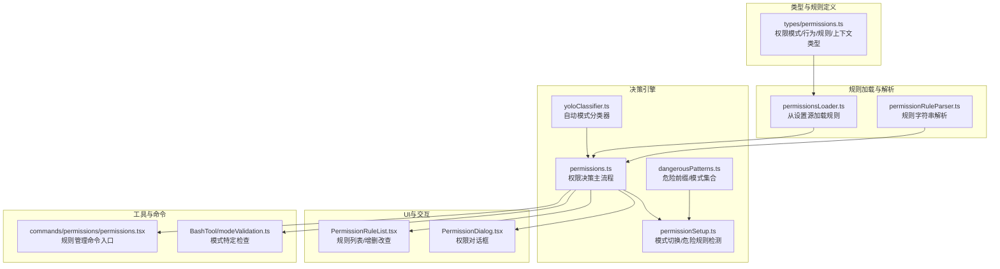
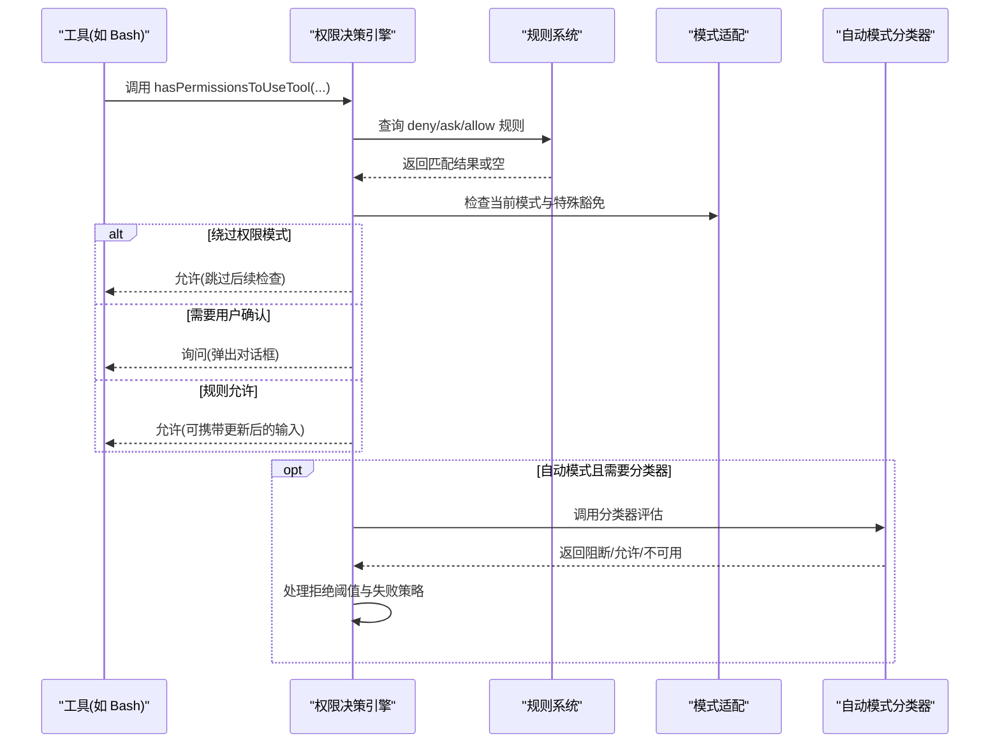
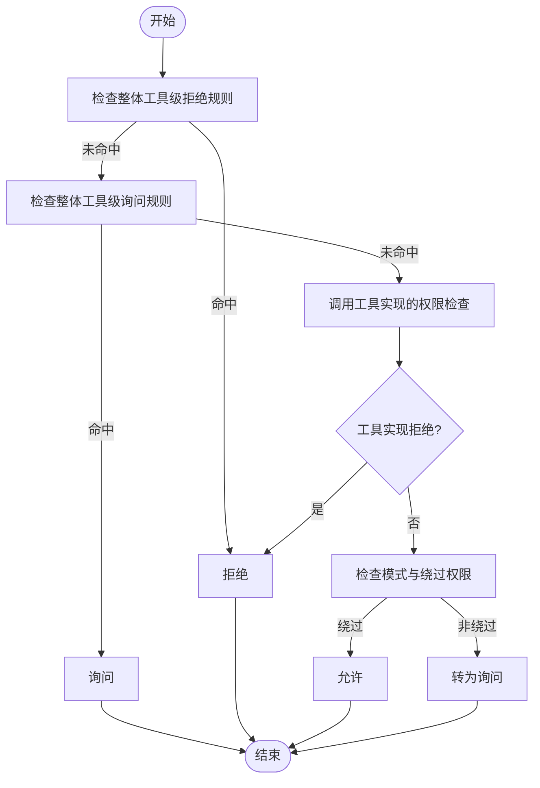
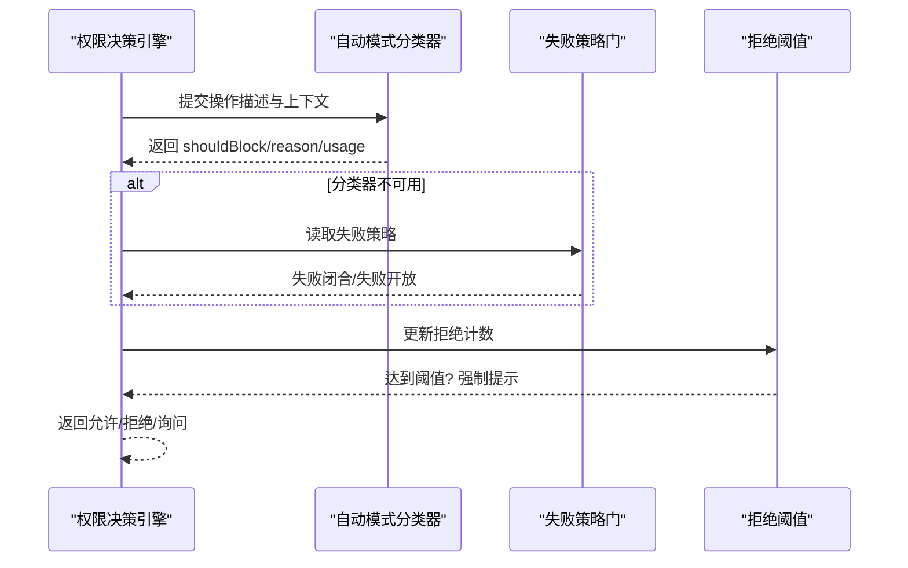
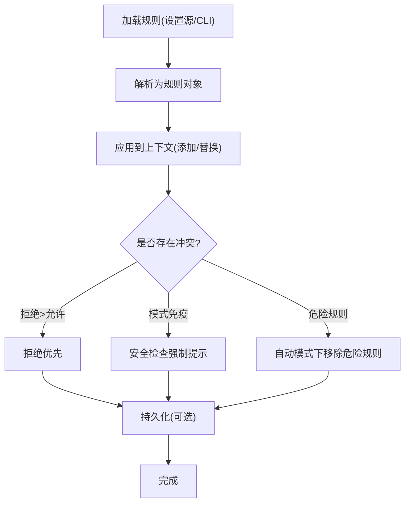
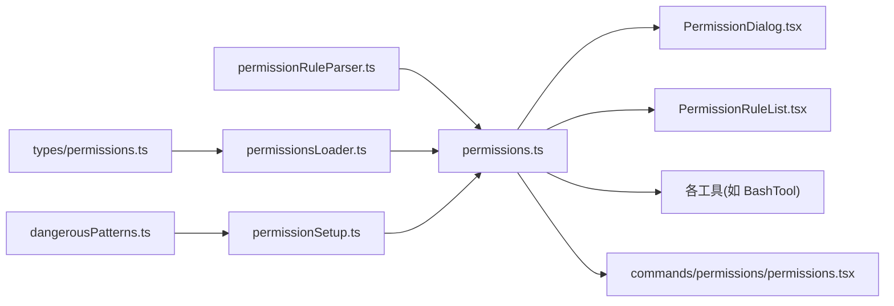

# 权限控制系统概述

<cite>
**本文档引用的文件**
- [utils/permissions/permissions.ts](file://utils/permissions/permissions.ts)
- [utils/permissions/permissionSetup.ts](file://utils/permissions/permissionSetup.ts)
- [utils/permissions/PermissionMode.ts](file://utils/permissions/PermissionMode.ts)
- [utils/permissions/PermissionRule.ts](file://utils/permissions/PermissionRule.ts)
- [utils/permissions/dangerousPatterns.ts](file://utils/permissions/dangerousPatterns.ts)
- [utils/permissions/permissionExplainer.ts](file://utils/permissions/permissionExplainer.ts)
- [utils/permissions/permissionsLoader.ts](file://utils/permissions/permissionsLoader.ts)
- [utils/permissions/permissionValidation.ts](file://utils/permissions/permissionValidation.ts)
- [components/permissions/PermissionDialog.tsx](file://components/permissions/PermissionDialog.tsx)
- [components/permissions/rules/PermissionRuleList.tsx](file://components/permissions/rules/PermissionRuleList.tsx)
- [types/permissions.ts](file://types/permissions.ts)
- [tools/BashTool/modeValidation.ts](file://tools/BashTool/modeValidation.ts)
- [commands/permissions/permissions.tsx](file://commands/permissions/permissions.tsx)
</cite>

## 目录
1. [简介](#简介)
2. [项目结构](#项目结构)
3. [核心组件](#核心组件)
4. [架构总览](#架构总览)
5. [详细组件分析](#详细组件分析)
6. [依赖关系分析](#依赖关系分析)
7. [性能考虑](#性能考虑)
8. [故障排除指南](#故障排除指南)
9. [结论](#结论)
10. [附录](#附录)

## 简介
本文件为权限控制系统的综合性技术文档，面向具备安全意识的开发者，系统阐述权限控制的核心概念、架构设计与实现细节。文档覆盖三种权限模式（默认、自动、绕过）的特性与适用场景；详解权限决策机制、路径保护规则与工具风险评估算法；说明权限规则的配置方法、动态更新与冲突处理策略；并提供扩展点与自定义权限规则的开发指南。同时，文档解释权限系统与命令系统、工具系统的集成关系，并通过图示帮助读者建立全局理解。

## 项目结构
权限控制系统主要由以下层次构成：
- 类型与规则定义层：统一的权限模式、行为、规则值与上下文类型定义，确保模块间解耦与可维护性。
- 规则加载与解析层：从设置源、CLI 参数等来源加载规则，解析为内部规则对象。
- 决策引擎层：根据规则、模式、工具实现与安全检查进行权限决策，支持自动模式下的AI分类器。
- UI与交互层：提供规则列表、添加/删除规则、工作目录管理、权限对话框等交互界面。
- 工具与命令集成层：在具体工具（如 Bash、PowerShell、Agent 等）中执行权限检查与模式适配。

**图表来源**
- [types/permissions.ts:16-442](file://types/permissions.ts#L16-L442)
- [utils/permissions/permissionsLoader.ts:85-133](file://utils/permissions/permissionsLoader.ts#L85-L133)
- [utils/permissions/permissions.ts:1158-1319](file://utils/permissions/permissions.ts#L1158-L1319)
- [utils/permissions/permissionSetup.ts:287-503](file://utils/permissions/permissionSetup.ts#L287-L503)
- [utils/permissions/dangerousPatterns.ts:14-81](file://utils/permissions/dangerousPatterns.ts#L14-L81)
- [components/permissions/PermissionDialog.tsx:1-72](file://components/permissions/PermissionDialog.tsx#L1-L72)
- [components/permissions/rules/PermissionRuleList.tsx:1-800](file://components/permissions/rules/PermissionRuleList.tsx#L1-L800)
- [tools/BashTool/modeValidation.ts:52-92](file://tools/BashTool/modeValidation.ts#L52-L92)
- [commands/permissions/permissions.tsx:1-9](file://commands/permissions/permissions.tsx#L1-L9)

**章节来源**
- [types/permissions.ts:16-442](file://types/permissions.ts#L16-L442)
- [utils/permissions/permissionsLoader.ts:85-133](file://utils/permissions/permissionsLoader.ts#L85-L133)
- [utils/permissions/permissions.ts:1158-1319](file://utils/permissions/permissions.ts#L1158-L1319)
- [utils/permissions/permissionSetup.ts:287-503](file://utils/permissions/permissionSetup.ts#L287-L503)
- [utils/permissions/dangerousPatterns.ts:14-81](file://utils/permissions/dangerousPatterns.ts#L14-L81)
- [components/permissions/PermissionDialog.tsx:1-72](file://components/permissions/PermissionDialog.tsx#L1-L72)
- [components/permissions/rules/PermissionRuleList.tsx:1-800](file://components/permissions/rules/PermissionRuleList.tsx#L1-L800)
- [tools/BashTool/modeValidation.ts:52-92](file://tools/BashTool/modeValidation.ts#L52-L92)
- [commands/permissions/permissions.tsx:1-9](file://commands/permissions/permissions.tsx#L1-L9)

## 核心组件
- 权限模式与行为
  - 模式：默认(default)、计划模式(plan)、接受编辑(acceptEdits)、绕过权限(bypassPermissions)、不询问(dontAsk)、自动(auto)。
  - 行为：允许(allow)、拒绝(deny)、询问(ask)。
- 权限规则
  - 规则值包含工具名与可选内容；规则来源包括用户设置、项目设置、本地设置、策略设置、标志设置、命令、会话、CLI 参数。
- 权限上下文
  - 包含当前模式、额外工作目录、三类规则映射、是否可用绕过权限模式、自动模式可用性、预计划模式等。

**章节来源**
- [utils/permissions/PermissionMode.ts:26-142](file://utils/permissions/PermissionMode.ts#L26-L142)
- [utils/permissions/PermissionRule.ts:19-41](file://utils/permissions/PermissionRule.ts#L19-L41)
- [types/permissions.ts:44-146](file://types/permissions.ts#L44-L146)
- [types/permissions.ts:416-442](file://types/permissions.ts#L416-L442)

## 架构总览
权限系统采用“规则驱动 + 模式适配 + 安全检查”的分层架构：
- 规则驱动：从多源加载规则，按来源与行为组织，形成上下文中的规则映射。
- 模式适配：根据当前模式（默认/计划/接受编辑/绕过/不询问/自动）调整决策路径与豁免条件。
- 安全检查：内置路径安全检查、危险规则检测、自动模式分类器等，防止高危操作绕过人工确认。
- 自动模式：在自动模式下，优先使用分类器进行快速判定，结合失败闭合/开策略与拒绝阈值，平衡安全与效率。

**图表来源**
- [utils/permissions/permissions.ts:1158-1319](file://utils/permissions/permissions.ts#L1158-L1319)
- [utils/permissions/permissions.ts:800-956](file://utils/permissions/permissions.ts#L800-L956)
- [utils/permissions/permissionSetup.ts:597-646](file://utils/permissions/permissionSetup.ts#L597-L646)

**章节来源**
- [utils/permissions/permissions.ts:1158-1319](file://utils/permissions/permissions.ts#L1158-L1319)
- [utils/permissions/permissions.ts:800-956](file://utils/permissions/permissions.ts#L800-L956)
- [utils/permissions/permissionSetup.ts:597-646](file://utils/permissions/permissionSetup.ts#L597-L646)

## 详细组件分析

### 三种权限模式详解
- 默认模式(default)
  - 特点：严格遵循规则与安全检查，所有操作均需符合规则或经用户确认。
  - 适用场景：日常开发、生产环境、对安全性要求高的场景。
- 计划模式(plan)
  - 特点：用于规划阶段，可选择保留自动模式语义（当用户已授权自动模式时），否则回退到默认行为。
  - 适用场景：长时间规划、批量任务准备。
- 接受编辑(acceptEdits)
  - 特点：针对文件编辑等低风险操作，允许在工作目录内自动放行，减少交互。
  - 适用场景：代码审阅、小范围文件修改。
- 绕过权限(bypassPermissions)
  - 特点：完全跳过权限检查，等同于“YOLO”模式，仅在特定条件下可用。
  - 适用场景：受控沙箱环境或紧急情况，但通常被组织策略禁用。
- 不询问(dontAsk)
  - 特点：遇到“询问”规则时直接拒绝，避免打断。
  - 适用场景：后台/无人值守任务。
- 自动模式(auto)
  - 特点：通过AI分类器对操作进行快速评估，支持失败闭合/开策略与拒绝阈值。
  - 适用场景：大规模自动化、提升效率的同时保持安全基线。

**章节来源**
- [utils/permissions/PermissionMode.ts:42-91](file://utils/permissions/PermissionMode.ts#L42-L91)
- [utils/permissions/permissionSetup.ts:689-811](file://utils/permissions/permissionSetup.ts#L689-L811)
- [utils/permissions/permissionSetup.ts:1446-1493](file://utils/permissions/permissionSetup.ts#L1446-L1493)

### 权限决策机制
- 决策步骤
  1) 整体工具级拒绝/询问规则检查；
  2) 工具实现的权限检查（如 Bash 的子命令规则）；
  3) 绕过权限模式与 always-allow 规则；
  4) 模式转换（如 dontAsk 将 ask 转为 deny）；
  5) 自动模式分类器评估（可选）；
  6) 拒绝阈值与失败策略处理（可选）。
- 决策结果
  - 允许(allow)：返回更新后的输入（如有）；
  - 询问(ask)：弹出对话框，可能附带建议的权限更新；
  - 拒绝(deny)：给出明确原因与建议。

**图表来源**
- [utils/permissions/permissions.ts:1158-1319](file://utils/permissions/permissions.ts#L1158-L1319)

**章节来源**
- [utils/permissions/permissions.ts:1158-1319](file://utils/permissions/permissions.ts#L1158-L1319)

### 路径保护规则
- 危险路径与敏感目录
  - 系统隐藏目录（如 .git/.claude/.vscode）、shell 配置文件等被识别为敏感路径，强制提示确认。
- 模式特定处理
  - 在某些模式下，安全检查具有“免疫性”，即使存在允许规则也必须提示用户确认。
- 工作目录扩展
  - 支持通过 CLI 或设置添加额外工作目录，增强权限覆盖范围。

**章节来源**
- [utils/permissions/permissions.ts:1144-1152](file://utils/permissions/permissions.ts#L1144-L1152)
- [utils/permissions/permissionSetup.ts:993-1025](file://utils/permissions/permissionSetup.ts#L993-L1025)

### 工具风险评估算法
- 自动模式分类器
  - 输入：操作描述、工具列表、当前权限上下文；
  - 输出：阻断/允许、原因、置信度、Token 使用量与耗时；
  - 失败策略：在“铁门”开启时失败闭合（拒绝并提示重试），否则失败开放（回到正常提示）。
- 拒绝阈值
  - 连续拒绝次数与累计拒绝次数达到阈值后，强制回到手动提示，避免自动化误判导致的持续阻断。
- 模式特定优化
  - 对于可沙箱化的 Bash 命令，在满足条件时自动放行，减少交互。

**图表来源**
- [utils/permissions/permissions.ts:800-956](file://utils/permissions/permissions.ts#L800-L956)
- [utils/permissions/permissions.ts:984-1058](file://utils/permissions/permissions.ts#L984-L1058)

**章节来源**
- [utils/permissions/permissions.ts:800-956](file://utils/permissions/permissions.ts#L800-L956)
- [utils/permissions/permissions.ts:984-1058](file://utils/permissions/permissions.ts#L984-L1058)

### 权限规则配置、动态更新与冲突处理
- 规则来源与优先级
  - 设置源（用户/项目/本地）、策略设置、标志设置、命令、会话、CLI 参数。
- 动态更新
  - 支持添加/替换/移除规则，以及设置模式、增删工作目录；
  - 同步磁盘规则时先清空对应来源的行为集合，再应用新规则，避免残留。
- 冲突处理
  - 拒绝规则优先于允许规则；
  - 模式特定规则（如安全检查）对绕过权限模式具有“免疫性”；
  - 危险规则检测：自动模式下移除可能导致绕过分类器的规则（如 Bash(*)、PowerShell(iex:*) 等）。

**图表来源**
- [utils/permissions/permissions.ts:1408-1471](file://utils/permissions/permissions.ts#L1408-L1471)
- [utils/permissions/permissionSetup.ts:287-342](file://utils/permissions/permissionSetup.ts#L287-L342)
- [utils/permissions/permissionSetup.ts:505-553](file://utils/permissions/permissionSetup.ts#L505-L553)

**章节来源**
- [utils/permissions/permissions.ts:1408-1471](file://utils/permissions/permissions.ts#L1408-L1471)
- [utils/permissions/permissionSetup.ts:287-342](file://utils/permissions/permissionSetup.ts#L287-L342)
- [utils/permissions/permissionSetup.ts:505-553](file://utils/permissions/permissionSetup.ts#L505-L553)

### 扩展点与自定义权限规则开发指南
- 自定义工具权限检查
  - 工具需实现 checkPermissions 方法，返回 PermissionResult，支持 allow/ask/deny/passthrough；
  - 可在结果中附带 decisionReason 与 suggestions，便于 UI 展示与后续自动更新。
- 模式特定逻辑
  - 可在工具中增加模式特定分支（如 Accept Edits 模式下的文件系统命令处理）。
- 规则验证与建议
  - 使用自定义 Zod Schema 对规则数组进行校验，提供错误信息与修复建议；
  - 支持规则示例展示，帮助用户正确编写规则。
- 权限解释器
  - 可通过权限解释器对命令进行风险评估，生成风险等级、解释与推理，辅助用户决策。

**章节来源**
- [utils/permissions/permissions.ts:1113-1156](file://utils/permissions/permissions.ts#L1113-L1156)
- [tools/BashTool/modeValidation.ts:52-92](file://tools/BashTool/modeValidation.ts#L52-L92)
- [utils/permissions/permissionValidation.ts:241-262](file://utils/permissions/permissionValidation.ts#L241-L262)
- [utils/permissions/permissionExplainer.ts:173-207](file://utils/permissions/permissionExplainer.ts#L173-L207)

### 代码示例路径（实现参考）
- 实现权限检查与处理权限请求
  - [hasPermissionsToUseTool 主流程:1158-1319](file://utils/permissions/permissions.ts#L1158-L1319)
  - [规则基础检查（不触发自动模式）:1071-1156](file://utils/permissions/permissions.ts#L1071-L1156)
- 管理权限状态与模式切换
  - [模式切换与危险规则处理:597-646](file://utils/permissions/permissionSetup.ts#L597-L646)
  - [初始化权限上下文与危险规则检测:872-1033](file://utils/permissions/permissionSetup.ts#L872-L1033)
- 权限规则的配置与持久化
  - [应用规则到上下文:1408-1414](file://utils/permissions/permissions.ts#L1408-L1414)
  - [从磁盘同步规则（替换）:1419-1471](file://utils/permissions/permissions.ts#L1419-L1471)
- UI 与交互
  - [权限对话框组件:1-72](file://components/permissions/PermissionDialog.tsx#L1-L72)
  - [规则列表与增删改查:1-800](file://components/permissions/rules/PermissionRuleList.tsx#L1-L800)
- 命令入口
  - [规则管理命令:1-9](file://commands/permissions/permissions.tsx#L1-L9)

**章节来源**
- [utils/permissions/permissions.ts:1158-1319](file://utils/permissions/permissions.ts#L1158-L1319)
- [utils/permissions/permissions.ts:1071-1156](file://utils/permissions/permissions.ts#L1071-L1156)
- [utils/permissions/permissionSetup.ts:597-646](file://utils/permissions/permissionSetup.ts#L597-L646)
- [utils/permissions/permissionSetup.ts:872-1033](file://utils/permissions/permissionSetup.ts#L872-L1033)
- [utils/permissions/permissions.ts:1408-1414](file://utils/permissions/permissions.ts#L1408-L1414)
- [utils/permissions/permissions.ts:1419-1471](file://utils/permissions/permissions.ts#L1419-L1471)
- [components/permissions/PermissionDialog.tsx:1-72](file://components/permissions/PermissionDialog.tsx#L1-L72)
- [components/permissions/rules/PermissionRuleList.tsx:1-800](file://components/permissions/rules/PermissionRuleList.tsx#L1-L800)
- [commands/permissions/permissions.tsx:1-9](file://commands/permissions/permissions.tsx#L1-L9)

## 依赖关系分析
- 类型与规则定义
  - types/permissions.ts 为所有实现模块提供类型约束，避免循环依赖。
- 规则加载与解析
  - permissionsLoader.ts 从设置源读取规则，permissionRuleParser.ts 解析字符串为规则对象。
- 决策引擎
  - permissions.ts 聚合规则查询、模式适配、自动模式分类器与拒绝阈值处理。
- 模式与危险规则
  - permissionSetup.ts 负责模式切换、危险规则检测与自动模式可用性判断。
- 工具与命令
  - 各工具在自身实现中调用权限检查；命令入口负责启动 UI 与交互。

**图表来源**
- [types/permissions.ts:44-146](file://types/permissions.ts#L44-L146)
- [utils/permissions/permissionsLoader.ts:85-133](file://utils/permissions/permissionsLoader.ts#L85-L133)
- [utils/permissions/permissions.ts:1158-1319](file://utils/permissions/permissions.ts#L1158-L1319)
- [utils/permissions/permissionSetup.ts:287-503](file://utils/permissions/permissionSetup.ts#L287-L503)
- [utils/permissions/dangerousPatterns.ts:14-81](file://utils/permissions/dangerousPatterns.ts#L14-L81)
- [components/permissions/PermissionDialog.tsx:1-72](file://components/permissions/PermissionDialog.tsx#L1-L72)
- [components/permissions/rules/PermissionRuleList.tsx:1-800](file://components/permissions/rules/PermissionRuleList.tsx#L1-L800)
- [commands/permissions/permissions.tsx:1-9](file://commands/permissions/permissions.tsx#L1-L9)

**章节来源**
- [types/permissions.ts:44-146](file://types/permissions.ts#L44-L146)
- [utils/permissions/permissionsLoader.ts:85-133](file://utils/permissions/permissionsLoader.ts#L85-L133)
- [utils/permissions/permissions.ts:1158-1319](file://utils/permissions/permissions.ts#L1158-L1319)
- [utils/permissions/permissionSetup.ts:287-503](file://utils/permissions/permissionSetup.ts#L287-L503)
- [utils/permissions/dangerousPatterns.ts:14-81](file://utils/permissions/dangerousPatterns.ts#L14-L81)
- [components/permissions/PermissionDialog.tsx:1-72](file://components/permissions/PermissionDialog.tsx#L1-L72)
- [components/permissions/rules/PermissionRuleList.tsx:1-800](file://components/permissions/rules/PermissionRuleList.tsx#L1-L800)
- [commands/permissions/permissions.tsx:1-9](file://commands/permissions/permissions.tsx#L1-L9)

## 性能考虑
- 自动模式分类器
  - 通过“安全工具白名单”与“接受编辑模式快路径”减少不必要的分类器调用；
  - 失败闭合策略避免在不可用时反复重试造成资源浪费。
- 拒绝阈值
  - 当连续/累计拒绝超过阈值时，强制回到手动提示，避免自动化误判导致的持续阻断与资源消耗。
- 规则同步
  - 同步磁盘规则前先清空对应来源的行为集合，避免重复规则导致的匹配开销。

[本节为通用指导，无需特定文件分析]

## 故障排除指南
- 自动模式不可用
  - 检查设置与电路断路器状态，必要时通过 verifyAutoModeGateAccess 获取通知与踢出逻辑。
- 绕过权限模式被禁用
  - 检查 Statsig 门禁与设置项，确认是否被组织策略禁用。
- 危险规则导致自动模式异常
  - 使用危险规则检测函数定位 Bash(*)、PowerShell(iex:*) 等规则，并在进入自动模式前移除。
- 拒绝阈值触发频繁
  - 检查分类器输出与拒绝计数，适当放宽策略或引导用户手动审批。

**章节来源**
- [utils/permissions/permissionSetup.ts:1078-1260](file://utils/permissions/permissionSetup.ts#L1078-L1260)
- [utils/permissions/permissionSetup.ts:1367-1431](file://utils/permissions/permissionSetup.ts#L1367-L1431)
- [utils/permissions/permissionSetup.ts:287-342](file://utils/permissions/permissionSetup.ts#L287-L342)
- [utils/permissions/permissions.ts:984-1058](file://utils/permissions/permissions.ts#L984-L1058)

## 结论
该权限控制系统以规则为中心，结合多种权限模式与安全检查，实现了从高安全到高效率的灵活权衡。自动模式通过分类器与失败策略进一步提升了自动化能力，同时通过拒绝阈值与危险规则检测保障了安全基线。UI 与命令入口提供了完善的规则管理体验，适合在复杂环境中部署与演进。

[本节为总结，无需特定文件分析]

## 附录
- 关键类型与常量
  - 权限模式与行为：参见 [types/permissions.ts:16-44](file://types/permissions.ts#L16-L44)
  - 规则来源与更新目标：参见 [types/permissions.ts:54-138](file://types/permissions.ts#L54-L138)
  - 决策类型与理由：参见 [types/permissions.ts:241-324](file://types/permissions.ts#L241-L324)
- 危险模式集合
  - 交叉平台代码执行入口与 Bash 危险模式：参见 [utils/permissions/dangerousPatterns.ts:14-81](file://utils/permissions/dangerousPatterns.ts#L14-L81)

**章节来源**
- [types/permissions.ts:16-44](file://types/permissions.ts#L16-L44)
- [types/permissions.ts:54-138](file://types/permissions.ts#L54-L138)
- [types/permissions.ts:241-324](file://types/permissions.ts#L241-L324)
- [utils/permissions/dangerousPatterns.ts:14-81](file://utils/permissions/dangerousPatterns.ts#L14-L81)