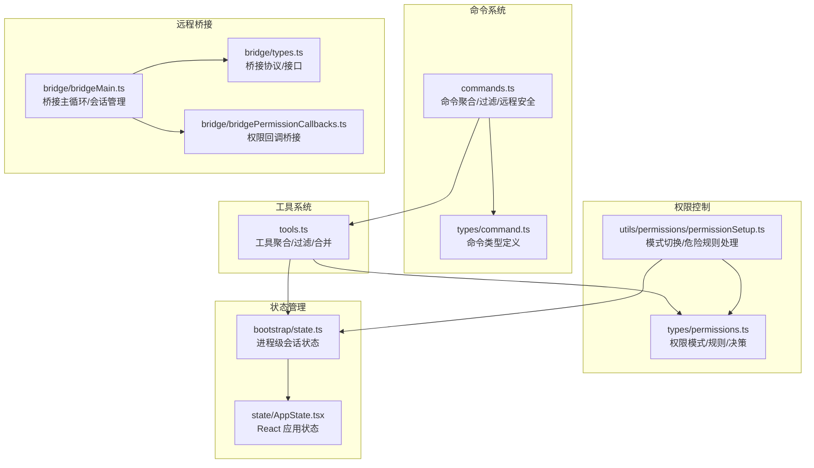
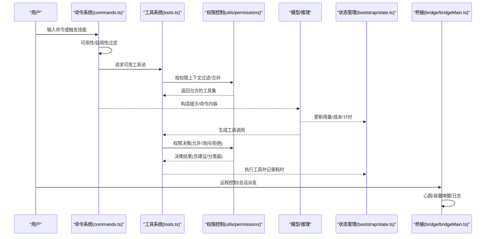
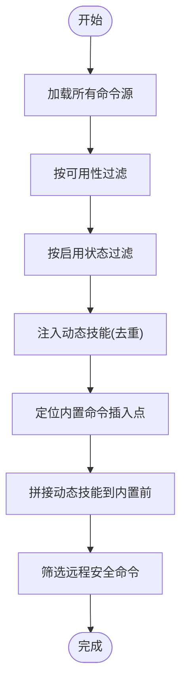
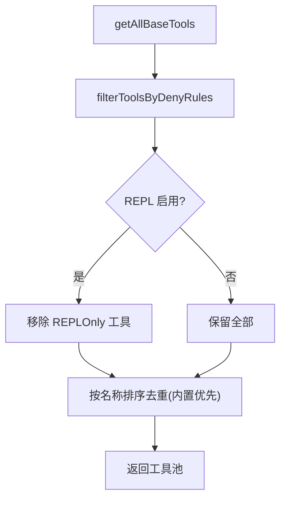
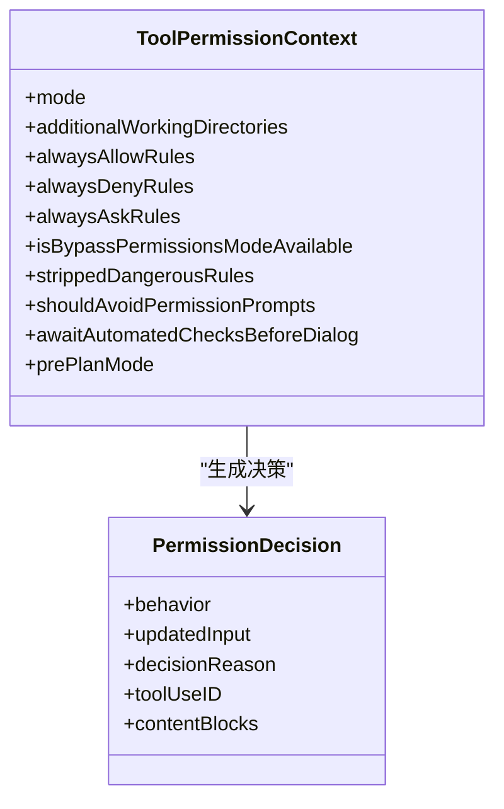
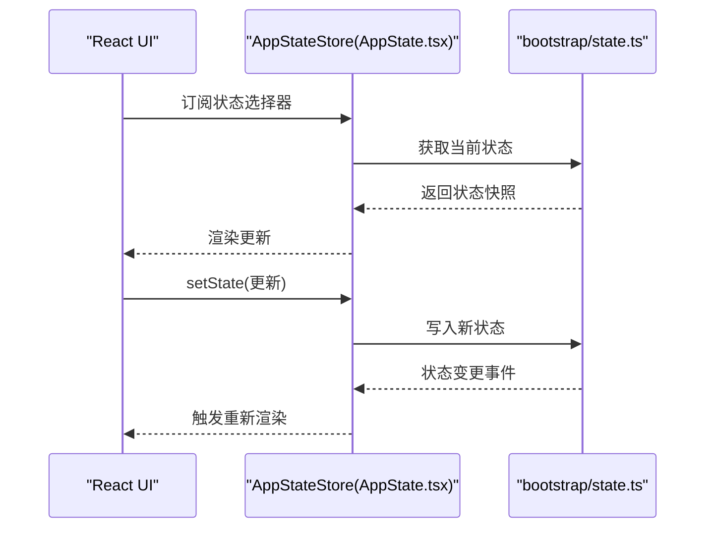
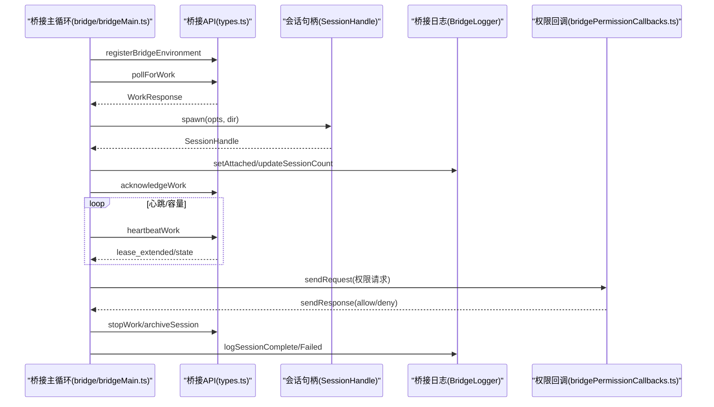
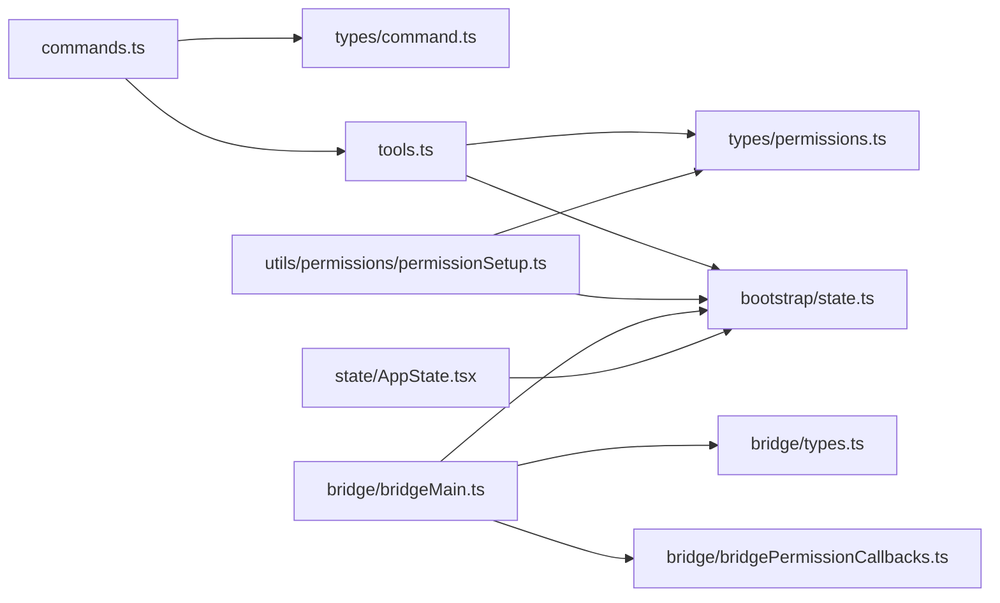

# 核心概念

<cite>
**本文引用的文件**
- [commands.ts](file://commands.ts)
- [types/command.ts](file://types/command.ts)
- [tools.ts](file://tools.ts)
- [bridge/bridgeMain.ts](file://bridge/bridgeMain.ts)
- [bridge/types.ts](file://bridge/types.ts)
- [bridge/bridgePermissionCallbacks.ts](file://bridge/bridgePermissionCallbacks.ts)
- [bootstrap/state.ts](file://bootstrap/state.ts)
- [state/AppState.tsx](file://state/AppState.tsx)
- [types/permissions.ts](file://types/permissions.ts)
- [utils/permissions/permissionSetup.ts](file://utils/permissions/permissionSetup.ts)
</cite>

## 目录
1. [引言](#引言)
2. [项目结构](#项目结构)
3. [核心组件](#核心组件)
4. [架构总览](#架构总览)
5. [详细组件分析](#详细组件分析)
6. [依赖关系分析](#依赖关系分析)
7. [性能考量](#性能考量)
8. [故障排查指南](#故障排查指南)
9. [结论](#结论)
10. [附录](#附录)

## 引言
本文件系统性阐述 Claude Code 的核心概念与实现：命令系统、工具系统、权限控制、状态管理，以及多代理协作与远程桥接的工作原理。文档以循序渐进的方式呈现，既包含高层架构视图，也提供代码级关系图与路径引用，帮助不同层次的读者快速理解并落地实践。

## 项目结构
- 命令系统位于 commands/ 与根级 commands.ts，统一聚合内置命令、技能、插件与工作流命令，并提供可用性过滤、动态技能注入与远程安全命令白名单。
- 工具系统位于 tools/ 与根级 tools.ts，统一管理内置工具、MCP 工具与 REPL 包装，支持按权限上下文过滤与去重合并。
- 权限控制位于 types/permissions.ts 与 utils/permissions/ 下，定义权限模式、行为与规则，提供自动模式下的危险规则剥离与恢复。
- 状态管理分为两层：bootstrap/state.ts 提供进程级会话状态（成本、用量、计时器、计划/自动模式标记等）；state/AppState.tsx 提供 React 应用状态存储与订阅。
- 远程桥接位于 bridge/，负责与服务端环境注册、轮询工作项、派发会话、心跳保活、容量唤醒与日志显示，支撑多会话并发与远程控制。

**图表来源**
- [commands.ts:258-517](file://commands.ts#L258-L517)
- [types/command.ts:1-217](file://types/command.ts#L1-L217)
- [tools.ts:193-390](file://tools.ts#L193-L390)
- [types/permissions.ts:1-442](file://types/permissions.ts#L1-L442)
- [utils/permissions/permissionSetup.ts:597-646](file://utils/permissions/permissionSetup.ts#L597-L646)
- [bootstrap/state.ts:45-257](file://bootstrap/state.ts#L45-L257)
- [state/AppState.tsx:1-200](file://state/AppState.tsx#L1-L200)
- [bridge/bridgeMain.ts:141-800](file://bridge/bridgeMain.ts#L141-L800)
- [bridge/types.ts:1-263](file://bridge/types.ts#L1-L263)
- [bridge/bridgePermissionCallbacks.ts:1-44](file://bridge/bridgePermissionCallbacks.ts#L1-L44)

**章节来源**
- [commands.ts:258-517](file://commands.ts#L258-L517)
- [tools.ts:193-390](file://tools.ts#L193-L390)
- [types/permissions.ts:1-442](file://types/permissions.ts#L1-L442)
- [utils/permissions/permissionSetup.ts:597-646](file://utils/permissions/permissionSetup.ts#L597-L646)
- [bootstrap/state.ts:45-257](file://bootstrap/state.ts#L45-L257)
- [state/AppState.tsx:1-200](file://state/AppState.tsx#L1-L200)
- [bridge/bridgeMain.ts:141-800](file://bridge/bridgeMain.ts#L141-L800)
- [bridge/types.ts:1-263](file://bridge/types.ts#L1-L263)
- [bridge/bridgePermissionCallbacks.ts:1-44](file://bridge/bridgePermissionCallbacks.ts#L1-L44)

## 核心组件
- 命令系统
  - 统一加载内置命令、技能、插件与工作流命令，按可用性与启用状态过滤，支持动态技能注入与远程安全命令白名单。
  - 关键能力：命令可用性检查、动态技能去重插入、远程/桥接安全命令集合。
- 工具系统
  - 聚合内置工具与 MCP 工具，按权限上下文过滤，避免 REPL 模式下直接暴露原始工具，最终按名称稳定排序去重。
- 权限控制
  - 定义外部可配置权限模式（如默认、绕过、接受编辑、不询问、计划），并在自动模式下剥离危险规则，退出时恢复。
  - 决策结果包含允许、询问、拒绝与透传，支持异步分类器评估与建议更新。
- 状态管理
  - 进程级会话状态（成本、用量、计时、计划/自动模式标记、代理颜色、慢操作等）与 React 应用状态（订阅/更新、设置变更同步）。
- 远程桥接
  - 环境注册、轮询工作、会话派发、心跳保活、容量唤醒、日志显示与会话生命周期管理，支持多会话并发与 CCR v2 兼容。

**章节来源**
- [commands.ts:449-517](file://commands.ts#L449-L517)
- [tools.ts:271-367](file://tools.ts#L271-L367)
- [types/permissions.ts:16-38](file://types/permissions.ts#L16-L38)
- [utils/permissions/permissionSetup.ts:505-553](file://utils/permissions/permissionSetup.ts#L505-L553)
- [bootstrap/state.ts:45-257](file://bootstrap/state.ts#L45-L257)
- [state/AppState.tsx:117-179](file://state/AppState.tsx#L117-L179)
- [bridge/bridgeMain.ts:141-800](file://bridge/bridgeMain.ts#L141-L800)

## 架构总览
下图展示从用户输入到模型推理再到工具执行与远程桥接的整体流程，强调命令/工具选择、权限决策与状态流转。

**图表来源**
- [commands.ts:449-517](file://commands.ts#L449-L517)
- [tools.ts:271-367](file://tools.ts#L271-L367)
- [utils/permissions/permissionSetup.ts:597-646](file://utils/permissions/permissionSetup.ts#L597-L646)
- [bootstrap/state.ts:543-640](file://bootstrap/state.ts#L543-L640)
- [bridge/bridgeMain.ts:141-800](file://bridge/bridgeMain.ts#L141-L800)

## 详细组件分析

### 命令系统
- 命令聚合与过滤
  - 加载顺序：内置命令 → 插件命令 → 技能命令 → 工作流命令 → 打包技能/内置插件技能。
  - 可用性过滤：根据订阅/控制台/网关等环境限制决定是否可见。
  - 启用过滤：结合特性开关与运行时条件判断。
  - 动态技能：在文件操作中发现的技能去重后插入到插件技能之后、内置命令之前。
- 远程/桥接安全命令
  - REMOTE_SAFE_COMMANDS：仅影响本地 TUI 状态且不依赖本地文件系统/终端的命令。
  - BRIDGE_SAFE_COMMANDS：允许通过移动端/网页客户端桥接输入的本地命令集合。
  - isBridgeSafeCommand：综合命令类型与白名单判定是否允许远程输入。

**图表来源**
- [commands.ts:449-517](file://commands.ts#L449-L517)
- [commands.ts:619-686](file://commands.ts#L619-L686)

**章节来源**
- [commands.ts:258-517](file://commands.ts#L258-L517)
- [types/command.ts:175-217](file://types/command.ts#L175-L217)

### 工具系统
- 工具聚合
  - getAllBaseTools：按环境特性与条件动态加入工具（如 LSP、工作树、任务、PowerShell、Cron、Monitor、推送通知等）。
  - getTools：按权限上下文过滤，支持简单模式（仅 Bash/读/写）、REPL 模式隐藏原始工具。
  - assembleToolPool：合并内置与 MCP 工具，按名称稳定排序并去重，内置优先。
- 权限过滤
  - filterToolsByDenyRules：基于权限上下文中的禁止规则剔除工具。
  - REPLOnly 工具：在 REPL 启用时隐藏，仅在 VM 上下文中可用。

**图表来源**
- [tools.ts:193-390](file://tools.ts#L193-L390)
- [tools.ts:262-327](file://tools.ts#L262-L327)

**章节来源**
- [tools.ts:193-390](file://tools.ts#L193-L390)

### 权限控制
- 权限模式
  - 外部模式：acceptEdits、bypassPermissions、default、dontAsk、plan。
  - 内部模式：在 TRANSCRIPT_CLASSIFIER 特性开启时增加 auto。
- 危险规则识别与处理
  - 自动模式下剥离危险规则（如 Bash(*)、PowerShell(*)、Agent(*) 等），退出时恢复。
  - findDangerousClassifierPermissions/findOverlyBroadBashPermissions 等函数用于扫描与报告。
- 决策与建议
  - 支持 allow/ask/deny/passthrough，允许附加建议更新、内容块与异步分类器检查。

**图表来源**
- [types/permissions.ts:416-442](file://types/permissions.ts#L416-L442)
- [types/permissions.ts:241-267](file://types/permissions.ts#L241-L267)

**章节来源**
- [types/permissions.ts:16-38](file://types/permissions.ts#L16-L38)
- [utils/permissions/permissionSetup.ts:505-553](file://utils/permissions/permissionSetup.ts#L505-L553)

### 状态管理
- 进程级会话状态（bootstrap/state.ts）
  - 成本、用量、时长、转轮钩子/分类器时长与计数、代理颜色索引、计划/自动模式标记、慢操作列表、提示缓存头与请求 ID、远程模式标志等。
  - 提供会话切换、目录与项目根、统计与预算相关方法。
- React 应用状态（state/AppState.tsx）
  - 提供 useAppState/useSetAppState/useAppStateStore 订阅与更新，挂载时处理远程设置导致的绕过权限模式禁用，监听设置变更并应用。

**图表来源**
- [state/AppState.tsx:142-179](file://state/AppState.tsx#L142-L179)
- [bootstrap/state.ts:45-257](file://bootstrap/state.ts#L45-L257)

**章节来源**
- [bootstrap/state.ts:45-257](file://bootstrap/state.ts#L45-L257)
- [state/AppState.tsx:117-179](file://state/AppState.tsx#L117-L179)

### 多代理协作与远程桥接
- 多代理协作
  - 通过工具系统中的 AgentTool 与 Task* 工具实现主代理与子代理的协作，配合权限上下文与模式切换。
- 远程桥接
  - 环境注册、轮询工作、会话派发、心跳保活、容量唤醒与日志显示。
  - 支持单会话/工作树/同目录三种派生模式，会话超时与中断处理，调试日志路径与状态行刷新。
  - 权限回调桥接：通过 sendRequest/sendResponse/cancelRequest 实现移动端/网页端的权限决策闭环。

**图表来源**
- [bridge/bridgeMain.ts:141-800](file://bridge/bridgeMain.ts#L141-L800)
- [bridge/types.ts:133-176](file://bridge/types.ts#L133-L176)
- [bridge/bridgePermissionCallbacks.ts:10-27](file://bridge/bridgePermissionCallbacks.ts#L10-L27)

**章节来源**
- [bridge/bridgeMain.ts:141-800](file://bridge/bridgeMain.ts#L141-L800)
- [bridge/types.ts:81-115](file://bridge/types.ts#L81-L115)
- [bridge/bridgePermissionCallbacks.ts:1-44](file://bridge/bridgePermissionCallbacks.ts#L1-L44)

## 依赖关系分析
- 命令系统依赖工具系统与权限系统，确保命令可见性与可用性受控。
- 工具系统依赖权限上下文进行过滤与合并，同时受 REPL/简单模式影响。
- 权限控制依赖设置与特性门控，自动模式下对危险规则进行剥离/恢复。
- 状态管理贯穿命令/工具/桥接执行链路，记录用量、成本与时长。
- 远程桥接依赖桥接 API 类型与权限回调桥接，保障远程输入的安全与可观测。

**图表来源**
- [commands.ts:258-517](file://commands.ts#L258-L517)
- [tools.ts:271-367](file://tools.ts#L271-L367)
- [types/permissions.ts:416-442](file://types/permissions.ts#L416-L442)
- [utils/permissions/permissionSetup.ts:597-646](file://utils/permissions/permissionSetup.ts#L597-L646)
- [bootstrap/state.ts:45-257](file://bootstrap/state.ts#L45-L257)
- [state/AppState.tsx:1-200](file://state/AppState.tsx#L1-L200)
- [bridge/bridgeMain.ts:141-800](file://bridge/bridgeMain.ts#L141-L800)
- [bridge/types.ts:133-176](file://bridge/types.ts#L133-L176)
- [bridge/bridgePermissionCallbacks.ts:1-44](file://bridge/bridgePermissionCallbacks.ts#L1-L44)

**章节来源**
- [commands.ts:258-517](file://commands.ts#L258-L517)
- [tools.ts:271-367](file://tools.ts#L271-L367)
- [types/permissions.ts:416-442](file://types/permissions.ts#L416-L442)
- [utils/permissions/permissionSetup.ts:597-646](file://utils/permissions/permissionSetup.ts#L597-L646)
- [bootstrap/state.ts:45-257](file://bootstrap/state.ts#L45-L257)
- [state/AppState.tsx:1-200](file://state/AppState.tsx#L1-L200)
- [bridge/bridgeMain.ts:141-800](file://bridge/bridgeMain.ts#L141-L800)
- [bridge/types.ts:133-176](file://bridge/types.ts#L133-L176)
- [bridge/bridgePermissionCallbacks.ts:1-44](file://bridge/bridgePermissionCallbacks.ts#L1-L44)

## 性能考量
- 命令与工具加载采用记忆化（memoize）缓存，避免重复磁盘 I/O 与动态导入开销。
- 工具池合并时保持内置工具连续前缀并按名称稳定排序，减少下游缓存失效。
- 桥接轮询与心跳使用指数退避与容量唤醒，降低空闲时资源占用。
- 状态更新批处理（如交互时间戳延迟刷新）减少渲染压力。

[本节为通用指导，无需特定文件引用]

## 故障排查指南
- 命令不可见或被隐藏
  - 检查命令可用性（订阅/控制台/网关）与启用状态（特性开关/环境变量）。
  - 参考：[commands.ts:417-443](file://commands.ts#L417-L443)、[commands.ts:476-517](file://commands.ts#L476-L517)
- 工具未出现或被过滤
  - 检查权限上下文中的禁止规则与 REPL/简单模式影响。
  - 参考：[tools.ts:262-327](file://tools.ts#L262-L327)
- 权限弹窗频繁或误判
  - 查看危险规则剥离/恢复逻辑与自动模式门控状态。
  - 参考：[utils/permissions/permissionSetup.ts:505-553](file://utils/permissions/permissionSetup.ts#L505-L553)、[utils/permissions/permissionSetup.ts:689-800](file://utils/permissions/permissionSetup.ts#L689-L800)
- 远程桥接无响应或会话中断
  - 检查心跳失败/认证过期/容量阈值与会话超时策略。
  - 参考：[bridge/bridgeMain.ts:202-270](file://bridge/bridgeMain.ts#L202-L270)、[bridge/bridgeMain.ts:593-591](file://bridge/bridgeMain.ts#L593-L591)

**章节来源**
- [commands.ts:417-443](file://commands.ts#L417-L443)
- [tools.ts:262-327](file://tools.ts#L262-L327)
- [utils/permissions/permissionSetup.ts:505-553](file://utils/permissions/permissionSetup.ts#L505-L553)
- [utils/permissions/permissionSetup.ts:689-800](file://utils/permissions/permissionSetup.ts#L689-L800)
- [bridge/bridgeMain.ts:202-270](file://bridge/bridgeMain.ts#L202-L270)
- [bridge/bridgeMain.ts:593-591](file://bridge/bridgeMain.ts#L593-L591)

## 结论
Claude Code 的核心围绕“命令—工具—权限—状态—桥接”五条主线展开：命令系统提供统一入口与远程安全策略，工具系统在权限上下文内聚合与去重，权限控制在自动模式下平衡安全与效率，状态管理贯穿全链路观测与优化，远程桥接则打通本地与云端的会话与权限闭环。理解这些概念有助于在复杂场景中做出正确的取舍与扩展。

[本节为总结，无需特定文件引用]

## 附录
- 常用代码路径参考
  - 命令聚合与过滤：[commands.ts:258-517](file://commands.ts#L258-L517)
  - 工具聚合与过滤：[tools.ts:193-367](file://tools.ts#L193-L367)
  - 权限模式与决策：[types/permissions.ts:16-38](file://types/permissions.ts#L16-L38)、[utils/permissions/permissionSetup.ts:597-646](file://utils/permissions/permissionSetup.ts#L597-L646)
  - 进程级状态：[bootstrap/state.ts:45-257](file://bootstrap/state.ts#L45-L257)
  - React 应用状态：[state/AppState.tsx:117-179](file://state/AppState.tsx#L117-L179)
  - 桥接主循环与协议：[bridge/bridgeMain.ts:141-800](file://bridge/bridgeMain.ts#L141-L800)、[bridge/types.ts:133-176](file://bridge/types.ts#L133-L176)

[本节为补充材料，无需特定文件引用]