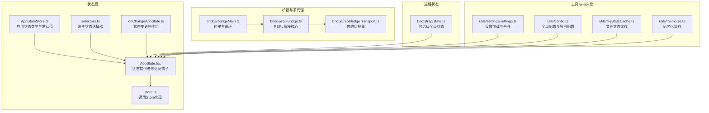
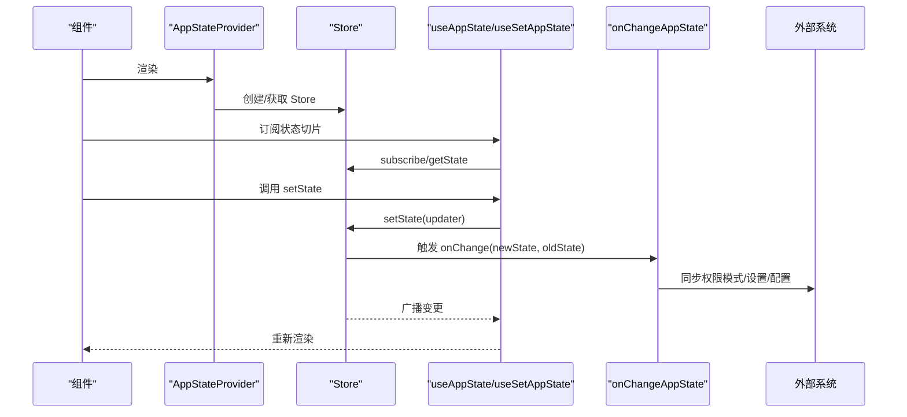
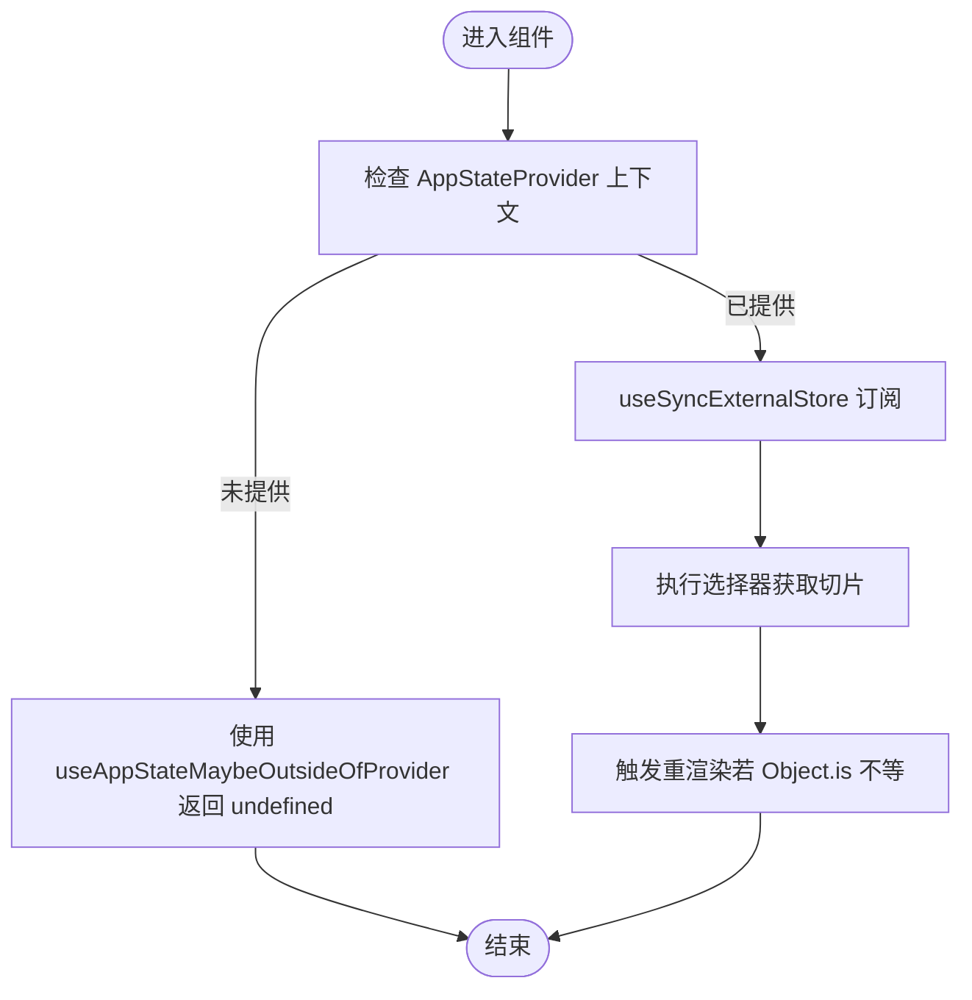
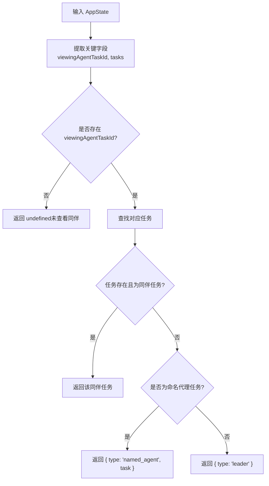
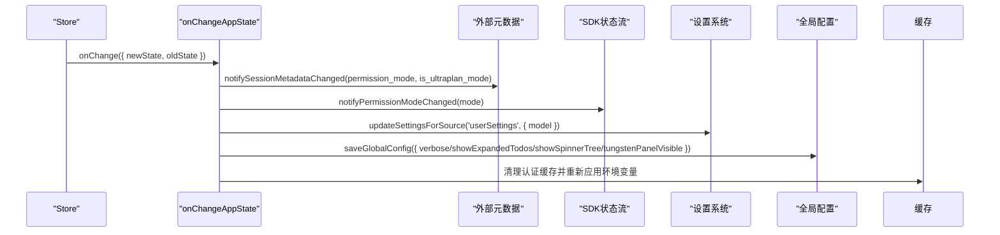
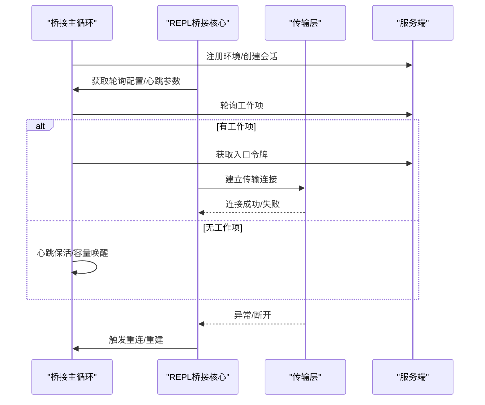
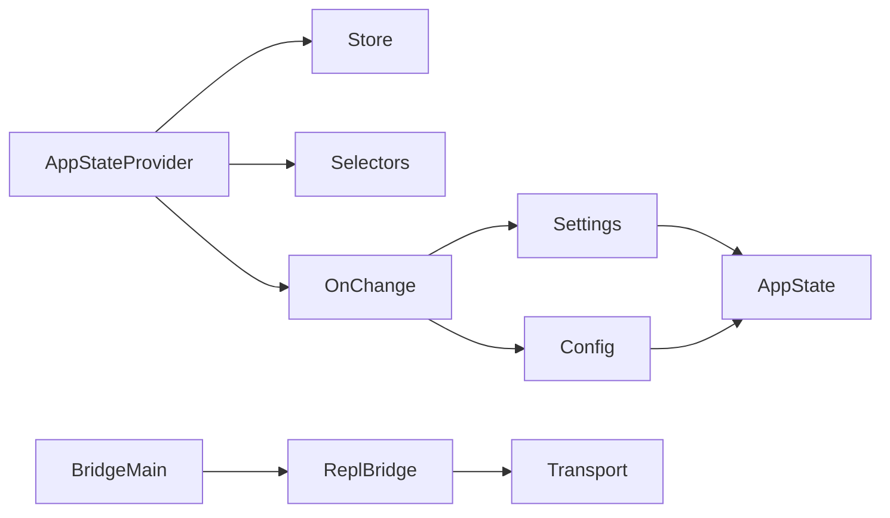

# 状态管理系统概述

<cite>
**本文档引用的文件**
- [AppState.tsx](file://state/AppState.tsx)
- [store.ts](file://state/store.ts)
- [AppStateStore.ts](file://state/AppStateStore.ts)
- [selectors.ts](file://state/selectors.ts)
- [onChangeAppState.ts](file://state/onChangeAppState.ts)
- [state.ts](file://bootstrap/state.ts)
- [bridgeMain.ts](file://bridge/bridgeMain.ts)
- [replBridge.ts](file://bridge/replBridge.ts)
- [replBridgeTransport.ts](file://bridge/replBridgeTransport.ts)
- [settings.ts](file://utils/settings/settings.ts)
- [config.ts](file://utils/config.ts)
- [fileStateCache.ts](file://utils/fileStateCache.ts)
- [memoize.ts](file://utils/memoize.ts)
</cite>

## 目录
1. [简介](#简介)
2. [项目结构](#项目结构)
3. [核心组件](#核心组件)
4. [架构总览](#架构总览)
5. [详细组件分析](#详细组件分析)
6. [依赖关系分析](#依赖关系分析)
7. [性能考虑](#性能考虑)
8. [故障排除指南](#故障排除指南)
9. [结论](#结论)

## 简介
本文件为状态管理系统的综合性文档，聚焦于应用状态的定义、更新机制、状态选择器模式、持久化策略、同步机制与缓存管理，以及状态与用户界面的集成方式。同时涵盖状态在多代理协作与远程桥接中的作用，并提供扩展与自定义状态的开发指南及最佳实践。

## 项目结构
状态管理相关代码主要分布在以下模块：
- state：应用状态定义与存储（AppState、AppStateStore、store、selectors、onChangeAppState）
- bootstrap：进程级会话状态（用于跨模块共享的全局状态）
- bridge：远程桥接与多代理协作（环境注册、会话创建、传输层、重连策略）
- utils：设置与配置、缓存与内存管理、工具函数

**图表来源**
- [AppState.tsx:1-200](file://state/AppState.tsx#L1-L200)
- [AppStateStore.ts:1-570](file://state/AppStateStore.ts#L1-L570)
- [store.ts:1-35](file://state/store.ts#L1-L35)
- [selectors.ts:1-77](file://state/selectors.ts#L1-L77)
- [onChangeAppState.ts:1-172](file://state/onChangeAppState.ts#L1-L172)
- [state.ts:1-800](file://bootstrap/state.ts#L1-L800)
- [bridgeMain.ts:1-800](file://bridge/bridgeMain.ts#L1-L800)
- [replBridge.ts:1-800](file://bridge/replBridge.ts#L1-L800)
- [replBridgeTransport.ts:343-370](file://bridge/replBridgeTransport.ts#L343-L370)
- [settings.ts:1-200](file://utils/settings/settings.ts#L1-L200)
- [config.ts:1-200](file://utils/config.ts#L1-L200)
- [fileStateCache.ts:90-126](file://utils/fileStateCache.ts#L90-L126)
- [memoize.ts:134-172](file://utils/memoize.ts#L134-L172)

**章节来源**
- [AppState.tsx:1-200](file://state/AppState.tsx#L1-L200)
- [AppStateStore.ts:1-570](file://state/AppStateStore.ts#L1-L570)
- [store.ts:1-35](file://state/store.ts#L1-L35)
- [selectors.ts:1-77](file://state/selectors.ts#L1-L77)
- [onChangeAppState.ts:1-172](file://state/onChangeAppState.ts#L1-L172)
- [state.ts:1-800](file://bootstrap/state.ts#L1-L800)
- [bridgeMain.ts:1-800](file://bridge/bridgeMain.ts#L1-L800)
- [replBridge.ts:1-800](file://bridge/replBridge.ts#L1-L800)
- [replBridgeTransport.ts:343-370](file://bridge/replBridgeTransport.ts#L343-L370)
- [settings.ts:1-200](file://utils/settings/settings.ts#L1-L200)
- [config.ts:1-200](file://utils/config.ts#L1-L200)
- [fileStateCache.ts:90-126](file://utils/fileStateCache.ts#L90-L126)
- [memoize.ts:134-172](file://utils/memoize.ts#L134-L172)

## 核心组件
- Store 与状态提供者
  - Store 提供 getState、setState、subscribe 三件套，支持对象相等性比较去重与监听器集合广播。
  - AppStateProvider 将 Store 注入上下文，提供 useAppState/useSetAppState/useAppStateStore 钩子，支持安全访问与外部设置变更同步。
- 应用状态模型
  - AppState 定义了丰富的领域状态，包括设置、权限、任务、插件、通知、提示词建议、推测状态、远程桥接状态等。
  - 默认状态 getDefaultAppState 通过惰性导入避免循环依赖。
- 选择器与变更副作用
  - selectors 提供纯函数选择器，从 AppState 派生视图所需的数据。
  - onChangeAppState 在状态变更时触发副作用：同步权限模式到外部元数据、更新设置、持久化全局配置、清理认证缓存等。

**章节来源**
- [store.ts:1-35](file://state/store.ts#L1-L35)
- [AppState.tsx:1-200](file://state/AppState.tsx#L1-L200)
- [AppStateStore.ts:1-570](file://state/AppStateStore.ts#L1-L570)
- [selectors.ts:1-77](file://state/selectors.ts#L1-L77)
- [onChangeAppState.ts:1-172](file://state/onChangeAppState.ts#L1-L172)

## 架构总览
状态管理采用“集中式Store + React订阅 + 副作用同步”的架构：
- 数据流：组件通过 useAppState 订阅状态切片；通过 useSetAppState 更新；onChange 回调统一处理跨模块同步。
- 外部同步：onChange 将权限模式、模型设置、全局配置等写入外部系统或持久化存储。
- 远程桥接：REPL桥接与桥接主循环负责环境注册、会话创建、传输层切换与重连恢复，桥接状态与应用状态双向影响。

**图表来源**
- [AppState.tsx:1-200](file://state/AppState.tsx#L1-L200)
- [store.ts:1-35](file://state/store.ts#L1-L35)
- [onChangeAppState.ts:1-172](file://state/onChangeAppState.ts#L1-L172)

## 详细组件分析

### 组件A：状态提供者与订阅钩子
- 功能要点
  - AppStateProvider 保证不可嵌套，创建稳定 Store 实例，挂载 Mailbox/VoiceProvider，监听外部设置变更并同步到 AppState。
  - useAppState 使用 useSyncExternalStore 订阅状态切片，仅在 Object.is 比较不等时触发重渲染。
  - useSetAppState 返回稳定的 setState 引用，避免非必要渲染。
  - useAppStateMaybeOutsideOfProvider 支持在无 Provider 上下文的安全访问。
- 性能与正确性
  - 通过 Object.is 去抖，避免浅比较导致的重复渲染。
  - 不允许选择器返回原状态对象，防止误用导致的无限渲染。

**图表来源**
- [AppState.tsx:126-199](file://state/AppState.tsx#L126-L199)

**章节来源**
- [AppState.tsx:1-200](file://state/AppState.tsx#L1-L200)

### 组件B：应用状态模型与默认值
- AppState 类型覆盖范围广，包含：
  - 设置与权限：settings、toolPermissionContext、kairosEnabled、isUltraplanMode
  - 视图与交互：expandedView、footerSelection、spinnerTip、agent、statusLineText
  - 任务与代理：tasks、agentNameRegistry、foregroundedTaskId、viewingAgentTaskId
  - 插件与MCP：plugins、mcp、pluginReconnectKey
  - 通知与提示：notifications、promptSuggestion、promptSuggestionEnabled
  - 推测与思考：speculation、speculationSessionTimeSavedMs、thinkingEnabled
  - 远程桥接：replBridge* 系列字段
  - 其他：todos、inbox、workerSandboxPermissions、pending*、activeOverlays、fastMode 等
- 默认值 getDefaultAppState 通过惰性导入 teammates 工具以避免循环依赖。

**章节来源**
- [AppStateStore.ts:1-570](file://state/AppStateStore.ts#L1-L570)

### 组件C：选择器模式与派生状态
- 选择器应保持纯函数与无副作用，仅做数据提取与组合。
- 示例选择器：
  - getViewedTeammateTask：从 viewingAgentTaskId 和 tasks 中安全提取当前查看的同伴任务。
  - getActiveAgentForInput：根据当前视图状态决定输入路由目标（leader/viewed/named_agent）。

**图表来源**
- [selectors.ts:18-77](file://state/selectors.ts#L18-L77)

**章节来源**
- [selectors.ts:1-77](file://state/selectors.ts#L1-L77)

### 组件D：状态变更副作用与同步
- onChangeAppState 的职责：
  - 权限模式同步：将内部模式转换为外部模式，通知外部元数据与SDK状态流。
  - 模型设置同步：当 mainLoopModel 变更时，更新设置与主循环覆盖。
  - 全局配置持久化：根据 expandedView、verbose、tungstenPanelVisible 等字段更新全局配置。
  - 设置变更副作用：当 settings 变更时，清理认证缓存并重新应用环境变量。
- 与桥接的联动：onChange 将 isUltraplanMode 等标记写入外部元数据，确保远程控制与本地状态一致。

**图表来源**
- [onChangeAppState.ts:43-172](file://state/onChangeAppState.ts#L43-L172)

**章节来源**
- [onChangeAppState.ts:1-172](file://state/onChangeAppState.ts#L1-L172)

### 组件E：远程桥接与多代理协作
- 桥接主循环（bridgeMain）
  - 环境注册、会话创建、工作项轮询、心跳保活、容量唤醒、错误回退与重连。
  - 支持多会话模式与单会话模式，按配置调整轮询间隔与心跳频率。
- REPL桥接核心（replBridge）
  - 初始化桥接核心参数，注册环境、创建会话、启动轮询、建立传输层（v1 WebSocket 或 v2 SSE+CCR）。
  - 提供崩溃恢复与环境重建策略（尝试原地重连或创建新会话），维护消息去重与序列号。
- 传输层（replBridgeTransport）
  - v2 初始化失败时进行错误区分与回调，确保桥接能感知并恢复。

**图表来源**
- [bridgeMain.ts:141-800](file://bridge/bridgeMain.ts#L141-L800)
- [replBridge.ts:260-800](file://bridge/replBridge.ts#L260-L800)
- [replBridgeTransport.ts:343-370](file://bridge/replBridgeTransport.ts#L343-L370)

**章节来源**
- [bridgeMain.ts:1-800](file://bridge/bridgeMain.ts#L1-L800)
- [replBridge.ts:1-800](file://bridge/replBridge.ts#L1-L800)
- [replBridgeTransport.ts:343-370](file://bridge/replBridgeTransport.ts#L343-L370)

### 组件F：持久化策略与缓存管理
- 设置与配置
  - 设置系统通过多源合并（用户、项目、本地、标志、策略）构建最终设置，支持缓存与校验。
  - 全局配置（config.ts）保存用户偏好、主题、通知渠道、项目配置等，支持文件监控与热更新。
- 文件状态缓存
  - 文件状态缓存使用 LRU 策略限制条目与大小，支持克隆与序列化，避免内存膨胀。
- 记忆化缓存
  - 记忆化函数在并发请求时避免重复计算，支持过期刷新与防抖。

**章节来源**
- [settings.ts:1-200](file://utils/settings/settings.ts#L1-L200)
- [config.ts:1-200](file://utils/config.ts#L1-L200)
- [fileStateCache.ts:90-126](file://utils/fileStateCache.ts#L90-L126)
- [memoize.ts:134-172](file://utils/memoize.ts#L134-L172)

## 依赖关系分析
- 组件耦合
  - AppStateProvider 与 Store 高内聚，通过上下文解耦组件与状态。
  - onChangeAppState 作为横切关注点，依赖设置系统与配置系统，形成弱依赖。
  - 选择器与 AppState 纯依赖，便于测试与复用。
- 外部依赖
  - 桥接模块依赖网络与传输层，具备容错与重试机制。
  - 设置与配置模块依赖文件系统与缓存，具备错误处理与回退策略。

**图表来源**
- [AppState.tsx:1-200](file://state/AppState.tsx#L1-L200)
- [onChangeAppState.ts:1-172](file://state/onChangeAppState.ts#L1-L172)
- [replBridge.ts:1-800](file://bridge/replBridge.ts#L1-L800)
- [bridgeMain.ts:1-800](file://bridge/bridgeMain.ts#L1-L800)

**章节来源**
- [AppState.tsx:1-200](file://state/AppState.tsx#L1-L200)
- [onChangeAppState.ts:1-172](file://state/onChangeAppState.ts#L1-L172)
- [replBridge.ts:1-800](file://bridge/replBridge.ts#L1-L800)
- [bridgeMain.ts:1-800](file://bridge/bridgeMain.ts#L1-L800)

## 性能考虑
- 渲染优化
  - 使用 useSyncExternalStore 与 Object.is 比较，避免不必要的重渲染。
  - 选择器不应返回新对象，推荐返回现有子引用以提升比较命中率。
- 状态更新
  - setState 内部先计算 next，再与 prev 比较，相同则直接返回，减少广播。
  - onChange 仅在必要时触发外部同步，降低 I/O 开销。
- 缓存与内存
  - 文件状态缓存限制条目与大小，避免内存增长。
  - 记忆化缓存支持并发去重与过期刷新，减少重复计算。
- 桥接性能
  - 多会话模式下的心跳与轮询间隔可动态调整，避免过度请求。
  - 传输层初始化失败快速降级与回调，缩短恢复时间。

[本节为通用指导，无需特定文件引用]

## 故障排除指南
- 状态未更新或渲染异常
  - 检查选择器是否返回新对象；确认使用 Object.is 的比较语义。
  - 确认在 Provider 上下文中使用钩子，避免 useAppStateMaybeOutsideOfProvider 返回 undefined。
- 权限模式不同步
  - 确认 onChangeAppState 是否被触发；检查外部元数据与 SDK 通知链路。
- 设置变更未生效
  - 检查 settings 变更后是否清理认证缓存并重新应用环境变量。
- 桥接断开或重连频繁
  - 查看桥接日志与回退策略；确认传输层初始化与心跳保活配置。
  - 检查容量唤醒与轮询间隔设置，避免过度轮询。

**章节来源**
- [AppState.tsx:126-199](file://state/AppState.tsx#L126-L199)
- [onChangeAppState.ts:1-172](file://state/onChangeAppState.ts#L1-L172)
- [bridgeMain.ts:1-800](file://bridge/bridgeMain.ts#L1-L800)

## 结论
本状态管理系统以集中式 Store 为核心，结合 React 订阅与副作用同步，实现了高效、可扩展的应用状态管理。通过严格的渲染优化、完善的持久化与缓存策略，以及与远程桥接的深度集成，系统在复杂场景下仍能保持稳定与高性能。开发者可遵循本文档的模式与最佳实践，安全地扩展与定制状态，满足多代理协作与远程桥接的需求。