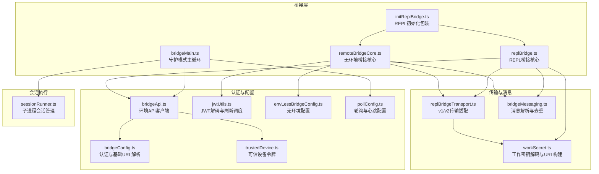
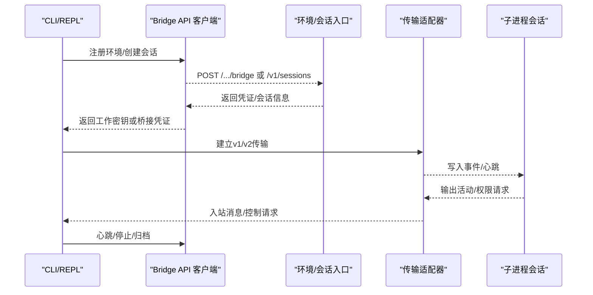
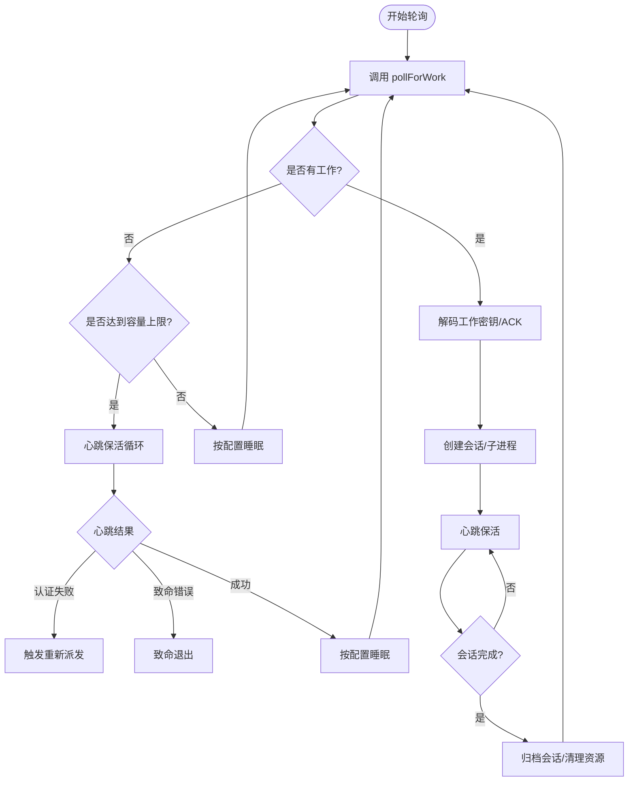
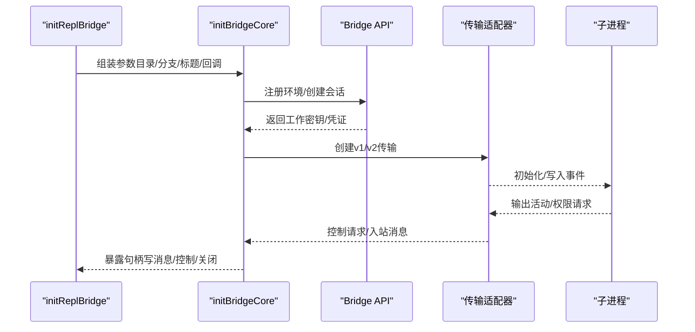
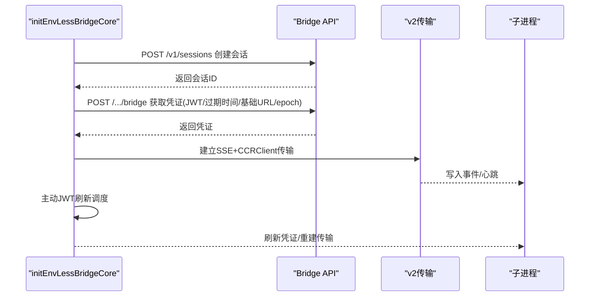
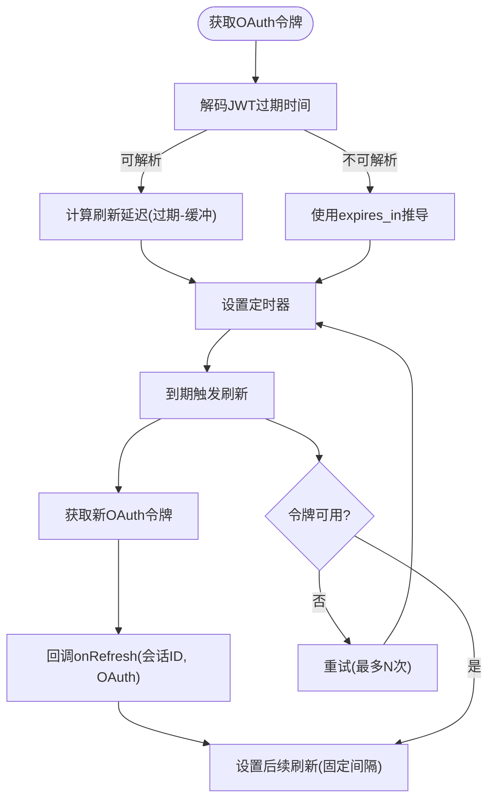
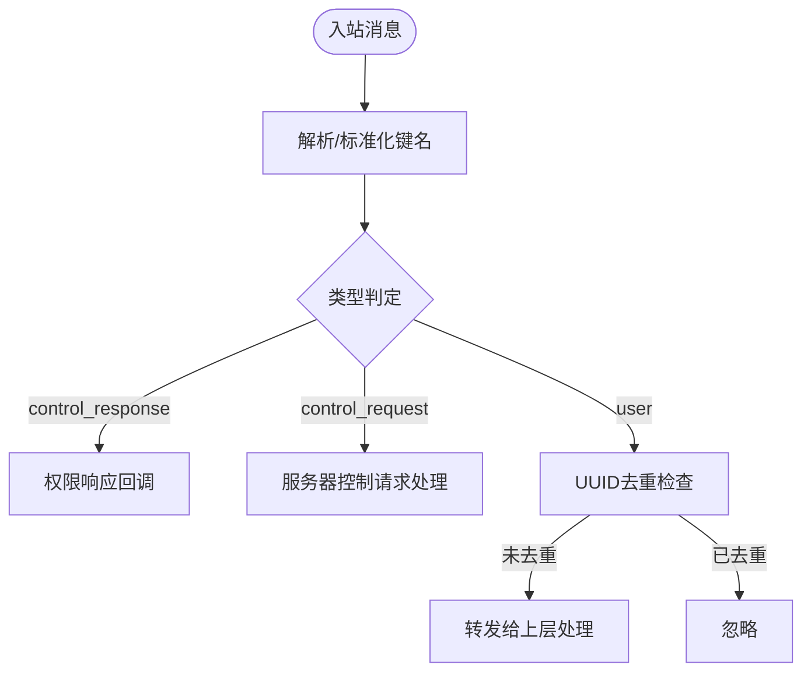
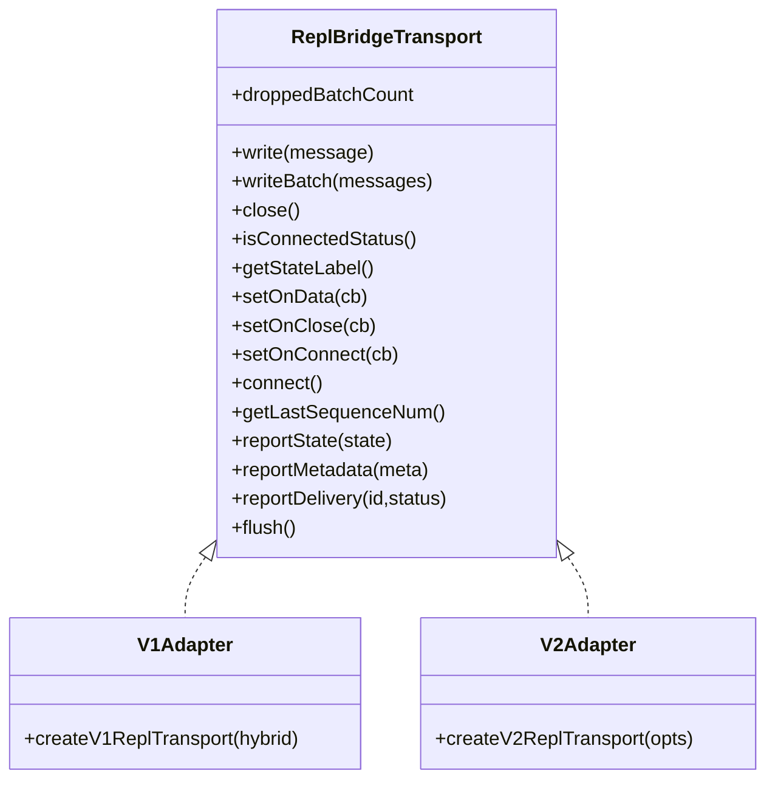
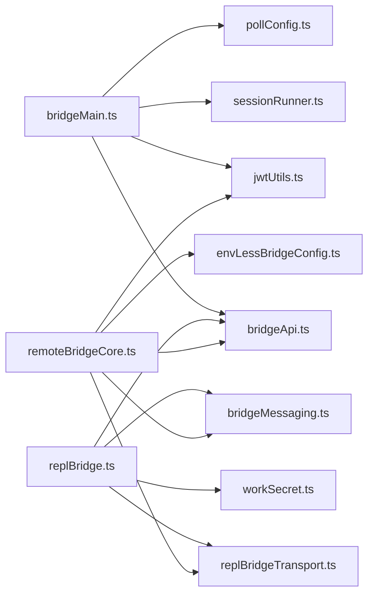

# 远程桥接架构

<cite>
**本文档引用的文件**
- [bridgeMain.ts](file://bridge/bridgeMain.ts)
- [remoteBridgeCore.ts](file://bridge/remoteBridgeCore.ts)
- [replBridge.ts](file://bridge/replBridge.ts)
- [jwtUtils.ts](file://bridge/jwtUtils.ts)
- [types.ts](file://bridge/types.ts)
- [bridgeApi.ts](file://bridge/bridgeApi.ts)
- [sessionRunner.ts](file://bridge/sessionRunner.ts)
- [bridgeConfig.ts](file://bridge/bridgeConfig.ts)
- [pollConfig.ts](file://bridge/pollConfig.ts)
- [bridgeMessaging.ts](file://bridge/bridgeMessaging.ts)
- [replBridgeTransport.ts](file://bridge/replBridgeTransport.ts)
- [initReplBridge.ts](file://bridge/initReplBridge.ts)
- [envLessBridgeConfig.ts](file://bridge/envLessBridgeConfig.ts)
- [trustedDevice.ts](file://bridge/trustedDevice.ts)
- [workSecret.ts](file://bridge/workSecret.ts)
</cite>

## 目录
1. [简介](#简介)
2. [项目结构](#项目结构)
3. [核心组件](#核心组件)
4. [架构总览](#架构总览)
5. [详细组件分析](#详细组件分析)
6. [依赖关系分析](#依赖关系分析)
7. [性能考虑](#性能考虑)
8. [故障排除指南](#故障排除指南)
9. [结论](#结论)
10. [附录](#附录)

## 简介
本文件系统性阐述远程桥接架构的设计理念与实现细节，覆盖桥接建立、维护与管理机制，会话管理、容量控制与JWT认证，安全机制（含可信设备令牌）、数据加密与访问控制，以及配置选项与故障排除。文档同时提供可直接定位到源码路径的示例，帮助开发者快速实现远程控制功能。

## 项目结构
远程桥接相关代码主要位于 `bridge/` 目录，围绕两类桥接路径：
- 环境（Environments）路径：通过注册环境、轮询工作项、心跳保活、ACK/停止等流程驱动子进程会话（适用于守护模式与多会话场景）。
- 无环境（Env-less）路径：直接基于会话入口（/bridge）获取工作凭证，使用CCE v2协议进行SSE读写与心跳，适用于REPL即时控制场景。

**图表来源**
- [bridgeMain.ts](file://bridge/bridgeMain.ts)
- [replBridge.ts](file://bridge/replBridge.ts)
- [remoteBridgeCore.ts](file://bridge/remoteBridgeCore.ts)
- [initReplBridge.ts](file://bridge/initReplBridge.ts)
- [replBridgeTransport.ts](file://bridge/replBridgeTransport.ts)
- [bridgeMessaging.ts](file://bridge/bridgeMessaging.ts)
- [workSecret.ts](file://bridge/workSecret.ts)
- [bridgeApi.ts](file://bridge/bridgeApi.ts)
- [jwtUtils.ts](file://bridge/jwtUtils.ts)
- [bridgeConfig.ts](file://bridge/bridgeConfig.ts)
- [trustedDevice.ts](file://bridge/trustedDevice.ts)
- [envLessBridgeConfig.ts](file://bridge/envLessBridgeConfig.ts)
- [pollConfig.ts](file://bridge/pollConfig.ts)
- [sessionRunner.ts](file://bridge/sessionRunner.ts)

**章节来源**
- [bridgeMain.ts](file://bridge/bridgeMain.ts)
- [replBridge.ts](file://bridge/replBridge.ts)
- [remoteBridgeCore.ts](file://bridge/remoteBridgeCore.ts)
- [initReplBridge.ts](file://bridge/initReplBridge.ts)
- [replBridgeTransport.ts](file://bridge/replBridgeTransport.ts)
- [bridgeMessaging.ts](file://bridge/bridgeMessaging.ts)
- [workSecret.ts](file://bridge/workSecret.ts)
- [bridgeApi.ts](file://bridge/bridgeApi.ts)
- [jwtUtils.ts](file://bridge/jwtUtils.ts)
- [bridgeConfig.ts](file://bridge/bridgeConfig.ts)
- [trustedDevice.ts](file://bridge/trustedDevice.ts)
- [envLessBridgeConfig.ts](file://bridge/envLessBridgeConfig.ts)
- [pollConfig.ts](file://bridge/pollConfig.ts)
- [sessionRunner.ts](file://bridge/sessionRunner.ts)

## 核心组件
- 桥接API客户端：封装环境注册、轮询、ACK、停止、注销、权限事件发送、会话归档、心跳等接口，统一处理401重试与致命错误分类。
- 会话运行器：负责子进程的启动、标准流解析、活动追踪、权限请求转发、令牌更新注入等。
- 传输适配器：统一v1（HybridTransport）与v2（SSETransport + CCRClient）两种传输形态，屏蔽上层差异。
- 消息处理：统一解析入站消息、去重回声与重复提示、路由控制请求与权限响应。
- JWT工具：解码JWT载荷、计算过期时间、调度刷新（支持缓冲区与失败重试）。
- 配置与门控：环境轮询参数、无环境桥接参数、可信设备令牌、最小版本检查等。

**章节来源**
- [types.ts](file://bridge/types.ts)
- [bridgeApi.ts](file://bridge/bridgeApi.ts)
- [sessionRunner.ts](file://bridge/sessionRunner.ts)
- [replBridgeTransport.ts](file://bridge/replBridgeTransport.ts)
- [bridgeMessaging.ts](file://bridge/bridgeMessaging.ts)
- [jwtUtils.ts](file://bridge/jwtUtils.ts)
- [pollConfig.ts](file://bridge/pollConfig.ts)
- [envLessBridgeConfig.ts](file://bridge/envLessBridgeConfig.ts)
- [trustedDevice.ts](file://bridge/trustedDevice.ts)

## 架构总览
远程桥接分为两大路径：

- 环境路径（守护/多会话）
  - 注册环境 → 轮询工作项 → 解码工作密钥 → 建立会话 → 子进程执行 → 心跳保活 → 归档会话
- 无环境路径（REPL即时控制）
  - 创建会话 → 获取桥接凭证（JWT）→ 建立v2传输（SSE+CCRClient）→ 主动JWT刷新 → 权限控制与标题派生

**图表来源**
- [bridgeApi.ts](file://bridge/bridgeApi.ts)
- [replBridgeTransport.ts](file://bridge/replBridgeTransport.ts)
- [sessionRunner.ts](file://bridge/sessionRunner.ts)
- [remoteBridgeCore.ts](file://bridge/remoteBridgeCore.ts)

## 详细组件分析

### 组件A：守护模式主循环（bridgeMain.ts）
- 负责环境注册、轮询工作项、心跳保活、会话生命周期管理、容量控制与恢复策略。
- 支持多会话模式、容量唤醒、超时监控、日志与诊断输出。
- 关键流程：轮询空闲时的心跳模式、容量饱和时的低频轮询、JWT过期触发重新派发、会话结束后的归档与清理。

**图表来源**
- [bridgeMain.ts](file://bridge/bridgeMain.ts)
- [bridgeApi.ts](file://bridge/bridgeApi.ts)
- [sessionRunner.ts](file://bridge/sessionRunner.ts)

**章节来源**
- [bridgeMain.ts](file://bridge/bridgeMain.ts)
- [bridgeApi.ts](file://bridge/bridgeApi.ts)
- [sessionRunner.ts](file://bridge/sessionRunner.ts)

### 组件B：REPL桥接核心（replBridge.ts）
- 封装环境注册、会话创建、轮询/心跳、传输建立与重建、标题派生、权限控制、崩溃恢复与持久化。
- 支持v1（HybridTransport）与v2（SSETransport+CCRClient）传输选择，自动握手与epoch管理。
- 提供桥接句柄（ReplBridgeHandle），统一写消息、控制请求、结果上报与优雅关闭。

**图表来源**
- [initReplBridge.ts](file://bridge/initReplBridge.ts)
- [replBridge.ts](file://bridge/replBridge.ts)
- [replBridgeTransport.ts](file://bridge/replBridgeTransport.ts)
- [bridgeApi.ts](file://bridge/bridgeApi.ts)

**章节来源**
- [initReplBridge.ts](file://bridge/initReplBridge.ts)
- [replBridge.ts](file://bridge/replBridge.ts)
- [replBridgeTransport.ts](file://bridge/replBridgeTransport.ts)
- [bridgeApi.ts](file://bridge/bridgeApi.ts)

### 组件C：无环境桥接核心（remoteBridgeCore.ts）
- 直接创建会话并获取桥接凭证（JWT），建立v2传输，主动JWT刷新与401恢复，历史消息初始刷新与去重。
- 适用于REPL即时控制场景，避免环境层开销，支持仅出站模式（镜像附件）。

**图表来源**
- [remoteBridgeCore.ts](file://bridge/remoteBridgeCore.ts)
- [replBridgeTransport.ts](file://bridge/replBridgeTransport.ts)
- [bridgeApi.ts](file://bridge/bridgeApi.ts)

**章节来源**
- [remoteBridgeCore.ts](file://bridge/remoteBridgeCore.ts)
- [replBridgeTransport.ts](file://bridge/replBridgeTransport.ts)
- [bridgeApi.ts](file://bridge/bridgeApi.ts)

### 组件D：JWT认证与刷新（jwtUtils.ts）
- 解析JWT载荷与过期时间，支持从expires_in推导刷新时机。
- 提供生成器：schedule/scheduleFromExpiresIn/cancel/cancelAll，带代数生成器防竞态、失败计数与重试延迟。
- 用于守护模式与REPL桥接的凭证续期。

**图表来源**
- [jwtUtils.ts](file://bridge/jwtUtils.ts)

**章节来源**
- [jwtUtils.ts](file://bridge/jwtUtils.ts)

### 组件E：消息处理与去重（bridgeMessaging.ts）
- 统一SDK消息类型判定、控制请求/响应解析、入站消息去重（回声与重复提示）。
- 提供标题提取逻辑，支持REPL标题派生策略（首次与第三次用户消息触发）。

**图表来源**
- [bridgeMessaging.ts](file://bridge/bridgeMessaging.ts)

**章节来源**
- [bridgeMessaging.ts](file://bridge/bridgeMessaging.ts)

### 组件F：传输适配器（replBridgeTransport.ts）
- v1：HybridTransport（WS读+POST写至会话入口）。
- v2：SSETransport（读）+ CCRClient（写/心跳/状态/交付跟踪）。
- 支持epoch不匹配检测与自动恢复，outboundOnly模式（镜像附件）。

**图表来源**
- [replBridgeTransport.ts](file://bridge/replBridgeTransport.ts)

**章节来源**
- [replBridgeTransport.ts](file://bridge/replBridgeTransport.ts)

### 组件G：配置与门控（bridgeConfig.ts、envLessBridgeConfig.ts、pollConfig.ts、trustedDevice.ts）
- 认证与基础URL解析：优先开发环境覆盖，否则使用OAuth存储。
- 无环境桥接配置：重试、超时、心跳、连接超时、最小版本等。
- 轮询配置：非独占心跳、容量阈值下的轮询间隔、回收窗口等。
- 可信设备令牌：根据门控开关读取/持久化，用于Elevated安全级会话。

**章节来源**
- [bridgeConfig.ts](file://bridge/bridgeConfig.ts)
- [envLessBridgeConfig.ts](file://bridge/envLessBridgeConfig.ts)
- [pollConfig.ts](file://bridge/pollConfig.ts)
- [trustedDevice.ts](file://bridge/trustedDevice.ts)

## 依赖关系分析
- 模块耦合
  - bridgeMain.ts 依赖 bridgeApi.ts、sessionRunner.ts、pollConfig.ts、jwtUtils.ts 等，形成“轮询-心跳-会话-凭证”的闭环。
  - replBridge.ts 依赖 bridgeApi.ts、replBridgeTransport.ts、bridgeMessaging.ts、workSecret.ts 等，形成“注册-会话-传输-消息”的闭环。
  - remoteBridgeCore.ts 依赖 bridgeApi.ts、replBridgeTransport.ts、bridgeMessaging.ts、jwtUtils.ts、envLessBridgeConfig.ts 等，形成“创建-凭证-传输-刷新”的闭环。
- 外部依赖
  - axios：HTTP请求（API调用、SSE/CCRClient写入）。
  - child_process：子进程会话管理。
  - SSETransport/CCRClient：v2传输栈。

**图表来源**
- [bridgeMain.ts](file://bridge/bridgeMain.ts)
- [replBridge.ts](file://bridge/replBridge.ts)
- [remoteBridgeCore.ts](file://bridge/remoteBridgeCore.ts)
- [bridgeApi.ts](file://bridge/bridgeApi.ts)
- [sessionRunner.ts](file://bridge/sessionRunner.ts)
- [pollConfig.ts](file://bridge/pollConfig.ts)
- [jwtUtils.ts](file://bridge/jwtUtils.ts)
- [replBridgeTransport.ts](file://bridge/replBridgeTransport.ts)
- [bridgeMessaging.ts](file://bridge/bridgeMessaging.ts)
- [workSecret.ts](file://bridge/workSecret.ts)
- [envLessBridgeConfig.ts](file://bridge/envLessBridgeConfig.ts)

**章节来源**
- [bridgeMain.ts](file://bridge/bridgeMain.ts)
- [replBridge.ts](file://bridge/replBridge.ts)
- [remoteBridgeCore.ts](file://bridge/remoteBridgeCore.ts)
- [bridgeApi.ts](file://bridge/bridgeApi.ts)
- [sessionRunner.ts](file://bridge/sessionRunner.ts)
- [pollConfig.ts](file://bridge/pollConfig.ts)
- [jwtUtils.ts](file://bridge/jwtUtils.ts)
- [replBridgeTransport.ts](file://bridge/replBridgeTransport.ts)
- [bridgeMessaging.ts](file://bridge/bridgeMessaging.ts)
- [workSecret.ts](file://bridge/workSecret.ts)
- [envLessBridgeConfig.ts](file://bridge/envLessBridgeConfig.ts)

## 性能考虑
- 轮询与心跳
  - 通过 GrowthBook 动态配置轮询间隔、容量饱和时的心跳与轮询组合，避免过度轮询导致后端压力。
- 传输选择
  - v2（SSE+CCRClient）减少轮询依赖，降低延迟；v1（HybridTransport）兼容旧环境。
- 刷新策略
  - JWT主动刷新与失败重试，避免长时间无响应导致的会话中断。
- 去重与顺序
  - UUID环形缓冲去重与初始历史刷写队列，保证消息顺序与幂等。

[本节为通用指导，无需具体文件引用]

## 故障排除指南
- 认证失败（401）
  - 触发OAuth刷新重试；若失败则抛出致命错误，需重新登录。
  - 参考：[bridgeApi.ts](file://bridge/bridgeApi.ts)
- 会话过期（404/410）
  - 环境或会话生命周期结束，需重新注册/创建会话。
  - 参考：[bridgeApi.ts](file://bridge/bridgeApi.ts)
- 传输异常（409/4090/4091）
  - epoch不匹配或初始化失败，触发传输重建与重新派发。
  - 参考：[replBridgeTransport.ts](file://bridge/replBridgeTransport.ts)
- 超时与静默
  - v2连接超时、归档超时、轮询空闲日志阈值，结合诊断日志定位问题。
  - 参考：[envLessBridgeConfig.ts](file://bridge/envLessBridgeConfig.ts)、[pollConfig.ts](file://bridge/pollConfig.ts)
- 可信设备令牌
  - 门控开启时未提供令牌或校验失败，检查存储与门控状态。
  - 参考：[trustedDevice.ts](file://bridge/trustedDevice.ts)

**章节来源**
- [bridgeApi.ts](file://bridge/bridgeApi.ts)
- [replBridgeTransport.ts](file://bridge/replBridgeTransport.ts)
- [envLessBridgeConfig.ts](file://bridge/envLessBridgeConfig.ts)
- [pollConfig.ts](file://bridge/pollConfig.ts)
- [trustedDevice.ts](file://bridge/trustedDevice.ts)

## 结论
远程桥接架构通过“环境路径”与“无环境路径”两条主线，分别满足守护模式与REPL即时控制场景。其设计强调：
- 明确的生命周期与错误分类（致命/可恢复）
- 可观测与可调试（日志、诊断、遥测）
- 可扩展的传输与消息模型（v1/v2、去重与标题派生）
- 强健的认证与安全（OAuth/JWT、可信设备令牌）

开发者可基于上述组件与流程，快速实现远程控制功能，并在生产环境中通过配置门控与健康检查保障稳定性。

[本节为总结性内容，无需具体文件引用]

## 附录

### 实现指南与代码示例（路径定位）
- 建立守护模式桥接连接
  - 环境注册与轮询：[bridgeMain.ts](file://bridge/bridgeMain.ts)
  - API客户端封装：[bridgeApi.ts](file://bridge/bridgeApi.ts)
- 管理远程会话
  - 子进程会话管理与活动追踪：[sessionRunner.ts](file://bridge/sessionRunner.ts)
  - 会话归档与清理：[bridgeApi.ts](file://bridge/bridgeApi.ts)
- 处理桥接事件
  - 入站消息解析与去重：[bridgeMessaging.ts](file://bridge/bridgeMessaging.ts)
  - 服务器控制请求处理：[bridgeMessaging.ts](file://bridge/bridgeMessaging.ts)
- JWT认证与刷新
  - 主动刷新调度与失败重试：[jwtUtils.ts](file://bridge/jwtUtils.ts)
  - v2凭证刷新与传输重建：[remoteBridgeCore.ts](file://bridge/remoteBridgeCore.ts)
- 传输适配
  - v1/v2传输适配器：[replBridgeTransport.ts](file://bridge/replBridgeTransport.ts)
- 配置选项
  - 环境轮询配置：[pollConfig.ts](file://bridge/pollConfig.ts)
  - 无环境桥接配置：[envLessBridgeConfig.ts](file://bridge/envLessBridgeConfig.ts)
  - 认证与基础URL解析：[bridgeConfig.ts](file://bridge/bridgeConfig.ts)
  - 可信设备令牌：[trustedDevice.ts](file://bridge/trustedDevice.ts)
- 安全与访问控制
  - 可信设备令牌与门控：[trustedDevice.ts](file://bridge/trustedDevice.ts)
  - 工作密钥解码与URL构建：[workSecret.ts](file://bridge/workSecret.ts)

[本节为索引性内容，无需具体文件引用]