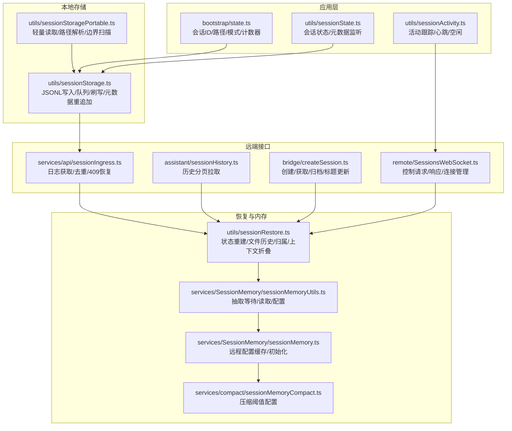
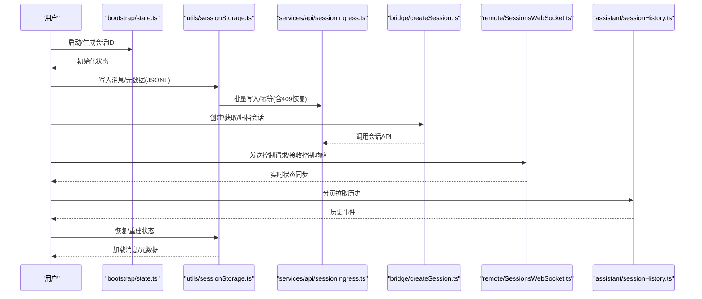
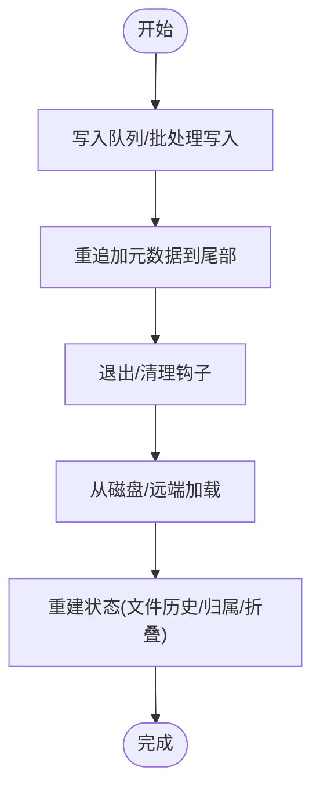
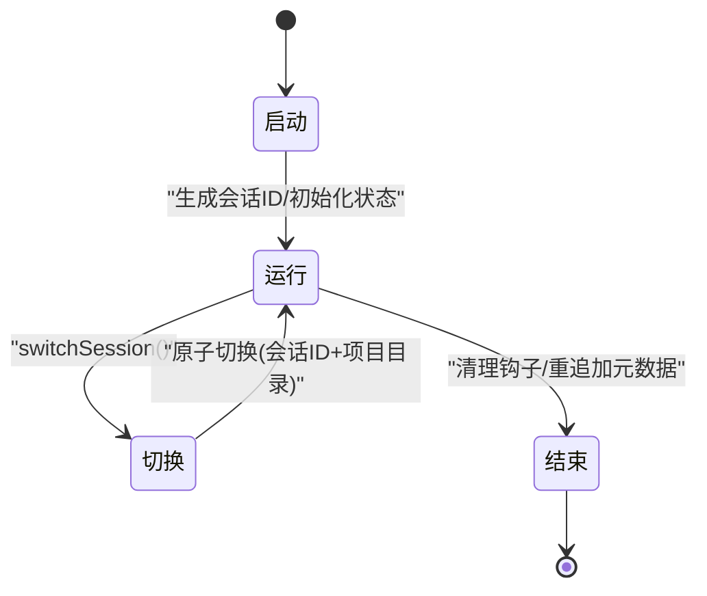
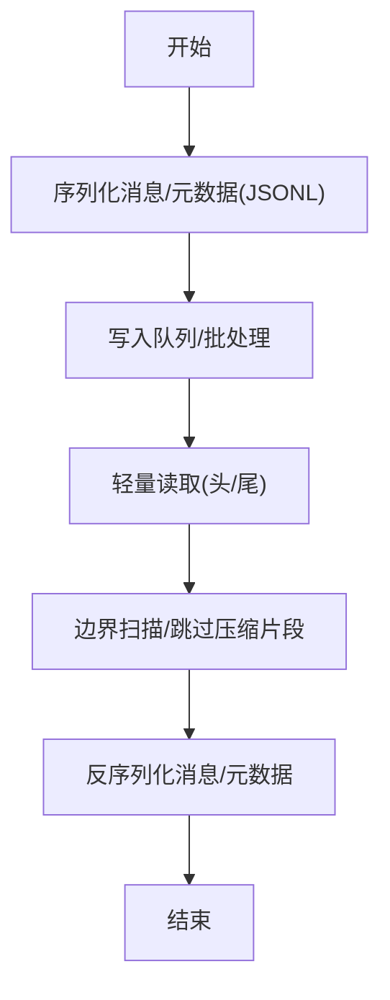
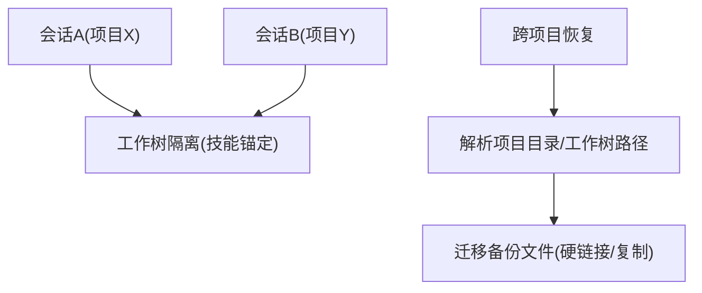
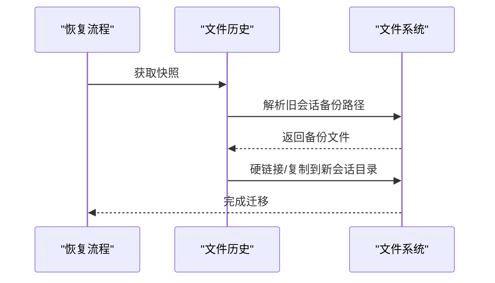
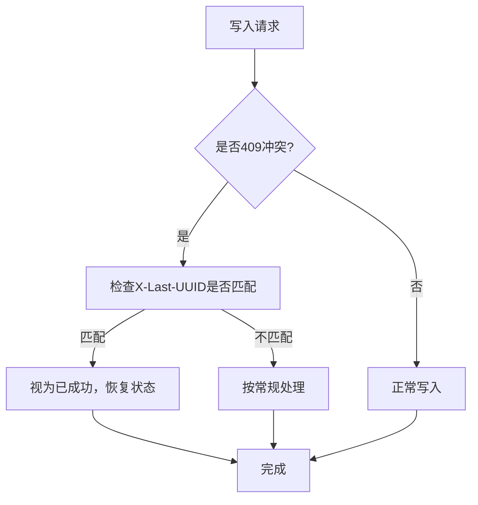
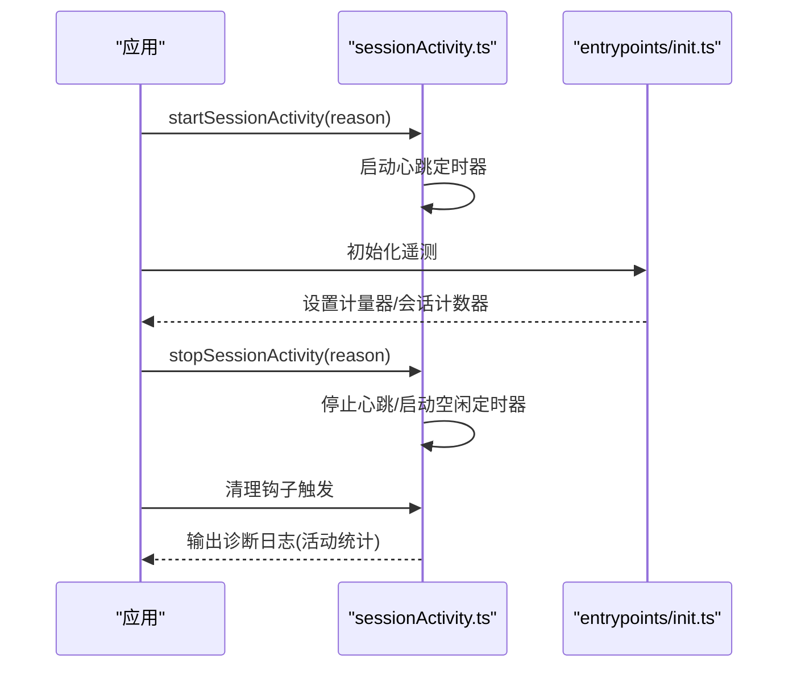
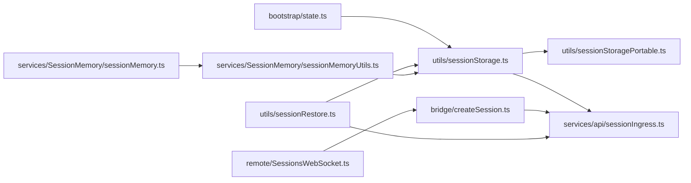

# 会话管理

<cite>
**本文引用的文件**
- [sessionStorage.ts](file://utils/sessionStorage.ts)
- [sessionRestore.ts](file://utils/sessionRestore.ts)
- [sessionState.ts](file://utils/sessionState.ts)
- [state.ts](file://bootstrap/state.ts)
- [sessionIngress.ts](file://services/api/sessionIngress.ts)
- [createSession.ts](file://bridge/createSession.ts)
- [SessionsWebSocket.ts](file://remote/SessionsWebSocket.ts)
- [sessionHistory.ts](file://assistant/sessionHistory.ts)
- [sessionStoragePortable.ts](file://utils/sessionStoragePortable.ts)
- [sessionActivity.ts](file://utils/sessionActivity.ts)
- [sessionMemoryUtils.ts](file://services/SessionMemory/sessionMemoryUtils.ts)
- [sessionMemory.ts](file://services/SessionMemory/sessionMemory.ts)
- [sessionMemoryCompact.ts](file://services/compact/sessionMemoryCompact.ts)
- [fileHistory.ts](file://utils/fileHistory.ts)
- [init.ts](file://entrypoints/init.ts)
</cite>

## 目录
1. [简介](#简介)
2. [项目结构](#项目结构)
3. [核心组件](#核心组件)
4. [架构总览](#架构总览)
5. [详细组件分析](#详细组件分析)
6. [依赖关系分析](#依赖关系分析)
7. [性能考量](#性能考量)
8. [故障排查指南](#故障排查指南)
9. [结论](#结论)
10. [附录](#附录)

## 简介
本文件系统性阐述 Claude Code 的会话管理系统，围绕以下主题展开：会话状态的保存与恢复、会话生命周期管理、会话数据的序列化与反序列化、会话间的数据隔离与共享、会话备份与恢复、会话状态的版本管理与向后兼容、会话监控与诊断工具的使用，以及性能优化与内存管理策略。内容基于仓库中的实际代码进行分析，并通过图示展示关键流程。

## 项目结构
会话管理涉及多个层次：
- 应用启动与全局状态：在启动阶段初始化会话 ID、工作目录、项目根等关键状态。
- 本地会话存储：负责将消息与元数据以 JSONL 格式写入磁盘，支持增量写入、批量刷写、尾部元数据重追加等能力。
- 远端会话接口：通过会话入口（Session Ingress）与远端 API 交互，实现日志持久化、历史拉取与错误处理。
- 桥接与远程控制：桥接层提供会话创建、获取、归档与标题更新等操作；远程 WebSocket 负责实时控制与状态同步。
- 会话恢复：从磁盘或远端加载会话，重建状态、文件历史、归属信息、上下文折叠等。
- 会话内存与压缩：会话记忆抽取与压缩配置，保障长会话的上下文窗口与性能。
- 诊断与活动跟踪：心跳与空闲检测、遥测初始化、会话活动计数器等。

**图表来源**
- [state.ts:1-800](file://bootstrap/state.ts#L1-L800)
- [sessionStorage.ts:1-800](file://utils/sessionStorage.ts#L1-L800)
- [sessionStoragePortable.ts:1-794](file://utils/sessionStoragePortable.ts#L1-L794)
- [sessionIngress.ts:449-485](file://services/api/sessionIngress.ts#L449-L485)
- [sessionHistory.ts:1-88](file://assistant/sessionHistory.ts#L1-L88)
- [createSession.ts:1-385](file://bridge/createSession.ts#L1-L385)
- [SessionsWebSocket.ts:194-377](file://remote/SessionsWebSocket.ts#L194-L377)
- [sessionRestore.ts:1-552](file://utils/sessionRestore.ts#L1-L552)
- [sessionMemoryUtils.ts:1-207](file://services/SessionMemory/sessionMemoryUtils.ts#L1-L207)
- [sessionMemory.ts:64-264](file://services/SessionMemory/sessionMemory.ts#L64-L264)
- [sessionMemoryCompact.ts:44-96](file://services/compact/sessionMemoryCompact.ts#L44-L96)

**章节来源**
- [state.ts:1-800](file://bootstrap/state.ts#L1-L800)
- [sessionStorage.ts:1-800](file://utils/sessionStorage.ts#L1-L800)
- [sessionStoragePortable.ts:1-794](file://utils/sessionStoragePortable.ts#L1-L794)

## 核心组件
- 全局会话状态与切换
  - 会话 ID、项目根、原始工作目录、当前工作目录、主循环模型覆盖、会话持久化开关等均在启动时初始化，并提供切换会话的能力，确保会话 ID 与项目目录原子一致。
- 本地会话存储
  - 使用 JSONL 记录消息与元数据，采用写入队列与批处理写入，支持在退出时将关键元数据（如自定义标题、标签、最后提示词等）重追加到文件尾部，保证快速读取。
- 会话入口与远端交互
  - 提供日志获取、幂等写入与 409 冲突恢复逻辑；支持通过历史接口分页拉取事件；桥接层提供会话创建、获取、归档与标题更新。
- 会话恢复
  - 从磁盘或远端加载会话，重建文件历史、归属信息、上下文折叠、待办列表等；支持在不同工作树之间迁移备份文件。
- 会话内存与压缩
  - 支持会话记忆抽取的等待与读取、远程配置缓存与初始化、压缩阈值配置，保障长会话的上下文窗口与性能。
- 会话监控与诊断
  - 活动跟踪（心跳/空闲）、遥测初始化、会话状态事件广播、诊断日志记录等。

**章节来源**
- [state.ts:431-498](file://bootstrap/state.ts#L431-L498)
- [sessionStorage.ts:530-800](file://utils/sessionStorage.ts#L530-L800)
- [sessionIngress.ts:77-103](file://services/api/sessionIngress.ts#L77-L103)
- [sessionRestore.ts:99-150](file://utils/sessionRestore.ts#L99-L150)
- [sessionMemoryUtils.ts:89-138](file://services/SessionMemory/sessionMemoryUtils.ts#L89-L138)
- [sessionMemory.ts:240-264](file://services/SessionMemory/sessionMemory.ts#L240-L264)
- [sessionActivity.ts:1-134](file://utils/sessionActivity.ts#L1-L134)

## 架构总览
下图展示了会话从创建、运行、持久化、恢复到监控的整体流程。

**图表来源**
- [state.ts:431-498](file://bootstrap/state.ts#L431-L498)
- [sessionStorage.ts:530-800](file://utils/sessionStorage.ts#L530-L800)
- [sessionIngress.ts:77-103](file://services/api/sessionIngress.ts#L77-L103)
- [createSession.ts:182-244](file://bridge/createSession.ts#L182-L244)
- [SessionsWebSocket.ts:328-357](file://remote/SessionsWebSocket.ts#L328-L357)
- [sessionHistory.ts:73-87](file://assistant/sessionHistory.ts#L73-L87)

## 详细组件分析

### 组件A：会话状态保存与恢复
- 保存机制
  - 写入队列与批处理：将消息按行写入 JSONL 文件，超过阈值或定时器触发时批量写入，减少磁盘 I/O。
  - 尾部元数据重追加：在清理钩子与退出时，将自定义标题、标签、最后提示词等关键元数据重追加到文件尾部，确保快速读取。
  - 会话元数据缓存：在内存中缓存会话元数据，避免频繁磁盘访问。
- 恢复机制
  - 从磁盘加载：通过轻量读取与边界扫描跳过压缩边界，仅保留必要片段；支持跨工作树查找会话文件。
  - 从远端加载：通过会话入口与历史接口拉取事件，重建消息链与元数据。
  - 状态重建：重建文件历史、归属信息、上下文折叠、待办列表等；支持在不同会话 ID 之间迁移备份文件。

**图表来源**
- [sessionStorage.ts:530-800](file://utils/sessionStorage.ts#L530-L800)
- [sessionRestore.ts:99-150](file://utils/sessionRestore.ts#L99-L150)
- [sessionStoragePortable.ts:717-794](file://utils/sessionStoragePortable.ts#L717-L794)

**章节来源**
- [sessionStorage.ts:530-800](file://utils/sessionStorage.ts#L530-L800)
- [sessionRestore.ts:99-150](file://utils/sessionRestore.ts#L99-L150)
- [sessionStoragePortable.ts:717-794](file://utils/sessionStoragePortable.ts#L717-L794)

### 组件B：会话生命周期管理
- 生命周期节点
  - 启动：生成会话 ID，设置项目根与原始工作目录，初始化计数器与遥测。
  - 运行：记录交互时间、工具执行时长、令牌用量等；通过活动跟踪保持容器活跃。
  - 切换：原子切换会话 ID 与项目目录，确保不会漂移。
  - 结束：清理钩子触发，重追加元数据，关闭写入队列。
- 关键接口
  - 获取/切换会话 ID、设置项目根、注册会话切换回调、更新最后交互时间等。

**图表来源**
- [state.ts:431-498](file://bootstrap/state.ts#L431-L498)
- [state.ts:665-689](file://bootstrap/state.ts#L665-L689)
- [sessionActivity.ts:92-133](file://utils/sessionActivity.ts#L92-L133)

**章节来源**
- [state.ts:431-498](file://bootstrap/state.ts#L431-L498)
- [state.ts:665-689](file://bootstrap/state.ts#L665-L689)
- [sessionActivity.ts:92-133](file://utils/sessionActivity.ts#L92-L133)

### 组件C：会话数据的序列化与反序列化
- 序列化
  - 消息与元数据以 JSON 行格式写入，每条消息一行；支持在写入前进行类型校验与链路完整性检查。
  - 元数据（自定义标题、标签、最后提示词、代理名称/颜色等）作为独立条目写入，便于快速检索。
- 反序列化
  - 轻量读取：只读取文件头与尾部固定大小缓冲区，用于快速提取首提示词、元数据等。
  - 边界扫描：在大文件中定位压缩边界，跳过已压缩片段，仅加载必要部分。
  - 历史分页：通过锚点与游标分页拉取事件，避免一次性加载全部历史。

**图表来源**
- [sessionStorage.ts:530-800](file://utils/sessionStorage.ts#L530-L800)
- [sessionStoragePortable.ts:215-282](file://utils/sessionStoragePortable.ts#L215-L282)
- [sessionStoragePortable.ts:717-794](file://utils/sessionStoragePortable.ts#L717-L794)
- [sessionHistory.ts:45-87](file://assistant/sessionHistory.ts#L45-L87)

**章节来源**
- [sessionStorage.ts:530-800](file://utils/sessionStorage.ts#L530-L800)
- [sessionStoragePortable.ts:215-282](file://utils/sessionStoragePortable.ts#L215-L282)
- [sessionStoragePortable.ts:717-794](file://utils/sessionStoragePortable.ts#L717-L794)
- [sessionHistory.ts:45-87](file://assistant/sessionHistory.ts#L45-L87)

### 组件D：会话间的数据隔离与共享
- 隔离
  - 会话 ID 与项目目录原子绑定，避免会话漂移；不同项目目录下的会话文件相互隔离。
  - 工作树隔离：进入工作树时，技能与历史锚定在会话启动的项目根，避免随工作树切换而漂移。
- 共享
  - 跨项目恢复：通过工作树路径发现与项目目录解析，支持在不同工作树之间查找会话文件。
  - 备份迁移：在会话恢复时，将上一个会话的备份文件迁移到新会话目录，支持硬链接优先、回退复制。

**图表来源**
- [state.ts:496-513](file://bootstrap/state.ts#L496-L513)
- [sessionRestore.ts:332-400](file://utils/sessionRestore.ts#L332-L400)
- [fileHistory.ts:927-1010](file://utils/fileHistory.ts#L927-L1010)

**章节来源**
- [state.ts:496-513](file://bootstrap/state.ts#L496-L513)
- [sessionRestore.ts:332-400](file://utils/sessionRestore.ts#L332-L400)
- [fileHistory.ts:927-1010](file://utils/fileHistory.ts#L927-L1010)

### 组件E：会话备份与恢复
- 备份
  - 文件历史快照：在会话中记录文件备份信息，备份文件按会话分目录存放。
  - 备份迁移：在恢复到新会话时，将旧会话的备份文件迁移到新会话目录，优先硬链接，失败则复制。
- 恢复
  - 从磁盘：解析会话文件路径，跨工作树查找；读取轻量头部与尾部，定位边界与元数据。
  - 从远端：通过会话入口与历史接口拉取事件，重建消息链与元数据。

**图表来源**
- [fileHistory.ts:927-1010](file://utils/fileHistory.ts#L927-L1010)
- [sessionRestore.ts:409-551](file://utils/sessionRestore.ts#L409-L551)

**章节来源**
- [fileHistory.ts:927-1010](file://utils/fileHistory.ts#L927-L1010)
- [sessionRestore.ts:409-551](file://utils/sessionRestore.ts#L409-L551)

### 组件F：会话状态的版本管理与向后兼容
- 版本与兼容
  - 会话入口返回的 409 冲突场景中，若服务端已存在相同条目，则视为成功并恢复状态，避免重复写入。
  - 路径解析与项目目录发现具备长路径哈希差异回退机制，确保不同平台/实现间的兼容性。
- 配置缓存
  - 会话记忆配置通过远程动态配置缓存，非阻塞地初始化，避免阻塞启动流程。

**图表来源**
- [sessionIngress.ts:77-103](file://services/api/sessionIngress.ts#L77-L103)
- [sessionStoragePortable.ts:403-466](file://utils/sessionStoragePortable.ts#L403-L466)
- [sessionMemory.ts:240-264](file://services/SessionMemory/sessionMemory.ts#L240-L264)

**章节来源**
- [sessionIngress.ts:77-103](file://services/api/sessionIngress.ts#L77-L103)
- [sessionStoragePortable.ts:403-466](file://utils/sessionStoragePortable.ts#L403-L466)
- [sessionMemory.ts:240-264](file://services/SessionMemory/sessionMemory.ts#L240-L264)

### 组件G：会话监控与诊断工具
- 活动跟踪
  - 通过引用计数与心跳定时器，在有活动时周期性发送保活信号，并在无活动时记录空闲日志。
- 遥测初始化
  - 在启动时延迟初始化遥测，创建带属性的计数器，会话计数器在初始化完成后递增。
- 诊断日志
  - 会话活动在关机时输出诊断日志，包含活动原因与最久活动时长等信息。

**图表来源**
- [sessionActivity.ts:30-76](file://utils/sessionActivity.ts#L30-L76)
- [init.ts:288-340](file://entrypoints/init.ts#L288-L340)
- [sessionActivity.ts:101-114](file://utils/sessionActivity.ts#L101-L114)

**章节来源**
- [sessionActivity.ts:30-76](file://utils/sessionActivity.ts#L30-L76)
- [init.ts:288-340](file://entrypoints/init.ts#L288-L340)
- [sessionActivity.ts:101-114](file://utils/sessionActivity.ts#L101-L114)

## 依赖关系分析
- 组件耦合
  - bootstrap/state.ts 为全局状态中心，被会话存储、恢复、活动跟踪广泛依赖。
  - utils/sessionStorage.ts 依赖 portable 工具与会话入口；同时被恢复模块调用。
  - bridge/createSession.ts 与 remote/SessionsWebSocket.ts 依赖认证与组织 UUID。
  - 会话内存模块依赖远程动态配置缓存，避免阻塞。
- 外部依赖
  - HTTP 客户端用于会话入口与桥接 API 调用。
  - 文件系统 API 用于 JSONL 写入、元数据重追加与备份迁移。
  - 事件流用于会话状态广播与 SDK 事件队列。

**图表来源**
- [state.ts:431-498](file://bootstrap/state.ts#L431-L498)
- [sessionStorage.ts:530-800](file://utils/sessionStorage.ts#L530-L800)
- [sessionStoragePortable.ts:1-794](file://utils/sessionStoragePortable.ts#L1-L794)
- [sessionIngress.ts:77-103](file://services/api/sessionIngress.ts#L77-L103)
- [createSession.ts:1-385](file://bridge/createSession.ts#L1-L385)
- [SessionsWebSocket.ts:194-377](file://remote/SessionsWebSocket.ts#L194-L377)
- [sessionRestore.ts:1-552](file://utils/sessionRestore.ts#L1-L552)
- [sessionMemory.ts:64-264](file://services/SessionMemory/sessionMemory.ts#L64-L264)
- [sessionMemoryUtils.ts:1-207](file://services/SessionMemory/sessionMemoryUtils.ts#L1-L207)

**章节来源**
- [state.ts:431-498](file://bootstrap/state.ts#L431-L498)
- [sessionStorage.ts:530-800](file://utils/sessionStorage.ts#L530-L800)
- [sessionRestore.ts:1-552](file://utils/sessionRestore.ts#L1-L552)

## 性能考量
- I/O 优化
  - 批量写入与队列调度：减少磁盘写入次数，提升吞吐。
  - 轻量读取与边界扫描：仅读取文件头尾与必要片段，避免全量扫描。
- 内存管理
  - 缓冲区增长策略：按需扩容，限制最大容量，避免内存膨胀。
  - 会话记忆抽取等待：在长时间无进度时等待抽取完成，避免并发写入导致的抖动。
- 压缩与阈值
  - 会话记忆压缩阈值配置：最小保留令牌数、最小文本块消息数、最大保留令牌数，平衡上下文窗口与性能。
- 线程与并发
  - 并行迁移备份文件：在恢复时并行处理多个快照，缩短恢复时间。

[本节为通用指导，无需特定文件分析]

## 故障排查指南
- 会话入口写入失败
  - 观察 409 冲突与 X-Last-UUID 回应，确认条目是否已存在；若存在则视为成功恢复状态。
  - 认证失效时会返回 401，需重新登录。
- 远程会话异常
  - WebSocket 连接断开时，检查 ping/pong 心跳与重连逻辑；控制请求/响应需在连接状态下发送。
- 恢复失败
  - 跨项目/工作树恢复时，确认项目目录解析与工作树路径发现是否正确；备份迁移失败时检查权限与目标路径。
- 诊断日志
  - 活动跟踪在关机时输出活动统计；心跳与空闲日志可用于定位长时间无响应问题。

**章节来源**
- [sessionIngress.ts:449-485](file://services/api/sessionIngress.ts#L449-L485)
- [SessionsWebSocket.ts:194-377](file://remote/SessionsWebSocket.ts#L194-L377)
- [sessionRestore.ts:332-400](file://utils/sessionRestore.ts#L332-L400)
- [sessionActivity.ts:101-114](file://utils/sessionActivity.ts#L101-L114)

## 结论
Claude Code 的会话管理系统通过“本地 JSONL 存储 + 远端会话入口 + 桥接与 WebSocket 控制”的组合，实现了高可靠、可恢复、可观测的会话生命周期管理。其设计重点在于：
- 以 JSONL 为核心的序列化与轻量读取，兼顾性能与可维护性；
- 通过原子切换与路径解析实现会话间隔离与跨项目恢复；
- 通过 409 冲突恢复与遥测初始化保障一致性与可观测性；
- 通过会话记忆抽取与压缩配置，维持长会话的上下文窗口与性能。

[本节为总结，无需特定文件分析]

## 附录
- 会话状态事件广播
  - 当启用环境变量时，会话状态变化会通过 SDK 事件队列广播，便于外部客户端感知。
- 会话元数据键
  - 包括权限模式、是否为超计划模式、模型、待处理动作、摘要等，用于前端与外部系统查询。

**章节来源**
- [sessionState.ts:127-134](file://utils/sessionState.ts#L127-L134)
- [sessionState.ts:32-45](file://utils/sessionState.ts#L32-L45)