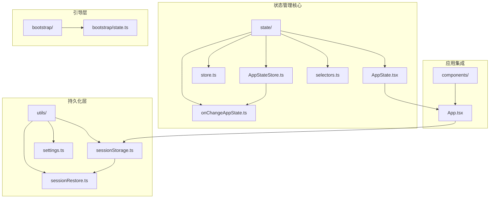
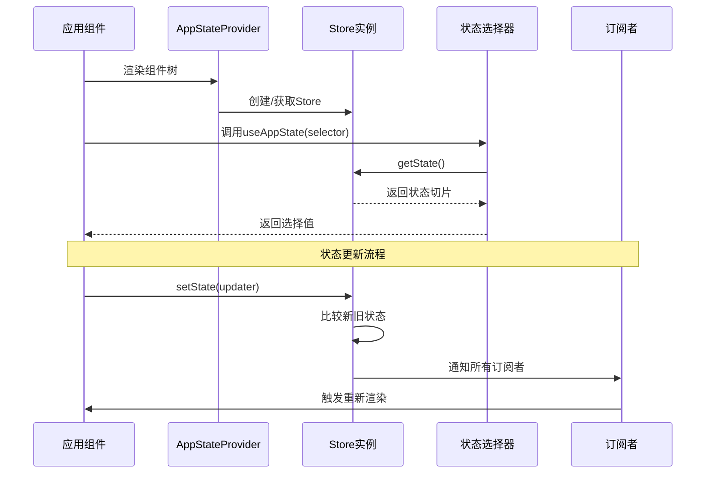
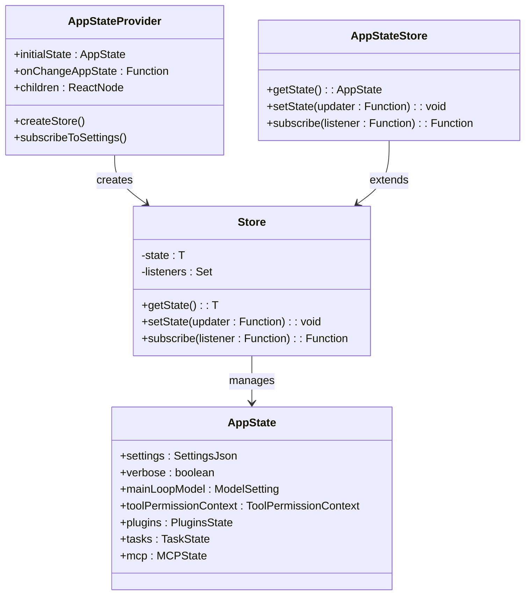

# 应用状态管理

<cite>
**本文档引用的文件**
- [AppState.tsx](file://state/AppState.tsx)
- [store.ts](file://state/store.ts)
- [AppStateStore.ts](file://state/AppStateStore.ts)
- [selectors.ts](file://state/selectors.ts)
- [onChangeAppState.ts](file://state/onChangeAppState.ts)
- [App.tsx](file://components/App.tsx)
- [sessionStorage.ts](file://utils/sessionStorage.ts)
- [sessionRestore.ts](file://utils/sessionRestore.ts)
- [settings.ts](file://utils/settings/settings.ts)
- [bootstrap/state.ts](file://bootstrap/state.ts)
</cite>

## 目录
1. [简介](#简介)
2. [项目结构](#项目结构)
3. [核心组件](#核心组件)
4. [架构概览](#架构概览)
5. [详细组件分析](#详细组件分析)
6. [依赖关系分析](#依赖关系分析)
7. [性能考虑](#性能考虑)
8. [故障排除指南](#故障排除指南)
9. [结论](#结论)

## 简介

Claude Code 的应用状态管理系统是一个基于 React 的现代状态管理解决方案，采用自定义 Store 模式和 React 的 useSyncExternalStore Hook 实现。该系统提供了完整的状态订阅机制、选择器优化、持久化支持和跨会话恢复能力。

系统的核心设计目标是：
- 提供高性能的状态订阅和更新机制
- 支持细粒度的状态选择器以优化渲染性能
- 实现状态持久化和跨会话恢复
- 维护类型安全和开发体验

## 项目结构

状态管理系统主要分布在以下目录中：

**图表来源**
- [AppState.tsx:1-200](file://state/AppState.tsx#L1-L200)
- [store.ts:1-35](file://state/store.ts#L1-L35)
- [AppStateStore.ts:1-570](file://state/AppStateStore.ts#L1-L570)

**章节来源**
- [AppState.tsx:1-200](file://state/AppState.tsx#L1-L200)
- [store.ts:1-35](file://state/store.ts#L1-L35)
- [AppStateStore.ts:1-570](file://state/AppStateStore.ts#L1-L570)

## 核心组件

### AppStateProvider - 状态提供者

AppStateProvider 是整个状态管理系统的核心组件，负责创建和管理应用状态 Store。

**关键特性：**
- 使用 React Context 提供状态访问
- 支持初始状态注入
- 实现 onChange 回调处理
- 防止嵌套使用

**状态存储机制：**
- 使用 createStore 函数创建稳定的 Store 实例
- 通过 useState 确保 Store 在组件生命周期内保持稳定
- 实现了对设置变化的监听和同步

**章节来源**
- [AppState.tsx:37-110](file://state/AppState.tsx#L37-L110)

### Store 模式 - 自定义状态容器

Store 模式实现了轻量级的状态管理核心：

**数据结构：**
- getState(): 获取当前状态
- setState(updater): 更新状态（基于 Object.is 比较）
- subscribe(listener): 订阅状态变化

**核心算法：**
- 使用 Set 存储订阅者
- 通过 Object.is 进行浅比较避免不必要的重渲染
- 支持批量状态更新通知

**章节来源**
- [store.ts:10-35](file://state/store.ts#L10-L35)

### AppStateStore - 完整状态模型

AppStateStore 定义了应用的完整状态结构，包含超过 450 行的状态字段定义。

**状态分类：**
- 基础配置：settings、verbose、mainLoopModel
- 视图状态：expandedView、footerSelection、viewSelectionMode
- 权限控制：toolPermissionContext、permissionMode
- 插件系统：plugins、mcp
- 任务管理：tasks、todos
- 会话状态：remoteConnectionStatus、replBridge*
- 用户界面：notifications、promptSuggestion

**章节来源**
- [AppStateStore.ts:89-452](file://state/AppStateStore.ts#L89-L452)

## 架构概览

**图表来源**
- [AppState.tsx:142-163](file://state/AppState.tsx#L142-L163)
- [store.ts:20-27](file://state/store.ts#L20-L27)

## 详细组件分析

### useAppState 钩子 - 状态订阅

useAppState 钩子实现了基于 React useSyncExternalStore 的状态订阅机制。

**实现原理：**
- 使用 useSyncExternalStore 进行外部状态订阅
- 通过 selector 函数提取状态切片
- 使用 Object.is 进行值比较确保精确更新
- 支持多个独立字段的多次调用

**性能优化：**
- 选择器返回现有对象引用而非新对象
- 避免不必要的渲染
- 使用记忆化缓存 selector 函数

**章节来源**
- [AppState.tsx:142-163](file://state/AppState.tsx#L142-L163)

### useSetAppState 钩子 - 状态更新

useSetAppState 钩子提供稳定的状态更新函数引用。

**特点：**
- 返回稳定的 setState 函数引用
- 不会触发组件重新渲染
- 适用于需要更新状态但不需要订阅的场景

**使用场景：**
- 处理用户交互事件
- 批量状态更新操作
- 异步状态更新

**章节来源**
- [AppState.tsx:170-172](file://state/AppState.tsx#L170-L172)

### 状态选择器 - 性能优化策略

状态选择器是实现细粒度更新的关键组件。

**设计原则：**
- 选择器必须返回现有对象引用
- 避免在选择器中创建新对象
- 支持复合选择器组合

**内置选择器示例：**
- getViewedTeammateTask: 获取当前查看的队友任务
- getActiveAgentForInput: 确定输入路由的目标代理

**章节来源**
- [selectors.ts:18-77](file://state/selectors.ts#L18-L77)

### 状态变更传播机制

onChangeAppState 函数处理状态变更的全局传播。

**主要功能：**
- 同步工具权限模式到外部系统
- 更新设置到持久化存储
- 管理扩展视图状态持久化
- 处理详细模式配置

**传播范围：**
- CCR/SDK 元数据同步
- 全局配置文件更新
- 环境变量重新应用
- 缓存清理和失效

**章节来源**
- [onChangeAppState.ts:43-172](file://state/onChangeAppState.ts#L43-L172)

## 依赖关系分析

**图表来源**
- [AppState.tsx:37-110](file://state/AppState.tsx#L37-L110)
- [store.ts:10-35](file://state/store.ts#L10-L35)
- [AppStateStore.ts:454-454](file://state/AppStateStore.ts#L454-L454)

**章节来源**
- [AppState.tsx:117-124](file://state/AppState.tsx#L117-L124)
- [store.ts:4-8](file://state/store.ts#L4-L8)

## 性能考虑

### 渲染优化策略

**选择器优化：**
- 避免在选择器中创建新对象
- 返回现有对象引用以利用 Object.is 比较
- 对于多个字段，分别调用 useAppState 多次

**订阅优化：**
- useSetAppState 提供稳定引用避免不必要渲染
- useAppStateStore 直接访问 Store 用于非 React 场景
- useAppStateMaybeOutsideOfProvider 提供安全的可选访问

**内存管理：**
- 订阅者自动清理机制
- 稳定的 Store 实例引用
- 避免闭包捕获导致的内存泄漏

### 状态持久化性能

**增量更新：**
- 仅在状态真正改变时触发更新
- 使用 Object.is 进行精确比较
- 批量状态更新减少通知次数

**缓存策略：**
- 设置系统缓存机制
- 项目路径缓存
- 类型转换结果缓存

## 故障排除指南

### 常见问题及解决方案

**问题1：嵌套 AppStateProvider 报错**
- 症状：抛出 "AppStateProvider can not be nested" 错误
- 解决方案：确保只存在一个 AppStateProvider 实例

**问题2：状态更新不触发重新渲染**
- 症状：调用 setState 后组件未更新
- 可能原因：使用了 useSetAppState 而不是 useAppState
- 解决方案：在需要订阅状态的组件中使用 useAppState

**问题3：选择器返回新对象导致频繁更新**
- 症状：组件频繁重新渲染
- 解决方案：修改选择器返回现有对象引用

**问题4：状态丢失或不一致**
- 症状：应用重启后状态异常
- 解决方案：检查 onChangeAppState 回调是否正确处理状态持久化

### 调试技巧

**启用详细日志：**
- 使用 verbose 模式查看更多调试信息
- 利用 logForDebugging 函数输出状态变化详情

**状态监控：**
- 监听 onChangeAppState 回调查看状态变更历史
- 使用开发者工具检查组件重新渲染频率

**章节来源**
- [AppState.tsx:44-47](file://state/AppState.tsx#L44-L47)
- [AppState.tsx:120-123](file://state/AppState.tsx#L120-L123)

## 结论

Claude Code 的应用状态管理系统展现了现代前端状态管理的最佳实践：

**核心优势：**
- 基于 React Hooks 的原生集成
- 高性能的选择器优化机制
- 完整的持久化和恢复支持
- 类型安全的完整状态模型

**技术特色：**
- 自定义 Store 模式替代复杂的状态库
- useSyncExternalStore 的精确订阅控制
- 细粒度的状态选择器实现
- 全面的跨会话状态管理

该系统为大型复杂应用提供了可靠、可维护且高性能的状态管理解决方案，同时保持了良好的开发体验和类型安全性。