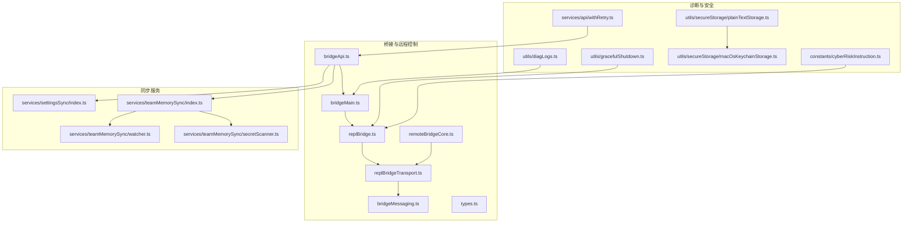
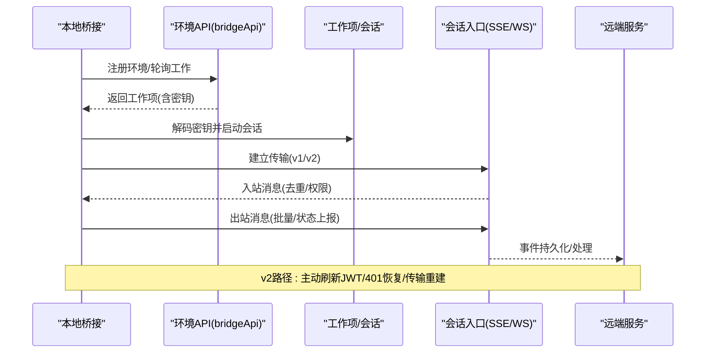
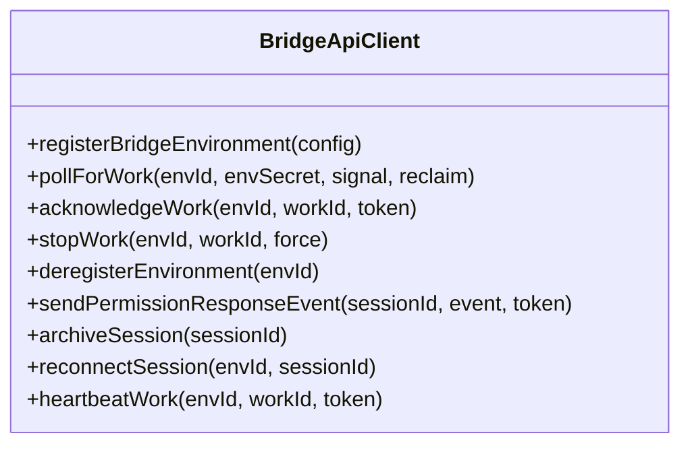
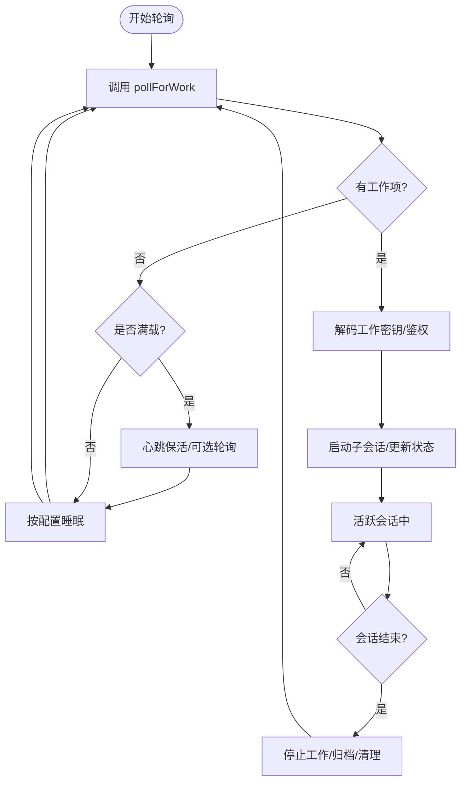
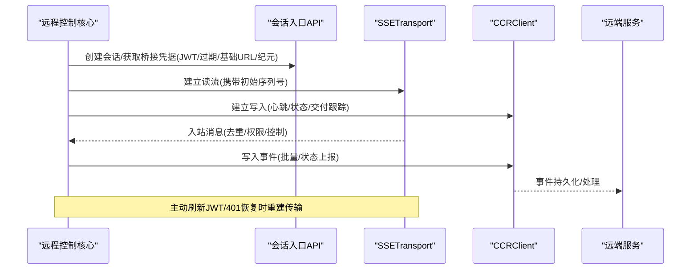
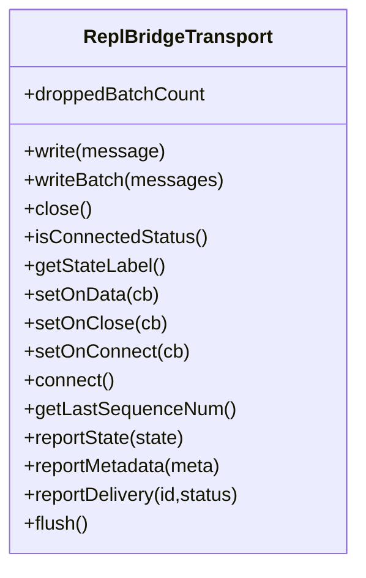
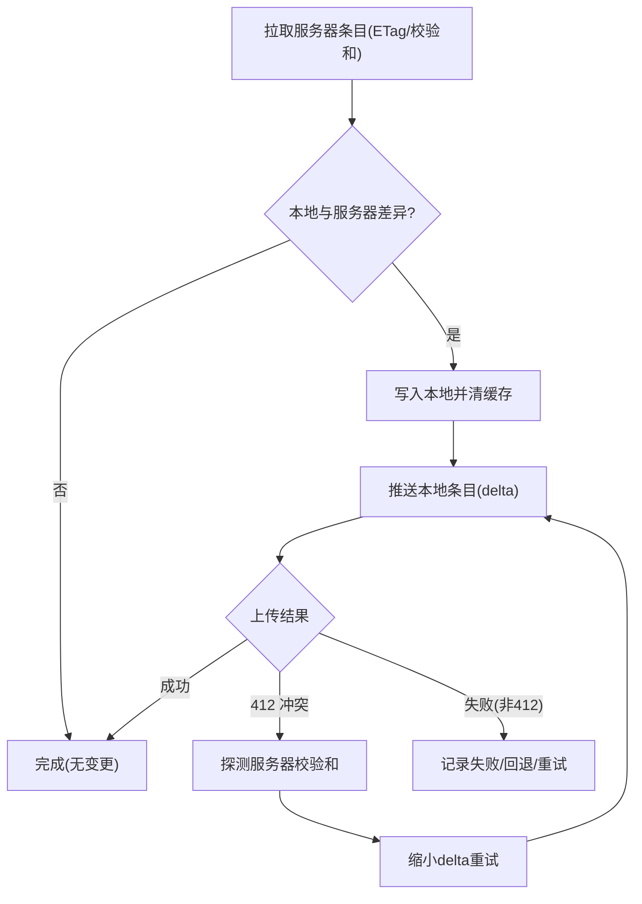
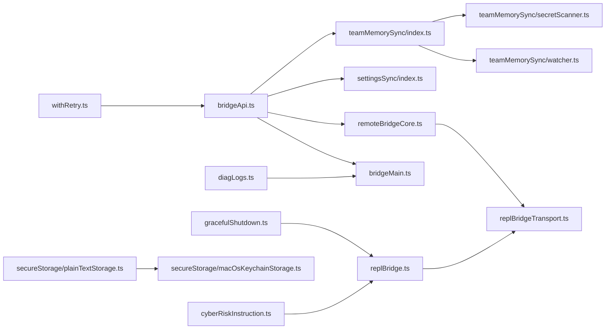

# 状态同步

<cite>
**本文引用的文件**
- [bridgeApi.ts](file://bridge/bridgeApi.ts)
- [bridgeMain.ts](file://bridge/bridgeMain.ts)
- [remoteBridgeCore.ts](file://bridge/remoteBridgeCore.ts)
- [replBridge.ts](file://bridge/replBridge.ts)
- [replBridgeTransport.ts](file://bridge/replBridgeTransport.ts)
- [bridgeMessaging.ts](file://bridge/bridgeMessaging.ts)
- [types.ts](file://bridge/types.ts)
- [index.ts](file://services/settingsSync/index.ts)
- [index.ts](file://services/teamMemorySync/index.ts)
- [watcher.ts](file://services/teamMemorySync/watcher.ts)
- [secretScanner.ts](file://services/teamMemorySync/secretScanner.ts)
- [diagLogs.ts](file://utils/diagLogs.ts)
- [withRetry.ts](file://services/api/withRetry.ts)
- [bridgeDebug.ts](file://bridge/bridgeDebug.ts)
- [gracefulShutdown.ts](file://utils/gracefulShutdown.ts)
- [plainTextStorage.ts](file://utils/secureStorage/plainTextStorage.ts)
- [macOsKeychainStorage.ts](file://utils/secureStorage/macOsKeychainStorage.ts)
- [cyberRiskInstruction.ts](file://constants/cyberRiskInstruction.ts)
</cite>

## 目录
1. [简介](#简介)
2. [项目结构](#项目结构)
3. [核心组件](#核心组件)
4. [架构总览](#架构总览)
5. [详细组件分析](#详细组件分析)
6. [依赖关系分析](#依赖关系分析)
7. [性能考量](#性能考量)
8. [故障排查指南](#故障排查指南)
9. [结论](#结论)
10. [附录](#附录)

## 简介
本文件面向 Claude Code 的状态同步系统，系统性阐述跨设备状态同步的实现原理、通信协议、冲突检测与解决机制、增量与全量同步策略、监控与诊断、网络异常容错、性能优化与带宽限制处理、安全与数据加密，以及同步历史与审计日志管理。内容基于仓库中的桥接层（bridge）、远程控制（remote）、REPL 桥接（replBridge）、设置与团队内存同步服务等模块进行深入分析，并通过图示展示关键流程。

## 项目结构
围绕状态同步的关键代码分布在以下模块：
- 桥接与远程控制：bridgeApi.ts、bridgeMain.ts、remoteBridgeCore.ts、replBridge.ts、replBridgeTransport.ts、bridgeMessaging.ts、types.ts
- 同步服务：services/settingsSync/index.ts（用户设置同步）、services/teamMemorySync/index.ts（团队内存同步）
- 诊断与可观测性：utils/diagLogs.ts、services/api/withRetry.ts、utils/gracefulShutdown.ts
- 安全与密钥存储：utils/secureStorage/*、constants/cyberRiskInstruction.ts
- 冲突与重试：services/teamMemorySync/watcher.ts、services/teamMemorySync/secretScanner.ts

**图表来源**
- [bridgeApi.ts:141-452](file://bridge/bridgeApi.ts#L141-L452)
- [bridgeMain.ts:141-800](file://bridge/bridgeMain.ts#L141-L800)
- [remoteBridgeCore.ts:140-761](file://bridge/remoteBridgeCore.ts#L140-L761)
- [replBridge.ts:70-200](file://bridge/replBridge.ts#L70-L200)
- [replBridgeTransport.ts:119-200](file://bridge/replBridgeTransport.ts#L119-L200)
- [bridgeMessaging.ts:124-148](file://bridge/bridgeMessaging.ts#L124-L148)
- [types.ts:133-176](file://bridge/types.ts#L133-L176)
- [index.ts:42-120](file://services/settingsSync/index.ts#L42-L120)
- [index.ts:800-1200](file://services/teamMemorySync/index.ts#L800-L1200)
- [watcher.ts:53-76](file://services/teamMemorySync/watcher.ts#L53-L76)
- [secretScanner.ts:177-227](file://services/teamMemorySync/secretScanner.ts#L177-L227)
- [diagLogs.ts:27-42](file://utils/diagLogs.ts#L27-L42)
- [withRetry.ts:212-514](file://services/api/withRetry.ts#L212-L514)
- [gracefulShutdown.ts:336-347](file://utils/gracefulShutdown.ts#L336-L347)
- [plainTextStorage.ts:57-84](file://utils/secureStorage/plainTextStorage.ts#L57-L84)
- [macOsKeychainStorage.ts:108-161](file://utils/secureStorage/macOsKeychainStorage.ts#L108-L161)
- [cyberRiskInstruction.ts:1-24](file://constants/cyberRiskInstruction.ts#L1-L24)

**章节来源**
- [bridgeApi.ts:141-452](file://bridge/bridgeApi.ts#L141-L452)
- [bridgeMain.ts:141-800](file://bridge/bridgeMain.ts#L141-L800)
- [remoteBridgeCore.ts:140-761](file://bridge/remoteBridgeCore.ts#L140-L761)
- [replBridge.ts:70-200](file://bridge/replBridge.ts#L70-L200)
- [replBridgeTransport.ts:119-200](file://bridge/replBridgeTransport.ts#L119-L200)
- [bridgeMessaging.ts:124-148](file://bridge/bridgeMessaging.ts#L124-L148)
- [types.ts:133-176](file://bridge/types.ts#L133-L176)
- [index.ts:42-120](file://services/settingsSync/index.ts#L42-L120)
- [index.ts:800-1200](file://services/teamMemorySync/index.ts#L800-L1200)
- [watcher.ts:53-76](file://services/teamMemorySync/watcher.ts#L53-L76)
- [secretScanner.ts:177-227](file://services/teamMemorySync/secretScanner.ts#L177-L227)
- [diagLogs.ts:27-42](file://utils/diagLogs.ts#L27-L42)
- [withRetry.ts:212-514](file://services/api/withRetry.ts#L212-L514)
- [gracefulShutdown.ts:336-347](file://utils/gracefulShutdown.ts#L336-L347)
- [plainTextStorage.ts:57-84](file://utils/secureStorage/plainTextStorage.ts#L57-L84)
- [macOsKeychainStorage.ts:108-161](file://utils/secureStorage/macOsKeychainStorage.ts#L108-L161)
- [cyberRiskInstruction.ts:1-24](file://constants/cyberRiskInstruction.ts#L1-L24)

## 核心组件
- 桥接客户端与环境 API：负责注册环境、轮询工作、心跳、停止工作、断开与重新连接、发送权限响应事件等。[bridgeApi.ts:141-452](file://bridge/bridgeApi.ts#L141-L452)
- 桥接主循环：在环境 API 基础上驱动会话生命周期、心跳保活、容量与退避策略、错误恢复与重连。[bridgeMain.ts:141-800](file://bridge/bridgeMain.ts#L141-L800)
- 远程控制无环境桥接核心：直接连接会话入口，使用 v2 协议（SSE + CCRClient），支持主动刷新 JWT、401 自动恢复、传输重建与历史回放保护。[remoteBridgeCore.ts:140-761](file://bridge/remoteBridgeCore.ts#L140-L761)
- REPL 桥接与传输抽象：统一 v1（HybridTransport）与 v2（SSETransport + CCRClient）写入路径，支持序列号续传、批量写入、状态上报与交付跟踪。[replBridge.ts:70-200](file://bridge/replBridge.ts#L70-L200)、[replBridgeTransport.ts:119-200](file://bridge/replBridgeTransport.ts#L119-L200)
- 消息路由与去重：对入站消息进行解析、去重（echo 与重播）、权限响应与控制请求分发。[bridgeMessaging.ts:124-148](file://bridge/bridgeMessaging.ts#L124-L148)
- 类型与协议：定义工作项、会话句柄、桥接客户端接口、权限响应事件等类型。[types.ts:133-176](file://bridge/types.ts#L133-L176)
- 设置同步：用户设置的增量上传与下载，带超时、重试与大小限制。[index.ts:42-120](file://services/settingsSync/index.ts#L42-L120)
- 团队内存同步：拉取（ETag/校验和）与推送（乐观锁 + 冲突探测），支持批量上传与失败回退。[index.ts:800-1200](file://services/teamMemorySync/index.ts#L800-L1200)
- 观测与诊断：诊断日志、重试策略、优雅退出、密钥存储与安全指令。[diagLogs.ts:27-42](file://utils/diagLogs.ts#L27-L42)、[withRetry.ts:212-514](file://services/api/withRetry.ts#L212-L514)、[gracefulShutdown.ts:336-347](file://utils/gracefulShutdown.ts#L336-L347)、[plainTextStorage.ts:57-84](file://utils/secureStorage/plainTextStorage.ts#L57-L84)、[macOsKeychainStorage.ts:108-161](file://utils/secureStorage/macOsKeychainStorage.ts#L108-L161)、[cyberRiskInstruction.ts:1-24](file://constants/cyberRiskInstruction.ts#L1-L24)

**章节来源**
- [bridgeApi.ts:141-452](file://bridge/bridgeApi.ts#L141-L452)
- [bridgeMain.ts:141-800](file://bridge/bridgeMain.ts#L141-L800)
- [remoteBridgeCore.ts:140-761](file://bridge/remoteBridgeCore.ts#L140-L761)
- [replBridge.ts:70-200](file://bridge/replBridge.ts#L70-L200)
- [replBridgeTransport.ts:119-200](file://bridge/replBridgeTransport.ts#L119-L200)
- [bridgeMessaging.ts:124-148](file://bridge/bridgeMessaging.ts#L124-L148)
- [types.ts:133-176](file://bridge/types.ts#L133-L176)
- [index.ts:42-120](file://services/settingsSync/index.ts#L42-L120)
- [index.ts:800-1200](file://services/teamMemorySync/index.ts#L800-L1200)
- [diagLogs.ts:27-42](file://utils/diagLogs.ts#L27-L42)
- [withRetry.ts:212-514](file://services/api/withRetry.ts#L212-L514)
- [gracefulShutdown.ts:336-347](file://utils/gracefulShutdown.ts#L336-L347)
- [plainTextStorage.ts:57-84](file://utils/secureStorage/plainTextStorage.ts#L57-L84)
- [macOsKeychainStorage.ts:108-161](file://utils/secureStorage/macOsKeychainStorage.ts#L108-L161)
- [cyberRiskInstruction.ts:1-24](file://constants/cyberRiskInstruction.ts#L1-L24)

## 架构总览
下图展示了从本地桥接到远程会话入口的整体状态同步链路，包括环境 API 轮询与 REPL v2 直连两种路径，以及消息去重、权限控制与传输重建等关键机制。

**图表来源**
- [bridgeApi.ts:141-452](file://bridge/bridgeApi.ts#L141-L452)
- [bridgeMain.ts:141-800](file://bridge/bridgeMain.ts#L141-L800)
- [remoteBridgeCore.ts:140-761](file://bridge/remoteBridgeCore.ts#L140-L761)
- [replBridgeTransport.ts:119-200](file://bridge/replBridgeTransport.ts#L119-L200)
- [bridgeMessaging.ts:124-148](file://bridge/bridgeMessaging.ts#L124-L148)

## 详细组件分析

### 组件A：桥接客户端与环境 API（bridgeApi）
- 职责：封装 OAuth 认证、重试与错误分类、环境注册、工作轮询、心跳、停止工作、断开与重新连接、权限事件上报等。
- 关键点：
  - OAuth 401 自动刷新与单次重试；401/403/404/410 等错误类型区分与致命错误标记。
  - 环境注册幂等、工作轮询空闲节流、心跳保活、停止工作带指数退避。
  - 权限响应事件通过会话事件 API 发送，供远端 UI/控制流使用。
- 适用场景：daemon/CLI 场景的环境式桥接，配合 bridgeMain 的主循环。

**图表来源**
- [bridgeApi.ts:133-176](file://bridge/bridgeApi.ts#L133-L176)

**章节来源**
- [bridgeApi.ts:141-452](file://bridge/bridgeApi.ts#L141-L452)

### 组件B：桥接主循环（bridgeMain）
- 职责：在环境 API 基础上管理会话生命周期、心跳保活、容量与退避、错误恢复与重连、状态显示与诊断。
- 关键点：
  - 心跳保活：对活跃工作项执行心跳，401/403 触发服务器端重新派发；404/410 视为致命错误。
  - 退避与睡眠检测：根据最大退避阈值检测系统休眠，避免误判。
  - 容量模式：满载时仅心跳不轮询，或按配置周期性轮询；容量释放后立即恢复轮询。
  - 会话完成：清理资源、归档会话、移除工作树、唤醒容量等待。
- 适用场景：多会话/持久化环境的守护进程式桥接。

**图表来源**
- [bridgeMain.ts:600-800](file://bridge/bridgeMain.ts#L600-L800)
- [bridgeApi.ts:199-247](file://bridge/bridgeApi.ts#L199-L247)

**章节来源**
- [bridgeMain.ts:141-800](file://bridge/bridgeMain.ts#L141-L800)
- [bridgeApi.ts:199-247](file://bridge/bridgeApi.ts#L199-L247)

### 组件C：远程控制无环境桥接核心（remoteBridgeCore）
- 职责：直接创建会话、获取桥接凭据（JWT/过期时间/基础URL/工作器纪元），建立 v2 传输（SSE + CCRClient），处理主动刷新与 401 恢复、传输重建与历史回放保护。
- 关键点：
  - 无环境层：直接调用会话入口，无需 Environments API 的注册/轮询/确认/停止/心跳/注销。
  - v2 协议：JWT 由 /bridge 获取，每次刷新都会提升工作器纪元，必须重建传输以保持序列号一致。
  - 去重与门控：入站/出站 UUID 去重集合、初始历史刷写门控（FlushGate），确保顺序与一致性。
  - 连接超时与状态变更：连接超时事件、状态变化回调（ready/connected/reconnecting/failed）。
- 适用场景：REPL/远程控制的轻量直连路径。

**图表来源**
- [remoteBridgeCore.ts:140-761](file://bridge/remoteBridgeCore.ts#L140-L761)
- [replBridgeTransport.ts:119-200](file://bridge/replBridgeTransport.ts#L119-L200)

**章节来源**
- [remoteBridgeCore.ts:140-761](file://bridge/remoteBridgeCore.ts#L140-L761)
- [replBridgeTransport.ts:119-200](file://bridge/replBridgeTransport.ts#L119-L200)

### 组件D：REPL 桥接与传输抽象（replBridge + replBridgeTransport）
- 职责：统一封装 v1（HybridTransport）与 v2（SSETransport + CCRClient）写入路径，支持序列号续传、批量写入、状态上报与交付跟踪。
- 关键点：
  - v1：HybridTransport 已具备完整表面，适配为统一接口。
  - v2：注册工作器（registerWorker 或 /bridge 获取 epoch），SSE 读流续传（序列号高水位），CCRClient 写入批处理与心跳。
  - 报告接口：reportState、reportMetadata、reportDelivery，用于 UI 与审计。
- 适用场景：REPL/远程控制的写入与状态反馈。

**图表来源**
- [replBridgeTransport.ts:23-70](file://bridge/replBridgeTransport.ts#L23-L70)

**章节来源**
- [replBridge.ts:70-200](file://bridge/replBridge.ts#L70-L200)
- [replBridgeTransport.ts:119-200](file://bridge/replBridgeTransport.ts#L119-L200)

### 组件E：消息路由与去重（bridgeMessaging）
- 职责：解析入站消息、识别控制响应、去重（echo 与重播）、分发到权限响应与控制请求处理器。
- 关键点：
  - 对入站消息进行键名规范化与类型校验，过滤重复 UUID。
  - 控制响应与权限请求分别处理，保证会话入口的交互闭环。
- 适用场景：所有桥接路径的消息一致性保障。

**章节来源**
- [bridgeMessaging.ts:124-148](file://bridge/bridgeMessaging.ts#L124-L148)

### 组件F：设置同步（settingsSync）
- 职责：用户设置的增量上传与下载，基于变更集与大小限制，带超时与重试。
- 关键点：
  - 上传：构建本地条目与远端条目差异，按大小限制过滤，上传成功后记录校验信息。
  - 下载：拉取远端设置，应用到本地文件，清缓存以使后续读取生效。
  - 错误分类：认证失败、超时、网络不可达等，带重试与事件记录。
- 适用场景：跨设备用户设置同步（如主题、快捷键、偏好）。

**章节来源**
- [index.ts:42-120](file://services/settingsSync/index.ts#L42-L120)
- [index.ts:157-392](file://services/settingsSync/index.ts#L157-L392)
- [index.ts:418-581](file://services/settingsSync/index.ts#L418-L581)

### 组件G：团队内存同步（teamMemorySync）
- 职责：双向同步（拉取→合并→推送），使用校验和与乐观锁处理并发冲突。
- 关键点：
  - 拉取：支持 ETag/校验和，返回未修改、空内容或条目集；更新服务器校验和映射。
  - 推送：仅上传与服务器不一致的条目（delta），遇到 412 冲突时探测服务器校验和并重试；支持批量上传与失败回退。
  - 观察者：判断永久失败（如无 OAuth/无仓库、4xx 非 409/429），触发重试策略。
  - 安全扫描：推送前扫描潜在敏感信息，排除后警告并记录事件。
- 适用场景：跨设备团队共享记忆文件（如提示词、配置片段）。

**图表来源**
- [index.ts:800-867](file://services/teamMemorySync/index.ts#L800-L867)
- [index.ts:889-1146](file://services/teamMemorySync/index.ts#L889-L1146)
- [watcher.ts:53-76](file://services/teamMemorySync/watcher.ts#L53-L76)
- [secretScanner.ts:177-227](file://services/teamMemorySync/secretScanner.ts#L177-L227)

**章节来源**
- [index.ts:800-867](file://services/teamMemorySync/index.ts#L800-L867)
- [index.ts:889-1146](file://services/teamMemorySync/index.ts#L889-L1146)
- [watcher.ts:53-76](file://services/teamMemorySync/watcher.ts#L53-L76)
- [secretScanner.ts:177-227](file://services/teamMemorySync/secretScanner.ts#L177-L227)

### 组件H：诊断与可观测性（diagLogs、withRetry、gracefulShutdown）
- 诊断日志：结构化记录事件，避免 PII 泄露，便于容器内监控与问题定位。
- 重试策略：针对瞬时错误（5xx、ECONNRESET/EPIPE 等）与容量压力进行指数退避与持久重试，支持进度输出与中断。
- 优雅退出：捕获未处理拒绝，记录诊断事件，设置退出码，清理资源。
- 适用场景：生产环境稳定性与可运维性保障。

**章节来源**
- [diagLogs.ts:27-42](file://utils/diagLogs.ts#L27-L42)
- [withRetry.ts:212-514](file://services/api/withRetry.ts#L212-L514)
- [gracefulShutdown.ts:336-347](file://utils/gracefulShutdown.ts#L336-L347)

### 组件I：安全与数据加密（secureStorage、cyberRiskInstruction）
- 密钥存储：macOS 使用钥匙串存储，其他平台降级为明文存储并设置严格权限；支持删除与缓存失效。
- 安全指令：明确防御性安全协助边界，拒绝破坏性技术与恶意用途。
- 适用场景：本地凭证与敏感数据的安全存储与行为约束。

**章节来源**
- [plainTextStorage.ts:57-84](file://utils/secureStorage/plainTextStorage.ts#L57-L84)
- [macOsKeychainStorage.ts:108-161](file://utils/secureStorage/macOsKeychainStorage.ts#L108-L161)
- [cyberRiskInstruction.ts:1-24](file://constants/cyberRiskInstruction.ts#L1-L24)

## 依赖关系分析
- 模块耦合：
  - bridgeApi.ts 为桥接与远程控制提供统一的环境 API 封装，bridgeMain.ts 依赖其心跳与工作项管理；remoteBridgeCore.ts 在 v2 路径中直接使用。
  - replBridge.ts 与 replBridgeTransport.ts 通过统一接口屏蔽 v1/v2 差异，便于在不同部署形态间切换。
  - teamMemorySync 与 settingsSync 依赖 OAuth 令牌与网络重试策略，同时受诊断日志与安全策略影响。
- 外部依赖：
  - Axios（HTTP）、SSETransport（事件流）、CCRClient（v2 写入）、Keychain（macOS 凭证）。
- 循环依赖风险：当前结构通过接口与抽象（BridgeApiClient、ReplBridgeTransport）降低耦合，未见明显循环。

**图表来源**
- [bridgeApi.ts:141-452](file://bridge/bridgeApi.ts#L141-L452)
- [bridgeMain.ts:141-800](file://bridge/bridgeMain.ts#L141-L800)
- [remoteBridgeCore.ts:140-761](file://bridge/remoteBridgeCore.ts#L140-L761)
- [replBridge.ts:70-200](file://bridge/replBridge.ts#L70-L200)
- [replBridgeTransport.ts:119-200](file://bridge/replBridgeTransport.ts#L119-L200)
- [index.ts:42-120](file://services/settingsSync/index.ts#L42-L120)
- [index.ts:800-1200](file://services/teamMemorySync/index.ts#L800-L1200)
- [watcher.ts:53-76](file://services/teamMemorySync/watcher.ts#L53-L76)
- [secretScanner.ts:177-227](file://services/teamMemorySync/secretScanner.ts#L177-L227)
- [diagLogs.ts:27-42](file://utils/diagLogs.ts#L27-L42)
- [withRetry.ts:212-514](file://services/api/withRetry.ts#L212-L514)
- [gracefulShutdown.ts:336-347](file://utils/gracefulShutdown.ts#L336-L347)
- [plainTextStorage.ts:57-84](file://utils/secureStorage/plainTextStorage.ts#L57-L84)
- [macOsKeychainStorage.ts:108-161](file://utils/secureStorage/macOsKeychainStorage.ts#L108-L161)
- [cyberRiskInstruction.ts:1-24](file://constants/cyberRiskInstruction.ts#L1-L24)

**章节来源**
- [bridgeApi.ts:141-452](file://bridge/bridgeApi.ts#L141-L452)
- [bridgeMain.ts:141-800](file://bridge/bridgeMain.ts#L141-L800)
- [remoteBridgeCore.ts:140-761](file://bridge/remoteBridgeCore.ts#L140-L761)
- [replBridge.ts:70-200](file://bridge/replBridge.ts#L70-L200)
- [replBridgeTransport.ts:119-200](file://bridge/replBridgeTransport.ts#L119-L200)
- [index.ts:42-120](file://services/settingsSync/index.ts#L42-L120)
- [index.ts:800-1200](file://services/teamMemorySync/index.ts#L800-L1200)
- [watcher.ts:53-76](file://services/teamMemorySync/watcher.ts#L53-L76)
- [secretScanner.ts:177-227](file://services/teamMemorySync/secretScanner.ts#L177-L227)
- [diagLogs.ts:27-42](file://utils/diagLogs.ts#L27-L42)
- [withRetry.ts:212-514](file://services/api/withRetry.ts#L212-L514)
- [gracefulShutdown.ts:336-347](file://utils/gracefulShutdown.ts#L336-L347)
- [plainTextStorage.ts:57-84](file://utils/secureStorage/plainTextStorage.ts#L57-L84)
- [macOsKeychainStorage.ts:108-161](file://utils/secureStorage/macOsKeychainStorage.ts#L108-L161)
- [cyberRiskInstruction.ts:1-24](file://constants/cyberRiskInstruction.ts#L1-L24)

## 性能考量
- 历史回放裁剪：REPL 初次连接时对历史消息进行上限裁剪，减少慢速持久化与 Firestore 压力。[replBridge.ts:1248-1299](file://bridge/replBridge.ts#L1248-L1299)
- 批量写入与去抖：v2 写入通过批处理与 FlushGate 控制写入节奏，避免高频小包与服务器重放。[remoteBridgeCore.ts:391-420](file://bridge/remoteBridgeCore.ts#L391-L420)
- 心跳与退避：满载时仅心跳或按配置轮询，避免轮询风暴；错误恢复采用指数退避与睡眠检测。[bridgeMain.ts:640-744](file://bridge/bridgeMain.ts#L640-L744)
- 带宽与大小限制：设置同步对单文件大小进行限制，团队内存推送按字节分批上传，避免网关限流。[index.ts:51-54](file://services/settingsSync/index.ts#L51-L54)、[index.ts:990-1000](file://services/teamMemorySync/index.ts#L990-L1000)
- 可观测性：重试策略输出系统消息，长睡眠分片避免被判定为空闲。[withRetry.ts:486-512](file://services/api/withRetry.ts#L486-L512)

**章节来源**
- [replBridge.ts:1248-1299](file://bridge/replBridge.ts#L1248-L1299)
- [remoteBridgeCore.ts:391-420](file://bridge/remoteBridgeCore.ts#L391-L420)
- [bridgeMain.ts:640-744](file://bridge/bridgeMain.ts#L640-L744)
- [index.ts:51-54](file://services/settingsSync/index.ts#L51-L54)
- [index.ts:990-1000](file://services/teamMemorySync/index.ts#L990-L1000)
- [withRetry.ts:486-512](file://services/api/withRetry.ts#L486-L512)

## 故障排查指南
- 网络异常与重试：
  - 瞬时错误（5xx、ECONNRESET/EPIPE）自动重试，持久重试模式下分段睡眠并输出进度。[withRetry.ts:212-514](file://services/api/withRetry.ts#L212-L514)
  - 环境 API 401/403/404/410 分类处理，401 支持 OAuth 刷新与单次重试；403 可抑制性错误不弹窗。[bridgeApi.ts:454-524](file://bridge/bridgeApi.ts#L454-L524)
- v2 传输故障：
  - 401 自动恢复：刷新 OAuth 并重建传输，携带最新 JWT/纪元，确保序列号续传。[remoteBridgeCore.ts:530-590](file://bridge/remoteBridgeCore.ts#L530-L590)
  - 传输重建：在重建期间开启写入门控，防止静默丢包；重建完成后排队写出。[remoteBridgeCore.ts:468-527](file://bridge/remoteBridgeCore.ts#L468-L527)
- 团队内存冲突：
  - 412 冲突：探测服务器校验和，缩小 delta 重试；超过最大重试次数则失败并记录。[index.ts:1086-1146](file://services/teamMemorySync/index.ts#L1086-L1146)
  - 永久失败判定：无 OAuth/无仓库、4xx 非 409/429 等视为永久失败。[watcher.ts:53-76](file://services/teamMemorySync/watcher.ts#L53-L76)
- 诊断与审计：
  - 诊断日志记录事件与数据，不含 PII；重试与连接超时事件用于定位问题。[diagLogs.ts:27-42](file://utils/diagLogs.ts#L27-L42)、[remoteBridgeCore.ts:301-309](file://bridge/remoteBridgeCore.ts#L301-L309)
  - 优雅退出捕获未处理拒绝，记录诊断事件并清理资源。[gracefulShutdown.ts:336-347](file://utils/gracefulShutdown.ts#L336-L347)
- 强制注入故障（仅内部测试）：
  - 可注入致命/瞬时故障，验证错误路径与恢复逻辑。[bridgeDebug.ts:84-110](file://bridge/bridgeDebug.ts#L84-L110)

**章节来源**
- [withRetry.ts:212-514](file://services/api/withRetry.ts#L212-L514)
- [bridgeApi.ts:454-524](file://bridge/bridgeApi.ts#L454-L524)
- [remoteBridgeCore.ts:530-590](file://bridge/remoteBridgeCore.ts#L530-L590)
- [remoteBridgeCore.ts:468-527](file://bridge/remoteBridgeCore.ts#L468-L527)
- [index.ts:1086-1146](file://services/teamMemorySync/index.ts#L1086-L1146)
- [watcher.ts:53-76](file://services/teamMemorySync/watcher.ts#L53-L76)
- [diagLogs.ts:27-42](file://utils/diagLogs.ts#L27-L42)
- [gracefulShutdown.ts:336-347](file://utils/gracefulShutdown.ts#L336-L347)
- [bridgeDebug.ts:84-110](file://bridge/bridgeDebug.ts#L84-L110)

## 结论
Claude Code 的状态同步体系通过“环境 API + 桥接主循环”与“远程控制无环境直连 + v2 协议”两条路径实现跨设备状态一致性。消息去重、传输重建、权限控制与乐观锁冲突解决共同保障了可靠性；增量同步与批量上传优化了性能与带宽；完善的诊断日志、重试与优雅退出提升了可观测性与稳定性；安全存储与安全指令为敏感数据与行为提供了边界约束。整体设计兼顾易用性与健壮性，适合在复杂网络环境下稳定运行。

## 附录
- 同步策略选择建议：
  - 增量优先：settingsSync 与 teamMemorySync 默认采用增量/差量策略，结合校验和与 ETag 提升效率。
  - 全量兜底：团队内存双向同步在首次或探测失败时进行全量拉取，随后回到增量推送。
- 监控与诊断清单：
  - 事件日志：使用诊断日志记录关键事件与参数，避免 PII。
  - 重试统计：关注重试次数、延迟分布与错误类型，识别网络波动与容量压力。
  - 传输健康：观察 v2 传输重建频率、序列号续传成功率与批量丢弃计数。
- 安全与合规：
  - 凭证存储：优先使用平台钥匙串，降级时设置严格文件权限。
  - 敏感扫描：推送前扫描潜在敏感信息，排除后记录并告警。
  - 行为约束：遵循安全指令，拒绝破坏性与恶意用途。