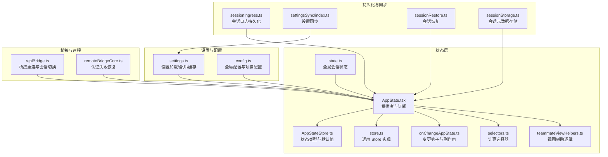
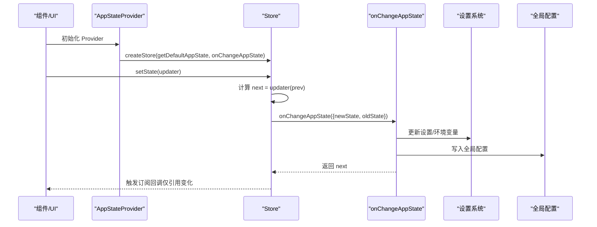
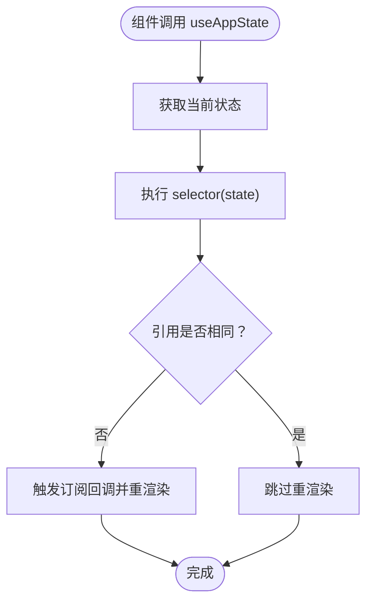
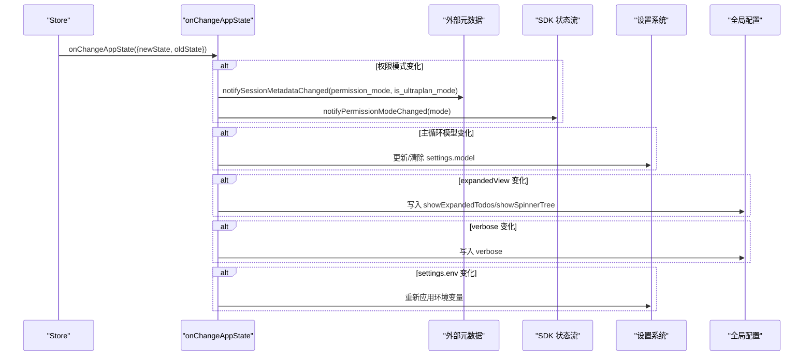
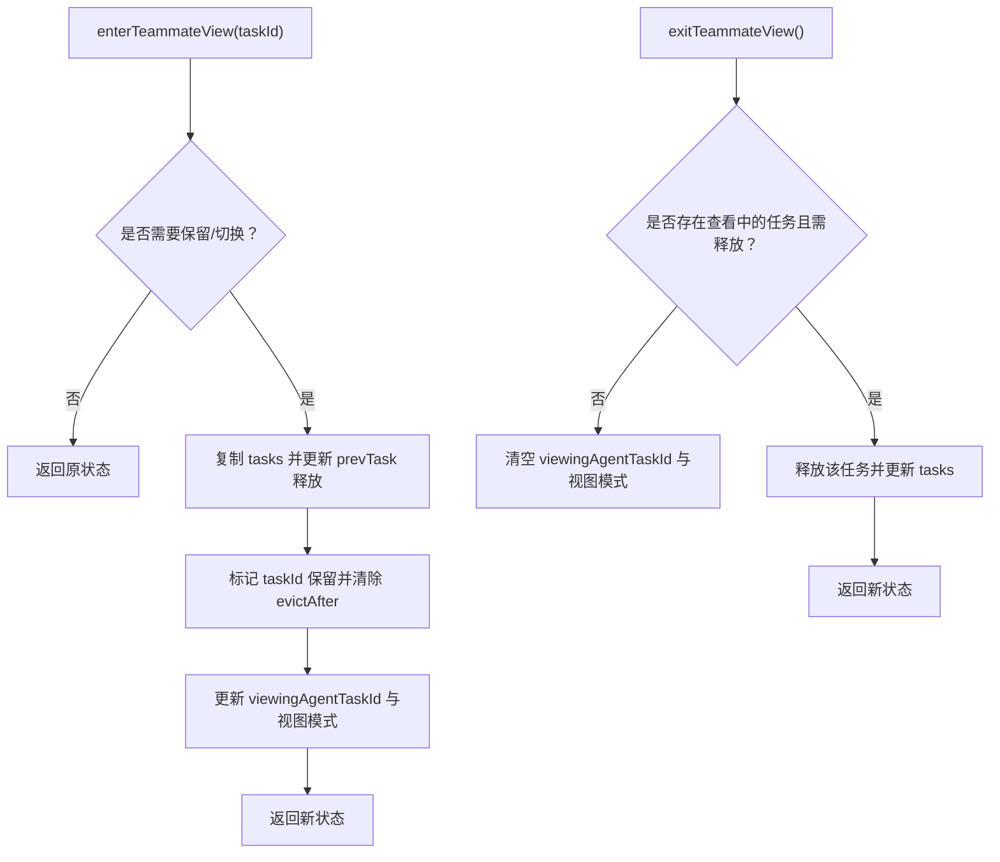
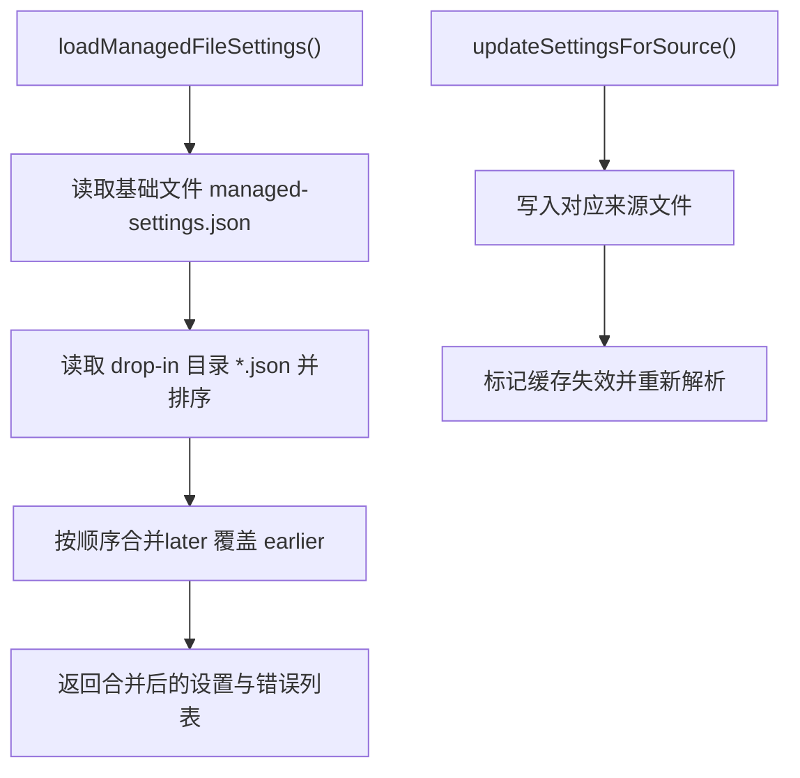
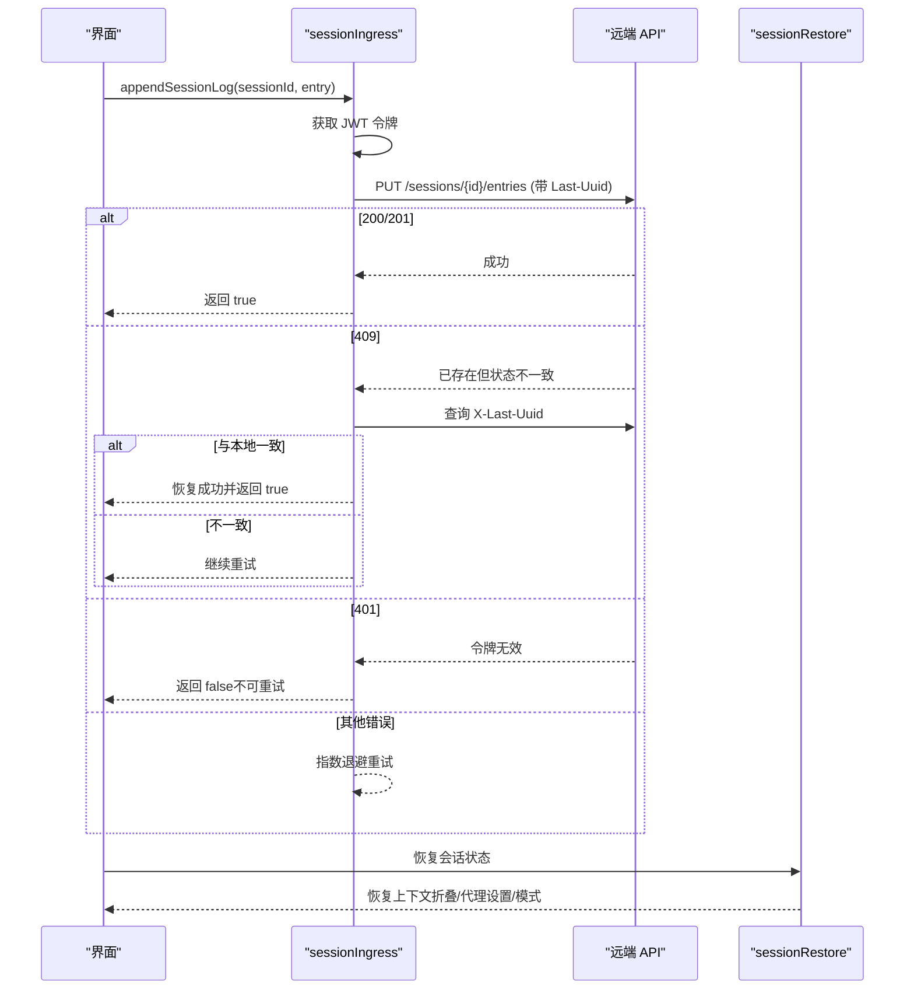
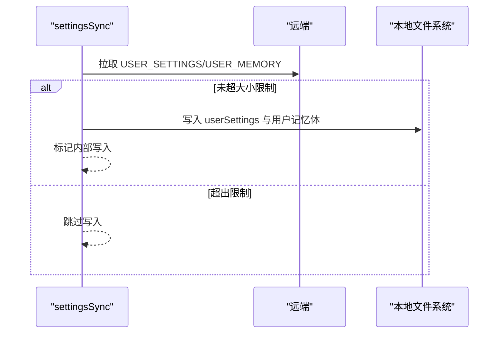
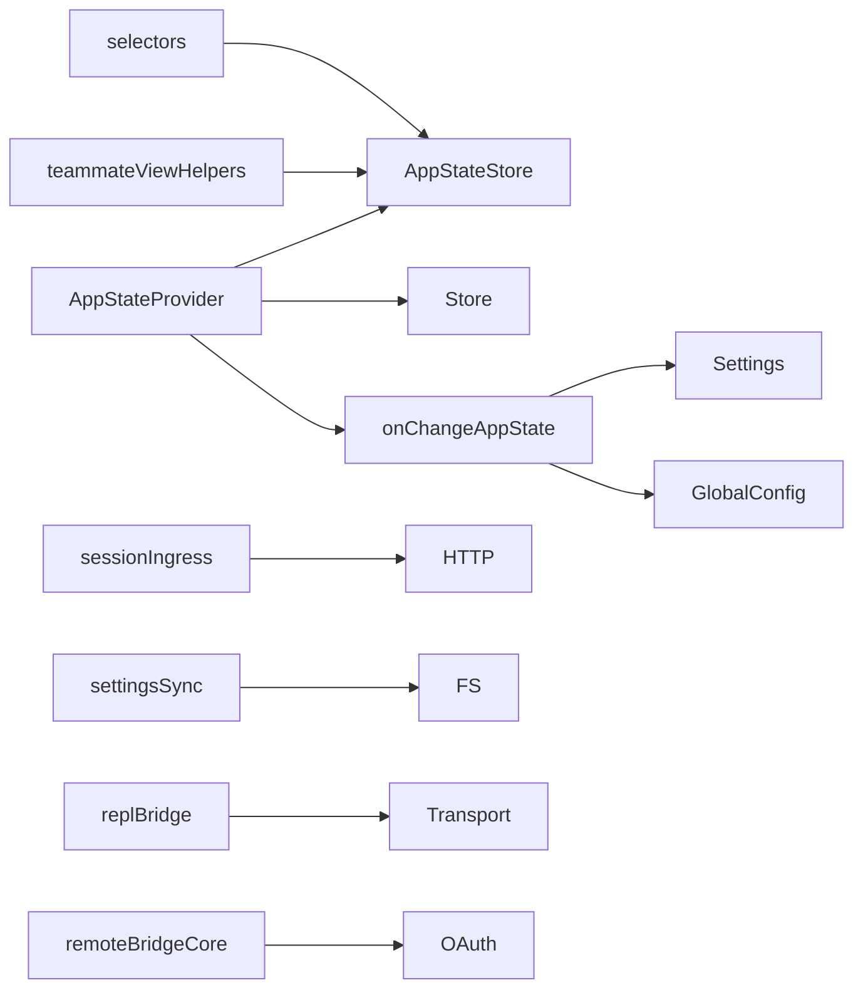

# 状态管理系统

<cite>
**本文档引用的文件**
- [AppState.tsx](file://state/AppState.tsx)
- [AppStateStore.ts](file://state/AppStateStore.ts)
- [store.ts](file://state/store.ts)
- [onChangeAppState.ts](file://state/onChangeAppState.ts)
- [selectors.ts](file://state/selectors.ts)
- [teammateViewHelpers.ts](file://state/teammateViewHelpers.ts)
- [state.ts](file://bootstrap/state.ts)
- [settings.ts](file://utils/settings/settings.ts)
- [config.ts](file://utils/config.ts)
- [sessionIngress.ts](file://services/api/sessionIngress.ts)
- [settingsSync/index.ts](file://services/settingsSync/index.ts)
- [sessionRestore.ts](file://utils/sessionRestore.ts)
- [replBridge.ts](file://bridge/replBridge.ts)
- [remoteBridgeCore.ts](file://bridge/remoteBridgeCore.ts)
- [path.ts](file://utils/path.ts)
- [sessionStorage.ts](file://utils/sessionStorage.ts)
</cite>

## 目录
1. [简介](#简介)
2. [项目结构](#项目结构)
3. [核心组件](#核心组件)
4. [架构总览](#架构总览)
5. [详细组件分析](#详细组件分析)
6. [依赖分析](#依赖分析)
7. [性能考虑](#性能考虑)
8. [故障排除指南](#故障排除指南)
9. [结论](#结论)
10. [附录](#附录)

## 简介
本文件系统性梳理 Claude Code 的状态管理系统，覆盖应用状态的组织结构、状态更新机制、持久化策略、用户设置管理、会话状态的保存与恢复、状态同步与跨设备一致性、调试工具与故障排除、以及最佳实践与性能优化建议。目标是帮助开发者在不深入源码的前提下，理解状态体系的设计思想与使用方式，并能高效定位问题与进行扩展。

## 项目结构
状态管理相关代码主要分布在以下模块：
- 状态容器与提供者：state/AppState.tsx、state/AppStateStore.ts、state/store.ts
- 状态变更钩子与副作用：state/onChangeAppState.ts
- 计算型选择器：state/selectors.ts、state/teammateViewHelpers.ts
- 全局会话状态（非 React）：bootstrap/state.ts
- 设置与配置：utils/settings/settings.ts、utils/config.ts
- 会话持久化与恢复：services/api/sessionIngress.ts、utils/sessionRestore.ts、utils/sessionStorage.ts
- 跨设备同步：services/settingsSync/index.ts
- 桥接与远程会话：bridge/replBridge.ts、bridge/remoteBridgeCore.ts
- 路径与键规范化：utils/path.ts

**图表来源**
- [AppState.tsx:1-200](file://state/AppState.tsx#L1-L200)
- [AppStateStore.ts:1-570](file://state/AppStateStore.ts#L1-L570)
- [store.ts:1-35](file://state/store.ts#L1-L35)
- [onChangeAppState.ts:1-172](file://state/onChangeAppState.ts#L1-L172)
- [selectors.ts:1-77](file://state/selectors.ts#L1-L77)
- [teammateViewHelpers.ts:1-142](file://state/teammateViewHelpers.ts#L1-L142)
- [state.ts:1-800](file://bootstrap/state.ts#L1-L800)
- [settings.ts:1-200](file://utils/settings/settings.ts#L1-L200)
- [config.ts:1-200](file://utils/config.ts#L1-L200)
- [sessionIngress.ts:77-229](file://services/api/sessionIngress.ts#L77-L229)
- [settingsSync/index.ts:509-536](file://services/settingsSync/index.ts#L509-L536)
- [sessionRestore.ts:490-516](file://utils/sessionRestore.ts#L490-L516)
- [sessionStorage.ts:2753-2785](file://utils/sessionStorage.ts#L2753-L2785)
- [replBridge.ts:576-615](file://bridge/replBridge.ts#L576-L615)
- [remoteBridgeCore.ts:529-551](file://bridge/remoteBridgeCore.ts#L529-L551)

**章节来源**
- [AppState.tsx:1-200](file://state/AppState.tsx#L1-L200)
- [AppStateStore.ts:1-570](file://state/AppStateStore.ts#L1-L570)
- [store.ts:1-35](file://state/store.ts#L1-L35)

## 核心组件
- 应用状态容器与提供者
  - AppStateProvider：创建并注入应用状态 Store，负责监听外部设置变化、应用设置变更、挂载语音与邮箱上下文等。
  - useAppState/useSetAppState/useAppStateStore：基于 useSyncExternalStore 的订阅与更新接口，支持安全的跨组件状态访问。
- 状态 Store
  - Store 接口与 createStore：提供 getState、setState、subscribe 的最小实现，确保对象引用稳定时避免渲染。
- 应用状态模型
  - AppState：包含设置、权限模式、桥接状态、插件与 MCP 状态、通知、提示词建议、推测状态、任务与团队上下文等。
  - 默认状态 getDefaultAppState：按启动条件初始化权限模式、文件历史、通知队列、提示词建议等。
- 变更钩子与副作用
  - onChangeAppState：集中处理权限模式同步到外部元数据、主循环模型写入设置、全局配置持久化、认证缓存清理等。
- 计算型选择器
  - selectors.ts：从 AppState 中派生视图所需的状态（如当前被查看的队友任务、输入路由目标）。
  - teammateViewHelpers.ts：处理队友视图进入/退出、任务保留与回收、中止或移除等 UI 行为。
- 全局会话状态
  - bootstrap/state.ts：记录会话标识、工作目录、统计指标、遥测、计划/自动模式开关、慢操作追踪等，用于非 React 场景与会话生命周期管理。

**章节来源**
- [AppState.tsx:27-124](file://state/AppState.tsx#L27-L124)
- [AppState.tsx:142-179](file://state/AppState.tsx#L142-L179)
- [store.ts:4-34](file://state/store.ts#L4-L34)
- [AppStateStore.ts:89-452](file://state/AppStateStore.ts#L89-L452)
- [AppStateStore.ts:456-570](file://state/AppStateStore.ts#L456-L570)
- [onChangeAppState.ts:43-171](file://state/onChangeAppState.ts#L43-L171)
- [selectors.ts:11-77](file://state/selectors.ts#L11-L77)
- [teammateViewHelpers.ts:46-141](file://state/teammateViewHelpers.ts#L46-L141)
- [state.ts:45-257](file://bootstrap/state.ts#L45-L257)

## 架构总览
状态系统采用“React Provider + 自定义 Store”的组合：
- React 层通过 AppStateProvider 注入 Store，组件使用 useAppState 订阅切片，useSetAppState 获取更新器。
- Store 内部以不可变更新为核心，仅在对象引用变化时触发订阅回调，避免不必要的渲染。
- onChangeAppState 作为全局变更钩子，统一处理外部元数据同步、设置持久化、全局配置写盘、缓存清理等副作用。
- 全局会话状态（bootstrap/state.ts）独立于 React，用于会话级指标、遥测、计划/自动模式等，避免循环依赖。

**图表来源**
- [AppState.tsx:37-110](file://state/AppState.tsx#L37-L110)
- [store.ts:20-27](file://state/store.ts#L20-L27)
- [onChangeAppState.ts:43-171](file://state/onChangeAppState.ts#L43-L171)

## 详细组件分析

### 组件 A：应用状态提供者与订阅
- 设计要点
  - 防重复嵌套：检测已存在上下文时抛错，避免重复 Provider。
  - 外部设置同步：通过 useSettingsChange 将外部设置变更应用到 AppState。
  - 权限模式校正：在组件挂载后检查远程设置，必要时禁用“绕过权限”模式。
  - 语音与邮箱上下文：根据特性动态注入。
- 订阅机制
  - useAppState 基于 useSyncExternalStore，仅在选择器返回的对象引用变化时重渲染。
  - 提供 useSetAppState 与 useAppStateStore，便于无订阅更新或传递给非 React 代码。

**图表来源**
- [AppState.tsx:142-163](file://state/AppState.tsx#L142-L163)

**章节来源**
- [AppState.tsx:37-110](file://state/AppState.tsx#L37-L110)
- [AppState.tsx:142-179](file://state/AppState.tsx#L142-L179)

### 组件 B：状态 Store 与变更钩子
- Store 实现
  - getState：返回当前快照。
  - setState：若新旧引用相同则短路；否则更新状态并依次调用 onChange 与所有订阅者。
  - subscribe：注册/注销监听器。
- onChangeAppState 副作用
  - 权限模式同步：将内部模式转换为对外模式，通知外部元数据与 SDK 状态流。
  - 主循环模型：当模型从 null 变为非空时写入设置并覆盖主循环模型；反之则清除设置项。
  - 全局配置持久化：如 expandedView 变化映射为 showExpandedTodos/showSpinnerTree；verbose 写入全局配置；ant 专属面板可见性写回。
  - 设置变更副作用：清理 API Key、AWS/GCP 凭据缓存；当 settings.env 变化时重新应用环境变量。

**图表来源**
- [onChangeAppState.ts:43-171](file://state/onChangeAppState.ts#L43-L171)

**章节来源**
- [store.ts:4-34](file://state/store.ts#L4-L34)
- [onChangeAppState.ts:43-171](file://state/onChangeAppState.ts#L43-L171)

### 组件 C：计算型选择器与视图辅助
- 选择器
  - getViewedTeammateTask：从 viewingAgentTaskId 与 tasks 中提取当前查看的队友任务，确保类型正确。
  - getActiveAgentForInput：根据是否查看队友、查看的是本地代理还是普通任务，决定输入应路由的目标。
- 视图辅助
  - enterTeammateView/exitTeammateView/stopOrDismissAgent：管理队友视图切换、任务保留与回收、终止或立即移除任务，配合 evictAfter 控制 UI 生命周期。

**图表来源**
- [teammateViewHelpers.ts:46-109](file://state/teammateViewHelpers.ts#L46-L109)

**章节来源**
- [selectors.ts:11-77](file://state/selectors.ts#L11-L77)
- [teammateViewHelpers.ts:46-141](file://state/teammateViewHelpers.ts#L46-L141)

### 组件 D：用户设置与配置管理
- 设置加载与合并
  - 支持多来源合并：用户设置、项目设置、本地设置、标志设置、策略设置。
  - 文件型托管设置：managed-settings.json 与 drop-in 目录按字母序合并，后者优先。
  - 缓存：解析结果与各来源设置均缓存，避免重复 IO。
- 全局配置
  - 包含主题、自动更新、安装方式、医生显示次数、项目配置（工具允许列表、MCP 服务器、信任对话、工作树会话等）。
  - 提供读写接口，支持序列化与反序列化。

**图表来源**
- [settings.ts:74-121](file://utils/settings/settings.ts#L74-L121)
- [settings.ts:178-199](file://utils/settings/settings.ts#L178-L199)

**章节来源**
- [settings.ts:1-200](file://utils/settings/settings.ts#L1-L200)
- [config.ts:183-200](file://utils/config.ts#L183-L200)

### 组件 E：会话状态的保存与恢复
- 远程持久化
  - sessionIngress.appendSessionLog：使用 JWT 令牌与乐观并发控制（Last-Uuid）追加会话日志，指数退避重试。
  - 失败处理：401 直接失败；409 检查服务端是否已存在条目并恢复状态；其他 4xx/5xx 可重试。
- 会话恢复
  - sessionRestore：在 CLI 或交互式路径中恢复会话状态，包括上下文折叠、代理设置、模式标记等。
  - REPL.tsx：在会话结束时保存模式信息，以便后续恢复。
- 元数据存储
  - sessionStorage.restoreSessionMetadata：恢复标题、标签、代理名称/颜色、模式、PR 信息等。

**图表来源**
- [sessionIngress.ts:77-229](file://services/api/sessionIngress.ts#L77-L229)
- [sessionRestore.ts:490-516](file://utils/sessionRestore.ts#L490-L516)
- [sessionStorage.ts:2753-2785](file://utils/sessionStorage.ts#L2753-L2785)

**章节来源**
- [sessionIngress.ts:77-229](file://services/api/sessionIngress.ts#L77-L229)
- [sessionRestore.ts:490-516](file://utils/sessionRestore.ts#L490-L516)
- [sessionStorage.ts:2753-2785](file://utils/sessionStorage.ts#L2753-L2785)

### 组件 F：跨设备同步与桥接
- 设置同步
  - settingsSync：从远端拉取用户设置与记忆体内容，写入本地并标记内部写入以避免误触发变更监听。
- 桥接与远程会话
  - replBridge：处理环境丢失与会话重连，支持“就地重连”与“全新会话”两种策略，使用 Promise 重入保护。
  - remoteBridgeCore：401 认证失败时尝试刷新 OAuth 令牌并重建连接，避免并发冲突。

**图表来源**
- [settingsSync/index.ts:509-536](file://services/settingsSync/index.ts#L509-L536)

**章节来源**
- [settingsSync/index.ts:509-536](file://services/settingsSync/index.ts#L509-L536)
- [replBridge.ts:576-615](file://bridge/replBridge.ts#L576-L615)
- [replBridge.ts:788-809](file://bridge/replBridge.ts#L788-L809)
- [remoteBridgeCore.ts:529-551](file://bridge/remoteBridgeCore.ts#L529-L551)

## 依赖分析
- 组件耦合
  - AppStateProvider 依赖：AppStateStore 类型、store 创建函数、设置变更钩子、上下文提供者。
  - onChangeAppState 依赖：设置系统、全局配置、权限模式转换、会话元数据通知。
  - 选择器与视图辅助依赖：AppState 类型与任务类型定义。
  - 全局会话状态与 React 状态解耦，避免循环依赖。
- 外部依赖
  - 设置系统：文件读写、JSON 解析、缓存、合并策略。
  - 会话持久化：HTTP 客户端、JWT 令牌、并发控制头。
  - 桥接：WebSocket/SSE、重连策略、认证刷新。

**图表来源**
- [AppState.tsx:1-200](file://state/AppState.tsx#L1-L200)
- [onChangeAppState.ts:1-21](file://state/onChangeAppState.ts#L1-L21)
- [settings.ts:1-200](file://utils/settings/settings.ts#L1-L200)
- [sessionIngress.ts:77-229](file://services/api/sessionIngress.ts#L77-L229)
- [settingsSync/index.ts:509-536](file://services/settingsSync/index.ts#L509-L536)
- [replBridge.ts:576-615](file://bridge/replBridge.ts#L576-L615)
- [remoteBridgeCore.ts:529-551](file://bridge/remoteBridgeCore.ts#L529-L551)

**章节来源**
- [AppState.tsx:1-200](file://state/AppState.tsx#L1-L200)
- [onChangeAppState.ts:1-21](file://state/onChangeAppState.ts#L1-L21)
- [settings.ts:1-200](file://utils/settings/settings.ts#L1-L200)

## 性能考虑
- 渲染优化
  - 使用 useSyncExternalStore 与 Object.is 引用比较，仅在选择器返回对象引用变化时重渲染。
  - 避免在 selector 中返回新对象，推荐返回现有子对象引用。
- 状态更新
  - Store 在 setState 前先计算 next，若与 prev 引用相同则直接短路，减少订阅回调触发。
- 缓存与 IO
  - 设置解析与来源设置均缓存，降低重复 IO。
  - 路径键规范化（normalizePathForConfigKey）确保 JSON 键稳定，避免因路径分隔符差异导致的缓存失效。
- 并发与重试
  - 会话日志追加使用指数退避与最大重试次数，防止网络抖动影响体验。
  - 桥接重连使用 Promise 重入保护，避免并发重建造成状态不一致。

[本节为通用指导，无需特定文件来源]

## 故障排除指南
- 权限模式不同步
  - 现象：CLI 切换权限模式后，外部 UI 或 SDK 状态未更新。
  - 排查：确认 onChangeAppState 是否被调用；检查 toExternalPermissionMode 转换是否产生外部模式变化。
  - 参考：[onChangeAppState.ts:67-92](file://state/onChangeAppState.ts#L67-L92)
- 设置未生效
  - 现象：修改 settings.env 后凭据未刷新。
  - 排查：确认 onChangeAppState 是否清理了相关缓存并重新应用环境变量。
  - 参考：[onChangeAppState.ts:154-170](file://state/onChangeAppState.ts#L154-L170)
- 会话持久化失败
  - 现象：远端返回 409 或网络异常。
  - 排查：检查 Last-Uuid 是否与服务端一致；确认 JWT 令牌有效性；观察指数退避重试日志。
  - 参考：[sessionIngress.ts:77-186](file://services/api/sessionIngress.ts#L77-L186)
- 桥接重连异常
  - 现象：环境丢失或 401 导致断开。
  - 排查：确认重连策略（就地重连/全新会话）与 Promise 重入保护；检查 OAuth 刷新流程。
  - 参考：[replBridge.ts:576-615](file://bridge/replBridge.ts#L576-L615), [remoteBridgeCore.ts:529-551](file://bridge/remoteBridgeCore.ts#L529-L551)
- 路径键不稳定导致配置异常
  - 现象：Windows 路径分隔符不一致引发键冲突。
  - 排查：使用 normalizePathForConfigKey 规范化路径键。
  - 参考：[path.ts:149-155](file://utils/path.ts#L149-L155)

**章节来源**
- [onChangeAppState.ts:67-92](file://state/onChangeAppState.ts#L67-L92)
- [onChangeAppState.ts:154-170](file://state/onChangeAppState.ts#L154-L170)
- [sessionIngress.ts:77-186](file://services/api/sessionIngress.ts#L77-L186)
- [replBridge.ts:576-615](file://bridge/replBridge.ts#L576-L615)
- [remoteBridgeCore.ts:529-551](file://bridge/remoteBridgeCore.ts#L529-L551)
- [path.ts:149-155](file://utils/path.ts#L149-L155)

## 结论
该状态管理系统以 React Provider + 自定义 Store 为核心，结合集中式变更钩子与计算型选择器，实现了高内聚、低耦合的状态管理。通过严格的引用比较与缓存策略，有效降低了渲染成本；通过 onChangeAppState 统一处理外部同步与持久化，保证了跨设备与跨组件的一致性。配合完善的会话持久化与桥接重连机制，系统在复杂场景下仍能保持稳定性与可维护性。

[本节为总结，无需特定文件来源]

## 附录
- 最佳实践
  - 在 selector 中返回现有对象引用而非新建对象，避免不必要的重渲染。
  - 使用 useSetAppState 获取更新器时，尽量在单次事务中批量更新，减少多次订阅回调。
  - 对外暴露的元数据变更通过 onChangeAppState 统一处理，避免分散更新导致的不一致。
- 版本兼容与迁移
  - 设置系统支持多来源合并与 drop-in 策略，便于渐进式迁移与策略叠加。
  - 路径键规范化与 JSON 缓存策略有助于避免版本升级带来的键冲突问题。
- 调试工具
  - 使用 logForDebugging/logForDiagnosticsNoPII 输出调试与诊断日志。
  - 在 onChangeAppState 中添加细粒度日志，跟踪权限模式、设置与配置变更路径。

[本节为通用指导，无需特定文件来源]