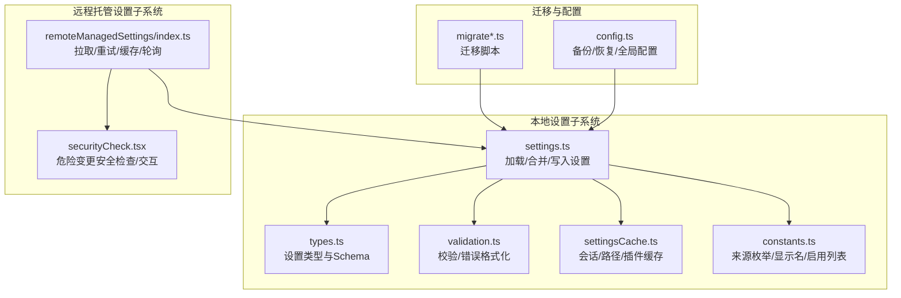
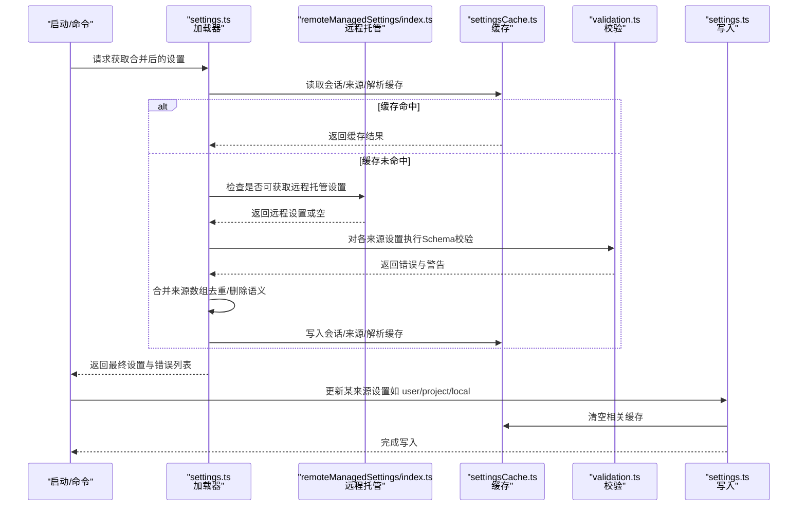
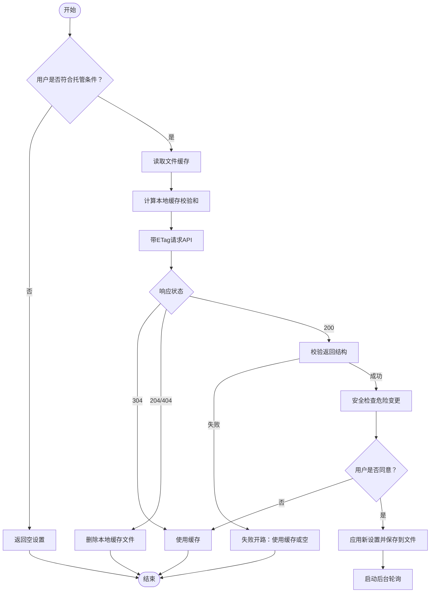
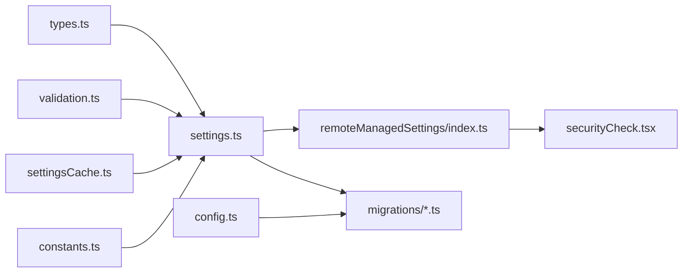

# 用户设置管理

<cite>
**本文引用的文件**
- [services/remoteManagedSettings/index.ts](file://services/remoteManagedSettings/index.ts)
- [services/remoteManagedSettings/securityCheck.tsx](file://services/remoteManagedSettings/securityCheck.tsx)
- [utils/settings/settings.ts](file://utils/settings/settings.ts)
- [utils/settings/types.ts](file://utils/settings/types.ts)
- [utils/settings/constants.ts](file://utils/settings/constants.ts)
- [utils/settings/settingsCache.ts](file://utils/settings/settingsCache.ts)
- [utils/settings/validation.ts](file://utils/settings/validation.ts)
- [utils/settings/schemaOutput.ts](file://utils/settings/schemaOutput.ts)
- [migrations/migrateAutoUpdatesToSettings.ts](file://migrations/migrateAutoUpdatesToSettings.ts)
- [migrations/migrateBypassPermissionsAcceptedToSettings.ts](file://migrations/migrateBypassPermissionsAcceptedToSettings.ts)
- [migrations/migrateEnableAllProjectMcpServersToSettings.ts](file://migrations/migrateEnableAllProjectMcpServersToSettings.ts)
- [utils/config.ts](file://utils/config.ts)
</cite>

## 目录
1. [简介](#简介)
2. [项目结构](#项目结构)
3. [核心组件](#核心组件)
4. [架构总览](#架构总览)
5. [详细组件分析](#详细组件分析)
6. [依赖关系分析](#依赖关系分析)
7. [性能考量](#性能考量)
8. [故障排除指南](#故障排除指南)
9. [结论](#结论)
10. [附录](#附录)

## 简介
本文件系统化梳理 Claude Code 的用户设置管理系统，覆盖设置的存储结构、验证机制、同步策略、变更应用与回滚、分类管理与优先级、导入导出、迁移与版本兼容、缓存与性能优化，以及故障排除与调试方法。目标是帮助开发者与运维人员在不深入源码的前提下，理解并高效使用该系统。

## 项目结构
设置系统由“本地设置解析与合并”和“远程托管设置拉取与安全校验”两大子系统构成，并辅以统一的类型定义、校验工具、缓存层与迁移机制。

图表来源
- [utils/settings/settings.ts:1-120](file://utils/settings/settings.ts#L1-L120)
- [utils/settings/types.ts:255-800](file://utils/settings/types.ts#L255-L800)
- [utils/settings/validation.ts:1-120](file://utils/settings/validation.ts#L1-L120)
- [utils/settings/settingsCache.ts:1-81](file://utils/settings/settingsCache.ts#L1-L81)
- [utils/settings/constants.ts:1-203](file://utils/settings/constants.ts#L1-L203)
- [services/remoteManagedSettings/index.ts:1-120](file://services/remoteManagedSettings/index.ts#L1-L120)
- [services/remoteManagedSettings/securityCheck.tsx:1-74](file://services/remoteManagedSettings/securityCheck.tsx#L1-L74)
- [migrations/migrateAutoUpdatesToSettings.ts:1-62](file://migrations/migrateAutoUpdatesToSettings.ts#L1-L62)
- [utils/config.ts:1249-1431](file://utils/config.ts#L1249-L1431)

章节来源
- [utils/settings/settings.ts:1-120](file://utils/settings/settings.ts#L1-L120)
- [utils/settings/types.ts:255-800](file://utils/settings/types.ts#L255-L800)
- [utils/settings/validation.ts:1-120](file://utils/settings/validation.ts#L1-L120)
- [utils/settings/settingsCache.ts:1-81](file://utils/settings/settingsCache.ts#L1-L81)
- [utils/settings/constants.ts:1-203](file://utils/settings/constants.ts#L1-L203)
- [services/remoteManagedSettings/index.ts:1-120](file://services/remoteManagedSettings/index.ts#L1-L120)
- [services/remoteManagedSettings/securityCheck.tsx:1-74](file://services/remoteManagedSettings/securityCheck.tsx#L1-L74)
- [migrations/migrateAutoUpdatesToSettings.ts:1-62](file://migrations/migrateAutoUpdatesToSettings.ts#L1-L62)
- [utils/config.ts:1249-1431](file://utils/config.ts#L1249-L1431)

## 核心组件
- 设置来源与优先级：用户设置、项目设置、本地设置、命令行标志设置、受管设置（远程/企业策略）。合并顺序从低到高，后者覆盖前者；受管设置采用“首个有效来源优先”的原则。
- 类型与Schema：集中于 types.ts，定义了权限、MCP 服务器、钩子、沙箱、市场源等完整结构，并提供向后兼容策略。
- 解析与合并：settings.ts 负责从各来源读取、解析、合并设置，支持数组去重合并、删除键的显式语义（undefined）、错误收集与去重。
- 验证与提示：validation.ts 将 Zod v4 错误映射为可读错误，提供修复建议与文档链接；对权限规则进行容错过滤，避免单条规则导致整文件失效。
- 缓存与性能：settingsCache.ts 提供会话级合并缓存、按来源缓存、按路径解析缓存与插件基础层缓存，显著降低重复 I/O 与解析成本。
- 远程托管设置：remoteManagedSettings/index.ts 实现基于 ETag 的缓存、带退避的重试、失败开路（fail-open）降级、后台轮询与变更检测。
- 安全校验：securityCheck.tsx 在检测到潜在危险变更时弹出交互确认，拒绝则优雅退出，保障企业策略落地。
- 迁移与备份：migrate*.ts 将历史配置迁移到 settings.json；config.ts 提供配置备份与恢复能力。

章节来源
- [utils/settings/constants.ts:7-22](file://utils/settings/constants.ts#L7-L22)
- [utils/settings/settings.ts:645-826](file://utils/settings/settings.ts#L645-L826)
- [utils/settings/types.ts:255-800](file://utils/settings/types.ts#L255-L800)
- [utils/settings/validation.ts:97-217](file://utils/settings/validation.ts#L97-L217)
- [utils/settings/settingsCache.ts:55-81](file://utils/settings/settingsCache.ts#L55-L81)
- [services/remoteManagedSettings/index.ts:209-361](file://services/remoteManagedSettings/index.ts#L209-L361)
- [services/remoteManagedSettings/securityCheck.tsx:22-73](file://services/remoteManagedSettings/securityCheck.tsx#L22-L73)
- [migrations/migrateAutoUpdatesToSettings.ts:13-61](file://migrations/migrateAutoUpdatesToSettings.ts#L13-L61)
- [utils/config.ts:1249-1431](file://utils/config.ts#L1249-L1431)

## 架构总览
设置系统采用“分层来源 + 统一Schema + 严格验证 + 失败开路”的设计，确保在多来源、多环境（本地/远程/企业）下的一致性与稳定性。

图表来源
- [utils/settings/settings.ts:645-826](file://utils/settings/settings.ts#L645-L826)
- [services/remoteManagedSettings/index.ts:415-555](file://services/remoteManagedSettings/index.ts#L415-L555)
- [utils/settings/settingsCache.ts:55-81](file://utils/settings/settingsCache.ts#L55-L81)
- [utils/settings/validation.ts:97-217](file://utils/settings/validation.ts#L97-L217)

## 详细组件分析

### 本地设置解析与合并（settings.ts）
- 来源与路径
  - 用户设置：位于用户配置目录下的 settings.json 或 cowork_settings.json（协同模式）。
  - 项目设置：工作目录 .claude/settings.json。
  - 本地设置：工作目录 .claude/settings.local.json，自动加入 .gitignore。
  - 命令行标志设置：通过 --settings 注入的内联设置。
  - 受管设置：优先从远程托管获取，其次来自企业策略（HKLM/macOS plist、managed-settings.json 及其 drop-in 目录、HKCU）。
- 合并与删除
  - 数组字段采用去重合并；显式将值设为 undefined 表示删除该键。
  - 支持插件基础层作为最低优先级来源。
- 错误处理
  - 解析失败时记录错误；若文件存在但 JSON 语法错误，保留原始内容用于修复。
  - 权限规则中的无效条目会被过滤并给出警告，避免整文件被拒。
- 缓存与性能
  - 会话级合并缓存、按来源缓存、按路径解析缓存、插件基础层缓存，写入后统一清空，确保一致性。

章节来源
- [utils/settings/settings.ts:256-368](file://utils/settings/settings.ts#L256-L368)
- [utils/settings/settings.ts:416-524](file://utils/settings/settings.ts#L416-L524)
- [utils/settings/settings.ts:645-826](file://utils/settings/settings.ts#L645-L826)
- [utils/settings/validation.ts:224-265](file://utils/settings/validation.ts#L224-L265)
- [utils/settings/settingsCache.ts:55-81](file://utils/settings/settingsCache.ts#L55-L81)

### 设置类型与Schema（types.ts）
- 结构覆盖
  - 权限、MCP 服务器（允许/拒绝）、钩子、沙箱、市场源、输出样式、语言、快速模式、代理、遥测辅助脚本、插件配置等。
- 向后兼容
  - 允许新增可选字段、扩展枚举值、放宽限制、使用联合类型渐进迁移；禁止删除字段、要求字段、收紧类型、重命名字段。
  - 未知字段通过 passthrough 保留，无效设置不会被使用但保留在文件中以便用户修复。
- Schema 输出
  - 提供 JSON Schema 导出工具，便于外部编辑器与自动化校验。

章节来源
- [utils/settings/types.ts:255-800](file://utils/settings/types.ts#L255-L800)
- [utils/settings/schemaOutput.ts:5-8](file://utils/settings/schemaOutput.ts#L5-L8)

### 设置验证与错误格式化（validation.ts）
- 错误映射
  - 将 Zod v4 的 invalid_type、invalid_value、unrecognized_keys、too_small 等问题转换为人类可读消息。
- 提示与文档
  - 基于规则生成修复建议与相关文档链接，提升可维护性。
- 权限规则过滤
  - 对 permissions.allow/deny/ask 中的非法条目进行过滤与告警，防止单条规则导致整文件失效。

章节来源
- [utils/settings/validation.ts:97-217](file://utils/settings/validation.ts#L97-L217)
- [utils/settings/validation.ts:224-265](file://utils/settings/validation.ts#L224-L265)

### 远程托管设置（remoteManagedSettings/index.ts）
- 获取与缓存
  - 使用 ETag（基于 SHA256 的规范化 JSON）进行 HTTP 缓存，减少网络流量。
  - 文件缓存：首次启动直接读取磁盘缓存，随后异步拉取并热更新。
- 重试与失败开路
  - 指数退避重试，遇到认证/超时/网络错误分别处理；失败时返回空结果，继续使用本地缓存。
- 安全校验
  - 在应用新设置前检测是否存在“危险变更”，交互确认后才应用；拒绝则优雅退出。
- 后台轮询
  - 每小时轮询一次，检测变更并触发热重载。

图表来源
- [services/remoteManagedSettings/index.ts:209-361](file://services/remoteManagedSettings/index.ts#L209-L361)
- [services/remoteManagedSettings/index.ts:415-555](file://services/remoteManagedSettings/index.ts#L415-L555)
- [services/remoteManagedSettings/securityCheck.tsx:22-73](file://services/remoteManagedSettings/securityCheck.tsx#L22-L73)

章节来源
- [services/remoteManagedSettings/index.ts:209-361](file://services/remoteManagedSettings/index.ts#L209-L361)
- [services/remoteManagedSettings/index.ts:415-555](file://services/remoteManagedSettings/index.ts#L415-L555)
- [services/remoteManagedSettings/securityCheck.tsx:22-73](file://services/remoteManagedSettings/securityCheck.tsx#L22-L73)

### 设置来源优先级与分类管理
- 优先级顺序（从低到高）
  - 插件基础层 → 用户设置 → 项目设置 → 本地设置 → 命令行标志设置 → 受管设置（远程/HKLM/macOS plist/managed-settings.json/HKCU）。
- 受管设置特殊规则
  - “首个有效来源优先”：一旦发现有内容的来源，立即停止向下查找，其余来源不再参与合并。
- 分类说明
  - 本地设置：面向项目范围且可忽略到 .gitignore 的敏感配置。
  - 远程设置：企业管理员下发的策略，具备强制性与安全校验。
  - 受管设置：企业策略的统称，包括远程托管与本地企业策略。

章节来源
- [utils/settings/constants.ts:7-22](file://utils/settings/constants.ts#L7-L22)
- [utils/settings/settings.ts:674-739](file://utils/settings/settings.ts#L674-L739)
- [utils/settings/settings.ts:322-344](file://utils/settings/settings.ts#L322-L344)

### 设置变更的应用流程与回滚机制
- 应用流程
  - 本地写入：通过 updateSettingsForSource 写入指定来源，内部进行合并、删除语义处理与文件落盘，随后清空相关缓存。
  - 远程应用：fetchAndLoadRemoteManagedSettings 在安全检查通过后应用新设置并保存到文件；若失败则使用缓存或空设置。
- 回滚机制
  - 远程侧：失败开路（fail-open），使用本地缓存或空设置，不强制回滚；若用户拒绝危险变更，则维持当前设置不变。
  - 本地侧：写入失败会记录错误并返回，不覆盖现有文件；可通过备份恢复（见附录）。

章节来源
- [utils/settings/settings.ts:416-524](file://utils/settings/settings.ts#L416-L524)
- [services/remoteManagedSettings/index.ts:415-503](file://services/remoteManagedSettings/index.ts#L415-L503)
- [services/remoteManagedSettings/securityCheck.tsx:67-73](file://services/remoteManagedSettings/securityCheck.tsx#L67-L73)

### 设置导入导出与数据格式
- 数据格式
  - JSON Schema：由 types.ts 的 SettingsSchema 生成，支持外部工具校验与补全。
  - 导出 Schema：schemaOutput.ts 提供 JSON Schema 文本导出。
- 导入/导出建议
  - 使用 JSON Schema 校验导入文件，确保字段合法与类型正确。
  - 对于远程托管设置，遵循 ETag 缓存与安全检查流程，避免直接覆盖企业策略。
- 字段约定
  - 删除键使用 undefined（不使用 delete）；数组字段采用替换策略，调用方需自行计算最终状态。

章节来源
- [utils/settings/types.ts:255-800](file://utils/settings/types.ts#L255-L800)
- [utils/settings/schemaOutput.ts:5-8](file://utils/settings/schemaOutput.ts#L5-L8)
- [utils/settings/settings.ts:416-524](file://utils/settings/settings.ts#L416-L524)

### 设置迁移与版本兼容
- 迁移策略
  - 将历史配置（如自动更新偏好、权限豁免接受标记、MCP 服务器批准字段）迁移到 settings.json，保持用户意图一致。
  - 迁移脚本通过 getSettingsForSource 读取现有设置，updateSettingsForSource 写入目标来源，完成后清理旧配置。
- 版本兼容
  - types.ts 明确列出允许与禁止的变更类型，运行测试确保向后兼容；未知字段保留，无效设置不被使用但保留在文件中。

章节来源
- [migrations/migrateAutoUpdatesToSettings.ts:13-61](file://migrations/migrateAutoUpdatesToSettings.ts#L13-L61)
- [migrations/migrateBypassPermissionsAcceptedToSettings.ts:14-40](file://migrations/migrateBypassPermissionsAcceptedToSettings.ts#L14-L40)
- [migrations/migrateEnableAllProjectMcpServersToSettings.ts:17-62](file://migrations/migrateEnableAllProjectMcpServersToSettings.ts#L17-L62)
- [utils/settings/types.ts:212-241](file://utils/settings/types.ts#L212-L241)

### 设置缓存机制与性能优化
- 缓存层次
  - 会话级合并缓存：loadSettingsFromDisk 的结果缓存，写入后清空。
  - 按来源缓存：getSettingsForSource 的结果缓存，与会话缓存联动。
  - 路径解析缓存：parseSettingsFile 的结果缓存，避免重复解析同一路径。
  - 插件基础层缓存：插件初始化时写入，作为最低优先级来源。
- 性能优化点
  - 合并自定义：数组去重合并，避免重复项；删除键显式语义减少歧义。
  - 失败开路：远程托管设置失败时使用缓存，避免阻塞启动。
  - 后台轮询：定时检测变更，避免频繁 I/O。

章节来源
- [utils/settings/settingsCache.ts:5-81](file://utils/settings/settingsCache.ts#L5-L81)
- [utils/settings/settings.ts:529-547](file://utils/settings/settings.ts#L529-L547)
- [services/remoteManagedSettings/index.ts:514-555](file://services/remoteManagedSettings/index.ts#L514-L555)

## 依赖关系分析
- 组件耦合
  - settings.ts 依赖 types.ts（Schema）、validation.ts（错误格式化）、settingsCache.ts（缓存）、constants.ts（来源枚举）。
  - remoteManagedSettings/index.ts 依赖 settings.ts（读取缓存/合并）、securityCheck.tsx（交互确认）、types.ts（Schema）。
  - 迁移脚本依赖 settings.ts（读取/写入）与 config.ts（备份/清理）。
- 外部依赖
  - axios（远程请求）、crypto（ETag 计算）、zod（Schema 校验）。

图表来源
- [utils/settings/settings.ts:1-120](file://utils/settings/settings.ts#L1-L120)
- [utils/settings/types.ts:255-800](file://utils/settings/types.ts#L255-L800)
- [utils/settings/validation.ts:1-120](file://utils/settings/validation.ts#L1-L120)
- [utils/settings/settingsCache.ts:1-81](file://utils/settings/settingsCache.ts#L1-L81)
- [utils/settings/constants.ts:1-203](file://utils/settings/constants.ts#L1-L203)
- [services/remoteManagedSettings/index.ts:1-120](file://services/remoteManagedSettings/index.ts#L1-L120)
- [services/remoteManagedSettings/securityCheck.tsx:1-74](file://services/remoteManagedSettings/securityCheck.tsx#L1-L74)
- [migrations/migrateAutoUpdatesToSettings.ts:1-62](file://migrations/migrateAutoUpdatesToSettings.ts#L1-L62)
- [utils/config.ts:1249-1431](file://utils/config.ts#L1249-L1431)

章节来源
- [utils/settings/settings.ts:1-120](file://utils/settings/settings.ts#L1-L120)
- [services/remoteManagedSettings/index.ts:1-120](file://services/remoteManagedSettings/index.ts#L1-L120)

## 性能考量
- I/O 与解析成本
  - 通过多级缓存显著降低重复读取与解析成本；合并阶段仅在必要时进行。
- 网络与远程设置
  - ETag 缓存与 304/204/404 状态处理减少不必要的下载；失败开路保证启动速度。
- 后台轮询
  - 1 小时轮询间隔平衡实时性与资源消耗；异常捕获避免影响主流程。

## 故障排除指南
- 远程托管设置无法加载
  - 检查认证头（API Key 或 OAuth）是否可用；查看日志中的错误类别（认证/超时/网络）。
  - 若出现 404/204，系统会返回空设置；确认企业策略是否已下发。
- 安全检查被触发
  - 当新设置包含潜在危险变更时会弹出确认对话框；拒绝将导致进程优雅退出。
- 本地设置写入失败
  - 查看错误信息与文件路径；确保 JSON 语法正确；使用 validateSettingsFileContent 辅助诊断。
- 缓存不一致
  - 手动调用 resetSettingsCache 清空缓存后重启；或等待后台轮询刷新。
- 配置备份与恢复
  - 利用配置备份机制（按时间戳生成备份文件）进行回滚；注意备份目录位置与命名规则。

章节来源
- [services/remoteManagedSettings/index.ts:209-361](file://services/remoteManagedSettings/index.ts#L209-L361)
- [services/remoteManagedSettings/securityCheck.tsx:22-73](file://services/remoteManagedSettings/securityCheck.tsx#L22-L73)
- [utils/settings/validation.ts:179-217](file://utils/settings/validation.ts#L179-L217)
- [utils/settings/settings.ts:506-524](file://utils/settings/settings.ts#L506-L524)
- [utils/settings/settingsCache.ts:55-59](file://utils/settings/settingsCache.ts#L55-L59)
- [utils/config.ts:1249-1431](file://utils/config.ts#L1249-L1431)

## 结论
该设置系统通过严格的来源优先级、统一的 Schema、完善的验证与缓存机制，实现了在多来源、多环境下的一致性与可靠性。远程托管设置提供了企业级策略落地与安全控制，失败开路与后台轮询保障了用户体验。迁移与备份机制确保历史配置平滑过渡与可恢复性。建议在团队内明确设置来源职责，优先使用受管设置承载企业策略，并配合安全检查与备份策略，确保稳定与合规。

## 附录
- 设置来源与显示名称
  - userSettings → 用户设置
  - projectSettings → 共享项目设置
  - localSettings → 项目本地设置
  - flagSettings → 命令行参数
  - policySettings → 企业受管设置
- 常用操作指引
  - 本地设置：在用户或项目目录的 .claude 下编辑 settings.json 或 settings.local.json。
  - 远程设置：由企业管理员在控制台下发，客户端自动拉取并应用。
  - 导入/导出：使用 JSON Schema 校验与生成工具，确保数据一致性。
  - 迁移：运行迁移脚本，将历史配置迁移到 settings.json 并清理旧配置。
  - 备份/恢复：利用配置备份机制进行回滚，避免数据丢失。

章节来源
- [utils/settings/constants.ts:26-121](file://utils/settings/constants.ts#L26-L121)
- [utils/settings/schemaOutput.ts:5-8](file://utils/settings/schemaOutput.ts#L5-L8)
- [migrations/migrateAutoUpdatesToSettings.ts:13-61](file://migrations/migrateAutoUpdatesToSettings.ts#L13-L61)
- [utils/config.ts:1249-1431](file://utils/config.ts#L1249-L1431)