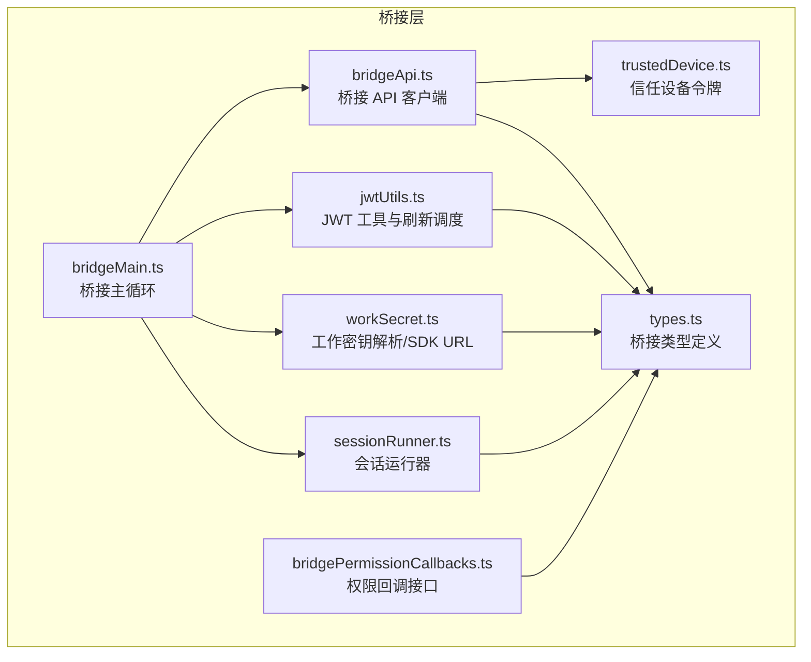
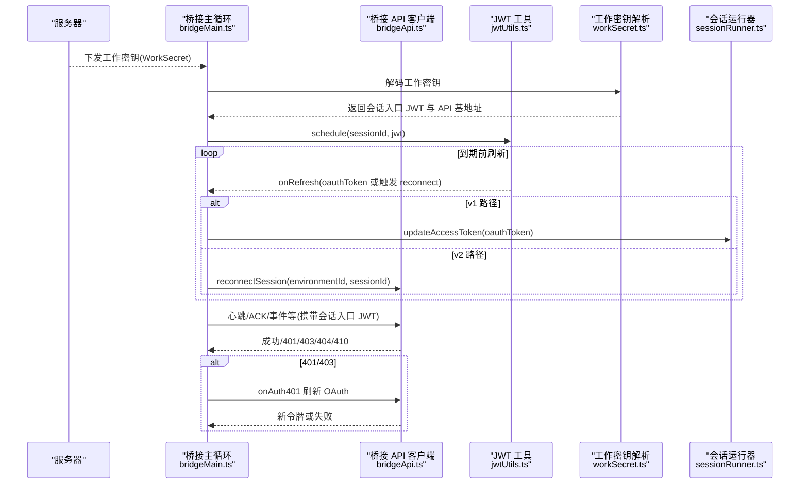
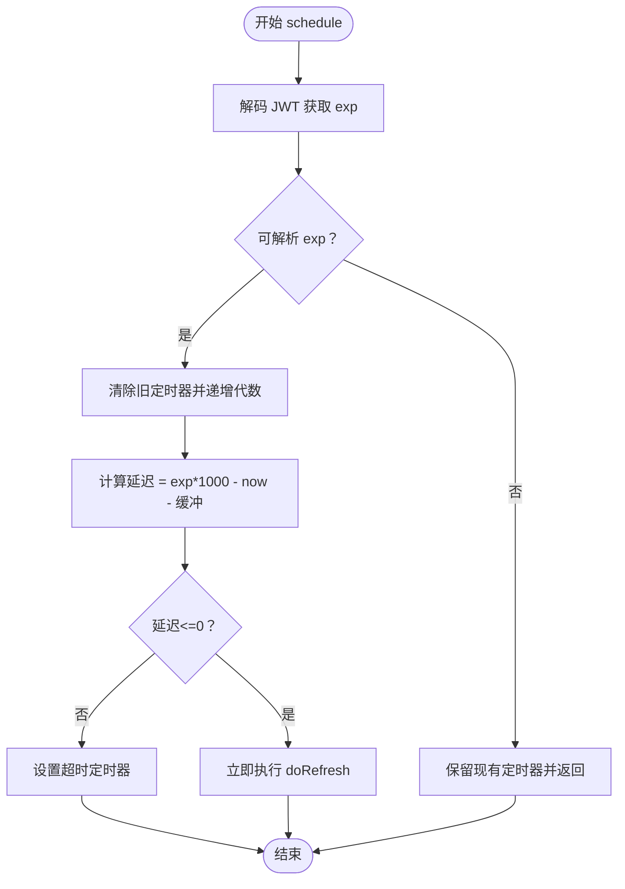
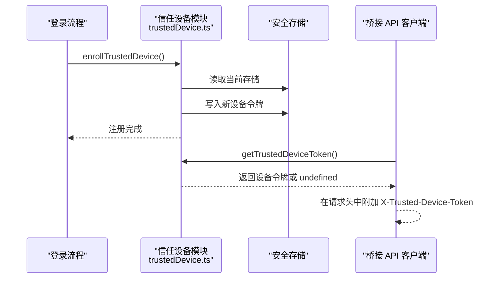
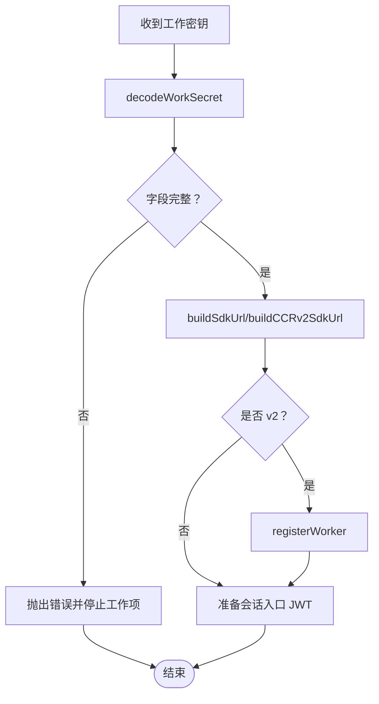
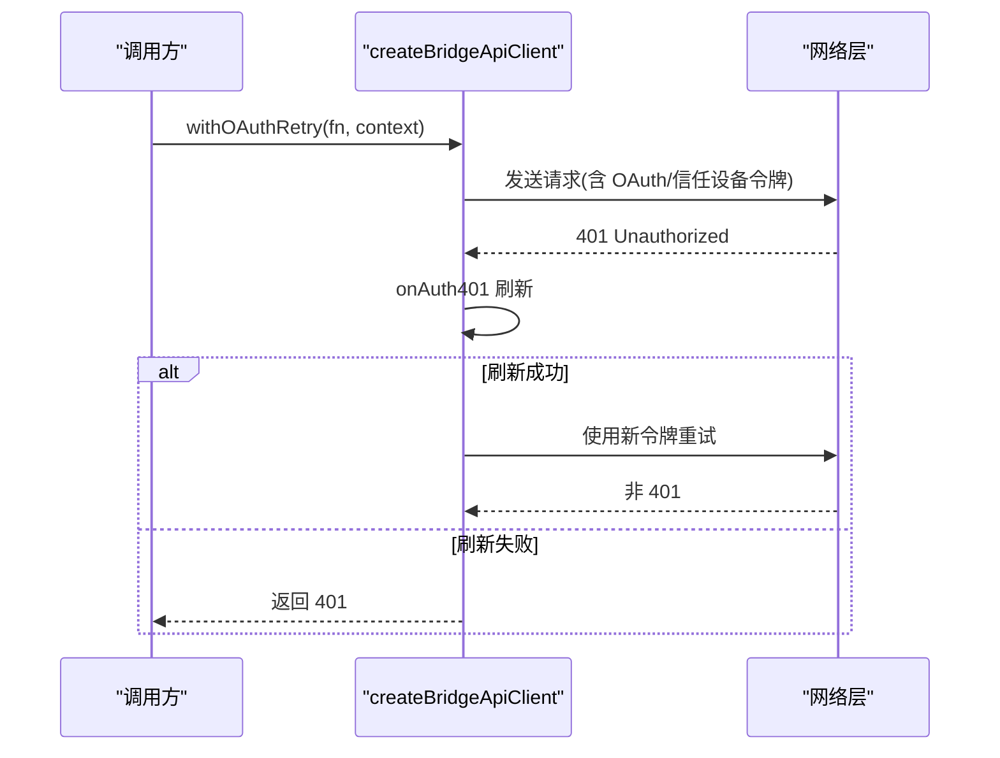
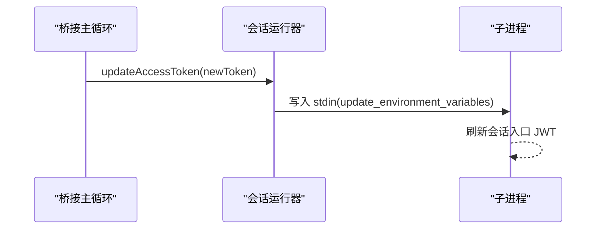
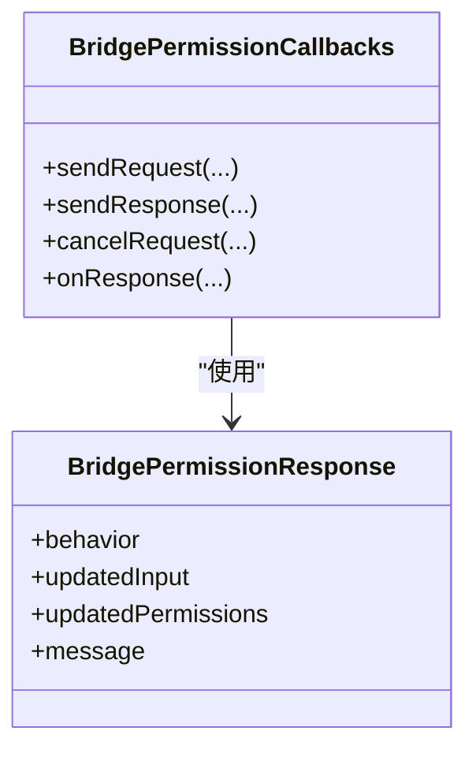
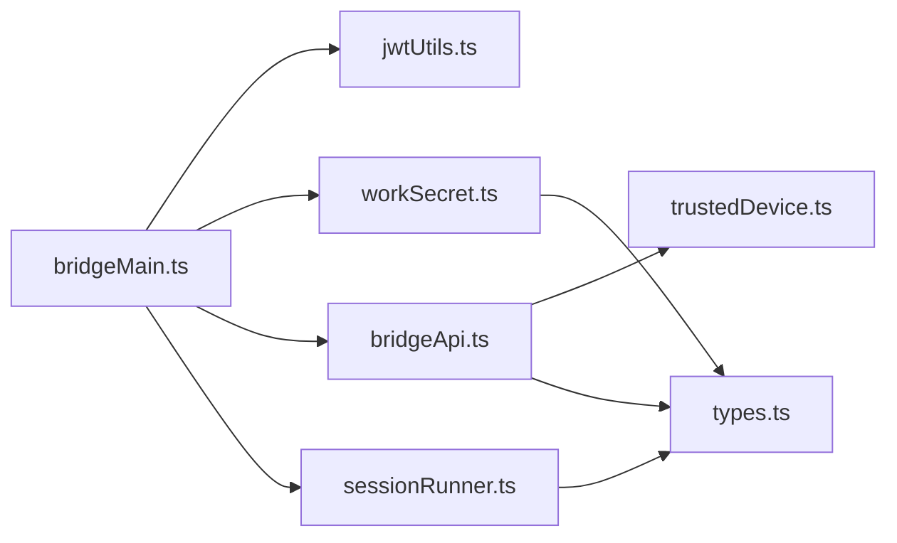

# JWT 认证

<cite>
**本文引用的文件**
- [jwtUtils.ts](file://bridge/jwtUtils.ts)
- [trustedDevice.ts](file://bridge/trustedDevice.ts)
- [workSecret.ts](file://bridge/workSecret.ts)
- [bridgeApi.ts](file://bridge/bridgeApi.ts)
- [bridgeMain.ts](file://bridge/bridgeMain.ts)
- [sessionRunner.ts](file://bridge/sessionRunner.ts)
- [bridgePermissionCallbacks.ts](file://bridge/bridgePermissionCallbacks.ts)
- [types.ts](file://bridge/types.ts)
</cite>

## 目录
1. [简介](#简介)
2. [项目结构](#项目结构)
3. [核心组件](#核心组件)
4. [架构总览](#架构总览)
5. [详细组件分析](#详细组件分析)
6. [依赖关系分析](#依赖关系分析)
7. [性能考量](#性能考量)
8. [故障排查指南](#故障排查指南)
9. [结论](#结论)
10. [附录](#附录)

## 简介
本文件面向远程桥接（Remote Control）场景下的 JWT 认证体系，系统性阐述以下内容：
- JWT 工具函数的实现与使用：包括载荷解码、过期时间解析、刷新调度器等。
- 信任设备令牌（Trusted Device Token）的生成、校验与管理：如何在 Elevated 安全级别下作为桥接请求头发送。
- 工作密钥（Work Secret）的作用与解析：如何从服务器下发的工作密钥中提取会话入口 JWT 与 API 基地址。
- 桥接权限回调系统：如何处理权限请求与响应，以及与认证状态的关系。
- JWT 生命周期管理、刷新机制与失效处理：如何避免过期导致的连接中断。
- 认证失败的诊断与恢复：常见错误类型、重试策略与用户指引。
- 不同认证场景的实现示例：v1 与 v2 两种桥接路径的差异与选择。
- 安全最佳实践与防护措施：令牌存储、传输加密、最小权限原则等。

## 项目结构
围绕 JWT 认证的关键模块分布如下：
- bridge/jwtUtils.ts：JWT 解码、过期时间解析、主动刷新调度器。
- bridge/trustedDevice.ts：信任设备令牌的获取、注册、持久化与缓存清理。
- bridge/workSecret.ts：工作密钥解码、SDK URL 构建、会话 ID 兼容性处理、工作节点注册。
- bridge/bridgeApi.ts：桥接 API 客户端，统一注入 OAuth 令牌与信任设备令牌，处理 401 刷新与错误分类。
- bridge/bridgeMain.ts：桥接主循环，负责轮询、会话生命周期、心跳、令牌刷新与失效恢复。
- bridge/sessionRunner.ts：子进程会话运行器，负责将新令牌通过 stdin 下发给子进程。
- bridge/bridgePermissionCallbacks.ts：权限请求/响应的桥接回调接口定义。
- bridge/types.ts：桥接协议类型、客户端接口、会话句柄与工作密钥结构。

**图表来源**
- [bridgeMain.ts:141-313](file://bridge/bridgeMain.ts#L141-L313)
- [bridgeApi.ts:68-451](file://bridge/bridgeApi.ts#L68-L451)
- [jwtUtils.ts:72-255](file://bridge/jwtUtils.ts#L72-L255)
- [trustedDevice.ts:54-210](file://bridge/trustedDevice.ts#L54-L210)
- [workSecret.ts:6-127](file://bridge/workSecret.ts#L6-L127)
- [sessionRunner.ts:248-547](file://bridge/sessionRunner.ts#L248-L547)
- [bridgePermissionCallbacks.ts:10-43](file://bridge/bridgePermissionCallbacks.ts#L10-L43)
- [types.ts:133-262](file://bridge/types.ts#L133-L262)

**章节来源**
- [bridgeMain.ts:141-313](file://bridge/bridgeMain.ts#L141-L313)
- [bridgeApi.ts:68-451](file://bridge/bridgeApi.ts#L68-L451)
- [jwtUtils.ts:72-255](file://bridge/jwtUtils.ts#L72-L255)
- [trustedDevice.ts:54-210](file://bridge/trustedDevice.ts#L54-L210)
- [workSecret.ts:6-127](file://bridge/workSecret.ts#L6-L127)
- [sessionRunner.ts:248-547](file://bridge/sessionRunner.ts#L248-L547)
- [bridgePermissionCallbacks.ts:10-43](file://bridge/bridgePermissionCallbacks.ts#L10-L43)
- [types.ts:133-262](file://bridge/types.ts#L133-L262)

## 核心组件
- JWT 工具与刷新调度
  - 提供 JWT 载荷解码与过期时间解析，支持带前缀的会话入口令牌。
  - 实现“提前刷新”调度器，基于 JWT exp 或显式 TTL 预约刷新，避免过期。
  - 支持失败重试上限、生成计数器防竞态、取消与批量取消。
- 信任设备令牌
  - 通过 GrowthBook 门控决定是否启用；在 Elevated 安全级别下作为 X-Trusted-Device-Token 发送。
  - 登录后可进行设备注册，持久化到安全存储，并提供缓存清理与环境变量覆盖。
- 工作密钥与 SDK URL
  - 解析服务器下发的 base64url 编码工作密钥，提取会话入口 JWT 与 API 基地址。
  - 根据本地/生产环境自动选择 ws/wss 与版本路径，构建 SDK 连接 URL。
  - 提供 CCR v2 工作节点注册与兼容性处理。
- 桥接 API 客户端
  - 统一注入 Authorization 与 Anthropic 版本头；在需要时附加信任设备令牌。
  - 处理 401 场景的 OAuth 刷新重试；对 403/404/410 等错误进行分类与用户提示。
- 会话运行器
  - 将新令牌通过 stdin 下发至子进程，确保子进程后续请求使用最新会话入口 JWT。
- 权限回调系统
  - 定义权限请求/响应的数据结构与校验逻辑，支持允许/拒绝与更新建议。

**章节来源**
- [jwtUtils.ts:21-255](file://bridge/jwtUtils.ts#L21-L255)
- [trustedDevice.ts:54-210](file://bridge/trustedDevice.ts#L54-L210)
- [workSecret.ts:6-127](file://bridge/workSecret.ts#L6-L127)
- [bridgeApi.ts:76-139](file://bridge/bridgeApi.ts#L76-L139)
- [sessionRunner.ts:527-542](file://bridge/sessionRunner.ts#L527-L542)
- [bridgePermissionCallbacks.ts:32-43](file://bridge/bridgePermissionCallbacks.ts#L32-L43)

## 架构总览
远程桥接的认证流程由“工作密钥下发 → 令牌解析 → 主动刷新 → 子进程同步”的闭环构成。Elevated 安全级别要求信任设备令牌参与鉴权；当会话入口 JWT 即将过期时，桥接主循环通过刷新调度器触发 OAuth 刷新或服务端重新派发，确保长时运行不中断。

**图表来源**
- [bridgeMain.ts:284-313](file://bridge/bridgeMain.ts#L284-L313)
- [bridgeApi.ts:106-139](file://bridge/bridgeApi.ts#L106-L139)
- [jwtUtils.ts:72-255](file://bridge/jwtUtils.ts#L72-L255)
- [workSecret.ts:6-127](file://bridge/workSecret.ts#L6-L127)
- [sessionRunner.ts:527-542](file://bridge/sessionRunner.ts#L527-L542)

## 详细组件分析

### JWT 工具与刷新调度器
- 功能要点
  - 解码 JWT 载荷（剥离会话入口前缀），提取 exp 时间戳。
  - 基于 exp 或 expires_in 预约刷新，缓冲区默认 5 分钟，避免临界过期。
  - 当无法获取 OAuth 令牌时，最多重试 3 次，间隔 1 分钟，防止无限重试风暴。
  - 使用“代数”计数器避免竞态：每次 reschedule/invalidate 递增代数，已过期的异步刷新任务检测到后直接跳过。
  - 支持按 sessionId 取消单个定时器，或批量取消所有定时器。
- 性能与可靠性
  - 通过延迟计算与 floor 限制避免极端情况下紧循环。
  - 失败计数与重试控制降低瞬时故障影响。
- 使用场景
  - 在桥接主循环中对每个活动会话设置到期前刷新。
  - 对于 v2 会话，刷新触发服务端重新派发工作，避免客户端 JWT 过期导致静默断连。

**图表来源**
- [jwtUtils.ts:102-140](file://bridge/jwtUtils.ts#L102-L140)

**章节来源**
- [jwtUtils.ts:21-255](file://bridge/jwtUtils.ts#L21-L255)

### 信任设备令牌（Trusted Device）
- 功能要点
  - 通过 GrowthBook 门控判断是否启用；启用后从安全存储读取持久化的设备令牌。
  - 登录后调用 enrollTrustedDevice 注册设备，写入安全存储并清空缓存。
  - 支持环境变量覆盖（便于测试/企业定制），并在登录前后清理旧令牌。
  - 仅在 Elevated 安全级别下作为 X-Trusted-Device-Token 发送到桥接 API。
- 安全与可用性
  - 令牌持久化（90 天滚动过期），减少频繁交互。
  - 与 OAuth 流程解耦，避免因 OAuth 失效导致桥接不可用。
- 使用场景
  - 在桥接 API 请求头中附加该令牌，满足服务端 Elevated 鉴权要求。

**图表来源**
- [trustedDevice.ts:98-210](file://bridge/trustedDevice.ts#L98-L210)
- [bridgeApi.ts:76-89](file://bridge/bridgeApi.ts#L76-L89)

**章节来源**
- [trustedDevice.ts:54-210](file://bridge/trustedDevice.ts#L54-L210)
- [bridgeApi.ts:76-89](file://bridge/bridgeApi.ts#L76-L89)

### 工作密钥与 SDK URL
- 功能要点
  - 解码 base64url 工作密钥，校验版本与必要字段（如会话入口 JWT、API 基地址）。
  - 根据是否本地环境自动选择 ws/wss 与版本路径（v2/v1）。
  - 提供 CCR v2 工作节点注册，返回 worker_epoch 用于 SSE 通道。
  - 提供会话 ID 兼容性比较，解决不同标签前缀下的同一会话识别问题。
- 使用场景
  - 桥接主循环在收到工作密钥后，解析出会话入口 JWT 与 SDK URL，启动会话或触发 v2 注册。

**图表来源**
- [workSecret.ts:6-127](file://bridge/workSecret.ts#L6-L127)

**章节来源**
- [workSecret.ts:6-127](file://bridge/workSecret.ts#L6-L127)

### 桥接 API 客户端与认证错误处理
- 功能要点
  - 统一注入 Authorization、Anthropic 版本与运行器版本头；在需要时附加信任设备令牌。
  - 对 401 场景尝试一次 OAuth 刷新重试；对 403/404/410 进行分类与用户提示。
  - 提供 isExpiredErrorType 与 isSuppressible403 辅助判断，区分可忽略与致命错误。
- 使用场景
  - 所有桥接 API 调用均通过该客户端封装，保证一致的认证与错误处理行为。

**图表来源**
- [bridgeApi.ts:106-139](file://bridge/bridgeApi.ts#L106-L139)

**章节来源**
- [bridgeApi.ts:76-139](file://bridge/bridgeApi.ts#L76-L139)

### 会话运行器与令牌同步
- 功能要点
  - 将新令牌通过 stdin 下发至子进程，子进程在下一次刷新头时使用新令牌。
  - 支持 SIGTERM/SIGKILL 清理，保证优雅退出。
- 使用场景
  - v1 路径：直接替换会话入口 JWT；v2 路径：通过服务端重新派发工作。

**图表来源**
- [sessionRunner.ts:527-542](file://bridge/sessionRunner.ts#L527-L542)
- [bridgeMain.ts:284-313](file://bridge/bridgeMain.ts#L284-L313)

**章节来源**
- [sessionRunner.ts:527-542](file://bridge/sessionRunner.ts#L527-L542)
- [bridgeMain.ts:284-313](file://bridge/bridgeMain.ts#L284-L313)

### 权限回调系统
- 功能要点
  - 定义权限请求/响应的数据结构与校验函数，确保行为字段合法。
  - 支持发送请求、响应、取消与订阅响应回调。
- 使用场景
  - 当子进程发出 control_request 时，桥接通过回调系统与服务端交互，最终将结果回传至会话。

**图表来源**
- [bridgePermissionCallbacks.ts:10-43](file://bridge/bridgePermissionCallbacks.ts#L10-L43)

**章节来源**
- [bridgePermissionCallbacks.ts:10-43](file://bridge/bridgePermissionCallbacks.ts#L10-L43)

## 依赖关系分析
- 模块耦合
  - bridgeMain.ts 依赖 jwtUtils.ts（刷新调度）、workSecret.ts（工作密钥解析）、bridgeApi.ts（API 客户端）、sessionRunner.ts（令牌同步）。
  - bridgeApi.ts 依赖 trustedDevice.ts（信任设备令牌）与 types.ts（类型）。
  - sessionRunner.ts 依赖 types.ts（会话句柄）。
  - workSecret.ts 与 types.ts（WorkSecret 结构）。
- 关键依赖链
  - 工作密钥 → 会话入口 JWT → 心跳/ACK → 主动刷新 → 子进程令牌同步。
  - OAuth 令牌 → 401 刷新重试 → API 请求继续。
  - 信任设备令牌 → Elevated 鉴权 → 桥接 API 请求。

**图表来源**
- [bridgeMain.ts:34-57](file://bridge/bridgeMain.ts#L34-L57)
- [bridgeApi.ts:12-16](file://bridge/bridgeApi.ts#L12-L16)
- [jwtUtils.ts:72-88](file://bridge/jwtUtils.ts#L72-L88)
- [workSecret.ts:3-4](file://bridge/workSecret.ts#L3-L4)
- [sessionRunner.ts:8-14](file://bridge/sessionRunner.ts#L8-L14)

**章节来源**
- [bridgeMain.ts:34-57](file://bridge/bridgeMain.ts#L34-L57)
- [bridgeApi.ts:12-16](file://bridge/bridgeApi.ts#L12-L16)
- [jwtUtils.ts:72-88](file://bridge/jwtUtils.ts#L72-L88)
- [workSecret.ts:3-4](file://bridge/workSecret.ts#L3-L4)
- [sessionRunner.ts:8-14](file://bridge/sessionRunner.ts#L8-L14)

## 性能考量
- 刷新调度
  - 默认缓冲 5 分钟，避免临界过期；fallback 间隔 30 分钟，保障长时间会话稳定。
  - 最大连续失败次数 3，失败重试 1 分钟，防止雪崩。
- 心跳与轮询
  - 在容量饱和时采用心跳模式维持租约，避免频繁轮询带来的压力。
  - 空闲轮询采用指数退避与抖动，结合睡眠检测避免误判。
- 存储与缓存
  - 信任设备令牌读取使用缓存（memoize），减少安全存储子进程开销。
- 并发与竞态
  - 通过“代数”计数器避免刷新任务竞态，确保只保留最新一代任务生效。

[本节为通用性能讨论，无需特定文件引用]

## 故障排查指南
- 常见错误与处理
  - 401 未授权：尝试一次 OAuth 刷新重试；若失败则视为致命错误，需用户登录。
  - 403 权限不足：区分可忽略与致命错误；可忽略的 403（如外部轮询/管理权限）不提示用户。
  - 404/410 会话/环境过期：提示用户重启远程控制或使用续用命令。
  - 429 频率限制：提示轮询过于频繁，调整策略。
- 诊断与日志
  - 使用调试日志与诊断日志输出关键路径（刷新、心跳、重连、错误类型）。
  - 对信任设备注册失败、存储写入失败、工作密钥解码失败等进行分级记录。
- 恢复步骤
  - 认证失败：执行登录流程，必要时清理缓存并重新注册信任设备。
  - 会话过期：通过 reconnectSession 触发服务端重新派发工作。
  - 网络异常：根据退避策略等待重试，检测系统休眠并重置错误预算。

**章节来源**
- [bridgeApi.ts:454-508](file://bridge/bridgeApi.ts#L454-L508)
- [bridgeApi.ts:516-524](file://bridge/bridgeApi.ts#L516-L524)
- [bridgeMain.ts:244-262](file://bridge/bridgeMain.ts#L244-L262)
- [trustedDevice.ts:167-171](file://bridge/trustedDevice.ts#L167-L171)

## 结论
该 JWT 认证体系通过“工作密钥 → 会话入口 JWT → 主动刷新 → 子进程同步”的闭环，实现了 Elevated 安全级别的稳定桥接。配合信任设备令牌与 OAuth 刷新重试，系统在复杂网络环境下仍能保持高可用。通过严格的错误分类与诊断日志，运维与用户可以快速定位并恢复问题。

[本节为总结性内容，无需特定文件引用]

## 附录

### 不同认证场景示例
- v1 会话（HybridTransport）
  - 使用会话入口 JWT 作为会话级认证；通过 sessionRunner 更新令牌后，子进程直接使用新 JWT。
- v2 会话（SSETransport + CCRClient）
  - 使用会话入口 JWT 作为会话级认证；刷新时触发服务端重新派发工作，避免客户端 JWT 过期导致静默断连。

**章节来源**
- [bridgeMain.ts:272-313](file://bridge/bridgeMain.ts#L272-L313)
- [sessionRunner.ts:527-542](file://bridge/sessionRunner.ts#L527-L542)

### 安全最佳实践
- 令牌存储
  - 信任设备令牌与工作密钥通过安全存储持久化，避免明文落盘。
- 传输安全
  - 生产环境使用 wss，本地开发使用 ws；严格校验 API 基地址与版本路径。
- 最小权限
  - 仅在 Elevated 安全级别下启用信任设备令牌；OAuth 令牌用于刷新，不直接暴露给子进程。
- 监控与告警
  - 记录刷新失败、心跳失败、连接错误等关键事件，设置阈值告警。

**章节来源**
- [trustedDevice.ts:182-197](file://bridge/trustedDevice.ts#L182-L197)
- [workSecret.ts:41-48](file://bridge/workSecret.ts#L41-L48)
- [bridgeApi.ts:76-89](file://bridge/bridgeApi.ts#L76-L89)