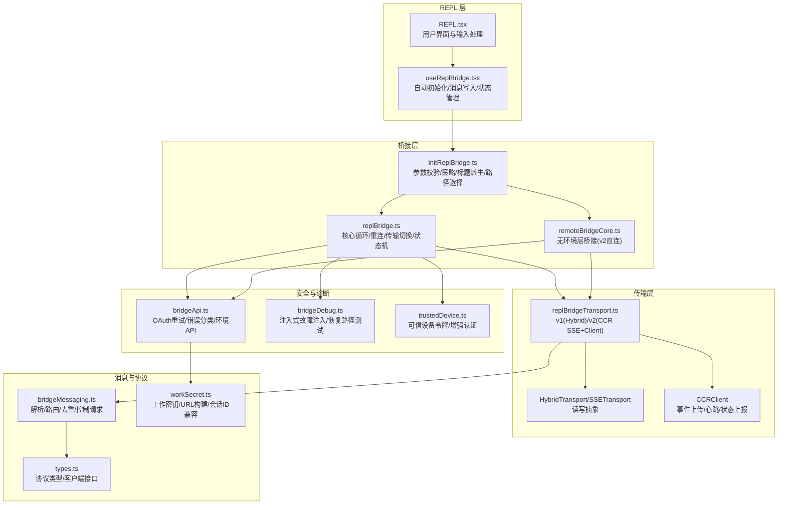
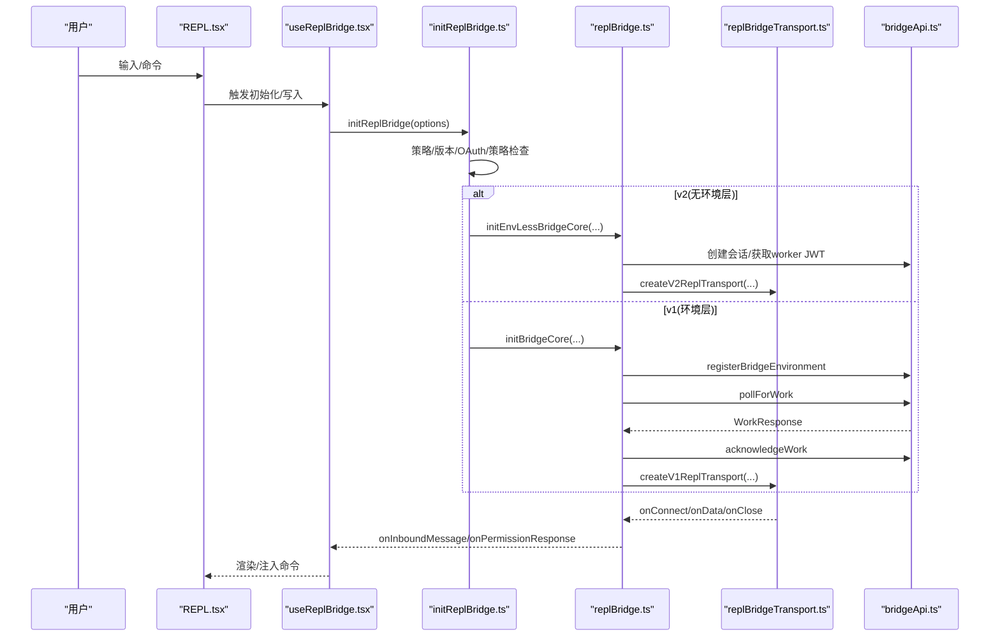
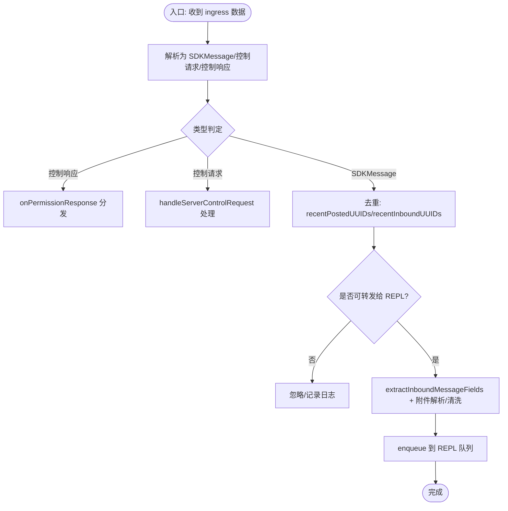
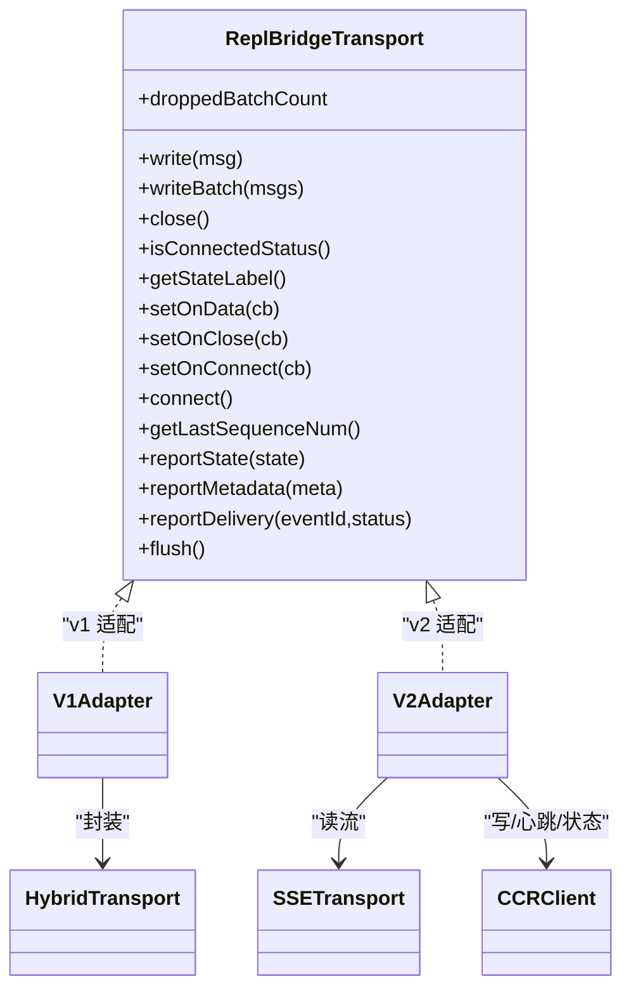
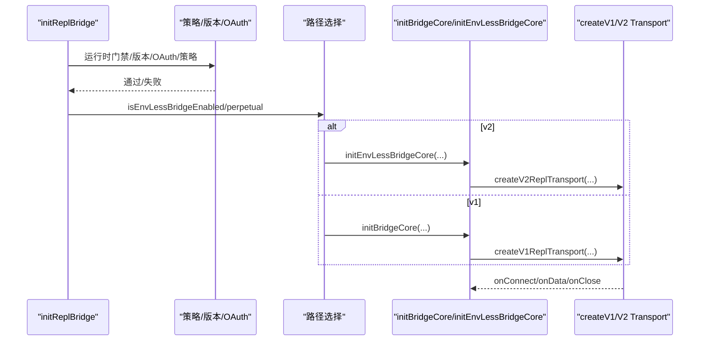
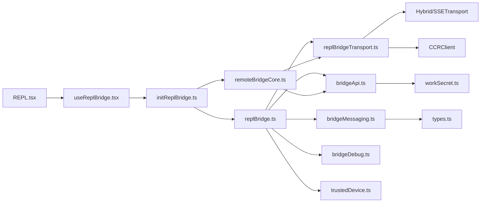

# REPL 桥接

<cite>
**本文引用的文件**
- [replBridge.ts](file://bridge/replBridge.ts)
- [initReplBridge.ts](file://bridge/initReplBridge.ts)
- [replBridgeTransport.ts](file://bridge/replBridgeTransport.ts)
- [bridgeApi.ts](file://bridge/bridgeApi.ts)
- [bridgeMessaging.ts](file://bridge/bridgeMessaging.ts)
- [remoteBridgeCore.ts](file://bridge/remoteBridgeCore.ts)
- [types.ts](file://bridge/types.ts)
- [useReplBridge.tsx](file://hooks/useReplBridge.tsx)
- [REPL.tsx](file://screens/REPL.tsx)
- [bridgeDebug.ts](file://bridge/bridgeDebug.ts)
- [trustedDevice.ts](file://bridge/trustedDevice.ts)
- [workSecret.ts](file://bridge/workSecret.ts)
- [print.ts](file://cli/print.ts)
</cite>

## 目录
1. [简介](#简介)
2. [项目结构](#项目结构)
3. [核心组件](#核心组件)
4. [架构总览](#架构总览)
5. [详细组件分析](#详细组件分析)
6. [依赖关系分析](#依赖关系分析)
7. [性能考量](#性能考量)
8. [故障排除指南](#故障排除指南)
9. [结论](#结论)
10. [附录](#附录)

## 简介
本文件系统性阐述远程桥接的 REPL 桥接功能：从设计目标、实现原理到协议与数据格式；从初始化流程与配置项到交互模式与状态管理；并提供调试与故障排除方法及在远程开发场景中的应用建议。REPL 桥接旨在让本地终端具备与云端会话实时交互的能力，支持命令路由、权限控制、消息去重与回放保护，并在 v1（环境注册 + 轮询）与 v2（直接桥接 + CCR v2 传输）两种路径下稳定运行。

## 项目结构
REPL 桥接由“初始化包装器”“核心桥接引擎”“传输适配层”“消息编排”“API 客户端”“安全与可信设备”等模块组成，围绕统一的 ReplBridgeHandle 提供一致的写入、控制与生命周期管理能力。

图示来源
- [replBridge.ts](file://bridge/replBridge.ts)
- [initReplBridge.ts](file://bridge/initReplBridge.ts)
- [replBridgeTransport.ts](file://bridge/replBridgeTransport.ts)
- [bridgeApi.ts](file://bridge/bridgeApi.ts)
- [bridgeMessaging.ts](file://bridge/bridgeMessaging.ts)
- [remoteBridgeCore.ts](file://bridge/remoteBridgeCore.ts)
- [types.ts](file://bridge/types.ts)
- [useReplBridge.tsx](file://hooks/useReplBridge.tsx)
- [REPL.tsx](file://screens/REPL.tsx)
- [bridgeDebug.ts](file://bridge/bridgeDebug.ts)
- [trustedDevice.ts](file://bridge/trustedDevice.ts)
- [workSecret.ts](file://bridge/workSecret.ts)

章节来源
- [replBridge.ts](file://bridge/replBridge.ts)
- [initReplBridge.ts](file://bridge/initReplBridge.ts)
- [replBridgeTransport.ts](file://bridge/replBridgeTransport.ts)
- [bridgeApi.ts](file://bridge/bridgeApi.ts)
- [bridgeMessaging.ts](file://bridge/bridgeMessaging.ts)
- [remoteBridgeCore.ts](file://bridge/remoteBridgeCore.ts)
- [types.ts](file://bridge/types.ts)
- [useReplBridge.tsx](file://hooks/useReplBridge.tsx)
- [REPL.tsx](file://screens/REPL.tsx)
- [bridgeDebug.ts](file://bridge/bridgeDebug.ts)
- [trustedDevice.ts](file://bridge/trustedDevice.ts)
- [workSecret.ts](file://bridge/workSecret.ts)

## 核心组件
- 初始化包装器（initReplBridge）
  - 负责运行时门禁、OAuth 校验、组织策略检查、最小版本检查、会话标题派生、v1/v2 路径选择与参数透传。
- 核心桥接引擎（initBridgeCore）
  - 环境注册、会话创建、轮询工作项、建立 ingress 通道、重连与会话迁移、传输切换、初始历史回放、去重与回放保护。
- 无环境层桥接（initEnvLessBridgeCore）
  - 直接创建会话并获取 worker JWT，绕过环境层，使用 CCR v2 传输。
- 传输适配层（ReplBridgeTransport）
  - v1：HybridTransport（WS 读 + Session-Ingress POST 写）
  - v2：SSETransport（读）+ CCRClient（写/心跳/状态/交付跟踪）
- 消息编排（bridgeMessaging）
  - 解析/路由/去重（echo/重复提示）、控制请求/响应分发、标题派生文本提取。
- API 客户端（bridgeApi）
  - 环境 API 封装、OAuth 重试、致命错误分类、ID 校验、心跳/停止工作等。
- 安全与可信设备（trustedDevice）
  - 可信设备令牌发放与缓存、增强认证头注入。
- 协议与类型（types/workSecret）
  - 工作密钥解码、SDK/CCR URL 构建、会话 ID 兼容转换。

章节来源
- [initReplBridge.ts](file://bridge/initReplBridge.ts)
- [replBridge.ts](file://bridge/replBridge.ts)
- [remoteBridgeCore.ts](file://bridge/remoteBridgeCore.ts)
- [replBridgeTransport.ts](file://bridge/replBridgeTransport.ts)
- [bridgeMessaging.ts](file://bridge/bridgeMessaging.ts)
- [bridgeApi.ts](file://bridge/bridgeApi.ts)
- [trustedDevice.ts](file://bridge/trustedDevice.ts)
- [workSecret.ts](file://bridge/workSecret.ts)
- [types.ts](file://bridge/types.ts)

## 架构总览
REPL 桥接在“REPL 层”（REPL.tsx + useReplBridge.tsx）与“桥接层”之间通过统一的 ReplBridgeHandle 进行交互。初始化阶段根据策略与配置选择 v1 或 v2 路径：

- v1 路径：环境注册 → 轮询工作项 → 获取 ingress 令牌 → 建立 ingress 通道（WS 或 SSE），支持断线重连与会话迁移。
- v2 路径：直接创建会话 → 获取 worker JWT → 注册 worker_epoch → 建立 SSE 读流 + CCRClient 写流，支持主动刷新与 401 自愈。

图示来源
- [initReplBridge.ts](file://bridge/initReplBridge.ts)
- [replBridge.ts](file://bridge/replBridge.ts)
- [replBridgeTransport.ts](file://bridge/replBridgeTransport.ts)
- [bridgeApi.ts](file://bridge/bridgeApi.ts)
- [useReplBridge.tsx](file://hooks/useReplBridge.tsx)
- [REPL.tsx](file://screens/REPL.tsx)

## 详细组件分析

### REPL 桥接处理器工作机制与命令路由
- 处理器职责
  - 接收来自云端的控制请求（如 set_model、can_use_tool 等），在本地快速响应或触发权限决策。
  - 对用户消息进行去重与回放保护，避免 echo 与重复提示。
  - 将合适的 SDKMessage 转换为 REPL 可消费的命令队列，支持附件解析与安全注入。
- 命令路由
  - 控制请求在本地即时处理，权限响应通过 onPermissionResponse 回传至云端。
  - 用户消息经标题派生逻辑与过滤规则后注入 REPL，支持延迟附件解析与安全清洗。

图示来源
- [bridgeMessaging.ts](file://bridge/bridgeMessaging.ts)
- [useReplBridge.tsx](file://hooks/useReplBridge.tsx)

章节来源
- [bridgeMessaging.ts](file://bridge/bridgeMessaging.ts)
- [useReplBridge.tsx](file://hooks/useReplBridge.tsx)

### REPL 桥接传输层协议与数据格式
- v1 传输
  - 读：HybridTransport（WebSocket）或 SSETransport（Session-Ingress）
  - 写：HybridTransport（POST Session-Ingress）
  - 特点：基于环境轮询与工作项 ack 的长连接模型，断线后通过轮询恢复。
- v2 传输
  - 读：SSETransport（/worker/events/stream），支持序列号续播（from_sequence_num/Last-Event-ID）
  - 写：CCRClient（/worker/events + 心跳/状态/交付跟踪），批量有序上传
  - 认证：worker JWT（session_id + role=worker），支持主动刷新与 401 自愈
  - 特点：无环境层，直接桥接，更稳定的回放与交付确认。
- 数据格式
  - SDKMessage：用户/助手消息与系统事件
  - 控制请求/响应：用于权限与会话控制
  - 工作密钥（WorkSecret）：包含 ingress 令牌、API 基址、源信息等

图示来源
- [replBridgeTransport.ts](file://bridge/replBridgeTransport.ts)

章节来源
- [replBridgeTransport.ts](file://bridge/replBridgeTransport.ts)
- [workSecret.ts](file://bridge/workSecret.ts)
- [types.ts](file://bridge/types.ts)

### 初始化流程与配置选项
- 初始化步骤
  - 运行时门禁与最小版本检查（v1/v2 各自门槛）
  - OAuth 校验与跨进程死令牌保护
  - 组织策略检查（allow_remote_control）
  - 会话标题派生（优先级：显式名称 → /rename → 最近用户消息 → 自动生成）
  - 路径选择：v2（无环境层）或 v1（环境层）
  - v1：环境注册 → 会话创建 → 轮询工作项 → 建立 ingress 通道
  - v2：创建会话 → 获取 worker JWT → 注册 worker_epoch → 建立 SSE+CCR 通道
- 关键配置
  - 权限模式回调、中断回调、模型设置回调、最大思考令牌回调
  - 初始历史容量、初始消息集合、先前已刷新 UUID 集合
  - 是否仅出站（镜像模式）、标签、是否持久化（助理模式）

图示来源
- [initReplBridge.ts](file://bridge/initReplBridge.ts)
- [replBridge.ts](file://bridge/replBridge.ts)
- [remoteBridgeCore.ts](file://bridge/remoteBridgeCore.ts)
- [replBridgeTransport.ts](file://bridge/replBridgeTransport.ts)

章节来源
- [initReplBridge.ts](file://bridge/initReplBridge.ts)
- [replBridge.ts](file://bridge/replBridge.ts)
- [remoteBridgeCore.ts](file://bridge/remoteBridgeCore.ts)

### REPL 交互模式与状态管理
- 状态机
  - ready → connected → reconnecting → failed
  - 状态变更通过 onStateChange 回调通知 UI 与日志
- 交互模式
  - 标题派生：首次与第三次用户消息触发标题升级；支持显式名称与 /rename 覆盖
  - 出站模式：仅上传事件，不接收入站提示（镜像模式）
  - 权限模式：通过 onSetPermissionMode 回调进行策略校验与决策
- 生命周期
  - 初始化成功后发布桥接会话 ID，便于多进程去重
  - 断线重连：支持环境重连与会话迁移，避免历史重复回放

章节来源
- [replBridge.ts](file://bridge/replBridge.ts)
- [initReplBridge.ts](file://bridge/initReplBridge.ts)
- [useReplBridge.tsx](file://hooks/useReplBridge.tsx)

### 安全性与稳定性考虑
- 安全
  - 可信设备令牌：在增强安全等级下，通过 X-Trusted-Device-Token 强化 worker 认证
  - OAuth 重试：401 自动刷新，失败后降级为致命错误
  - 会话 ID 兼容：支持 cse_* 与 session_* 的互操作，避免误判
- 稳定性
  - 传输切换：SSE 序列号续播，避免全量历史回放
  - 去重与回放保护：双层 UUID 集合（发送/入站）防止 echo 与重复提示
  - 故障注入：抗压测试与恢复路径验证（/bridge-kick）
  - 401 自愈：v2 通过主动刷新 worker JWT 与 SSE 重连恢复

章节来源
- [trustedDevice.ts](file://bridge/trustedDevice.ts)
- [bridgeApi.ts](file://bridge/bridgeApi.ts)
- [workSecret.ts](file://bridge/workSecret.ts)
- [bridgeDebug.ts](file://bridge/bridgeDebug.ts)
- [replBridge.ts](file://bridge/replBridge.ts)

## 依赖关系分析

图示来源
- [initReplBridge.ts](file://bridge/initReplBridge.ts)
- [replBridge.ts](file://bridge/replBridge.ts)
- [remoteBridgeCore.ts](file://bridge/remoteBridgeCore.ts)
- [replBridgeTransport.ts](file://bridge/replBridgeTransport.ts)
- [bridgeApi.ts](file://bridge/bridgeApi.ts)
- [workSecret.ts](file://bridge/workSecret.ts)
- [bridgeMessaging.ts](file://bridge/bridgeMessaging.ts)
- [types.ts](file://bridge/types.ts)
- [bridgeDebug.ts](file://bridge/bridgeDebug.ts)
- [trustedDevice.ts](file://bridge/trustedDevice.ts)
- [useReplBridge.tsx](file://hooks/useReplBridge.tsx)
- [REPL.tsx](file://screens/REPL.tsx)

章节来源
- [initReplBridge.ts](file://bridge/initReplBridge.ts)
- [replBridge.ts](file://bridge/replBridge.ts)
- [remoteBridgeCore.ts](file://bridge/remoteBridgeCore.ts)
- [replBridgeTransport.ts](file://bridge/replBridgeTransport.ts)
- [bridgeApi.ts](file://bridge/bridgeApi.ts)
- [workSecret.ts](file://bridge/workSecret.ts)
- [bridgeMessaging.ts](file://bridge/bridgeMessaging.ts)
- [types.ts](file://bridge/types.ts)
- [bridgeDebug.ts](file://bridge/bridgeDebug.ts)
- [trustedDevice.ts](file://bridge/trustedDevice.ts)
- [useReplBridge.tsx](file://hooks/useReplBridge.tsx)
- [REPL.tsx](file://screens/REPL.tsx)

## 性能考量
- 传输效率
  - v2 使用 CCRClient 批量上传与心跳，减少网络往返；SSE 续播避免全量回放
  - v1 通过会话游标与服务器侧重放策略降低重复推送
- 去重与回放
  - BoundedUUIDSet 限制内存占用，兼顾回放鲁棒性
- 轮询与心跳
  - 可配置轮询间隔，异常时指数退避并在超时后放弃
- 会话迁移
  - 重连时携带 lastTransportSequenceNum，确保续播而非重放

## 故障排除指南
- 常见问题与定位
  - OAuth 失败：检查令牌有效性与刷新链路，查看 onAuth401 回调行为
  - 401/403：确认组织策略与可信设备令牌；必要时通过 /bridge-kick 注入故障验证恢复路径
  - 404 环境丢失：触发重连策略（尝试在同一环境内重连会话，否则创建新会话）
  - v2 409 epoch 不匹配：关闭资源并重新初始化，确保 worker_epoch 一致性
- 调试工具
  - 注入式故障注入：wrapApiForFaultInjection 与 /bridge-kick 子命令
  - 日志与遥测：debug 日志、诊断日志、事件埋点
- 自动恢复
  - 交叉进程死令牌保护：连续失败达到阈值后自动退避
  - 重连上限与环境重建次数限制，避免无限循环

章节来源
- [bridgeApi.ts](file://bridge/bridgeApi.ts)
- [bridgeDebug.ts](file://bridge/bridgeDebug.ts)
- [replBridge.ts](file://bridge/replBridge.ts)
- [replBridgeTransport.ts](file://bridge/replBridgeTransport.ts)

## 结论
REPL 桥接通过清晰的分层设计与稳健的传输协议，在 v1 与 v2 两条路径上实现了高可用的远程交互能力。其去重与回放保护、权限与模型控制、标题派生与状态机管理，共同构成了可靠的 REPL 交互体验。结合安全增强与抗压测试能力，REPL 桥接在远程开发场景中具备良好的稳定性与可维护性。

## 附录

### REPL 桥接在远程开发中的应用
- 本地终端作为“远程 IDE”：通过入站提示与命令注入，实现实时协作与自动化执行
- 无环境层直连：降低延迟与复杂度，适合轻量级会话与镜像模式
- 助理模式持续会话：跨重启保持对话连续性，提升开发效率

章节来源
- [remoteBridgeCore.ts](file://bridge/remoteBridgeCore.ts)
- [initReplBridge.ts](file://bridge/initReplBridge.ts)
- [useReplBridge.tsx](file://hooks/useReplBridge.tsx)
- [REPL.tsx](file://screens/REPL.tsx)