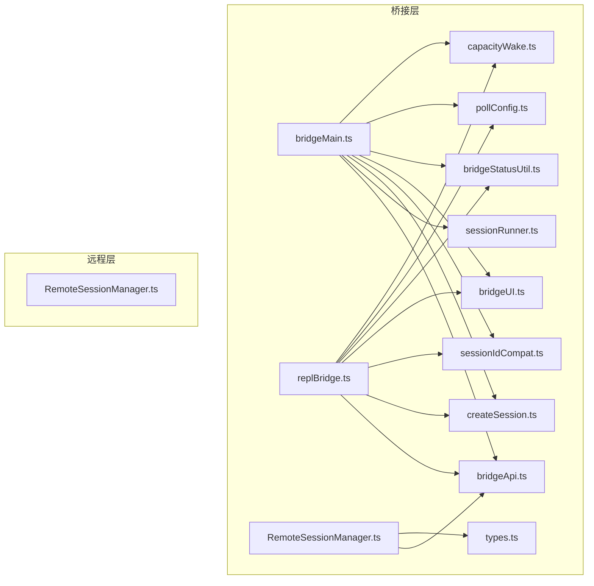
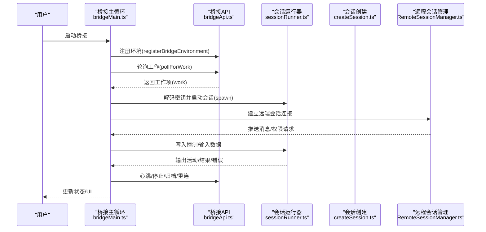
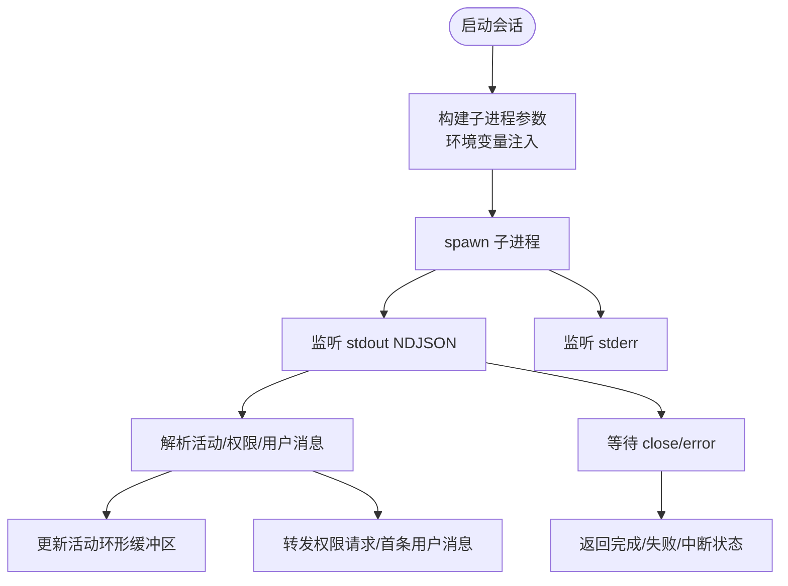
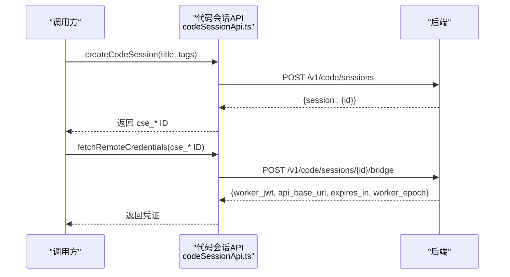
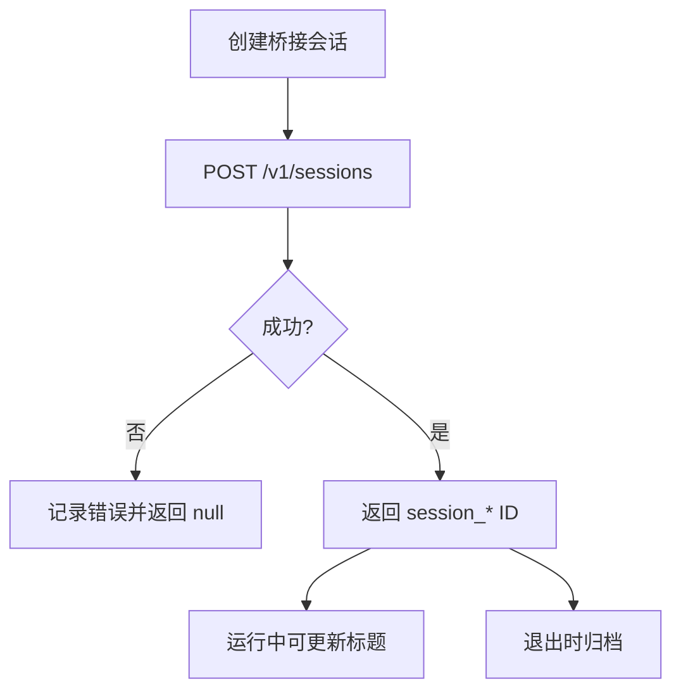
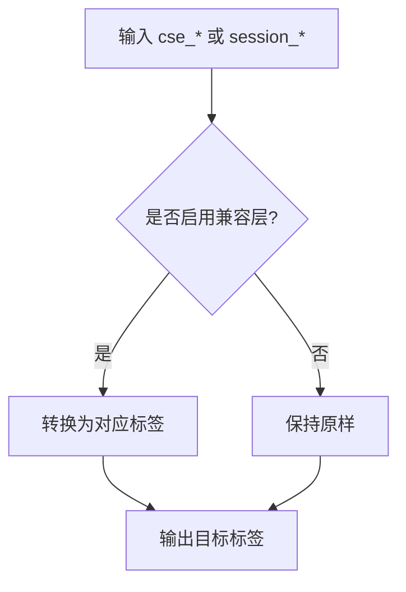
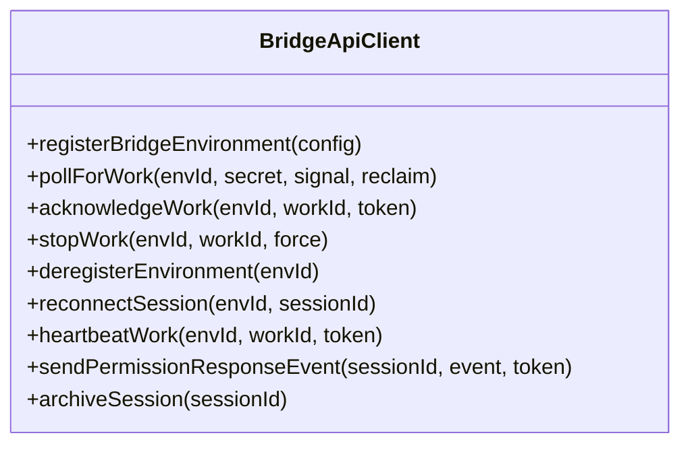
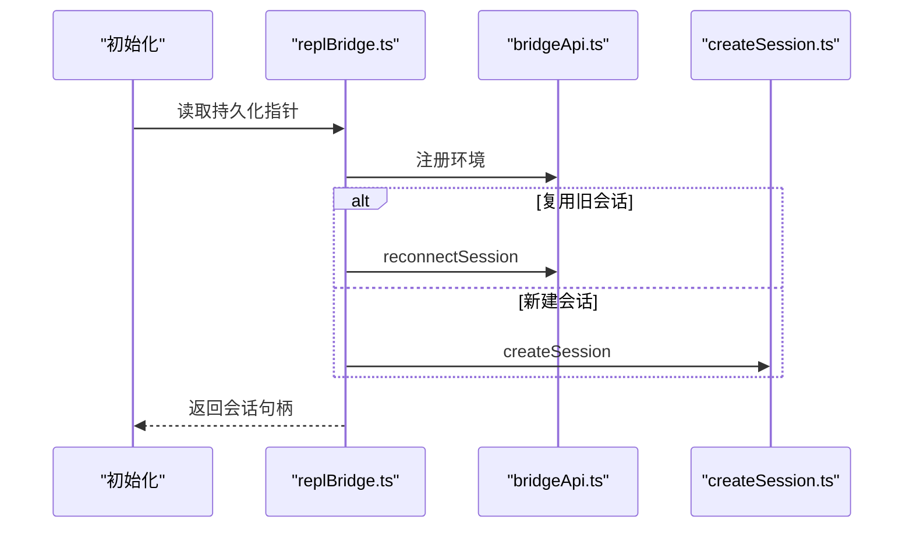
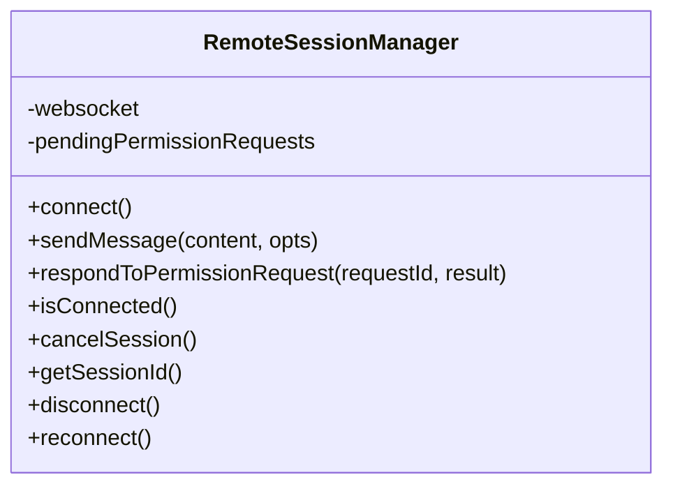
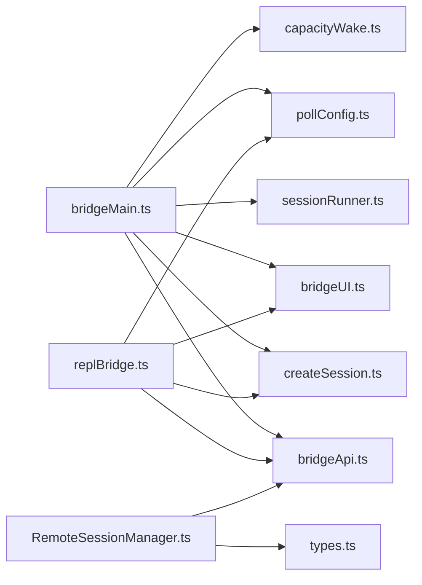

# 会话管理

<cite>
**本文引用的文件**
- [sessionRunner.ts](file://bridge/sessionRunner.ts)
- [codeSessionApi.ts](file://bridge/codeSessionApi.ts)
- [createSession.ts](file://bridge/createSession.ts)
- [sessionIdCompat.ts](file://bridge/sessionIdCompat.ts)
- [types.ts](file://bridge/types.ts)
- [bridgeApi.ts](file://bridge/bridgeApi.ts)
- [bridgeMain.ts](file://bridge/bridgeMain.ts)
- [replBridge.ts](file://bridge/replBridge.ts)
- [RemoteSessionManager.ts](file://remote/RemoteSessionManager.ts)
- [bridgeStatusUtil.ts](file://bridge/bridgeStatusUtil.ts)
- [bridgeUI.ts](file://bridge/bridgeUI.ts)
- [pollConfig.ts](file://bridge/pollConfig.ts)
- [capacityWake.ts](file://bridge/capacityWake.ts)
- [sessionRestore.ts](file://utils/sessionRestore.ts)
</cite>

## 目录
1. [简介](#简介)
2. [项目结构](#项目结构)
3. [核心组件](#核心组件)
4. [架构总览](#架构总览)
5. [详细组件分析](#详细组件分析)
6. [依赖关系分析](#依赖关系分析)
7. [性能考量](#性能考量)
8. [故障排查指南](#故障排查指南)
9. [结论](#结论)
10. [附录](#附录)

## 简介
本文件面向“远程桥接的会话管理系统”，系统性阐述会话运行器的工作原理、会话创建与生命周期管理、代码会话 API 的设计与使用、会话 ID 兼容性处理机制、会话状态跟踪与恢复、会话清理策略，并提供最佳实践、常见问题解决方案、监控与调试方法以及多场景下的会话管理策略。

## 项目结构
围绕“会话管理”的关键模块分布如下：
- 桥接层（bridge）：负责环境注册、工作项轮询、会话启动与清理、权限请求、状态显示等
- 远程会话（remote）：负责与远端会话建立连接、消息收发、权限响应
- 工具与配置（utils）：会话恢复、轮询配置、容量唤醒等

图表来源
- [bridgeMain.ts](file://bridge/bridgeMain.ts)
- [bridgeApi.ts](file://bridge/bridgeApi.ts)
- [sessionRunner.ts](file://bridge/sessionRunner.ts)
- [createSession.ts](file://bridge/createSession.ts)
- [sessionIdCompat.ts](file://bridge/sessionIdCompat.ts)
- [bridgeUI.ts](file://bridge/bridgeUI.ts)
- [bridgeStatusUtil.ts](file://bridge/bridgeStatusUtil.ts)
- [pollConfig.ts](file://bridge/pollConfig.ts)
- [capacityWake.ts](file://bridge/capacityWake.ts)
- [replBridge.ts](file://bridge/replBridge.ts)
- [RemoteSessionManager.ts](file://remote/RemoteSessionManager.ts)

章节来源
- [bridgeMain.ts](file://bridge/bridgeMain.ts)
- [bridgeApi.ts](file://bridge/bridgeApi.ts)
- [sessionRunner.ts](file://bridge/sessionRunner.ts)
- [createSession.ts](file://bridge/createSession.ts)
- [sessionIdCompat.ts](file://bridge/sessionIdCompat.ts)
- [bridgeUI.ts](file://bridge/bridgeUI.ts)
- [bridgeStatusUtil.ts](file://bridge/bridgeStatusUtil.ts)
- [pollConfig.ts](file://bridge/pollConfig.ts)
- [capacityWake.ts](file://bridge/capacityWake.ts)
- [replBridge.ts](file://bridge/replBridge.ts)
- [RemoteSessionManager.ts](file://remote/RemoteSessionManager.ts)

## 核心组件
- 会话运行器（SessionRunner）
  - 负责子进程会话的创建、标准流解析、活动追踪、权限请求转发、令牌刷新、中断与强制终止
- 代码会话 API（CodeSession API）
  - 提供创建/获取远程凭证的 HTTP 封装，支持 v2 工作流
- 会话创建（createSession）
  - 支持通过桥接环境创建会话、获取会话信息、归档会话、更新标题；并处理 v1/v2 ID 兼容
- 会话 ID 兼容层（sessionIdCompat）
  - 在 cse_* 与 session_* 之间进行标签转换，适配兼容层
- 类型与协议（types）
  - 定义会话状态、活动类型、环境配置、客户端接口等
- 桥接 API（bridgeApi）
  - 环境注册、轮询、确认、停止、注销、重连、心跳、权限事件发送等
- REPL 桥接（replBridge）
  - REPL 场景下的桥接核心，负责环境注册、会话创建、轮询、传输切换、重连策略
- 远程会话管理（RemoteSessionManager）
  - WebSocket 订阅、消息分发、权限请求/响应、断线重连、中断发送
- UI 与状态（bridgeUI/bridgeStatusUtil）
  - 实时状态渲染、QR 展示、工具活动追踪、失败/重连提示
- 配置与唤醒（pollConfig/capacityWake）
  - 轮询间隔配置、容量唤醒机制，避免空转与死循环

章节来源
- [sessionRunner.ts](file://bridge/sessionRunner.ts)
- [codeSessionApi.ts](file://bridge/codeSessionApi.ts)
- [createSession.ts](file://bridge/createSession.ts)
- [sessionIdCompat.ts](file://bridge/sessionIdCompat.ts)
- [types.ts](file://bridge/types.ts)
- [bridgeApi.ts](file://bridge/bridgeApi.ts)
- [replBridge.ts](file://bridge/replBridge.ts)
- [RemoteSessionManager.ts](file://remote/RemoteSessionManager.ts)
- [bridgeUI.ts](file://bridge/bridgeUI.ts)
- [bridgeStatusUtil.ts](file://bridge/bridgeStatusUtil.ts)
- [pollConfig.ts](file://bridge/pollConfig.ts)
- [capacityWake.ts](file://bridge/capacityWake.ts)

## 架构总览
远程桥接的会话管理由“桥接主循环”和“REPL 桥接”两条主线构成，二者共享环境注册、轮询、心跳、权限事件等能力。会话运行器负责本地子进程的生命周期与活动追踪；远程会话管理负责远端连接与消息编排。

图表来源
- [bridgeMain.ts](file://bridge/bridgeMain.ts)
- [bridgeApi.ts](file://bridge/bridgeApi.ts)
- [sessionRunner.ts](file://bridge/sessionRunner.ts)
- [createSession.ts](file://bridge/createSession.ts)
- [RemoteSessionManager.ts](file://remote/RemoteSessionManager.ts)

## 详细组件分析

### 会话运行器（SessionRunner）
- 子进程启动与参数构建
  - 依据执行路径自动注入脚本参数，避免 Node 选项误解析
  - 通过环境变量传递会话访问令牌、工作器 Epoch、v2 传输开关等
- 标准流解析与活动追踪
  - 解析 NDJSON 输出，提取工具调用、文本、结果与错误，维护最近活动环形缓冲区
  - 记录最近 stderr 行用于诊断
- 权限请求与用户消息检测
  - 捕获 control_request 并转发给上层处理
  - 通过 replay-user-messages 检测首个真实用户消息，派生会话标题
- 令牌刷新与中断控制
  - 支持在运行中通过 stdin 刷新会话访问令牌
  - 提供 SIGTERM/SIGKILL 中断与强制终止
- 调试与转录
  - 可选写入调试日志与转录文件，便于回放分析

图表来源
- [sessionRunner.ts](file://bridge/sessionRunner.ts)

章节来源
- [sessionRunner.ts](file://bridge/sessionRunner.ts)

### 代码会话 API（CodeSession API）
- 创建会话
  - POST /v1/code/sessions，携带标题、标签与桥接标志，返回 cse_* 会话 ID
- 获取远程凭证
  - POST /v1/code/sessions/{id}/bridge，返回 worker_jwt、api_base_url、expires_in、worker_epoch
  - 对 worker_epoch 进行数值校验，确保安全整数范围
- 错误处理
  - 统一记录与调试输出，提取服务端错误详情

图表来源
- [codeSessionApi.ts](file://bridge/codeSessionApi.ts)

章节来源
- [codeSessionApi.ts](file://bridge/codeSessionApi.ts)

### 会话创建与生命周期（createSession）
- 创建桥接会话
  - POST /v1/sessions，支持初始事件、Git 源与 Outcome、模型、权限模式等
  - 返回 session_* ID（兼容层转换前）
- 获取/归档/更新标题
  - GET /v1/sessions/{id} 获取环境与标题
  - POST /v1/sessions/{id}/archive 归档（幂等）
  - PATCH /v1/sessions/{id} 更新标题（兼容层转换）
- 生命周期要点
  - 归档是最佳努力，允许 409（已归档）
  - 标题同步在运行时进行，避免阻塞

图表来源
- [createSession.ts](file://bridge/createSession.ts)

章节来源
- [createSession.ts](file://bridge/createSession.ts)

### 会话 ID 兼容性处理（sessionIdCompat）
- cse_* 与 session_* 标签互转
  - toCompatSessionId：向兼容层转换（v1 API 使用）
  - toInfraSessionId：向基础设施层转换（v2 worker 使用）
- 配置门控
  - 通过 setCseShimGate 注入开关，避免 SDK 打包引入增长实验依赖

图表来源
- [sessionIdCompat.ts](file://bridge/sessionIdCompat.ts)

章节来源
- [sessionIdCompat.ts](file://bridge/sessionIdCompat.ts)

### 桥接 API（bridgeApi）
- 环境与会话操作
  - registerBridgeEnvironment、pollForWork、acknowledgeWork、stopWork、deregisterEnvironment
  - reconnectSession、heartbeatWork、sendPermissionResponseEvent、archiveSession
- 认证与重试
  - 统一封装 OAuth 头部与可信设备令牌
  - 401 自动尝试刷新并重试一次
- 错误分类
  - 区分致命错误（如过期/403）、速率限制、其他异常

图表来源
- [bridgeApi.ts](file://bridge/bridgeApi.ts)

章节来源
- [bridgeApi.ts](file://bridge/bridgeApi.ts)

### REPL 桥接（replBridge）
- 初始化与崩溃恢复
  - 支持持久化桥接指针（perpetual 模式），在重启后复用环境与会话
- 传输选择
  - v1：HybridTransport（WS 读 + POST 写至 Session-Ingress）
  - v2：SSETransport + CCRClient（SSE 读 + POST 写至 CCR /worker/*）
- 重连策略
  - 环境丢失时尝试“原地重连”（相同环境 ID），否则创建新会话并归档旧会话
- 初始历史与去重
  - 使用 FlushGate 与 UUID 集合防止初始消息重复与乱序

图表来源
- [replBridge.ts](file://bridge/replBridge.ts)
- [bridgeApi.ts](file://bridge/bridgeApi.ts)
- [createSession.ts](file://bridge/createSession.ts)

章节来源
- [replBridge.ts](file://bridge/replBridge.ts)

### 远程会话管理（RemoteSessionManager）
- WebSocket 订阅与消息分发
  - 分离 SDK 消息与控制消息，处理权限请求/取消/响应
- 断线与重连
  - 支持重连回调、错误回调、连接状态变更回调
- 中断与关闭
  - 发送中断控制请求，关闭连接并清理资源

图表来源
- [RemoteSessionManager.ts](file://remote/RemoteSessionManager.ts)

章节来源
- [RemoteSessionManager.ts](file://remote/RemoteSessionManager.ts)

### UI 与状态（bridgeUI/bridgeStatusUtil）
- 状态机与渲染
  - idle/attached/titled/reconnecting/failed 状态，支持 QR 展示、工具活动追踪、失败/重连提示
- URL 构建
  - 根据 ingress URL 与会话 ID 构建连接/会话链接，含兼容层标签转换
- 性能与体验
  - 通过 shimmer 动画与节流减少渲染开销

章节来源
- [bridgeUI.ts](file://bridge/bridgeUI.ts)
- [bridgeStatusUtil.ts](file://bridge/bridgeStatusUtil.ts)

### 轮询配置与容量唤醒（pollConfig/capacityWake）
- 轮询配置
  - 通过 GrowthBook 动态下发轮询间隔、心跳间隔、容量模式等，具备严格校验与默认值
- 容量唤醒
  - 在“满载”状态下合并外层信号与容量释放信号，避免空转与死循环

章节来源
- [pollConfig.ts](file://bridge/pollConfig.ts)
- [capacityWake.ts](file://bridge/capacityWake.ts)

### 会话恢复（sessionRestore）
- 恢复内容
  - 文件历史快照、归属信息、上下文折叠提交与快照、Todo 列表等
- 模式与代理设置
  - 支持根据会话模式匹配与代理定义刷新，保证恢复一致性
- 工作树恢复
  - 在恢复时回到会话最后进入的工作树目录，若目录不存在则清理缓存并回退

章节来源
- [sessionRestore.ts](file://utils/sessionRestore.ts)

## 依赖关系分析
- 组件耦合
  - bridgeMain 与 replBridge 共享 bridgeApi、createSession、sessionIdCompat、bridgeUI 等
  - sessionRunner 与 bridgeMain 强耦合（会话生命周期与状态）
  - RemoteSessionManager 与 bridgeApi 协作（权限事件与心跳）
- 外部依赖
  - HTTP 客户端（axios）、子进程（child_process）、NDJSON 流解析、WebSocket 传输
- 循环依赖规避
  - 通过按需导入与接口抽象降低模块间耦合

图表来源
- [bridgeMain.ts](file://bridge/bridgeMain.ts)
- [bridgeApi.ts](file://bridge/bridgeApi.ts)
- [sessionRunner.ts](file://bridge/sessionRunner.ts)
- [createSession.ts](file://bridge/createSession.ts)
- [bridgeUI.ts](file://bridge/bridgeUI.ts)
- [pollConfig.ts](file://bridge/pollConfig.ts)
- [capacityWake.ts](file://bridge/capacityWake.ts)
- [replBridge.ts](file://bridge/replBridge.ts)
- [RemoteSessionManager.ts](file://remote/RemoteSessionManager.ts)
- [types.ts](file://bridge/types.ts)

章节来源
- [bridgeMain.ts](file://bridge/bridgeMain.ts)
- [bridgeApi.ts](file://bridge/bridgeApi.ts)
- [sessionRunner.ts](file://bridge/sessionRunner.ts)
- [createSession.ts](file://bridge/createSession.ts)
- [bridgeUI.ts](file://bridge/bridgeUI.ts)
- [pollConfig.ts](file://bridge/pollConfig.ts)
- [capacityWake.ts](file://bridge/capacityWake.ts)
- [replBridge.ts](file://bridge/replBridge.ts)
- [RemoteSessionManager.ts](file://remote/RemoteSessionManager.ts)
- [types.ts](file://bridge/types.ts)

## 性能考量
- 轮询与心跳
  - 通过 GrowthBook 动态配置轮询间隔与心跳间隔，避免过度轮询
  - 容量模式下启用非独占心跳，减少空转
- 令牌刷新
  - v1 使用 OAuth 直传；v2 通过 reconnectSession 主动触发服务器重新调度，避免 JWT 过期导致静默死亡
- 日志与转录
  - 调试文件与转录文件仅在需要时开启，避免 IO 抖动
- UI 渲染
  - 状态更新节流与节流动画，减少终端渲染压力

## 故障排查指南
- 常见错误与处理
  - 401/403：自动尝试刷新令牌并重试一次；失败则抛出致命错误
  - 404/410：环境或会话过期，建议重启桥接或检查组织权限
  - 429：速率限制，适当延长轮询间隔
- 诊断手段
  - 启用 verbose 模式，查看标准流与调试日志
  - 使用转录文件回放，定位问题时间点
  - 查看最近 stderr 行，结合活动环形缓冲区定位错误来源
- 会话恢复
  - 使用 sessionRestore 恢复文件历史、归属、上下文折叠与 Todo 列表
  - 若工作树目录不存在，先退出恢复的工作树再切换到目标会话

章节来源
- [bridgeApi.ts](file://bridge/bridgeApi.ts)
- [sessionRunner.ts](file://bridge/sessionRunner.ts)
- [sessionRestore.ts](file://utils/sessionRestore.ts)

## 结论
该会话管理系统通过“桥接主循环 + REPL 桥接”的双轨设计，结合会话运行器、代码会话 API、ID 兼容层与远程会话管理，实现了从环境注册、会话创建、运行时活动追踪、权限控制到断线重连与清理归档的完整生命周期闭环。配合动态轮询配置与容量唤醒机制，系统在多会话场景下仍能保持稳定与高效。通过调试日志、转录文件与 UI 状态提示，开发者可以快速定位问题并进行恢复。

## 附录
- 最佳实践
  - 在生产环境启用容量模式与心跳，避免空转
  - 使用 v2 传输与 reconnectSession 机制，确保长时会话稳定性
  - 合理设置轮询间隔，避免对后端造成压力
  - 使用转录文件与调试日志进行问题复现与根因分析
- 常见问题
  - 会话无响应：检查轮询与心跳配置、网络连通性、权限请求是否被阻塞
  - 会话频繁中断：检查令牌刷新策略、环境过期、容器重启
  - 标题不更新：确认兼容层 ID 转换与标题同步逻辑
- 监控与调试
  - 关注 UI 状态变化（连接/重连/失败）
  - 使用转录文件进行离线分析
  - 结合会话活动环形缓冲区定位工具调用与错误发生点