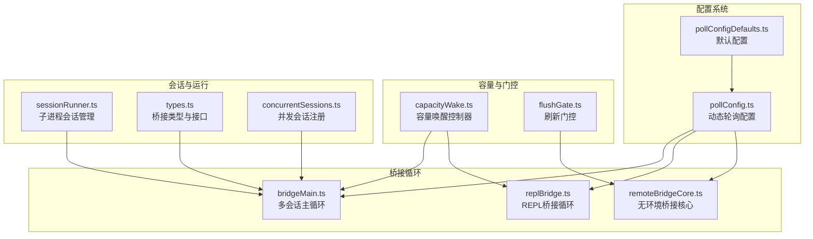
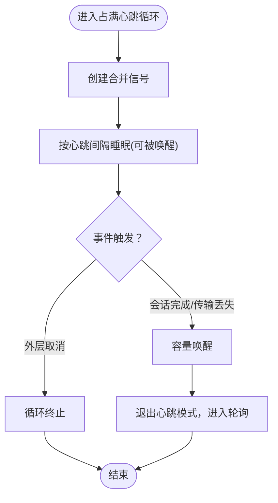
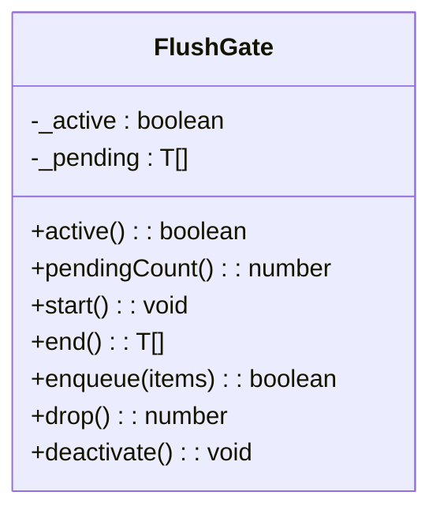
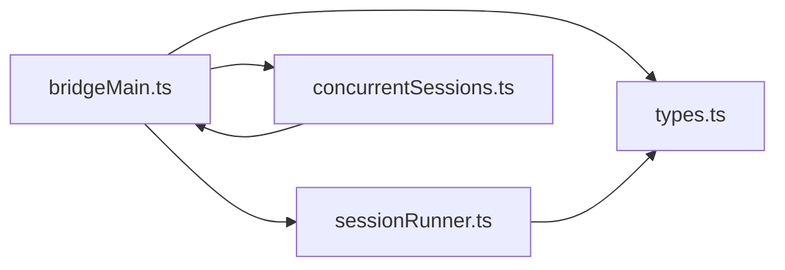
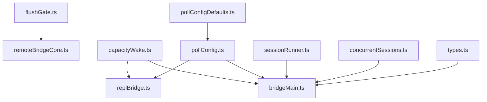

# 容量管理

<cite>
**本文引用的文件**
- [capacityWake.ts](file://bridge/capacityWake.ts)
- [flushGate.ts](file://bridge/flushGate.ts)
- [pollConfig.ts](file://bridge/pollConfig.ts)
- [pollConfigDefaults.ts](file://bridge/pollConfigDefaults.ts)
- [bridgeMain.ts](file://bridge/bridgeMain.ts)
- [replBridge.ts](file://bridge/replBridge.ts)
- [remoteBridgeCore.ts](file://bridge/remoteBridgeCore.ts)
- [sessionRunner.ts](file://bridge/sessionRunner.ts)
- [types.ts](file://bridge/types.ts)
- [concurrentSessions.ts](file://utils/concurrentSessions.ts)
- [stats.tsx](file://context/stats.tsx)
- [timeBasedMCConfig.ts](file://services/compact/timeBasedMCConfig.ts)
</cite>

## 目录
1. [简介](#简介)
2. [项目结构](#项目结构)
3. [核心组件](#核心组件)
4. [架构总览](#架构总览)
5. [详细组件分析](#详细组件分析)
6. [依赖分析](#依赖分析)
7. [性能考量](#性能考量)
8. [故障排查指南](#故障排查指南)
9. [结论](#结论)
10. [附录](#附录)

## 简介
本文件面向“远程桥接的容量管理系统”，聚焦以下目标：
- 深入解释容量唤醒机制的工作原理与触发条件
- 详述轮询配置系统（默认与自定义）的设计与生效路径
- 说明刷新门控机制如何控制资源分配与负载均衡
- 解释容量管理与会话管理的协同关系
- 提供容量监控指标与性能调优建议
- 给出容量瓶颈的诊断与解决方案
- 展示不同负载场景下的容量管理策略

## 项目结构
该系统围绕“桥接循环”展开，主要由三部分组成：
- 轮询配置系统：通过 GrowthBook 动态下发配置，经校验后在桥接循环中生效
- 容量唤醒机制：在“满载/占满”状态下，通过可中断的睡眠实现快速恢复
- 刷新门控机制：在初始历史消息刷新期间，确保新消息排队，避免乱序



图表来源
- [bridgeMain.ts](file://bridge/bridgeMain.ts)
- [replBridge.ts](file://bridge/replBridge.ts)
- [remoteBridgeCore.ts](file://bridge/remoteBridgeCore.ts)
- [pollConfig.ts](file://bridge/pollConfig.ts)
- [pollConfigDefaults.ts](file://bridge/pollConfigDefaults.ts)
- [capacityWake.ts](file://bridge/capacityWake.ts)
- [flushGate.ts](file://bridge/flushGate.ts)
- [sessionRunner.ts](file://bridge/sessionRunner.ts)
- [types.ts](file://bridge/types.ts)
- [concurrentSessions.ts](file://utils/concurrentSessions.ts)

章节来源
- [bridgeMain.ts](file://bridge/bridgeMain.ts)
- [replBridge.ts](file://bridge/replBridge.ts)
- [remoteBridgeCore.ts](file://bridge/remoteBridgeCore.ts)
- [pollConfig.ts](file://bridge/pollConfig.ts)
- [pollConfigDefaults.ts](file://bridge/pollConfigDefaults.ts)
- [capacityWake.ts](file://bridge/capacityWake.ts)
- [flushGate.ts](file://bridge/flushGate.ts)
- [sessionRunner.ts](file://bridge/sessionRunner.ts)
- [types.ts](file://bridge/types.ts)
- [concurrentSessions.ts](file://utils/concurrentSessions.ts)

## 核心组件
- 容量唤醒控制器：封装“外层循环信号 + 容量唤醒信号”的合并，支持在占满时被外部事件提前唤醒
- 刷新门控：在初始历史消息刷新阶段，将新消息入队，待刷新完成后统一出队发送，保证顺序一致性
- 轮询配置系统：从 GrowthBook 获取配置，Zod 校验，拒绝部分或错误配置，回退到默认值；支持单会话与多会话差异化间隔
- 多会话桥接循环：根据当前活跃会话数量与最大容量，选择合适的轮询/心跳策略，占满时以心跳为主进行“占满存活”
- REPL 与无环境桥接：REPL 使用独立的轮询与心跳配置，无环境桥接直接连接会话入口，使用刷新门控与传输重建机制

章节来源
- [capacityWake.ts](file://bridge/capacityWake.ts)
- [flushGate.ts](file://bridge/flushGate.ts)
- [pollConfig.ts](file://bridge/pollConfig.ts)
- [pollConfigDefaults.ts](file://bridge/pollConfigDefaults.ts)
- [bridgeMain.ts](file://bridge/bridgeMain.ts)
- [replBridge.ts](file://bridge/replBridge.ts)
- [remoteBridgeCore.ts](file://bridge/remoteBridgeCore.ts)

## 架构总览
容量管理贯穿“配置—循环—门控—会话”的全链路：
- 配置层：GrowthBook 下发轮询与心跳参数，Zod 强约束，确保至少启用一种占满存活机制
- 循环层：桥接循环在占满时进入“心跳模式”，心跳周期可被容量唤醒打断；非占满时按配置轮询
- 门控层：初始刷新阶段开启门控，新消息排队；刷新完成后出队发送，避免与历史消息交错
- 会话层：多会话模式下，活跃会话数决定轮询间隔；并发会话注册用于状态观测与统计

```mermaid
sequenceDiagram
participant Loop as "桥接循环"
participant Config as "轮询配置"
participant Wake as "容量唤醒"
participant Gate as "刷新门控"
participant API as "会话/工作项"
Loop->>Config : 读取轮询/心跳配置
alt 占满(活跃会话数>=maxSessions)
Loop->>Wake : 创建合并信号
Loop->>API : 心跳活跃工作项
API-->>Loop : 心跳结果(ok/auth_failed/fatal)
opt auth_failed/fatal
Loop->>Loop : 延迟(占满间隔或心跳间隔)
end
else 未占满
Loop->>API : 轮询获取工作
API-->>Loop : 工作/空轮询
end
note over Gate,Loop : 初始刷新期间 Gate 开启，新消息入队
Gate-->>Loop : 刷新结束，出队发送
```

图表来源
- [bridgeMain.ts](file://bridge/bridgeMain.ts)
- [replBridge.ts](file://bridge/replBridge.ts)
- [remoteBridgeCore.ts](file://bridge/remoteBridgeCore.ts)
- [pollConfig.ts](file://bridge/pollConfig.ts)
- [flushGate.ts](file://bridge/flushGate.ts)
- [capacityWake.ts](file://bridge/capacityWake.ts)

## 详细组件分析

### 容量唤醒机制
- 设计目标：在“占满”状态下，既能维持心跳存活，又能在“会话完成/传输丢失”等事件发生时立即中断睡眠、重新检查工作
- 关键点：
  - 合并信号：将“外层循环信号”与“容量唤醒信号”合并，任一触发即返回
  - 可中断睡眠：占满时的心跳循环使用合并信号睡眠，收到唤醒后立即退出心跳模式，进入轮询
  - 清理回调：睡眠前注册清理函数，避免监听器泄漏
- 触发条件：
  - 会话完成（导致活跃会话数下降）
  - 传输丢失/断开（容量释放）
  - 外层循环主动取消（如关闭）



图表来源
- [capacityWake.ts](file://bridge/capacityWake.ts)
- [bridgeMain.ts](file://bridge/bridgeMain.ts)
- [replBridge.ts](file://bridge/replBridge.ts)

章节来源
- [capacityWake.ts](file://bridge/capacityWake.ts)
- [bridgeMain.ts](file://bridge/bridgeMain.ts)
- [replBridge.ts](file://bridge/replBridge.ts)

### 轮询配置系统
- 默认配置：定义“未占满/占满/多会话”等默认轮询间隔、心跳间隔、回收窗口、保活间隔等
- 自定义配置：
  - 从 GrowthBook 获取 JSON，Zod 校验
  - 强约束：至少启用一种占满存活机制（心跳或 at-capacity 轮询）
  - 多会话字段具备默认值，兼容旧配置
  - 5 分钟缓存刷新窗口，避免频繁拉取
- 生效路径：桥接循环每轮读取最新配置，心跳/轮询均受其影响


图表来源
- [pollConfig.ts](file://bridge/pollConfig.ts)
- [pollConfigDefaults.ts](file://bridge/pollConfigDefaults.ts)
- [bridgeMain.ts](file://bridge/bridgeMain.ts)
- [replBridge.ts](file://bridge/replBridge.ts)

章节来源
- [pollConfig.ts](file://bridge/pollConfig.ts)
- [pollConfigDefaults.ts](file://bridge/pollConfigDefaults.ts)
- [bridgeMain.ts](file://bridge/bridgeMain.ts)
- [replBridge.ts](file://bridge/replBridge.ts)

### 刷新门控机制
- 目标：在初始历史消息刷新期间，防止新消息与历史消息交错到达服务器
- 生命周期：
  - start()：标记刷新进行中，enqueue 返回 true，开始入队
  - end()：停止刷新，返回所有待发送消息并清空队列
  - drop()：永久关闭，丢弃队列中的消息
  - deactivate()：仅清除激活标志，不丢弃消息（传输替换时由新传输接管出队）
- 与桥接的关系：无环境桥接在握手阶段开启门控，刷新完成后统一出队发送



图表来源
- [flushGate.ts](file://bridge/flushGate.ts)
- [remoteBridgeCore.ts](file://bridge/remoteBridgeCore.ts)

章节来源
- [flushGate.ts](file://bridge/flushGate.ts)
- [remoteBridgeCore.ts](file://bridge/remoteBridgeCore.ts)

### 容量管理与会话管理的协调
- 多会话容量：
  - 活跃会话数达到 maxSessions 即视为占满，进入心跳模式
  - 心跳周期可被容量唤醒打断，以便快速响应会话完成
  - 非占满时按“未占满/部分占满/占满”差异化轮询间隔
- 并发会话注册：
  - 记录 PID 文件，便于 ps/状态显示
  - 更新会话活动状态，支持“忙碌/空闲/等待”等状态上报
- 子进程会话管理：
  - 通过 spawn 启动子进程，解析 stdout 的 NDJSON，提取活动与权限请求
  - 支持 SIGTERM/SIGKILL，以及令牌更新（stdin 注入）



图表来源
- [bridgeMain.ts](file://bridge/bridgeMain.ts)
- [sessionRunner.ts](file://bridge/sessionRunner.ts)
- [concurrentSessions.ts](file://utils/concurrentSessions.ts)
- [types.ts](file://bridge/types.ts)

章节来源
- [bridgeMain.ts](file://bridge/bridgeMain.ts)
- [sessionRunner.ts](file://bridge/sessionRunner.ts)
- [concurrentSessions.ts](file://utils/concurrentSessions.ts)
- [types.ts](file://bridge/types.ts)

### 不同负载场景下的容量管理策略
- 低负载（活跃会话数 < maxSessions）：
  - 使用“未占满”轮询间隔，尽快发现新工作
- 部分占满（活跃会话数接近 maxSessions）：
  - 优先心跳存活，同时按“部分占满”轮询间隔进行探测
  - 若心跳失败或致命错误，按占满间隔延迟，避免紧循环
- 占满（活跃会话数 = maxSessions）：
  - 仅心跳存活，心跳间隔可被容量唤醒打断
  - 若 at-capacity 轮询启用，则按 at-capacity 间隔进行慢速轮询作为存活信号
- 无环境桥接（REPL v2）：
  - 初始刷新阶段开启门控，刷新完成后统一出队发送
  - 传输重建时同样使用门控，避免消息乱序与丢失

章节来源
- [bridgeMain.ts](file://bridge/bridgeMain.ts)
- [replBridge.ts](file://bridge/replBridge.ts)
- [remoteBridgeCore.ts](file://bridge/remoteBridgeCore.ts)

## 依赖分析
- 配置依赖：轮询配置依赖 GrowthBook 与 Zod 校验，确保安全与一致性
- 循环依赖：桥接循环依赖容量唤醒与轮询配置；REPL 与无环境桥接各自维护独立的循环与门控
- 会话依赖：多会话模式依赖会话管理与并发会话注册；子进程会话管理负责生命周期与活动上报



图表来源
- [pollConfig.ts](file://bridge/pollConfig.ts)
- [pollConfigDefaults.ts](file://bridge/pollConfigDefaults.ts)
- [bridgeMain.ts](file://bridge/bridgeMain.ts)
- [replBridge.ts](file://bridge/replBridge.ts)
- [capacityWake.ts](file://bridge/capacityWake.ts)
- [flushGate.ts](file://bridge/flushGate.ts)
- [remoteBridgeCore.ts](file://bridge/remoteBridgeCore.ts)
- [sessionRunner.ts](file://bridge/sessionRunner.ts)
- [concurrentSessions.ts](file://utils/concurrentSessions.ts)
- [types.ts](file://bridge/types.ts)

章节来源
- [pollConfig.ts](file://bridge/pollConfig.ts)
- [pollConfigDefaults.ts](file://bridge/pollConfigDefaults.ts)
- [bridgeMain.ts](file://bridge/bridgeMain.ts)
- [replBridge.ts](file://bridge/replBridge.ts)
- [capacityWake.ts](file://bridge/capacityWake.ts)
- [flushGate.ts](file://bridge/flushGate.ts)
- [remoteBridgeCore.ts](file://bridge/remoteBridgeCore.ts)
- [sessionRunner.ts](file://bridge/sessionRunner.ts)
- [concurrentSessions.ts](file://utils/concurrentSessions.ts)
- [types.ts](file://bridge/types.ts)

## 性能考量
- 轮询与心跳的平衡：占满时以心跳为主，避免频繁轮询带来的服务器压力；心跳间隔应留有服务器 TTL 的安全余量
- 门控与顺序一致性：初始刷新阶段严格排队，避免历史与实时消息交错，减少服务端重放与乱序处理成本
- 缓存与回退：轮询配置采用 5 分钟缓存窗口，Zod 校验失败回退默认配置，降低异常配置对系统的影响
- 并发与资源：多会话模式下，活跃会话数直接影响轮询/心跳频率；合理设置 maxSessions，避免过度竞争
- 传输重建与消息丢失防护：传输重建期间开启门控，确保消息在新传输建立后有序发送，避免静默丢失

## 故障排查指南
- 占满心跳循环紧循环：
  - 现象：心跳连续失败或致命错误后仍高频轮询
  - 排查：确认 at-capacity 轮询是否启用；检查心跳间隔与占满间隔配置；观察容量唤醒是否及时触发
  - 参考路径：[bridgeMain.ts](file://bridge/bridgeMain.ts)
- 初始刷新消息乱序或丢失：
  - 现象：历史消息与实时消息交错，或刷新后消息未送达
  - 排查：确认刷新门控是否正确开启/结束；检查刷新完成后是否执行了 drain
  - 参考路径：[remoteBridgeCore.ts](file://bridge/remoteBridgeCore.ts)，[flushGate.ts](file://bridge/flushGate.ts)
- 轮询配置异常：
  - 现象：配置对象部分字段非法或全部字段缺失
  - 排查：检查 GrowthBook 返回值；确认 Zod 校验是否通过；验证至少启用一种占满存活机制
  - 参考路径：[pollConfig.ts](file://bridge/pollConfig.ts)
- 会话并发统计异常：
  - 现象：ps 显示的并发会话数不准确
  - 排查：检查 PID 文件写入与清理；确认进程存活检测逻辑；避免 WSL 平台误删
  - 参考路径：[concurrentSessions.ts](file://utils/concurrentSessions.ts)

章节来源
- [bridgeMain.ts](file://bridge/bridgeMain.ts)
- [remoteBridgeCore.ts](file://bridge/remoteBridgeCore.ts)
- [flushGate.ts](file://bridge/flushGate.ts)
- [pollConfig.ts](file://bridge/pollConfig.ts)
- [concurrentSessions.ts](file://utils/concurrentSessions.ts)

## 结论
容量管理系统通过“轮询配置 + 容量唤醒 + 刷新门控”的组合，在多会话与 REPL 场景下实现了高效、可控且可诊断的资源调度。占满时的心跳模式与可中断睡眠确保了在高负载下的稳定与快速恢复；门控机制保障了消息顺序与一致性；并发会话注册提供了可观测性与运维支持。结合监控指标与调优建议，可在不同负载场景下取得更优的吞吐与稳定性。

## 附录
- 监控指标建议：
  - 心跳循环退出原因（认证失败/致命错误/关闭/容量变化/到期/禁用）
  - 心跳周期数与活跃会话数
  - 占满时延（心跳失败后的延迟时长）
  - 刷新门控队列长度与刷新耗时
  - 并发会话数与状态分布
- 性能调优建议：
  - 在占满场景适当增大 at-capacity 轮询间隔，减少服务器压力
  - 保持心跳间隔小于服务器 TTL，确保存活信号有效
  - 合理设置 maxSessions，避免过度竞争
  - 对于 REPL v2，确保刷新门控在握手阶段正确开启与关闭

章节来源
- [bridgeMain.ts](file://bridge/bridgeMain.ts)
- [remoteBridgeCore.ts](file://bridge/remoteBridgeCore.ts)
- [stats.tsx](file://context/stats.tsx)
- [timeBasedMCConfig.ts](file://services/compact/timeBasedMCConfig.ts)