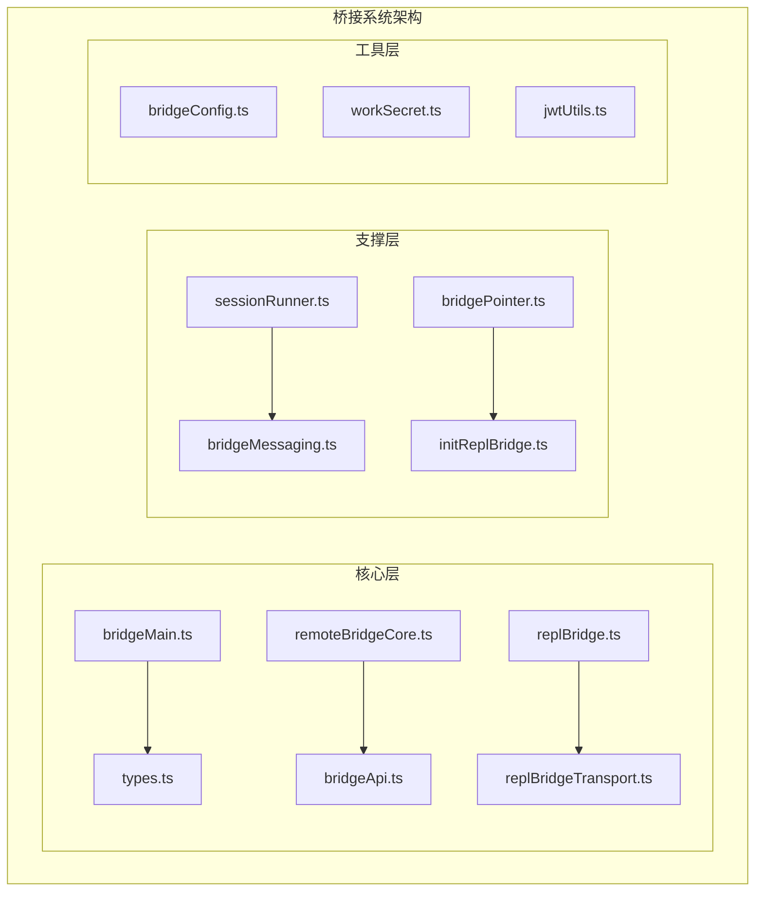
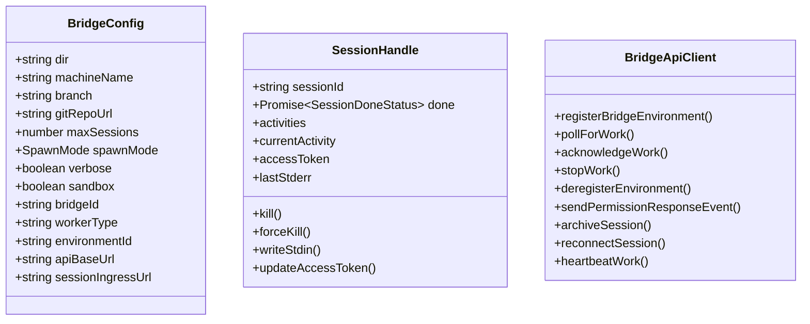
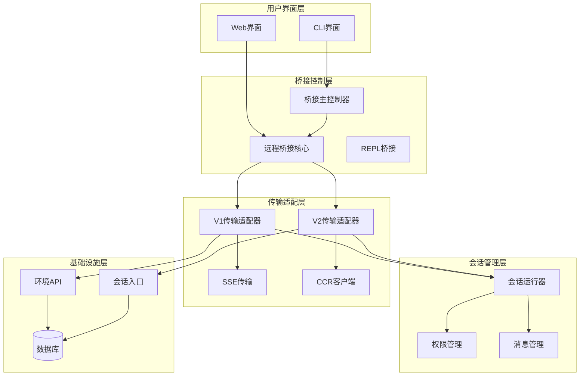
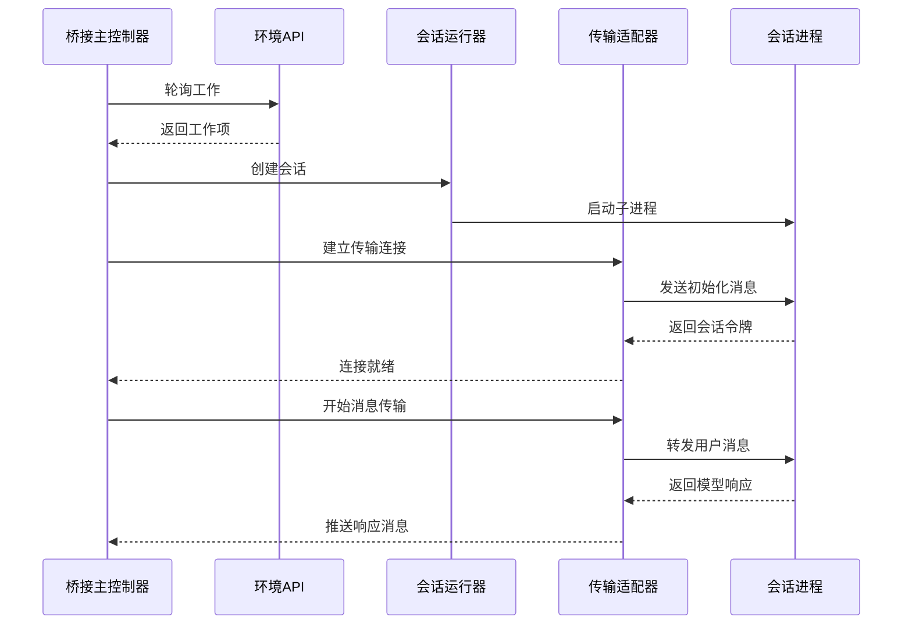
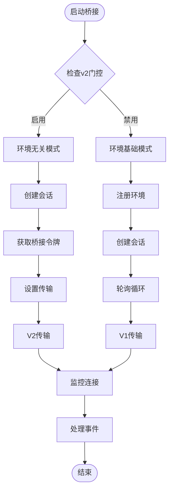
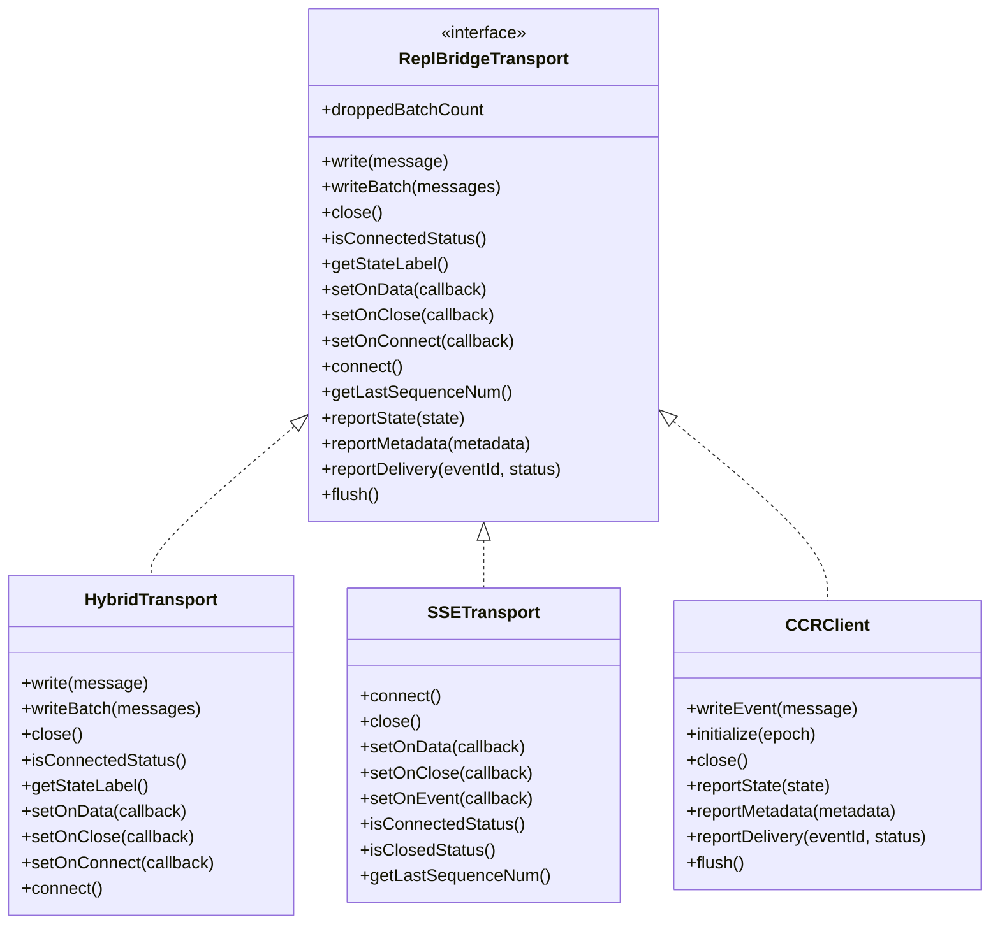
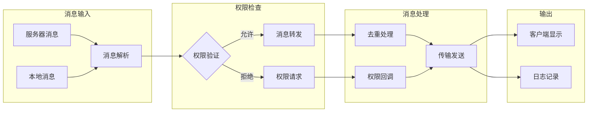
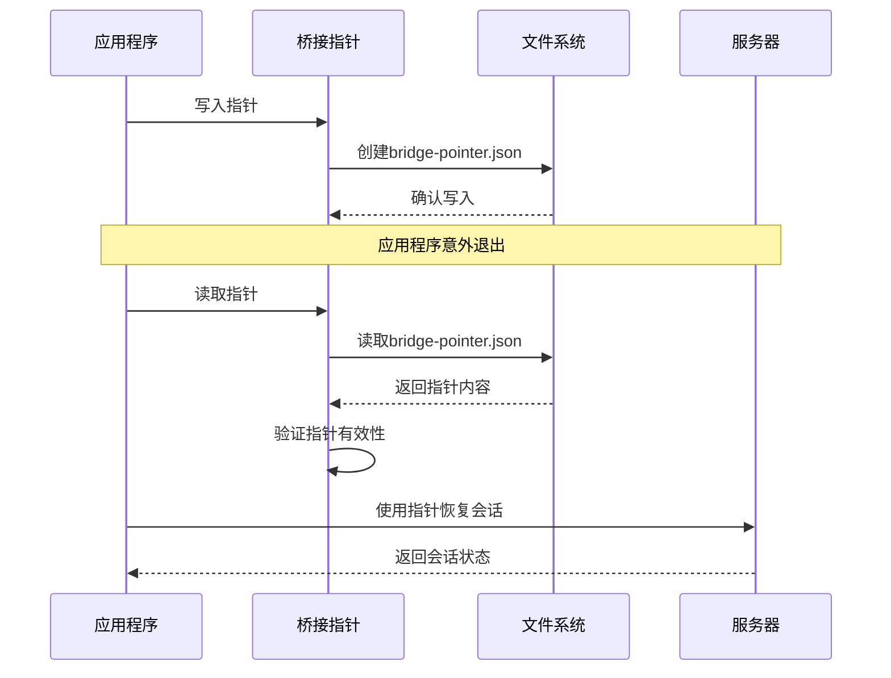
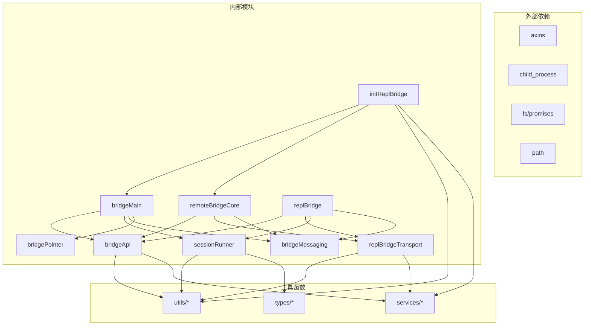

# 桥接架构设计

<cite>
**本文档引用的文件**
- [bridgeMain.ts](file://bridge/bridgeMain.ts)
- [types.ts](file://bridge/types.ts)
- [remoteBridgeCore.ts](file://bridge/remoteBridgeCore.ts)
- [bridgePointer.ts](file://bridge/bridgePointer.ts)
- [replBridge.ts](file://bridge/replBridge.ts)
- [replBridgeTransport.ts](file://bridge/replBridgeTransport.ts)
- [bridgeApi.ts](file://bridge/bridgeApi.ts)
- [sessionRunner.ts](file://bridge/sessionRunner.ts)
- [bridgeMessaging.ts](file://bridge/bridgeMessaging.ts)
- [initReplBridge.ts](file://bridge/initReplBridge.ts)
</cite>

## 目录
1. [引言](#引言)
2. [项目结构](#项目结构)
3. [核心组件](#核心组件)
4. [架构概览](#架构概览)
5. [详细组件分析](#详细组件分析)
6. [依赖关系分析](#依赖关系分析)
7. [性能考量](#性能考量)
8. [故障排除指南](#故障排除指南)
9. [结论](#结论)

## 引言

远程桥接系统是一个复杂的分布式架构，负责在本地开发环境与远程Claude AI服务之间建立稳定的通信通道。该系统采用模块化设计，支持多种传输协议和工作模式，能够处理会话生命周期管理、权限控制、消息路由等核心功能。

系统的核心设计理念是"环境无关"（env-less）和"会话无关"（session-less），通过抽象层隔离不同版本的桥接协议，实现了向后兼容性和向前扩展性。这种设计使得系统能够在不中断现有连接的情况下升级到新的传输协议版本。

## 项目结构

桥接系统主要位于`bridge/`目录下，采用分层架构设计：

**图表来源**
- [bridgeMain.ts:1-800](file://bridge/bridgeMain.ts#L1-L800)
- [types.ts:1-263](file://bridge/types.ts#L1-L263)
- [remoteBridgeCore.ts:1-800](file://bridge/remoteBridgeCore.ts#L1-L800)

**章节来源**
- [bridgeMain.ts:1-800](file://bridge/bridgeMain.ts#L1-L800)
- [types.ts:1-263](file://bridge/types.ts#L1-L263)

## 核心组件

### 桥接主控制器

桥接主控制器是整个系统的核心协调者，负责管理多个会话实例、处理工作分配和状态同步。其主要职责包括：

- **工作轮询管理**：通过环境API轮询待处理的工作项
- **会话生命周期管理**：创建、监控和清理会话实例
- **资源调度**：根据容量限制动态调整并发会话数量
- **错误恢复**：处理网络中断、认证失败等异常情况

### 远程桥接核心模块

远程桥接核心模块提供了两种不同的工作模式：

1. **环境基础模式（v1）**：使用Environments API进行工作调度
2. **环境无关模式（v2）**：直接连接会话入口，绕过环境调度层

### 类型定义系统

系统采用强类型设计，通过接口定义确保各组件间的契约一致性：

**图表来源**
- [types.ts:81-176](file://bridge/types.ts#L81-L176)

**章节来源**
- [types.ts:18-176](file://bridge/types.ts#L18-L176)

## 架构概览

桥接系统采用分层架构，每层都有明确的职责边界：

**图表来源**
- [bridgeMain.ts:141-800](file://bridge/bridgeMain.ts#L141-L800)
- [replBridge.ts:260-800](file://bridge/replBridge.ts#L260-L800)
- [remoteBridgeCore.ts:140-800](file://bridge/remoteBridgeCore.ts#L140-L800)

## 详细组件分析

### 桥接主控制器设计原理

桥接主控制器采用了事件驱动的架构模式，通过异步轮询机制处理工作分配：

**图表来源**
- [bridgeMain.ts:600-800](file://bridge/bridgeMain.ts#L600-L800)
- [sessionRunner.ts:248-551](file://bridge/sessionRunner.ts#L248-L551)

### 远程桥接核心模块实现机制

远程桥接核心模块提供了灵活的传输协议选择机制：

**图表来源**
- [remoteBridgeCore.ts:140-800](file://bridge/remoteBridgeCore.ts#L140-L800)
- [initReplBridge.ts:410-570](file://bridge/initReplBridge.ts#L410-L570)

### 传输适配器架构

传输适配器层提供了统一的接口抽象，支持多种传输协议：

**图表来源**
- [replBridgeTransport.ts:23-70](file://bridge/replBridgeTransport.ts#L23-L70)
- [replBridgeTransport.ts:119-371](file://bridge/replBridgeTransport.ts#L119-L371)

**章节来源**
- [replBridgeTransport.ts:1-371](file://bridge/replBridgeTransport.ts#L1-L371)

### 消息路由和权限管理

消息管理系统实现了复杂的消息路由和权限控制机制：

**图表来源**
- [bridgeMessaging.ts:132-208](file://bridge/bridgeMessaging.ts#L132-L208)
- [bridgeMessaging.ts:243-391](file://bridge/bridgeMessaging.ts#L243-L391)

**章节来源**
- [bridgeMessaging.ts:1-462](file://bridge/bridgeMessaging.ts#L1-L462)

### 桥接指针的作用和实现

桥接指针是系统崩溃恢复的关键组件：

**图表来源**
- [bridgePointer.ts:62-113](file://bridge/bridgePointer.ts#L62-L113)
- [bridgePointer.ts:129-183](file://bridge/bridgePointer.ts#L129-L183)

**章节来源**
- [bridgePointer.ts:1-211](file://bridge/bridgePointer.ts#L1-L211)

## 依赖关系分析

桥接系统的依赖关系呈现清晰的层次结构：

**图表来源**
- [bridgeMain.ts:1-800](file://bridge/bridgeMain.ts#L1-L800)
- [replBridge.ts:1-800](file://bridge/replBridge.ts#L1-L800)
- [remoteBridgeCore.ts:1-800](file://bridge/remoteBridgeCore.ts#L1-L800)

**章节来源**
- [bridgeApi.ts:1-540](file://bridge/bridgeApi.ts#L1-L540)
- [sessionRunner.ts:1-551](file://bridge/sessionRunner.ts#L1-L551)

## 性能考量

桥接系统在设计时充分考虑了性能优化：

### 并发控制
- 最大会话数限制：通过`maxSessions`参数控制并发连接数量
- 容量唤醒机制：当会话结束时自动唤醒等待的连接
- 背压处理：在高负载情况下优雅降级

### 缓存策略
- OAuth令牌缓存：避免频繁的认证请求
- 工作项缓存：减少重复的API调用
- 消息去重缓存：防止重复消息的处理

### 错误恢复
- 指数退避算法：在网络失败时自动重试
- 连接池管理：复用已建立的连接
- 故障转移：在主连接失败时自动切换到备用连接

## 故障排除指南

### 常见问题诊断

**认证失败**
- 检查OAuth令牌的有效性
- 验证组织权限配置
- 确认信任设备令牌设置

**连接超时**
- 检查网络连通性
- 验证API端点可达性
- 检查防火墙设置

**会话崩溃**
- 查看桥接指针文件
- 检查会话日志
- 验证系统资源使用情况

### 调试工具

系统提供了丰富的调试功能：

- 详细的日志记录
- 性能指标监控
- 错误堆栈跟踪
- 状态可视化

**章节来源**
- [bridgeApi.ts:454-540](file://bridge/bridgeApi.ts#L454-L540)
- [sessionRunner.ts:348-551](file://bridge/sessionRunner.ts#L348-L551)

## 结论

远程桥接系统通过精心设计的架构实现了高可用性、可扩展性和易维护性。系统的核心优势包括：

1. **模块化设计**：清晰的职责分离使得各组件可以独立开发和测试
2. **协议抽象**：统一的接口抽象支持多种传输协议的无缝切换
3. **容错机制**：完善的错误处理和恢复机制确保系统的稳定性
4. **性能优化**：多层缓存和并发控制保证了高效的资源利用

该架构为未来的功能扩展奠定了坚实的基础，能够适应不断变化的需求和技术发展。