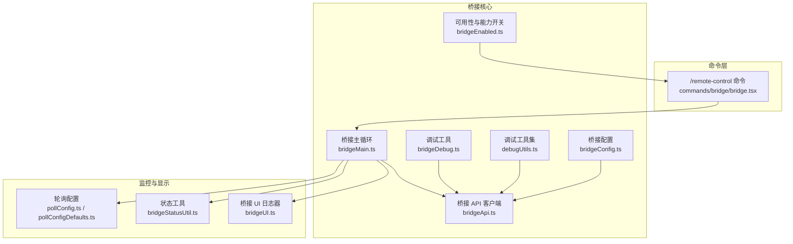
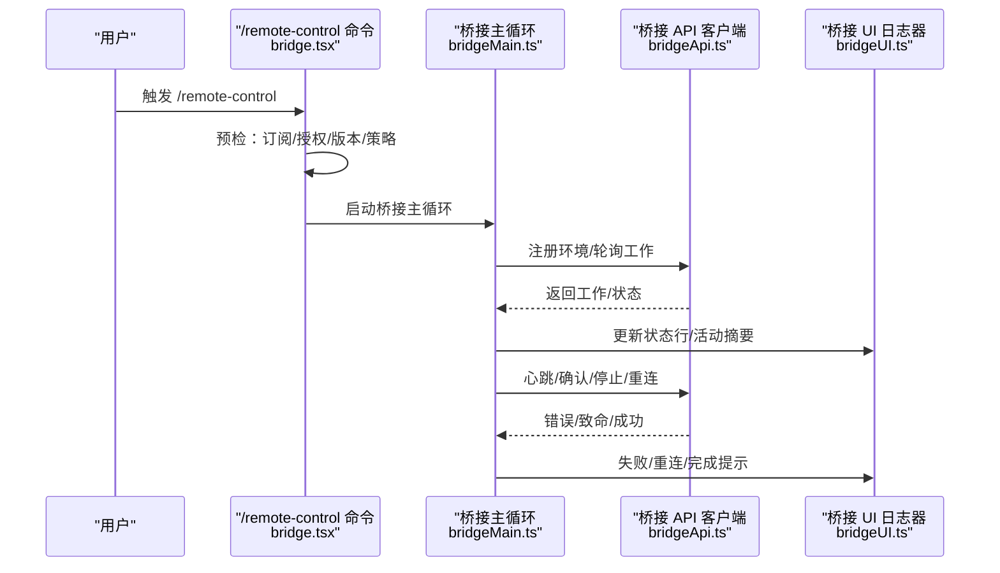
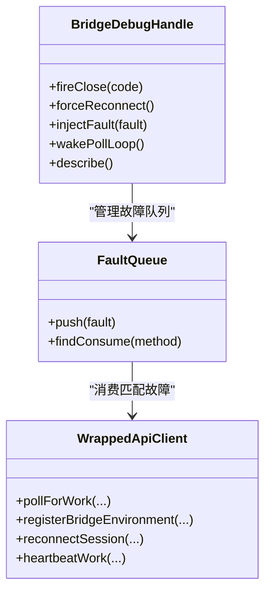
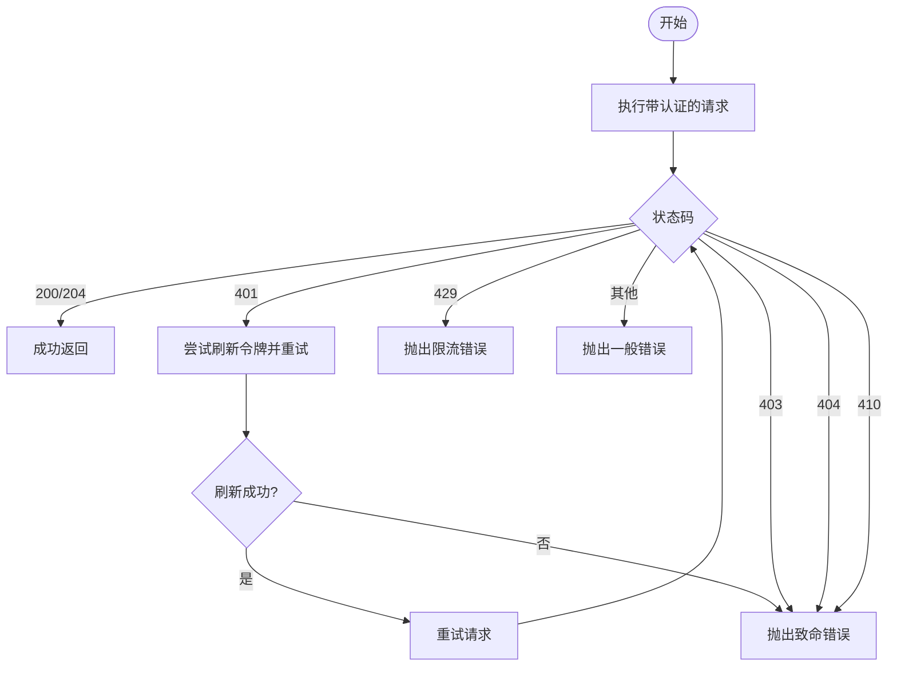
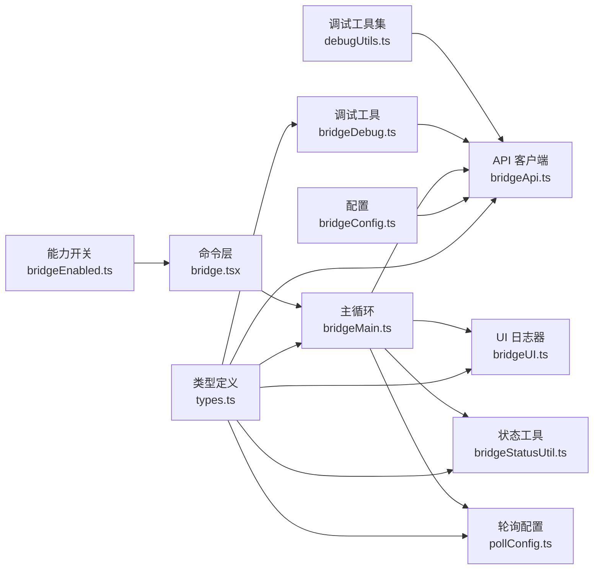

# 桥接调试与监控

<cite>
**本文档引用的文件**
- [bridgeDebug.ts](file://bridge/bridgeDebug.ts)
- [bridgeStatusUtil.ts](file://bridge/bridgeStatusUtil.ts)
- [bridgeUI.ts](file://bridge/bridgeUI.ts)
- [debugUtils.ts](file://bridge/debugUtils.ts)
- [types.ts](file://bridge/types.ts)
- [bridgeApi.ts](file://bridge/bridgeApi.ts)
- [bridgeMain.ts](file://bridge/bridgeMain.ts)
- [bridge.tsx](file://commands/bridge/bridge.tsx)
- [bridgeConfig.ts](file://bridge/bridgeConfig.ts)
- [bridgeEnabled.ts](file://bridge/bridgeEnabled.ts)
- [pollConfig.ts](file://bridge/pollConfig.ts)
- [pollConfigDefaults.ts](file://bridge/pollConfigDefaults.ts)
</cite>

## 目录
1. [简介](#简介)
2. [项目结构](#项目结构)
3. [核心组件](#核心组件)
4. [架构总览](#架构总览)
5. [详细组件分析](#详细组件分析)
6. [依赖关系分析](#依赖关系分析)
7. [性能考虑](#性能考虑)
8. [故障排查指南](#故障排查指南)
9. [结论](#结论)
10. [附录](#附录)

## 简介
本文件面向远程桥接系统的调试与监控，围绕以下目标展开：  
- 解释桥接调试工具的使用方法与调试信息收集机制  
- 详述调试工具函数的实现与应用场景  
- 说明桥接状态工具的监控指标与告警机制  
- 解释桥接 UI 组件如何提供可视化监控与控制界面  
- 提供桥接系统的性能监控与诊断方法  
- 给出常见问题的调试流程与解决方案  
- 展示桥接系统的日志记录与错误追踪机制  
- 强调调试过程中的安全注意事项  

## 项目结构
桥接系统由“桥接 API 客户端”“桥接主循环”“桥接 UI 日志器”“调试工具与状态工具”“配置与能力开关”等模块组成。命令层通过 `/remote-control` 命令触发桥接连接，桥接主循环负责轮询、心跳、会话生命周期管理，并通过 UI 实时反馈状态。

**图表来源**
- [bridge.tsx:1-509](file://commands/bridge/bridge.tsx#L1-L509)
- [bridgeApi.ts:1-540](file://bridge/bridgeApi.ts#L1-L540)
- [bridgeMain.ts:1-800](file://bridge/bridgeMain.ts#L1-L800)
- [bridgeDebug.ts:1-136](file://bridge/bridgeDebug.ts#L1-L136)
- [debugUtils.ts:1-142](file://bridge/debugUtils.ts#L1-L142)
- [bridgeUI.ts:1-531](file://bridge/bridgeUI.ts#L1-L531)
- [bridgeStatusUtil.ts:1-164](file://bridge/bridgeStatusUtil.ts#L1-L164)
- [pollConfig.ts:1-111](file://bridge/pollConfig.ts#L1-L111)
- [pollConfigDefaults.ts:1-83](file://bridge/pollConfigDefaults.ts#L1-L83)

**章节来源**
- [bridge.tsx:1-509](file://commands/bridge/bridge.tsx#L1-L509)
- [bridgeApi.ts:1-540](file://bridge/bridgeApi.ts#L1-L540)
- [bridgeMain.ts:1-800](file://bridge/bridgeMain.ts#L1-L800)
- [bridgeDebug.ts:1-136](file://bridge/bridgeDebug.ts#L1-L136)
- [debugUtils.ts:1-142](file://bridge/debugUtils.ts#L1-L142)
- [bridgeUI.ts:1-531](file://bridge/bridgeUI.ts#L1-L531)
- [bridgeStatusUtil.ts:1-164](file://bridge/bridgeStatusUtil.ts#L1-L164)
- [pollConfig.ts:1-111](file://bridge/pollConfig.ts#L1-L111)
- [pollConfigDefaults.ts:1-83](file://bridge/pollConfigDefaults.ts#L1-L83)

## 核心组件
- 调试工具（bridgeDebug.ts）：提供注入式故障注入、强制重连、唤醒轮询等调试能力，仅在特定用户类型下启用，避免对生产环境产生开销。  
- 调试工具集（debugUtils.ts）：提供敏感信息脱敏、消息截断、错误描述提取、HTTP 状态提取、跳过初始化事件记录等辅助能力。  
- 桥接 API 客户端（bridgeApi.ts）：封装环境注册、轮询、确认、停止、注销、权限响应、归档、重连、心跳等接口，并统一处理 401/403/404/410/429 等错误，区分致命与可恢复错误。  
- 桥接主循环（bridgeMain.ts）：驱动桥接生命周期，包括轮询、心跳、会话管理、容量唤醒、超时与中断处理、日志与诊断事件上报等。  
- 桥接 UI 日志器（bridgeUI.ts）：提供终端内实时状态显示、QR 码生成、状态行渲染、会话列表与活动摘要、失败/重连提示等。  
- 状态工具（bridgeStatusUtil.ts）：定义状态机、时间戳格式化、URL 构建、闪烁动画片段计算、状态标签与颜色映射等。  
- 配置与能力开关（bridgeConfig.ts、bridgeEnabled.ts）：集中解析桥接访问令牌与基础地址，检查订阅与授权、版本门槛、特性开关等。  
- 轮询配置（pollConfig.ts、pollConfigDefaults.ts）：通过 GrowthBook 动态下发轮询间隔、容量模式下的心跳/轮询策略、回收窗口等参数。

**章节来源**
- [bridgeDebug.ts:1-136](file://bridge/bridgeDebug.ts#L1-L136)
- [debugUtils.ts:1-142](file://bridge/debugUtils.ts#L1-L142)
- [bridgeApi.ts:1-540](file://bridge/bridgeApi.ts#L1-L540)
- [bridgeMain.ts:1-800](file://bridge/bridgeMain.ts#L1-L800)
- [bridgeUI.ts:1-531](file://bridge/bridgeUI.ts#L1-L531)
- [bridgeStatusUtil.ts:1-164](file://bridge/bridgeStatusUtil.ts#L1-L164)
- [bridgeConfig.ts:1-49](file://bridge/bridgeConfig.ts#L1-L49)
- [bridgeEnabled.ts:1-203](file://bridge/bridgeEnabled.ts#L1-L203)
- [pollConfig.ts:1-111](file://bridge/pollConfig.ts#L1-L111)
- [pollConfigDefaults.ts:1-83](file://bridge/pollConfigDefaults.ts#L1-L83)

## 架构总览
桥接系统采用“命令触发—主循环调度—API 交互—UI 反馈”的分层架构。命令层负责入口与前置校验；主循环负责业务编排与容错；API 层负责与后端交互并统一错误语义；UI 层负责终端内的可视化与交互；调试与状态工具贯穿各层以支持可观测性与诊断。

**图表来源**
- [bridge.tsx:1-509](file://commands/bridge/bridge.tsx#L1-L509)
- [bridgeMain.ts:1-800](file://bridge/bridgeMain.ts#L1-L800)
- [bridgeApi.ts:1-540](file://bridge/bridgeApi.ts#L1-L540)
- [bridgeUI.ts:1-531](file://bridge/bridgeUI.ts#L1-L531)

**章节来源**
- [bridge.tsx:1-509](file://commands/bridge/bridge.tsx#L1-L509)
- [bridgeMain.ts:1-800](file://bridge/bridgeMain.ts#L1-L800)
- [bridgeApi.ts:1-540](file://bridge/bridgeApi.ts#L1-L540)
- [bridgeUI.ts:1-531](file://bridge/bridgeUI.ts#L1-L531)

## 详细组件分析

### 调试工具与故障注入（bridgeDebug.ts）
- 故障注入：通过队列记录一次性故障，包装 API 客户端在指定方法调用前抛出致命或瞬时错误，用于测试恢复路径。  
- 调试句柄：提供强制关闭、强制重连、注入故障、唤醒轮询、描述信息等能力，便于 REPL 中手动触发与观测。  
- 使用场景：Ant 用户在 REPL 中使用 `/bridge-kick` 子命令进行故障注入与恢复演练，结合 debug.log 追踪恢复行为。

**图表来源**
- [bridgeDebug.ts:1-136](file://bridge/bridgeDebug.ts#L1-L136)

**章节来源**
- [bridgeDebug.ts:1-136](file://bridge/bridgeDebug.ts#L1-L136)

### 调试工具集（debugUtils.ts）
- 敏感信息脱敏：识别并脱敏 token、secret 等字段，保护隐私数据。  
- 消息截断：限制调试输出长度，避免日志膨胀。  
- 错误描述与状态提取：从 axios 错误中提取人类可读消息与 HTTP 状态码，便于诊断。  
- 跳过初始化事件记录：集中记录“桥接初始化被跳过”的事件，便于统计与分析。

**章节来源**
- [debugUtils.ts:1-142](file://bridge/debugUtils.ts#L1-L142)

### 桥接 API 客户端（bridgeApi.ts）
- 接口封装：注册环境、轮询工作、确认工作、停止工作、注销环境、发送权限响应、归档会话、重连会话、心跳工作。  
- 认证与重试：统一携带认证头与版本头，支持 401 自动刷新与单次重试。  
- 错误语义：将 401/403/404/410/429 映射为致命错误或普通错误，便于上层区分处理。  
- 调试日志：对关键请求/响应进行结构化日志记录，包含请求体与响应体摘要。

**图表来源**
- [bridgeApi.ts:1-540](file://bridge/bridgeApi.ts#L1-L540)

**章节来源**
- [bridgeApi.ts:1-540](file://bridge/bridgeApi.ts#L1-L540)

### 桥接主循环（bridgeMain.ts）
- 生命周期：注册环境、轮询工作、确认与心跳、会话管理、容量唤醒、超时与中断处理、日志与诊断事件上报。  
- 容量模式：在满载时切换心跳/轮询策略，避免紧循环；支持按配置周期性轮询与心跳组合。  
- 会话管理：跟踪活跃会话、工作项、会话令牌、工作树清理、标题缓存、超时看门狗等。  
- 诊断与日志：记录桥接启动、轮询、重连、会话完成/失败、心跳错误等事件；输出诊断日志。

**章节来源**
- [bridgeMain.ts:1-800](file://bridge/bridgeMain.ts#L1-L800)

### 桥接 UI 日志器（bridgeUI.ts）
- 实时状态：连接中/就绪/连接中/失败/会话活动等状态行渲染，支持 QR 码显示与隐藏。  
- 会话列表：多会话模式下显示每个会话的标题、URL、活动摘要；单会话模式下在状态行显示标题。  
- 交互提示：根据模式显示“容量/新建会话”提示、切换 spawn 模式提示、QR 切换提示等。  
- 渲染优化：计算视觉行数、清屏重绘、闪烁动画片段、链接包装等，保证终端显示效果。

**章节来源**
- [bridgeUI.ts:1-531](file://bridge/bridgeUI.ts#L1-L531)

### 状态工具（bridgeStatusUtil.ts）
- 状态机：idle/attached/titled/reconnecting/failed 等状态与标签、颜色映射。  
- 时间与宽度：时间戳格式化、文本截断、宽度计算、多字节字符处理。  
- URL 构建：连接 URL 与会话 URL 的构建逻辑。  
- 动画：闪烁动画片段计算，支持反向扫描与视觉列分割。

**章节来源**
- [bridgeStatusUtil.ts:1-164](file://bridge/bridgeStatusUtil.ts#L1-L164)

### 配置与能力开关（bridgeConfig.ts、bridgeEnabled.ts）
- 访问令牌与基础地址：优先使用开发覆盖变量，否则回退到 OAuth 存储与配置。  
- 订阅与授权：检查是否为 claude.ai 订阅者、是否具备 profile scope、组织 UUID 是否存在、特性开关是否开启。  
- 版本门槛：检查当前 CLI 版本是否满足最低要求。  
- 特性开关：v2（无环境）桥接路径、镜像模式、自动连接默认值等。

**章节来源**
- [bridgeConfig.ts:1-49](file://bridge/bridgeConfig.ts#L1-L49)
- [bridgeEnabled.ts:1-203](file://bridge/bridgeEnabled.ts#L1-L203)

### 轮询配置（pollConfig.ts、pollConfigDefaults.ts）
- 动态配置：通过 GrowthBook 下发轮询间隔、容量模式心跳/轮询策略、回收窗口、保活间隔等。  
- 参数校验：严格的 Zod 校验，拒绝异常值，确保 at-capacity 模式至少启用心跳或轮询其一。  
- 默认值：提供稳定的默认配置，兼容旧版配置字段。

**章节来源**
- [pollConfig.ts:1-111](file://bridge/pollConfig.ts#L1-L111)
- [pollConfigDefaults.ts:1-83](file://bridge/pollConfigDefaults.ts#L1-L83)

## 依赖关系分析
- 命令层依赖能力开关与配置解析，决定是否允许桥接以及如何初始化。  
- 主循环依赖 API 客户端、UI 日志器、状态工具、轮询配置，形成闭环的可观测与自愈机制。  
- 调试工具与调试工具集作为横切关注点，贯穿 API 与主循环，提供可控的故障注入与诊断能力。  
- 类型定义（types.ts）为各模块提供统一的数据契约与接口约束。

**图表来源**
- [types.ts:1-263](file://bridge/types.ts#L1-L263)
- [bridge.tsx:1-509](file://commands/bridge/bridge.tsx#L1-L509)
- [bridgeEnabled.ts:1-203](file://bridge/bridgeEnabled.ts#L1-L203)
- [bridgeConfig.ts:1-49](file://bridge/bridgeConfig.ts#L1-L49)
- [bridgeApi.ts:1-540](file://bridge/bridgeApi.ts#L1-L540)
- [bridgeMain.ts:1-800](file://bridge/bridgeMain.ts#L1-L800)
- [bridgeUI.ts:1-531](file://bridge/bridgeUI.ts#L1-L531)
- [bridgeStatusUtil.ts:1-164](file://bridge/bridgeStatusUtil.ts#L1-L164)
- [pollConfig.ts:1-111](file://bridge/pollConfig.ts#L1-L111)
- [bridgeDebug.ts:1-136](file://bridge/bridgeDebug.ts#L1-L136)
- [debugUtils.ts:1-142](file://bridge/debugUtils.ts#L1-L142)

**章节来源**
- [types.ts:1-263](file://bridge/types.ts#L1-L263)
- [bridge.tsx:1-509](file://commands/bridge/bridge.tsx#L1-L509)
- [bridgeEnabled.ts:1-203](file://bridge/bridgeEnabled.ts#L1-L203)
- [bridgeConfig.ts:1-49](file://bridge/bridgeConfig.ts#L1-L49)
- [bridgeApi.ts:1-540](file://bridge/bridgeApi.ts#L1-L540)
- [bridgeMain.ts:1-800](file://bridge/bridgeMain.ts#L1-L800)
- [bridgeUI.ts:1-531](file://bridge/bridgeUI.ts#L1-L531)
- [bridgeStatusUtil.ts:1-164](file://bridge/bridgeStatusUtil.ts#L1-L164)
- [pollConfig.ts:1-111](file://bridge/pollConfig.ts#L1-L111)
- [bridgeDebug.ts:1-136](file://bridge/bridgeDebug.ts#L1-L136)
- [debugUtils.ts:1-142](file://bridge/debugUtils.ts#L1-L142)

## 性能考虑
- 轮询与心跳策略：通过轮询配置动态调整 at-capacity 模式的轮询与心跳频率，避免紧循环；同时设置合理的回收窗口与保活间隔，平衡延迟与资源占用。  
- 能力开关与版本门槛：通过特性开关与版本检查，确保在不支持的环境下不引入额外开销；在满足条件的环境中启用更高效的模式（如 v2）。  
- 日志与诊断：调试日志与诊断日志分离，避免在生产环境产生过多 I/O；UI 渲染按需更新，减少不必要的重绘。  
- 会话超时与中断：内置超时看门狗与中断处理，防止僵尸会话占用资源；完成后及时归档，保持前端状态整洁。

[本节为通用指导，无需具体文件分析]

## 故障排查指南
- 认证失败（401/403）  
  - 现象：出现“认证失败”类致命错误，可能伴随登录提示。  
  - 排查：确认已登录且具备 profile scope；检查 OAuth 令牌是否有效；查看是否为订阅用户。  
  - 处理：重新登录；若使用长期令牌，改用完整作用域令牌。  
  - 参考：[bridgeApi.ts:454-524](file://bridge/bridgeApi.ts#L454-L524)、[bridgeEnabled.ts:70-87](file://bridge/bridgeEnabled.ts#L70-L87)

- 环境不存在或已过期（404/410）  
  - 现象：出现“未找到/会话已过期”类致命错误。  
  - 排查：确认环境 ID 是否正确；检查环境是否已过期或被删除。  
  - 处理：重启桥接或重新注册环境；必要时联系管理员。  
  - 参考：[bridgeApi.ts:454-508](file://bridge/bridgeApi.ts#L454-L508)

- 限流（429）  
  - 现象：频繁轮询导致限流。  
  - 排查：检查轮询配置是否过于激进；确认是否启用了 at-capacity 模式。  
  - 处理：降低轮询频率；启用心跳模式；等待冷却后再试。  
  - 参考：[bridgeApi.ts:493-494](file://bridge/bridgeApi.ts#L493-L494)、[pollConfig.ts:74-91](file://bridge/pollConfig.ts#L74-L91)

- 会话失败  
  - 现象：会话退出码非零或超时。  
  - 排查：查看会话 stderr 摘要；确认是否被超时看门狗终止；检查磁盘空间与权限。  
  - 处理：修复会话内部错误；延长会话超时；清理临时目录。  
  - 参考：[bridgeMain.ts:494-517](file://bridge/bridgeMain.ts#L494-L517)

- UI 不显示或状态异常  
  - 现象：状态行不更新、QR 码不显示、标题不刷新。  
  - 排查：确认 UI 初始化顺序；检查 spawn 模式与会话数量；查看是否处于重连/失败状态。  
  - 处理：触发刷新显示；切换 QR 显示；在重连/失败状态下等待恢复。  
  - 参考：[bridgeUI.ts:376-528](file://bridge/bridgeUI.ts#L376-L528)

- 调试注入与恢复演练  
  - 现象：通过注入致命/瞬时错误验证恢复路径。  
  - 排查：确认用户类型为 ant；检查注入队列与故障计数；观察 debug.log 输出。  
  - 处理：使用强制重连与唤醒轮询；复现并记录恢复行为。  
  - 参考：[bridgeDebug.ts:70-135](file://bridge/bridgeDebug.ts#L70-L135)

**章节来源**
- [bridgeApi.ts:454-524](file://bridge/bridgeApi.ts#L454-L524)
- [bridgeEnabled.ts:70-87](file://bridge/bridgeEnabled.ts#L70-L87)
- [pollConfig.ts:74-91](file://bridge/pollConfig.ts#L74-L91)
- [bridgeMain.ts:494-517](file://bridge/bridgeMain.ts#L494-L517)
- [bridgeUI.ts:376-528](file://bridge/bridgeUI.ts#L376-L528)
- [bridgeDebug.ts:70-135](file://bridge/bridgeDebug.ts#L70-L135)

## 结论
桥接系统的调试与监控体系通过“命令层—主循环—API—UI—调试/状态工具—配置/轮询配置”的协同，实现了从入口校验、运行时可观测、到可视化反馈与自动化恢复的全链路闭环。借助调试工具与日志脱敏、错误语义化、动态轮询策略与 UI 实时反馈，开发者可以高效定位问题、验证恢复路径并持续优化性能与稳定性。

[本节为总结，无需具体文件分析]

## 附录

### 调试工具函数与应用场景
- 注入式故障注入：在 REPL 中快速触发致命/瞬时错误，验证恢复路径与日志输出。  
- 强制重连：模拟网络抖动后的环境重建，验证服务端重派与客户端重连逻辑。  
- 唤醒轮询：在满载场景下提前唤醒轮询，缩短新会话接入延迟。  
- 敏感信息脱敏与消息截断：保障调试日志的安全性与可读性。  
- 错误描述与状态提取：提升错误诊断效率，减少人工解读成本。  
- 事件记录：集中记录“桥接初始化被跳过”等关键事件，便于统计分析。

**章节来源**
- [bridgeDebug.ts:1-136](file://bridge/bridgeDebug.ts#L1-L136)
- [debugUtils.ts:1-142](file://bridge/debugUtils.ts#L1-L142)

### 监控指标与告警建议
- 连接状态：idle/attached/reconnecting/failed 的转换次数与时长分布。  
- 轮询与心跳：轮询成功率、平均延迟、心跳失败率、容量模式切换频率。  
- 会话指标：会话完成/失败/中断比例、平均时长、超时比例、stderr 摘要统计。  
- 错误分类：401/403/404/410/429 次数与占比，按方法与上下文聚合。  
- 诊断事件：重连事件、心跳模式进入/退出、会话完成事件等。  
- 建议：基于上述指标设置阈值告警，结合 debug.log 与 UI 状态进行根因分析。

**章节来源**
- [bridgeMain.ts:222-270](file://bridge/bridgeMain.ts#L222-L270)
- [bridgeApi.ts:454-524](file://bridge/bridgeApi.ts#L454-L524)
- [bridgeUI.ts:360-448](file://bridge/bridgeUI.ts#L360-L448)

### 日志记录与错误追踪机制
- 调试日志：结构化记录请求/响应摘要、错误详情、注入故障、重连事件等。  
- 诊断日志：无 PII 的诊断事件，用于审计与统计。  
- UI 日志：终端内实时状态与活动摘要，支持 QR 码与链接。  
- 错误追踪：统一的错误类型与描述提取，便于跨模块一致处理。

**章节来源**
- [bridgeApi.ts:68-196](file://bridge/bridgeApi.ts#L68-L196)
- [bridgeMain.ts:333-355](file://bridge/bridgeMain.ts#L333-L355)
- [bridgeUI.ts:346-365](file://bridge/bridgeUI.ts#L346-L365)
- [debugUtils.ts:55-121](file://bridge/debugUtils.ts#L55-L121)

### 安全注意事项
- 敏感信息脱敏：对 token、secret 等字段进行脱敏处理，避免泄露。  
- 仅在受控环境启用调试：ant 用户类型限定调试工具，避免外部构建产生副作用。  
- 严格参数校验：轮询配置的 Zod 校验防止异常值导致资源滥用。  
- 最小权限原则：认证头与可信设备令牌按需传递，避免过度授权。

**章节来源**
- [debugUtils.ts:26-53](file://bridge/debugUtils.ts#L26-L53)
- [bridgeDebug.ts:82-83](file://bridge/bridgeDebug.ts#L82-L83)
- [pollConfig.ts:28-92](file://bridge/pollConfig.ts#L28-L92)