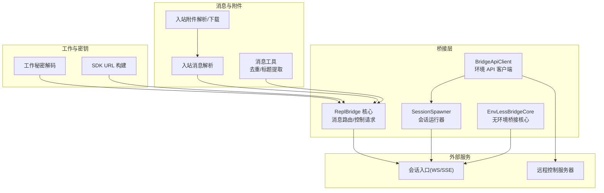
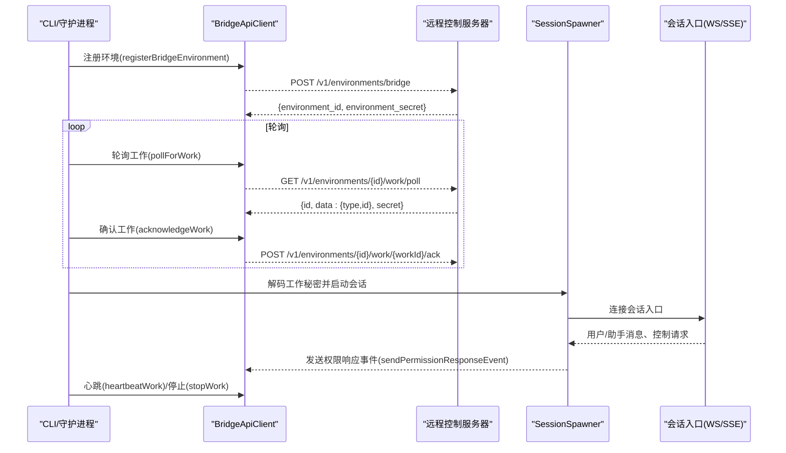
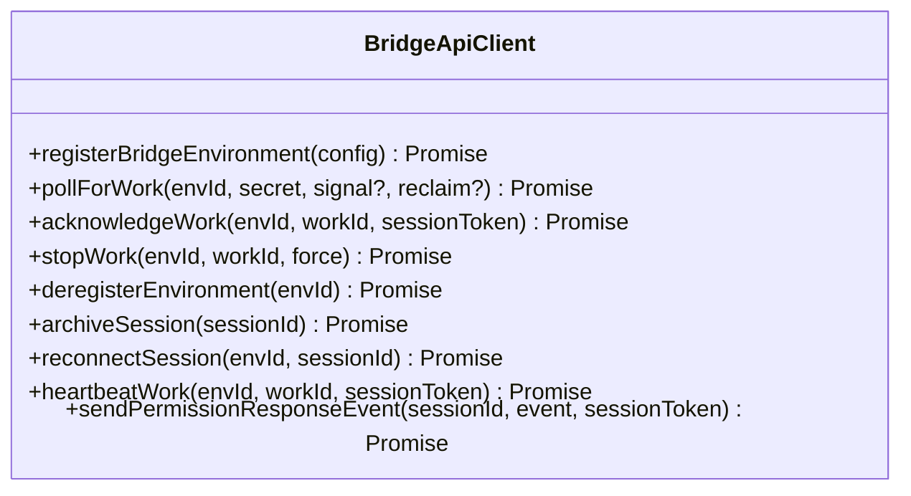
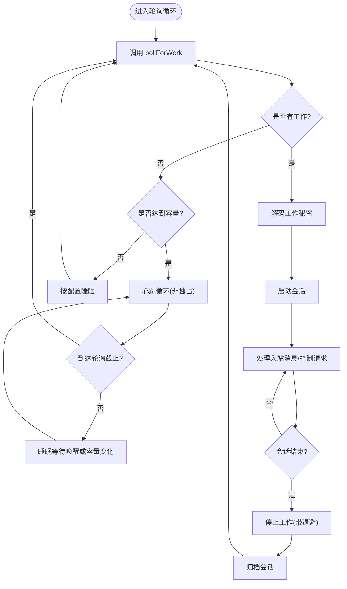
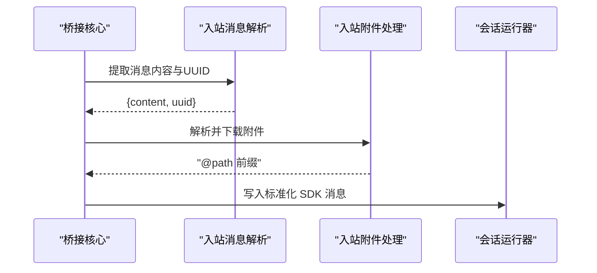
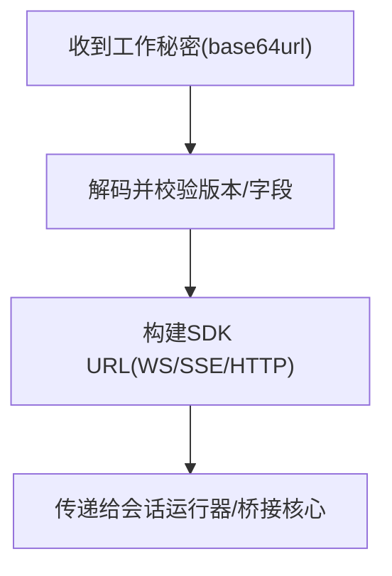
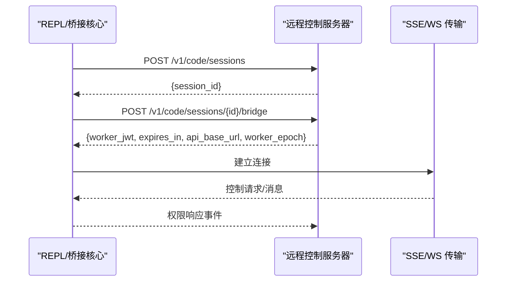
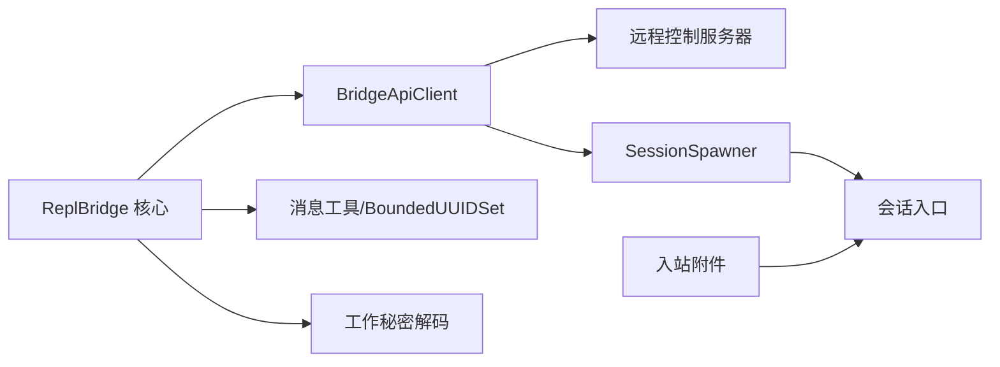

# 远程控制 API

<cite>
**本文引用的文件**
- [bridgeApi.ts](file://bridge/bridgeApi.ts)
- [bridgeMain.ts](file://bridge/bridgeMain.ts)
- [bridgeMessaging.ts](file://bridge/bridgeMessaging.ts)
- [inboundMessages.ts](file://bridge/inboundMessages.ts)
- [inboundAttachments.ts](file://bridge/inboundAttachments.ts)
- [types.ts](file://bridge/types.ts)
- [replBridge.ts](file://bridge/replBridge.ts)
- [remoteBridgeCore.ts](file://bridge/remoteBridgeCore.ts)
- [workSecret.ts](file://bridge/workSecret.ts)
- [debugUtils.ts](file://bridge/debugUtils.ts)
- [bridgeDebug.ts](file://bridge/bridgeDebug.ts)
- [sessionRunner.ts](file://bridge/sessionRunner.ts)
</cite>

## 目录
1. [简介](#简介)
2. [项目结构](#项目结构)
3. [核心组件](#核心组件)
4. [架构总览](#架构总览)
5. [详细组件分析](#详细组件分析)
6. [依赖关系分析](#依赖关系分析)
7. [性能考量](#性能考量)
8. [故障排查指南](#故障排查指南)
9. [结论](#结论)
10. [附录：API 参考与示例](#附录api-参考与示例)

## 简介
本文件面向“远程桥接的远程控制 API”，系统化阐述其设计架构、接口规范、消息处理机制与附件传输协议，解释工作项（work）的解析、执行与响应流程，以及错误处理与版本管理策略。文档同时给出端到端的调用序列图、数据流图与类图，帮助开发者快速理解并正确集成。

## 项目结构
远程控制 API 的实现主要集中在 bridge 子目录，围绕以下关键模块协同工作：
- 桥接客户端与环境 API：负责环境注册、轮询工作、心跳、停止工作、事件上报等。
- 会话运行器与桥接核心：负责工作项解码、会话生命周期管理、消息路由与去重、权限决策与控制请求处理。
- 入站消息与附件：负责从桥接输入中提取用户消息内容、规范化图像块、解析并下载附件。
- 工作密钥与 SDK URL 构建：负责工作秘密解码、SDK 地址生成、会话 ID 规范化。
- 调试与容错：提供敏感信息脱敏、错误细节提取、注入式故障注入以验证恢复路径。

图表来源
- [bridgeApi.ts:141-451](file://bridge/bridgeApi.ts#L141-L451)
- [bridgeMain.ts:141-800](file://bridge/bridgeMain.ts#L141-L800)
- [bridgeMessaging.ts:132-208](file://bridge/bridgeMessaging.ts#L132-L208)
- [inboundMessages.ts:21-40](file://bridge/inboundMessages.ts#L21-L40)
- [inboundAttachments.ts:123-176](file://bridge/inboundAttachments.ts#L123-L176)
- [workSecret.ts:6-32](file://bridge/workSecret.ts#L6-L32)

章节来源
- [bridgeApi.ts:68-451](file://bridge/bridgeApi.ts#L68-L451)
- [bridgeMain.ts:141-800](file://bridge/bridgeMain.ts#L141-L800)
- [bridgeMessaging.ts:132-391](file://bridge/bridgeMessaging.ts#L132-L391)
- [inboundMessages.ts:21-81](file://bridge/inboundMessages.ts#L21-L81)
- [inboundAttachments.ts:123-176](file://bridge/inboundAttachments.ts#L123-L176)
- [workSecret.ts:6-87](file://bridge/workSecret.ts#L6-L87)

## 核心组件
- 桥接客户端（BridgeApiClient）
  - 提供环境注册、轮询工作、确认工作、停止工作、反注册、会话归档、重连会话、心跳、发送权限响应事件等方法。
  - 统一的认证与重试逻辑，支持 OAuth 401 自动刷新与致命错误分类。
- 会话运行器（SessionSpawner）
  - 负责子进程会话的创建、活动追踪、权限请求转发、标准错误收集与超时管理。
- 桥接核心（ReplBridge/EnvLessBridge）
  - 负责入站消息解析、去重、控制请求处理、权限响应回传、标题推导、状态显示与生命周期管理。
- 入站消息与附件
  - 解析用户消息内容、规范化图像块、提取并下载附件，将本地路径前缀注入内容。
- 工作秘密与 SDK URL
  - 解码 base64url 编码的工作秘密，提取会话入口令牌与 API 基地址；构建 SDK WebSocket/SSE URL。

章节来源
- [types.ts:133-176](file://bridge/types.ts#L133-L176)
- [sessionRunner.ts:107-200](file://bridge/sessionRunner.ts#L107-L200)
- [bridgeMessaging.ts:132-391](file://bridge/bridgeMessaging.ts#L132-L391)
- [inboundMessages.ts:21-81](file://bridge/inboundMessages.ts#L21-L81)
- [inboundAttachments.ts:123-176](file://bridge/inboundAttachments.ts#L123-L176)
- [workSecret.ts:6-87](file://bridge/workSecret.ts#L6-L87)

## 架构总览
远程控制 API 的总体交互分为两类：
- 环境模式（Environments API）：通过环境注册、轮询工作、ACK/STOP/HEARTBEAT 等完成工作分发与生命周期管理。
- 无环境模式（直接会话入口）：通过会话创建与 /bridge 获取 worker 凭证，直接连接 SSE/WS，无需环境层。

图表来源
- [bridgeApi.ts:141-417](file://bridge/bridgeApi.ts#L141-L417)
- [bridgeMain.ts:606-800](file://bridge/bridgeMain.ts#L606-L800)
- [workSecret.ts:6-32](file://bridge/workSecret.ts#L6-L32)

## 详细组件分析

### 组件 A：桥接客户端（BridgeApiClient）
- 设计要点
  - 统一的请求头与版本头，支持 Runner 版本上报、可信设备令牌、Anthropic 特定头。
  - OAuth 401 自动刷新与单次重试策略，失败时抛出 BridgeFatalError。
  - 对 401/403/404/410 等状态进行语义化错误分类，区分可恢复与不可恢复。
- 关键方法
  - registerBridgeEnvironment：注册环境并返回环境凭据。
  - pollForWork：轮询工作项，空闲时记录连续空轮询日志。
  - acknowledgeWork/stopWork/heartbeatWork：工作生命周期管理。
  - sendPermissionResponseEvent：向会话发送权限响应事件。
  - archiveSession/reconnectSession/deregisterEnvironment：会话与环境生命周期收尾。

图表来源
- [types.ts:133-176](file://bridge/types.ts#L133-L176)
- [bridgeApi.ts:141-451](file://bridge/bridgeApi.ts#L141-L451)

章节来源
- [bridgeApi.ts:68-139](file://bridge/bridgeApi.ts#L68-L139)
- [bridgeApi.ts:454-540](file://bridge/bridgeApi.ts#L454-L540)
- [types.ts:133-176](file://bridge/types.ts#L133-L176)

### 组件 B：桥接主循环（runBridgeLoop）
- 设计要点
  - 维护活跃会话映射、开始时间、工作项 ID、兼容会话 ID、入口 JWT、定时器与清理任务集合。
  - 支持多会话容量唤醒、心跳模式、睡眠检测阈值、错误预算与指数退避。
  - 在会话结束时自动归档、停止工作、移除临时工作树。
- 关键流程
  - 轮询工作 → 解码工作秘密 → 启动会话 → 处理入站消息/控制请求 → 权限决策 → 结束会话 → 归档/停止工作。

图表来源
- [bridgeMain.ts:600-784](file://bridge/bridgeMain.ts#L600-L784)
- [bridgeMain.ts:524-591](file://bridge/bridgeMain.ts#L524-L591)

章节来源
- [bridgeMain.ts:141-800](file://bridge/bridgeMain.ts#L141-L800)

### 组件 C：入站消息与附件处理
- 入站消息解析
  - 提取用户消息内容与 UUID，支持字符串与内容块数组；规范化图像块字段以适配不同客户端。
- 附件解析与下载
  - 从消息中提取 file_attachments，下载到本地缓存目录，生成 @path 引用并前置到内容末尾文本块。
- 消息去重与标题提取
  - 使用有界 UUID 集合过滤回显与重复消息；从用户消息中提取标题文本用于会话命名。

图表来源
- [bridgeMessaging.ts:132-208](file://bridge/bridgeMessaging.ts#L132-L208)
- [inboundMessages.ts:21-81](file://bridge/inboundMessages.ts#L21-L81)
- [inboundAttachments.ts:123-176](file://bridge/inboundAttachments.ts#L123-L176)

章节来源
- [bridgeMessaging.ts:132-391](file://bridge/bridgeMessaging.ts#L132-L391)
- [inboundMessages.ts:21-81](file://bridge/inboundMessages.ts#L21-L81)
- [inboundAttachments.ts:123-176](file://bridge/inboundAttachments.ts#L123-L176)

### 组件 D：工作秘密与 SDK URL
- 工作秘密解码
  - base64url 解码并校验版本号与必需字段，确保会话入口令牌与 API 基地址存在。
- SDK URL 构建
  - 根据 API 基地址与会话 ID 构建 WebSocket 或 HTTP(S) URL，区分本地与生产环境路径。
- 会话 ID 规范化
  - 比较不同标签前缀下的会话 ID，保证兼容层一致性。

图表来源
- [workSecret.ts:6-32](file://bridge/workSecret.ts#L6-L32)
- [workSecret.ts:41-87](file://bridge/workSecret.ts#L41-L87)

章节来源
- [workSecret.ts:6-87](file://bridge/workSecret.ts#L6-L87)

### 组件 E：远程控制无环境桥接核心（EnvLessBridge）
- 设计要点
  - 直接创建会话并通过 /bridge 获取 worker 凭证，无需环境层；支持主动刷新与 401 恢复重建传输。
  - 适用于 REPL 场景，不依赖 Environments API 的轮询与派发。
- 关键步骤
  - 创建会话 → 获取 /bridge 凭证 → 建立 V2 传输 → 订阅权限响应/控制请求 → 维护生命周期。

图表来源
- [remoteBridgeCore.ts:140-200](file://bridge/remoteBridgeCore.ts#L140-L200)
- [remoteBridgeCore.ts:188-200](file://bridge/remoteBridgeCore.ts#L188-L200)

章节来源
- [remoteBridgeCore.ts:140-200](file://bridge/remoteBridgeCore.ts#L140-L200)

## 依赖关系分析
- 组件耦合
  - BridgeApiClient 与远程服务器交互，向上暴露统一接口；runBridgeLoop 依赖其进行工作项生命周期管理。
  - 桥接核心依赖消息工具（去重、标题提取）、工作秘密解码与 SDK URL 构建。
  - 会话运行器依赖子进程与活动追踪，向上提供会话句柄与权限请求回调。
- 外部依赖
  - HTTP 客户端（axios）用于 API 调用与附件下载。
  - WebSocket/SSE 传输用于实时消息与控制请求。
- 循环依赖
  - 模块间通过类型与接口解耦，未见循环导入。

图表来源
- [bridgeApi.ts:141-451](file://bridge/bridgeApi.ts#L141-L451)
- [bridgeMessaging.ts:429-461](file://bridge/bridgeMessaging.ts#L429-L461)
- [workSecret.ts:6-32](file://bridge/workSecret.ts#L6-L32)
- [inboundAttachments.ts:123-176](file://bridge/inboundAttachments.ts#L123-L176)

章节来源
- [bridgeApi.ts:141-451](file://bridge/bridgeApi.ts#L141-L451)
- [bridgeMessaging.ts:429-461](file://bridge/bridgeMessaging.ts#L429-L461)
- [workSecret.ts:6-32](file://bridge/workSecret.ts#L6-L32)
- [inboundAttachments.ts:123-176](file://bridge/inboundAttachments.ts#L123-L176)

## 性能考量
- 轮询节流与心跳
  - 空闲时采用多级睡眠间隔，避免过度轮询；在容量满载时启用非独占心跳模式，降低服务器压力。
- 退避与错误预算
  - 连接与一般错误分别维护退避参数，结合错误预算与睡眠检测阈值，避免紧循环。
- 附件下载
  - 采用最佳努力策略：网络/鉴权/磁盘失败仅记录调试日志并跳过该附件，不影响消息投递。
- 日志与脱敏
  - 敏感字段脱敏与长度截断，避免泄露凭证与冗长日志影响性能。

[本节为通用指导，无需特定文件引用]

## 故障排查指南
- 常见错误与处理
  - 401/403：认证失败或权限不足，触发 BridgeFatalError；若可刷新则自动重试一次。
  - 404/410：环境或会话已过期，需重新启动远程控制。
  - 429：速率限制，建议降低轮询频率。
- 错误细节提取
  - 通过错误详情提取函数从响应体中读取人类可读消息，便于诊断。
- 注入式故障测试
  - 在内部构建中可通过 /bridge-kick 注入致命或瞬时故障，验证恢复路径。
- 调试日志
  - 使用脱敏与截断工具输出请求/响应摘要，定位问题而不泄露敏感信息。

章节来源
- [bridgeApi.ts:454-540](file://bridge/bridgeApi.ts#L454-L540)
- [debugUtils.ts:106-121](file://bridge/debugUtils.ts#L106-L121)
- [bridgeDebug.ts:77-135](file://bridge/bridgeDebug.ts#L77-L135)

## 结论
远程控制 API 通过环境 API 与无环境两种路径，实现了稳定、可扩展的远程桥接能力。其设计强调：
- 明确的生命周期与错误分类；
- 严格的认证与重试策略；
- 实时消息与控制请求的可靠路由；
- 附件与图像内容的兼容性处理；
- 可观测性与可恢复性（心跳、重连、归档）。

这些特性共同保障了在复杂网络与多会话场景下的高可用与易用性。

[本节为总结，无需特定文件引用]

## 附录：API 参考与示例

### 接口规范与请求/响应模式
- 环境注册
  - 方法：POST /v1/environments/bridge
  - 请求体字段：machine_name、directory、branch、git_repo_url、max_sessions、metadata.worker_type、reuse_environment_id（可选）
  - 成功响应：environment_id、environment_secret
- 轮询工作
  - 方法：GET /v1/environments/{environment_id}/work/poll
  - 查询参数：reclaim_older_than_ms（可选）
  - 成功响应：WorkResponse（包含 id、data、secret、created_at）
- 确认工作
  - 方法：POST /v1/environments/{environment_id}/work/{work_id}/ack
- 停止工作
  - 方法：POST /v1/environments/{environment_id}/work/{work_id}/stop
  - 请求体：force（布尔）
- 心跳
  - 方法：POST /v1/environments/{environment_id}/work/{work_id}/heartbeat
  - 成功响应：lease_extended、state
- 事件上报（权限响应）
  - 方法：POST /v1/sessions/{session_id}/events
  - 请求体：events（数组，包含 control_response）

章节来源
- [bridgeApi.ts:141-417](file://bridge/bridgeApi.ts#L141-L417)
- [types.ts:23-51](file://bridge/types.ts#L23-L51)

### 错误处理机制
- 401：认证失败，尝试刷新后重试；失败则抛出 BridgeFatalError。
- 403：权限不足或会话过期，区分可抑制与不可抑制错误。
- 404/410：资源不存在或会话过期，抛出 BridgeFatalError。
- 429：速率限制，提示降低轮询频率。
- 其他：抛出通用错误，包含状态码与可选详情。

章节来源
- [bridgeApi.ts:454-500](file://bridge/bridgeApi.ts#L454-L500)
- [debugUtils.ts:106-121](file://bridge/debugUtils.ts#L106-L121)

### 远程控制命令解析、执行与响应流程
- 命令解析
  - 入站消息经桥接核心解析，过滤非用户消息与虚拟消息，保留用户/助手/本地命令。
  - 使用 BoundedUUIDSet 去重回显与重复消息。
- 执行
  - 会话运行器根据活动日志更新状态，权限请求通过桥接核心转发至服务器。
- 响应
  - 权限响应事件以 control_response 形式回传；会话结束时发送结果事件以便归档。

章节来源
- [bridgeMessaging.ts:132-391](file://bridge/bridgeMessaging.ts#L132-L391)
- [sessionRunner.ts:107-200](file://bridge/sessionRunner.ts#L107-L200)

### 附件传输协议
- 上传与引用
  - Web 端通过 Cookie 认证上传文件，随后在消息中携带 file_attachments（file_uuid、file_name）。
- 下载与写入
  - 桥接侧使用 OAuth 令牌拉取 /api/oauth/files/{uuid}/content，写入 ~/.claude/uploads/{sessionId}/，生成 @path 引用。
- 注入规则
  - 将 @path 前缀注入到内容块数组的最后一个文本块，若无文本块则追加一个。

章节来源
- [inboundAttachments.ts:123-176](file://bridge/inboundAttachments.ts#L123-L176)
- [inboundMessages.ts:21-81](file://bridge/inboundMessages.ts#L21-L81)

### API 版本管理与向后兼容
- 协议头
  - anthropic-version 与 anthropic-beta 用于版本协商与功能开关。
- 工作秘密版本
  - 严格校验版本号与必需字段，不匹配则拒绝处理。
- 会话 ID 兼容
  - 不同标签前缀下的会话 ID 比较基于 UUID 身份，保证兼容层一致性。
- 传输协议
  - 本地与生产环境使用不同的 SDK URL 版本路径，确保 Envoy 重写与直连的一致性。

章节来源
- [bridgeApi.ts:76-89](file://bridge/bridgeApi.ts#L76-L89)
- [workSecret.ts:6-32](file://bridge/workSecret.ts#L6-L32)
- [workSecret.ts:62-73](file://bridge/workSecret.ts#L62-L73)
- [workSecret.ts:41-48](file://bridge/workSecret.ts#L41-L48)

### 使用示例（步骤说明）
- 环境模式
  1) 注册环境并获取 environment_id 与 environment_secret。
  2) 轮询工作项，收到后解码工作秘密，启动会话。
  3) 处理入站消息与控制请求，必要时发送权限响应事件。
  4) 会话结束后停止工作并归档。
- 无环境模式（REPL）
  1) 创建会话并获取 session_id。
  2) 通过 /bridge 获取 worker_jwt、expires_in、api_base_url、worker_epoch。
  3) 建立 SSE/WS 传输，订阅消息与控制请求。
  4) 生命周期结束时发送结果事件并关闭连接。

章节来源
- [bridgeApi.ts:141-417](file://bridge/bridgeApi.ts#L141-L417)
- [remoteBridgeCore.ts:140-200](file://bridge/remoteBridgeCore.ts#L140-L200)