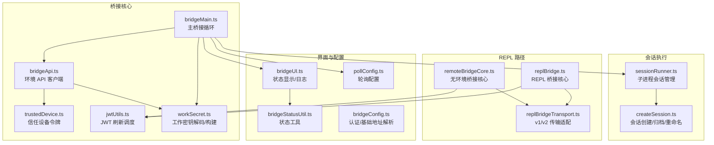
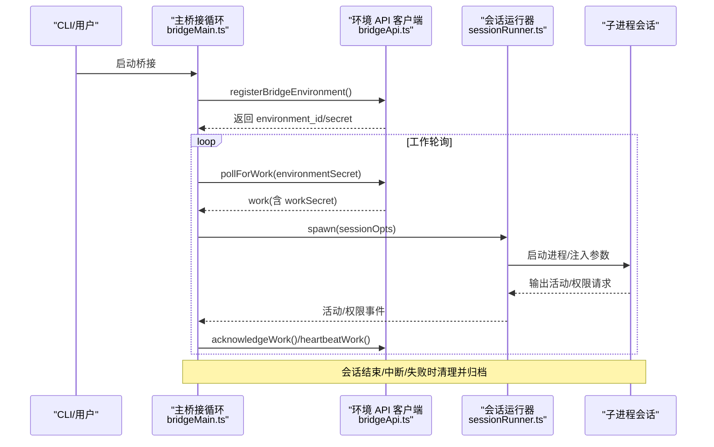
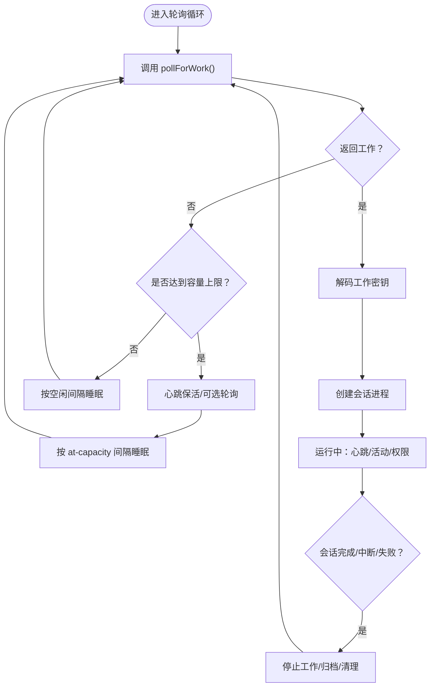
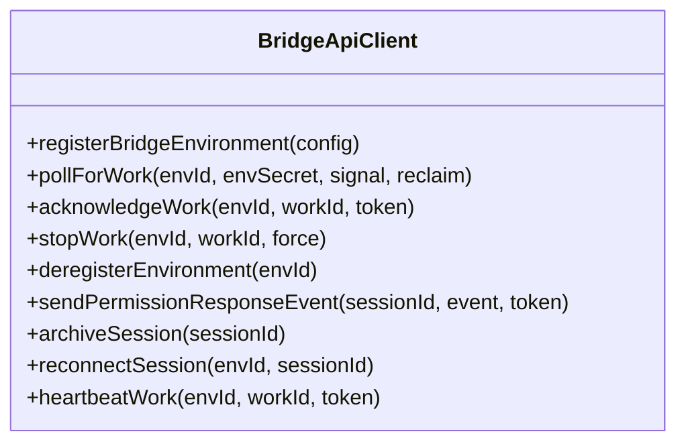
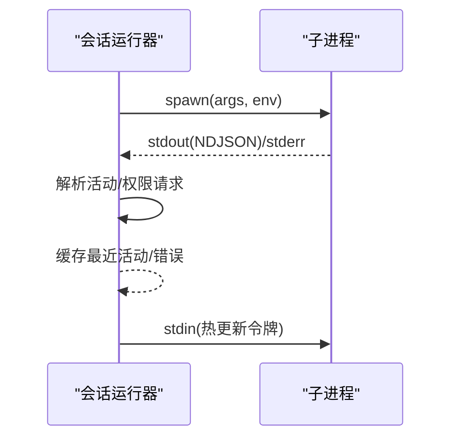
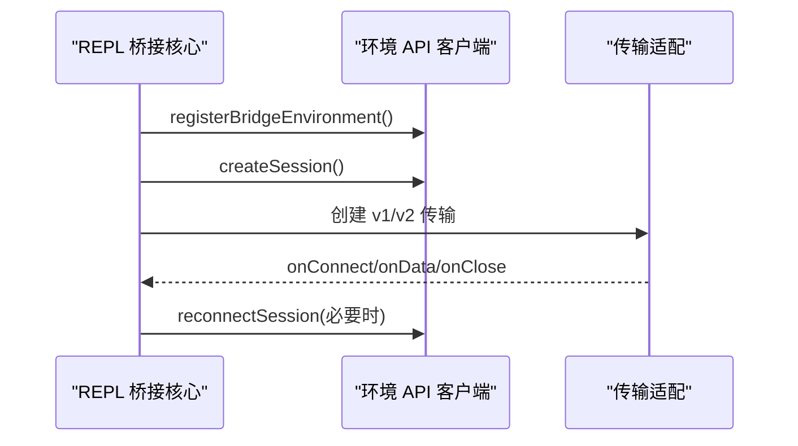
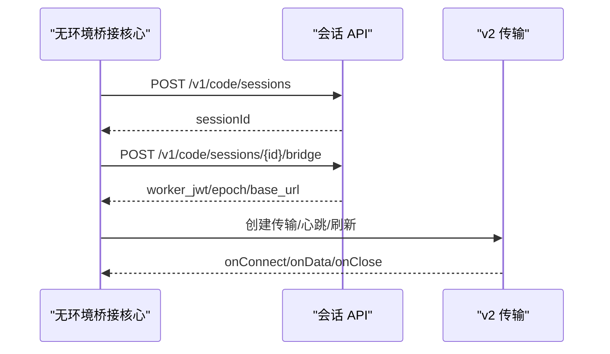
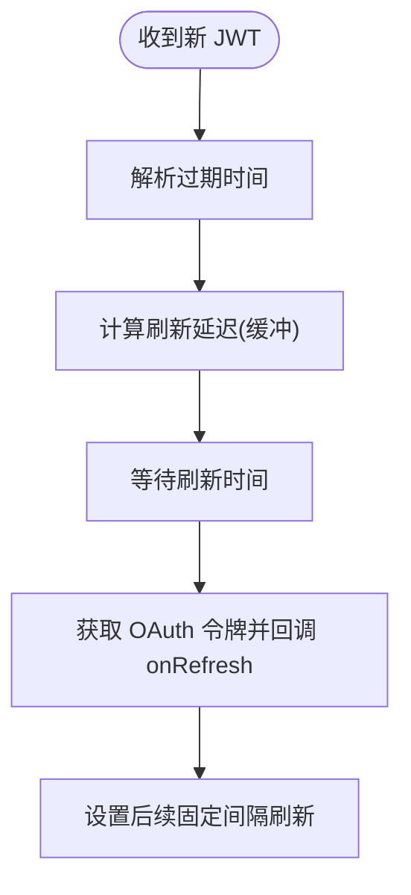
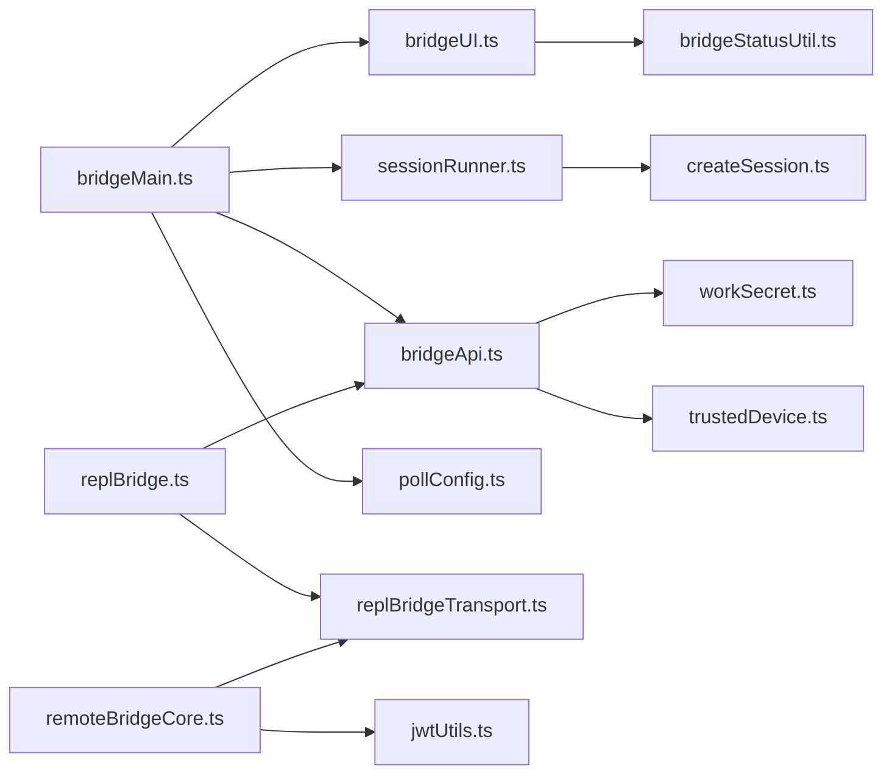

# 远程桥接系统

<cite>
**本文档引用的文件**
- [bridgeMain.ts](file://bridge/bridgeMain.ts)
- [bridgeApi.ts](file://bridge/bridgeApi.ts)
- [remoteBridgeCore.ts](file://bridge/remoteBridgeCore.ts)
- [jwtUtils.ts](file://bridge/jwtUtils.ts)
- [trustedDevice.ts](file://bridge/trustedDevice.ts)
- [types.ts](file://bridge/types.ts)
- [sessionRunner.ts](file://bridge/sessionRunner.ts)
- [createSession.ts](file://bridge/createSession.ts)
- [bridgeConfig.ts](file://bridge/bridgeConfig.ts)
- [pollConfig.ts](file://bridge/pollConfig.ts)
- [replBridge.ts](file://bridge/replBridge.ts)
- [replBridgeTransport.ts](file://bridge/replBridgeTransport.ts)
- [bridgeUI.ts](file://bridge/bridgeUI.ts)
- [bridgeStatusUtil.ts](file://bridge/bridgeStatusUtil.ts)
- [workSecret.ts](file://bridge/workSecret.ts)
</cite>

## 目录
1. [简介](#简介)
2. [项目结构](#项目结构)
3. [核心组件](#核心组件)
4. [架构总览](#架构总览)
5. [详细组件分析](#详细组件分析)
6. [依赖关系分析](#依赖关系分析)
7. [性能考量](#性能考量)
8. [故障排除指南](#故障排除指南)
9. [结论](#结论)
10. [附录](#附录)

## 简介
本文件为 Claude Code 的远程桥接系统提供全面技术文档，涵盖架构设计、会话管理与容量控制、JWT 认证与信任设备令牌、安全通信协议、远程控制 API 使用与集成、会话生命周期最佳实践、远程环境配置与管理、故障排除与性能优化、安全考虑与防护措施，以及典型应用场景。

## 项目结构
远程桥接系统主要位于 bridge 目录，围绕“环境注册—工作轮询—会话执行—状态上报—资源回收”的闭环展开，并提供 REPL 桥接与环境无关的直接连接两种路径。

**图表来源**
- [bridgeMain.ts:141-800](file://bridge/bridgeMain.ts#L141-L800)
- [bridgeApi.ts:68-452](file://bridge/bridgeApi.ts#L68-L452)
- [remoteBridgeCore.ts:140-760](file://bridge/remoteBridgeCore.ts#L140-L760)
- [replBridge.ts:260-800](file://bridge/replBridge.ts#L260-L800)
- [sessionRunner.ts:248-551](file://bridge/sessionRunner.ts#L248-L551)
- [createSession.ts:34-180](file://bridge/createSession.ts#L34-L180)
- [bridgeUI.ts:42-531](file://bridge/bridgeUI.ts#L42-L531)
- [bridgeStatusUtil.ts:38-164](file://bridge/bridgeStatusUtil.ts#L38-L164)
- [pollConfig.ts:102-111](file://bridge/pollConfig.ts#L102-L111)
- [bridgeConfig.ts:38-49](file://bridge/bridgeConfig.ts#L38-L49)
- [workSecret.ts:5-87](file://bridge/workSecret.ts#L5-L87)

**章节来源**
- [bridgeMain.ts:141-800](file://bridge/bridgeMain.ts#L141-L800)
- [bridgeApi.ts:68-452](file://bridge/bridgeApi.ts#L68-L452)
- [remoteBridgeCore.ts:140-760](file://bridge/remoteBridgeCore.ts#L140-L760)
- [replBridge.ts:260-800](file://bridge/replBridge.ts#L260-L800)
- [sessionRunner.ts:248-551](file://bridge/sessionRunner.ts#L248-L551)
- [createSession.ts:34-180](file://bridge/createSession.ts#L34-L180)
- [bridgeUI.ts:42-531](file://bridge/bridgeUI.ts#L42-L531)
- [bridgeStatusUtil.ts:38-164](file://bridge/bridgeStatusUtil.ts#L38-L164)
- [pollConfig.ts:102-111](file://bridge/pollConfig.ts#L102-L111)
- [bridgeConfig.ts:38-49](file://bridge/bridgeConfig.ts#L38-L49)
- [workSecret.ts:5-87](file://bridge/workSecret.ts#L5-L87)

## 核心组件
- 环境 API 客户端：封装 OAuth/JWT 认证、环境注册/注销、工作轮询、心跳、权限事件发送、会话归档等。
- 主桥接循环：驱动环境注册、工作轮询、会话创建/清理、容量控制、错误恢复与重连。
- 会话运行器：管理子进程生命周期、活动追踪、权限请求转发、调试输出与转录。
- REPL 桥接：支持 v1（HybridTransport）与 v2（SSETransport + CCRClient）两种传输模式，提供断线重连、权限控制、标题同步。
- 无环境桥接核心：绕过环境层，直接通过 /v1/code/sessions 接口创建会话并建立 v2 传输。
- 认证与安全：OAuth/JWT、信任设备令牌、可信设备注册、刷新调度、防重放与超时保护。
- 配置与 UI：轮询配置（GrowthBook）、状态显示、QR 码、会话计数与多会话列表。

**章节来源**
- [types.ts:133-176](file://bridge/types.ts#L133-L176)
- [bridgeApi.ts:68-452](file://bridge/bridgeApi.ts#L68-L452)
- [bridgeMain.ts:141-800](file://bridge/bridgeMain.ts#L141-L800)
- [sessionRunner.ts:248-551](file://bridge/sessionRunner.ts#L248-L551)
- [replBridge.ts:260-800](file://bridge/replBridge.ts#L260-L800)
- [remoteBridgeCore.ts:140-760](file://bridge/remoteBridgeCore.ts#L140-L760)
- [jwtUtils.ts:72-256](file://bridge/jwtUtils.ts#L72-L256)
- [trustedDevice.ts:54-211](file://bridge/trustedDevice.ts#L54-L211)
- [pollConfig.ts:102-111](file://bridge/pollConfig.ts#L102-L111)
- [bridgeUI.ts:42-531](file://bridge/bridgeUI.ts#L42-L531)

## 架构总览
远程桥接系统分为两类路径：
- 环境路径（bridgeMain.ts）：通过 Environments API 注册环境、轮询工作、ACK/STOP/HEARTBEAT、按容量调度会话。
- REPL 路径（replBridge.ts/remoteBridgeCore.ts）：可选经由环境层，也可直接创建会话并通过 CCR v2 协议进行双向通信。

**图表来源**
- [bridgeMain.ts:141-800](file://bridge/bridgeMain.ts#L141-L800)
- [bridgeApi.ts:199-247](file://bridge/bridgeApi.ts#L199-L247)
- [sessionRunner.ts:248-551](file://bridge/sessionRunner.ts#L248-L551)

## 详细组件分析

### 组件 A：主桥接循环（bridgeMain.ts）
- 职责：环境注册、工作轮询、会话创建/清理、心跳保活、容量控制、错误恢复、日志与 UI 更新。
- 关键机制：
  - 多会话容量控制：基于 maxSessions 的 at-capacity 快速轮询与心跳组合策略，避免空转。
  - 会话生命周期：记录开始时间、活动轨迹、超时清理、标题管理、工作树隔离。
  - 错误处理：区分致命错误（401/403/404/410）与可恢复错误（网络抖动），触发重连或降级。
  - 令牌刷新：对 v1（OAuth 直传）与 v2（reconnectSession 触发服务端重新派发）分别处理。
- 性能要点：空闲/占满分支差异化轮询间隔；心跳与轮询可并行但互不抑制；容量唤醒机制减少延迟。

**图表来源**
- [bridgeMain.ts:600-784](file://bridge/bridgeMain.ts#L600-L784)
- [bridgeApi.ts:199-247](file://bridge/bridgeApi.ts#L199-L247)

**章节来源**
- [bridgeMain.ts:141-800](file://bridge/bridgeMain.ts#L141-L800)
- [bridgeApi.ts:199-247](file://bridge/bridgeApi.ts#L199-L247)

### 组件 B：环境 API 客户端（bridgeApi.ts）
- 职责：统一的 OAuth/JWT 认证头、带重试的 401 刷新、环境注册/注销、工作轮询、ACK/STOP/HEARTBEAT、权限事件、会话归档、reconnectSession。
- 安全特性：校验服务器返回 ID 的安全性；401 自动刷新；403 可抑制性错误识别；致命错误类型提取。
- 传输细节：统一的 anthropic-version/beta 头；可选 X-Trusted-Device-Token。

**图表来源**
- [bridgeApi.ts:133-176](file://bridge/bridgeApi.ts#L133-L176)

**章节来源**
- [bridgeApi.ts:68-452](file://bridge/bridgeApi.ts#L68-L452)

### 组件 C：会话运行器（sessionRunner.ts）
- 职责：子进程 spawn、NDJSON 解析、活动追踪（工具调用/文本/结果/错误）、权限请求转发、调试日志与转录文件、令牌热更新。
- 关键点：安全文件名清洗、权限请求事件透传、stderr 缓存用于诊断、stdin 写入热更新 OAuth/JWT。

**图表来源**
- [sessionRunner.ts:248-551](file://bridge/sessionRunner.ts#L248-L551)

**章节来源**
- [sessionRunner.ts:248-551](file://bridge/sessionRunner.ts#L248-L551)

### 组件 D：REPL 桥接核心（replBridge.ts）
- 职责：环境注册、会话创建、工作轮询、v1/v2 传输选择、断线重连、权限控制、标题同步、崩溃恢复指针。
- 传输适配：HybridTransport（v1）与 SSETransport + CCRClient（v2）。
- 重连策略：环境丢失时尝试“原地重连”（复用环境+会话）与“全新会话”回退。

**图表来源**
- [replBridge.ts:260-800](file://bridge/replBridge.ts#L260-L800)
- [replBridgeTransport.ts:119-371](file://bridge/replBridgeTransport.ts#L119-L371)

**章节来源**
- [replBridge.ts:260-800](file://bridge/replBridge.ts#L260-L800)
- [replBridgeTransport.ts:119-371](file://bridge/replBridgeTransport.ts#L119-L371)

### 组件 E：无环境桥接核心（remoteBridgeCore.ts）
- 职责：直接创建会话（无需环境层）、获取 worker JWT、建立 v2 传输、JWT 周期性刷新、401 自动恢复、历史消息初始刷新与去重。
- 适用场景：REPL 场景下跳过 Environments API 层，降低延迟与复杂度。

**图表来源**
- [remoteBridgeCore.ts:140-760](file://bridge/remoteBridgeCore.ts#L140-L760)

**章节来源**
- [remoteBridgeCore.ts:140-760](file://bridge/remoteBridgeCore.ts#L140-L760)

### 组件 F：JWT 认证与刷新（jwtUtils.ts）
- 职责：JWT 载荷解析、过期时间提取、定时刷新调度、失败重试与取消、生成周期性刷新任务。
- 关键点：提前 5 分钟刷新；OAuth 令牌缺失时有限重试；生成代数防止过期刷新竞争。

**图表来源**
- [jwtUtils.ts:72-256](file://bridge/jwtUtils.ts#L72-L256)

**章节来源**
- [jwtUtils.ts:72-256](file://bridge/jwtUtils.ts#L72-L256)

### 组件 G：信任设备令牌（trustedDevice.ts）
- 职责：根据门控开关决定是否发送 X-Trusted-Device-Token；登录后 enroll 设备；缓存与清除。
- 安全意义：在 Elevated SecurityTier 下增强桥接会话的设备可信度。

**章节来源**
- [trustedDevice.ts:54-211](file://bridge/trustedDevice.ts#L54-L211)

### 组件 H：工作密钥与 SDK URL（workSecret.ts）
- 职责：解码 base64url 工作密钥、构建 SDK WebSocket URL、比较会话 ID、构建 CCR v2 URL、注册 worker 获取 epoch。
- 重要性：v2 传输依赖 worker_epoch 与 JWT 的一致性。

**章节来源**
- [workSecret.ts:5-128](file://bridge/workSecret.ts#L5-L128)

### 组件 I：会话创建/归档/重命名（createSession.ts）
- 职责：通过 OAuth 与组织上下文创建/获取/归档会话；更新会话标题；支持 Git 源与 Outcome 上下文。
- 注意：归档幂等，409 不视为错误。

**章节来源**
- [createSession.ts:34-385](file://bridge/createSession.ts#L34-L385)

### 组件 J：UI 与状态显示（bridgeUI.ts/bridgeStatusUtil.ts）
- 职责：状态机渲染、QR 码生成、会话计数与多会话列表、工具活动展示、失败/重连提示、链接构建。
- 交互：支持切换 QR 显示、切换 spawn 模式、实时刷新。

**章节来源**
- [bridgeUI.ts:42-531](file://bridge/bridgeUI.ts#L42-L531)
- [bridgeStatusUtil.ts:38-164](file://bridge/bridgeStatusUtil.ts#L38-L164)

### 组件 K：轮询配置（pollConfig.ts）
- 职责：从 GrowthBook 动态拉取轮询配置，包含 at-capacity 与非 at-capacity 的间隔、心跳间隔、回收阈值等；带严格校验与默认值。
- 影响：影响主桥接循环与 REPL 桥接的心跳/轮询行为，实现全网动态调参。

**章节来源**
- [pollConfig.ts:102-111](file://bridge/pollConfig.ts#L102-L111)

### 组件 L：认证与基础地址（bridgeConfig.ts）
- 职责：优先使用开发环境覆盖变量（OAuth 令牌/基础地址），否则回退到 OAuth 存储与配置；统一访问入口。

**章节来源**
- [bridgeConfig.ts:38-49](file://bridge/bridgeConfig.ts#L38-L49)

## 依赖关系分析

**图表来源**
- [bridgeMain.ts:141-800](file://bridge/bridgeMain.ts#L141-L800)
- [bridgeApi.ts:68-452](file://bridge/bridgeApi.ts#L68-L452)
- [replBridge.ts:260-800](file://bridge/replBridge.ts#L260-L800)
- [remoteBridgeCore.ts:140-760](file://bridge/remoteBridgeCore.ts#L140-L760)
- [sessionRunner.ts:248-551](file://bridge/sessionRunner.ts#L248-L551)
- [createSession.ts:34-180](file://bridge/createSession.ts#L34-L180)
- [bridgeUI.ts:42-531](file://bridge/bridgeUI.ts#L42-L531)
- [bridgeStatusUtil.ts:38-164](file://bridge/bridgeStatusUtil.ts#L38-L164)
- [pollConfig.ts:102-111](file://bridge/pollConfig.ts#L102-L111)
- [workSecret.ts:5-128](file://bridge/workSecret.ts#L5-L128)
- [trustedDevice.ts:54-211](file://bridge/trustedDevice.ts#L54-L211)
- [jwtUtils.ts:72-256](file://bridge/jwtUtils.ts#L72-L256)

**章节来源**
- [bridgeMain.ts:141-800](file://bridge/bridgeMain.ts#L141-L800)
- [bridgeApi.ts:68-452](file://bridge/bridgeApi.ts#L68-L452)
- [replBridge.ts:260-800](file://bridge/replBridge.ts#L260-L800)
- [remoteBridgeCore.ts:140-760](file://bridge/remoteBridgeCore.ts#L140-L760)
- [sessionRunner.ts:248-551](file://bridge/sessionRunner.ts#L248-L551)
- [createSession.ts:34-180](file://bridge/createSession.ts#L34-L180)
- [bridgeUI.ts:42-531](file://bridge/bridgeUI.ts#L42-L531)
- [bridgeStatusUtil.ts:38-164](file://bridge/bridgeStatusUtil.ts#L38-L164)
- [pollConfig.ts:102-111](file://bridge/pollConfig.ts#L102-L111)
- [workSecret.ts:5-128](file://bridge/workSecret.ts#L5-L128)
- [trustedDevice.ts:54-211](file://bridge/trustedDevice.ts#L54-L211)
- [jwtUtils.ts:72-256](file://bridge/jwtUtils.ts#L72-L256)

## 性能考量
- 轮询与心跳：通过 at-capacity 与心跳并行策略减少空转；心跳间隔与 at-capacity 间隔可动态调整。
- 刷新链路：JWT 刷新前移 5 分钟，OAuth 令牌缺失时有限重试，避免频繁失败。
- 传输选择：v2（SSE + CCRClient）写路径更稳定，适合长连接与高吞吐；v1（HybridTransport）兼容性强。
- 资源回收：会话结束/中断/失败时及时 stopWork 与归档，释放队列占用；工作树清理避免磁盘膨胀。
- 日志与诊断：调试文件与转录文件分离，便于定位问题且不影响运行性能。

[本节为通用指导，无需特定文件引用]

## 故障排除指南
- 登录/认证问题
  - 症状：401/403/404/410。
  - 处理：检查 OAuth 令牌有效性；启用自动刷新；确认组织权限；查看致命错误类型。
  - 参考：[bridgeApi.ts:454-500](file://bridge/bridgeApi.ts#L454-L500)
- 信任设备令牌
  - 症状：Elevated 安全级别下拒绝访问。
  - 处理：确保已 enroll 并正确缓存；检查门控开关；确认 X-Trusted-Device-Token 发送。
  - 参考：[trustedDevice.ts:54-211](file://bridge/trustedDevice.ts#L54-L211)
- 会话无法创建/归档
  - 症状：创建/归档接口失败或 409。
  - 处理：幂等操作可重试；确认组织 UUID 与 OAuth 头；检查超时与网络。
  - 参考：[createSession.ts:263-317](file://bridge/createSession.ts#L263-L317)
- 传输异常
  - 症状：v2 409（epoch 不匹配）、4091（初始化失败）、4092（SSE 重连预算耗尽）、401。
  - 处理：重建传输；刷新 JWT；检查 worker_epoch 一致性；重连后恢复序列号。
  - 参考：[replBridgeTransport.ts:209-367](file://bridge/replBridgeTransport.ts#L209-L367)
- 会话卡死/无响应
  - 症状：长时间无心跳或无活动。
  - 处理：检查 at-capacity 心跳配置；确认 capacityWake 是否被正确唤醒；排查子进程 stderr。
  - 参考：[bridgeMain.ts:650-732](file://bridge/bridgeMain.ts#L650-L732)

**章节来源**
- [bridgeApi.ts:454-500](file://bridge/bridgeApi.ts#L454-L500)
- [trustedDevice.ts:54-211](file://bridge/trustedDevice.ts#L54-L211)
- [createSession.ts:263-317](file://bridge/createSession.ts#L263-L317)
- [replBridgeTransport.ts:209-367](file://bridge/replBridgeTransport.ts#L209-L367)
- [bridgeMain.ts:650-732](file://bridge/bridgeMain.ts#L650-L732)

## 结论
远程桥接系统通过环境 API 与 REPL 两条路径实现了灵活、可扩展、安全的远程控制能力。其核心在于：
- 明确的会话生命周期与容量控制；
- 健壮的 JWT/OAuth 认证与刷新机制；
- 可靠的传输适配与断线恢复；
- 丰富的 UI 与诊断能力；
- 可动态调参的轮询策略。

这些设计共同保障了在复杂网络与多会话场景下的稳定性与性能。

[本节为总结，无需特定文件引用]

## 附录

### 远程控制 API 使用与集成指南
- 环境注册
  - 方法：POST /v1/environments/bridge
  - 参数：机器名、目录、分支、仓库 URL、最大会话数、元数据（worker_type）、可选复用环境 ID。
  - 返回：environment_id 与 environment_secret。
  - 参考：[bridgeApi.ts:142-197](file://bridge/bridgeApi.ts#L142-L197)
- 工作轮询
  - 方法：GET /v1/environments/{environmentId}/work/poll
  - 参数：可选 reclaim_older_than_ms。
  - 返回：work 对象（含 workSecret）。
  - 参考：[bridgeApi.ts:199-247](file://bridge/bridgeApi.ts#L199-L247)
- 会话 ACK/STOP/HEARTBEAT
  - ACK：POST /v1/environments/{environmentId}/work/{workId}/ack
  - STOP：POST /v1/environments/{environmentId}/work/{workId}/stop
  - HEARTBEAT：POST /v1/environments/{environmentId}/work/{workId}/heartbeat
  - 参考：[bridgeApi.ts:249-417](file://bridge/bridgeApi.ts#L249-L417)
- 权限事件
  - 方法：POST /v1/sessions/{sessionId}/events
  - 参考：[bridgeApi.ts:419-450](file://bridge/bridgeApi.ts#L419-L450)
- 会话归档
  - 方法：POST /v1/sessions/{sessionId}/archive
  - 参考：[bridgeApi.ts:325-356](file://bridge/bridgeApi.ts#L325-L356)

**章节来源**
- [bridgeApi.ts:142-450](file://bridge/bridgeApi.ts#L142-L450)

### 会话生命周期管理最佳实践
- 创建：在环境注册成功后创建会话，记录开始时间与初始活动。
- 维护：定期心跳保活；监控活动轨迹；处理权限请求；保持标题同步。
- 清理：会话完成后 stopWork 并归档；中断/失败时记录 stderr；清理工作树与临时文件。
- 参考：[bridgeMain.ts:442-591](file://bridge/bridgeMain.ts#L442-L591)、[createSession.ts:263-385](file://bridge/createSession.ts#L263-L385)

**章节来源**
- [bridgeMain.ts:442-591](file://bridge/bridgeMain.ts#L442-L591)
- [createSession.ts:263-385](file://bridge/createSession.ts#L263-L385)

### 远程环境配置与管理
- 轮询配置：通过 GrowthBook 动态下发 at-capacity 与心跳间隔；确保至少开启一种 at-capacity 保活机制。
- spawn 模式：single-session、worktree、same-dir；worktree 提供隔离工作区。
- 参考：[pollConfig.ts:102-111](file://bridge/pollConfig.ts#L102-L111)、[types.ts:69-115](file://bridge/types.ts#L69-L115)

**章节来源**
- [pollConfig.ts:102-111](file://bridge/pollConfig.ts#L102-L111)
- [types.ts:69-115](file://bridge/types.ts#L69-L115)

### 安全考虑与防护措施
- 认证：OAuth/JWT 双通道；401 自动刷新；403 可抑制性错误过滤。
- 设备可信：信任设备令牌（受门控开关控制）；登录后 enroll 并持久化。
- 传输安全：v2 传输要求 worker_epoch 一致；409/401 触发重建；SSE 序列号携带避免重复。
- 令牌管理：OAuth 令牌缺失时有限重试；刷新链路生成代数避免竞态。
- 参考：[bridgeApi.ts:106-139](file://bridge/bridgeApi.ts#L106-L139)、[trustedDevice.ts:54-211](file://bridge/trustedDevice.ts#L54-L211)、[replBridgeTransport.ts:183-232](file://bridge/replBridgeTransport.ts#L183-L232)

**章节来源**
- [bridgeApi.ts:106-139](file://bridge/bridgeApi.ts#L106-L139)
- [trustedDevice.ts:54-211](file://bridge/trustedDevice.ts#L54-L211)
- [replBridgeTransport.ts:183-232](file://bridge/replBridgeTransport.ts#L183-L232)

### 实际应用场景
- 开发者远程协作：通过环境路径批量管理多个会话，配合 UI 查看各会话活动与标题。
- REPL 持续会话：REPL 路径直接创建会话，支持 perpetual 模式与崩溃恢复指针，适合本地持续开发。
- 低延迟直连：无环境桥接核心直接对接 CCR v2，减少中间层开销，适合高频交互场景。
- 参考：[remoteBridgeCore.ts:140-760](file://bridge/remoteBridgeCore.ts#L140-L760)、[replBridge.ts:260-800](file://bridge/replBridge.ts#L260-L800)

**章节来源**
- [remoteBridgeCore.ts:140-760](file://bridge/remoteBridgeCore.ts#L140-L760)
- [replBridge.ts:260-800](file://bridge/replBridge.ts#L260-L800)