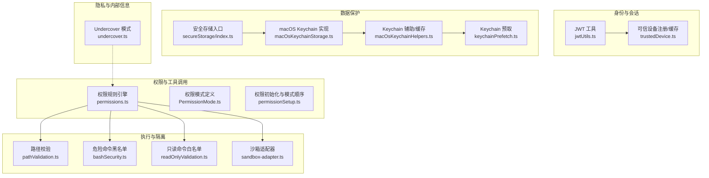
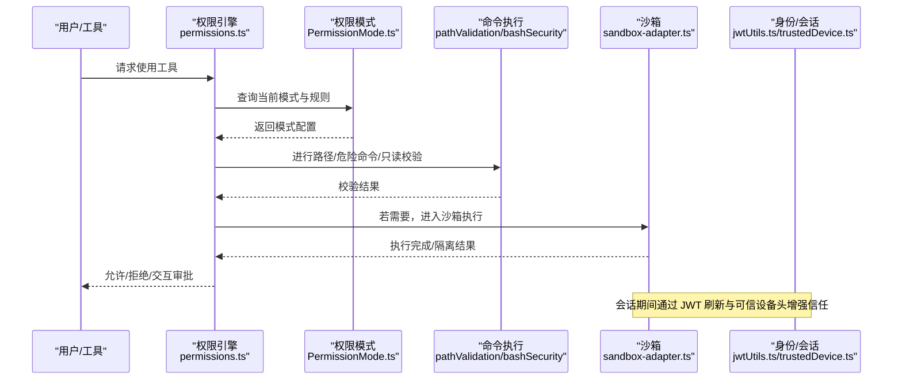
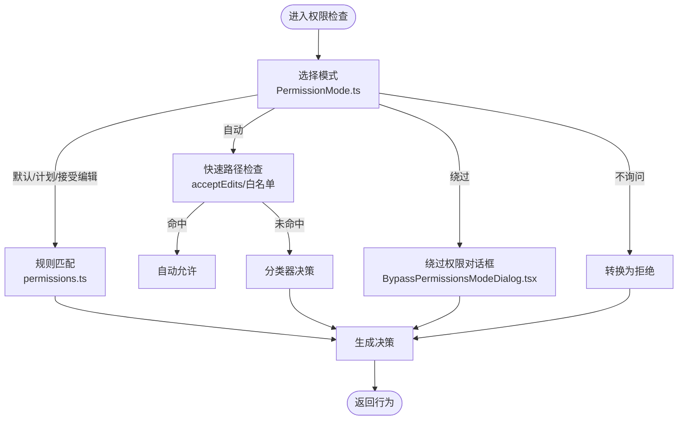
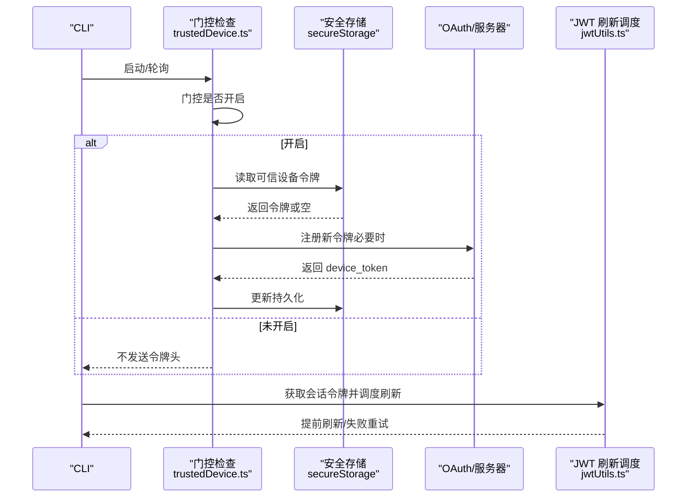
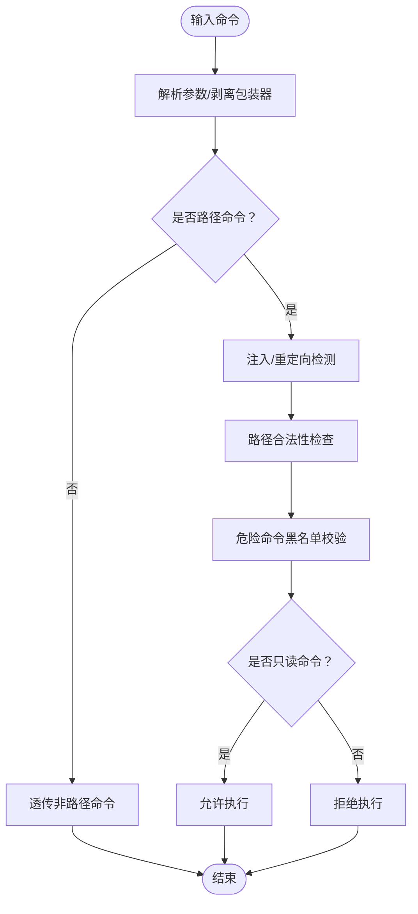
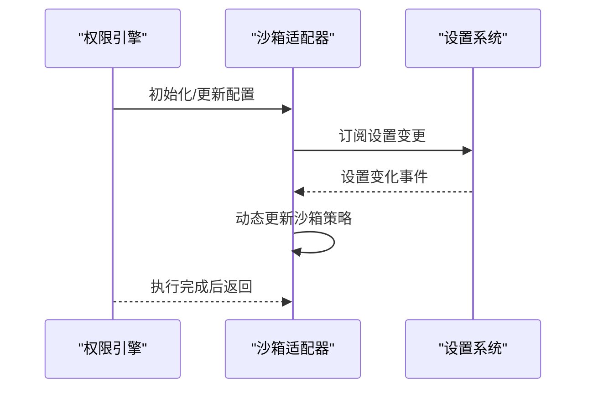
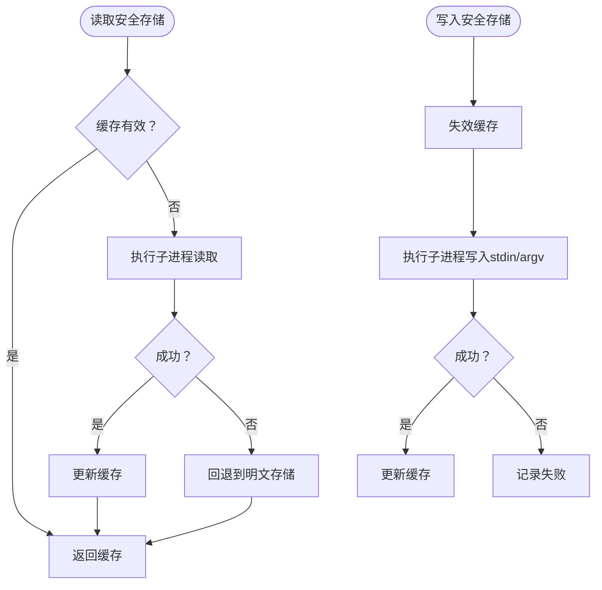
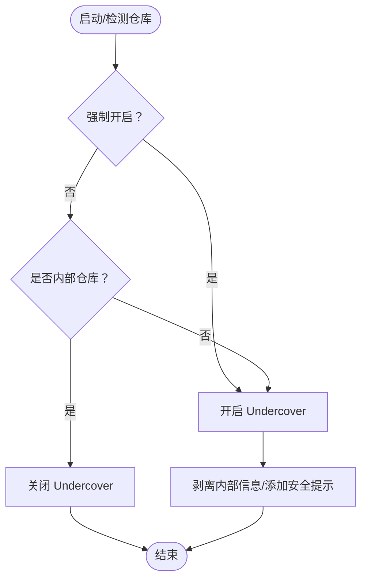
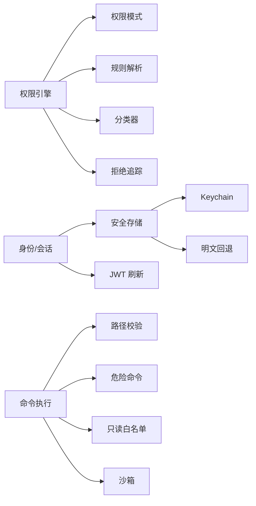

# 安全设计

<cite>
**本文引用的文件**
- [bridge/trustedDevice.ts](file://bridge/trustedDevice.ts)
- [bridge/jwtUtils.ts](file://bridge/jwtUtils.ts)
- [bridge/bridgePermissionCallbacks.ts](file://bridge/bridgePermissionCallbacks.ts)
- [components/BypassPermissionsModeDialog.tsx](file://components/BypassPermissionsModeDialog.tsx)
- [commands/permissions/permissions.tsx](file://commands/permissions/permissions.tsx)
- [utils/permissions/permissions.ts](file://utils/permissions/permissions.ts)
- [utils/permissions/PermissionMode.ts](file://utils/permissions/PermissionMode.ts)
- [utils/permissions/permissionSetup.ts](file://utils/permissions/permissionSetup.ts)
- [hooks/useReplBridge.tsx](file://hooks/useReplBridge.tsx)
- [tools/BashTool/pathValidation.ts](file://tools/BashTool/pathValidation.ts)
- [tools/BashTool/bashSecurity.ts](file://tools/BashTool/bashSecurity.ts)
- [tools/BashTool/readOnlyValidation.ts](file://tools/BashTool/readOnlyValidation.ts)
- [utils/undercover.ts](file://utils/undercover.ts)
- [utils/secureStorage/index.ts](file://utils/secureStorage/index.ts)
- [utils/secureStorage/macOsKeychainStorage.ts](file://utils/secureStorage/macOsKeychainStorage.ts)
- [utils/secureStorage/macOsKeychainHelpers.ts](file://utils/secureStorage/macOsKeychainHelpers.ts)
- [utils/secureStorage/keychainPrefetch.ts](file://utils/secureStorage/keychainPrefetch.ts)
- [utils/sandbox/sandbox-adapter.ts](file://utils/sandbox/sandbox-adapter.ts)
</cite>

## 目录
1. [引言](#引言)
2. [项目结构与安全边界](#项目结构与安全边界)
3. [核心安全组件](#核心安全组件)
4. [架构总览](#架构总览)
5. [详细组件分析](#详细组件分析)
6. [依赖关系分析](#依赖关系分析)
7. [性能与安全权衡](#性能与安全权衡)
8. [故障排查指南](#故障排查指南)
9. [结论](#结论)
10. [附录：安全最佳实践清单](#附录安全最佳实践清单)

## 引言
本文件面向 Claude Code 项目，系统性梳理其多层安全架构与实践，覆盖权限控制（默认/自动/绕过）、身份认证（JWT、可信设备）、数据保护（密钥存储、隐私模式 Undercover）、代码执行安全（路径保护、危险命令检测、沙箱隔离）等维度。文档同时给出安全威胁与防护建议、最佳实践与排障要点，帮助开发者在功能演进中持续保持安全基线。

## 项目结构与安全边界
- 权限与工具调用链：工具使用前经权限检查与决策，涉及规则引擎、AI 自动模式、交互式审批与拒绝追踪。
- 身份与会话：桥接通道使用 JWT 令牌与可选可信设备头；登录后可进行可信设备注册与缓存管理。
- 执行与隔离：Bash/PowerShell 等命令执行前进行路径约束、危险命令检测与只读安全校验；支持沙箱动态配置更新。
- 数据保护：敏感凭据通过平台安全存储（macOS Keychain 优先，回退明文），并进行输入长度与命令行参数保护。
- 隐私与内部信息：Undercover 模式在公共仓库下强制安全提示与内部信息剥离，构建时按用户类型裁剪分支。

**图表来源**
- [utils/permissions/permissions.ts](file://utils/permissions/permissions.ts)
- [utils/permissions/PermissionMode.ts](file://utils/permissions/PermissionMode.ts)
- [utils/permissions/permissionSetup.ts](file://utils/permissions/permissionSetup.ts)
- [bridge/jwtUtils.ts](file://bridge/jwtUtils.ts)
- [bridge/trustedDevice.ts](file://bridge/trustedDevice.ts)
- [tools/BashTool/pathValidation.ts](file://tools/BashTool/pathValidation.ts)
- [tools/BashTool/bashSecurity.ts](file://tools/BashTool/bashSecurity.ts)
- [tools/BashTool/readOnlyValidation.ts](file://tools/BashTool/readOnlyValidation.ts)
- [utils/sandbox/sandbox-adapter.ts](file://utils/sandbox/sandbox-adapter.ts)
- [utils/secureStorage/index.ts](file://utils/secureStorage/index.ts)
- [utils/secureStorage/macOsKeychainStorage.ts](file://utils/secureStorage/macOsKeychainStorage.ts)
- [utils/secureStorage/macOsKeychainHelpers.ts](file://utils/secureStorage/macOsKeychainHelpers.ts)
- [utils/secureStorage/keychainPrefetch.ts](file://utils/secureStorage/keychainPrefetch.ts)
- [utils/undercover.ts](file://utils/undercover.ts)

**章节来源**
- [utils/permissions/permissions.ts](file://utils/permissions/permissions.ts)
- [bridge/jwtUtils.ts](file://bridge/jwtUtils.ts)
- [bridge/trustedDevice.ts](file://bridge/trustedDevice.ts)
- [utils/secureStorage/index.ts](file://utils/secureStorage/index.ts)
- [utils/undercover.ts](file://utils/undercover.ts)

## 核心安全组件
- 权限模式与决策
  - 默认模式、计划模式、接受编辑模式、绕过权限模式、不询问模式、自动模式（Ant 内部）。
  - 权限规则来源分层（设置源、命令行、会话等），支持允许/禁止/询问三类规则。
  - 自动模式结合分类器与快速路径（接受编辑模式匹配、安全工具白名单）降低误判成本。
- 身份认证与会话
  - JWT 解码与过期刷新调度，支持带缓冲的提前刷新与失败重试。
  - 可信设备令牌（持久化 90 天滚动过期）在门控开启时随请求头发送，避免跨账户旧令牌泄露。
- 命令执行安全
  - 路径命令解析与安全包装器剥离，确保对真实命令进行校验。
  - 危险命令黑名单（含 zsh 特殊模块与内置命令），阻断高危路径。
  - 只读命令正则白名单，限制写入与注入风险。
- 沙箱与隔离
  - 动态初始化与配置更新，订阅设置变更以实时调整沙箱策略。
- 数据保护
  - macOS 平台优先 Keychain 存储，回退明文；stdin 注入保护与 argv 回退；预取与缓存一致性保障。
- 隐私与内部信息
  - Undercover 模式在公共/开源仓库下强制安全提示与内部信息剥离，构建时死代码消除非内部分支。

**章节来源**
- [utils/permissions/PermissionMode.ts](file://utils/permissions/PermissionMode.ts)
- [utils/permissions/permissions.ts](file://utils/permissions/permissions.ts)
- [bridge/jwtUtils.ts](file://bridge/jwtUtils.ts)
- [bridge/trustedDevice.ts](file://bridge/trustedDevice.ts)
- [tools/BashTool/pathValidation.ts](file://tools/BashTool/pathValidation.ts)
- [tools/BashTool/bashSecurity.ts](file://tools/BashTool/bashSecurity.ts)
- [tools/BashTool/readOnlyValidation.ts](file://tools/BashTool/readOnlyValidation.ts)
- [utils/sandbox/sandbox-adapter.ts](file://utils/sandbox/sandbox-adapter.ts)
- [utils/secureStorage/index.ts](file://utils/secureStorage/index.ts)
- [utils/secureStorage/macOsKeychainStorage.ts](file://utils/secureStorage/macOsKeychainStorage.ts)
- [utils/secureStorage/macOsKeychainHelpers.ts](file://utils/secureStorage/macOsKeychainHelpers.ts)
- [utils/secureStorage/keychainPrefetch.ts](file://utils/secureStorage/keychainPrefetch.ts)
- [utils/undercover.ts](file://utils/undercover.ts)

## 架构总览
下图展示从“工具调用”到“执行与隔离”的关键安全路径，以及“身份与会话”如何贯穿其中。

**图表来源**
- [utils/permissions/permissions.ts](file://utils/permissions/permissions.ts)
- [utils/permissions/PermissionMode.ts](file://utils/permissions/PermissionMode.ts)
- [tools/BashTool/pathValidation.ts](file://tools/BashTool/pathValidation.ts)
- [tools/BashTool/bashSecurity.ts](file://tools/BashTool/bashSecurity.ts)
- [utils/sandbox/sandbox-adapter.ts](file://utils/sandbox/sandbox-adapter.ts)
- [bridge/jwtUtils.ts](file://bridge/jwtUtils.ts)
- [bridge/trustedDevice.ts](file://bridge/trustedDevice.ts)

## 详细组件分析

### 权限模式与自动模式
- 设计理念
  - 默认模式：遵循规则与交互，兼顾安全与可用性。
  - 自动模式（Ant 内部）：通过分类器与快速路径减少人工干预，但保留敏感检查不可绕过。
  - 绕过权限模式：仅限受控容器/虚拟机，且需显式确认；存在专用对话框与设置开关。
  - 不询问模式：将“询问”直接转为“拒绝”，适合无人值守场景。
- 关键实现点
  - 模式配置与外部映射、模式切换守卫（如自动模式门禁、绕过模式可用性检查）。
  - 权限初始化时按优先级组装模式序列，并在远程环境过滤不支持的默认模式。
  - 自动模式在多种快速路径（接受编辑、安全工具白名单）后仍可回落到分类器。

**图表来源**
- [utils/permissions/PermissionMode.ts](file://utils/permissions/PermissionMode.ts)
- [utils/permissions/permissions.ts](file://utils/permissions/permissions.ts)
- [components/BypassPermissionsModeDialog.tsx](file://components/BypassPermissionsModeDialog.tsx)
- [hooks/useReplBridge.tsx](file://hooks/useReplBridge.tsx)

**章节来源**
- [utils/permissions/PermissionMode.ts](file://utils/permissions/PermissionMode.ts)
- [utils/permissions/permissionSetup.ts](file://utils/permissions/permissionSetup.ts)
- [components/BypassPermissionsModeDialog.tsx](file://components/BypassPermissionsModeDialog.tsx)
- [hooks/useReplBridge.tsx](file://hooks/useReplBridge.tsx)

### 身份认证与会话（JWT、可信设备）
- JWT
  - 解码载荷与过期时间，支持基于缓冲的提前刷新与失败重试。
  - 对于不透明 JWT（如服务端返回 expires_in），提供基于 TTL 的刷新调度。
- 可信设备
  - 门控开启时才发送 X-Trusted-Device-Token，避免无意义暴露。
  - 登录后异步注册并持久化（90 天滚动过期），Keychain 读写带缓存与预取。
  - 环境变量可覆盖令牌，便于企业封装或测试。

**图表来源**
- [bridge/trustedDevice.ts](file://bridge/trustedDevice.ts)
- [utils/secureStorage/index.ts](file://utils/secureStorage/index.ts)
- [utils/secureStorage/macOsKeychainStorage.ts](file://utils/secureStorage/macOsKeychainStorage.ts)
- [bridge/jwtUtils.ts](file://bridge/jwtUtils.ts)

**章节来源**
- [bridge/jwtUtils.ts](file://bridge/jwtUtils.ts)
- [bridge/trustedDevice.ts](file://bridge/trustedDevice.ts)
- [utils/secureStorage/index.ts](file://utils/secureStorage/index.ts)
- [utils/secureStorage/macOsKeychainStorage.ts](file://utils/secureStorage/macOsKeychainStorage.ts)

### 命令执行安全（路径保护、危险命令、只读校验）
- 路径保护
  - 解析单条命令，剥离安全包装器（如 timeout、nice 等），再对真实命令进行路径与注入检测。
  - 支持复合命令中 cd 的传播处理，避免目录逃逸。
- 危险命令检测
  - zsh 特定危险命令与模块（zmodload、emulate -c、zpty、ztcp、zsocket、zsh/files 内置 rm/mv/ln/chmod 等）列入黑名单。
  - 针对其他 shell 的常见危险元字符与注入模式进行严格限制。
- 只读命令白名单
  - 使用正则限制命令行中的重定向、反引号、变量扩展、环境赋值等，仅允许安全的只读查询类命令。

**图表来源**
- [tools/BashTool/pathValidation.ts](file://tools/BashTool/pathValidation.ts)
- [tools/BashTool/bashSecurity.ts](file://tools/BashTool/bashSecurity.ts)
- [tools/BashTool/readOnlyValidation.ts](file://tools/BashTool/readOnlyValidation.ts)

**章节来源**
- [tools/BashTool/pathValidation.ts](file://tools/BashTool/pathValidation.ts)
- [tools/BashTool/bashSecurity.ts](file://tools/BashTool/bashSecurity.ts)
- [tools/BashTool/readOnlyValidation.ts](file://tools/BashTool/readOnlyValidation.ts)

### 沙箱隔离与动态配置
- 初始化与配置更新
  - 从设置转换运行时配置，订阅设置变化以动态更新沙箱策略。
  - 出错时清理初始化状态以便重试，避免静默失败。
- 与权限/执行链路协同
  - 在权限判定为允许后，若需要，进入沙箱执行，确保进程与文件系统隔离。

**图表来源**
- [utils/sandbox/sandbox-adapter.ts](file://utils/sandbox/sandbox-adapter.ts)

**章节来源**
- [utils/sandbox/sandbox-adapter.ts](file://utils/sandbox/sandbox-adapter.ts)

### 数据保护（密钥存储与传输）
- 平台适配
  - macOS 优先 Keychain，回退明文存储；Linux 待扩展。
- 输入保护
  - 写入 Keychain 时优先 stdin 注入保护，超长负载回退 argv；十六进制编码规避转义问题。
- 缓存与预取
  - Keychain 读写带 TTL 缓存与生成号，避免并发写入覆盖；启动阶段并行预取，提升冷启动体验。
- 与可信设备配合
  - 令牌注册与读取均走安全存储，避免明文落盘。

**图表来源**
- [utils/secureStorage/index.ts](file://utils/secureStorage/index.ts)
- [utils/secureStorage/macOsKeychainStorage.ts](file://utils/secureStorage/macOsKeychainStorage.ts)
- [utils/secureStorage/macOsKeychainHelpers.ts](file://utils/secureStorage/macOsKeychainHelpers.ts)
- [utils/secureStorage/keychainPrefetch.ts](file://utils/secureStorage/keychainPrefetch.ts)

**章节来源**
- [utils/secureStorage/index.ts](file://utils/secureStorage/index.ts)
- [utils/secureStorage/macOsKeychainStorage.ts](file://utils/secureStorage/macOsKeychainStorage.ts)
- [utils/secureStorage/macOsKeychainHelpers.ts](file://utils/secureStorage/macOsKeychainHelpers.ts)
- [utils/secureStorage/keychainPrefetch.ts](file://utils/secureStorage/keychainPrefetch.ts)

### 隐私与内部信息保护（Undercover 模式）
- 激活策略
  - 强制开启（环境变量）或自动模式：除非明确处于内部仓库，否则默认开启。
  - 构建时 USER_TYPE 为 ant 时才启用内部分支，否则外部构建中该模块被死代码消除。
- 行为
  - 在提交/PR 提示中加入安全指令，剥离所有归属信息，防止内部模型代号、项目名等泄露。

**图表来源**
- [utils/undercover.ts](file://utils/undercover.ts)

**章节来源**
- [utils/undercover.ts](file://utils/undercover.ts)

## 依赖关系分析
- 权限引擎依赖模式配置、规则解析、分类器与拒绝追踪；与工具接口耦合，确保在不同模式下行为一致。
- 身份与会话依赖安全存储与 OAuth 配置；JWT 刷新调度独立于具体传输层。
- 命令执行安全与沙箱解耦，前者负责“是否允许”，后者负责“如何执行”。
- 数据保护横切多个模块，保证凭据读写的一致性与安全性。

**图表来源**
- [utils/permissions/permissions.ts](file://utils/permissions/permissions.ts)
- [utils/permissions/PermissionMode.ts](file://utils/permissions/PermissionMode.ts)
- [bridge/jwtUtils.ts](file://bridge/jwtUtils.ts)
- [bridge/trustedDevice.ts](file://bridge/trustedDevice.ts)
- [tools/BashTool/pathValidation.ts](file://tools/BashTool/pathValidation.ts)
- [tools/BashTool/bashSecurity.ts](file://tools/BashTool/bashSecurity.ts)
- [tools/BashTool/readOnlyValidation.ts](file://tools/BashTool/readOnlyValidation.ts)
- [utils/sandbox/sandbox-adapter.ts](file://utils/sandbox/sandbox-adapter.ts)
- [utils/secureStorage/index.ts](file://utils/secureStorage/index.ts)
- [utils/secureStorage/macOsKeychainStorage.ts](file://utils/secureStorage/macOsKeychainStorage.ts)

**章节来源**
- [utils/permissions/permissions.ts](file://utils/permissions/permissions.ts)
- [bridge/jwtUtils.ts](file://bridge/jwtUtils.ts)
- [bridge/trustedDevice.ts](file://bridge/trustedDevice.ts)
- [utils/secureStorage/index.ts](file://utils/secureStorage/index.ts)

## 性能与安全权衡
- Keychain 预取与缓存：启动阶段并行预取，避免冷启动阻塞；缓存 TTL 与生成号避免竞态覆盖。
- JWT 刷新：缓冲提前刷新与失败重试，平衡会话连续性与刷新开销。
- 自动模式快速路径：接受编辑模式与安全工具白名单显著降低分类器调用频率，同时保留敏感检查。
- 沙箱动态更新：按需订阅设置变化，避免频繁重启带来的性能损耗。

[本节为通用指导，无需列出具体文件来源]

## 故障排查指南
- 可信设备注册失败
  - 检查门控是否开启、OAuth 令牌是否存在、Essential 流量限制、网络超时与响应状态。
  - 清理缓存与存储中的旧令牌，确认环境变量未覆盖导致跳过注册。
- JWT 刷新异常
  - 观察日志中的“无法解码过期时间”“无 OAuth 令牌可用”“失败重试上限”等提示，定位获取令牌或传输层问题。
- 权限模式切换失败
  - 绕过模式需满足“已启用且会话允许”；自动模式需满足门禁与可用性条件。
- 命令被错误拒绝
  - 检查是否命中危险命令黑名单、路径越界、注入模式；确认只读白名单正则是否覆盖目标命令。
- 沙箱未生效
  - 确认沙箱启用、配置已更新、设置变更订阅正常；查看初始化错误日志。

**章节来源**
- [bridge/trustedDevice.ts](file://bridge/trustedDevice.ts)
- [bridge/jwtUtils.ts](file://bridge/jwtUtils.ts)
- [hooks/useReplBridge.tsx](file://hooks/useReplBridge.tsx)
- [tools/BashTool/bashSecurity.ts](file://tools/BashTool/bashSecurity.ts)
- [utils/sandbox/sandbox-adapter.ts](file://utils/sandbox/sandbox-adapter.ts)

## 结论
Claude Code 的安全设计采用“分层防御”策略：以权限模式与规则引擎为核心，结合自动模式与交互审批；以 JWT 与可信设备强化身份与会话；以路径保护、危险命令检测与只读白名单约束命令执行；以沙箱实现强隔离；以 Keychain 与预取/缓存保障凭据安全。Undercover 模式进一步强化了内部信息保护。整体方案在可用性与安全性之间取得平衡，并通过可观测性与自动化（刷新、预取、动态配置）提升稳定性。

[本节为总结性内容，无需列出具体文件来源]

## 附录：安全最佳实践清单
- 权限与模式
  - 明确默认模式与自动模式的适用范围，避免在远程/受限环境中使用绕过模式。
  - 通过规则引擎集中管理允许/禁止/询问策略，定期审计与清理。
- 身份与会话
  - 保持 JWT 刷新链路健康，监控失败重试与过期窗口。
  - 严格控制可信设备令牌生命周期与可见性，避免环境变量滥用。
- 命令执行
  - 新增命令前先评估是否可纳入只读白名单；对可能写入/重定向的命令进行严格注入检测。
  - 定期更新危险命令黑名单，关注新版本 shell 的安全漏洞。
- 沙箱与隔离
  - 在高风险工具上强制沙箱执行；动态配置更新后进行回归测试。
- 数据保护
  - 优先使用平台安全存储；对敏感字段进行最小化暴露与加密存储。
  - 避免明文日志输出凭据；对命令行参数进行长度与转义保护。
- 隐私与合规
  - 在公共/开源仓库中启用 Undercover 模式；对外发布前进行内部信息扫描。
- 审计与可观测性
  - 记录权限决策、自动模式分类器使用、失败重试与沙箱事件，定期复盘。

[本节为通用指导，无需列出具体文件来源]