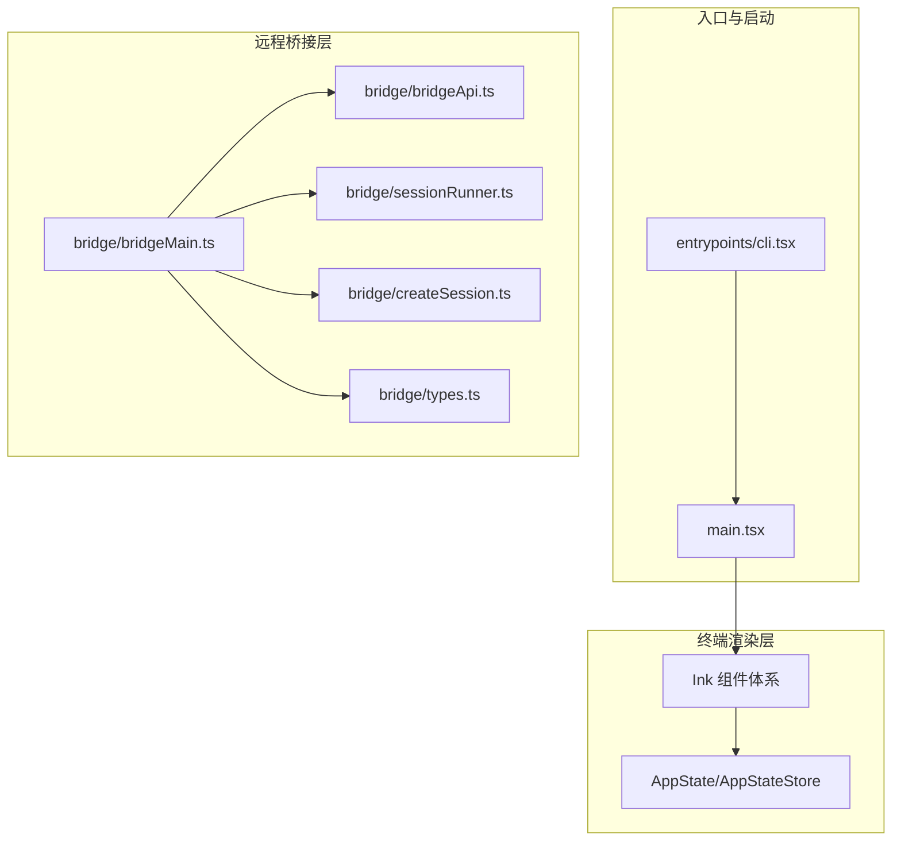
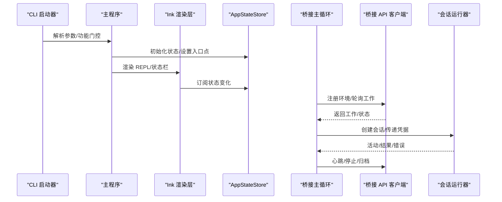
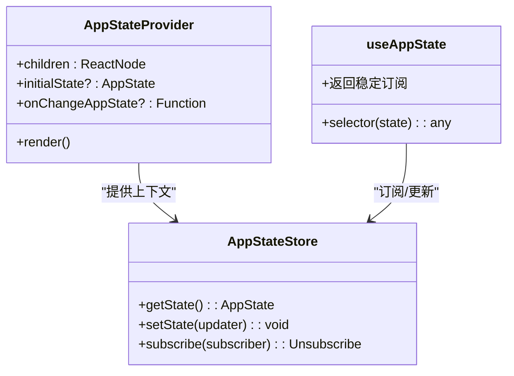
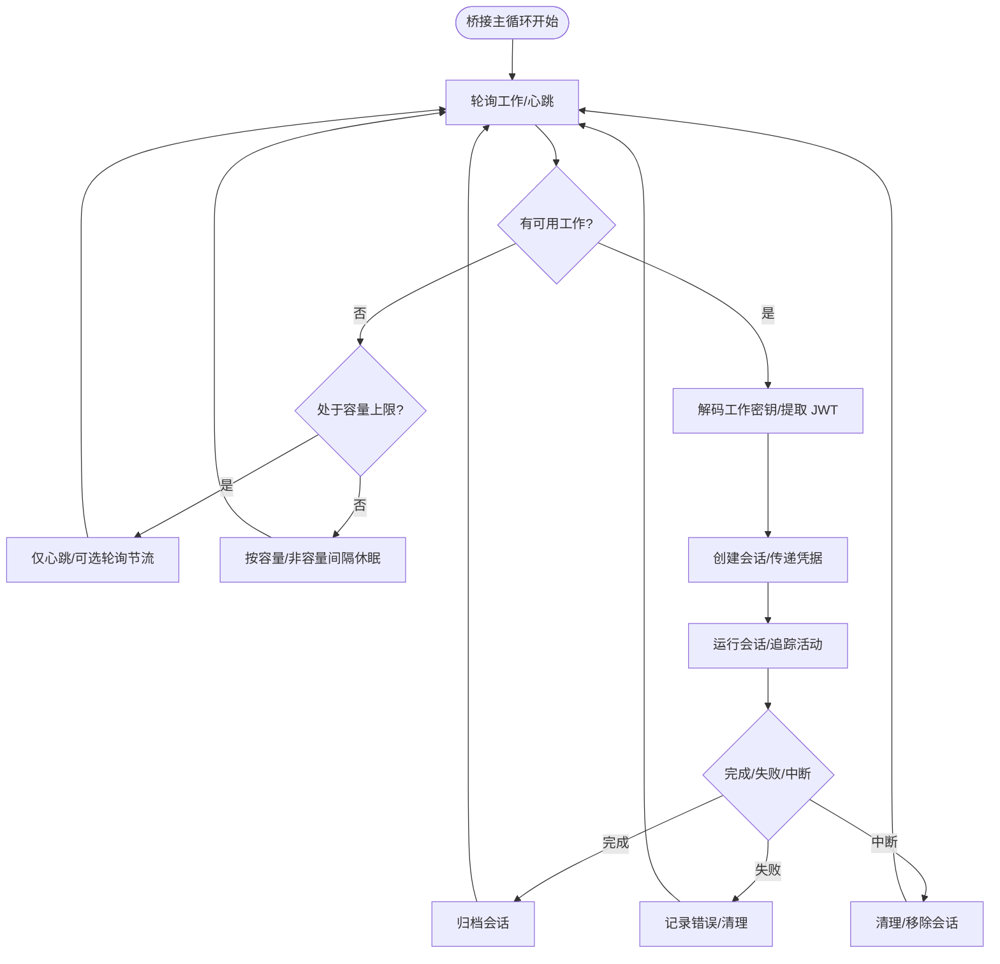
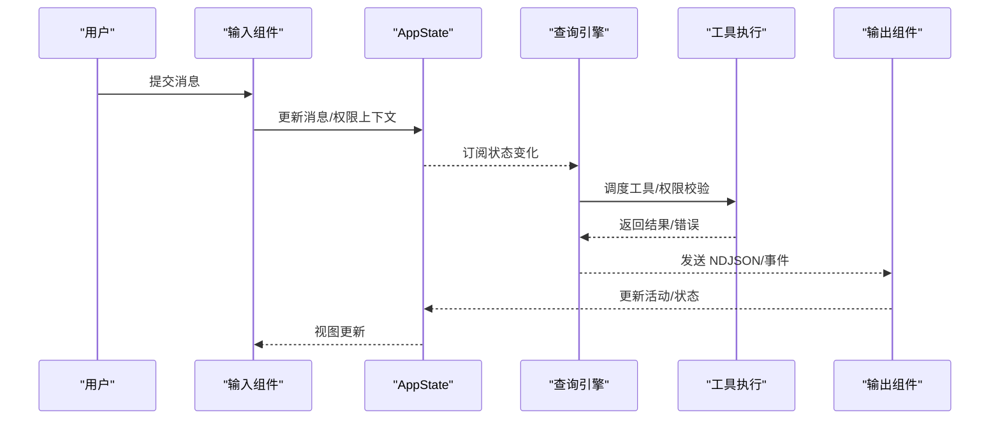
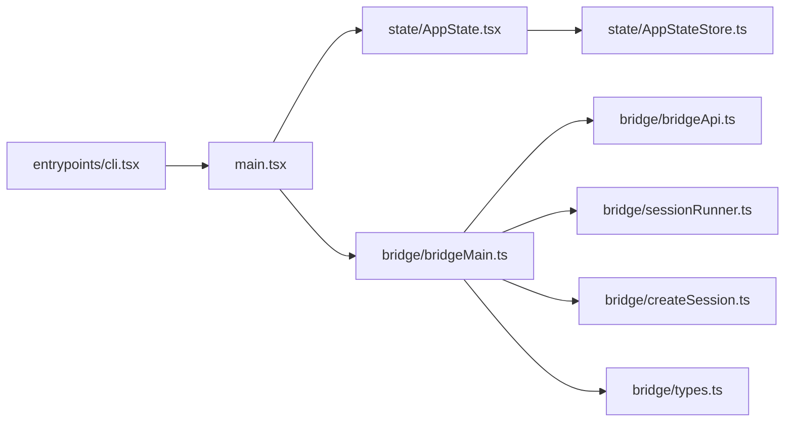

# 技术架构

<cite>
**本文引用的文件**
- [README.md](file://README.md)
- [main.tsx](file://main.tsx)
- [entrypoints/cli.tsx](file://entrypoints/cli.tsx)
- [state/AppState.tsx](file://state/AppState.tsx)
- [state/AppStateStore.ts](file://state/AppStateStore.ts)
- [bridge/bridgeMain.ts](file://bridge/bridgeMain.ts)
- [bridge/bridgeApi.ts](file://bridge/bridgeApi.ts)
- [bridge/types.ts](file://bridge/types.ts)
- [bridge/sessionRunner.ts](file://bridge/sessionRunner.ts)
- [bridge/createSession.ts](file://bridge/createSession.ts)
</cite>

## 目录
1. [引言](#引言)
2. [项目结构](#项目结构)
3. [核心组件](#核心组件)
4. [架构总览](#架构总览)
5. [详细组件分析](#详细组件分析)
6. [依赖关系分析](#依赖关系分析)
7. [性能考量](#性能考量)
8. [故障排查指南](#故障排查指南)
9. [结论](#结论)
10. [附录](#附录)

## 引言
本技术架构文档面向 Claude Code 项目，聚焦其基于 React 与 Ink 的终端渲染架构、MVVM 模式在状态管理中的体现、命令系统与工具系统、权限控制、状态管理、多代理协作（协调者模式）、远程桥接系统的分布式架构（会话管理、容量控制、安全认证），以及插件系统的模块化扩展机制。文档通过代码级图示与流程图，帮助开发者快速理解系统整体设计与关键决策。

## 项目结构
- 入口与启动路径：CLI 启动器负责解析参数、加载配置与功能门控，随后进入主程序；主程序完成初始化、设置上下文、启动 REPL 等。
- 终端渲染层：基于 React 与 Ink 实现 TUI 渲染，提供消息列表、输入框、状态栏等 UI 组件，并通过状态存储驱动视图更新。
- 远程桥接层：实现与远端服务的桥接，包括环境注册、工作轮询、心跳、会话创建与归档、容量控制与安全认证。
- 命令与工具系统：命令注册、过滤与执行；工具注册、权限分类与自动审批；工具模式与风险等级控制。
- 插件系统：插件发现、加载、错误收集与刷新机制；与 MCP 资源与命令的集成。
- 多代理协作：协调者模式下的并行工作流、跨进程队友通信、任务分发与同步。

图表来源
- [entrypoints/cli.tsx:1-303](file://entrypoints/cli.tsx#L1-L303)
- [main.tsx:1-800](file://main.tsx#L1-L800)
- [state/AppState.tsx:1-200](file://state/AppState.tsx#L1-L200)
- [state/AppStateStore.ts:1-570](file://state/AppStateStore.ts#L1-L570)
- [bridge/bridgeMain.ts:1-800](file://bridge/bridgeMain.ts#L1-L800)
- [bridge/bridgeApi.ts:1-540](file://bridge/bridgeApi.ts#L1-L540)
- [bridge/sessionRunner.ts:1-551](file://bridge/sessionRunner.ts#L1-L551)
- [bridge/createSession.ts:1-385](file://bridge/createSession.ts#L1-L385)
- [bridge/types.ts:1-263](file://bridge/types.ts#L1-L263)

章节来源
- [README.md:49-120](file://README.md#L49-L120)
- [entrypoints/cli.tsx:1-303](file://entrypoints/cli.tsx#L1-L303)
- [main.tsx:1-800](file://main.tsx#L1-L800)

## 核心组件
- CLI 启动器与入口：处理参数、功能门控、子命令路由、快速路径优化（版本、系统提示导出、MCP 服务器、守护进程等）。
- 主程序：初始化配置、策略门控、预取系统上下文、延迟预取、设置入口点、处理连接/SSH/助手等特殊场景。
- 终端渲染与状态管理：React + Ink 提供 UI；AppStateProvider/Store 提供 MVVM 风格的状态订阅与更新；useAppState/useSetAppState/useAppStateStore 提供选择器式订阅与稳定更新器。
- 远程桥接：桥接主循环、API 客户端、会话运行器、会话创建与归档、类型定义与安全认证。
- 命令与工具：命令注册与过滤、工具注册与权限控制、工具模式与风险等级、工具 Schema 缓存。
- 插件系统：插件发现、加载、错误收集、安装状态、刷新触发。

章节来源
- [entrypoints/cli.tsx:1-303](file://entrypoints/cli.tsx#L1-L303)
- [main.tsx:1-800](file://main.tsx#L1-L800)
- [state/AppState.tsx:1-200](file://state/AppState.tsx#L1-L200)
- [state/AppStateStore.ts:1-570](file://state/AppStateStore.ts#L1-L570)
- [bridge/bridgeMain.ts:1-800](file://bridge/bridgeMain.ts#L1-L800)
- [bridge/bridgeApi.ts:1-540](file://bridge/bridgeApi.ts#L1-L540)
- [bridge/sessionRunner.ts:1-551](file://bridge/sessionRunner.ts#L1-L551)
- [bridge/createSession.ts:1-385](file://bridge/createSession.ts#L1-L385)
- [bridge/types.ts:1-263](file://bridge/types.ts#L1-L263)

## 架构总览
本项目采用“入口层 → 渲染层 → 业务层（命令/工具/桥接/插件）”的分层架构。MVVM 在状态层体现为：
- Model：AppStateStore（集中状态）
- View：Ink 组件树（订阅状态变化）
- ViewModel：useAppState/useSetAppState/useAppStateStore（选择器与更新器）

远程桥接系统采用分布式架构：
- 环境注册与工作轮询：桥接主循环根据配置与容量策略拉取工作、创建会话、维护心跳。
- 会话管理：会话生命周期（spawn → 运行 → 结束）、活动追踪、错误诊断、超时与中断处理。
- 安全认证：OAuth/JWT、可信设备令牌、过期重试与致命错误处理。
- 容量控制：最大会话数、空闲轮询节流、心跳模式、容量唤醒机制。

图表来源
- [entrypoints/cli.tsx:1-303](file://entrypoints/cli.tsx#L1-L303)
- [main.tsx:1-800](file://main.tsx#L1-L800)
- [state/AppState.tsx:1-200](file://state/AppState.tsx#L1-L200)
- [state/AppStateStore.ts:1-570](file://state/AppStateStore.ts#L1-L570)
- [bridge/bridgeMain.ts:1-800](file://bridge/bridgeMain.ts#L1-L800)
- [bridge/bridgeApi.ts:1-540](file://bridge/bridgeApi.ts#L1-L540)
- [bridge/sessionRunner.ts:1-551](file://bridge/sessionRunner.ts#L1-L551)

## 详细组件分析

### 终端渲染与 MVVM 状态管理
- AppStateProvider：提供全局状态上下文，挂载邮箱与语音上下文，监听设置变更并应用。
- useAppState：以选择器方式订阅状态切片，避免不必要重渲染；返回稳定引用的 set 方法。
- AppStateStore：集中管理设置、模型、权限上下文、插件、MCP、任务、通知、思维/建议开关、远程桥接状态等。

图表来源
- [state/AppState.tsx:1-200](file://state/AppState.tsx#L1-L200)
- [state/AppStateStore.ts:1-570](file://state/AppStateStore.ts#L1-L570)

章节来源
- [state/AppState.tsx:1-200](file://state/AppState.tsx#L1-L200)
- [state/AppStateStore.ts:1-570](file://state/AppStateStore.ts#L1-L570)

### 命令系统与工具系统
- 命令注册与过滤：命令按功能门控与用户类型过滤，支持远程模式切换。
- 工具注册与权限：工具按风险等级分类（低/中/高），支持自动审批（YOLO 分类器）、保护文件、路径遍历防护、权限解释器。
- 工具模式：默认/自动/绕过/禁用模式；工具 Schema 缓存提升提示效率。

章节来源
- [main.tsx:1-800](file://main.tsx#L1-L800)
- [README.md:347-361](file://README.md#L347-L361)

### 权限控制与安全
- 权限模式与风险分类：自动/默认/绕过/禁用；YOLO 分类器；受保护文件清单；路径遍历防护。
- 远程桥接安全：OAuth/JWT、可信设备令牌头、401/403 处理、致命错误与抑制性 403 判定、过期错误类型识别。

章节来源
- [bridge/bridgeApi.ts:1-540](file://bridge/bridgeApi.ts#L1-L540)
- [bridge/types.ts:1-263](file://bridge/types.ts#L1-L263)
- [README.md:347-361](file://README.md#L347-L361)

### 多代理协作（协调者模式）
- 协调者模式：研究/合成/实现/验证阶段并行化；工人异步独立执行；共享草稿目录；禁止懒惰委派。
- 团队协作：Agent Teams（进程/异步存储隔离）、跨进程通信（XML 消息）、团队记忆同步、颜色标识。

章节来源
- [README.md:247-271](file://README.md#L247-L271)

### 远程桥接系统（分布式架构）
- 环境注册与工作轮询：桥接主循环根据配置与容量策略拉取工作、创建会话、维护心跳。
- 会话管理：会话生命周期（spawn → 运行 → 结束）、活动追踪、错误诊断、超时与中断处理。
- 安全认证：OAuth/JWT、可信设备令牌、过期重试与致命错误处理。
- 容量控制：最大会话数、空闲轮询节流、心跳模式、容量唤醒机制。

图表来源
- [bridge/bridgeMain.ts:1-800](file://bridge/bridgeMain.ts#L1-L800)
- [bridge/bridgeApi.ts:1-540](file://bridge/bridgeApi.ts#L1-L540)
- [bridge/sessionRunner.ts:1-551](file://bridge/sessionRunner.ts#L1-L551)
- [bridge/createSession.ts:1-385](file://bridge/createSession.ts#L1-L385)
- [bridge/types.ts:1-263](file://bridge/types.ts#L1-L263)

章节来源
- [bridge/bridgeMain.ts:1-800](file://bridge/bridgeMain.ts#L1-L800)
- [bridge/bridgeApi.ts:1-540](file://bridge/bridgeApi.ts#L1-L540)
- [bridge/sessionRunner.ts:1-551](file://bridge/sessionRunner.ts#L1-L551)
- [bridge/createSession.ts:1-385](file://bridge/createSession.ts#L1-L385)
- [bridge/types.ts:1-263](file://bridge/types.ts#L1-L263)

### 插件系统（模块化与扩展）
- 插件发现与加载：插件目录扫描、缓存与错误收集、安装状态跟踪。
- 与 MCP 集成：插件可暴露 MCP 服务器、命令与资源；统一重连键触发效果重新连接。
- 刷新机制：通过增量键触发插件状态刷新，避免手动干预。

章节来源
- [state/AppStateStore.ts:1-570](file://state/AppStateStore.ts#L1-L570)
- [README.md:308-344](file://README.md#L308-L344)

### 数据流设计（从输入到工具执行再到输出）
- 用户输入：REPL 输入框 → 消息构建 → 状态更新 → 触发查询引擎。
- 工具执行：查询引擎 → 工具调度 → 权限检查 → 工具执行 → 结果回传。
- 输出展示：NDJSON 流解析 → 活动追踪 → UI 更新 → 状态栏/消息列表呈现。

图表来源
- [state/AppState.tsx:1-200](file://state/AppState.tsx#L1-L200)
- [state/AppStateStore.ts:1-570](file://state/AppStateStore.ts#L1-L570)
- [bridge/sessionRunner.ts:1-551](file://bridge/sessionRunner.ts#L1-L551)

章节来源
- [state/AppState.tsx:1-200](file://state/AppState.tsx#L1-L200)
- [state/AppStateStore.ts:1-570](file://state/AppStateStore.ts#L1-L570)
- [bridge/sessionRunner.ts:1-551](file://bridge/sessionRunner.ts#L1-L551)

## 依赖关系分析
- 入口层对主程序与功能门控的依赖：CLI 启动器在加载主程序前进行快速路径判断与门控评估。
- 主程序对状态、工具、插件、桥接等子系统的依赖：初始化顺序严格控制，确保信任建立后再预取系统上下文。
- 渲染层对状态层的依赖：通过 useAppState 选择器订阅，避免全局重渲染。
- 桥接层内部耦合：bridgeMain 依赖 bridgeApi、sessionRunner、createSession、types，形成清晰的职责边界。

图表来源
- [entrypoints/cli.tsx:1-303](file://entrypoints/cli.tsx#L1-L303)
- [main.tsx:1-800](file://main.tsx#L1-L800)
- [state/AppState.tsx:1-200](file://state/AppState.tsx#L1-L200)
- [state/AppStateStore.ts:1-570](file://state/AppStateStore.ts#L1-L570)
- [bridge/bridgeMain.ts:1-800](file://bridge/bridgeMain.ts#L1-L800)
- [bridge/bridgeApi.ts:1-540](file://bridge/bridgeApi.ts#L1-L540)
- [bridge/sessionRunner.ts:1-551](file://bridge/sessionRunner.ts#L1-L551)
- [bridge/createSession.ts:1-385](file://bridge/createSession.ts#L1-L385)
- [bridge/types.ts:1-263](file://bridge/types.ts#L1-L263)

章节来源
- [entrypoints/cli.tsx:1-303](file://entrypoints/cli.tsx#L1-L303)
- [main.tsx:1-800](file://main.tsx#L1-L800)
- [state/AppState.tsx:1-200](file://state/AppState.tsx#L1-L200)
- [state/AppStateStore.ts:1-570](file://state/AppStateStore.ts#L1-L570)
- [bridge/bridgeMain.ts:1-800](file://bridge/bridgeMain.ts#L1-L800)
- [bridge/bridgeApi.ts:1-540](file://bridge/bridgeApi.ts#L1-L540)
- [bridge/sessionRunner.ts:1-551](file://bridge/sessionRunner.ts#L1-L551)
- [bridge/createSession.ts:1-385](file://bridge/createSession.ts#L1-L385)
- [bridge/types.ts:1-263](file://bridge/types.ts#L1-L263)

## 性能考量
- 启动路径优化：快速路径（版本、系统提示导出、MCP 服务器、守护进程）减少模块加载。
- 延迟预取：首次渲染后才启动耗时的预取（用户上下文、提示、计数、模型能力、变更检测）。
- 死代码消除：编译时门控（feature）剔除外部构建不需要的功能。
- 状态订阅优化：useAppState 使用选择器与稳定引用，降低重渲染成本。
- 桥接容量控制：空闲轮询节流、心跳模式、容量唤醒，避免过度轮询与资源争用。

## 故障排查指南
- 登录与认证问题：远程桥接需要登录，401/403 将触发致命错误或过期判定；检查登录状态与可信设备令牌。
- 会话异常：查看会话结束状态（完成/失败/中断），结合 stderr 摘要定位问题；关注超时与中断场景。
- 权限拒绝：区分抑制性 403（如外部轮询会话、环境管理权限不足）与非抑制性错误；确认组织策略与角色。
- 桥接循环：断线重连日志、心跳模式进入/退出原因、容量变化导致的轮询策略调整。

章节来源
- [bridge/bridgeApi.ts:1-540](file://bridge/bridgeApi.ts#L1-L540)
- [bridge/bridgeMain.ts:1-800](file://bridge/bridgeMain.ts#L1-L800)
- [bridge/types.ts:1-263](file://bridge/types.ts#L1-L263)

## 结论
本项目在终端渲染、状态管理、命令与工具、权限控制、多代理协作与远程桥接等方面形成了清晰的分层与职责边界。MVVM 在状态层的实现提升了视图响应的可控性；桥接系统的分布式设计保障了会话管理、容量控制与安全认证的稳健性；插件系统的模块化扩展为生态提供了灵活性。整体架构兼顾工程实践与安全性，适合在复杂 CLI 场景下持续演进。

## 附录
- 功能门控与特性开关：通过编译时门控与运行时门控（GrowthBook）控制功能发布节奏与灰度策略。
- 内部文化与命名：动物代号（Tengu/Fennec/Capybara）、趣味特性（Penguin Mode/Buddy/ULTRAPLAN）体现了团队文化与工程细节。

章节来源
- [README.md:389-460](file://README.md#L389-L460)
- [entrypoints/cli.tsx:1-303](file://entrypoints/cli.tsx#L1-L303)