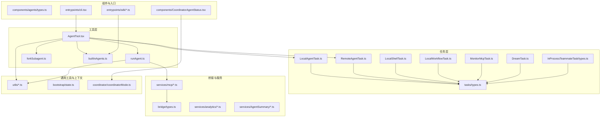
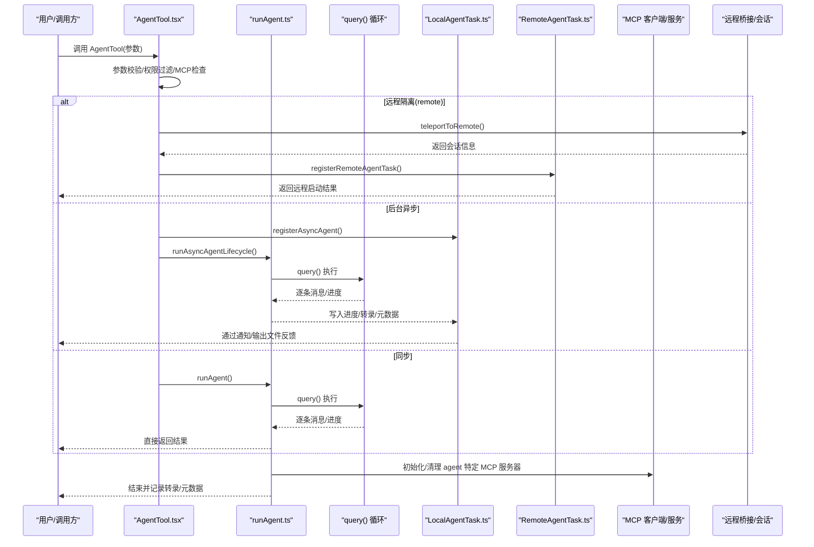
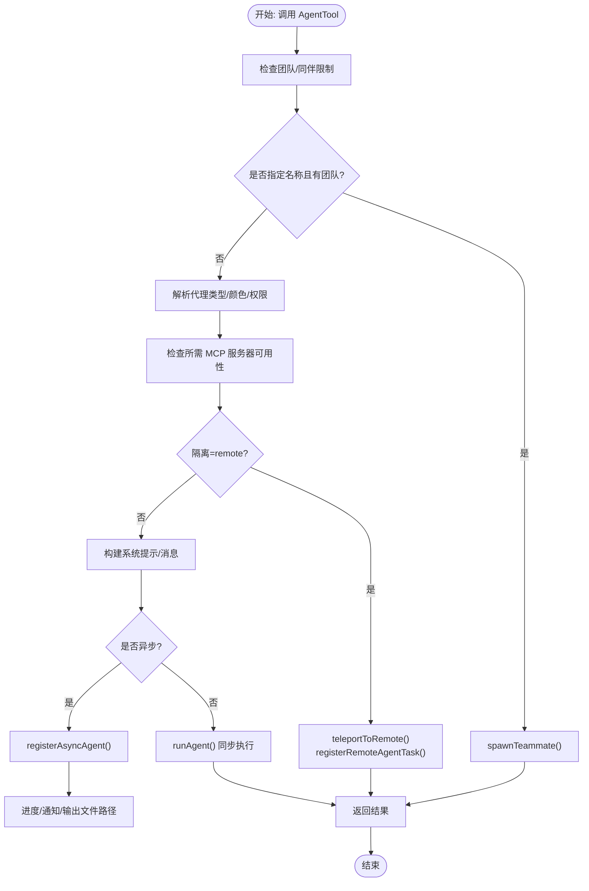
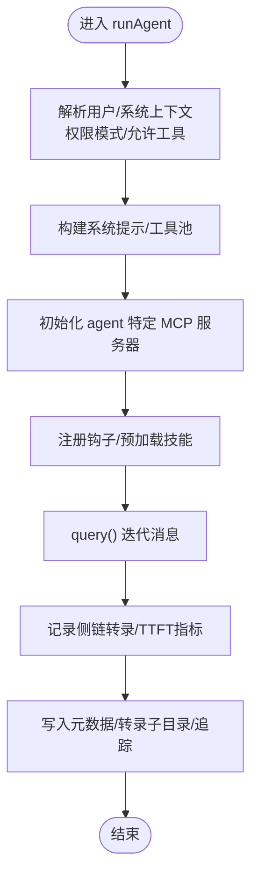
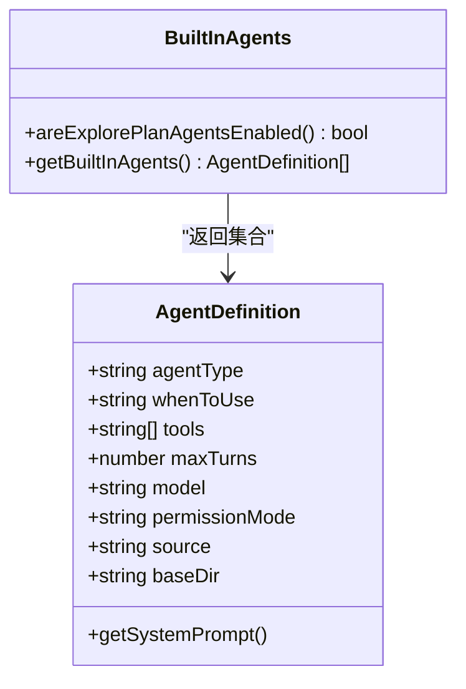
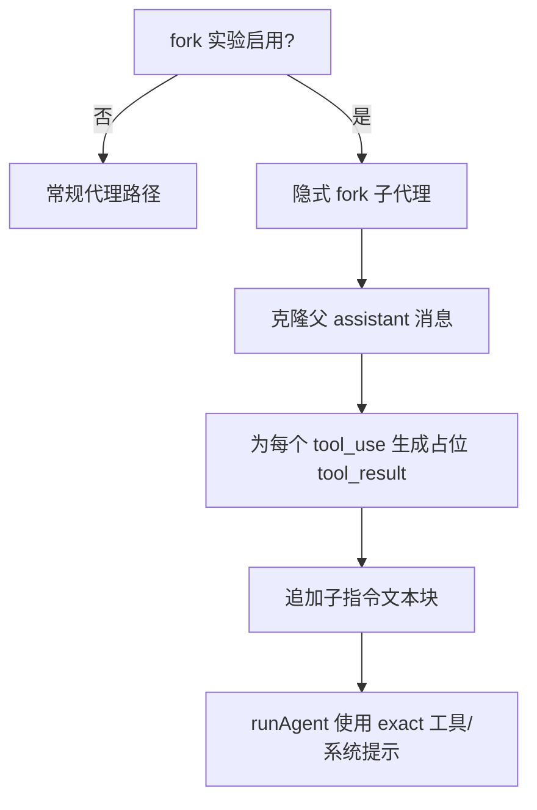
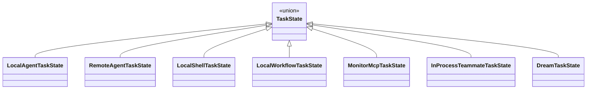
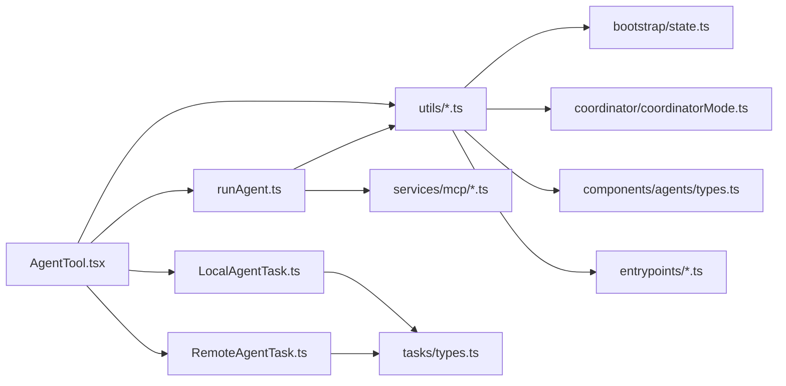

# 多代理协作系统

<cite>
**本文引用的文件**
- [tools/AgentTool/AgentTool.tsx](file://tools/AgentTool/AgentTool.tsx)
- [tools/AgentTool/runAgent.ts](file://tools/AgentTool/runAgent.ts)
- [tools/AgentTool/builtInAgents.ts](file://tools/AgentTool/builtInAgents.ts)
- [tools/AgentTool/forkSubagent.ts](file://tools/AgentTool/forkSubagent.ts)
- [tasks/types.ts](file://tasks/types.ts)
- [bridge/types.ts](file://bridge/types.ts)
- [components/agents/types.ts](file://components/agents/types.ts)
- [server/types.ts](file://server/types.ts)
- [services/mcp/types.ts](file://services/mcp/types.ts)
- [utils/agentContext.ts](file://utils/agentContext.ts)
- [utils/agentSwarmsEnabled.ts](file://utils/agentSwarmsEnabled.ts)
- [utils/teammate.ts](file://utils/teammate.ts)
- [utils/teammateContext.ts](file://utils/teammateContext.ts)
- [utils/systemPromptType.ts](file://utils/systemPromptType.ts)
- [utils/model/agent.ts](file://utils/model/agent.ts)
- [utils/permissions/permissions.ts](file://utils/permissions/permissions.ts)
- [utils/permissions/PermissionMode.ts](file://utils/permissions/PermissionMode.ts)
- [utils/telemetry/perfettoTracing.ts](file://utils/telemetry/perfettoTracing.ts)
- [utils/sessionStorage.ts](file://utils/sessionStorage.ts)
- [utils/worktree.ts](file://utils/worktree.ts)
- [utils/messages.ts](file://utils/messages.ts)
- [utils/cwd.ts](file://utils/cwd.ts)
- [utils/errors.ts](file://utils/errors.ts)
- [utils/debug.ts](file://utils/debug.ts)
- [utils/lazySchema.ts](file://utils/lazySchema.ts)
- [utils/sdkEventQueue.ts](file://utils/sdkEventQueue.ts)
- [utils/uuid.ts](file://utils/uuid.ts)
- [utils/teleport.ts](file://utils/teleport.ts)
- [utils/systemPrompt.ts](file://utils/systemPrompt.ts)
- [utils/tokens.ts](file://utils/tokens.ts)
- [tasks/LocalAgentTask/LocalAgentTask.ts](file://tasks/LocalAgentTask/LocalAgentTask.ts)
- [tasks/RemoteAgentTask/RemoteAgentTask.ts](file://tasks/RemoteAgentTask/RemoteAgentTask.ts)
- [tasks/LocalShellTask/LocalShellTask.ts](file://tasks/LocalShellTask/LocalShellTask.ts)
- [tasks/LocalShellTask/killShellTasks.ts](file://tasks/LocalShellTask/killShellTasks.ts)
- [tasks/LocalWorkflowTask/LocalWorkflowTask.ts](file://tasks/LocalWorkflowTask/LocalWorkflowTask.ts)
- [tasks/MonitorMcpTask/MonitorMcpTask.ts](file://tasks/MonitorMcpTask/MonitorMcpTask.ts)
- [tasks/DreamTask/DreamTask.ts](file://tasks/DreamTask/DreamTask.ts)
- [tasks/InProcessTeammateTask/types.ts](file://tasks/InProcessTeammateTask/types.ts)
- [tasks/LocalAgentTask/LocalAgentTask.ts](file://tasks/LocalAgentTask/LocalAgentTask.ts)
- [tasks/RemoteAgentTask/RemoteAgentTask.ts](file://tasks/RemoteAgentTask/RemoteAgentTask.ts)
- [tasks/LocalShellTask/killShellTasks.ts](file://tasks/LocalShellTask/killShellTasks.ts)
- [tasks/LocalWorkflowTask/LocalWorkflowTask.ts](file://tasks/LocalWorkflowTask/LocalWorkflowTask.ts)
- [tasks/MonitorMcpTask/MonitorMcpTask.ts](file://tasks/MonitorMcpTask/MonitorMcpTask.ts)
- [tasks/DreamTask/DreamTask.ts](file://tasks/DreamTask/DreamTask.ts)
- [tasks/InProcessTeammateTask/types.ts](file://tasks/InProcessTeammateTask/types.ts)
- [services/AgentSummary/agentSummary.ts](file://services/AgentSummary/agentSummary.ts)
- [services/analytics/index.ts](file://services/analytics/index.ts)
- [services/mcp/client.ts](file://services/mcp/client.ts)
- [services/mcp/config.ts](file://services/mcp/config.ts)
- [constants/prompts.ts](file://constants/prompts.ts)
- [coordinator/coordinatorMode.ts](file://coordinator/coordinatorMode.ts)
- [bootstrap/state.ts](file://bootstrap/state.ts)
- [entrypoints/agentSdkTypes.ts](file://entrypoints/agentSdkTypes.ts)
- [entrypoints/sdk/index.ts](file://entrypoints/sdk/index.ts)
- [entrypoints/sdk/types.ts](file://entrypoints/sdk/types.ts)
- [entrypoints/cli.tsx](file://entrypoints/cli.tsx)
- [entrypoints/mcp.ts](file://entrypoints/mcp.ts)
- [entrypoints/sandboxTypes.ts](file://entrypoints/sandboxTypes.ts)
- [components/agents/types.ts](file://components/agents/types.ts)
- [components/CoordinatorAgentStatus.tsx](file://components/CoordinatorAgentStatus.tsx)
- [components/AgentProgressLine.tsx](file://components/AgentProgressLine.tsx)
- [components/teammateViewHelpers.ts](file://components/teammateViewHelpers.ts)
- [hooks/useTeammateViewAutoExit.ts](file://hooks/useTeammateViewAutoExit.ts)
- [hooks/useTaskListWatcher.ts](file://hooks/useTaskListWatcher.ts)
- [hooks/useTasksV2.ts](file://hooks/useTasksV2.ts)
- [hooks/useSwarmInitialization.ts](file://hooks/useSwarmInitialization.ts)
- [hooks/useSwarmPermissionPoller.ts](file://hooks/useSwarmPermissionPoller.ts)
- [hooks/useCommandQueue.ts](file://hooks/useCommandQueue.ts)
- [hooks/useQueueProcessor.ts](file://hooks/useQueueProcessor.ts)
- [hooks/useAfterFirstRender.ts](file://hooks/useAfterFirstRender.ts)
- [hooks/useDeferredHookMessages.ts](file://hooks/useDeferredHookMessages.ts)
- [hooks/useDynamicConfig.ts](file://hooks/useDynamicConfig.ts)
- [hooks/useGlobalKeybindings.tsx](file://hooks/useGlobalKeybindings.tsx)
- [hooks/useMergedClients.ts](file://hooks/useMergedClients.ts)
- [hooks/useMergedCommands.ts](file://hooks/useMergedCommands.ts)
- [hooks/useMergedTools.ts](file://hooks/useMergedTools.ts)
- [hooks/useSettings.ts](file://hooks/useSettings.ts)
- [hooks/useSettingsChange.ts](file://hooks/useSettingsChange.ts)
- [hooks/useTaskListWatcher.ts](file://hooks/useTaskListWatcher.ts)
- [hooks/useTasksV2.ts](file://hooks/useTasksV2.ts)
- [hooks/useTeammateViewAutoExit.ts](file://hooks/useTeammateViewAutoExit.ts)
- [hooks/useSwarmInitialization.ts](file://hooks/useSwarmInitialization.ts)
- [hooks/useSwarmPermissionPoller.ts](file://hooks/useSwarmPermissionPoller.ts)
- [hooks/useCommandQueue.ts](file://hooks/useCommandQueue.ts)
- [hooks/useQueueProcessor.ts](file://hooks/useQueueProcessor.ts)
- [hooks/useAfterFirstRender.ts](file://hooks/useAfterFirstRender.ts)
- [hooks/useDeferredHookMessages.ts](file://hooks/useDeferredHookMessages.ts)
- [hooks/useDynamicConfig.ts](file://hooks/useDynamicConfig.ts)
- [hooks/useGlobalKeybindings.tsx](file://hooks/useGlobalKeybindings.tsx)
- [hooks/useMergedClients.ts](file://hooks/useMergedClients.ts)
- [hooks/useMergedCommands.ts](file://hooks/useMergedCommands.ts)
- [hooks/useMergedTools.ts](file://hooks/useMergedTools.ts)
- [hooks/useSettings.ts](file://hooks/useSettings.ts)
- [hooks/useSettingsChange.ts](file://hooks/useSettingsChange.ts)
</cite>

## 目录
1. [引言](#引言)
2. [项目结构](#项目结构)
3. [核心组件](#核心组件)
4. [架构总览](#架构总览)
5. [详细组件分析](#详细组件分析)
6. [依赖关系分析](#依赖关系分析)
7. [性能考量](#性能考量)
8. [故障排查指南](#故障排查指南)
9. [结论](#结论)
10. [附录：最佳实践与示例路径](#附录最佳实践与示例路径)

## 引言
本技术文档面向“多代理协作系统”，聚焦于多代理架构的设计与实现，涵盖代理创建、管理、协调与通信机制；深入解析 AgentTool 的实现细节，包括代理生命周期管理、状态同步、消息传递与权限控制；梳理内置代理类型（通用代理、探索代理、验证代理等）的特点与适用场景；解释协调器模式的工作原理及代理间任务分配与结果整合；并提供可直接定位到源码的示例路径，帮助读者在不同开发场景下选择合适的代理组合与协作策略。

## 项目结构
该仓库围绕“工具-代理-任务-桥接”的分层组织，AgentTool 作为入口工具，驱动子代理运行、注册后台任务、管理隔离与工作树、处理 MCP 服务器连接与工具池、以及进度与通知。任务系统负责异步生命周期与状态持久化；桥接层提供远程会话与传输能力；组件层提供 UI 展示与交互；服务层提供 MCP 客户端、分析与摘要等支撑能力。

图示来源
- [tools/AgentTool/AgentTool.tsx:196-800](file://tools/AgentTool/AgentTool.tsx#L196-L800)
- [tools/AgentTool/runAgent.ts:248-800](file://tools/AgentTool/runAgent.ts#L248-L800)
- [tasks/types.ts:1-47](file://tasks/types.ts#L1-L47)
- [bridge/types.ts](file://bridge/types.ts)
- [services/mcp/types.ts](file://services/mcp/types.ts)
- [components/agents/types.ts](file://components/agents/types.ts)
- [coordinator/coordinatorMode.ts](file://coordinator/coordinatorMode.ts)

章节来源
- [tools/AgentTool/AgentTool.tsx:196-800](file://tools/AgentTool/AgentTool.tsx#L196-L800)
- [tools/AgentTool/runAgent.ts:248-800](file://tools/AgentTool/runAgent.ts#L248-L800)
- [tasks/types.ts:1-47](file://tasks/types.ts#L1-L47)

## 核心组件
- AgentTool：工具入口，负责参数校验、权限过滤、MCP 要求检查、隔离模式（worktree/remote）、异步/同步执行、后台任务注册与进度通知、远程会话与输出文件路径生成。
- runAgent：子代理执行引擎，负责系统提示词构建、工具池解析、MCP 服务器初始化与清理、会话上下文注入、查询循环、消息记录与转录、性能追踪与元数据写入。
- builtInAgents：内置代理集合与启用开关，支持按特性门禁与环境变量控制。
- forkSubagent：分支子代理实验，提供统一的缓存友好对话前缀、递归保护与工作树隔离提示。
- 任务系统：统一的任务类型与后台任务判定逻辑，支持本地/远程/外壳/工作流/监控/梦境等任务形态。
- 权限与模型：权限模式、代理模型解析、系统提示词类型与增强、调试与事件队列。
- 桥接与远程：远程会话创建、任务注册、状态与 UI 集成。

章节来源
- [tools/AgentTool/AgentTool.tsx:196-800](file://tools/AgentTool/AgentTool.tsx#L196-L800)
- [tools/AgentTool/runAgent.ts:248-800](file://tools/AgentTool/runAgent.ts#L248-L800)
- [tools/AgentTool/builtInAgents.ts:22-72](file://tools/AgentTool/builtInAgents.ts#L22-L72)
- [tools/AgentTool/forkSubagent.ts:32-211](file://tools/AgentTool/forkSubagent.ts#L32-L211)
- [tasks/types.ts:12-46](file://tasks/types.ts#L12-L46)

## 架构总览
下图展示了从工具调用到子代理执行、任务注册与远程会话的关键流程。

图示来源
- [tools/AgentTool/AgentTool.tsx:239-800](file://tools/AgentTool/AgentTool.tsx#L239-L800)
- [tools/AgentTool/runAgent.ts:248-800](file://tools/AgentTool/runAgent.ts#L248-L800)
- [tasks/LocalAgentTask/LocalAgentTask.ts](file://tasks/LocalAgentTask/LocalAgentTask.ts)
- [tasks/RemoteAgentTask/RemoteAgentTask.ts](file://tasks/RemoteAgentTask/RemoteAgentTask.ts)
- [services/mcp/client.ts](file://services/mcp/client.ts)
- [utils/teleport.ts](file://utils/teleport.ts)

## 详细组件分析

### 组件A：AgentTool 工具与生命周期
- 输入/输出模式：支持基础参数与多代理参数（名称、团队名、权限模式），并根据特性门禁与环境变量动态裁剪 schema 字段。
- 权限与过滤：先按 MCP 要求过滤，再按权限规则过滤；对禁止使用的代理类型抛出明确错误。
- 隔离与工作树：支持 worktree 隔离并在 fork 子代理时注入路径转换提示；远程隔离委托给 CCR 并进行前置条件检查。
- 异步/同步：根据 run_in_background、agent 定义的 background、协调器模式、fork 实验、助手模式或主动模式决定是否异步；异步时注册后台任务并返回输出文件路径以便轮询。
- 进度与通知：通过进度回调与任务通知向 UI 展示；支持 SDK 事件队列与进度摘要。
- 代理选择：优先显式 subagent_type，否则在 fork 实验开启时走隐式 fork 分支；内置代理集合受特性门禁与环境变量控制。

图示来源
- [tools/AgentTool/AgentTool.tsx:239-800](file://tools/AgentTool/AgentTool.tsx#L239-L800)

章节来源
- [tools/AgentTool/AgentTool.tsx:82-157](file://tools/AgentTool/AgentTool.tsx#L82-L157)
- [tools/AgentTool/AgentTool.tsx:239-800](file://tools/AgentTool/AgentTool.tsx#L239-L800)

### 组件B：runAgent 子代理执行引擎
- 系统提示与上下文：根据代理定义与工具上下文构建系统提示，必要时剔除特定上下文以优化成本；支持 fork 子代理路径复用父渲染后的系统提示字节以保证缓存命中。
- 工具池与权限：基于代理定义解析可用工具，支持精确工具集（useExactTools）用于 fork 子代理；根据权限模式与允许工具列表重写会话规则。
- MCP 服务器：为代理定义的 MCP 服务器建立连接并合并工具，仅清理新建的客户端；支持插件仅模式下的安全约束。
- 会话钩子与技能：在代理生命周期内注册前端脚手架钩子与预加载技能，注入附加上下文消息。
- 查询循环与记录：通过 query() 迭代消息，记录可记录消息到侧链转录，暴露缓存安全参数供后台摘要；支持 TTFT/OTPS 指标回传。
- 元数据与追踪：写入代理元数据、设置转录子目录、注册 Perfetto 追踪，便于层级可视化与诊断。

图示来源
- [tools/AgentTool/runAgent.ts:248-800](file://tools/AgentTool/runAgent.ts#L248-L800)

章节来源
- [tools/AgentTool/runAgent.ts:95-218](file://tools/AgentTool/runAgent.ts#L95-L218)
- [tools/AgentTool/runAgent.ts:248-800](file://tools/AgentTool/runAgent.ts#L248-L800)

### 组件C：内置代理与类型体系
- 内置代理集合：通用代理、状态栏设置、探索/计划代理（受特性门禁控制）、验证代理（受特性门禁控制）、协调器代理（在协调器模式下动态提供）。
- 类型与来源：内置代理定义包含 agentType、whenToUse、工具范围、最大轮次、模型策略、权限模式、来源与基目录等；部分代理可省略 CLAUDE.md 上下文以降低成本。
- 启用策略：受特性门禁、环境变量与入口点类型影响；SDK 非交互模式可通过环境变量禁用内置代理。

图示来源
- [tools/AgentTool/builtInAgents.ts:22-72](file://tools/AgentTool/builtInAgents.ts#L22-L72)

章节来源
- [tools/AgentTool/builtInAgents.ts:13-72](file://tools/AgentTool/builtInAgents.ts#L13-L72)

### 组件D：分支子代理（Fork）与缓存友好前缀
- 特性门禁：fork 子代理与协调器模式互斥，非交互会话不启用；当启用时，省略 subagent_type 将触发隐式 fork。
- 缓存友好：fork 子代理复制父 assistant 的完整内容块（含思考与工具调用），构造完全一致的 tool_result 占位符，仅在最后文本块加入子指令，最大化提示缓存命中。
- 递归保护：检测 fork 装饰标签避免在 fork 子进程中再次 fork。
- 工作树提示：在 fork 子代理隔离到工作树时，注入路径翻译与变更隔离提示。

图示来源
- [tools/AgentTool/forkSubagent.ts:32-211](file://tools/AgentTool/forkSubagent.ts#L32-L211)

章节来源
- [tools/AgentTool/forkSubagent.ts:18-89](file://tools/AgentTool/forkSubagent.ts#L18-L89)
- [tools/AgentTool/forkSubagent.ts:107-198](file://tools/AgentTool/forkSubagent.ts#L107-L198)

### 组件E：任务系统与后台任务判定
- 任务类型：统一的任务状态类型集合，覆盖本地/远程/外壳/工作流/监控/梦境/在进程同伴等任务形态。
- 后台任务判定：任务处于 running 或 pending 且未被标记为前台任务时视为后台任务，用于后台任务指示器显示。

图示来源
- [tasks/types.ts:12-29](file://tasks/types.ts#L12-L29)

章节来源
- [tasks/types.ts:12-46](file://tasks/types.ts#L12-L46)

### 组件F：权限控制与模型解析
- 权限模式：支持 bypassPermissions、acceptEdits、bubble、auto 等模式；异步代理默认避免权限提示，必要时等待自动化检查。
- 模型解析：根据代理定义、主循环模型、显式参数与权限模式解析最终模型别名。
- 系统提示类型：系统提示封装为 SystemPrompt 类型，确保一致性与可序列化。

章节来源
- [utils/permissions/PermissionMode.ts](file://utils/permissions/PermissionMode.ts)
- [utils/permissions/permissions.ts](file://utils/permissions/permissions.ts)
- [utils/model/agent.ts](file://utils/model/agent.ts)
- [utils/systemPromptType.ts](file://utils/systemPromptType.ts)

### 组件G：远程会话与桥接
- 远程隔离：当隔离模式为 remote 时，检查资格并通过 teleportToRemote 创建会话，注册远程任务并返回会话 URL 与输出文件路径。
- 桥接类型：桥接层提供远程桥接、消息传递、状态工具与 UI 集成，支持远程 MCP 与传输。

章节来源
- [tools/AgentTool/AgentTool.tsx:435-482](file://tools/AgentTool/AgentTool.tsx#L435-L482)
- [utils/teleport.ts](file://utils/teleport.ts)
- [bridge/types.ts](file://bridge/types.ts)

### 组件H：UI 与状态展示
- 协调器状态：提供协调器代理状态组件，用于展示协调器模式下的代理状态。
- 进度线：AgentProgressLine 提供代理进度的 UI 表达。
- 团队视图辅助：同伴视图相关的辅助函数与自动退出逻辑。

章节来源
- [components/CoordinatorAgentStatus.tsx](file://components/CoordinatorAgentStatus.tsx)
- [components/AgentProgressLine.tsx](file://components/AgentProgressLine.tsx)
- [components/teammateViewHelpers.ts](file://components/teammateViewHelpers.ts)

## 依赖关系分析
- AgentTool 依赖 runAgent、任务系统、MCP 服务、权限与系统提示工具、工作树与消息工具、调试与事件队列等。
- runAgent 依赖 query 引擎、MCP 客户端/配置、钩子注册、转录与元数据存储、性能追踪等。
- 任务系统与桥接层相互独立但共同服务于代理生命周期与远程能力。
- 组件层与入口层（CLI/SDK）通过工具与类型接口集成。

图示来源
- [tools/AgentTool/AgentTool.tsx:1-100](file://tools/AgentTool/AgentTool.tsx#L1-L100)
- [tools/AgentTool/runAgent.ts:1-100](file://tools/AgentTool/runAgent.ts#L1-L100)
- [tasks/types.ts:1-47](file://tasks/types.ts#L1-L47)
- [services/mcp/types.ts](file://services/mcp/types.ts)
- [components/agents/types.ts](file://components/agents/types.ts)
- [entrypoints/agentSdkTypes.ts](file://entrypoints/agentSdkTypes.ts)

章节来源
- [tools/AgentTool/AgentTool.tsx:1-100](file://tools/AgentTool/AgentTool.tsx#L1-L100)
- [tools/AgentTool/runAgent.ts:1-100](file://tools/AgentTool/runAgent.ts#L1-L100)

## 性能考量
- 缓存友好：fork 子代理通过“父 assistant 完整复制 + 占位 tool_result + 子指令文本”构造，最大化提示缓存命中，降低重复计算。
- 成本优化：内置代理可省略 CLAUDE.md 与 gitStatus 上下文，显著减少 token 消耗；异步代理避免阻塞主循环。
- 资源隔离：工作树隔离避免并发修改冲突，远程隔离减少本地资源占用。
- 追踪与诊断：启用 Perfetto 追踪以可视化代理层次与生命周期，结合调试日志与事件队列定位问题。

## 故障排查指南
- 权限与工具不可用：检查代理定义的 requiredMcpServers 是否满足，确认 MCP 服务器已连接并认证；查看 denied 规则与 denyRule。
- 异步任务无响应：确认后台任务未被禁用，检查输出文件路径与读取工具可用性；查看任务通知与进度回调。
- 远程会话失败：检查远程资格与打包失败提示，确认网络与设备信任状态。
- fork 递归：若出现“无法在 fork 中再次 fork”的错误，需直接在父代理中完成任务或调整指令范围。
- 模型与系统提示：核对模型解析与系统提示增强逻辑，确保上下文与工具池正确注入。

章节来源
- [tools/AgentTool/AgentTool.tsx:370-410](file://tools/AgentTool/AgentTool.tsx#L370-L410)
- [utils/permissions/permissions.ts](file://utils/permissions/permissions.ts)
- [utils/teleport.ts](file://utils/teleport.ts)
- [tools/AgentTool/forkSubagent.ts:78-89](file://tools/AgentTool/forkSubagent.ts#L78-L89)

## 结论
该多代理协作系统通过 AgentTool 将工具、代理、任务、桥接与 UI 有机整合，提供灵活的代理创建、管理与通信机制。内置代理类型与 fork 实验进一步增强了任务分解与缓存效率；权限模式与模型解析保障了安全与一致性；远程与工作树隔离提升了可扩展性与稳定性。建议在复杂任务中采用“探索-规划-验证-执行”的组合策略，并结合后台任务与进度通知提升用户体验。

## 附录：最佳实践与示例路径
- 创建自定义代理
  - 在代理定义中声明 agentType、whenToUse、tools、maxTurns、permissionMode、model 等字段，参考内置代理定义。
  - 示例路径：[tools/AgentTool/builtInAgents.ts:45-72](file://tools/AgentTool/builtInAgents.ts#L45-L72)
- 配置代理参数
  - 使用 AgentTool 的输入 schema，设置 description、prompt、subagent_type、model、run_in_background、name、team_name、mode、isolation、cwd 等。
  - 示例路径：[tools/AgentTool/AgentTool.tsx:82-125](file://tools/AgentTool/AgentTool.tsx#L82-L125)
- 处理代理间通信
  - 使用 name 注册路由，配合后台任务与输出文件路径轮询；或在团队模式下通过同伴视图与消息发送工具进行交互。
  - 示例路径：[tools/AgentTool/AgentTool.tsx:284-316](file://tools/AgentTool/AgentTool.tsx#L284-L316)
- 选择合适的代理组合
  - 探索/计划/验证/通用代理适用于不同阶段；fork 子代理适合需要缓存友好的并行执行；远程隔离适合大规模计算或受限环境。
  - 示例路径：[tools/AgentTool/builtInAgents.ts:13-72](file://tools/AgentTool/builtInAgents.ts#L13-L72)
- 权限与模型策略
  - 根据任务敏感度选择权限模式（bubble/acceptEdits/bypassPermissions），并结合模型解析策略控制 token 成本。
  - 示例路径：[utils/permissions/PermissionMode.ts](file://utils/permissions/PermissionMode.ts)
  - 示例路径：[utils/model/agent.ts](file://utils/model/agent.ts)
- 远程与工作树隔离
  - 远程隔离：检查资格后通过 teleportToRemote 创建会话并注册远程任务。
  - 工作树隔离：在 fork 子代理或显式 cwd 下创建隔离副本，完成后按变更情况清理。
  - 示例路径：[tools/AgentTool/AgentTool.tsx:435-482](file://tools/AgentTool/AgentTool.tsx#L435-L482)
  - 示例路径：[utils/worktree.ts](file://utils/worktree.ts)
- 进度与通知
  - 使用 runAsyncAgentLifecycle 与进度回调，结合任务通知与输出文件路径实现后台可见性。
  - 示例路径：[tasks/LocalAgentTask/LocalAgentTask.ts](file://tasks/LocalAgentTask/LocalAgentTask.ts)